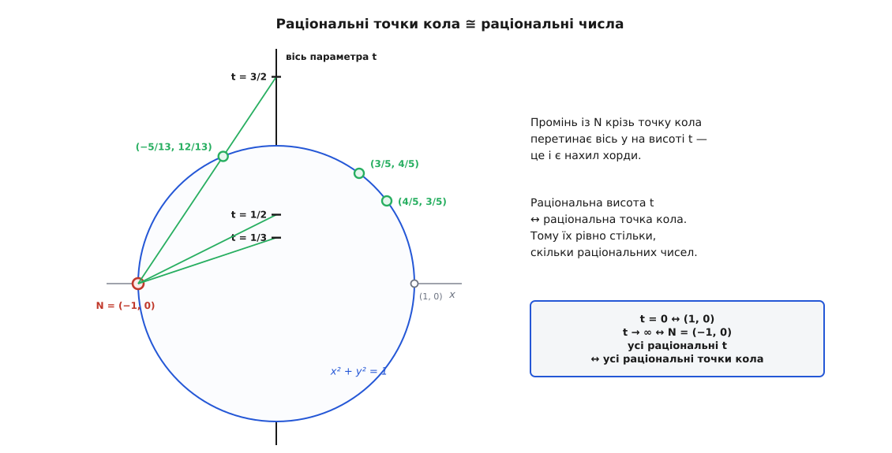
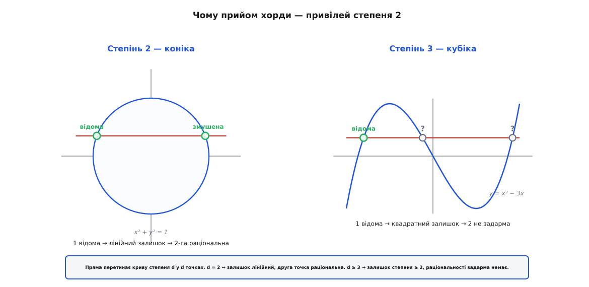

# 🎯 Метод хорди: як одна пряма ловить усі трійки

Поділивши рівність a² + b² = c² на c², цілу трійку читаємо як точку з раціональними координатами на колі — і тоді всі такі точки виловлює один-єдиний геометричний прийом: пряма, проведена крізь уже відому точку кола. Нижче цей вивід зроблено до останнього кроку — від рівняння прямої до формули Евкліда, — і показано, який закон стоїть за ним: коніка (крива другого степеня), у якої є бодай одна раціональна точка, має їх одразу нескінченно багато, і всі досяжні тим самим прочісуванням хордою.

## Трійка — це раціональна точка на колі

Поділімо рівність a² + b² = c² на c²:

```
(a/c)² + (b/c)² = 1
```

Пара (a/c, b/c) — точка [координатної площини](topic:math/coordinate-system) з обома [раціональними](topic:math/irrational-numbers) координатами, і лежить вона на **одиничному колі** x² + y² = 1. Навпаки, будь-яка точка кола з раціональними координатами, зведена до спільного знаменника, повертає цілу трійку. Отже задача про цілі трійки — це слово в слово задача про раціональні точки кола. Далі полюємо саме на них.

## Одна пряма — одна невідома

Закріпимо на колі одну раціональну точку, яку видно без жодних обчислень: N = (−1, 0). Проведімо крізь неї пряму з нахилом t:

```
y = t·(x + 1)
```

Чому цього досить, видно наперед, ще до підстановки. Пряма перетинає коло у **двох** точках. Одну ми вже тримаємо в руках — це N. Отже насправді невідома лишилась одна-єдина, а одна невідома підкоряється одному рівнянню. Знайдімо її. Підставмо y = t(x + 1) у рівняння кола x² + y² = 1:

```
x² + t²·(x + 1)² = 1
x² + t²x² + 2t²x + t² = 1
(1 + t²)·x² + 2t²·x + (t² − 1) = 0
```

Вийшло квадратне рівняння з коефіцієнтами A = 1 + t², B = 2t², C = t² − 1. Один його корінь ми знаємо заздалегідь — це x = −1, адже точка N лежить і на прямій, і на колі. Підставте й переконайтеся: (1 + t²) − 2t² + (t² − 1) = 0.

## Чому другий корінь неминуче раціональний

Тут криється вся сила прийому, тож не пробіжімо повз. Щоб дістати другий корінь, квадратна формула не потрібна — досить згадати, як корені пов'язані з коефіцієнтами. Рівняння з коренями x₁, x₂ розкладається на множники, і, розкривши дужки, порівняймо з вихідним:

```
A·x² + B·x + C = A·(x − x₁)·(x − x₂)   ⟹   x₁ + x₂ = −B/A ,   x₁·x₂ = C/A
```

Обидва праві боки — раціональні, бо A, B, C раціональні. А тепер ключ: **якщо один корінь раціональний, то й другий такий самий.** Справді, x₂ = −B/A − x₁ — різниця двох раціональних чисел, отже раціональне. Ось чому квадратне рівняння з раціональними коефіцієнтами, у якого один корінь раціональний, віддає раціональним і другий — задарма, без обчислення жодного кореня.

> 🔧 **Навіщо це.** Саме цей важіль перетворює одну відому раціональну точку на другу. Ірраціональні корені квадратного рівняння завжди ходять парою спряжених (як √2 і −√2) — поодинці раціональним жоден бути не може. Тому досить, щоб ОДИН корінь був раціональний, і другий змушений піти за ним. Уся здатність кола родити нові раціональні точки зі старих тримається на цьому одному факті.

Застосуймо до нашого рівняння — через добуток коренів, він компактніший. Маємо x₁·x₂ = C/A = (t² − 1)/(1 + t²), а що x₁ = −1, то

```
x₂ = (1 − t²)/(1 + t²)
```

Ординату дістаємо просто з рівняння прямої:

```
y₂ = t·(x₂ + 1) = t·[ (1 − t²)/(1 + t²) + 1 ] = t · 2/(1 + t²) = 2t/(1 + t²)
```

Отже пряма з раціональним нахилом t влучає у другу точку кола

```
( (1 − t²)/(1 + t²) ,  2t/(1 + t²) )
```

з обома раціональними координатами — саме як обіцяли.

## Підставляємо t = n/m — і випадає формула Евкліда

Раціональний нахил — це відношення двох цілих: t = n/m. Підставмо й зведімо кожен дріб до спільного знаменника m²:

```
x₂ = (1 − n²/m²)/(1 + n²/m²) = (m² − n²)/(m² + n²)
y₂ = 2·(n/m)/(1 + n²/m²)     = 2mn/(m² + n²)
```

Ліворуч у нас (a/c, b/c). Прирівнявши чисельник до чисельника й знаменник до знаменника, читаємо трійку прямо з координат:

```
a = m² − n²       b = 2mn       c = m² + n²
```

Це **формула Евкліда** — та сама, що її дає й суто арифметичний вивід через розклад b² = (c − a)(c + a). Але тут вона не вгадана й не витягнута з розкладу множників, а народжена геометрично: це координати другого перетину прямої з колом. Перевірмо на найвідомішій трійці. Нахил t = 1/2, тобто n = 1, m = 2:

```
x₂ = (4 − 1)/(4 + 1) = 3/5
y₂ = 2·1·2/(4 + 1)   = 4/5      →   точка (3/5, 4/5)   →   трійка (3, 4, 5)
```

У параметра t є ще й точний геометричний зміст. Позначмо кут точки на колі через θ, тобто x = cos θ, y = sin θ. Тоді

```
t = y/(x + 1) = sin θ/(1 + cos θ) = tan(θ/2)
```

— тангенс половинного кута. А що пряма y = t(x + 1) перетинає вісь y на висоті рівно t (при x = 0 виходить y = t), то **вісь y стає лінійкою параметра**: промінь із N крізь точку кола позначає на осі саме число t.


*Вісь y — лінійка параметра t. Промінь із N = (−1, 0) через точку кола позначає на ній число t, тобто нахил хорди. Кожній раціональній висоті відповідає рівно одна раціональна точка кола — тому їх рівно стільки ж, скільки раціональних чисел.*

Звідси видно й бієкцію. Візьміть будь-яку раціональну точку Q на колі, крім N. Пряма N–Q має раціональний нахил (обидва її кінці раціональні), тобто Q приходить із певного раціонального t. Отже, пробігаючи t усіма раціональними числами, ми зачіпаємо кожну раціональну точку кола рівно раз: значенню t = 0 відповідає (1, 0), а сама N досягається у краю t → ∞. Коротко: **раціональні точки кола — це те саме, що раціональні числа**, вишикувані вздовж прямої.

## Диво роду нуль

Придивімося, чого саме ми вимагали від кола, — і побачимо, що майже нічого. Ми провели пряму, підставили в рівняння кривої, дістали **квадратне** рівняння й зняли з нього другий корінь через співвідношення коренів. Жодна окрема риса саме кола сюди не ввійшла, крім однієї: воно задане рівнянням **другого степеня**. Тому все сказане слово в слово переноситься на будь-яку коніку — еліпс, гіперболу, параболу, будь-яку криву виду A·x² + B·xy + C·y² + D·x + E·y + F = 0 з раціональними коефіцієнтами.

Звідси загальний закон:

> **Коніка, що має хоч одну раціональну точку, має їх одразу нескінченно багато — і всі вони прочісуються прямими з цієї однієї точки.**

Причину можна стиснути до арифметики степенів. Пряма перетинає криву степеня d у d точках; підставивши пряму в рівняння кривої, дістаємо рівняння степеня d в одній невідомій. Зняли одну відому раціональну точку — лишилось рівняння степеня d − 1. Для коніки d = 2, залишок — степеня 1, лінійний, а лінійне рівняння з раціональними коефіцієнтами завжди має раціональний корінь. Ось чому одна точка тягне за собою всі інші.


*Пряма перетинає криву степеня d у d точках. На коніці (d = 2) одна відома раціональна точка лишає лінійний залишок — друга змушена бути раціональною. На кубіці (d = 3) лишаються дві точки, тобто квадратний залишок, — раціональності задарма вже немає. Тут і вмирає прийом хорди.*

Задача про трійки Піфагора розв'язується до кінця саме тому, що коло — коніка.

## Чому вище цей прийом гине

Підніміть степінь — і подивіться, де ламається важіль. [Велика теорема Ферма](topic:math/fermats-last-theorem) питає про цілі розв'язки рівняння aⁿ + bⁿ = cⁿ при n ≥ 3. Поділивши на cⁿ, дістаємо те саме перетворення: (a/c)ⁿ + (b/c)ⁿ = 1, тобто раціональні точки на кривій Ферма xⁿ + yⁿ = 1 — уже степеня n.

Проженімо крізь неї той самий прийом. Пряма з відомої раціональної точки, підставлена в рівняння степеня n, дає рівняння степеня n в одній невідомій. Знімаємо один відомий корінь — лишається степінь **n − 1**. Для n = 2 залишок був лінійний і віддавав корінь задарма. Уже для n = 3 залишок квадратний, для n = 4 кубічний, а такі рівняння раціонального кореня самі собою не мають. Прийом більше нічого не породжує: хорда з однієї точки не витягує другої раціональної. Двигун, що дарував нам усі трійки, глухне рівно там, де залишок перестає бути лінійним.

За цією межею стоїть глибша величина — **рід** кривої, міра її складності. Коніки мають рід нуль; це і є ті криві, що параметризуються раціонально, як щойно параметризувалося коло, — з нескінченним урожаєм раціональних точок. Крива Ферма степеня n має рід (n − 1)(n − 2)/2: для n = 2 це нуль (наше коло), для n = 3 — одиниця (окремий світ [діофантової геометрії](topic:math/linear-diophantine) — еліптичні криві), а для n ≥ 4 — уже щонайменше три. І тут спрацьовує теорема Ґерда Фалтінґса (німецький математик, 1983, за неї — Філдсова медаль): крива роду ≥ 2 має лише **скінченну** кількість раціональних точок — цілковита протилежність нескінченному розсипу на колі. А що для рівняння Ферма ця скінченна кількість дорівнює нулю (окрім тривіального розв'язку) — це вже сама Велика теорема, доведена Ендрю Вайлзом 1994 року.

Ось де замикається думка. Сам прийом, що однією хордою вимітає всі до одної трійки Піфагора, — це привілей роду нуль. Його зникнення на кривих вищого степеня і є, по суті, причина, чому теорема Ферма встояла три з половиною століття.
