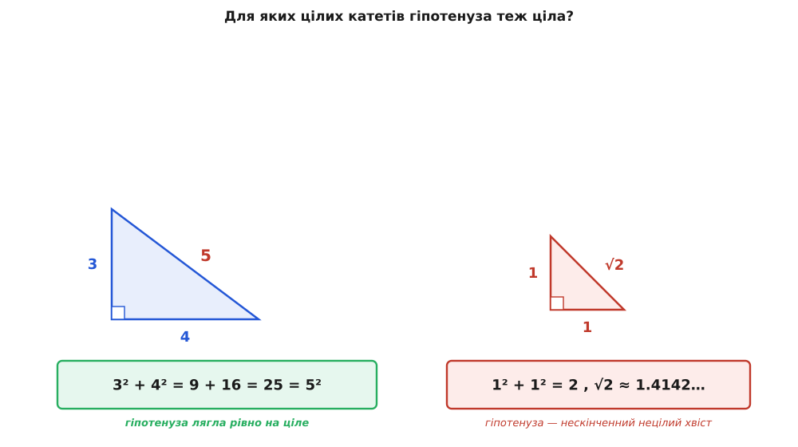
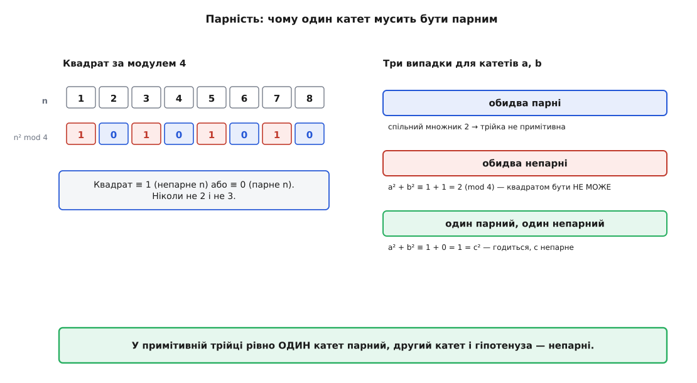
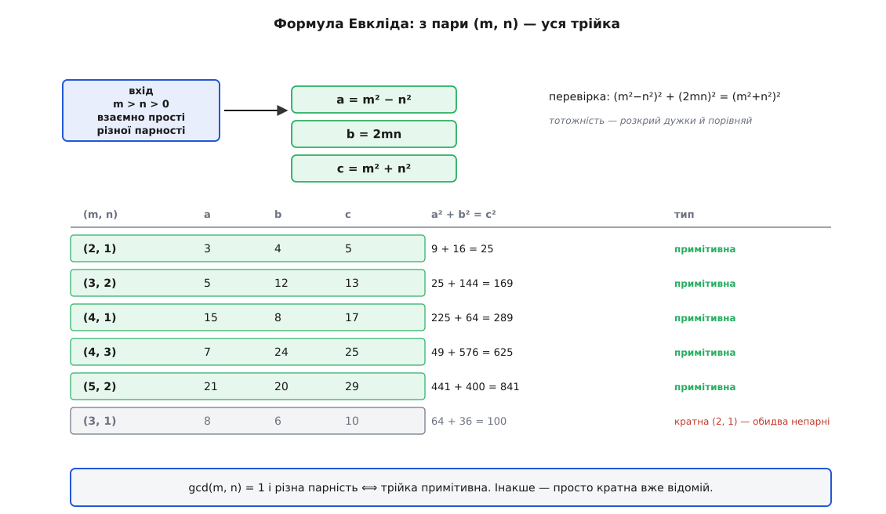
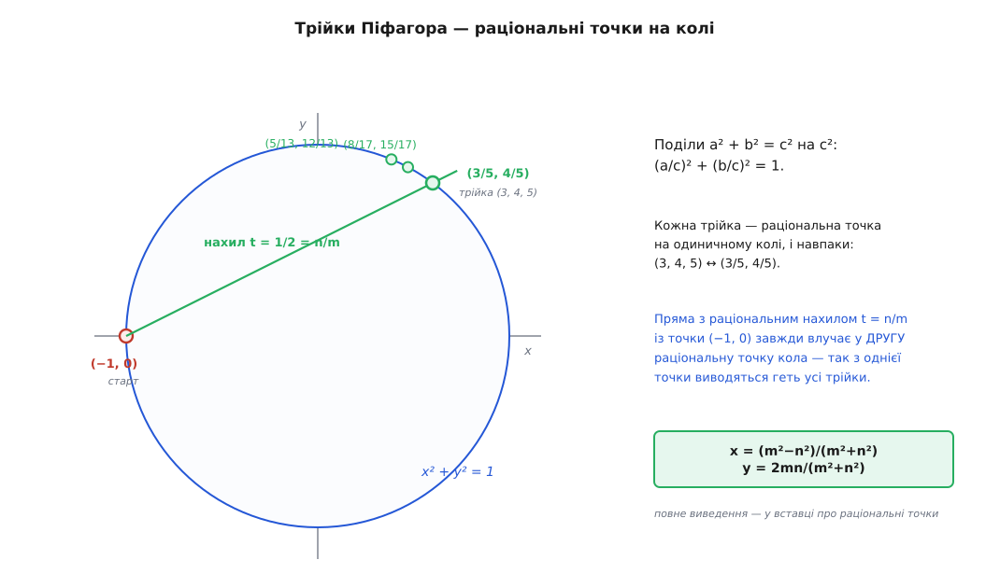

# Трійки Піфагора

<preknowlist>
- [Теорема Піфагора](book:math/pythagorean-theorem) — у прямокутному трикутнику сума квадратів катетів дорівнює квадрату гіпотенузи: a² + b² = c².
- [НСД і взаємна простота](book:math/gcd-euclidean) — коли в кількох чисел немає спільного дільника, більшого за 1.
- [Основна теорема арифметики](book:math/fundamental-theorem-arithmetic) — кожне ціле число єдиним способом розкладається в добуток простих множників.
- [Модульна арифметика](book:math/modular-arithmetic) — залишок від ділення й запис `a mod m`; на ньому тримаються всі міркування про парність нижче.
</preknowlist>

Накресліть прямокутний трикутник із катетами (гр. *káthetos* — опущений прямовисно) 1 і 1. Гіпотенуза (гр. *hypoteínousa* — натягнута під прямим кутом) — √2, число, десятковий хвіст якого тягнеться без кінця й без повтору: 1.41421356… Візьміть катети 2 і 3 — гіпотенуза √13, знову нескінченний нецілий хвіст. Якщо катети взяти навмання, гіпотенуза [майже завжди виходить ірраціональною](book:math/irrational-numbers): [теорема Піфагора](book:math/pythagorean-theorem) дає c = √(a² + b²), а квадратний корінь із цілого рідко буває цілим.

І тим дивніше, коли він таки буває цілим. Катети 3 і 4 — гіпотенуза рівно 5. Катети 5 і 12 — рівно 13. Катети 8 і 15 — рівно 17. Тут корінь лягає точно на ціле число, наче катети підібрані зумисне.


*Гіпотенуза прямокутного трикутника майже завжди ірраціональна. Трійка Піфагора — рідкісний випадок, коли вона теж лягає рівно на ціле число.*

**Трійка Піфагора** (за іменем Піфагора Самоського, ~570–495 до н. е.) — це і є така рідкісна вдача: три цілих додатних числа a, b, c, для яких a² + b² = c². Питання коротке й пряме: які вони бувають — **усі** — і за яким законом? Чи це розсипані щасливі збіги, чи за ними стоїть точна формула, що вимітає їх усі до одного, не пропускаючи жодної й не вигадуючи зайвої.

Виявиться — стоїть формула. І щоб її здобути, спершу приберемо з очей усе зайве.

### Спершу — прибрати повтори

Погляньте: якщо (3, 4, 5) — трійка, то й (6, 8, 10) трійка, бо 6² + 8² = 36 + 64 = 100 = 10². І (9, 12, 15), і (30, 40, 50). Причина проста: помножте рівність a² + b² = c² на k² — дістанете (ka)² + (kb)² = (kc)². Кожну трійку можна роздути в ціле число разів, і вийде знову трійка.

Але геометрично всі ці трикутники — один і той самий: 3-4-5, збільшений удвічі, утричі, у k разів. Форма та сама, змінився лише масштаб. Тож нескінченну низку (3, 4, 5), (6, 8, 10), (9, 12, 15)… розумно згорнути в одного представника — найменшого, з якого решта виходять простим множенням.

Такого представника називають **примітивною** трійкою (лат. *primitivus* — первісний): трійка, у якої a, b, c не мають спільного дільника, [більшого за 1](book:math/gcd-euclidean). У (6, 8, 10) спільний дільник 2, тож це не окрема трійка, а подвоєна (3, 4, 5). А сама (3, 4, 5) вже ні на що не скорочується — вона первісна.

Звідси перший факт, що зводить нескінченну задачу до осяжної: **кожна трійка Піфагора — це примітивна трійка, помножена на ціле число, і то єдиним способом.** Поділіть a, b, c на їхній найбільший спільний дільник d — дістанете примітивну трійку (a/d, b/d, c/d), а вихідна трійка є її d-кратним. Отже досить зрозуміти примітивні: усі інші — їхні тіні, роздуті в 2, 3, 4… рази. Далі говоримо тільки про них.

> 🔧 **Навіщо це.** Мотузка з дванадцятьма рівними проміжками, складена трикутником зі сторонами 3-4-5, дає гарантовано прямий кут — без транспортира й таблиць. Так розмічали фундаменти й межі полів тисячоліттями, і так само зручно перевіряти прямий кут на будмайданчику сьогодні. А ще цілі трійки — безцінні тести для геометричного коду: (3, 4, 5) чи (5, 12, 13) дають точну рівність без похибки [чисел із рухомою комою](book:programming/floating-point), тож на них одразу видно ваду в алгоритмі, яку наближений √ сховав би.

### Парність: перший слід структури

Перш ніж шукати формулу наосліп, придивімося до примітивних трійок зблизька — чи не проступить у них якийсь порядок. Найгрубіша ознака числа — парне воно чи непарне. Спитаймо: якими за парністю бувають a, b, c у примітивній трійці?

Обидва катети парними бути не можуть. Якби a і b ділилися на 2, то й c² = a² + b² було б парне, а отже парне й c — і всі троє мали б спільний дільник 2. Це вже не примітивна трійка.

А чи можуть обидва катети бути непарними? Ось де вмикається несподівано сильний важіль — погляд на числа [за модулем 4](book:math/modular-arithmetic). Подивімося, які залишки дають квадрати. Парне число 2k у квадраті дає 4k² — залишок 0. Непарне 2k+1 у квадраті дає 4k² + 4k + 1 = 4k(k+1) + 1 — залишок 1. Інших варіантів немає:

```
квадрат парного числа   ≡ 0  (mod 4)
квадрат непарного числа ≡ 1  (mod 4)
```

Тобто **будь-який квадрат за модулем 4 дорівнює 0 або 1 — ніколи 2 і ніколи 3.** Тепер припустимо, що a і b обидва непарні. Тоді a² + b² ≡ 1 + 1 = 2 (mod 4). Але ця сума мусить дорівнювати c², а квадрат такого залишку дати не може. Суперечність — обидва катети непарними бути не можуть.

Лишається єдина можливість: **один катет парний, другий непарний.** А гіпотенуза? c² = (парне)² + (непарне)² ≡ 0 + 1 = 1 (mod 4), отже c непарне. Ось перший твердий шматок структури, здобутий самою лише парністю.


*Квадрат за модулем 4 — завжди 0 або 1. Через це «непарний + непарний» дає 2, а таким квадрат не буває. У примітивній трійці один катет парний, другий катет і гіпотенуза — непарні.*

### Формула, що виловлює всі трійки

Тепер здобудемо формулу — не вгадаємо, а виведемо, щоб бачити, чому вона неминуча. Нехай **b** — парний катет, а a і c непарні (щойно з'ясували, що так і мусить бути). Ключовий крок — перенести a² на другий бік і розкласти на множники:

```
b² = c² − a² = (c − a)(c + a)
```

Оскільки a і c обидва непарні, їхня різниця c − a і сума c + a — обидві парні. Запишімо c − a = 2u і c + a = 2v, де u і v — цілі додатні (v > u, бо c > a). Підставмо:

```
b² = (2u)(2v) = 4uv     ⟹     (b/2)² = uv
```

Ліворуч точний квадрат (b парне, тож b/2 ціле). Отже **добуток uv — точний квадрат.** І тут спрацьовує друга, вирішальна властивість: u і v **не мають спільних дільників.** Справді, будь-який спільний дільник u і v ділить і їхню різницю v − u = a, і їхню суму v + u = c. А в примітивній трійці a і c взаємно прості (спільний простий дільник a і c поділив би й b² = c² − a², а отже й b — і всі троє мали б спільний множник). Виходить, спільний дільник u і v ділить одиницю, тобто gcd(u, v) = 1.

Зберімо докупи: **uv — точний квадрат, а u і v взаємно прості.** Звідси випливає, що кожне з них **само по собі точний квадрат.** Ось чому: розкладіть u і v на прості множники. У добутку uv кожен простий стоїть у парному степені — бо весь добуток є квадратом. Оскільки u і v не мають спільних простих, увесь степінь кожного простого сидить цілком або в u, або в v — і він парний. Отже і в u, і в v усі прості стоять у парних степенях, а число з усіма парними степенями простих — [точний квадрат](book:math/fundamental-theorem-arithmetic). Позначмо u = n², v = m², де m > n > 0.

Лишилося зібрати a, b, c назад:

```
c = v + u = m² + n²
a = v − u = m² − n²
b² = 4uv = 4m²n²   ⟹   b = 2mn
```

Це **формула Евкліда**. Кожну примітивну трійку породжує пара цілих (m, n):

```
a = m² − n²      b = 2mn      c = m² + n²
```

Ми не постулювали цю формулу — вона випала сама з розкладу b² = (c − a)(c + a). А що вивід ішов від будь-якої примітивної трійки, то формула ловить **усі** їх без винятку: для кожної знайдеться своя пара (m, n).

Не всяка пара годиться. Щоб трійка вийшла саме примітивна, потрібні дві умови. По-перше, m і n **взаємно прості** — інакше їхній спільний множник пройшов би в усі три числа. По-друге, m і n **різної парності** (одне парне, одне непарне) — бо c = m² + n² мусить бути непарним, а сума двох квадратів непарна лише тоді, коли доданки різної парності. За цих двох умов пара (m, n) і примітивна трійка відповідають одна одній взаємно однозначно: різні пари дають різні трійки, і кожна трійка приходить рівно з однієї пари.


*Пара (m, n) з m > n перетворюється на цілу трійку. Взаємно прості числа різної парності дають примітивну трійку; пара з двох непарних (як 3 і 1) дає лише кратну вже відомій.*

Погляньмо, як це працює в обидва боки. **Розкладімо (5, 12, 13) назад у пару (m, n).**

```
парний катет b = 12,   a = 5,   c = 13
c − a = 13 − 5 =  8   ⟹   u = 4 = 2²   ⟹   n = 2
c + a = 13 + 5 = 18   ⟹   v = 9 = 3²   ⟹   m = 3
перевірка uv = 4 · 9 = 36 = 6² = (12/2)²   ✓
```

Пара (m, n) = (3, 2): вони взаємно прості й різної парності — усе сходиться. А тепер **у другий бік — зберімо трійку з пари (m, n) = (7, 4).** Числа 7 і 4 взаємно прості й різної парності, тож трійка має вийти примітивна:

```
a = 7² − 4² = 49 − 16 = 33
b = 2 · 7 · 4        = 56
c = 7² + 4² = 49 + 16 = 65
перевірка:  33² + 56² = 1089 + 3136 = 4225 = 65²   ✓
```

Одна формула, дві цілі змінні — і ось перед нами вся нескінченна родина примітивних трійок, кожна на своєму місці. Щоб побачити її в дії — як перелічити всі трійки до заданої межі або як кожна примітивна виростає з (3, 4, 5) трійкою цілочислових матриць (дерево Барнінґа–Голла) — є [окремий розбір із робочим кодом](book:math/pythagorean-triples/proj-generate-triples.md).

### Чому формула працює — коло й раціональні точки

Вивід через розклад b² = (c − a)(c + a) бездоганний, але він арифметичний: тягнеш множники, і формула випадає. Лишається відчуття фокуса. За ним ховається геометрична картина, від якої все стає прозорим.

Поділімо рівність a² + b² = c² на c²:

```
(a/c)² + (b/c)² = 1
```

Точка з координатами (a/c, b/c) лежить на **одиничному колі** x² + y² = 1 — і обидві її координати раціональні. І навпаки: будь-яка точка кола з раціональними координатами, зведена до спільного знаменника, дає трійку Піфагора. Отже примітивні трійки — це те саме, що **раціональні точки на одиничному колі.** Задача про цілі трійки обернулася на задачу про раціональні точки на кривій.

А раціональні точки кола можна виловити всі одним прийомом. Закріпимо одну очевидну точку — (−1, 0). Проведімо крізь неї пряму з раціональним нахилом t. Пряма перетне коло ще в одній точці — і та друга точка неминуче теж раціональна. Причина суто алгебраїчна: перетин прямої й кола дає квадратне рівняння з раціональними коефіцієнтами, і якщо один його корінь (точка (−1, 0)) раціональний, то й другий мусить бути раціональним. Пробігаючи нахилом t усі раціональні числа, ми пробігаємо другою точкою всі раціональні точки кола — а отже й усі трійки.


*Кожна трійка (a, b, c) — це раціональна точка (a/c, b/c) на одиничному колі. Пряма з раціональним нахилом t = n/m із точки (−1, 0) завжди влучає у другу раціональну точку — так з однієї точки виводяться геть усі трійки.*

Якщо довести цю думку до кінця й розписати координати другої точки через нахил t = n/m, вийде x = (m² − n²)/(m² + n²), y = 2mn/(m² + n²) — та сама формула Евкліда, тільки народжена геометрично, а не арифметично. [Повне виведення — від рівняння прямої до трійки — розписане окремо](book:math/pythagorean-triples/math-rational-points.md); там же й глибша думка, заради якої все це варте уваги: **крива другого степеня з однією раціональною точкою має їх одразу нескінченно багато**, і всі досяжні цим прочісуванням хордою. Саме тому задача про трійки розв'язується повністю й до кінця.

### Порядок, що випадає сам собою

Коли формула в руках, у трійках проступає порядок, якого ніхто не закладав. Візьмімо подільність.

**Один із катетів завжди ділиться на 3.** Погляньмо на квадрати за модулем 3: вони дають лише 0 або 1 (бо 0²≡0, 1²≡1, 2²≡1). Якби ні a, ні b не ділилися на 3, було б a² + b² ≡ 1 + 1 = 2 (mod 3) — а квадрат c² такого залишку не дає. Отже 3 ділить a або b.

**Парний катет завжди ділиться на 4.** Він дорівнює 2mn, а серед m і n одне парне (вони ж різної парності), тож mn парне, і b = 2mn кратне 4.

**Одна зі сторін завжди ділиться на 5.** Квадрати за модулем 5 бувають 0, 1 або 4. Перебравши суми, побачимо: рівність a² + b² ≡ c² (mod 5) можлива тільки тоді, коли принаймні одне з трьох чисел кратне 5.

Складімо три спостереження. Множник abc завжди має в собі 3 (від одного з катетів), 4 (від парного катета) і 5 (від однієї зі сторін), а отже **добуток abc ділиться на 3 · 4 · 5 = 60** — у кожній без винятку трійці Піфагора. Перевірмо на найпростішій:

```
(3, 4, 5):   a · b · c = 3 · 4 · 5 = 60   →   60 / 60 = 1     ✓
(5, 12, 13): a · b · c = 5 · 12 · 13 = 780 →  780 / 60 = 13    ✓
```

І ще дві дрібнички, які приємно помітити. Гіпотенуза завжди дає **c ≡ 1 (mod 4)** — бо c = (парне)² + (непарне)² ≡ 0 + 1. А площа прямокутного трикутника, ab/2 = mn(m − n)(m + n), завжди **ділиться на 6** (парність дає множник 2, а серед m, n, m−n, m+n неодмінно знайдеться кратне 3). Жодну з цих властивостей ми не вимагали — усі вони посипалися з формули, наче з рогу достатку.

### Які числа стають сторонами

Формула c = m² + n² каже дещо й про самі гіпотенузи: **гіпотенуза примітивної трійки — це сума двох квадратів.** Не кожне число такою сумою є. Тут відкривається окрема глибока тема: непарне число є гіпотенузою примітивної трійки тоді й лише тоді, коли всі його прості дільники дають остачу 1 при діленні на 4 — це вже [теорема Ферма про суму двох квадратів](book:math/sum-of-two-squares). Тому гіпотенузами бувають 5 (= 1²+2²), 13 (= 2²+3²), 17 (= 1²+4²), 29 (= 2²+5²), а от 15 = 3·5 — ні, бо його простий дільник 3 дає остачу 3.

З катетами простіше: **будь-яке ціле число, більше за 2, є катетом якоїсь трійки.** Для непарного k > 1 підійде трійка (k, (k²−1)/2, (k²+1)/2) — скажімо, 7 дає (7, 24, 25). Для парного k беруть відповідну пару (m, n). Так кожне число знаходить собі місце в якомусь прямокутному трикутнику з цілими сторонами.

### Рідня згори: рівняння Ферма

Рівняння a² + b² = c² — це **діофантове рівняння** (за іменем Діофанта Александрійського, ~III ст.): многочленне рівняння, у якому шукають саме цілі розв'язки. Про [діофантові рівняння загалом](book:math/linear-diophantine) відомо, що одні мають нескінченно багато розв'язків, інші жодного, і межу між ними провести буває напрочуд важко. Піфагорове рівняння — з багатих: розв'язків у нього нескінченно, і ми щойно виписали їх усі.

І саме на його тлі стоїть найзнаменитіше питання теорії чисел. Що буде, якщо степінь підняти? Чи має цілі додатні розв'язки рівняння aⁿ + bⁿ = cⁿ при n ≥ 3? П'єр Ферма на берегах книжки Діофанта записав, що не має — і що доведення в нього є, тільки поля замалі. [Велику теорему Ферма](book:math/fermats-last-theorem) доведуть аж 1994 року, і доведення забере зусиль цілих поколінь. Контраст із трійками тут не випадковий, а сутнісний: показник 2 піддається тому, що коло — крива другого степеня, а її раціональні точки прочісуються хордою одним махом. Для n ≥ 3 крива вже вищого роду, такого прочісування немає — і саме зникнення того прийому, який дарує нам усі трійки Піфагора, і становить усю неприступність теореми Ферма.

### Старші за своє ім'я

Наостанок — про саму назву. Трійки звуть піфагоровими, але вони набагато старші за Піфагора. Вавилонські писарі виклали їх стовпчиком на глиняній табличці, відомій як Плімптон 322, приблизно за 1800 років до н. е. — за тисячу років до грецького математика. Серед записаних там трійок є такі, де числа сягають п'ятизначних, — їх не намацаєш перебором, тож за табличкою стоїть якийсь систематичний спосіб їх будувати. [Хто і як знав ці трійки до Піфагора — вавилоняни, індійські автори «Сульба-сутр», китайський трактат «Джоубі», єгипетські «натягувачі мотузки» — і чому ім'я зрештою дісталося саме йому](book:math/pythagorean-triples/hist-plimpton.md), — окрема історія, у якій імена й заслуги розходяться, як то часто буває у стародавній математиці.

Трійка Піфагора стоїть на перехресті трьох мов. Мовою геометрії це прямокутний трикутник із цілими сторонами. Мовою арифметики — цілий розклад b² = (c − a)(c + a) на два взаємно прості квадрати. Мовою кривих — раціональна точка на колі. Це той самий об'єкт, побачений із трьох боків, а формула Евкліда a = m² − n², b = 2mn, c = m² + n² — словник, що перекладає між ними без утрат.
