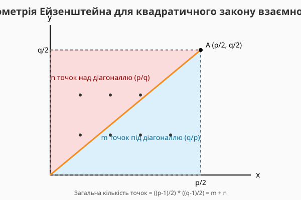

<preknowlist>
- Що таке прості числа та їхні властивості.
- Поняття остачі від ділення (модульна арифметика) та символ "≡".
- Що таке квадрат числа.
</preknowlist>

# Квадратичний закон взаємності: Таємний зв'язок простих чисел

Коли ми починаємо вивчати математику, числа здаються нам окремими, незалежними сутностями. Число 5 — це просто 5, а число 13 — це 13. Вони існують у своєму власному абстрактному світі. Але чим глибше ми занурюємося в теорію чисел, тим більше починаємо помічати, що між ними існують приховані, майже магічні зв'язки. 

Уявіть, що прості числа — це люди на вечірці. На перший погляд, здається, що їхня взаємодія випадкова. Але якщо спостерігати досить довго, можна виявити складну мережу симпатій та антипатій. Квадратичний закон взаємності — це одне з найвизначніших відкриттів у математиці, яке описує саме такі взаємини між простими числами. Карл Фрідріх Гаусс, один із найвидатніших математиків в історії, називав його "золотою теоремою" (Theorema Aureum).

Давайте розберемося, про що цей закон і чому він такий важливий, крок за кроком, використовуючи метод міркувань і простих аналогій. Нам не знадобляться складні формули, лише розуміння залишків та квадратів чисел.

> 🔧 **Навіщо це:** Квадратичний закон взаємності є фундаментальним каменем сучасної криптографії та теорії чисел. Він дозволяє створювати ефективні алгоритми для перевірки чисел на простоту, що критично важливо для безпеки наших даних в інтернеті. Більше того, цей закон відкрив двері до створення абстрактної алгебри та розширення нашого розуміння того, чим взагалі є числа.

## Світ залишків та квадратів

Щоб зрозуміти закон взаємності, нам потрібно спочатку розібратися з тим, що таке "квадратичний лишок". Давайте згадаємо годинник. На звичайному годиннику 12 годин. Якщо зараз 10 годин, і ми додамо 4 години, ми не скажемо "14 годин" у звичайній розмові, ми скажемо "2 години". Ми рахуємо по колу, "по модулю 12".

В арифметиці по модулю простого числа p, ми робимо те саме, але наш "годинник" має p годин (від 0 до p-1).
Тепер давайте візьмемо всі числа на нашому годиннику, піднесемо їх до квадрата (помножимо самі на себе) і подивимося, які залишки ми отримаємо при діленні на p.

Наприклад, нехай наше просте число p = 7. 
Числа на годиннику: 0, 1, 2, 3, 4, 5, 6.
Їхні квадрати:
0² = 0 (остача 0 при діленні на 7)
1² = 1 (остача 1)
2² = 4 (остача 4)
3² = 9. 9 ділиться на 7 з остачею 2 (бо 9 = 7 * 1 + 2).
4² = 16. 16 ділиться на 7 з остачею 2 (бо 16 = 7 * 2 + 2).
5² = 25. 25 ділиться на 7 з остачею 4 (бо 25 = 7 * 3 + 4).
6² = 36. 36 ділиться на 7 з остачею 1 (бо 36 = 7 * 5 + 1).

Подивіться на остачі, які ми отримали: 1, 2, 4. (0 ми зазвичай ігноруємо). 
Числа 1, 2 і 4 називаються **квадратичними лишками** по модулю 7. Це означає, що рівняння x² ≡ a (mod 7) має розв'язок, якщо a дорівнює 1, 2 або 4. 
А як щодо чисел 3, 5 і 6? Ми їх не отримали. Жодне число в квадраті не дає остачу 3, 5 або 6 при діленні на 7. Вони називаються **квадратичними нелишками** по модулю 7.

## Знайомство з символом Лежандра

Математики люблять коротку і зручну нотацію. Замість того, щоб щоразу писати "число 'a' є квадратичним лишком по модулю простого числа 'p'", Адрієн-Марі Лежандр придумав зручний символ. Він записується як дріб у дужках: (a / p), хоча це зовсім не дріб у звичному розумінні. Цей символ має лише три можливі значення:

1.  **(a / p) = 1**, якщо 'a' є квадратичним лишком по модулю 'p' (тобто, якщо ми можемо знайти корінь квадратний з 'a' у світі залишків p).
2.  **(a / p) = -1**, якщо 'a' є квадратичним нелишком по модулю 'p'.
3.  **(a / p) = 0**, якщо 'a' ділиться на 'p' без остачі (тобто a ≡ 0 (mod p)).

Отже, з нашого попереднього прикладу для p = 7 ми можемо записати:
(1 / 7) = 1
(2 / 7) = 1
(3 / 7) = -1
(4 / 7) = 1
(5 / 7) = -1
(6 / 7) = -1

Символ Лежандра працює як детектор квадратів. Ви задаєте йому питання: "Гей, число 7, чи подобається тобі число 2 як квадрат?". І символ відповідає "1" (так) або "-1" (ні). 

## Проблема обчислення

Поки ми працюємо з маленькими простими числами, як 7 або 11, знайти квадратичні лишки легко. Ми можемо просто звести всі числа до квадрата і подивитися на остачі. Але що, якщо p — це велике просте число, наприклад, 1000003? Щоб перевірити, чи є, скажімо, 5 квадратичним лишком по модулю 1000003, нам довелося б звести до квадрата півмільйона чисел! Це займає забагато часу.

Нам потрібен якийсь хитрий спосіб дізнатися значення символу Лежандра (a / p) без того, щоб перевіряти всі можливі варіанти. Саме тут на допомогу приходить квадратичний закон взаємності. Він дає нам інструмент, який робить ці обчислення блискавичними.

## Золота теорема: взаємозв'язок простих чисел

Уявіть собі два різні непарні прості числа, назвемо їх p та q. 
Ми можемо задати два питання:
1. Чи є 'p' квадратичним лишком по модулю 'q'? Іншими словами, чому дорівнює символ Лежандра (p / q)?
2. Чи є 'q' квадратичним лишком по модулю 'p'? Іншими словами, чому дорівнює символ Лежандра (q / p)?

На перший погляд, ці питання здаються абсолютно незалежними. Чому те, що відбувається у світі залишків числа 'q', має бути пов'язано з тим, що відбувається у світі залишків числа 'p'? Це як питати, чи впливає погода в Києві на те, що хтось обере на сніданок в Токіо.

Але Леонард Ейлер, обчислюючи сотні таких символів вручну, помітив неймовірну річ: ці два питання міцно пов'язані! Квадратичний закон взаємності точно описує цей зв'язок.

Ось як звучить цей закон. Візьмемо два різних непарних простих числа p та q.
**У більшості випадків символ Лежандра (p / q) дорівнює символу Лежандра (q / p).**
Це означає, що вони погоджуються. Якщо p — це лишок по модулю q, то і q — це лишок по модулю p. Якщо p не є лишком по модулю q, то і q не є лишком по модулю p. Взаємна симпатія або взаємна антипатія.

Але є один виняток, одне правило, яке змінює цю симетрію.
**Якщо ОБИДВА прості числа, і p, і q, дають остачу 3 при діленні на 4, то символи Лежандра є протилежними.**
Тобто (p / q) = - (q / p). Якщо одне число каже "так", інше каже "ні".

Це можна сформулювати інакше, дивлячись на властивості чисел по модулю 4. Кожне непарне просте число при діленні на 4 дає остачу або 1, або 3. (Остачі 0 та 2 неможливі, бо тоді число було б парним, а єдине парне просте число — це 2, яке ми тут не розглядаємо).

Отже, закон працює так:
*   Якщо принаймні одне з простих чисел p або q має вигляд (4k + 1) — тобто дає остачу 1 при діленні на 4 — тоді (p / q) = (q / p). Вони збігаються.
*   Якщо обидва прості числа p та q мають вигляд (4k + 3) — тобто дають остачу 3 при діленні на 4 — тоді (p / q) = - (q / p). Вони протилежні.

Це все! Звучить просто, але цей закон — справжня магія, яка дозволяє нам зазирнути всередину чисел.

## Як це працює на практиці: гра в перевертання

Давайте подивимося, як цей закон робить складні обчислення простими. Припустимо, ми хочемо дізнатися, чи є число 29 квадратичним лишком по модулю 53. Обидва числа — прості. Нам потрібно обчислити (29 / 53).

Замість того, щоб підносити до квадрата 26 чисел по модулю 53, ми застосовуємо закон взаємності.
Дивимося на наші числа: p = 29, q = 53.
Яку остачу вони дають при діленні на 4?
29 = 4 * 7 + 1 (остача 1)
53 = 4 * 13 + 1 (остача 1)

Оскільки принаймні одне з них (насправді обидва) має вигляд 4k + 1, ми можемо перевернути символ Лежандра без зміни знаку:
(29 / 53) = (53 / 29)

Тепер нам потрібно знайти (53 / 29). Це виглядає не дуже краще, але тут ми можемо застосувати базову властивість модульної арифметики. У світі модуля 29 число 53 — це те саме, що і його остача при діленні на 29.
53 = 29 * 1 + 24.
Отже, у світі залишків 29, число 53 — це те саме, що 24.
Тому (53 / 29) = (24 / 29).

Що робити з (24 / 29)? Число 24 не просте. Але символ Лежандра має властивість розпадатися на множники, подібно до звичайного множення. 
Ми можемо розкласти 24 на множники: 24 = 2 * 2 * 2 * 3 = 2³ * 3.
За правилами роботи з символом Лежандра, ми можемо розбити це на (2 / 29) * (2 / 29) * (2 / 29) * (3 / 29) або (8 / 29) * (3 / 29) або просто відкинути квадрати: 24 = 4 * 6 = 2² * 6. (24 / 29) = (4 / 29) * (6 / 29) = 1 * (6 / 29) = (6 / 29) = (2 / 29) * (3 / 29).

Тепер нам треба знайти (2 / 29) і (3 / 29).

Для числа 2 існує окреме просте правило, яке Гаусс довів як "доповнення" до основного закону. 
(2 / p) = 1, якщо p дає остачу 1 або 7 при діленні на 8.
(2 / p) = -1, якщо p дає остачу 3 або 5 при діленні на 8.
Наше p = 29. При діленні на 8 маємо: 29 = 8 * 3 + 5. Остача 5. 
Отже, (2 / 29) = -1.

Залишилося (3 / 29). Тут ми знову можемо застосувати квадратичний закон взаємності!
p = 3, q = 29.
3 при діленні на 4 дає остачу 3 (бо 3 = 4 * 0 + 3).
29 при діленні на 4 дає остачу 1.
Оскільки принаймні одне число (29) має вигляд 4k + 1, знак не змінюється:
(3 / 29) = (29 / 3)

Знову зменшуємо верхнє число по модулю нижнього:
29 ділимо на 3, отримуємо остачу 2 (29 = 3 * 9 + 2).
Отже, (29 / 3) = (2 / 3).

Для модуля 3 ми можемо просто подивитися на квадрати: 1² = 1, 2² = 4 ≡ 1 (mod 3). Остачі 2 немає серед квадратів. Отже, 2 є квадратичним нелишком по модулю 3.
Тому (2 / 3) = -1.

Тепер збираємо все разом:
(29 / 53) = (53 / 29) = (24 / 29) = (2 / 29) * (3 / 29) = (-1) * (-1) = 1.

Результат — 1! Це означає, що число 29 Є квадратичним лишком по модулю 53. Існує таке число x, що x² ≡ 29 (mod 53). (Такий корінь існує). Завдяки закону взаємності ми змогли відповісти на питання, не розв'язуючи самого рівняння. Ми звели велику задачу до серії дуже дрібних і простих кроків, подібно до того, як алгоритм Евкліда знаходить найбільший спільний дільник.

## Чому це працює? Геометричний погляд

Довести квадратичний закон взаємності суто алгебраїчно виявилося настільки складно, що Ейлер і Лежандр не змогли цього зробити до кінця. Гаусс знайшов перше доведення, але воно було довгим і громіздким.

Згодом математик Фердинанд Ейзенштейн запропонував чудове геометричне пояснення (про яке ви можете прочитати у відповідній вставці). Він показав, що цей закон можна уявити візуально. Уявіть прямокутник на сітці координат, де сторони дорівнюють половинам наших простих чисел p та q. Закон взаємності випливає з підрахунку цілих точок, що лежать всередині цього прямокутника. Діагональ прямокутника розбиває ці точки на дві групи. Підрахунок точок під діагоналлю відповідає символу (q / p), а над діагоналлю — символу (p / q). Те, як ці точки сумуються, і дає нам правило про зміну знаку залежно від остач при діленні на 4.

Це показує, що властивості простих чисел, які здаються суто арифметичними, мають глибоку геометричну структуру. Числа не просто існують у вакуумі; вони розташовані у просторі за певними суворими і красивими правилами.

## Більше, ніж просто залишки

Квадратичний закон взаємності — це не просто зручний трюк для швидкого обчислення символу Лежандра. Він став іскрою, з якої розгорілося полум'я сучасної алгебри. Намагаючись зрозуміти, чому цей закон працює, і як його узагальнити для вищих ступенів (кубів, четвертих ступенів тощо), математики у 19 і 20 століттях розробили нові математичні світи. Вони створили теорію кілець, полів і груп Галуа.

Зрештою, це привело до створення так званої "теорії полів класів" — одного з найбільших досягнень математики 20 століття, яке пояснює взаємність у найширшому можливому контексті алгебраїчних чисел. А ще пізніше — до програми Ленглендса, амбітної спроби об'єднати теорію чисел і геометрію в єдину грандіозну систему, яка вважається сучасною "теорією всього" в математиці.

Все це виросло з простого питання: як два різних простих числа ставляться до квадратів одне одного. Закон взаємності показує нам, що у світі математики все пов'язано, і найглибші таємниці часто ховаються за найпростішими на перший погляд спостереженнями.
