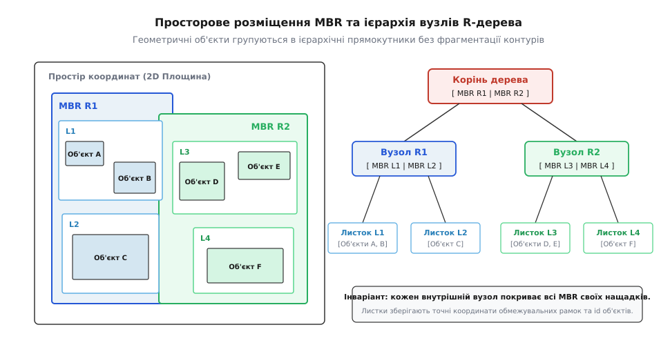
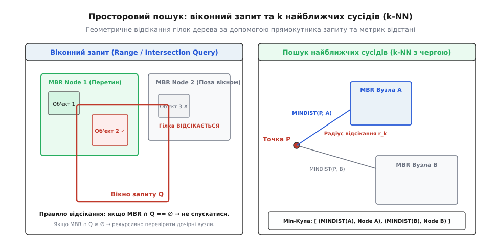
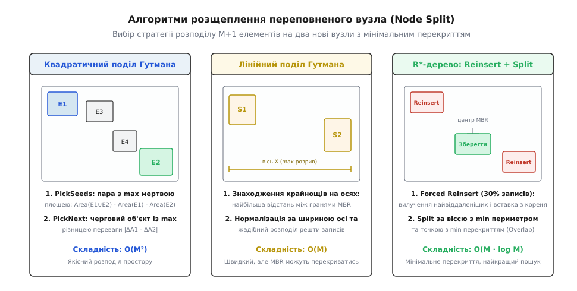

# R-дерево

<preknowlist>
- [B-дерево](book:algorithms/b-tree) — багатопроменеве збалансоване дерево, сторінкова організація та інваріанти наповненості вузлів.
- [k-d дерево](book:algorithms/kd-tree) — циклічний поділ простору гіперплощинами та просторовий пошук точок.
- [Двійкова купа](book:algorithms/binary-heap) — організація черги з пріоритетом для обходу просторових вузлів.
- [Просторові індекси](book:algorithms/spatial-index) — огляд структур даних для геоінформаційних систем та обчислювальної геометрії.
</preknowlist>

Геоінформаційний сервер картографічного сервісу щосекунди обробляє тисячі запитів на вибірку міських об'єктів у прямокутному вікні користувацького екрана. У базі даних збережено десять мільйонів просторових сутностей: будівлі, полігони парків, траси доріг та кадастрові земельні ділянки. Якщо зберегти ці дані у звичайній таблиці без спеціалізованого просторового індексу, для обробки єдиного віконного запиту СУБД змушена зчитувати з диска всі 10 мільйонів записів, витрачаючи гігабайти пам'яті та секунди процесорного часу. Якщо ж спробувати адаптувати класичне B-дерево або точкові структури на кшталт k-d дерев, система стикається з тим, що протяжні геометричні тіла не піддаються одновимірному лінійному впорядкуванню, а розсічення полігонів координатними сітками спричиняє вибухове зростання кількості дублікатів і руйнування транзакційної цілісності. Для ефективної роботи з багатовимірними об'єктами довільної форми необхідна деревоподібна структура, яка групує просторові тіла без їхнього розрізання та забезпечує логарифмічну швидкість пошуку.

## Чому одновимірні індекси та точкові дерева безсилі перед протяжними тілами

Фундаментальна складність роботи з просторовими даними зумовлена відсутністю природного лінійного відношення порядку в просторах розмірності `n ≥ 2`. 

У реляційних базах даних головним інструментом індексації є [B-дерево](book:algorithms/b-tree). Воно спирається на суворе лінійне впорядкування ключів `k_1 < k_2 < k_3`, завдяки чому будь-який числовий діапазон `[A, B]` на одновимірній осі локалізується за час `O(log N)` з мінімальною кількістю дискових зчитувань. 

Коли об'єкти мають дві або більше координат, одновимірний порядок руйнується:
- **Неможливість ефективної фільтрації складеним B-деревом:** якщо побудувати індекс B-дерева за парою координат `(X, Y)`, записи впорядковуються строго лексикографічно — спочатку за віссю `X`, а потім за `Y`. При виконанні запиту прямокутного вікна `[x_min, x_max] × [y_min, y_max]` B-дерево здатне використати індекс лише для обмеження координати `X`. Усі записи, що потрапляють у смугу `[x_min, x_max]`, мають бути послідовно вичитані з диска, навіть якщо їхня координата `Y` віддалена від вікна запиту на тисячі кілометрів. Якщо площа вікна становить 0.01% від карти, але перетинає широку смугу по `X`, індекс змусить СУБД переглянути до 30–50% усієї таблиці.
- **Обмеженість просторових кривих для протяжних тіл:** криві, що заповнюють простір (z-крива Мортона або крива Гільберта), проектують багатовимірні точки на одновимірну числову вісь зі збереженням локальності. Проте вони розраховані на нескінченно малі точки. Якщо об'єкт є протяжним полігоном площею в сотні квадратних метрів, він накриває цілий діапазон значень просторової кривої, втрачаючи переваги точкового ключа.

Спроба застосувати класичні деревоподібні структури розбиття простору — [k-d дерево](book:algorithms/kd-tree) або квадродерево — стикається з іще важчою перешкодою. Ці структури ділять координатний простір ортогональними гіперплощинами на взаємно неперетинні комірки:

```
Розсічення простору:            Розсічення об'єкта:
Y ^                             Y ^
  |     Комірка A | Комірка B     |     +-------+-[Межа]--+
  |               |               |     |       |         |
--+---------------+--------       |     |  Об'єкт розтятий|
  |     Комірка C | Комірка D     |     +-------+---------+
  +------------------------>      +------------------------>
                           X                               X
```

Коли геометричний контур (наприклад, контур лісового масиву чи відрізок річки) перетинає розділову межу між просторовими комірками, розробник опиняється перед вибором із двох однаково неприйнятних варіантів:
1. **Фрагментація геометрії:** розрізати геометричне тіло на окремі шматки вздовж усіх ліній розсічення та зберегти кожен фрагмент у відповідному листку дерева. Це породжує лавиноподібне множення кількості полігонів у базі даних, ускладнює відновлення первинного контуру та вимагає виконання важких обчислень об'єднання (Spatial Union) під час кожного читання.
2. **Дублювання посилань:** зберегти цілісний об'єкт, але записати посилання на нього в усі листкові комірки, територію яких він перетинає. Для великих географічних об'єктів це призводить до колосального роздування розміру індексу. При оновленні або видаленні одного об'єкта СУБД змушена захоплювати блокування та модифікувати десятки сторінок індексу, що паралізує паралельну обробку транзакцій.

Порівняння базових просторових структур підсумовано в таблиці:

| Властивість | B-дерево (композитний ключ) | k-d дерево | Квадродерево | R-дерево |
| :--- | :--- | :--- | :--- | :--- |
| **Одиниця індексації** | Скалярний ключ / точка | Точка `ℝⁿ` | Точка або фіксований тайл | Протяжне тіло довільної форми |
| **Розбиття простору** | Одновимірне лінійне | Неперетинні напівпростори | Неперетинна регулярна сітка | Ієрархічні перекривні MBR |
| **Поведінка для полігонів** | Не підтримує геометрію | Вимагає розрізання або дублювання | Вимагає розрізання або дублювання | Зберігає об'єкт цілісно в 1 екземплярі |
| **Балансування за висотою** | Ідеальне `O(log N)` | Складне динамічне | Не збалансоване | Ідеальне `O(log_M N)` |
| **Орієнтація на диск** | Сторінкова (дискові блоки) | Оперативна пам'ять | Оперативна пам'ять | Сторінкова (дискові блоки) |

R-дерево (від англ. *Rectangle* — прямокутник) розв'язує цю проблему принципово іншим шляхом. Замість поділу самого координатного простору на неперетинні сектори, R-дерево формує ієрархію обмежувальних прямокутників безпосередньо навколо збережених геометричних тіл, дозволяючи рамкам сусідніх гілок перекриватися в просторі.

## Геометрія мінімальних обмежувальних прямокутників (MBR)

Основою математичного апарату R-дерева є концепція мінімального обмежувального прямокутника (MBR, від англ. *Minimum Bounding Rectangle*, або паралелепіпеда AABB у тривимірному просторі).

MBR довільного `n`-вимірного геометричного тіла — це найменший гіперпаралелепіпед зі сторонами, паралельними координатним осям, який повністю охоплює весь цей об'єкт.

В евклідовому просторі `ℝⁿ` паралелепіпед `R` визначається як декартовий добуток `n` одновимірних замкнених числових інтервалів:

```
R = [s₁, e₁] × [s₂, e₂] × ... × [sₙ, eₙ]
```

де `sᵢ` — мінімальна координата об'єкта вздовж осі `i`, а `eᵢ` — максимальна координата (`sᵢ ≤ eᵢ`).

```
Складний об'єкт:                      Мінімальний MBR:
Y ^                                   Y ^   e₂ +------------+
  |         *--*                      |        |   *--*     |
  |        /    \                     |        |  /    \    |
  |    *--*      *                    |        | *--*   \   |
  |     \       /                     |        |  \      *  |
  |      *-----*                      |     s₂ +------------+
  +------------------------>          +--------+------------+-->
                           X                  s₁            e₁ X
```

Апроксимація складного просторового об'єкта (наприклад, полігона з 10 000 вершин) його MBR дозволяє замінити дорогі обчислення перетину многокутників на швидку перевірку чотирьох числових нерівностей.

Математичні властивості метрики MBR, точні формули площ, периметрів та строгі доведення метричних меж винесено в окремий аналіз: [🧮 Метрична геометрія MBR: відстані MINDIST, MINMAXDIST та обмежувальні об'єми](book:math/number-theory/r-tree/math-r-tree-mbr.md).

### Ключові геометричні операції над MBR

Для навігації та побудови індексу використовуються чотири алгебраїчні операції:

1. **Об'єднання рамок (`A ⊕ B`):**
   Мінімальний прямокутник, що одночасно містить обидва прямокутники `A` та `B`:
   ```
   A ⊕ B = ∏_{i=1}^n [ min(sᵢᴬ, sᵢᴮ), max(eᵢᴬ, eᵢᴮ) ]
   ```

2. **Перетин рамок (`A ∩ B`):**
   Спільний просторовий об'єм прямокутників `A` та `B`:
   ```
   A ∩ B = ∏_{i=1}^n [ max(sᵢᴬ, sᵢᴮ), min(eᵢᴬ, eᵢᴮ) ]
   ```
   Якщо для хоча б одного виміру `i` виконується `max(sᵢᴬ, sᵢᴮ) > min(eᵢᴬ, eᵢᴮ)`, прямокутники не перетинаються (`A ∩ B = ∅`).

3. **Площа або гіпероб'єм (`Area(R)`):**
   Міра Лебега обмежувального паралелепіпеда:
   ```
   Area(R) = ∏_{i=1}^n (eᵢ - sᵢ)
   ```

4. **Функція приросту площі (`ΔArea(R, E)`):**
   Додатковий мертвий простір, на який збільшиться прямокутник `R` при поглинанні нового елемента `E`:
   ```
   ΔArea(R, E) = Area(R ⊕ E) - Area(R)
   ```

## Двоетапна обробка просторових запитів (Filter & Refine)

У просторових СУБД обчислення точного перетину двох складних полігонів вимагає виконання геометричних алгоритмів перетину відрізків (таких як алгоритм Бентлі–Оттмана або Вейлера–Азертона), часова складність яких становить `O((V_1 + V_2) log(V_1 + V_2))`, де `V_1, V_2` — кількість вершин у многокутниках.

Для оптимізації цього процесу R-дерево реалізує конвеєр **Filter & Refine**:

```
[Запит Q] ──> [Фаза 1: Filter (R-дерево)] ──> [Список кандидатів (MBR перетинає Q)]
                                                    │
                                                    ▼
              [Остаточна відповідь] <── [Фаза 2: Refine (Точна геометрія)]
```

1. **Фаза фільтрації (Filter Phase):** R-дерево виконує швидкий віконний пошук, оперуючи виключно 4 числами MBR для кожного об'єкта. На цій фазі відсікається 99.9% об'єктів бази даних за час `O(log_M N)`. Результатом є грубий список кандидатів (Candidate Set), MBR яких мають непорожній перетин із вікном запиту.
2. **Фаза уточнення (Refinement Phase):** для кожного знайденого кандидата СУБД зчитує повну геометрію об'єкта з диска та виконує точні топологічні перевірки (Point-in-Polygon через алгоритм випущеного променя Ray Casting або перетин полігональних меж).

Такий поділ ізолює дорогу обчислювальну геометрію лише для одиничних об'єктів, які реально претендують на потрапляння у відповідь.

## Архітектура та інваріанти R-дерева

R-дерево є багатопроменевим збалансованим деревом, запропонованим Антоніном Гутманом (Antonin Guttman) у 1984 році. Структура безпосередньо розрахована на вторинну пам'ять (дискові накопичувачі): кожен вузол дерева розташовується в межах однієї сторінки сховища.

Історичні передумови створення R-дерева та його подальшу еволюцію висвітлено у вставці [📜 Звідки взялося R-дерево: від B-дерев до просторових індексів Гутмана](book:math/number-theory/r-tree/hist-r-tree.md).


*Зв'язок між просторовим розташуванням мінімальних обмежувальних прямокутників на площині та ієрархією вузлів у збалансованому R-дереві.*

### Структурні інваріанти дерева

R-дерево параметризується парою чисел `(m, M)`, де `M` — максимальна місткість вузла (кількість записів, що поміщаються на сторінці), а `m ≤ ⌊M/2⌋` — мінімально дозволена наповненість вузла (зазвичай `m = 0.2M ... 0.5M`).

Структура підтримує такі жорсткі інваріанти:
1. **Інваріант наповненості:** кожен внутрішній вузол містить від `m` до `M` записів вигляду `(MBR, child_pointer)`, крім кореня. Корінь дерева містить від `2` до `M` записів (якщо тільки він сам не є листком із кількістю записів від `0` до `M`).
2. **Інваріант покриття (Покривальна оболонка):** для кожного запису `(MBR, child_pointer)` внутрішнього вузла значення `MBR` є мінімальним прямокутником, що повністю охоплює всі `MBR` дочірнього вузла:
   ```
   MBR_parent = ⨁_{j=1}^k MBR_child_j
   ```
3. **Листковий рівень:** кожен листковий вузол містить від `m` до `M` записів вигляду `(MBR, object_id)`, де `object_id` — унікальний ідентифікатор рядка в таблиці бази даних або первинний ключ.
4. **Ідеальний баланс за висотою:** усі листки дерева розташовані строго на однаковій глибині від кореня:
   ```
   h = ⌈log_M N⌉
   ```

Головна відмінність R-дерева від B-дерев полягає в тому, що прямокутники `MBR` братніх вузлів на одному рівні можуть геометрично накладатися один на одного. Це плата за відсутність розрізання та дублювання самих географічних об'єктів.

## Модель вартості запиту Камеля–Фалутсоса

Ефективність R-дерева вимірюється кількістю дискових сторінок, які необхідно зчитати для виконання запиту. Христос Фалутсос та Ібрагім Камель (1993) розробили строгу аналітичну модель вартості віконного запиту `Q = (q_x, q_y)`.

Нехай робочий простір нормалізовано до одиничного квадрата `[0, 1] × [0, 1]`. Для внутрішнього або листкового вузла з прямокутником `MBR_i = (w_i, h_i)` ймовірність того, що випадково розташоване вікно запиту розміром `q_x × q_y` перетне `MBR_i`, дорівнює площі розширеного прямокутника Мінковського:

```
P(MBR_i ∩ Q ≠ ∅) = (w_i + q_x) · (h_i + q_y)
```

Розкриваючи дужки, отримуємо фундаментальне співвідношення:

```
P(MBR_i ∩ Q ≠ ∅) = w_i · h_i + q_x · h_i + q_y · w_i + q_x · q_y
                  = Area(MBR_i) + q_x · Height(MBR_i) + q_y · Width(MBR_i) + Area(Q)
```

Математичне сподівання кількості зчитаних дискових сторінок `E[Pages(Q)]` дорівнює сумі ймовірностей перетину по всіх вузлах дерева:

```
E[Pages(Q)] = ∑_{i=1}^T Area(MBR_i) + q_x · ∑_{i=1}^T Height(MBR_i) + q_y · ∑_{i=1}^T Width(MBR_i) + T · Area(Q)
```

де `T` — загальна кількість вузлів у дереві.

Ця формула розкриває ключові принципи проєктування R-дерев:
1. **Мінімізація площі (`∑ Area(MBR_i)`):** зменшує перший член рівняння.
2. **Мінімізація периметра (`∑ (Width(MBR_i) + Height(MBR_i))`):** зменшує другий та третій члени рівняння. Якщо вузли мають вигляд довгих вузьких смуг (велика ширина при малій площі), вони перетинають будь-який вертикальний запит. Мінімізація периметра змушує MBR прагнути до форми квадратів, мінімізуючи сумарну вартість запитів.

## Просторові з'єднання (Spatial Join)

Окрім точкових та віконних запитів, найважливішою операцією просторових баз даних є **просторове з'єднання** (Spatial Join): знайти всі пари перетинних об'єктів `(A, B)` із двох різних таблиць (наприклад, визначити всі дороги, що перетинають лісові заповідники).

За наявності двох R-дерев `T_A` та `T_B` просторове з'єднання виконується алгоритмом одночасного синхронного спуску (R-tree Spatial Join, Brinkhoff et al., 1993):

```
Алгоритм SpatialJoin(Node_A, Node_B):
1. Для кожної пари записів (E_A ∈ Node_A, E_B ∈ Node_B):
2.   Якщо (E_A.MBR ∩ E_B.MBR ≠ ∅):
3.     Якщо обидва вузли є листками:
4.       Видати пару кандидатів (E_A.id, E_B.id) для фази Refine
5.     Інакше якщо Node_A — внутрішній, а Node_B — листок:
6.       SpatialJoin(E_A.child, Node_B)
7.     Інакше якщо Node_A — листок, а Node_B — внутрішній:
8.       SpatialJoin(Node_A, E_B.child)
9.     Інакше (обидва внутрішні):
10.      SpatialJoin(E_A.child, E_B.child)
```

Для оптимізації перебору пар `(E_A, E_B)` всередині одного вузла застосовується одновимірне сканування замітальною прямою (Plane Sweep): прямокутники попередньо сортуються за однією віссю, зменшуючи перебір із `O(M_A · M_B)` до `O(M_A log M_A + M_B log M_B)`.

## Механіка просторового пошуку

Ієрархія обмежувальних рамок дозволяє ефективно виконувати два ключові класи просторових запитів: пошук геометричних перетинів (віконний запит) та пошук найближчих сусідів (k-NN).

### 1. Віконний запит та пошук перетинів (Range / Intersection Query)

Задача віконного пошуку: знайти всі просторові об'єкти в індексі, які перетинаються із заданим прямокутником запиту `Q = [qx_min, qx_max] × [qy_min, qy_max]`.

Алгоритм виконує рекурсивний спуск від кореня:
1. У поточному вузлі перебираються всі збережені записи `E_1, E_2, ..., E_k`.
2. Для кожного запису обчислюється предикат перетину:
   ```
   IsIntersect = (E_i.MBR ∩ Q ≠ ∅)
   ```
3. **Геометричне відсікання (Pruning):** якщо `E_i.MBR ∩ Q = ∅`, це означає, що жодна точка всередині піддерева `E_i` не може потрапити у вікно `Q`. Усе піддерево відкидається за одну операцію `O(1)`.
4. Якщо перетин виявлено:
   - Для внутрішнього вузла функція рекурсивно спускається в дочірній вузол `E_i.child`.
   - Для листкового вузла ідентифікатор `E_i.object_id` додається до списку кандидатів.

```
Рекурсивний спуск у віконному запиті:
               [Корінь MBR] ∩ Q ≠ ∅
              /                    \
    [MBR 1] ∩ Q ≠ ∅            [MBR 2] ∩ Q = ∅
        /         \                   |
  [Листок L1]  [Листок L2]      ВІДСІКАЄТЬСЯ (Pruned)
       |            |
   Об'єкти A,B   Об'єкт C
```

Оскільки MBR сусідніх гілок можуть перекриватися в просторі, прямокутник запиту `Q` може одночасно перетинати рамки кількох дочірніх вузлів. Тому запит може спускатися одночасно кількома шляхами.

У найкращому випадку (при компактному групуванні з мінімальним перекриттям) пошук виконується за час `O(log_M N + K)`, де `K` — кількість знайдених об'єктів. У найгіршому випадку (коли всі MBR вузлів роздуті й накривають один одного) пошук деградує до повного сканування `O(N)`.


*Геометричне відсікання гілок: ліворуч — віконний запит відкидає вузол 2 без спуску до дітей; праворуч — пошук k-NN відсікає піддерева за радіусом найближчого кандидата.*

### 2. Пошук k найближчих сусідів (k-Nearest Neighbors, k-NN)

Пошук `k` найближчих об'єктів до заданої точки запиту `P = (p_x, p_y)` базується на евристичному обході «best-first» із чергою пріоритетів (min-heap), запропонованому Ніком Руссопулосом у 1995 році.

Для кожного вузла обчислюється метрика найкоротшої евклідової відстані від точки `P` до найближчої грані прямокутника `R` — `MINDIST(P, R)`:

```
MINDIST²(P, R) = dist_x²(p_x, [s_x, e_x]) + dist_y²(p_y, [s_y, e_y])

де dist_x(p_x, [s_x, e_x]) =
  s_x - p_x,  якщо p_x < s_x
  0,          якщо s_x ≤ p_x ≤ e_x
  p_x - e_x,  якщо p_x > e_x
```

Алгоритм обходу:
1. Ініціалізується черга пріоритетів `PQ`, елементами якої є пари `(відстань, вузол_або_об'єкт)`, впорядковані за зростанням відстані.
2. У чергу додається корінь дерева з відстанню `MINDIST(P, root.MBR)`.
3. Поки черга не порожня і не зібрано `k` об'єктів:
   - Із вершини купи витягується елемент із мінімальною відстанню `d_min`.
   - Якщо це просторовий об'єкт із листка — він додається до списку відповідей (він гарантовано є найближчим сусідом, оскільки всі інші гілки в черзі мають `MINDIST ≥ d_min`).
   - Якщо це внутрішній вузол — для кожного його дочірнього запису `E_i` обчислюється `d_i = MINDIST(P, E_i.MBR)` і пара додається в купу `PQ`.

Метрика `MINDIST` забезпечує точне відсікання: дерево розгортає лише ті гілки, які гарантовано можуть містити об'єкти, ближчі за поточний радіус відсікання.

## Динамічна модифікація: вставка та розщеплення вузлів

Підтримання збалансованості дерева під час модифікацій вимагає вирішення двох задач: вибору оптимального листка для нового об'єкта та коректного розщеплення вузла у разі переповнення.

### 1. Евристика вибору листка (ChooseLeaf)

Алгоритм спускається від кореня до найбільш підходящого листка:
1. На кожному внутрішньому вузлі для всіх записів `E_i` обчислюється функція розширення площі:
   ```
   ΔArea_i = Area(E_i.MBR ⊕ New.MBR) - Area(E_i.MBR)
   ```
2. Обирається вузол із найменшим значенням `ΔArea_i`.
3. При рівності приростів площ перевага віддається вузлу з меншою початковою площею `Area(E_i.MBR)`.

Це мінімізує розростання обмежувальних прямокутників, запобігаючи виникненню надмірного перекриття між гілками.

### 2. Розщеплення переповненого вузла (Node Split)

Коли кількість записів у вузлі досягає `M + 1`, він переповнюється і має бути розділений на два нові вузли, кожен із яких містить не менше ніж `m` записів.


*Порівняння трьох підходів до розщеплення переповненого вузла: квадратичний поділ Гутмана, лінійний поділ та техніка Forced Reinsert у R*-дереві.*

Існує три основні алгоритми розщеплення:

#### 1. Лінійний поділ Гутмана (Linear Split) — складність O(M)
- Уздовж кожної координатної осі знаходяться два прямокутники з найбільшим просторовим розривом.
- Розрив нормалізується діленням на загальну довжину проєкції всіх об'єктів на цю вісь.
- Пара з найбільшим відносним розривом стає зародками (seeds) двох груп.
- Решта елементів жадібно додаються до тієї групи, яка вимагає меншого приросту площі `ΔArea`.

#### 2. Квадратичний поділ Гутмана (Quadratic Split) — складність O(M²)
Забезпечує значно кращу якість групування:
- **Крок PickSeeds:** серед усіх `(M + 1) · M / 2` пар елементів обчислюється «мертва площа» об'єднання:
  ```
  DeadArea(E_i, E_j) = Area(E_i ⊕ E_j) - Area(E_i) - Area(E_j)
  ```
  Пара `(E_1, E_2)` із максимальною мертвою площею розноситься по двох різних вузлах.
- **Крок PickNext:** для кожного нерозподіленого елемента обчислюються прирости площ `d_1 = ΔArea(G_1, E_k)` та `d_2 = ΔArea(G_2, E_k)`. Обирається елемент із найбільшою різницею переваги `|d_1 - d_2|` і додається до групи з меншим розширенням.

#### 3. Вдосконалення R*-дерева (Beckmann 1990)
R*-дерево додає дві потужні оптимізації:
- **Мінімізація периметра та перекриття:** вісь розрізу обирається за мінімумом сумарного периметра (Margin), що запобігає виродженню вузлів у витягнуті смуги, а точка розрізу — за мінімумом перекриття (Overlap).
- **Примусова повторна вставка (Forced Reinsertion):** при першому переповненні вузла на певному ярусі він не розщеплюється. Замість цього вилучаються `p = 30%` записів, найбільш віддалених від центру MBR вузла, і повторно вставляються від кореня. Цей механізм «просторового відпалу» дозволяє об'єктам мігрувати в кращі сусідні кластери.

### 3. Видалення та самолікування (CondenseTree)

Якщо внаслідок видалення об'єкта кількість записів у листку стає меншою за `m`:
1. Вузол видаляється з дерева, а його MBR вилучається з батьківського вузла.
2. Усі вцілілі записи видаленого вузла повторно вставляються в дерево на відповідному ярусі через процедуру `insert`.

Це очищає структуру від застарілих порожніх контурів без потреби в складних операціях балансування сусідів.

## Покроковий числовий приклад розщеплення вузла

Розглянемо числовий приклад квадратичного розщеплення для вузла з параметрами `M = 4`, `m = 2`.

Вузол містить 4 прямокутники й отримує 5-й (`M + 1 = 5`). Координати прямокутників задано четвірками `[x_min, y_min, x_max, y_max]`:

- `E₁ = [0, 0, 2, 2]`, площа `Area(E₁) = 2 · 2 = 4`
- `E₂ = [1, 1, 3, 3]`, площа `Area(E₂) = 2 · 2 = 4`
- `E₃ = [8, 8, 10, 10]`, площа `Area(E₃) = 2 · 2 = 4`
- `E₄ = [9, 7, 11, 9]`, площа `Area(E₄) = 2 · 2 = 4`
- `E₅ = [1, 8, 3, 10]`, площа `Area(E₅) = 2 · 2 = 4`

### Крок 1: Робота функції PickSeeds

Обчислюємо мертву площу для всіх 10 можливих пар `(E_i, E_j)`:

```
Пара (E₁, E₂):
  E₁ ⊕ E₂ = [0, 0, 3, 3]  →  Area = 3 · 3 = 9
  DeadArea = 9 - 4 - 4 = 1

Пара (E₃, E₄):
  E₃ ⊕ E₄ = [8, 7, 11, 10]  →  Area = 3 · 3 = 9
  DeadArea = 9 - 4 - 4 = 1

Пара (E₁, E₃):
  E₁ ⊕ E₃ = [0, 0, 10, 10]  →  Area = 10 · 10 = 100
  DeadArea = 100 - 4 - 4 = 92  [МАКСИМУМ]

Пара (E₁, E₄):
  E₁ ⊕ E₄ = [0, 0, 11, 9]  →  Area = 11 · 9 = 99
  DeadArea = 99 - 4 - 4 = 91

Пара (E₂, E₃):
  E₂ ⊕ E₃ = [1, 1, 10, 10]  →  Area = 9 · 9 = 81
  DeadArea = 81 - 4 - 4 = 73
```

Максимальна мертва площа `DeadArea = 92` досягається на парі `(E₁, E₃)`.
- Зародок групи 1: `G₁ = { E₁ }`, поточна рамка `MBR(G₁) = [0, 0, 2, 2]`, площа `4`.
- Зародок групи 2: `G₂ = { E₃ }`, поточна рамка `MBR(G₂) = [8, 8, 10, 10]`, площа `4`.
- Нерозподілені елементи: `{ E₂, E₄, E₅ }`.

### Крок 2: Перша ітерація PickNext

Обчислюємо приріст площі для кожного кандидата:

```
Кандидат E₂ = [1, 1, 3, 3]:
  G₁ ⊕ E₂ = [0, 0, 3, 3]  →  Area = 9  →  d₁ = 9 - 4 = 5
  G₂ ⊕ E₂ = [1, 1, 10, 10] → Area = 81 →  d₂ = 81 - 4 = 77
  Різниця |d₁ - d₂| = |5 - 77| = 72

Кандидат E₄ = [9, 7, 11, 9]:
  G₁ ⊕ E₄ = [0, 0, 11, 9]  →  Area = 99 →  d₁ = 99 - 4 = 95
  G₂ ⊕ E₄ = [8, 7, 11, 10] →  Area = 9  →  d₂ = 9 - 4 = 5
  Різниця |d₁ - d₂| = |95 - 5| = 90  [МАКСИМУМ]

Кандидат E₅ = [1, 8, 3, 10]:
  G₁ ⊕ E₅ = [0, 0, 3, 10]  →  Area = 30 →  d₁ = 30 - 4 = 26
  G₂ ⊕ E₅ = [1, 8, 10, 10] →  Area = 18 →  d₂ = 18 - 4 = 14
  Різниця |d₁ - d₂| = |26 - 14| = 12
```

Максимальна різниця переваги у `E₄` (`90`). Оскільки `d₂ = 5 < d₁ = 95`, елемент `E₄` приєднується до групи `G₂`:
- `G₁ = { E₁ }`, `MBR(G₁) = [0, 0, 2, 2]`
- `G₂ = { E₃, E₄ }`, `MBR(G₂) = [8, 7, 11, 10]`, площа `9`
- Нерозподілені: `{ E₂, E₅ }`.

### Крок 3: Друга ітерація PickNext

```
Кандидат E₂ = [1, 1, 3, 3]:
  G₁ ⊕ E₂ = [0, 0, 3, 3]  →  Area = 9   →  d₁ = 9 - 4 = 5
  G₂ ⊕ E₂ = [1, 1, 11, 10] → Area = 90  →  d₂ = 90 - 9 = 81
  Різниця |d₁ - d₂| = |5 - 81| = 76  [МАКСИМУМ]

Кандидат E₅ = [1, 8, 3, 10]:
  G₁ ⊕ E₅ = [0, 0, 3, 10] →  Area = 30  →  d₁ = 30 - 4 = 26
  G₂ ⊕ E₅ = [1, 7, 11, 10] → Area = 30  →  d₂ = 30 - 9 = 21
  Різниця |d₁ - d₂| = |26 - 21| = 5
```

Максимальна різниця у `E₂` (`76`). Оскільки `d₁ = 5 < d₂ = 81`, елемент `E₂` додається до `G₁`:
- `G₁ = { E₁, E₂ }`, `MBR(G₁) = [0, 0, 3, 3]`, площа `9`
- `G₂ = { E₃, E₄ }`, `MBR(G₂) = [8, 7, 11, 10]`, площа `9`
- Залишився єдиний елемент `E₅`.

### Крок 4: Завершення розподілу

Для елемента `E₅ = [1, 8, 3, 10]`:
- `d₁ = Area([0, 0, 3, 10]) - 9 = 30 - 9 = 21`
- `d₂ = Area([1, 7, 11, 10]) - 9 = 30 - 9 = 21`

При рівності приростів площ перевіряються площі груп (`9 = 9`), і елемент додається до групи `G₁` за замовчуванням.

Остаточний результат:
- **Вузол 1:** `{ E₁, E₂, E₅ }` з рамкою `[0, 0, 3, 10]`, заповненість `3` елементи (`≥ m = 2`).
- **Вузол 2:** `{ E₃, E₄ }` з рамкою `[8, 7, 11, 10]`, заповненість `2` елементи (`≥ m = 2`).

Два нові вузли мають нульове взаємне перекриття (`MBR(G₁) ∩ MBR(G₂) = ∅`), що забезпечує ідеальну локальність.

## Масове статичне завантаження (Bulk Loading)

При завантаженні мільйонів попередньо зібраних геоданих послідовна вставка через `insert` вимагає `O(N log N)` дискових записів, дає заповненість вузлів лише на 60–70% і створює субоптимальне перекриття MBR.

Для статичних наборів даних використовують спеціалізовані методи просторової упаковки:

### 1. Метод Sort-Tile-Recursive (STR)
1. Розраховується кількість необхідних листків `P = ⌈N / M⌉` та кількість вертикальних смуг `S = ⌈√P⌉`.
2. Об'єкти сортуються за координатою `X` їхніх центрів.
3. Масив ділиться на `S` вертикальних смуг однакової місткості.
4. Усередині кожної смуги об'єкти сортуються за координатою `Y` і пакуються в листки по `M` штук із 100% заповненням.
5. Процедура рекурсивно повторюється для вищих ярусів дерева.

### 2. Hilbert R-tree Packing
1. Для кожного об'єкта обчислюється одновимірна координата його центру на просторовій кривій Гільберта.
2. Масив сортується за гільбертовим ключем.
3. Послідовні пачки по `M` записів упаковуються в листки.

Обидва алгоритми створюють ідеально збалансоване дерево зі 100% щільністю зберігання за час `O(N log N)`.

## Паралелізм та блокування: R-link дерево та PostgreSQL GiST

У багатопотокових СУБД класичні протоколи блокувань B-дерев (Lock Coupling) не працюють для R-дерев: через розростання та взаємне перекриття MBR розщеплення вузла може зачепити паралельні читаючі транзакції.

Для паралельного доступу використовується архітектура **R-link дерева** (Kornacker & Banks, 1995):
- Кожен вузол містить правий вказівник (Right Sibling Pointer) на сусідній вузол того самого ярусу та номер логічної послідовності LSN (Log Sequence Number).
- Якщо читаючий потік спускається у вузол, який у цей момент розщеплюється пишучим потоком, читач виявляє невідповідність LSN і просто переходить за правим посиланням, не блокуючи роботу письменника.
- Цей механізм лежить в основі неблокуючої індексації GiST у PostgreSQL.

## Просторово-часові дані (4D Spatio-Temporal R-trees)

Сучасні логістичні системи, трекери безпілотних апаратів та платформи супутникового моніторингу оперують рухомими об'єктами, положення яких змінюється в часі.

Для індексації траєкторій використовують чотиривимірні паралелепіпеди `(X, Y, Z, T)`:
- Просторові координати описують географічний об'єм `[x_min, x_max] × [y_min, y_max] × [z_min, z_max]`.
- Часовий інтервал задає відрізок життя події `[t_start, t_end]`.

Головна математична пастка 4D-індексації полягає в непорівнюваності масштабів: час вимірюється в секундах (числа порядку `10⁹`), а координати — у градусах чи метрах. Для запобігання виродженню вузлів у наддовгі часові циліндри алгоритм вимагає попередньої нормованої параметризації осей перед обчисленням `ΔArea`.

## Практичне застосування та системні реалізації

Промислові сценарії застосування R-дерев охоплюють просторові бази даних та ігрову фізику:

### 1. PostgreSQL / PostGIS (Узагальнені дерева пошуку GiST)

У PostgreSQL просторовий індекс створюється поверх інтерфейсу GiST:
```sql
-- Створення таблиці просторових полігонів
CREATE TABLE municipal_parcels (
    id SERIAL PRIMARY KEY,
    name VARCHAR(100),
    geom GEOMETRY(Polygon, 4326)
);

-- Побудова R-дерево індексу GiST
CREATE INDEX idx_parcels_spatial ON municipal_parcels USING GIST (geom);

-- Віконний запит із використанням індексу (оператор && перевіряє перетин MBR)
SELECT id, name 
FROM municipal_parcels 
WHERE geom && ST_MakeEnvelope(30.45, 50.40, 30.55, 50.50, 4326);
```

Оператор `&&` виконує швидку первинну фільтрацію за R-деревом (Bounding Box Filter), після чого точний алгоритм перевіряє реальний перетин полігонів.

### 2. Модуль SQLite R*Tree

У бібліотеку SQLite вбудовано розширення `rtree`, що реалізує віртуальні таблиці на базі R*-дерева:
```sql
-- Створення віртуальної просторової таблиці для 2D-рамок
CREATE VIRTUAL TABLE spatial_index USING rtree(
   id,              -- Унікальний числовий ідентифікатор
   minX, maxX,      -- Межі за віссю X
   minY, maxY       -- Межі за віссю Y
);

-- Вставка MBR
INSERT INTO spatial_index VALUES (1, 10.0, 20.0, 15.0, 25.0);

-- Віконний пошук
SELECT id FROM spatial_index 
WHERE minX <= 30.0 AND maxX >= 5.0 
  AND minY <= 30.0 AND maxY >= 5.0;
```

### 3. Гральні та фізичні рушії (Dynamic AABB Trees)

У фізичних рушіях (PhysX, Bullet Physics, Unreal Engine Chaos) перевірка зіткнень розбивається на дві фази:
1. **Широка фаза (Broadphase):** динамічне R-дерево (AABB Tree) знаходить усі пари об'єктів, чиї габаритні рамки перетинаються.
2. **Вузька фаза (Narrowphase):** алгоритми GJK (Gilbert–Johnson–Keerthi) та SAT (Separating Axis Theorem) розраховують точні точки контакту для знайдених пар.

Повний вихідний код реалізації 2D R-дерева мовами C та C++ із квадратичним розщепленням, віконним пошуком та k-NN наведено у вставці: [⚙️ Реалізація R-дерева: квадратичне розщеплення, віконний пошук та k-NN](book:math/number-theory/r-tree/proj-r-tree-search-split.md).

## Межі застосування та прокляття розмірності

R-дерево є оптимальним вибором у просторах розмірності `n = 2, 3, 4`. 

При зростанні вимірності простору (`n > 10–20`) структура стикається з ефектом **прокляття розмірності** (Curse of Dimensionality):
- **Розрідженість гіпероб'ємів:** у `n`-вимірному просторі одиничний гіперкуб має `2ⁿ` вершин. Об'єм концентрується біля тонкого шару поверхонь і кутів, а центр залишається порожнім.
- **Тотальне перекриття MBR:** обмежувальні паралелепіпеди розростаються і починають накривати весь простір. Перекриття між братніми вузлами наближається до 100%.

У результаті віконний пошук або k-NN у просторі `ℝ⁵⁰` змушений відвідувати майже 100% вузлів R-дерева, перетворюючи логарифмічний пошук на сповільнений лінійний скан. Для багатовимірних векторів (наприклад, ембедингів нейромереж) замість точних R-дерев застосовують структури наближеного пошуку (HNSW, Annoy, ScaNN).
