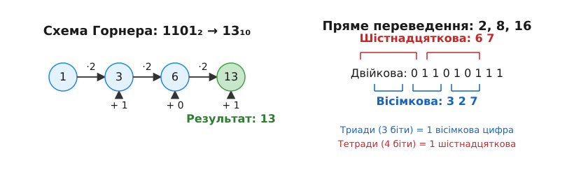

# Перетворення позиційних систем числення

<preknowlist>
  <preknow class="math" slug="positional-systems">Позиційні системи числення</preknow>
  <preknow class="math" slug="polynomials">Многочлени (поліноми)</preknow>
</preknowlist>

> 🔧 **Навіщо це.**
> Цифровий світ розмовляє мовою нулів та одиниць (двійковою, 2), програмісти читають код у шістнадцятковій (16), а ми у повсякденному житті звикли до десяткової (10) системи. Вміння переводити числа між цими базами — це здатність працювати як «перекладач» між апаратурою, кодом і людиною. Без цього неможливо зрозуміти, як процесор обробляє дані, як утворюються кольори в веб-дизайні (наприклад, #FF0000) та як працюють криптографічні алгоритми.

Позиційні системи числення є фундаментальним досягненням людського інтелекту, що дозволяє за допомогою обмеженої кількості символів (цифр) представляти як завгодно великі (і малі) величини. Суть позиційної системи полягає в тому, що «вага» (множник) кожної цифри визначається її позицією у записі числа.

Кожне число в позиційній системі числення з основою (радіксом) b (де b — натуральне число, b > 1) можна уявити як суму розрядів, де кожен розряд має свою «вагу» — відповідний ступінь основи. 
Наприклад, число N у базі b з цифрами dₙ dₙ₋₁ ... d₁ d₀ . d₋₁ d₋₂ ... d₋ₘ математично записується як значення поліному:
N = dₙ·bⁿ + dₙ₋₁·bⁿ⁻¹ + ... + d₁·b¹ + d₀·b⁰ + d₋₁·b⁻¹ + d₋₂·b⁻² + ... + d₋ₘ·b⁻ᵐ.

Тут кожна цифра dᵢ задовольняє умову 0 ≤ dᵢ < b. Для баз більших за 10 традиційно використовуються літери латинського алфавіту (A=10, B=11, C=12, D=13, E=14, F=15 тощо).

Математично, згідно з теоремою про представлення цілих чисел, для будь-якого цілого N > 0 та будь-якої основи b > 1 існує єдиний набір коефіцієнтів (цифр) dᵢ такий, що виконується наведена вище рівність (без дробової частини), а найстарша цифра dₙ не дорівнює нулю. Ця єдиність є критично важливою: вона гарантує, що кожне число має лише один правильний запис у кожній системі числення, що робить перетворення між системами детермінованим і оборотним процесом.

## Метод прямого обчислення та Схема Горнера

Найприродніший спосіб перевести число з довільної основи b₁ у систему, в якій ми звикли рахувати (зазвичай, десяткову, b₂ = 10), — це просто обчислити значення наведеного вище поліному за правилами арифметики нашої цільової системи. 

Розглянемо ціле число N = dₙ·bⁿ + dₙ₋₁·bⁿ⁻¹ + ... + d₁·b + d₀.
Пряме обчислення ступенів (b², b³ тощо) може бути повільним і неефективним з точки зору кількості операцій множення. Натомість у комп'ютерній науці та алгоритміці використовується **схема Горнера**, яка дозволяє звести операцію обчислення поліному до серії послідовних множень і додавань, повністю позбавляючись від необхідності підносити числа до степеня. 

Алгебраїчно схема Горнера виглядає як послідовне винесення основи b за дужки:
N = (...((dₙ·b + dₙ₋₁)·b + dₙ₋₂)·b + ... + d₁)·b + d₀.

### Алгоритм схеми Горнера:
1. Ініціалізуємо акумулятор (поточне значення) рівним найстаршій цифрі (найлівішій, dₙ).
2. Множимо поточне значення акумулятора на основу b.
3. Додаємо до акумулятора наступну цифру числа.
4. Повторюємо кроки 2 і 3 послідовно для кожної наступної цифри аж до останньої (наймолодшої, d₀).

Розглянемо приклад. Нехай нам потрібно перевести двійкове число 11011₂ у десяткову систему (b = 2):
Початкове значення = 1.
Множимо на 2, додаємо наступну 1: 1·2 + 1 = 3.
Множимо на 2, додаємо наступний 0: 3·2 + 0 = 6.
Множимо на 2, додаємо наступну 1: 6·2 + 1 = 13.
Множимо на 2, додаємо останню 1: 13·2 + 1 = 27.
Отже, 11011₂ = 27₁₀.

Розглянемо інший приклад. Переведемо шістнадцяткове число 2A3₁₆ у десяткову (b = 16). Цифри числа: 2, A (яка дорівнює 10), та 3.
Початкове значення: 2.
Множимо на 16, додаємо 10: 2·16 + 10 = 32 + 10 = 42.
Множимо на 16, додаємо 3: 42·16 + 3 = 672 + 3 = 675.
Отже, 2A3₁₆ = 675₁₀.

Схема Горнера є надзвичайно ефективною: для числа довжиною n цифр вона вимагає рівно n-1 множень і n-1 додавань. Жоден інший алгоритм не здатний виконати це перетворення за меншу кількість операцій, що робить цей підхід математично оптимальним. Вона широко використовується у функціях парсингу рядків у стандартних бібліотеках мов програмування.

## Метод послідовного ділення на основу (для цілої частини)

Щоб перевести ціле число (наприклад, подане у десятковій системі) у систему з новою основою b, ми використовуємо метод послідовного ділення, який також часто називають алгоритмом Евкліда для отримання цифр або методом залишків.

Цей метод базується на простій математичній ідеї. Якщо ми подивимося на рівняння поліному:
N = dₙ·bⁿ + dₙ₋₁·bⁿ⁻¹ + ... + d₁·b + d₀
Якщо поділити N на b, то всі доданки, окрім останнього, діляться на b без залишку (бо всі вони містять множник b у деякому ступені). Останній доданок, d₀, є цифрою системи з основою b, а отже 0 ≤ d₀ < b. Тому d₀ неминуче стане остачею від ділення цілого числа N на b. А цілою часткою від ділення стане число N' = dₙ·bⁿ⁻¹ + dₙ₋₁·bⁿ⁻² + ... + d₁.
Застосувавши ділення на b до нового числа N', ми аналогічним чином отримаємо як остачу цифру d₁, і так далі, витягуючи цифри числа одну за одною справа наліво.

### Алгоритм:
1. Ділимо початкове ціле число N на нову основу b.
2. Записуємо остачу від ділення. Ця остача стає черговою (починаючи з наймолодшої, тобто справа наліво) цифрою результату у новій базі.
3. Беремо цілу частку від ділення і робимо її новим значенням N.
4. Повторюємо кроки 1-3, доки N не стане дорівнювати 0 (тобто коли ціла частка стане нулем).
5. Результат формується записом отриманих остач у зворотному порядку (перша отримана остача — це остання цифра, а остання отримана остача стає найстаршою цифрою).

Приклад: переведемо десяткове число 27₁₀ у двійкову систему (b = 2):
27 / 2 = 13 (остача 1) — це d₀ (остання цифра)
13 / 2 = 6  (остача 1) — це d₁
6 / 2 = 3   (остача 0) — це d₂
3 / 2 = 1   (остача 1) — це d₃
1 / 2 = 0   (остача 1) — це d₄ (перша цифра)

Читаємо остачі знизу вгору (у зворотному порядку їх отримання): 11011₂.

Приклад з більшою основою: переведемо 675₁₀ у шістнадцяткову систему (b = 16):
675 / 16 = 42 (остача 3) — це d₀
42 / 16 = 2   (остача 10, що відповідає 'A') — це d₁
2 / 16 = 0    (остача 2) — це d₂

Читаємо знизу вгору: 2A3₁₆.

## Метод послідовного множення на основу (для дробової частини)

Робота з дробовою частиною числа (меншою за 1) вимагає дзеркального підходу. Якщо ми переводимо дріб у нову систему числення, ми маємо знайти такі коефіцієнти d₋₁, d₋₂, d₋₃..., що:
F = d₋₁·b⁻¹ + d₋₂·b⁻² + d₋₃·b⁻³ + ...
Якщо ми помножимо обидві частини рівняння на b, ми отримаємо:
F·b = d₋₁ + d₋₂·b⁻¹ + d₋₃·b⁻² + ...
Ціла частина нового числа зліва — це точно наша шукана перша цифра після коми (d₋₁), оскільки решта суми строго менша за 1. Відкинувши отриману цілу частину, ми знову отримаємо правильний дріб і зможемо повторити процедуру, щоб знайти d₋₂, і так далі.

### Алгоритм:
1. Беремо тільки дробову частину числа (без цілої) і множимо її на нову основу b.
2. Ціла частина отриманого добутку стає наступною цифрою результату (записується зліва направо, одразу після коми).
3. Відкидаємо цілу частину, залишаючи лише нову дробову частину (яка знову лежить в діапазоні від 0 до 1).
4. Повторюємо кроки 1-3, доки нова дробова частина не стане рівною 0 (це означатиме, що ми досягли точного переведення) або доки не досягнемо потрібної точності (якщо виникає нескінченний або періодичний дріб).

Приклад: переведемо 0,6875₁₀ у двійкову систему (b = 2):
0,6875 · 2 = 1,375. Ціла частина: 1, новий залишок: 0,375.
0,375 · 2 = 0,750. Ціла частина: 0, новий залишок: 0,750.
0,750 · 2 = 1,500. Ціла частина: 1, новий залишок: 0,500.
0,500 · 2 = 1,000. Ціла частина: 1, новий залишок: 0,000.
Кінець алгоритму, оскільки залишок став 0.
Результат читаємо зверху вниз (як вони з'являлися): 0,1011₂.

### Проблема втрати точності (періодичні дроби)

Важливим і неочевидним наслідком перетворення дробових чисел є той факт, що кінцевий дріб в одній позиційній системі може перетворитися на нескінченний періодичний дріб в іншій системі.

Теорема: раціональне число p/q (де дріб нескоротний) має скінченне представлення в системі числення з основою b тоді й тільки тоді, коли всі прості множники знаменника q є водночас простими множниками основи b.

У десятковій системі основа b=10 має прості множники 2 і 5. Отже, будь-який дріб, знаменник якого складається тільки з 2 і 5 (наприклад, 1/2, 1/4, 1/5, 1/20) матиме скінченне представлення (0,5; 0,25; 0,2; 0,05).
У двійковій системі основа b=2 має єдиний простий множник 2. Це означає, що скінченне двійкове представлення мають лише ті дроби, чий знаменник є ступенем двійки (1/2, 1/4, 1/8 тощо).

Розглянемо звичайне десяткове число 0,1 (тобто 1/10). Оскільки знаменник 10 має множник 5, якого немає в двійковій системі, число 0,1 гарантовано перетвориться на нескінченний періодичний дріб при переведенні у двійкову систему.
Спробуємо перевести 0,1₁₀ у базу 2:
0,1 · 2 = 0,2 (ціла: 0, дріб: 0,2)
0,2 · 2 = 0,4 (ціла: 0, дріб: 0,4)
0,4 · 2 = 0,8 (ціла: 0, дріб: 0,8)
0,8 · 2 = 1,6 (ціла: 1, дріб: 0,6)
0,6 · 2 = 1,2 (ціла: 1, дріб: 0,2)  <-- цикл замкнувся!
Знову маємо дріб 0,2, і далі послідовність (0, 0, 1, 1) буде нескінченно повторюватися.
Отже, 0,1₁₀ = 0,00011001100110011...₂.

Ця математична особливість є першопричиною найпоширеніших помилок округлення в програмуванні, коли код `0.1 + 0.2` не дорівнює точно `0.3`. Комп'ютери зберігають числа за стандартом IEEE 754 (з плаваючою комою у двійковій системі), і нескінченні дроби змушені округлятися до певного фіксованого розміру бітів, що призводить до мікроскопічної втрати точності під час таких конвертацій.

## Пряме переведення між спорідненими основами (2, 8, 16)

Окремої уваги заслуговує перетворення чисел між системами, чиї основи є ступенями одного і того ж числа. На практиці найважливішими є двійкова (2), вісімкова (8 = 2³) та шістнадцяткова (16 = 2⁴) системи.

Оскільки 8 — це двійка в кубі, кожна вісімкова цифра здатна зберігати рівно 3 біти інформації (від 000₂ до 111₂ = від 0₈ до 7₈). Аналогічно, 16 — це двійка в четвертому ступені, тому кожна шістнадцяткова цифра зберігає рівно 4 біти інформації (від 0000₂ до 1111₂ = від 0₁₆ до F₁₆).

Це означає, що переведення між цими системами не вимагає використання проміжної десяткової системи та складних математичних множень чи ділень. Достатньо лише алгоритмічно розбивати двійкове число на групи фіксованої довжини або, навпаки, замінювати цифри на відповідні групи бітів.

### Групування бітів: Триади та Тетради

Група з 3 бітів називається **триадою** і напряму відповідає одній вісімковій цифрі.
Група з 4 бітів називається **тетрадою** (або нібблом) і напряму відповідає одній шістнадцятковій цифрі.

#### Перетворення з двійкової у вісімкову (тетради → триади)
1. Беремо двійкове число і розбиваємо його на групи по 3 біти. Робити це треба строго починаючи від десяткової коми. Для цілої частини ми рухаємося від коми вліво, для дробової — від коми вправо.
2. Якщо на краях (найстарші цілі розряди або наймолодші дробові) не вистачає бітів до повної групи з трьох, ми дописуємо нулі, щоб завершити триаду (додавання ведучих нулів у цілу частину та кінцевих нулів у дробову частину не змінює значення числа).
3. Кожну утворену триаду замінюємо на відповідну вісімкову цифру за таблицею.

Приклад: переведемо 11011101,1011₂ у вісімкову систему (8).
Групуємо цілу частину від коми вліво: 011 011 101. (Додали один нуль зліва, щоб зробити `11` повноцінною триадою `011`).
Групуємо дробову частину від коми вправо: , 101 100. (Додали два нулі справа до `1`, щоб зробити триаду `100`).
Перекладаємо триади: (011)=3, (011)=3, (101)=5, (101)=5, (100)=4.
Результат з'єднуємо разом: 335,54₈.

#### Перетворення з шістнадцяткової в двійкову
Цей процес є оберненим і ще простішим.
1. Кожну шістнадцяткову цифру замінюємо на її 4-бітне двійкове представлення (тетраду).
2. Записуємо всі тетради поспіль.

Приклад: переведемо 2A,C₁₆ у двійкову систему (2).
2 = 0010
A = 1010
C = 1100
Результат (склеюємо): 0010 1010,1100₂. Зайві ведучі та кінцеві нулі можна прибрати, отримавши 101010,11₂.

Ось чому шістнадцятковий формат став стандартом де-факто у програмуванні: він дозволяє вчетверо скоротити довжину запису двійкового коду, зберігаючи при цьому ідеальне візуальне відображення початкових бітів (одна шістнадцяткова цифра завжди дорівнює одному нібблу, а дві шістнадцяткові цифри точно описують один байт, незалежно від сусідніх розрядів).

## Екзотичні позиційні системи

Окрім класичних систем з основою b (де b — натуральне число), математична концепція позиційного представлення може бути узагальнена на набагато складніші структури. Ці екзотичні системи мають вузьке, але важливе застосування в криптографії, оптимізації алгоритмів та цифровій обробці сигналів.

### Системи з від'ємною основою (Негапозиційні)

У негапозиційних системах основа b є від'ємним цілим числом (наприклад, -2). Цифри залишаються додатними (0 та 1 для основи -2). Вага кожного розряду дорівнює (-2)ⁿ.
Послідовність ваг розрядів: 1, -2, 4, -8, 16, -32 і так далі. 
Головна унікальна властивість такої системи: вона здатна представляти як додатні, так і від'ємні числа без використання знака мінус! Будь-яке число записується просто як послідовність бітів.

Наприклад, запишемо число -5 у негадвійковій системі (b = -2).
-5 = 1·(-8) + 1·4 + 1·(-2) + 1·1 = -8 + 4 - 2 + 1 = -5.
Отже, -5₁₀ = 1111₋₂.
Така властивість дуже приваблива для апаратного проектування, оскільки скасовує необхідність окремого знакового біта і спеціальної логіки доповняльного коду, хоча і ціною складніших схем додавання.

### Системи з нецілою основою

В математиці досліджуються також системи, де основа не є цілим числом. Найвідомішою з них є **фінакова** (або "золота") система числення, де основою є золотий переріз φ ≈ 1.618. 
У цій системі використовуються лише цифри 0 та 1. Проте, через алгебраїчні властивості числа φ (а саме φ² = φ + 1), ця система має вбудовану надмірність: послідовність цифр "11" у будь-якому місці числа можна замінити на "100" (оскільки φ² = φ + 1). Ця властивість робить систему корисною для перевірки помилок у кодуванні даних: якщо перетворити всі числа в "стандартну форму" (де немає жодних двох одиниць підряд), поява послідовності "11" під час передачі даних гарантовано свідчитиме про помилку.

### Змішані позиційні системи (Mixed Radix)

Досі ми розглядали системи, де кожен розряд мав вагу bⁿ. У **змішаній системі** кожен розряд має свою власну базу bᵢ.
Класичний приклад, яким ми користуємося щодня — це наша система вимірювання часу.
Уявімо запис часу: 3 дні, 5 годин, 45 хвилин і 15 секунд.
Основа для секунд дорівнює 60 (хвилина).
Основа для хвилин дорівнює 60 (година).
Основа для годин дорівнює 24 (доба).
Вага кожної цифри визначається не піднесенням до степеня, а добутком усіх попередніх основ.

Ще одним важливим прикладом у комбінаториці є факторіальна система числення, де вага i-го розряду (починаючи від 0) дорівнює i!.
У цій системі максимальне значення цифри в i-й позиції обмежене числом i. Ця система створює ідеальну бієкцію між числами від 0 до n!-1 та всіма можливими перестановками множини з n елементів.

## Підсумок

Перетворення позиційних систем числення є більше, ніж просто технічним трюком. Це фундаментальна математична операція, яка ілюструє концепцію ізоморфізму: хоча зовнішній вигляд (запис) числа змінюється, його математична сутність (розмір) залишається незмінною. Опанувавши перетворення, ви розблоковуєте здатність «бачити крізь» дані, розуміючи, як одне й те саме число може бути елегантною математичною концепцією у десятковій формі, фізичним набором високих та низьких напруг у двійковій, або яскравим червоним пікселем у шістнадцятковій.
