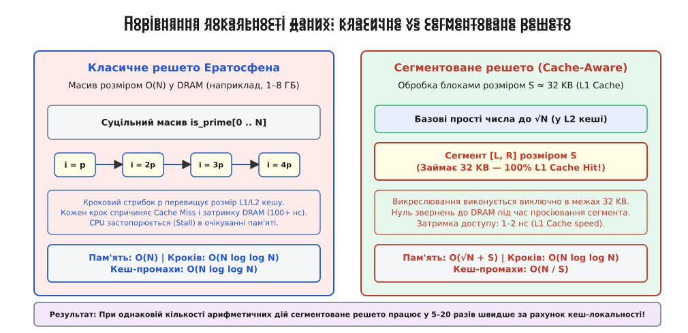
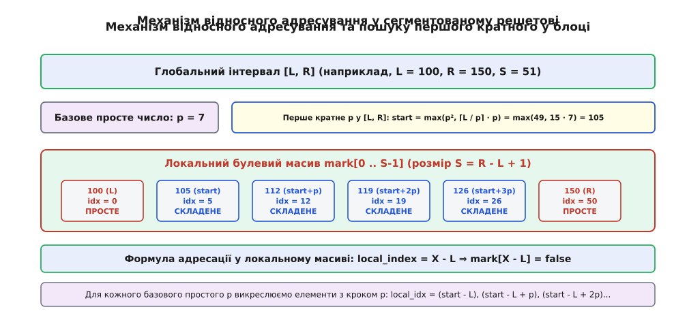
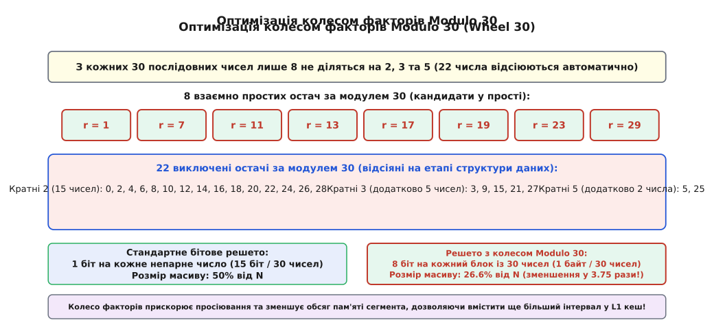

# Сегментоване решето Ератосфена

<preknowlist>
- [Прості числа](book:math/prime-numbers) — поняття простого числа, неподільність, випробовування діленням та ідея класичного решета.
- [НСД та алгоритм Евкліда](book:math/gcd-euclidean) — подільність цілих чисел та властивості остач.
- [Основна теорема арифметики](book:math/fundamental-theorem-arithmetic) — розклад чисел на прості множники.
- [Функція Ейлера](book:math/euler-totient) — кількість чисел, взаємно простих з модулем, та основа колеса факторів.
- [Мала теорема Ферма](book:math/fermat-little-theorem) — властивість остач степенів за простим модулем та основа тестування простоти.
</preknowlist>

> 🔧 **Навіщо це.**
> Пошук усіх простих чисел у великих діапазонах (до N = 10¹⁰ і більше) є фундаментальною задачею криптографії, алгоритмічної теорії чисел та комп'ютерного моделювання. Класичне решето Ератосфена вимагає гігабайтів суцільної оперативної пам'яті та створює хаотичні промахи повз кеш процесора. Сегментоване решето вирішує цю проблему, зменшуючи споживання пам'яті до кілобайтів і прискорюючи обчислення у десятки разів за рахунок ефективного використання L1/L2-кешу сучасних процесорів.

Генерація простих чисел у діапазоні до N = 10¹⁰ за допомогою класичного масиву прапорців вимагає понад 1.25 гігабайта суцільної оперативної пам'яті та призводить до мільйонів промахів повз L1/L2-кеш процесора, оскільки викреслювання елементів кроком p розпорошує звернення по всьому гігабайтному простору. При переході за межі кешу швидкість обчислень падає у десятки разів через постійне очікування завантаження ліній пам'яті з системної динамічної пам'яті (DRAM, англ. *Dynamic Random-Access Memory*). Сегментоване решето (англ. *Segmented Sieve of Eratosthenes*) усуває цю деградацію шляхом розбиття інтервалу пошуку на компактні блоки (сегменти) розміром із L1-кеш даних, де кожен блок обробляється локально за допомогою заздалегідь знайдених базових простих чисел до √N.

## 1. Проблема масштабування класичного решета та кеш-процесора

Класичний алгоритм Ератосфена створює булевий масив `is_prime` розміром `N + 1` елементів, ініціалізує всі значення як істинні (`true`), а потім для кожного простого числа `p` послідовно позначає як складені (`false`) усі елементи з індексами `p * p`, `p * p + p`, `p * p + 2p` і так далі до `N`.

З точки зору чисної кількості арифметичних дій цей метод є надзвичайно ефективним. Сумарна кількість викреслювань становить `O(N log log N)`, що для будь-яких практичних значень `N` майже не відрізняється від лінійного часу `O(N)`. Проте на реальному комп'ютерному залізі обчислювальна складність визначається не лише кількістю команд процесора, а й локальністю даних (англ. *Data Locality*).

Сучасна архітектура обчислювальних систем будується на ієрархії пам'яті:

1. **Регістри процесора:** доступ за 0 тактів.
2. **Кеш першого рівня (L1d Cache):** обсяг 32–64 кілобайти на ядро, затримка доступу 1–4 такти (близько 0.5–1.5 наносекунди).
3. **Кеш другого рівня (L2 Cache):** обсяг 512–1024 кілобайти на ядро, затримка 10–14 тактів (близько 3–5 наносекунд).
4. **Кеш третього рівня (L3 Cache):** спільний обсяг 16–64 мегабайти, затримка 40–60 тактів (близько 15–20 наносекунд).
5. **Оперативна пам'ять (DRAM):** обсяг від гігабайтів до терабайтів, затримка доступу **150–200 тактів** (близько 60–100 наносекунд).

Коли класичне решето обробляє великі значення `N` (наприклад, `N = 10⁹`), масив прапорців розростається до кількох сотень мегабайтів чи гігабайтів і випадає з усіх рівнів кешу у повільну оперативну пам'ять DRAM. 

Під час викреслювання кратних для простого числа `p` процесор виконує крокові стрибки за індексами `j += p`. Якщо значення `p` перевищує розмір кеш-лінії (зазвичай 64 байти = 512 біт), кожне окреме викреслювання звертається до нової, ще не завантаженої ділянки оперативної пам'яті. Виникає так званий промах кешу (англ. *Cache Miss*). Конвеєр процесора зупиняється (англ. *CPU Pipeline Stall*), і ядро простоює 100–200 тактів в очікуванні, доки контролер пам'яті доставить потрібний блок із DRAM.


*При порівнянні локальності даних класичне решето розсіює звернення по всьому гігабайтному масиву у DRAM, викликаючи масові промахи кешу, тоді як сегментоване решето утримує весь масив просіювання всередині надшвидкого L1-кешу.*

Детальний історичний огляд розвитку цих алгоритмів і переходу від античних воскових табличок до сучасних кеш-орієнтованих архітектур наведено у вставці [📜 Еволюція алгоритмів просіювання: від Ератосфена до кеш-орієнтованих архітектур](book:math/sieve-of-eratosthenes/hist-sieve-evolution.md).

## 2. Математичний фундамент та принцип сегментації

Розв'язання проблеми кеш-локальності спирається на фундаментальну арифметичну властивість простих чисел.

**Теорема про межу дільників:** *Якщо натуральне число n є складеним, то воно має принаймні один просте дільник p, який не перевищує квадратного кореня з n (тобто p ≤ √n).*

З цієї теореми випливає вирішальний висновок: для того щоб перевірити на простоту всі числа у довільному інтервалі `[L, R]`, де `R ≤ N`, нам **не потрібно** мати інформацію про всі попередні числа від `2` до `L-1`. Нам достатньо заздалегідь мати лише список усіх простих чисел, які не перевищують `√N`. Ці числа називаються **базовими простими числами** (англ. *Base Primes* чи *Small Primes*).

### Механіка сегментованого алгоритму

Сегментоване решето працює за двокроковою схемою:

1. **Етап 1 (Підготовка базових простих):** Обчислюється межа `limit = ⌊√N⌋`. За допомогою класичного решета знаходяться всі прості числа в діапазоні від `2` до `limit`. Оскільки `√N` є дуже малим числом порівняно з `N` (наприклад, для `N = 10¹⁰` маємо `√N = 100 000`), цей етап вимагає всього декілька кілобайт пам'яті й виконується за частки мілісекунди.
2. **Етап 2 (Блочне просіювання):** Весь діапазон від `limit + 1` до `N` розбивається на послідовні відрізки (сегменти) одинакової довжини `S`. Розмір `S` обирається так, щоб буфер сегмента повністю вміщувався в L1d-кеш процесора (зазвичай `S = 32768` байтів = 32 KB).

Для кожного сегмента `[L, R]` створюється локальний булевий масив `mark[0 .. S-1]`, у якому індекс `0` відповідає числу `L`, індекс `1` — числу `L + 1`, а індекс `S - 1` — числу `R`.

Для кожного базового простого числа `p` зі списку підготовлених простих обчислюється перше кратне `start`, яке потрапляє в поточний інтервал `[L, R]`.


*Механізм відносного адресування перераховує глобальні математичні значення чисел у локальні індекси масиву mark за формулою local_index = X - L, гарантуючи роботу виключно всередині L1-кешу.*

### Формула початкового кратного

Найменше кратне числа `p`, яке більше або дорівнює `L`, шукається за допомогою цілочисельного ділення з округленням вгору:

```
start = max(p · p, ⌈L / p⌉ · p)
```

У програмуванні цілочисельне округлення вгору `⌈L / p⌉ · p` реалізується без використання дробових чисел:

```
start = ((L + p - 1) / p) * p
```

Якщо обчислене `start` виявляється меншим за `p * p`, його значення примусово прирівнюється до `p * p`, оскільки всі кратні числа `p`, менші за його квадрат, вже були викреслені меншими простими дільниками на попередніх кроках.

Після визначення `start` виконується цикл викреслювання у локальному масиві:

```
for (j = start; j <= R; j += p) {
    mark[j - L] = false;
}
```

Усі елементи масиву `mark`, які після обробки всіма базовими простими числами залишилися рівними `true`, є простими числами у діапазоні `[L, R]`.

Математичне виведення просторової складності `O(√N + S)`, доведення швидкості згасання кеш-промахів та вибір математичного оптимуму розміру сегмента наведено у вставці [🧮 Математичний аналіз складності та вибір оптимуму сегмента](book:math/sieve-of-eratosthenes/math-segmentation-bounds.md).

## 3. Покроковий приклад обробки сегмента

Розглянемо роботу алгоритму на конкретних числах.

Нехай ми хочемо знайти всі прості числа у сегменті `[L = 100, R = 140]`.

1. **Обчислення межі базових простих:**
   Верхня межа `N = 140`. Обчислюємо `√140 ≈ 11.83`.
   Отже, базовими простими числами є всі прості числа до `11`:
   `Базові прості = [2, 3, 5, 7, 11]`

2. **Ініціалізація локального масиву:**
   Створюємо локальний масив `mark` розміром `S = R - L + 1 = 141 - 100 = 41` елемент.
   Заповнюємо значеннями `true`. Індекс `idx` відповідає числу `100 + idx`.

3. **Просіювання кожним базовим простим:**

   * **Для p = 2:**
     `start = ((100 + 2 - 1) / 2) * 2 = (101 / 2) * 2 = 50 * 2 = 100`.
     Викреслюємо з кроком 2: 100, 102, 104, 106, ..., 140 (локальні індекси 0, 2, 4, 6, ..., 40).

   * **Для p = 3:**
     `start = ((100 + 3 - 1) / 3) * 3 = (102 / 3) * 3 = 34 * 3 = 102`.
     Викреслюємо з кроком 3: 102, 105, 108, 111, ..., 138 (локальні індекси 2, 5, 8, 11, ..., 38).

   * **Для p = 5:**
     `start = ((100 + 5 - 1) / 5) * 5 = (104 / 5) * 5 = 20 * 5 = 100`.
     Викреслюємо з кроком 5: 100, 105, 110, 115, ..., 140 (локальні індекси 0, 5, 10, 15, ..., 40).

   * **Для p = 7:**
     `start = ((100 + 7 - 1) / 7) * 7 = (106 / 7) * 7 = 15 * 7 = 105`.
     Викреслюємо з кроком 7: 105, 112, 119, 126, 133, 140 (локальні індекси 5, 12, 19, 26, 33, 40).

   * **Для p = 11:**
     `start = ((100 + 11 - 1) / 11) * 11 = (110 / 11) * 11 = 10 * 11 = 110`.
     Квадрат `p² = 121 > 110`, тому `start = max(110, 121) = 121`.
     Викреслюємо з кроком 11: 121, 132 (локальні індекси 21, 32).

4. **Збирання результату:**
   Після завершення циклів переглядаємо масив `mark`. Індекси, що залишилися рівними `true`:
   * `idx = 1` ⇒ `101`
   * `idx = 3` ⇒ `103`
   * `idx = 7` ⇒ `107`
   * `idx = 9` ⇒ `109`
   * `idx = 13` ⇒ `113`
   * `idx = 27` ⇒ `127`
   * `idx = 31` ⇒ `131`
   * `idx = 37` ⇒ `137`
   * `idx = 39` ⇒ `139`

Усі дев'ять знайдених чисел є дійсними простими числами. Обробка відбулася суцільно у локальному буфері без найменшої потреби звертатися до інших ділянок пам'яті.

## 4. Оптимізації високого рівня: колесо факторів та бітові маски

Хоча базове сегментоване решето усуває проблеми з кешем, його продуктивність можна підвищити додатково у 3–4 рази за допомогою арифметичних оптимізацій.

### 4.1. Виключення парних чисел (Колесо Modulo 2)

Найпростіша оптимізація полягає у виключенні з масиву всіх парних чисел. Оскільки 2 є єдиним парним простим числом, усі інші парні числа є складеними. 

При цьому локальний масив `mark` зберігає лише непарні числа: індекс `0` відповідає числу `L`, індекс `1` — числу `L + 2`, індекс `2` — числу `L + 4`. Це одразу зменшує обсяг використовуваної пам'яті вдвічі й подвоює кількість елементів, які вміщуються в L1-кеш.

### 4.2. Колесо факторів Modulo 30 (Wheel 30)

Узагальненням цієї ідеї є використання колеса факторів (англ. *Wheel Factorization*). Розглянемо добуток перших трьох простих чисел:

```
2 · 3 · 5 = 30
```

З кожних 30 послідовних цілих чисел 22 числа діляться на 2, 3 або 5. Лише **8 чисел з 30** є взаємно простими з числами 2, 3 і 5 (кількість таких взаємно простих чисел визначає [функція Ейлера](book:math/euler-totient) φ(30) = 8; вони мають остачі при діленні на 30, рівні `1, 7, 11, 13, 17, 19, 23, 29`).


*Колесо факторів Modulo 30 зберігає лише 8 кандидатів з кожної 30-ки чисел, що зменшує розмір сегмента у 3.75 раза та автоматично відсіює 73.3% складених чисел.*

Використання колеса Modulo 30 дає наступні переваги:

1. **Зменшення пам'яті у 3.75 раза:** Замість зберігання 30 байтів для 30 чисел ми зберігаємо лише 1 байт (8 бітів), де кожен біт відповідає одній із 8 можливих остач.
2. **Пропускання 73.3% операцій:** Процесор взагалі не витрачає команди на викреслювання чисел, кратних 2, 3 та 5.
3. **Збільшення ефективного охоплення L1-кешу:** Буфер L1-кешу розміром 32 KB при використанні колеса Modulo 30 здатний охопити інтервал довжиною близько **960 000 чисел** за один прохід!

### 4.3. Колесо Modulo 210 (Wheel 210) та векторне просіювання SIMD

Поль подальшого розширення колеса полягає у додаванні четвертого простого числа `7`. Добуток перших чотирьох простих чисел дорівнює:

```
2 · 3 · 5 · 7 = 210
```

З кожних 210 послідовних чисел лише **48 чисел** є взаємно простими з 2, 3, 5 та 7. Частка кандидатів у прості числа зменшується до `48 / 210 ≈ 22.86%`. Масив просіювання стискається у 4.375 раза.

На сучасних процесорах x86_64 та ARM64 застосовуються спеціальні векторні інструкції SIMD (англ. *Single Instruction, Multiple Data*): `AVX2` (256 біт) та `AVX-512` (512 біт). Під час просіювання векторні інструкції виконують побітові логічні операції `AND` / `OR` одразу над 32 або 64 байтами локального масиву за одну команду CPU, що дозволяє викреслювати десятки чисел за один розрахунковий такт.

## 5. Паралелізм без блокувань (Lock-free Multithreading)

Найважливішою архітектурною перевагою сегментового решета є його ідеальна придатність до паралельних обчислень на багатоядерних процесорах (англ. *Embarrassingly Parallel Workload*).

У класичному решетові паралельне викреслювання різними потоками в один спільний масив вимагає синхронізації або призводить до стану гонки даних (англ. *Data Race*) та деградації кеш-ліній через постійне інвалідування (англ. *False Sharing*).

У сегментованому решетові обробка різних сегментів є **абсолютно незалежною**:

1. Головний потік обчислює список базових простих чисел до `√N` (це робиться один раз).
2. Цей список розміщується в пам'яті в режимі "лише для читання" (Read-Only) і завантажується в спільний L2/L3-кеш процесора.
3. Весь інтервал `[2, N]` розбивається на тисячі сегментів.
4. Робочі потоки (наприклад, 8 або 16 потоків OpenMP чи `std::thread`) вихоплюють незалежні сегменти з черги.
5. Кожен потік викреслює кратні у своєму власному локальному масиві `mark`, який лежить у власному L1-кеші даного ядра.
6. Жодних м'ютексів, критичних секцій чи блокувань під час викреслювання не потрібно.

Прискорення при паралелізації сегментованого решета демонструє майже ідеальну лінійну масштабованість: на 8-ядерному процесорі час виконання зменшується у 7.8–7.9 раза.

## 6. Просіювання у віддалених діапазонах [L, R]

Ще однією важливою перевагою сегментованого решета є можливість знаходження простих чисел у довільному віддаленому діапазоні `[L, R]` без обробки попередніх чисел від `2` до `L-1`.

Наприклад, якщо виникає задача знайти всі прості числа в інтервалі від `L = 10¹²` до `R = 10¹² + 10⁶`:

* Класичне решето змушене виділити масив на 10¹² елементів (що вимагає 125 гігабайтів пам'яті) і просіяти всі попередні 10¹² чисел.
* Сегментоване решето обчислює лише базові прості числа до `√R = √(10¹² + 10⁶) ≈ 1 000 000`. Масив для 1 000 000 чисел займає менше 1 мегабайта.
* Після цього просіюється лише цільовий інтервал `[10¹², 10¹² + 10⁶]` довжиною 10⁶ елементів.

Це дозволяє виконувати пошук простих чисел у гігантських діапазонах за частки секунди на звичайному ноутбуці.

## 7. Практичне застосування та порівняння з іншими алгоритмами

Сегментоване решето Ератосфена є стандартом де-факто для задач масової генерації простих чисел. Проте у теорії чисел існують інші класи алгоритмів:

1. **Алгоритм Мейсселя-Лемера (Meissel-Lehmer Algorithm):** Якщо задача полягає лише у підрахунку загальної кількості простих чисел `π(N)` без збереження самого списку чисел, алгоритм Мейсселя-Лемера та його сучасне розширення Лагаріаса-Міллі-Одлижко (Lagarias-Miller-Odlyzko) дозволяють знайти `π(N)` за час `O(N^(2/3) / log N)` із використанням пам'яті `O(N^(1/3))`. Для `N = 10¹⁸` цей метод обчислює значення `π(N)` за лічені секунди, тоді як просіювання всіх `10¹⁸` чисел зайняло б роки.
2. **Тести простоти (Miller-Rabin, AKS):** Якщо потрібно перевірити на простоту одне конкретне велике число (наприклад, 2048-бітне число в RSA-криптографії), застосовують ймовірнісний тест Міллера-Рабіна (який розвиває [малу теорему Ферма](book:math/fermat-little-theorem)) або детермінований тест AKS, які виконуються за поліноміальний час від кількості бітів числа.
3. **Решето Аткіна (Sieve of Atkin):** Запропоновано у 2003 році А. О. Л. Аткіном та Д. Д. Бернштейном. Засноване на аналізі квадратичних форм. Теоретично має складність `O(N / log log N)`, проте на практиці складніший склад інструкцій робить сегментоване решето Ератосфена з колесом Modulo 30 швидшим або еквівалентним за швидкістю.

## 8. Практична реалізація та інструменти

Готові, перевіренні на практиці реалізації алгоритму мовами C та C++ з детальною аналітикою продуктивності представлені у вставках:

* Для перегляду вихідного коду, оптимізованого під стандарти C11 та C++17, перейдіть до вставки [⚙️ Високопродуктивна реалізація сегментованого решета на C та C++](book:math/sieve-of-eratosthenes/proj-segmented-sieve.md).
* Для вивчення специфікацій API, прапорців CLI-інструменту та методів вимірювання продуктивності відкрийте вставку [📋 Інтерфейс та інструментарій бенчмаркінгу решета](book:math/sieve-of-eratosthenes/api-sieve-bench.md).
