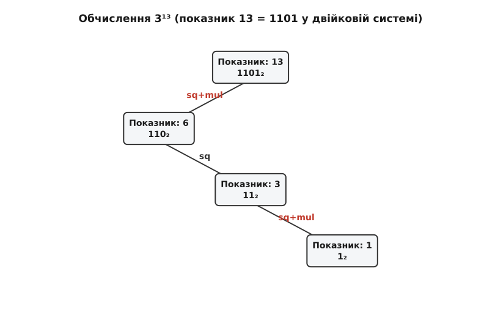

# Алгоритм швидкого піднесення до степеня (Square-and-Multiply)

<preknowlist>
  <preknow>
    <link url="/book/math/number-theory/modular-arithmetic-basics">Основи модульної арифметики</link>
    <desc>Операція mod та властивості остач при множенні</desc>
  </preknow>
  <preknow>
    <link url="/book/math/number-theory/binary-representation">Двійкове подання чисел</link>
    <desc>Подання чисел як сум степенів двійки (біти 0 та 1)</desc>
  </preknow>
</preknowlist>

> 🔧 **Навіщо це.**
> У криптографії (наприклад, алгоритм RSA або обмін ключами Діффі-Геллмана) постійно виникає потреба обчислювати вирази вигляду c = mᵏ mod n, де числа m, k та n мають розмір 2048 або 4096 бітів. Якщо підносити число m до такого гігантського степеня "в лоб" звичайним множенням, нам знадобиться понад 10⁶⁰⁰ операцій. Це фізично неможливо обчислити за час існування Всесвіту навіть на найпотужніших суперкомп'ютерах. Алгоритм Square-and-Multiply (Піднесення до квадрата і множення) розв'язує цю проблему, зводячи кількість операцій до O(log k), що дозволяє виконувати ті самі обчислення за мілісекунди.

## Фундаментальна проблема обчислення великих степенів

Математична операція піднесення до степеня визначається як багаторазове множення числа самого на себе. Для будь-якого дійсного або цілого числа a та натурального числа k вираз aᵏ означає a · a · a · ... · a, де множення виконується k-1 разів. У модульній арифметиці, з якою працює криптографія та теорія чисел, нас цікавить значення aᵏ mod m, тобто залишок від ділення цього величезного числа на модуль m.

Уявімо, що нам потрібно обчислити значення 3¹³ mod 17.
Наївний (або лінійний) спосіб обчислення полягає у тому, щоб взяти початкове число 3 і послідовно помножити його на себе 12 разів, щоразу беручи залишок від ділення на 17, аби уникнути катастрофічного зростання розміру самих чисел. 

Крок 1: 3 · 3 = 9 ≡ 9 (mod 17)
Крок 2: 9 · 3 = 27 ≡ 10 (mod 17)
Крок 3: 10 · 3 = 30 ≡ 13 (mod 17)
Крок 4: 13 · 3 = 39 ≡ 5 (mod 17)
... і так далі, аж до 13-го кроку.

Для степеня k нам знадобиться зробити k-1 модульних множень. Коли k — це невелике число (наприклад, 13 або навіть 1000), ми витрачаємо мізерну кількість процесорного часу, вимірювану мікросекундами. Проте у реальних протоколах захисту інформації (таких як TLS, що захищає HTTPS-з'єднання) показник степеня k — це величезне число. Сучасний ключ RSA часто має довжину 2048 бітів, тобто його десяткове значення сягає приблизно 10⁶¹⁷.

Якби найшвидший у світі суперкомп'ютер виконував трильйони операцій на секунду, йому знадобилися б мільярди років лише для обчислення одного піднесення до степеня лінійним методом. Кількість кроків у наївному алгоритмі зростає лінійно (прямо пропорційно) відносно значення k, тобто часова складність дорівнює O(k). А якщо оцінювати складність відносно довжини числа у бітах (позначимо її як b), то складність становить експоненціальне значення O(2ᵇ). Це обчислювальна прірва, яку неможливо подолати грубою силою. Отже, нам потрібен фундаментально інший математичний підхід, який обходить необхідність рахувати кожен одиничний крок множення.

## Ідея експоненціального стрибка: піднесення до квадрата

Основою для прориву є проста математична істина з алгебри показникових функцій: a^(b+c) = aᵇ · aᶜ, і як наслідок a^(2b) = (aᵇ)². Замість того, щоб щоразу множити поточний результат на початкову основу a (додаючи до показника лише одиницю), ми можемо підносити поточний результат до квадрата, тим самим подвоюючи показник степеня!

Цей механізм дозволяє нам неймовірно швидко досягати великих степенів, за умови, що ці степені є степенями двійки (2, 4, 8, 16, 32...). Давайте подивимося, як це працює на прикладі обчислення 3¹⁶ mod 17.

Наївний підхід вимагав би 15 множень. Натомість ми зробимо інакше:
Крок 1: 3² = 9 ≡ 9 (mod 17)
Крок 2: (3²)² = 3⁴ = 9² = 81 ≡ 13 (mod 17)
Крок 3: (3⁴)² = 3⁸ = 13² = 169 ≡ 16 (mod 17)
Крок 4: (3⁸)² = 3¹⁶ = 16² = 256 ≡ 1 (mod 17)

Замість 15 множень ми зробили лише 4 кроки! Кожне нове множення тут — це піднесення попереднього результату до квадрата. На кожному кроці показник степеня подвоюється. Ми досягли показника 16 логарифмічно швидко. Кількість необхідних кроків тут дорівнює log₂16 = 4. 

Якщо нам потрібно обчислити 3¹⁰²⁴, нам знадобиться не 1023 множення, а рівно 10 послідовних піднесень до квадрата (оскільки 2¹⁰ = 1024). Для ключа розміром 2048 бітів нам знадобиться лише 2048 піднесень до квадрата. Це вже не час життя Всесвіту, а лише долі мілісекунди на звичайному смартфоні. Це колосальний приріст продуктивності, який перетворює неможливу задачу на тривіальну. Складність алгоритму зменшується від O(k) до O(log k).

## Зведення будь-якого степеня до сум степенів двійки

Алгоритм послідовного піднесення до квадрата ідеально працює для чисел, які є степенями двійки. Але що робити, якщо показник степеня k не є точним степенем двійки? Наприклад, як обчислити 3¹³ mod 17?

Тут на допомогу приходить двійкова (бінарна) система числення. Фундаментальна теорема арифметики стверджує, що будь-яке натуральне число можна унікальним чином подати як суму різних степенів двійки. Це і є суть двійкового коду, який використовують комп'ютери.
Число 13 у двійковій системі записується як 1101₂, що означає:
13 = 1 · 2³ + 1 · 2² + 0 · 2¹ + 1 · 2⁰
13 = 8 + 4 + 0 + 1

Згідно з властивостями показникової функції, ми можемо розкласти число 3¹³ на множники:
3¹³ = 3^(8+4+1) = 3⁸ · 3⁴ · 3¹.

Це означає, що ми можемо застосувати наш трюк із послідовним піднесенням до квадрата, щоб згенерувати "будівельні блоки": 3¹, 3², 3⁴, 3⁸. А потім нам потрібно буде просто перемножити між собою ті згенеровані блоки, які відповідають одиничним бітам (1) у двійковому поданні числа 13. Блоки, що відповідають нульовим бітам (як 3² у нашому випадку), ми просто ігноруємо і не включаємо до фінального добутку.

Такий концептуальний підхід можна назвати "двопрохідною схемою". На першому етапі (проході) ми створюємо таблицю всіх потрібних квадратів, а на другому етапі — множимо їх.
Давайте подивимось на розрахунок:
Блок 0: 3¹ ≡ 3 (mod 17)  (бінарний біт 1 — беремо в результат)
Блок 1: 3² ≡ 9 (mod 17)  (бінарний біт 0 — пропускаємо)
Блок 2: 3⁴ ≡ 13 (mod 17) (бінарний біт 1 — беремо в результат)
Блок 3: 3⁸ ≡ 16 (mod 17) (бінарний біт 1 — беремо в результат)

Тепер множимо відібрані блоки:
Рішення = 3¹ · 3⁴ · 3⁸ = 3 · 13 · 16.
Обчислюємо послідовно по модулю 17:
3 · 13 = 39 ≡ 5 (mod 17)
5 · 16 = 80 ≡ 12 (mod 17)

Відповідь знайдено: 3¹³ mod 17 = 12.
Скільки всього операцій ми виконали? Для створення блоків ми використали 3 піднесення до квадрата. Для комбінування блоків — 2 множення. Сумарно 5 операцій замість 12 у лінійному методі. Хоча для числа 13 економія становить близько 50%, для числа розміром в мільйон бітів ми замінюємо 2¹⁰⁰⁰⁰⁰⁰ операцій на щонайбільше 2 мільйони множень і квадратів. Алгоритмічна складність становить чітко O(log k), оскільки кількість піднесень до квадрата дорівнює кількості бітів числа k, а кількість додаткових множень дорівнює кількості одиничних бітів у k. Максимальна кількість операцій не перевищує 2 · log₂k.

## Однопрохідні схеми обчислення (Single-pass algorithms)

Двопрохідна схема є дуже наочною для розуміння математичної логіки, проте вона не є ефективною з точки зору використання пам'яті. Щоб згенерувати блоки для 2048-бітного числа, нам доведеться зберегти в пам'яті комп'ютера 2048 величезних чисел, перш ніж ми зможемо їх перемножити. 

На практиці розробники та математики об'єднали ці два проходи в один єдиний безперервний цикл, який одночасно обчислює черговий квадрат і одразу (за потреби) множить його на накопичений результат. Існує дві основні однопрохідні схеми: "справа наліво" (Right-to-Left) та "зліва направо" (Left-to-Right). Обидві схеми виконують однакову кількість математичних операцій, проте вони обробляють бінарне подання показника степеня в різних напрямках, що має значення для апаратної реалізації та криптоаналізу.

### Схема "справа наліво" (Right-to-Left)

У цьому варіанті алгоритму ми читаємо біти показника степеня k починаючи з кінця, тобто від наймолодшого біта до найстаршого. Математично наймолодший біт числа k можна легко визначити за допомогою операції ділення з остачею (модуль) на 2, а потім можна "відкинути" цей біт, розділивши число на 2 націло. Це робить цю схему надзвичайно зручною для реалізації "на льоту", навіть якщо ми не знаємо наперед двійкового подання числа і обчислюємо його безпосередньо в циклі.

Ми підтримуємо дві змінні: 
- `result` — тут ми накопичуємо кінцеву відповідь, початкове значення дорівнює 1.
- `base` — тут ми генеруємо "будівельні блоки" a^(2^i). Початкове значення дорівнює базовому числу a.

Алгоритм обчислення r = aᵏ mod m працює так:
Поки k > 0, повторювати:
1. Якщо наймолодший біт k дорівнює 1 (тобто число k непарне, k mod 2 == 1), то ми множимо поточний `result` на поточний `base`:
   `result = (result · base) mod m`
2. Незалежно від того, який був біт, ми готуємо `base` для наступного біта, підносячи його до квадрата:
   `base = (base · base) mod m`
3. Зсуваємо k на 1 біт вправо (тобто ділимо k на 2 націло, відкидаючи залишок):
   `k = k / 2`

Давайте протрасуємо цей алгоритм для нашого прикладу 3¹³ mod 17.
Початково: result = 1, base = 3, k = 13
Крок 1:
- k=13 непарне. result = (1 · 3) mod 17 = 3
- base = (3 · 3) mod 17 = 9
- k = 13 / 2 = 6
Крок 2:
- k=6 парне. result не змінюється (залишається 3).
- base = (9 · 9) mod 17 = 81 ≡ 13 (mod 17)
- k = 6 / 2 = 3
Крок 3:
- k=3 непарне. result = (3 · 13) mod 17 = 39 ≡ 5 (mod 17)
- base = (13 · 13) mod 17 = 169 ≡ 16 (mod 17)
- k = 3 / 2 = 1
Крок 4:
- k=1 непарне. result = (5 · 16) mod 17 = 80 ≡ 12 (mod 17)
- base = (16 · 16) mod 17 = 256 ≡ 1 (mod 17)
- k = 1 / 2 = 0
Алгоритм зупиняється. Кінцевий результат: 12. Це абсолютно той самий математичний шлях, який ми пройшли в двопрохідній схемі, але без зберігання проміжних результатів.

### Схема "зліва направо" (Left-to-Right)

Схема "справа наліво" чудова, але що, якщо ми маємо справу з апаратною криптографічною мікросхемою, куди біти ключа надходять послідовно від старшого до молодшого? Тоді ми повинні читати k зліва направо. 

Тут математична логіка трохи інакша. Замість того, щоб формувати блоки a^(2^i) і додавати їх до результату, ми ініціалізуємо `result` одиницею і на кожному кроці будемо множити його самого на себе (підносити до квадрата). Якщо ж ми зустрічаємо біт 1, ми додатково множимо `result` на первісне число a.

Для кожного біта k_i показника k, починаючи від старшого до молодшого (від MSB до LSB):
1. Завжди підносимо `result` до квадрата:
   `result = (result · result) mod m`
2. Якщо поточний біт k_i дорівнює 1, множимо `result` на початкову основу a:
   `result = (result · a) mod m`

Давайте подивимось на трасування цього алгоритму для 3¹³ mod 17. 
Число 13 у двійковій системі: 1101₂. Ми ігноруємо всі нулі до першої (старшої) одиниці. Біти: 1, 1, 0, 1.
Початково: result = 1. Основа a = 3.
Крок 1 (читаємо старший біт 1):
- Квадрат: result = (1 · 1) mod 17 = 1
- Біт = 1, тому множимо: result = (1 · 3) mod 17 = 3
(Зауважте: зазвичай цей перший крок оптимізують і просто ініціалізують result = a, переходячи до наступного біта).
Крок 2 (читаємо наступний біт 1):
- Квадрат: result = (3 · 3) mod 17 = 9
- Біт = 1, тому множимо: result = (9 · 3) mod 17 = 27 ≡ 10 (mod 17)
Крок 3 (читаємо наступний біт 0):
- Квадрат: result = (10 · 10) mod 17 = 100 ≡ 15 (mod 17)
- Біт = 0, множення не виконується.
Крок 4 (читаємо наймолодший біт 1):
- Квадрат: result = (15 · 15) mod 17 = 225 ≡ 4 (mod 17)
- Біт = 1, тому множимо: result = (4 · 3) mod 17 = 12 (mod 17)

Результат знову дорівнює 12! Але шлях обчислення був зовсім іншим. Ми не накопичували множники типу 3², 3⁴ тощо. Ми постійно модифікували єдину змінну `result`.

Схема "зліва направо" має одну унікальну апаратну перевагу: додаткове множення відбувається завжди на константу (на початкову основу a), на відміну від схеми "справа наліво", де ми постійно множимо `result` на `base`, яке змінюється на кожній ітерації. Множення на фіксовану константу a в багатьох архітектурах мікроконтролерів і співпроцесорів можна оптимізувати набагато ефективніше (наприклад, використовуючи Montgomery Multiplication зі сталою базою).

## Проблема побічних каналів (Side-Channel Attacks) та криптографічні загрози

Теоретично алгоритм Square-and-Multiply є досконалим з точки зору математики, забезпечуючи швидкість і безпомилковість. Однак, перехід від абстрактної математики до фізичних мікросхем виявляє критичну вразливість класичних імплементацій.

Суть проблеми полягає в логічному операторі умови, який ми застосовуємо в обох схемах: 
`Якщо поточний біт дорівнює 1, зробити додаткове множення`.

Уявіть процесор смарт-картки, який виконує операцію дешифрування RSA. Процесор споживає електричну енергію, і кількість цієї енергії безпосередньо пропорційна кількості математичних операцій, які він виконує. Коли біт показника степеня (секретного ключа) дорівнює 0, процесор виконує лише одну операцію (піднесення до квадрата). Коли біт дорівнює 1, процесор виконує дві операції підряд (квадрат, а потім множення). 

Якщо зловмисник приєднає високоточний осцилограф до контактів живлення мікросхеми, він зможе записати графік споживання енергії (SPA - Simple Power Analysis). На цьому графіку будуть чітко видно короткі та довгі піки споживання струму. Короткий пік означає, що процесор опрацював біт `0`. Довгий пік із двома "горбами" (від двох послідовних множень) вказує на біт `1`. Таким чином, вимірюючи фізичні побічні явища (час або струм), хакер може візуально, біт за бітом, прочитати весь ваш таємний ключ RSA без будь-якої потреби у математичному зломі шифру. Такі атаки називаються атаками по побічних каналах (Side-Channel Attacks).

Це змусило математиків шукати нові шляхи обчислення степенів. Класичний Square-and-Multiply був модифікований таким чином, щоб стати алгоритмом постійного часу (constant-time algorithm), який виконує абсолютно ідентичні набори команд незалежно від того, чи дорівнює біт нулю, чи одиниці.

### "Сліпе" множення (Dummy operations)

Найбільш очевидним рішенням є модифікація алгоритму "зліва направо" таким чином, щоб множення виконувалося завжди. Для цього ми створюємо додаткову тимчасову (фіктивну) змінну. Якщо біт дорівнює 1, ми зберігаємо результат множення у справжній `result`. Якщо біт дорівнює 0, ми робимо те саме множення `result · a`, але зберігаємо його у сміттєву змінну `dummy`, яку потім просто перезаписуємо на наступному кроці.

Для процесора кожна ітерація циклу тепер виглядає монолітно: один квадрат і одне множення. Енергетичний та часовий профілі стають нерозрізними для бітів 0 та 1. Проте ця "наївна" спроба захисту може бути подолана складнішими атаками (DPA - Differential Power Analysis, або Fault Injection), оскільки досвідчений криптоаналітик може помітити різницю у регістрах, куди записуються дані. До того ж компілятори мов програмування часто занадто "розумні" — побачивши, що результат записується в `dummy` і більше ніде не використовується, компілятор просто викидає цей рядок коду під час оптимізації!

### Алгоритмічний захист: Сходи Монтгомері (Montgomery Ladder)

Більш досконалим математичним розв'язанням цієї апаратної проблеми є алгоритм, розроблений Пітером Монтгомері, відомий як Сходи Монтгомері (Montgomery Ladder). Це принципово інша схема обчислення піднесення до степеня, яка імплементується у криптографії на еліптичних кривих (ECC).

Детально Сходи Монтгомері розглядаються у відповідному поглибленні, але суть полягає у використанні двох взаємопов'язаних змінних стану (R₀ та R₁). Незалежно від того, яким є поточний біт, алгоритм ЗАВЖДИ здійснює одне повноцінне піднесення до квадрата і одне повноцінне множення двох незалежних змінних. Різниця між бітом 1 і 0 полягає лише в тому, які саме змінні підставляються в які операції. Це не фіктивні множення — усі результати є необхідними для подальшого обчислення, тому компілятори їх не викидають, а процесор постійно завантажений справжньою роботою. Часова та енергетична дельти зникають на фундаментальному алгоритмічному рівні, а не лише шляхом маскування.

## Висновки

Алгоритм швидкого піднесення до степеня — це один із найфундаментальніших алгоритмів в обчислювальній математиці. Його здатність обчислювати вирази aᵏ mod m за час O(log k) перетворила нерозв'язну задачу на операцію, що виконується за долі секунди навіть для надзвичайно гігантських чисел. 

Ця неймовірна ефективність базується на властивостях двійкової системи числення. Здатність комп'ютерів легко оперувати бітами, розкладати числа на суми степенів двійки, виконувати арифметичні зсуви замість ділення — усе це робить Square-and-Multiply не просто математично елегантним, але й апаратно ідеальним.

Схеми читання бітів (справа наліво та зліва направо) є математично рівносильними. У той же час, як показала історія криптографічних атак, недостатньо мати алгоритм, який є математично коректним і швидким. Його фізична реалізація повинна враховувати суворі реалії мікросхем. Еволюція цього алгоритму в захищені варіанти, такі як Сходи Монтгомері, показує, як математика постійно адаптується до інженерних викликів. Розуміння логіки та вразливостей цього алгоритму є необхідною базою для розробки будь-яких криптографічних систем сучасного цифрового світу.
