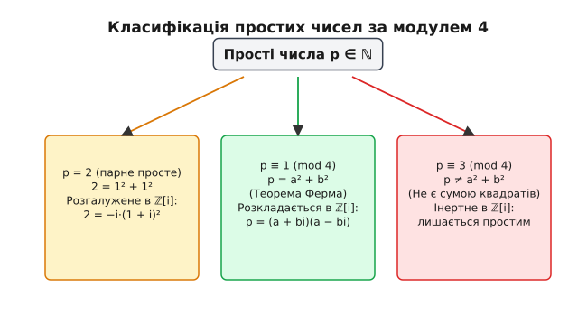

# Сума двох квадратів (теорема Ферма)

<preknowlist>
- [Подільність та залишки](topic:math/quadratic-residues)
- [Мала теорема Ферма](topic:math/fermat-little-theorem)
- [Основна теорема арифметики](topic:math/fundamental-theorem-arithmetic)
</preknowlist>

Задача про подання цілого натурального числа `n` у вигляді суми двох квадратів цілих чисел `a² + b² = n` належить до фундаментальних діофантових проблем теорії чисел. На перший погляд, це просто питання про те, чи можна викласти квадратну сітку розміром `n` з двох менших квадратів зі цілочисловими сторонами `a` та `b`. Однак за цим простим геометричним та арифметичним формулюванням ховається глибинний зв'язок між модульною арифметикою, факторизацією в розширеннях цілих чисел, алгебраїчними структурами Ґаусса та геометрією точкових ґраток.

Зв'язок із класичною геометрією простежується ще від прадавніх часів: сума двох квадратів `a² + b² = c²` визначає довжину гіпотенузи прямокутного трикутника за теоремою Піфагора. Якщо у піфагорових трійках шукаються квадрати, сума яких дає точний квадрат `c²`, то діофантова задача про суму двох квадратів розширює це питання на **довільні** цілі числа `n`: які саме натуральні числа припускають розклад `n = a² + b²`, скільки існує таких розкладів та як їх обчислити.

Розгляд цього рівняння вимагає відповіді на два ключових питання: які саме натуральні числа `n` припускають хоча б один розклад `a² + b² = n`, і якщо такий розклад існує, то скільки існує різних пар `(a, b)` та як їх ефективно обчислити для великих значень `n`.

## Модульний бар'єр: аналіз остач за модулем 4 та 8

Найпростіший та водночас найпотужніший первинний фільтр для діофантова рівняння `a² + b² = n` дає модульна арифметика за модулем 4. Будь-яке ціле число `a` можна подати в одному з чотирьох лишкових класів: `a ≡ 0, 1, 2, 3 (mod 4)`.

Підносячи кожне з цих значень до квадрата, отримуємо:

```
0² = 0 ≡ 0 (mod 4)
1² = 1 ≡ 1 (mod 4)
2² = 4 ≡ 0 (mod 4)
3² = 9 ≡ 1 (mod 4)
```

Таким чином, квадрат будь-якого цілого числа за модулем 4 може дорівнювати лише `0` або `1`. Це означає, що квадрати цілих чисел ніколи не дають остачу 2 або 3 при діленні на 4.

Якщо розглянути всі можливі суми двох квадратів `a² + b² (mod 4)`, ми отримуємо вичерпний перелік комбінацій остач:

```
0 + 0 ≡ 0 (mod 4)  [наприклад, 0² + 0² = 0, 2² + 4² = 20]
0 + 1 ≡ 1 (mod 4)  [наприклад, 0² + 1² = 1, 2² + 1² = 5]
1 + 0 ≡ 1 (mod 4)  [наприклад, 1² + 0² = 1, 3² + 2² = 13]
1 + 1 ≡ 2 (mod 4)  [наприклад, 1² + 1² = 2, 1² + 3² = 10]
```

З цієї таблиці випливає фундаментальний модульний результат: сума двох квадратів цілих чисел за модулем 4 може дорівнювати лише `0`, `1` або `2`.

Звідси негайно отримуємо перший строгий негативний критерій: жодне ціле число `n`, яке дає остачу 3 при діленні на 4 (`n ≡ 3 (mod 4)`), неможливо подати у вигляді суми двох квадратів цілих чисел.

Наприклад, числа `3, 7, 11, 15, 19, 23, 27, 31` принципово не мають розкладу `a² + b² = n`. Жодні обчислювальні зусилля чи пошук серед мільярдів комбінацій не зможуть знайти цілі квадрати для цих чисел, оскільки вони натрапляють на абсолютний модульний бар'єр.

Розглянемо також порівняння за модулем 8. Квадрати цілих чисел за модулем 8 можуть дорівнювати лише `0`, `1` або `4` (оскільки `0²=0`, `1²=1`, `2²=4`, `3²=1`, `4²=0`). Тоді можливі остачі для суми двох квадратів за модулем 8 включають лише значення `{0, 1, 2, 4, 5}`. Звідси випливає, що числа вида `n ≡ 3, 6, 7 (mod 8)` також принципово блукають поза можливостями розкладу.

Проте виникає зворотне запитання: чи достатньо для поданості числа `n` у вигляді суми двох квадратів того, щоб `n ≢ 3 (mod 4)`? Розгляд числа `n = 6 ≡ 2 (mod 4)` (та `6 ≡ 6 (mod 8)`) показує, що відповідь негативна: `6` не є сумою двох квадратів, оскільки квадрати `0, 1, 4` не дають у сумі 6. Отже, для повного розв'язання задачі аналізу лише модулів 4 або 8 недостатньо, і необхідно дослідити глибоку структуру простих множників числа `n`.

## Мультиплікативність та тотожність Брахмагупти-Фібоначчі

Центральною алгебраїчною властивістю суми двох квадратів є її мультиплікативність. Якщо два цілих числа `m` та `n` можна подати у вигляді суми двох квадратів, то їхній добуток `m · n` також обов'язково є сумою двох квадратів.

Цей факт спирається на тотожність Брахмагупти-Фібоначчі, відкриту індійським математиком Брахмагуптою у VII столітті та перевідкриту Фібоначчі у 1225 році:

```
(a² + b²)(c² + d²) = (ac - bd)² + (ad + bc)²
```

Перевіримо цю тотожність прямою алгебраїчною підстановкою та розкриттям дужок:

```
(a² + b²)(c² + d²) = a²c² + a²d² + b²c² + b²d²
```

З іншого боку, розгортаємо праву частину тотожності:

```
(ac - bd)² + (ad + bc)² = (a²c² - 2abcd + b²d²) + (a²d² + 2abcd + b²c²)
                        = a²c² + b²d² + a²d² + b²c²
```

Обидва вирази повністю тотожні, оскільки перехресні подвоєні добутки `-2abcd` та `+2abcd` взаємно знищуються.

Крім того, існує друга парна форма цієї тотожності зі зміною знаків у дужках:

```
(a² + b²)(c² + d²) = (ac + bd)² + (ad - bc)²
```

Наявність двох форм показує, що при множенні двох сум квадратів ми взагалі кажучи отримуємо **два різних** розклади для добутку. Проілюструємо це на конкретному чисельному прикладі.

Розглянемо числа `m = 5 = 1² + 2²` (де `a=1, b=2`) та `n = 13 = 2² + 3²` (де `c=2, d=3`). Їхній добуток дорівнює `m · n = 65`.

Застосуємо першу форму тотожності:
```
ac - bd = 1·2 - 2·3 = 2 - 6 = -4  ⇒  (-4)² = 16
ad + bc = 1·3 + 2·2 = 3 + 4 = 7   ⇒  7² = 49
16 + 49 = 65 = 4² + 7²
```

Застосуємо другу форму тотожності:
```
ac + bd = 1·2 + 2·3 = 2 + 6 = 8   ⇒  8² = 64
ad - bc = 1·3 - 2·2 = 3 - 4 = -1  ⇒  (-1)² = 1
64 + 1 = 65 = 8² + 1²
```

Таким чином, число `65` отримує одразу два цілочислові розклади: `65 = 4² + 7² = 8² + 1²`.

На глибокому алгебраїчному рівні тотожність Брахмагупти-Фібоначчі є прямою ілюстрацією мультиплікативності норми комплексних чисел. Якщо визначити комплексні числа `u = a + bi` та `v = c + di`, то їхні квадратні норми дорівнюють `N(u) = a² + b²` та `N(v) = c² + d²`. З огляду на те, що норма добутку комплексних чисел дорівнює добутку їхніх норм `N(u · v) = N(u) · N(v)`, розкриття добутку `u · v = (ac - bd) + (ad + bc)i` дає саме першу тотожність, а множення `u · v̄` дає другу тотожність.

Завдяки мультиплікативності задачу розкладу довільного складеного числа `n` можна повністю звести до аналізу його простих множників. Якщо ми знаємо розклади для простих множників числа `n`, ми можемо каскадно об'єднати їх за тотожністю Брахмагупти-Фібоначчі й отримати розклад для самого числа `n`.

Цікаво зазначити, що тотожність Брахмагупти-Фібоначчі належить до сімейства нормальних алгебраїчних тотожностей: Ейлер пізніше узагальнив її на суму чотирьох квадратів (тотожність Ейлера для кватерніонів), а Деген та Грейвс — на суму восьми квадратів (октави Келі). За теоремою Гурвіца, такі тотожності існують лише для розмірностей 1, 2, 4 та 8.

Детальний аналіз розвитку цієї тотожності та її історичного шляху від давньоіндійських текстів до праць Ейлера наведено у вставці [Історія відкриття та доведення теореми про суму двох квадратів](topic:math/sum-of-two-squares/hist-fermat-euler-squares.md).

## Теорема Ферма про суму двох квадратів для простих чисел

Оскільки будь-яке натуральне число розкладається на прості множники, ключем до всієї теорії є поведінка простих чисел при розкладі на суму двох квадратів.

Усі прості числа за їхнім відношенням до модуля 4 розділяються на три взаємовиключні категорії:

1. **Парне просте число `p = 2`**: Подається у вигляді `2 = 1² + 1²`. Це єдине парне просте число.
2. **Прості числа вида `p ≡ 1 (mod 4)`**: Наприклад, `5, 13, 17, 29, 37, 41, 53, 61, 73, 89, 97`. Вони називаються розщеплюваними або ферматівськими простими числами.
3. **Прості числа вида `q ≡ 3 (mod 4)`**: Наприклад, `3, 7, 11, 19, 23, 31, 43, 47, 67, 71, 79, 83`. Вони називаються інертними простими числами.

Німецько-французький математик П'єр де Ферма у 1640 році сформулював фундаментальну теорему, яка дає вичерпну характеристику простих чисел:

> **Теорема Ферма про суму двох квадратів:** Непарне просте число `p` можна подати у вигляді суми двох цілих квадратів `p = a² + b²` тоді й лише тоді, коли `p ≡ 1 (mod 4)`. При цьому такий розклад є єдиним з точністю до порядку та знаків доданків `a` і `b`.

Структуру класифікації простих чисел за модулем 4 наочно показано на діаграмі нижче:


*Класифікація простих чисел за остачею від ділення на 4: поділ на розщеплені прості числа p ≡ 1 (mod 4) та інертні прості числа q ≡ 3 (mod 4).*

Доведення теореми Ферма складається з двох частин: необхідності та достатності.

Необхідність умови `p ≡ 1 (mod 4)` вже доведено вище модульним аналізом: якщо `p = a² + b²` є непарним простим числом, то одна з компонент `a` чи `b` обов'язково є парною, а інша непарною. Тому `a² + b² ≡ 0 + 1 = 1 (mod 4)`.

Доведення достатності є значно глибшим і спирається на наявність квадратичного кореня з `-1` за модулем `p`. Для будь-якого простого числа `p ≡ 1 (mod 4)` за критерієм Ейлера символ Лежандра від `-1` дорівнює:

```
(-1 / p) ≡ (-1)^((p-1)/2) = (-1)^(2k) = 1 (mod p)
```

Це означає, що порівняння `x² ≡ -1 (mod p)` обов'язково має розв'язок у цілих числах `x`. Отже, існує таке ціле число `x`, що `x² + 1` ділиться на `p` націло (тобто `x² + 1 = m · p` для деякого цілого `m`).

Отримавши таке вихідне рівняння `x² + 1² = m · p`, Лежандр, Ейлер, Ґаусс та Мінковський розробили різні алгоритмічні та геометричні шляхи для зменшення множника `m` до `1`.

Леонхард Ейлер застосував метод нескінченного спуску: якщо `x² + y² = m · p` з `1 < m < p`, то можна побудувати нову пару цілих чисел `(x', y')`, таку що `x'² + y'² = m' · p`, де `1 ≤ m' < m`. Послідовне зменшення множника `m` за скінченну кількість кроків гарантовано приводить до `m = 1`, тобто до шуканого розкладу `a² + b² = p`.

Інший надзвичайно геометричний підхід запропонував Герман Мінковський у рамках своєї геометрії чисел. Якщо побудувати у двовимірному просторі ґратку точок `(u, v) ∈ ℤ²`, задовольняючих порівняння `u ≡ x · v (mod p)`, то площа фундаментальної комірки цієї ґратки дорівнює `p`. Круг радіуса `r = √(1.9 p)` є центрально-симетричним опуклим тілом площею `π r² = 1.9 π p > 4p`. За теоремою Мінковського про опукле тіло, в цьому крузі обов'язково знайдеться ненульова точка ґратки `(a, b) ≠ (0, 0)`. Для цієї точки `a² + b² ≡ (xv)² + b² = v²(x² + 1) ≡ 0 (mod p)`. З іншого боку, відстань до точки менша за `r`, тому `0 < a² + b² < 1.9 p`. Єдиним кратним `p` у цьому інтервалі є саме `1 · p`, отже `a² + b² = p`.

Детальні математичні виведення методу нескінченного спуску Ейлера, леми Тюе та однорядкового доведення Загіра наведено у вставці [Метод нескінченного спуску та алгебраїчне доведення теореми Ферма](topic:math/sum-of-two-squares/math-descent-proof.md).

## Повна критеріальна теорема для довільного натурального числа n

Знаючи поведінку всіх простих чисел, ми можемо сформулювати та довести повну критеріальну теорему для довільного цілого натурального числа `n`.

> **Основна теорема (Критерій поданості числа у вигляді суми двох квадратів):** Натуральне число `n > 1` можна подати у вигляді суми двох цілих квадратів `n = a² + b²` тоді й лише тоді, коли у його канонічному розкладі на прості множники:
> ```
> n = 2^k · ∏ p_i^(e_i) · ∏ q_j^(f_j)
> ```
> (де `p_i ≡ 1 (mod 4)`, а `q_j ≡ 3 (mod 4)`) кожен показник степеня `f_j` для інертних простих чисел `q_j ≡ 3 (mod 4)` є **парним числом**.

### Доведення достатності критерію

Нехай канонічний розклад числа `n` задовольняє вказану умову. Тоді всі прості множники вида `q_j ≡ 3 (mod 4)` входять у парних степенях `f_j = 2m_j`.

Ми можемо винести всі парні степені за дужки у вигляді точного квадрата цілого числа `C`:

```
C = 2^(⌊k/2⌋) · ∏ q_j^(m_j)
```

Тоді число `n` подається у вигляді `n = C² · M`, де залишковий множник `M` складається лише з числа `2` (якщо `k` є непарним) та простих чисел вида `p_i ≡ 1 (mod 4)` у степенях `e_i`:

```
M = 2^(k mod 2) · ∏ p_i^(e_i)
```

Оскільки число `2 = 1² + 1²` є сумою двох квадратів, і кожне просте число `p_i ≡ 1 (mod 4)` за теоремою Ферма є сумою двох квадратів `p_i = a_i² + b_i²`, за тотожністю Брахмагупти-Фібоначчі їхній добуток `M` також є сумою двох квадратів `M = A² + B²`.

Вимножуючи отримані квадрати на `C²`, маємо:

```
n = C² · (A² + B²) = (C · A)² + (C · B)²
```

Отже, число `n` успішно подано у вигляді суми двох цілих квадратів `n = a² + b²`, де `a = C · A` та `b = C · B`.

### Доведення необхідності критерію

Припустимо протилежне: нехай число `n = a² + b²` має у своєму розкладі деяке просте число `q ≡ 3 (mod 4)` у **непарному** степені `f`.

Нехай `d = gcd(a, b)` — найбільший спільний дільник чисел `a` та `b`. Скоротивши `a` та `b` на `d`, ми отримуємо `a = d · a'`, `b = d · b'`, де `gcd(a', b') = 1`.

Тоді рівняння набирає вигляду:

```
d² · (a'² + b'²) = n
```

Нехай `q^v` — найвища степінь числа `q`, яка ділить `d`. Тоді `d²` ділиться на `q^(2v)`. Оскільки загальна степінь `f` у числі `n` є непарною (`f = 2v + 1 + 2m`), то після ділення `n` на `d²` залишкове число `n' = a'² + b'²` все ще ділиться на `q`.

Отже, маємо порівняння:

```
a'² + b'² ≡ 0 (mod q)  ⇒  a'² ≡ -b'² (mod q)
```

Якщо `q` не ділить `b'`, ми можемо помножити обидві частини порівняння на квадрат оберненого елемента `(b')⁻¹ mod q`, що дає:

```
(a' · (b')⁻¹)² ≡ -1 (mod q)
```

Це означає, що `-1` є квадратичним залишком за модулем `q`. Проте це суперечить критерію Ейлера, оскільки для `q ≡ 3 (mod 4)` символ Лежандра дорівнює:

```
(-1 / q) ≡ (-1)^((q-1)/2) = (-1)^(2k + 1) = -1 (mod q)
```

Отримана суперечність показує, що `q` зобов'язане ділити `b'`, а отже й `a'`, що суперечить умові `gcd(a', b') = 1`. Отже, просте число `q ≡ 3 (mod 4)` не може входити до суми двох взаємно простих квадратів, а у загальному розкладі воно може з'явитися лише у складі спільного множника `d²`, тобто у парному степені. Отримано повне доведення.

### Численні приклади розкладу

Проілюструємо дію критеріальної теореми на конкретних числах:

1. **`n = 45`**: Факторизація: `45 = 3² · 5¹`. Просте число `3 ≡ 3 (mod 4)` входить у парному степені `3²`. Подання можливе: `45 = 3² + 6² = 9 + 36`.
2. **`n = 21`**: Факторизація: `21 = 3¹ · 7¹`. Обидва прості числа `3` та `7` мають вигляд `3 (mod 4)` і входять у непарних степенях 1. Подання неможливе.
3. **`n = 1105`**: Факторизація: `1105 = 5 · 13 · 17`. Усі прості множники мають вигляд `1 (mod 4)`. Число `1105` є найменшим числом, яке має 4 резонно різних цілих розклади на суму двох квадратів (з точністю до перестановки та знаків): `1105 = 9² + 32² = 12² + 31² = 23² + 24² = 4² + 33²`.
4. **`n = 650`**: Факторизація: `650 = 2¹ · 5² · 13¹`. Інертні прості числа відсутні. Число має два різні розклади: `650 = 11² + 23² = 121 + 529` та `650 = 17² + 19² = 289 + 361`.

## Алгебраїчна структура ℤ[i] та кількість розкладів r₂(n)

Глибинне розуміння суми двох квадратів відкривається при переході від кільця звичайних цілих чисел `ℤ` до кільця цілих чисел Ґаусса `ℤ[i]`:

```
ℤ[i] = {a + bi | a, b ∈ ℤ, i² = -1}
```

Кільце `ℤ[i]` є евклідовим кільцем із нормою `N(a + bi) = a² + b²`. Оскільки в евклідових кільцях виконується аналог алгоритму Евкліда, в `ℤ[i]` справджується **основна теорема арифметики**: кожен елемент кільця Ґаусса однозначно (з точністю до множення на дільники одиниці `±1, ±i`) розкладається на прості гауссові множники. Множення на `i` відповідає геометрії повертання комплексної площини на `90°`, а спряження `a - bi` — дзеркальному відображенню відносно дійсної осі.

Норма елемента `N(a + bi) = a² + b²` переводить задачу знаходження розкладу `n = a² + b²` у задачу знаходження елементів `α ∈ ℤ[i]` із заданою нормою `N(α) = n`.

Точкова ґратка цілих чисел Ґаусса на комплексній площині та її геометричний зв'язок із колами радіуса `√n` показані на малюнку нижче:

![Гратка цілих чисел Ґаусса ℤ[i] та кола радіуса √n](/book/math/number-theory/sum-of-two-squares/img/gaussian-lattice.svg)
*Точкова ґратка цілих чисел Ґаусса ℤ[i] на комплексній площині. Всі цілочислові розклади n = a² + b² відповідають точкам перетину ґратки з колом радіуса √n.*

Поведінка звичайних простих чисел при переході до кільця Ґаусса `ℤ[i]` повністю відображає сформульовану вище класифікацію:

1. **Число `2` розгалужується (ramifies)**: `2 = -i(1 + i)²`. Елемент `1 + i` є простим гауссовим числом норми 2.
2. **Прості числа `p ≡ 1 (mod 4)` розщеплюються (split)**: `p = (a + bi)(a - bi) = π · π̄`. Вони розкладаються на два сопряжених простих гауссових множники `π` та `π̄` з нормою `N(π) = p`.
3. **Прості числа `q ≡ 3 (mod 4)` залишаються інертними (remain inert)**: Вони залишаються простими елементами в кільці `ℤ[i]` з нормою `N(q) = q²`.

### Числова функція r₂(n) та формула Якобі

Позначимо через `r₂(n)` кількість усіх можливих впорядкованих пар цілих чисел `(a, b) ∈ ℤ²`, таких що `a² + b² = n`. Враховуються як додатні, так і від'ємні значення `a` і `b`, а також їхній порядок.

Наприклад, для `n = 5` існує 8 розкладів:
`(1, 2), (2, 1), (-1, 2), (-2, 1), (1, -2), (-1, -2), (2, -2), (-2, -1)`. Отже, `r₂(5) = 8`.

Спираючись на єдиність факторизації в кільці `ℤ[i]`, математики вивели точну числово-теоретичну формулу для `r₂(n)` через арифметичні дільники:

> **Формула Якобі для r₂(n):** Кількість розкладів числа `n` на суму двох квадратів дорівнює:
> ```
> r₂(n) = 4 · (d₁(n) - d₃(n))
> ```
> де `d₁(n)` — кількість дільників числа `n`, які дають остачу 1 при діленні на 4 (`d ≡ 1 (mod 4)`), а `d₃(n)` — кількість дільників числа `n`, які дають остачу 3 при діленні на 4 (`d ≡ 3 (mod 4)`).

Множник 4 у цій формулі відповідає чотирьом одиницям кільця Ґаусса (`1, -1, i, -i`), які задають обертання комплексної площини на `0°, 90°, 180°, 270°`.

Якщо число `n` має факторизацію `n = 2^k · ∏ p_i^(e_i) · ∏ q_j^(f_j)`, де всі `f_j` є парними, то значення `r₂(n)` дорівнює добутку:

```
r₂(n) = 4 · ∏ (e_i + 1)
```

Це показує, що кількість розкладів не залежить ані від степеня `k` при числі 2, ані від парних степеней інертних простих чисел `q_j`, а повністю визначається степенями ферматівських простих чисел `p_i ≡ 1 (mod 4)`.

### Побудова всіх розкладів для складеного числа

Для побудови всіх `r₂(n)` розкладів для складеного числа `n` застосовується наступна комбінаторна процедура у кільці Ґаусса `ℤ[i]`:

1. Проводиться канонічна факторизація `n = 2^k · ∏ p_i^(e_i) · ∏ q_j^(f_j)`.
2. Для кожного простого множника `p_i ≡ 1 (mod 4)` знаходиться його простий гауссів дільник `π_i = a_i + b_i i` (наприклад, за допомогою алгоритму Корнакк’ї).
3. Побудуємо комплексний елемент `α ∈ ℤ[i]` у вигляді:
   ```
   α = (1 + i)^k · (∏ q_j^(f_j / 2)) · ∏ (π_i^(s_i) · π̄_i^(e_i - s_i))
   ```
   де показники `s_i` перебирають усі можливі значення від `0` до `e_i`.
4. Вимножуючи розкриттям дужок `α = A + B i`, отримуємо координати `a = A` та `b = B`.
5. Множення `α` на чотири одиниці `1, -1, i, -i` розмножує кожну пару на 4 відповідні знакові ортогональні координати.

### Проблема кола Ґаусса (Gauss Circle Problem)

Також формула Якобі дає важливий асимптотичний висновок для середнього значення функцій `r₂(n)`. Обчислення сумарної кількості точок точкової ґратки у крузі радіуса `R = √N` дає відому геометричну проблему кола Ґаусса:

```
N(R) = ∑_{k=1}^N r₂(k) = π · R² + E(R)
```

Головний член цієї формули `π · R²` дорівнює площі круга радіуса `R`. Помилка границі `E(R)` задається точками, розташованими поблизу межі кола. Сам Ґаусс довів, що `E(R) = O(R)`. Сучасна аналітична теорія чисел (праці Хакслі) покращила цю оцінку до `E(R) = O(R^(131/208))`, а гіпотеза Харді-Ландау стверджує, що точна межа помилки дорівнює `O(R^(1/2 + ε))`.

Це означає, що середня кількість розкладів на суму двох квадратів для випадкового цілого числа на інтервалі від 1 до `N` прямує до математичної константи `π ≈ 3.14159...`.

### Дзета-функція Дедекінда та L-функції Діріхле

У сучасній аналітичній теорії чисел формула Якобі для `r₂(n)` має фундаментальне узагальнення через ряди Діріхле.

Розглянемо нетривіальний квадратичний характер Діріхле за модулем 4:

```
χ₄(n) = 1,  якщо n ≡ 1 (mod 4)
χ₄(n) = -1, якщо n ≡ 3 (mod 4)
χ₄(n) = 0,  якщо n є парним (n ≡ 0 mod 2)
```

За допомогою цього характеру формула Якобі записується у вигляді згортки: `r₂(n) = 4 · (1 * χ₄)(n)`.

Якщо побудувати відповідну L-функцію Діріхле `L(s, χ₄) = ∑_{n=1}^∞ χ₄(n) / n^s`, то виробнича функція для коефіцієнтів `r₂(n)` факторизується у добуток звичайної дзета-функції Рімана `ζ(s)` та L-функції `L(s, χ₄)`:

```
∑_{n=1}^∞ r₂(n) / n^s = 4 · ζ(s) · L(s, χ₄) = 4 · ζ_{ℚ(i)}(s)
```

де `ζ_{ℚ(i)}(s)` — це дзета-функція Дедекінда числового поля `ℚ(i)` гауссових чисел. Значення цієї L-функції у точці `s = 1` дає знамениту формулу Лейбніца для числа `π`:

```
L(1, χ₄) = 1 - 1/3 + 1/5 - 1/7 + 1/9 - ... = π / 4
```

Цей дивовижний зв'язок є прямим доведенням того, чому саме геометрія кола та число `π` нерозривно пов'язані з числом розкладів на суму двох квадратів.

## Зв'язок із квадратичними формами та теорією полів класів

У своїх класичних працях «Disquisitiones Arithmeticae» (1801 рік) Карл Фрідріх Ґаусс побудував узагальнену теорію бінарних квадратичних форм:

```
f(x, y) = A · x² + B · x · y + C · y²
```

Задача про суму двох квадратів у цій теорії відповідає головній формації `f(x, y) = x² + y²`, яка має коефіцієнти `A = 1, B = 0, C = 1` та дискримінант:

```
D = B² - 4AC = 0² - 4·1·1 = -4
```

Ґаусс ввів поняття еквівалентності квадратичних форм відносно дій унімодулярної групи `SL(2, ℤ)`. Дві форми називаються еквівалентними, якщо одна переходить в іншу за допомогою цілочислової заміни змінних з детермінантом 1.

Кількість нееквівалентних класів додатньо визначених квадратичних форм даного дискримінанта `D` називається числом класів `h(D)`. Для дискримінанта `D = -4` число класів дорівнює точно одиниці:

```
h(-4) = 1
```

Те, що `h(-4) = 1`, є глибинною алгебраїчною причиною того, чому кільце цілих чисел Ґаусса `ℤ[i]` є факторіальним (має єдиність розкладу на прості множники), і чому розклад простого числа `p ≡ 1 (mod 4)` на суму двох квадратів є **єдиним** з точністю до знаків та порядку доданків. Для дискримінантів із `h(D) > 1` єдиність розкладу порушується.

У теорії полів класів (Class Field Theory) розклад простих чисел описується через групу класів ідеалів `Pic(ℤ[i])`. Оскільки `Pic(ℤ[i])` є тривіальною групою порядку 1, уявне квадратичне поле `ℚ(i)` не має нерозгалужених абелевих розширень, що робить його алгебраїчну арифметику ідеально аналогічною звичайній арифметиці цілих чисел.

Ейлер та Ґаусс розтулили подібні критерії поданості для інших квадратичних форм з від'ємними дискримінантами:
- `a² + 2b² = p` припускає розклад тоді й лише тоді, коли `p ≡ 1, 3 (mod 8)`.
- `a² + 3b² = p` припускає розклад тоді й лише тоді, коли `p = 3` або `p ≡ 1 (mod 3)`.
- `a² + 5b² = p` вимагає складнішого критерію за модулями 20, оскільки число класів для `D = -20` дорівнює `h(-20) = 2`.

## Аналіз крайових випадків та раціональні квадрати

При розв'язанні діофантових рівнянь важливо детально проаналізувати крайові випадки та межі застосовності алгоритмів:

1. **Значення `n = 0`**: `0 = 0² + 0²`. Це єдиний розклад, який дає `r₂(0) = 1` (лише пара `(0, 0)`).
2. **Значення `n = 1`**: `1 = (±1)² + 0² = 0² + (±1)²`. Дає `r₂(1) = 4` розклади.
3. **Значення `n = 2`**: `2 = (±1)² + (±1)²`. Дає `r₂(2) = 4` розклади.
4. **Непарні степені інертних простих чисел `q ≡ 3 (mod 4)`**: Якщо `n` ділиться на `q^(2k+1)`, розклад у цілих числах `a, b ∈ ℤ` є абсолютно неможливим.

Проте якщо розширити область розв'язків від цілих чисел `ℤ` до раціональних чисел `ℚ`, картина кардинально змінюється.

> **Теорема про раціональні квадрати:** Натуральне число `n` можна подати у вигляді суми двох квадратів раціональних чисел `n = x² + y²` (де `x, y ∈ ℚ`) тоді й лише тоді, коли `n` можна подати у вигляді суми двох квадратів цілих чисел (`n = a² + b²`, `a, b ∈ ℤ`).

Це свідчить про те, що перехід до раціональних чисел не додає нових подаваних чисел `n`. Якщо число `n` має розклад у раціональних квадратах `n = (a/c)² + (b/d)²`, то після зведення до спільного знаменника та застосування p-адичних оцінок (або символу Гільберта) з'ясовується, що інертні прості числа `q ≡ 3 (mod 4)` все одно мусять входити у парних степенях, що гарантує наявність суто цілочислового розкладу.

## Узагальнення: теореми про три та чотири квадрати та проблема Варінга

Задача про подання чисел у вигляді суми квадратів природно розширюється на більшу кількість доданків та вищі степені:

1. **Сума двох квадратів (`a² + b² = n`)**: Подаються лише ті числа, де прості `q ≡ 3 (mod 4)` входять у парних степенях (приблизно `45%` усіх натуральних чисел).
2. **Сума трьох квадратів (`a² + b² + c² = n`)**: За теоремою Гаусса-Лежандра, число `n` подається у вигляді суми трьох квадратів тоді й лише тоді, коли воно **не** має вигляду:
   ```
   n = 4^a · (8k + 7)
   ```
   Числа вида `7, 15, 23, 28, 31, 39, 55, 60, 63` принципово не є сумами трьох квадратів.
3. **Сума чотирьох квадратів (`a² + b² + c² + d² = n`)**: За теоремою Лагранжа про чотири квадрати (1770 рік), **абсолютно будь-яке** натуральне число `n` можна подати у вигляді суми чотирьох цілих квадратів.

Цей градаційний перехід чудово ілюструє, як додавання кожного нового ступеня вільностей у діофантовому рівнянні знімає арифметичні обмеження модуля. Узагальненням цієї задачі є проблема Варінга (Waring's Problem): знаходження мінімальної кількості `g(k)` доданків `k`-х степеней для подання довільного натурального числа. Для квадратів (`k = 2`) значення `g(2) = 4`, для кубів (`k = 3`) `g(3) = 9`, а для четвертих степеней (`k = 4`) `g(4) = 19`. Усі ці теореми демонструють єдиний глибокий взаємозв'язок між алгеброю, геометрією та теорією чисел.

## Конструктивний обчислювальний алгоритм Корнакк’ї

Теоретичні доведення існування розкладу не дають прямої відповіді на питання про те, як швидко знайти компоненти `a` та `b` для великого 64-бітного простого числа `p ≡ 1 (mod 4)`.

Прямий перебір значень `a` від `1` до `√p` вимагає `O(√p)` операцій, що для `p ≈ 10¹⁸` вимагає сотень мільйонів кроків і є неприйнятним у криптографічних застосуваннях.

Італійський математик Джузеппе Корнакк’я у 1908 році запропонував високоефективний алгоритм із часовою складністю `O(log² p)` операцій.

Алгоритм Корнакк’ї складається з трьох послідовних кроків:

1. **Знаходження квадратного кореня з `-1` mod `p`**: Обчислюємо значення `z = g^((p-1)/4) mod p` для випадково вибраного генератора `g`. Якщо `z² ≡ -1 (mod p)`, корінь знайдено. Якщо `z > p/2`, замінюємо `z = p - z`.
2. **Алгоритм Евкліда з зупинкою**: Застосовуємо послідовне ділення остач до пари `r₀ = p` та `r₁ = z`. На відміну від звичайного алгоритму Евкліда, ми зупиняємо цикл, як тільки остача `r_k` стає меншою за `√p`: `r_k < √p`.
3. **Побудова розкладу**: Приймаємо перший квадрат `a = r_k`, після чого обчислюємо другий квадрат як різницю `b = √(p - a²)`.

Математично обґрунтовано, що отримане значення `b` обов'язково є точним цілим числом, а пара `(a, b)` дає єдиний розклад `p = a² + b²`.

Повний опис алгоритму Корнакк’ї, його узагальнення для складених чисел `n` та готова виробнича реалізація мовами C та C++ наведені у вставці [Алгоритм Корнакк’ї та практичний розклад на суму двох квадратів](topic:math/sum-of-two-squares/proj-cornacchia-solver.md).

> 🔧 **Навіщо це.**
> Теорема про суму двох квадратів та кільце цілих чисел Ґаусса `ℤ[i]` лежать в основі багатьох практичних розділів сучасної прикладного математики та цифрової інженерії:
>
> 1. **Криптографія на еліптичних кривих (ECC)**: Алгоритми побудови безпечних параметрів еліптичних кривих за допомогою методу комплексного множення (Complex Multiplication) вимагають розкладу простих чисел `p` за допомогою нормових рівнянь `4p = u² + D · v²`. Для `D = 1` це рівняння є точним розкладом на суму двох квадратів.
> 2. **Факторизація великих цілих чисел**: Знаходження двох різних розкладів складеного числа `n = a₁² + b₁² = a₂² + b₂²` дозволяє миттєво знайти нетривіальні прості дільники числа `n` за допомогою обчислення `gcd(a₁ - a₂, n)`. Цей підхід є основою криптоаналітичного методу шістнадцяти квадратів.
> 3. **Обробка сигналів та швидке перетворення Фур’є (FFT)**: Грати Ґаусса `ℤ[i]` використовуються при проектуванні двовимірних сигнальних сузір'їв (QAM-модуляція у бездротових мережах 5G/Wi-Fi) та векторизованих дискретних перетворень Фур’є, де геометрична симетрія точок суми двох квадратів гарантує мінімальну завадостійкість, стабільність передачі даних та оптимальний розподіл енергії сигналу.
