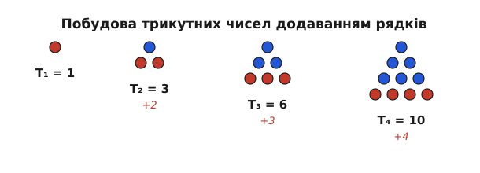
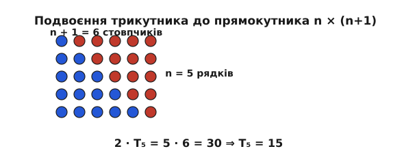
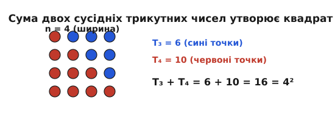

# Трикутні числа

<preknowlist>
- [Математична індукція](book:math/mathematical-induction)
- [Модульна арифметика](book:math/modular-arithmetic)
- [Натуральні числа](book:math/natural-numbers)
</preknowlist>

Коли в комп'ютерній мережі з `N` вузлів кожен пристрій має з'єднатися з кожним іншим напряму без посередників, виникає потреба обчислити загальну кількість міжвузлових каналів зв'язку. Перший вузол прокладає `N - 1` ліній до решти пристроїв, другий вузол додає `N - 2` нових ліній (бо зв'язок із першим уже існує), третій додає `N - 3` ліній, і так далі до останньої пари. Підсумкова кількість каналів у такій повній топології розраховується як сума послідовних натуральних чисел від 1 до `N - 1`. Ця сама математична структура описує кількість рукостискань при зустрічі компанії людей, кількість ігор у коловому турнірі між `N` командами, кількість точок зіткнення між фізичними об'єктами у тривимірному ігровому рушії та схему укладання колод на лісопилці або гарматних ядер у пірамідальні штабелі. Усі ці комбінаторні задачі зводяться до одного фундаментального арифметичного об'єкта — трикутних чисел.

Трикутні числа є найпростішим і найдавнішим класом фігурних чисел. Вони виникають тоді, коли дискретні елементи (точки, шари або об'єкти) викладають на площині у формі рівносторонніх трикутників, де кожен наступний рядок містить на одну точку більше, ніж попередній.

## Зв'язки у мережі та геометрична форма чисел

Геометричне побудування послідовності трикутних чисел починається з однієї точки, яка утворює трикутник нульового виміру зі стороною 1. Додавання второго рядка з 2 точок під першою утворює трикутник зі стороною 2, який у сумі містить 3 точки. Третій рядок із 3 точок збільшує загальну кількість точок до 6, а четвертий рядок додає ще 4 точки, даючи в сумі 10.

Позначимо `n`-не трикутне число як `T[n]`. Формально `T[n]` визначається як сума перших `n` послідовних натуральних чисел:

```
T[n] = 1 + 2 + 3 + ... + n = ∑_{j=1}^{n} j
```

із початковою умовою `T[0] = 0` для порожньої множини точок.


*Мал. 1. Геометричне формування послідовності трикутних чисел T1, T2, T3 та T4.*

Послідовність перших п'ятнадцяти трикутних чисел має вигляд:

```
0, 1, 3, 6, 10, 15, 21, 28, 36, 45, 55, 66, 78, 91, 105...
```

З геометричної структури випливає фундаментальне рекурентне співвідношення. Щоб перейти від `(n - 1)`-го трикутного числа до `n`-го, достатньо додати новий нижній основальний рядок, який складається з `n` точок:

```
T[n] = T[n-1] + n
```

Це співвідношення показує, що трикутні числа є дискретним аналогом інтегрування лінійної функції. Якщо розглянути оператор скінченної різниці `ΔT[n] = T[n] - T[n-1] = n`, то перша різниця утворює послідовність натуральних чисел, а друга різниця `Δ²T[n] = Δ(n) = 1` є константою. Це прямо свідчить про те, що формула загального члена `T[n]` описується квадратичним поліномом від `n`.

У комбінаториці трикутне число `T[n]` описує кількість пар у множині з `n + 1` елементів. Наприклад, у турнірі з `n + 1` учасника, де кожен грає з кожним по одній партії, загальна кількість матчів дорівнює точно `T[n]`. Якщо розглянути `n` точок на колі, то кількість хорд, що з'єднують усі можливі пари точок, дорівнює `T[n-1]`.

Якщо ж просумувати кількість перетинів хорд усередині круга при розбитті `n` точок на опуклому многокутнику, виникає біноміальний коефіцієнт `C(n, 4) = n(n - 1)(n - 2)(n - 3) / 24`, який виражається через різниці тетраедричних та трикутних чисел.

У теорії графів сума ступенів усіх вершин у довільному графі дорівнює подвоєній кількості ребер. Для повного графа `K_V` із `V` вершинами кожен із `V` вузлів має ступінь `V - 1`, отже сума ступенів становить `V(V - 1) = 2 · T[V-1]`. Це прямо ілюструє фундаментальну роль трикутних чисел у топології мереж та теорії матриць суміжності.

У теорії ймовірностей трикутні числа виникають при розрахунку парадоксу днів народження (birthday paradox). Кількість можливих пар у групі з `k` людей дорівнює `T[k-1] = k(k-1)/2`. Ймовірність того, що серед `k` людей немає двох з однаковим днем народження, виражається добутком, де кількість випробувань визначається саме `(k-1)`-м трикутним числом.

Історичний шлях дослідження цих чисел — від містичного шанування Піфагором десятиточкової Тетрактиди до фундаментальної теореми Карла Фрідріха Ґаусса про розклад будь-якого числа на три трикутні доданки — детально висвітлено у вставці [📜 Від Тетрактиди Піфагора до Еврики Ґаусса](book:book/math/number-theory/triangular-numbers/hist-tetraktys-to-eureka.md).

## Геометричне подвоєння та формула Ґаусса

Для обчислення `T[n]` при великих значеннях `n` безпосереднє послідовне сумування доданків від 1 до `n` вимагає `O(n)` арифметичних операцій, що є недоцільним. Закрита замкнена формула для `T[n]` обчислюється за допомогою геометричного подвоєння фігури.

Візьмемо трикутну сітку з `T[n]` точок і створимо її точну копію. Перевернемо другу копію на 180 градусів і приєднаємо її до першої вздовж гіпотенузи. Утворена об'єднана фігура утворює прямокутну ґратку точок, яка має `n` рядків та `n + 1` стовпчиків.


*Мал. 2. Подвоєння трикутної фігури до прямокутника розміром n на (n + 1).*

Загальна кількість точок у прямокутній ґратці розміром `n × (n + 1)` становить точно `n(n + 1)`. Оскільки прямокутник складається з двох однакових трикутників, кількість точок в одному трикутнику дорівнює півсумі:

```
2 · T[n] = n(n + 1)  =>  T[n] = n(n + 1) / 2
```

Ця замкнена формула описує `n`-не трикутне число для будь-якого натурального `n`. Вона також є біноміальним коефіцієнтом:

```
T[n] = C(n + 1, 2) = (n + 1)! / (2! · (n - 1)!)
```

Це підкреслює глибокий зв'язок трикутних чисел із Трикутником Паскаля: послідовність трикутних чисел утворює третю діагональ Трикутника Паскаля (після діагоналі з одиниць та діагоналі натуральних чисел).

### Доведення методом математичної індукції

Перевіримо строгість замкненої формули методом математичної індукції (детальніше про принцип індукції див. [Математична індукція](book:math/mathematical-induction)).

**База індукції.** При `n = 1` формула дає `T[1] = 1 · (1 + 1) / 2 = 1`, що точно збігається з визначенням `T[1] = 1`.

**Індукційне припущення.** Припустимо, що для деякого натурального `k ≥ 1` твердження виконується, тобто:

```
T[k] = k(k + 1) / 2
```

**Індукційний крок.** Доведемо, що формула є справедливою для `n = k + 1`. За визначенням рекурентності:

```
T[k+1] = T[k] + (k + 1)
```

Підставимо індукційне припущення для `T[k]`:

```
T[k+1] = [k(k + 1) / 2] + (k + 1)
```

Винесемо спільний множник `(k + 1)` за дужки:

```
T[k+1] = (k + 1) · [k / 2 + 1] = (k + 1) · [(k + 2) / 2] = (k + 1)((k + 1) + 1) / 2
```

Отриманий вираз тотожно збігається з формулою для індексу `k + 1`. За принципом математичної індукції формула `T[n] = n(n + 1) / 2` є доведеною для всіх натуральних `n ≥ 1`.

Аналогічний результат отримують через дитячий метод Ґаусса: при сумуванні послідовності `1 + 2 + ... + n` згрупуємо перший і останній елементи `1 + n`, другий і передостанній `2 + (n - 1) = n + 1`, утворюючи `n / 2` пар, кожна з яких має суму `n + 1`. Це дає той самий добуток `(n / 2) · (n + 1)`.

Крім того, підсумовування послідовних трикутних чисел дає тетраедричні числа. Відповідно до теореми про хокейну ключку (Hockey-stick identity) для біноміальних коефіцієнтів:

```
∑_{j=1}^{n} T[j] = ∑_{j=1}^{n} C(j+1, 2) = C(n+2, 3) = n(n + 1)(n + 2) / 6 = TE[n]
```

### Асимптотика та арифметика щільності

Для аналізу зростання трикутних чисел при великих `n` розглянемо їхню асимптотичну поведінку. Головний член розкладу дорівнює `T[n] ~ n^2 / 2` при `n → ∞`.

Кількість трикутних чисел, що не перевищують задану верхню межу `X`, описується функцією лічби `N_T(X) = ⌊ (√(8X + 1) - 1) / 2 ⌋ ~ √(2X)`.

Асимптотична щільність послідовності трикутних чисел серед усіх натуральних чисел дорівнює:

```
lim_{X → ∞} [N_T(X) / X] = lim_{X → ∞} [√(2X) / X] = 0
```

Це свідчить про те, що хоча трикутні числа є нескінченною послідовністю, їхня розрідженість зростає квадратично, так само як і розрідженість точних квадратів `n^2`.

### Твірні функції та аналітичні серії

У комбінаторному аналізі звичайна твірна функція (ordinary generating function) послідовності трикутних чисел визначається як формальний степеневий ряд:

```
F(x) = ∑_{n=1}^{∞} T[n] · x^n = T[1] x + T[2] x^2 + T[3] x^3 + ...
```

Використовуючи розклад Тейлора для негативного бінома `(1 - x)^{-3}`:

```
(1 - x)^{-3} = ∑_{n=0}^{∞} C(n + 2, 2) · x^n = 1 + 3x + 6x^2 + 10x^3 + ...
```

Домноживши обидві частини на `x`, отримуємо точний замкнений вигляд твірної функції:

```
F(x) = x / (1 - x)^3
```

Ця формула дозволяє обчислити вищі моменти та суми трикутних чисел за допомогою взяття похідних твірної функції.

Експоненційна твірна функція (exponential generating function) дорівнює:

```
E(x) = ∑_{n=1}^{∞} T[n] · x^n / n! = x (2 + x) e^x / 2
```

У вищій аналітичній теорії чисел узагальнений ряд Діріхле для трикутних чисел розгортається у вирази за участю Дзета-функції Рімана `ζ(s)`:

```
ζ_T(s) = ∑_{n=1}^{∞} 1 / (T[n])^s = ∑_{n=1}^{∞} 2^s / [n(n + 1)]^s
```

Для `s = 1` сума ряду дорівнює `2`. Для `s = 2` сума квадратичного ряду обчислиться через точне значення `ζ(2) = π^2 / 6`:

```
ζ_T(2) = ∑_{n=1}^{∞} 4 / [n^2 (n + 1)^2] = 4 (2 · ζ(2) - 3) = 4 (π^2 / 3 - 3) = 4π^2 / 3 - 12
```

## Алгебраїчні тотожності та сусіди у послідовності

Трикутні числа володіють багатим набором алгебраїчних тотожностей, які пов'язують їх з іншими точними степенями цілих чисел та дають змогу розкладати складні суми.

### Сума двох сусідніх трикутних чисел

Найвідомішим геометричним та алгебраїчним співвідношенням є сума двох послідовних трикутних чисел `T[n-1]` та `T[n]`. Складемо два сусідніх трикутники зі сторонами `n - 1` та `n`.


*Мал. 3. Геометричне поєднання двох сусідніх трикутних чисел T_{n-1} та T_n у квадрат n на n.*

Як видно з геометричної ілюстрації, трикутник `T[n-1]` утворює верхню частину квадрата, а трикутник `T[n]` — його діагональ та нижню частину. Сума двох фігур утворює суцільний квадрат зі стороною `n`:

```
T[n-1] + T[n] = n^2
```

Строге алгебраїчне виведення підтверджує цей факт:

```
T[n-1] + T[n] = (n - 1)n / 2 + n(n + 1) / 2 = [n^2 - n + n^2 + n] / 2 = 2n^2 / 2 = n^2
```

Ця тотожність пояснює, чому послідовність квадратів цілих чисел `1, 4, 9, 16, 25...` утворена сумами сусідніх елементів трикутної послідовності: `1+0=1`, `1+3=4`, `3+6=9`, `6+10=16`, `10+15=25`.

### Тотожності додавання, парності та квадратичних сум

Серед інших фундаментальних тотожностей трикутних чисел слід виділити теореми додавання індексів. Для будь-яких натуральних індексів `n` та `m` виконується співвідношення:

```
T[n + m] = T[n] + T[m] + n · m
```

Це алгебраїчно пояснюється тим, що при побудові трикутника зі стороною `n + m` його можна розбити на три частини: трикутник `T[n]`, трикутник `T[m]` та прямокутник розміром `n × m`.

За тотожністю тотожності Вандермонда для біноміальних коефіцієнтів при `r = 2`:

```
C(n + m, 2) = C(n, 2) + C(m, 2) + C(n, 1) · C(m, 1)
```

що тотожно виражається через трикутні числа: `T[n + m - 1] = T[n-1] + T[m-1] + n · m`.

Для подвоєного індексу `2n` маємо тотожність:

```
T[2n] = 3 · T[n] + T[n-1]
```

А для потрійного індексу `3n`:

```
T[3n] = 6 · T[n] + 3 · T[n-1] + n
```

Сума непарних трикутних чисел `T[2k-1]` та парних трикутних чисел `T[2k]` описується формулами:

```
∑_{k=1}^{n} T[2k-1] = n(n + 1)(4n - 1) / 6
∑_{k=1}^{n} T[2k] = n(n + 1)(4n + 5) / 6
```

Сума квадратів трикутних чисел `T[k]^2` утворює поліном 5-го степеня:

```
∑_{k=1}^{n} T[k]^2 = n(n + 1)(n + 2)(3n^2 + 6n + 1) / 60
```

Для добутку двох сусідніх трикутних чисел існує формула:

```
T[n] · T[n+1] = n(n + 1)^2 (n + 2) / 4
```

Знакозмінна сума трикутних чисел `∑_{k=1}^{n} (-1)^{n-k} T[k]` розкладається у компактні вирази залежно від парності `n`, що дозволяє спрощувати алгоритми обробки знаковозмінних сигналів у цифрових фільтрах.

### Матриці Нижнього Паскаля та факторизація

У лінійній алгебрі та базі даних матриця нижнього трикутника Паскаля `L` має елементи `L_{i, j} = C(i, j)`. Квадрат цієї матриці та розклад Холецького для симетричних коваріаційних матрицій у багатовимірному аналізі даних безпосередньо спирається на трикутні числа: розмірність нижнього трикутника матриці `N × N` становить точно `T[N]` елементів.

Детермінант нижньотрикутної матриці завжди дорівнює добутку її діагональних елементів. Схема розкладу `LU` дає змогу розв'язувати системи лінійних рівнянь за `O(N^3)` операцій, виконуючи звернення до пам'яті через пряму трикутну індексацію.

У порівнянні з використанням двовимірних масивів вказівників (наприклад, `double**`), лінійне збереження у 1D-векторі через `T[n]` виключає додаткові фрагментовані аллокації пам'яті в купі (heap allocations), зменшує промахи процесорного кешу (cache misses) та усуває розіменування неперервних вказівників.

### Різниця квадратів та теорема Нікомаха

Розглянемо різницю квадратів двох послідовних трикутних чисел `T[n]^2 - T[n-1]^2`. За формулою різниці квадратів `a^2 - b^2 = (a - b)(a + b)` маємо:

```
T[n]^2 - T[n-1]^2 = (T[n] - T[n-1]) · (T[n] + T[n-1])
```

Оскільки `T[n] - T[n-1] = n`, а `T[n] + T[n-1] = n^2`, отримуємо:

```
T[n]^2 - T[n-1]^2 = n · n^2 = n^3
```

Різниця квадратів сусідніх трикутних чисел дорівнює точно кубу числа `n`. Якщо просумувати ці різниці від `j = 1` до `n`, виникає телескопічна сума, у якій усі проміжні квадрати скорочуються:

```
∑_{j=1}^{n} j^3 = (T[1]^2 - T[0]^2) + (T[2]^2 - T[1]^2) + ... + (T[n]^2 - T[n-1]^2) = T[n]^2 - T[0]^2 = T[n]^2
```

Це доводить теорему Нікомаха Александрійського (I ст. н. е.): сума перших `n` кубів натуральних чисел дорівнює квадрату `n`-го трикутного числа:

```
1^3 + 2^3 + 3^3 + ... + n^3 = (1 + 2 + 3 + ... + n)^2 = [n(n + 1) / 2]^2
```

### Телескопічна сума обернених трикутних чисел

У математичному аналізі цікавим є нескінченний ряд з обернених трикутних чисел `1 / T[n]`. Використовуючи розклад на прості дроби:

```
1 / T[n] = 2 / [n(n + 1)] = 2 · (1/n - 1/(n + 1))
```

Обчислимо суму перших `N` членів ряду:

```
S_N = ∑_{n=1}^{N} 1 / T[n] = 2 · [ (1/1 - 1/2) + (1/2 - 1/3) + ... + (1/N - 1/(N + 1)) ]
```

Усі внутрішні доданки взаємно знищуються, залишаючи:

```
S_N = 2 · (1 - 1/(N + 1))
```

При спрямуванні `N → ∞` границя `1/(N + 1)` прямує до 0, отже сума нескінченного ряду дорівнює точно 2:

```
∑_{n=1}^{∞} 1 / T[n] = 2
```

Детальніші алгебраїчні виведення, зокрема твірні функції та матричні тотожності, викладено у вставці [🧮 Квадратні трикутні числа та рівняння Пелля](book:book/math/number-theory/triangular-numbers/math-square-triangular-pell.md).

## Критерій трикутності та квадратні трикутні числа

Як перевірити, чи є довільно задане натуральне число `M` трикутним числом, і знайти його індекс `n`?

### Дискримінантний критерій трикутності

За визначенням `M` є трикутним числом, якщо існує таке ціле `n ≥ 0`, що `n(n + 1) / 2 = M`. Звівши це співвідношення до стандартного квадратного рівняння відносно `n`:

```
n^2 + n - 2M = 0
```

Обчислимо дискримінант цього рівняння:

```
D = 1^2 - 4 · 1 · (-2M) = 8M + 1
```

Рівняння має цілий додатний розв'язок `n` тоді й лише тоді, коли дискримінант `8M + 1` є точним квадратом цілого непарного числа `s`:

```
8M + 1 = s^2
```

Якщо `8M + 1 = s^2`, то порядковий індекс трикутного числа обчислюється за формулою:

```
n = (s - 1) / 2 = (√(8M + 1) - 1) / 2
```

Якщо ж `8M + 1` не є точним квадратом цілого числа, то `M` не належить до послідовності трикутних чисел.

Приклад: перевіримо число `M = 36`. Обчислимо `8M + 1 = 8 · 36 + 1 = 289`. Оскільки `√289 = 17` — ціле число, `M = 36` є трикутним числом. Його індекс `n = (17 - 1) / 2 = 8`. Дійсно, `T[8] = 8 · 9 / 2 = 36`.

### Квадратні трикутні числа та рівняння Пелля

Деякі числа володіють подвійною природою: вони одночасно є і трикутними числами, і точними квадратами. Скільки існує таких чисел і як їх знайти?

Рівняння `T[n] = k^2` зводиться до діофантового виразу `n(n + 1) / 2 = k^2`, або:

```
n^2 + n - 2k^2 = 0
```

Домноживши обидві частини на 4 та додавши 1, отримуємо:

```
4n^2 + 4n + 1 - 8k^2 = 1  =>  (2n + 1)^2 - 2(2k)^2 = 1
```

Зробивши заміну змінних `x = 2n + 1` та `y = 2k`, отримуємо класичне **діофантове рівняння Пелля**:

```
x^2 - 2y^2 = 1
```

Рівняння Пелля має безліч цілочисельних розв'язків, які генеруються за допомогою фундаментальної одиниці `3 + 2√2`. Звідси неперервний дріб для `√2` задає послідовність найкращих раціональних наближень `p_m / q_m`: `1/1, 3/2, 7/5, 17/12, 41/29, 99/70, 239/169, 577/408...`. Парні підхідні дроби дають точні розв'язки для індексів `n` та `k`. Послідовність квадратних трикутних чисел `N_m` є безкінечною та зростає експоненційно:

```
N_1 = 1           (n = 1, k = 1)
N_2 = 36          (n = 8, k = 6)
N_3 = 1225        (n = 49, k = 35)
N_4 = 41616       (n = 288, k = 204)
N_5 = 1413721     (n = 1681, k = 1189)
N_6 = 4804915598241 (n = 9800, k = 6930)
```

### Діофантові рівняння суми трикутних чисел

Цікавим питанням є пошук трикутних чисел, які можна подати у вигляді суми двох інших трикутних чисел: `T[x] = T[y] + T[z]`.

Існує безліч розв'язків цієї діофантової задачі. Наприклад, нескінченне сімейство розв'язків задається рекурентним співвідношенням `T[T[n]] = T[n] + T[T[n]-1]`. Знайти всі цілочисельні розв'язки дозволяє зведення до квадричних форм та аналіз точок на еліптичних кривих.

### Перетин трикутних чисел з іншими послідовностями

Теоретико-числовий інтерес становить перетин послідовності трикутних чисел із числами Фібоначчі, числами Мерсенна та факторіалами.

- **Трикутні числа Фібоначчі**: Які числа одночасно є і трикутними числами, і числами Фібоначчі? Єдиними такими числами є: `0, 1, 3, 21` та `55`. У 1991 році математик Луо (Luo) математично довів, що інших трикутних чисел Фібоначчі **не існує**.
- **Трикутні числа Мерсенна**: Рівняння `T[n] = 2^k - 1` є окремим випадком відомого діофантового рівняння Рамануджана — Нагелля `x^2 + 7 = 2^{k+2}`. Розв'язками є числа `T[1] = 1`, `T[3] = 6`, `T[15] = 120` та `T[4095] = 8386560`.
- **Трикутні факторіали**: Єдиними відомими розв'язками рівняння `T[n] = k!` є `T[1] = 1! = 1`, `T[3] = 3! = 6` та `T[5] = 5! = 120`.

Повний алгоритмічний розклад генерації квадратних трикутних чисел та аналіз цілочисельного переповнення 64-бітних типів наведено у вставці [🧮 Квадратні трикутні числа та рівняння Пелля](book:book/math/number-theory/triangular-numbers/math-square-triangular-pell.md).

## Модульна арифметика, парність та цифровий корінь

Розглянемо властивості остач від ділення трикутних чисел на різні модулі (детальніше про арифметику остач див. [Модульна арифметика](book:math/modular-arithmetic)).

### Парність трикутних чисел (Модуль 2)

Визначимо парність `T[n] mod 2`. Оскільки `T[n] = n(n + 1) / 2`, розглянемо 4 можливі випадки остач `n mod 4`:

1. `n ≡ 0 (mod 4)`: `n = 4k`, тоді `T[n] = 4k(4k + 1) / 2 = 2k(4k + 1)` — **парне** (`0 mod 2`).
2. `n ≡ 1 (mod 4)`: `n = 4k + 1`, тоді `T[n] = (4k + 1)(4k + 2) / 2 = (4k + 1)(2k + 1)` — **непарне** (`1 mod 2`).
3. `n ≡ 2 (mod 4)`: `n = 4k + 2`, тоді `T[n] = (4k + 2)(4k + 3) / 2 = (2k + 1)(4k + 3)` — **непарне** (`1 mod 2`).
4. `n ≡ 3 (mod 4)`: `n = 4k + 3`, тоді `T[n] = (4k + 3)(4k + 4) / 2 = (4k + 3)(2k + 2)` — **парне** (`0 mod 2`).

Отже, послідовність парності трикутних чисел є періодичною з періодом довжиною 4:

```
непарне, непарне, парне, парне, непарне, непарне, парне, парне...
```

Два трикутних числа підряд є непарними, за якими йдуть два парних трикутних числа.

### Поведінка за модулями 3, 5, 8, 10 та останні цифри

Аналіз остач `T[n]` за іншими модулями розкриває унікальні арифметичні закономірності:

- **Модуль 3**: Послідовність остач `T[n] mod 3` має період довжиною 3: `1, 0, 0, 1, 0, 0, 1, 0, 0...`. Окрім першого члена кожної трійки, 2/3 усіх трикутних чисел діляться на 3 націло.
- **Модуль 5**: Послідовність остач `T[n] mod 5` має період довжиною 5: `1, 3, 1, 0, 0, 1, 3, 1, 0, 0...`. Остачі 2 та 4 ніколи не зустрічаються серед трикутних чисел за модулем 5.
- **Модуль 8**: Оскільки `8T[n] + 1 = s^2`, то за модулем 8 вираз `8T[n] + 1 ≡ 1 (mod 8)`. Для будь-якого непарного числа `s = 2n + 1` його квадрат `s^2` завжди дає остачу 1 при діленні на 8. Це підтверджує узгодженість дискримінантного критерію з теорією остач. Послідовність `T[n] mod 8` має період 16: `0, 1, 3, 6, 2, 7, 5, 4, 4, 5, 7, 2, 6, 3, 1, 0...`.
- **Модуль 10 (Остання десяткова цифра)**: Послідовність останніх цифр трикутних чисел повторюється з періодом 20: `0, 1, 3, 6, 0, 5, 1, 8, 6, 5, 5, 6, 8, 1, 5, 0, 6, 3, 1, 0...`. Звідси випливає фундаментальне обмеження: остання цифра трикутного числа може дорівнювати **виключно 0, 1, 3, 5, 6 або 8**. Числа, що закінчуються на **2, 4, 7 або 9**, ніколи не є трикутними! Це дає миттєвий перевірочний O(1)-фільтр останньої цифри у десятковій системі числення.

### Періодичність за модулем 9 та цифровий корінь

Обчислимо остачі трикутних чисел при діленні на 9 (`T[n] mod 9`). Послідовність остач відновлюється через кожні 9 кроків:

```
n mod 9:   1  2  3  4  5  6  7  8  0
T[n] mod 9: 1  3  6  1  6  3  1  9  9 (тобто 0)
```

Послідовність остач за модулем 9 повторює впорядкований паттерн:

```
1, 3, 6, 1, 6, 3, 1, 0, 0, 1, 3, 6, 1, 6, 3, 1, 0, 0...
```

Звідси випливає важливий практичний висновок: **цифровий корінь** (остача від ділення на 9) будь-якого трикутного числа може дорівнювати лише `1, 3, 6` або `9`.

Якщо для деякого числа `M` остача `M mod 9` дорівнює `2, 4, 5, 7` або `8`, то таке число **гарантовано не є трикутним числом**. Ця властивість використовується в алгоритмах як швидкий попередній O(1)-фільтр, який дозволяє відкинути 55% нетрикутних чисел перед використанням точного обчислення квадратного кореня `isqrt(8M + 1)`.

## Адитивна теорія чисел та Еврика Ґаусса

У 1638 році П'єр де Ферма сформулював гіпотезу про те, що будь-яке натуральне число можна подати у вигляді суми не більше ніж `k` `k`-кутних чисел. Для `k = 3` це означає, що кожне натуральне число є сумою найраніше трьох трикутних чисел.

10 липня 1796 року 19-річний Карл Фрідріх Ґаусс довів це твердження і зробив знаменитий запис у своєму математичному щоденнику:

```
EUREKA! num = Δ + Δ + Δ
```

### Теорема Ґаусса про три трикутні числа

Для будь-якого натурального числа `N` існують такі трикутні числа `T[a], T[b], T[c] ≥ 0`, що:

```
N = T[a] + T[b] + T[c]
```

Наприклад:
- `17 = 10 + 6 + 1 = T[4] + T[3] + T[1]`
- `19 = 15 + 3 + 1 = T[5] + T[2] + T[1]`
- `20 = 10 + 10 + 0 = T[4] + T[4] + T[0]`

Доведення Ґаусса спирається на теорему Лежандра про суму трьох квадратів: кожне натуральне число вигляду `8N + 3` можна подати у вигляді суми трьох непарних квадратів `(2a + 1)^2 + (2b + 1)^2 + (2c + 1)^2 = 8N + 3`. Розкривши квадрати та скоротивши 3 в обох частинах рівняння, отримуємо:

```
8 · [a(a + 1) / 2 + b(b + 1) / 2 + c(c + 1) / 2] = 8N  =>  T[a] + T[b] + T[c] = N
```

Кількість способів розкладу числа `N` на суму трьох трикутних чисел пов'язана з числом класів бінарних квадратичних форм дискримінанта `-(8N + 3)`, що є важливою теоремою сучасної аналітичної теорії чисел.

Детальний історичний контекст відкриття цієї теореми та її подальший розвиток Оґюстеном Коші висвітлено у вставці [📜 Від Тетрактиди Піфагора до Еврики Ґаусса](book:book/math/number-theory/triangular-numbers/hist-tetraktys-to-eureka.md).

## Центровані трикутні числа та багатовимірні узагальнення

Окрім звичайних трикутних чисел, у комбінаториці та кристалографії розглядають **центровані трикутні числа** `CT[n]`.

### Центровані трикутні числа

Центроване трикутне число `CT[n]` описує кількість точок у трикутній сітці з однією центральною точкою, навколо якої викладаються концентричні трикутні шари. Формула `n`-го центрованого трикутного числа має вигляд:

```
CT[n] = (3n^2 - 3n + 2) / 2 = 3 · T[n-1] + 1
```

Послідовність центрованих трикутних чисел починається з: `1, 4, 10, 19, 31, 46, 64, 85, 109...`.

Кожне центроване трикутне число (починаючи з 4) дорівнює потрійному звичайному трикутному числу плюс 1. Вони описують вихідні структури в оптичних ґратках та кристалічних комірках плоских двовимірних матеріалів (наприклад, графену).

### Багатокутні числа (Polygonal Numbers)

Загальна формула для `n`-го `k`-кутного числа `P(k, n)` задається співвідношенням:

```
P(k, n) = (k - 2)n^2 / 2 - (k - 4)n / 2 = (k - 2) · T[n-1] + n
```

- При `k = 3` отримуємо трикутні числа `P(3, n) = T[n] = n(n + 1) / 2`.
- При `k = 4` отримуємо квадратні числа `P(4, n) = n^2 = T[n-1] + T[n]`.
- При `k = 5` отримуємо п'ятикутні числа `P(5, n) = (3n^2 - n) / 2`.
- При `k = 6` отримуємо шестикутні числа `P(6, n) = 2n^2 - n = T[2n-1]`.

Зверніть увагу на унікальний зв'язок між шестикутними та трикутними числами: **кожне шестикутне число є трикутним числом із непарним індексом** `T[2n-1]`. Множина шестикутних чисел є власною підмножиною множини трикутних чисел.

### Тетраедричні та багатовимірні числа

У тривимірному просторі узагальненням трикутного числа є **тетраедричне число** `TE[n]`, яке утворюється складанням трикутних шарів з точок у піраміду з тетраедричною основою. `n`-не тетраедричне число є сумою перших `n` трикутних чисел:

```
TE[n] = ∑_{j=1}^{n} T[j] = T[1] + T[2] + ... + T[n] = n(n + 1)(n + 2) / 6
```

У `d`-вимірному просторі `n`-не симплексне число обчислюється як комбінаторний коефіціент `C(n + d - 1, d)`. Трикутні числа відповідають виміру `d = 2`, тетраедричні — виміру `d = 3`, а 4-симплексні (пентатопні) числа — виміру `d = 4`.

У квантовій механіці виродження енергетичних рівнів для `d`-вимірного гармонічного осцилятора описується саме `d`-вимірними симплексними числами. Для 2D осцилятора кількість станів на `n`-му рівні дорівнює `n + 1`, а кумулятивна кількість станів до `n`-го рівня включно описується трикутним числом `T[n+1]`.

У квантових інформаційних системах переплетені пари кубітів (qubit entanglement pairs) у групі з `n` кубітів утворюють тотожність `T[n-1]`, що визначає розмірність підпростору Белла для мульти-кубітових станів.

У физиці твердого тіла щільна упаковка одинакових сфер у двовимірному просторі (гексагональна упаковка на площині) утворює шар, де кількість сфер у трикутній піраміді підпорядковується тетраедричним числам `TE[n]`. Найщільніша упаковка кіл на площині має щільність `π / √12 ≈ 0.9069`, де центри сфер розташовані у вузлах трикутної ґратки. Це зв'язує класичну теорію фігурних чисел із проблемматикою гіпотези Кеплера про найщільнішу упаковку куль у тривимірному просторі.

## Фізичні закони та кінематичні співвідношення

У класичній фізиці трикутні числа природним чином описують дискретний рух матеріальної точки з постійним прискоренням `a`.

Якщо тіло починає рух з нуля і на кожному дискретному кроці часу `Δt = 1` його швидкість збільшується на одну й ту саму величину `v(k) = k · a`, то загальний пройдений шлях за `n` кроків обчислюється як сума швидкостей:

```
S(n) = ∑_{k=1}^{n} v(k) = a · ∑_{k=1}^{n} k = a · T[n] = a · n(n + 1) / 2
```

Це є прямою дискретизацією відомої фізичної формули неперервного рівноприскореного руху `S(t) = a t^2 / 2`.

Закон непарних чисел Ґалілея стверджує, що шляхи, пройдені тілом за послідовні рівні проміжки часу при вільному падінні, відносяться як послідовні непарні числа: `1 : 3 : 5 : 7 : 9...`. Оскільки сума перших `n` непарних чисел дорівнює `n^2`, а кожен квадрат є сумою двох сусідніх трикутних чисел `n^2 = T[n-1] + T[n]`, це демонструє внутрішню єдність законів кінематики та теорії фігурних чисел.

## Практичне застосування в програмуванні та інженерії

У комп'ютерній інженерії та розробці високопродуктивного системного програмного забезпечення трикутні числа застосовуються у таких фундаментальних задачах:

1. **Компактна упаковка симетричних та трикутних матриць**: Для збереження нижньотрикутної матриці розміру `N × N` у суцільному 1D-векторі елемент `(i, j)` розміщується за плоским індексом `flat_index(i, j) = i(i + 1) / 2 + j = T[i] + j`. Це економить близько 50% обсягу оперативної пам'яті та покращує локальність процесних кешів.
2. **Індексація ребер повних графів**: У графі з `V` вершинами кількість неупорядкованих пар ребер дорівнює `T[V-1]`. Індекс ребра між вершинами `u` та `v` (`u < v`) обчислюється як `edge_id(u, v) = v(v - 1) / 2 + u = T[v-1] + u`.
3. **Трикутне зондування в хеш-таблицях**: Для вирішення колізій у хеш-таблицях з відкритою адресацією використовується зсув на `i`-те трикутне число: `slot(k, i) = (hash(k) + T[i]) mod M`. Якщо розмір `M` обрано як стіпень двійки `M = 2^p`, то трикутне зондування гарантує покриття всіх `M` комірок таблиці без потрапляння у нескінченний цикл.
4. **Аналіз складності алгоритмів сортування**: У класичних алгоритмах сортування за допомогою порівнянь (бульбашкове сортування Bubble Sort, сортування вибором Selection Sort, сортування вставками Insertion Sort у найгіршому випадку) кількість виконаних порівнянь для масиву довжиною `N` тотожно дорівнює `T[N-1] = N(N - 1) / 2`. У швидкому сортуванні QuickSort при найгіршому виборі опорного елемента рекурентний розклад згортається у суму трикутного числа `T[N-1]`, що визначає квадратичну часову складність `O(N^2)`.
5. **Префіксні суми у структурах даних (Дерева Фенвіка)**: При розрахунку префіксних сум у масивах одиниць кумулятивна сума на позиції `i` утворює індекс `i`, а подвійна префіксна сума дає `T[i]`. Алгоритми префіксного сканування (Parallel Prefix Scan) на процесорах GPU спираються на трикутні розбиття масивів між обчислювальними блоками (thread blocks).
6. **Захист цілісності в масивах сховищ даних (RAID 6 та коди Ріда-Соломона)**: При побудові розподілених систем зберігання даних розрахунок парності вимагає індексації матриць коефіцієнтів Вандермонда, де суми індексів розкладаються за допомогою трикутної комбінаторики, що оптимізує операції `XOR` при відновленні втрачених дисків.
7. **Паралельне розбиття сіток методом скінченних елементов (FEM)**: У двовимірній і тривимірній обчислювальній гідродинаміці та міцнісному аналізі конструкцій трикутні та тетраедричні сітки розділяються між процесорними вузлами обчислювального кластера. Кількість зв'язків між суміжними трикутними елементами розраховується через трикутні числа, що гарантує точне балансування обчислювального навантаження між ядрами процесора.

Програмні реалізації цих алгоритмів мовами C та C++ з використанням ідіоматичних методів та перевіркою межевих умов наведено у вставці [⚙️ Алгоритми перевірки та генерації трикутних чисел](book:book/math/number-theory/triangular-numbers/proj-triangular-algorithms.md).
