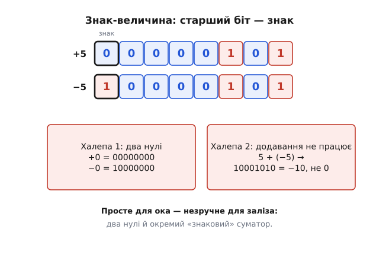
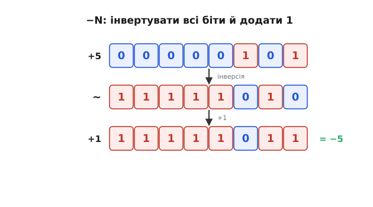
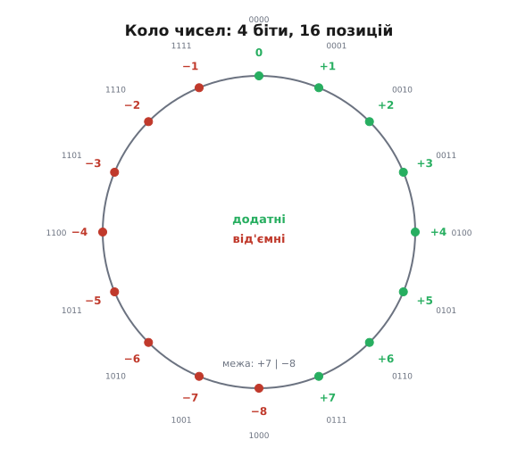
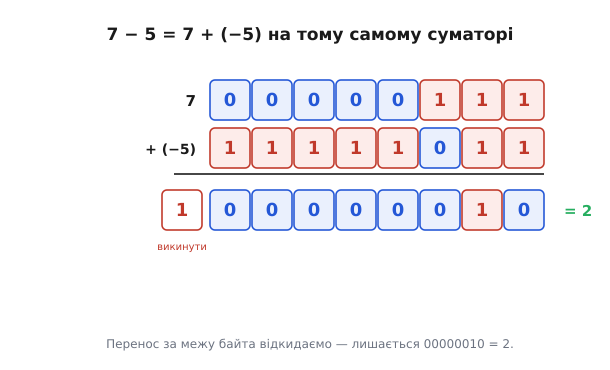
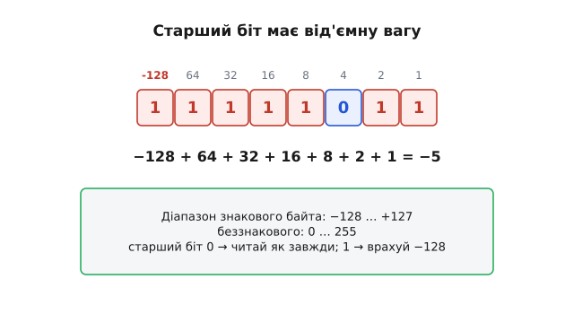

# Доповняльний код

Маємо проблему: серед 0 і 1 немає знака «мінус». А машині конче потрібні **від'ємні** числа — без них ні відняти, ні полічити «нижче нуля». Як же закодувати −5 самими бітами? Відповідь, яку інженерія шукала кілька спроб і нарешті знайшла, геніальна: **доповняльний код** (англ. *two's complement* — «доповнення до двійки», тобто до повного оберту степеня двійки). Він не лише вміщає від'ємні числа в біти без жодного спеціального «знака», а й робить щось майже чарівне — перетворює **віднімання на додавання**, тож той самий [суматор](book:electronics/combinational-circuits) обслуговує і плюс, і мінус. Це одна з найкрасивіших ідей у тому, як влаштований процесор.

### Де взяти мінус? Наївний спосіб і його біди

Найперша думка проста: віддамо **старший біт** під знак. 0 угорі — число додатне, 1 — від'ємне; решта бітів — звичайна величина. Це **знак-величина** (англ. *sign-magnitude* — «знак і величина»).


*У знак-величині +5 = 00000101, а −5 = 10000101 — той самий «5», лише старший біт-знак піднято. Зрозуміло й людяно — та з двома халепами. Перша: виходить аж два нулі, +0 (00000000) і −0 (10000000); «мінус нуль» безглуздий, марнує одне значення й плутає схеми. Друга, гірша: не можна просто додати. 5 + (−5) мало б дати 0, але побітове додавання дає 10001010 = −10 — повну нісенітницю. Тобто арифметика потребує окремої, хитрої логіки.*

Знак-величина гарна для ока, та незручна для заліза: два нулі й потреба в спеціальному «знаковому» суматорі. Був і проміжний винахід — **обернений код** (англ. *ones' complement* — «доповнення до одиниць»), де від'ємне дістають інверсією всіх бітів; він теж мав два нулі й вимагав «закільцьованого переносу». Інженери шукали спосіб, де **звичайне додавання просто працювало б** — і знайшли.

### Доповняльний код: інвертувати й додати 1

Рецепт доповняльного коду до смішного простий. Щоб дістати **−N**, треба взяти двійковий запис N, **перевернути всі біти** (інверсія) і **додати 1**.


*Як дістати −5 із +5. Беремо 00000101, інвертуємо кожен біт → 11111010, додаємо 1 → 11111011. Оце й є −5 у доповняльному коді. Той самий рецепт повертає назад: інвертуй 11111011 → 00000100, +1 → 00000101 = +5. І головне — нуль тепер один-єдиний: інверсія 00000000 дає 11111111, +1 = 00000000 (перенос за межу байта викидаємо). Жодного «мінус нуля».*

**Закодуймо −5 на 8 бітах і перевірмо, що рецепт оборотний.**

```
+5:        00000101
інверсія:  11111010
+1:        11111011   ← це −5

назад:     інверсія(11111011) = 00000100,  +1 = 00000101 = +5  ✓
```

А звідки взялася та загадкова **«+1»**? Тут є коротка, але дуже промовиста причина. Якщо просто інвертувати всі біти числа, дістанемо **обернений код** — і він недотягує до правильного від'ємного рівно на одиницю. Чому саме на одиницю, видно з простого спостереження: число й **його інверсія** в кожному розряді — протилежні біти (там, де в одного 0, в іншого 1), тож у сумі вони дають усі одиниці поспіль. А всі одиниці на 8 бітах — це 11111111 = 255, тобто на один менше за повний оберт 256. Виходить, число плюс його інверсія завжди дорівнює 2ⁿ − 1; щоб дотягти до рівного 2ⁿ (повного оберту, який і замикається в нуль), бракує саме одиниці. Ось чому інверсія дає «майже від'ємне», а додавання 1 ставить його точно на місце. Заразом видно й чому обернений код мав два нулі, а доповняльний має один: інверсія самого нуля — це всі одиниці, а додавання 1 переганяє їх за межу байта назад у чистий нуль.

Просто й чисто. Але чому цей рецепт дає саме від'ємне число — і чому з ним так гарно працює арифметика? Найкраще це видно, якщо уявити числа **на колі**.

### Чому це працює: коло чисел (одометр)

Доповняльний код стає очевидним з **одометра** автомобіля чи кола годинника. Числа в розрядній сітці не лежать на нескінченній прямій — вони **замкнені в коло**: дійшовши до максимуму, лічба «перевалює» назад у нуль (як 999999 → 000000 на одометрі). Доповняльний код просто домовляється, що **верхню половину** цього кола ми читаємо як **від'ємні** числа.


*4-бітне коло на 16 значень. Від нуля вгору йдуть додатні: 0, 1, …, 7 (0111). А далі, замість «8», коло перевалює — і верхню половину читаємо як від'ємні: 1000 = −8 (найменше), 1001 = −7, …, 1111 = −1 (рівно «на крок не дійшли» до нуля). Тобто −N лежить там, куди впираєшся, відступивши N назад від нуля по колу. Старший біт 1 завжди означає «ми у від'ємній половині».*

Тепер видно красу. «Відступити на N назад» по колу — це те саме, що «пройти вперед на (розмір кола − N)». Тому −5 у 8-бітному колі (256 значень) — це позиція 256 − 5 = 251 = 11111011. А оскільки додавання — це просто **крок уперед** по колу, додати −5 = додати 251, і коло саме «довертає» результат куди треба. Ось чому інвертувати-й-додати-1 працює: воно обчислює рівно 2ⁿ − N, тобто потрібну позицію на колі. По суті, доповняльний код — це [арифметика за модулем 2ⁿ](book:math/modular-arithmetic): кожне число живе як залишок на колі з 2ⁿ позицій, а відкидання «зайвого» біта переносу — це і є зведення за модулем.

### Магія: віднімання — це додавання

А тепер — нагорода за всю цю хитрість, заради якої доповняльний код і переміг. **Віднімання перетворюється на додавання.** Щоб порахувати A − B, не потрібен жоден «віднімач»: достатньо додати A й **доповняльний код** від B.


*Порахуймо 7 − 5 як 7 + (−5). Беремо 7 = 00000111 і −5 = 11111011, подаємо на звичайний суматор і додаємо. Виходить 1 00000010 — дев'ятий, «зайвий» біт переносу просто викидаємо (коло замкнулось), і лишається 00000010 = 2. А 7 − 5 справді 2. Жодної окремої схеми віднімання — той самий суматор.*

**Обчислімо 7 − 5 у доповняльному коді.**

```
  00000111   (7)
+ 11111011   (−5)
-----------
1 00000010   ← перенос за байт відкидаємо
= 00000010 = 2     (а 7 − 5 = 2  ✓)
```

Осягніть, наскільки це потужно. Той самий [суматор](book:electronics/combinational-circuits), що додає, уміє й віднімати, варто лише подати від'ємник у доповняльному коді. Не треба окремого «віднімача», не треба окремої логіки для знакових чисел — **одна** додавальна схема обслуговує і плюс, і мінус, і знакові, і беззнакові числа: біти додаються однаково, різниться лише тлумачення результату. Саме тому в процесорі є **одна** команда додавання на все, а не зоопарк окремих операцій. Доповняльний код — це не просто «спосіб записати мінус», це спосіб **зекономити пів арифметики** заліза.

### Діапазон і як читати

Лишилося два практичні питання: який діапазон чисел уміщає знаковий байт і як швидко прочитати від'ємне.


*Найшвидший спосіб читати доповняльний код: вважати, що старший біт має від'ємну вагу (−128 для байта), а решта — звичайні додатні. Тоді 11111011 = −128 + 64 + 32 + 16 + 8 + 2 + 1 = −5. Діапазон 8-бітного знакового — від −128 до +127: від'ємних на одне більше, бо нуль «займає місце» серед додатних. Правило читання: старший біт 0 → число додатне (читай як завжди); 1 → від'ємне (врахуй вагу −128).*

Це правило — найшвидший спосіб прочитати незнайомий байт у голові. Скажімо, трапилося 11111110: старший біт 1, отже число від'ємне. Беремо вагу старшого як −128, додаємо ваги решти одиниць (64 + 32 + 16 + 8 + 4 + 2) і дістаємо −128 + 126 = −2. Перевірити можна рецептом навпаки: інвертуємо 11111110 → 00000001, додаємо 1 → 00000010 = 2, значить вихідне було −2. Обидва шляхи сходяться.

```
читаємо 11111110 як знакове:
  −128 + 64 + 32 + 16 + 8 + 4 + 2 = −2       (вага старшого біта від'ємна)
перевірка рецептом: ~11111110 = 00000001, +1 = 00000010 = 2  → отже −2  ✓
```

Запам'ятайте діапазон знакового байта: **−128…+127** (а беззнакового — 0…255). Для 16 бітів — це −32768…+32767, для 32 — приблизно ±2 мільярди. І зверніть увагу на маленьку асиметрію: від'ємних значень на одне більше, ніж додатних (−128 є, а +128 нема), бо нуль єдиний і «рахується» з додатного боку.

Ця дрібниця інколи кусає. Якщо результат **вилазить** за діапазон, коло «перевалює» — і додатне раптом стає від'ємним. Це **переповнення**. Найкоротший приклад на байті — додати +1 до найбільшого додатного:

```
  01111111   (+127)
+ 00000001   (+1)
-----------
  10000000   = +128 «хотіли», АЛЕ старший біт = 1 → читається як −128
```

Лишок чесний (128 ≡ 128 за модулем 256), просто +128 не вміщається у знаковий байт, і його образ у верхній половині кола читається як −128. Звідси й проста ознака знакового переповнення: воно стається, **коли два доданки однакового знаку дають суму протилежного знаку**. Та сама межа кусає й спробу взяти `−(−128)` у 8 бітах: +128 не існує, тож результат теж «перевалює» у [переповнення](book:programming/overflow-wraparound).

> 🔧 **Навіщо це.** Доповняльний код — це **стандарт** представлення цілих чисел у геть усіх процесорах, тож ви матимете з ним справу постійно, навіть не замислюючись. Винесіть головне. Перше: **−N = інвертувати всі біти й додати 1**; цей рецепт оборотний і дає єдиний нуль. Друге, найважливіше практично: **той самий суматор віднімає** — тому в процесора одна команда додавання, і ті самі біти обслуговують знакові й беззнакові числа; різниця лише в **тлумаченні**. Третє: знайте **діапазони** — 8-бітний знаковий це −128…+127, беззнаковий 0…255; коли ви оголошуєте змінну `int8_t` чи `uint8_t`, ви буквально обираєте, читати старший біт як знак чи як вагу 128. І класична пастка: якщо результат **вилазить** за діапазон, коло «перевалює» — і додатне раптом стає від'ємним. Це **переповнення**, і саме воно — джерело найкласичніших числових багів.

---

Підсумок: щоб уписати від'ємні числа в біти, наївний **знак-величина** (старший біт — знак) не годиться — два нулі й незручне додавання. Перемогою став **доповняльний код**: −N дістають, **інвертувавши всі біти й додавши 1**. Він має **єдиний** нуль, а числа лежать на **колі** (одометр), де верхня половина читається як від'ємні (−N стоїть на позиції 2ⁿ − N). Головна нагорода — **віднімання стає додаванням**: A − B = A + (−B) на тому самому суматорі, тож одна додавальна схема обслуговує і плюс, і мінус, і знакові, і беззнакові числа. Старший біт має **від'ємну вагу** (−128 для байта), діапазон знакового байта — **−128…+127**. А якщо результат вилазить за цей діапазон, коло «перевалює» й число псується — це **переповнення**, джерело класичних багів.
