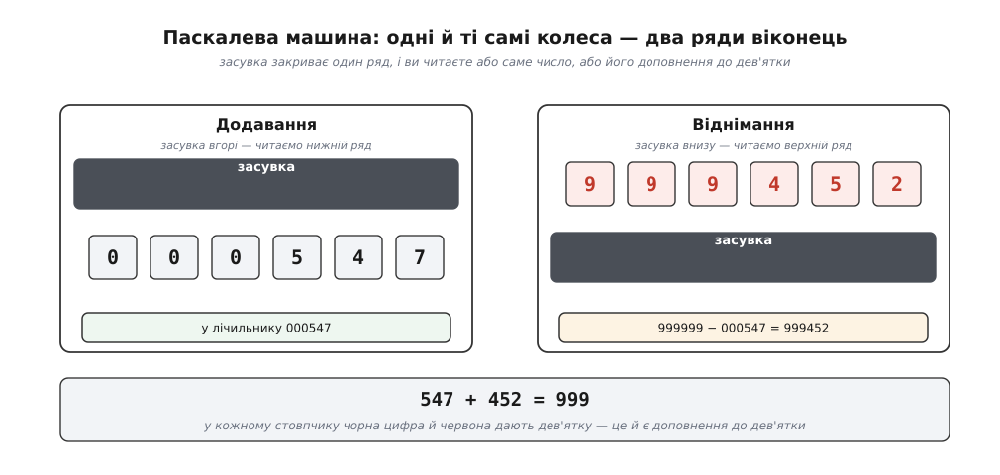
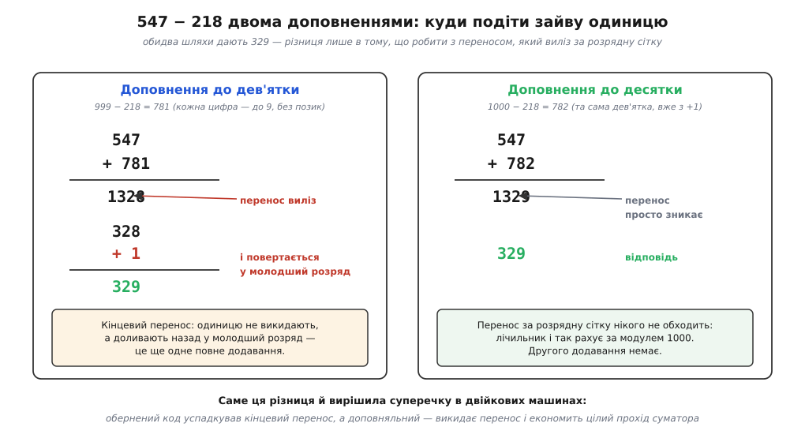
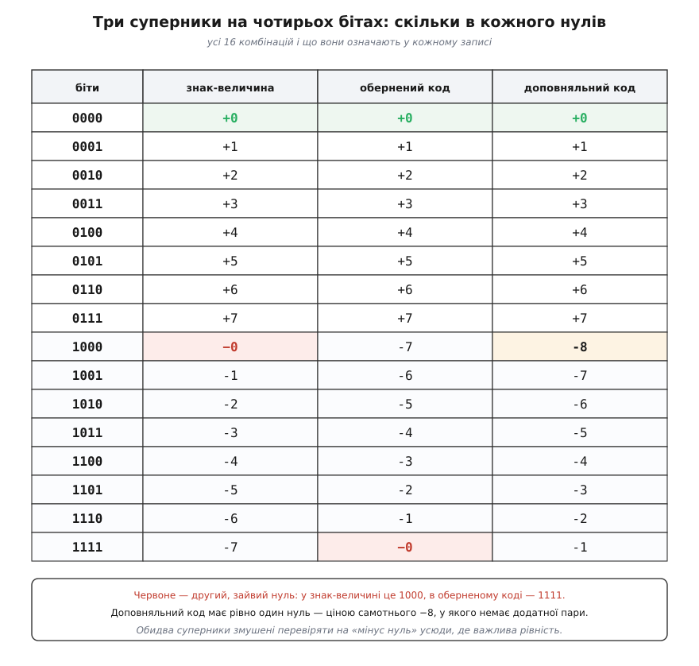

# 📜 Метод доповнень: як механізм, що вміє лише вперед, навчив нас віднімати

«Віднімання — це додавання доповнення» звучить як математична елегантність: хтось помітив гарну симетрію й подарував її обчислювальній техніці. Насправді все було навпаки. Доповнення народилося не з краси, а з **каліцтва механізму** — з того, що шестерня, яку вдалося зробити надійною, крутилася лише в один бік. І найдивовижніше в цій історії те, що через триста років, коли шестерні змінилися на електронні лампи, інженери записали в звіті **буквально ту саму причину**. Прийом пережив свій механізм, бо заборона, що його породила, виявилася глибшою за будь-яку конкретну залізяку.

Простежмо цей шлях: від дерев'яно-латунної скриньки в Руані до рядка `NOT` перед суматором — і розберімося, чому наприкінці дороги двійкові машини посварилися між собою, а переміг той код, що зайвий перенос просто викидає.

---

## Шестерня, що вміє лише вперед

У 1642 році **Блез Паскаль** (*Blaise Pascal*, 1623–1662) мав вісімнадцять років і батька, заваленого роботою. **Етьєн Паскаль** (*Étienne Pascal*) відповідав за податки в Руані, а це означало нескінченні стовпчики сум у ліврах, су й деньє — рахунок, від якого сліпнуть і помиляються. Син узявся зробити машину, яка складатиме замість людини. За десятиліття після 1645 року їх зібрали близько двадцяти; дев'ять дожили до наших днів у музеях.

Серцем машини був **сотуар** (*sautoir*, від фр. *sauter* — «стрибати») — механізм переносу, який Паскаль вигадав напрочуд хитро. Замість жорсткої зубчастої передачі, що мусила б проштовхнути перенос крізь увесь ряд коліс одразу (а на дев'ятці 999999 це означало б провернути шість коліс одним зусиллям — пружини й зуби такого не витримували), сотуар працював **на тяжінні**: колесо, переходячи з 9 на 0, підіймало важок, а той **падав** і підштовхував сусіда. Перенос не проштовхувався силою — він **падав** з розряду в розряд, кожен своєю вагою.

Ця геніальна ідея мала одну ціну, і саме вона вирішила все подальше. Важок, який **падає**, вміє падати лише вниз. Механізм із гравітаційним переносом принципово **несиметричний**: назад його не крутнеш, бо назад тяжіння не працює. Колеса Паскалевої машини оберталися **лише в один бік**.

Отже, машина вміла додавати. І не вміла віднімати — не тому, що Паскалю бракувало розуму на віднімач, а тому, що напрямок «назад» у цій конструкції фізично не існував. Задача поставала так: **як відняти пристроєм, який уміє тільки додавати?**

> 🔧 **Навіщо це.** Тут варто зупинитися, бо ця постановка — не історична дрібниця, а рамка всієї теми. Доповнення завжди з'являється там, де **одна дія дешева, а протилежна — дорога або неможлива**. Паскаль не мав ходу назад. Лампові лічильники ENIAC не мали ходу назад. У сучасному суматорі віднімального ланцюга теж **немає** — і не тому, що його не змогли зробити, а тому, що доповнення робить його непотрібним. Заборона змінювала обличчя, прийом лишався.

## Доповнення до дев'ятки: відняти, не вміючи віднімати

Розв'язок Паскаля спирається на арифметику, яку варто вивести, а не запам'ятати. Хочемо порахувати `A − B` на шестизначній машині. Додаймо й віднімімо те саме число 999999:

```
A − B = A + (999999 − B) − 999999
```

Вираз у дужках — **доповнення до дев'ятки** числа B. І ось у чому вся сила: щоб порахувати `999999 − B`, **позики не потрібні жодного разу**. Кожна цифра B віднімається від своєї дев'ятки окремо, і жодна не може «не вистачити», бо будь-яка десяткова цифра не більша за 9. Віднімання цілого числа розсипається на шість незалежних дій над окремими цифрами.

А дія «цифра → 9 − цифра» — це вже навіть не обчислення. Це **перейменування**: 0↔9, 1↔8, 2↔7, 3↔6, 4↔5. Сталу підстановку не треба рахувати механізмом — її можна просто **намалювати фарбою** на тому самому колесі, другим рядом цифр.

Саме так Паскаль і зробив. На кожному колесі його машини — два числа, і у віконці видно **обидва ряди**: чорний показує саме число, червоний — його доповнення до дев'ятки. Зверху ходить **засувка**, яка закриває один ряд. Опустив її — читаєш чорне й додаєш. Підняв — читаєш червоне й віднімаєш. Механізм при цьому **не змінився ні на зуб**: колеса стоять там само й крутяться так само. Змінилося лише те, **який ряд цифр ви читаєте**.


*Два ряди віконець Паскалевої машини. Колеса в обох випадках стоять в однаковому положенні — рухається тільки засувка, що ховає один ряд. Чорна цифра й червона в кожному стовпчику разом дають дев'ятку: 547 + 452 = 999. Машина не «перемикається в режим віднімання» — вона просто дозволяє прочитати той самий стан двома способами.*

Затримайтеся на цій картинці, бо вона старша за електроніку на три століття, а думка в ній — сьогоднішня. **Один і той самий стан механізму, два законні прочитання, і перехід між ними коштує нуль.** У двійковій машині ця сама думка стане ще дешевшою: там доповнення до одиниці — це `1 − біт`, тобто просто **перевернути біт**, і на це не треба ні другого ряду фарби, ні засувки, вистачить інвертора. Дев'ятка на колесі й `NOT` на дроті — родичі.

## Одиниця, якій нема куди подітися

Але в рівнянні лишився хвіст. Ми маємо `A + (999999 − B)`, а треба `A − B`, тобто бракує ще `− 999999`. Машина шестизначна: вона рахує **за модулем 1000000**, і що б не вилізло понад шість розрядів, у вікна не потрапить. А `−999999` за модулем мільйона — це `+1`. Тобто:

```
A − B ≡ A + (999999 − B) + 1   (mod 1000000)
```

Ось звідки береться та славнозвісна одиниця. Вона не з'явилася з примхи — вона **решта** від того, що ми викинули дев'ятки замість мільйона: `1000000 − 999999 = 1`. І тут перед історією розійшлися дві дороги, які потім, уже в двійці, переросли у справжню війну.

**Дорога перша — доповнення до дев'ятки.** Складаємо `A + (999999 − B)` і дивимося, чи виліз сьомий розряд. Якщо виліз — це знак, що результат додатний, і ту саму одиницю треба **долити назад у молодший розряд**. Такий обхід зветься **кінцевим переносом**: одиниця, яка втекла зверху, повертається знизу.

**Дорога друга — доповнення до десятки.** Долиймо ту одиницю **наперед**, просто в саме доповнення: `1000000 − B = (999999 − B) + 1`. Тоді після додавання нічого доливати не треба, а сьомий розряд, що виліз, — **непотріб**, який нікуди й так не потрапить. Його просто **викидають**.


*547 − 218 обома способами. Ліворуч: доповнення до дев'ятки дає 1328, одиниця «вилазить» за розрядну сітку й мусить повернутися в молодший розряд — це ще одне повне додавання з власним ланцюжком переносів. Праворуч: доповнення до десятки з'їдає ту одиницю заздалегідь, а перенос за сітку просто зникає, бо лічильник і так рахує за модулем 1000. Відповідь та сама — 329, робота різна.*

Різниця здається дрібною бухгалтерією, та придивіться до ціни. Кінцевий перенос — це **не «додати одиничку»**. Це повноцінне друге додавання, яке саме може породити ланцюжок переносів через усі розряди (доллєте 1 до 999 — і поїхало). Тобто дорога дев'ятки платить за віднімання **двома проходами** там, де дорога десятки платить одним. Механічній машині, де все одно крутить рука, це майже байдуже. Машині, що робить мільйон дій на секунду, це — половина швидкодії.

Запам'ятайте цю розвилку. Через триста років на ній зіткнуться [обернений код](book:math/ones-complement) і [доповняльний код](book:math/twos-complement-algebra): перший — прямий нащадок дев'ятки з її кінцевим переносом, другий — нащадок десятки з викинутим переносом. Обернений код так само отримує доповнення задарма (перевернув біти) і так само мусить доливати одиницю в кінці; доповняльний домішує її наперед і викидає зайвий розряд.

## Легенда про індійський слід

Тут годиться зупинитися й розчистити місце, бо шукаючи витоки методу доповнень, ви майже напевно натрапите на охайну історію: мовляв, прийом народився в Індії близько 950 року, дійшов до Європи в XV столітті й потрапив до **Тревізької арифметики** (*Arte dell'Abbaco*) — першої друкованої книжки з арифметики на Заході, виданої в Тревізо 10 грудня 1478 року. Історія гарна, дати конкретні, і вона мандрує з сайту на сайт.

Вона хибна — точніше, це **зрощення двох різних речей**.

Те, що справді документоване для 950 року, — це **перевірка дев'яткою** (*casting out nines*). Найдавніша відома праця, де описано, як нею перевіряти обчислення, — *Магасіддганта* індійського математика й астронома **Аріабхати II** (*Āryabhaṭa II*, бл. 920 — бл. 1000). Близько 1020 року перський учений **Ібн Сіна** (*Avicenna*, бл. 980–1037) виклав те саме докладно, назвавши це «індійським методом» перевірки. І саме перевірка дев'яткою — а не доповнення — стоїть у Тревізькій арифметиці 1478 року.

Але перевірка дев'яткою **нічого не рахує**. Це контроль: будь-яке ціле число конгруентне сумі своїх цифр за модулем 9, тож можна звести всі доданки до їхніх цифрових коренів і глянути, чи збігається результат. Це виявляє помилку (та й то не всяку — розбіжність гарантує помилку, а збіг нічого не гарантує). Доповнення до дев'ятки, натомість, — **спосіб обчислити** різницю. Спільне в них лише число 9, та й те з різних причин: одне живе за модулем 9, друге — за модулем 10ⁿ.

Статус доказовості чесніше сформулювати так: **раннього автора в методу доповнень просто немає**. Англійська Вікіпедія, приміром, у статті про метод доповнень не має історичного розділу взагалі — жодної дати. Прийом «відняти, додавши доповнення» надто простий і надто очевидний для будь-кого, хто рахує на позиційній системі, щоб мати «першовідкривача»; у європейських та американських підручниках арифметики він розходиться у XVIII–XIX століттях, тобто **після** Паскаля. Задокументована ж і по-справжньому цікава його кар'єра починається саме там, де він став **необхідним**, — коли рахувати взявся механізм, який не вміє назад. Не математики подарували доповнення машинам; машини змусили математику до доповнень.

## Комптометр і Curta: доповнення переїжджає з голови в механізм

Далі три століття прийом жив і потроху ховався від людини.

У 1887 році американець **Дорр Фелт** (*Dorr E. Felt*) дістав патенти на **комптометр** (*Comptometer*) — перший комерційно успішний клавішний лічильник. Пристрій вийшов такий швидкий, що навчена операторка била по клавішах, як друкарка. Віднімання й тут робилося доповненням до дев'ятки, але подивіться, **де** воно жило: на кожній клавіші надруковано **два** числа — велике для додавання й маленьке збоку — його доповнення до дев'ятки. Механізм доповнення не рахував. Його рахували **очі оператора**: щоб відняти, треба було свідомо бити не по тих цифрах, які віднімаєш, а по маленьких. Прийом стояв рівно посередині між людиною й машиною.

Наступний крок зробив австрієць **Курт Герцштарк** (*Curt Herzstark*, 1902–1988) з Відня, син батька-єврея. Ще 1938 року він запатентував ключову річ — **ступінчастий валик із доповненням**: один валик, на якому зубці нарізані двома наборами, звичайним і доповняльним. Це та сама Паскалева думка — «два ряди цифр на одному колесі» — тільки перенесена в саму передачу.

Далі історія Герцштарка перестає бути історією техніки. У 1943-му його заарештували після того, як він заступився за двох робітників своєї фабрики, звинувачених у слуханні британського радіо, і відправили до **Бухенвальда**. Там комендант табору дізнався про кишеньковий калькулятор — і дозволив в'язневі працювати над ним «у вільний час», розраховуючи піднести готову річ Гітлерові як подарунок до перемоги. Табір звільнили у квітні 1945-го. Герцштарк вийшов із **кресленнями**, і за ними з 1949 року почали випускати **Curta** — калькулятор, що вміщається в долоні. Їх зробили близько 140 тисяч.

І ось що важливо для нашої нитки: Curta віднімала доповненням, але користувач **про це не знав і знати не мусив**. Ти просто крутив ручку в потрібному режимі. Шлях, який почався з ряду червоних цифр під засувкою й пройшов через маленькі цифри на клавішах комптометра, завершився тим, що доповнення остаточно **зникло всередину механізму**. Рівно там воно сидить і сьогодні — в рядку інверторів перед суматором, куди жоден програміст не заглядає.

## ENIAC: та сама заборона, тільки на лампах

Тепер найдивовижніше місце всієї історії.

**ENIAC** був машиною іншої епохи — майже вісімнадцять тисяч ламп, електронні швидкості, десяткова арифметика. Число зберігав **акумулятор**: десять кільцевих лічильників-декад, по одному на десятковий розряд, плюс окремий двійковий лічильник **PM** для знаку («плюс» чи «мінус»). Таких акумуляторів було двадцять.

Кільцевий лічильник на лампах — це вже не шестерня. Тут немає ні важка, ні тяжіння, ні сотуара. І все ж загляньмо у звіт про ENIAC 1946 року — той самий, що лежить в архіві Дослідницької лабораторії Армії США. Причина, з якої машина зберігає від'ємні числа доповненням, сформульована там так:

> In order to avoid the necessity for cycling counters backwards, the negative of a number is represented as a complement with respect to a power of ten.
>
> *Щоб уникнути потреби прокручувати лічильники назад, від'ємне число подають як доповнення відносно степеня десятки.*

Прочитайте це ще раз, тримаючи в голові Руан 1642 року. **Триста чотири роки, зміна матеріалу з латуні на вакуум, зміна швидкості в мільйони разів — і дослівно та сама причина.** Не «бо доповнення елегантне». Не «бо так велить теорія чисел». А тому, що **лічильники не хочеться крутити назад**.

Чому ж не хочеться, якщо гравітації тут уже немає? Бо ціна лишилася, тільки перевдягнулася. Кільцевий лічильник, який уміє крутитися в обидва боки, — це помітно більше ламп на кожну декаду, більше з'єднань і більше того, що перегорить уночі. А декад тут двісті — двадцять акумуляторів по десять. Платити зайвими лампами за дію, яку доповнення дає **безкоштовно**, не став би ніхто. Інженерний вибір той самий, що й у Паскаля: не будувати хід назад, якщо хід уперед уміє прикинутися ним.

ENIAC, отже, — десяткова машина з **доповненням до десятки**: перенос із десятої декади йшов просто в знаковий лічильник PM, і арифметика доповнень працювала сама собою. Дорога десятки, не дорога дев'ятки. Це варто відзначити: ще до всякої двійки й до всякої суперечки найбільша машина свого часу вже мовчки обрала ту гілку, де зайвий перенос не повертають, а віддають далі.

## «Перший начерк»: доповнення знаходить свою стихію

У 1945 році **Джон фон Нейман** (*John von Neumann*; народжений у Будапешті як *Neumann János Lajos* в єврейській родині, угорсько-американський математик) писав від руки в потязі до Лос-Аламоса й надсилав аркуші назад до Філадельфії. Так постав **«Перший начерк звіту про EDVAC»** (*First Draft of a Report on the EDVAC*) — 101 сторінка, розіслані 30 червня 1945 року.

Розділ 8 цього документа зветься «Схеми для арифметичних дій», і в ньому доповнення нарешті приходить до свого природного дому. Фон Нейман починає з домовленості про знак: число — це послідовність приблизно тридцяти двійкових розрядів, і «крайній лівий розряд буде відведено під знак, так що його значення 0 та 1 виражають знаки + і −». А далі — речення, заради якого варто було читати весь начерк:

> The second interval is correlated to the first one by subtracting 2ⁱ if necessary — that is their correspondence is modulo 2ⁱ. Since addition and subtraction leave relations modulo 2ⁱ unaffected…
>
> *Другий проміжок пов'язаний із першим відніманням 2ⁱ за потреби — тобто їхня відповідність є за модулем 2ⁱ. Оскільки додавання й віднімання не порушують співвідношень за модулем 2ⁱ…*

Ось вона, вся ідея, записана 1945 року: знакове й беззнакове прочитання — це той самий проміжок, зсунутий на 2ⁿ, а тому [модульна арифметика](book:math/modular-arithmetic) робить їх нерозрізненними для суматора. Паскалеві два ряди цифр отримали формулювання.

Наступний абзац, §8.2, будує віднімач — і будує його так, що впізнає будь-хто, хто бачив сучасне АЛП:

> …each digit of x is replaced by its complement, and a unit of the extreme right digital position is then added to this addend — or just as well as an extra addend. This last operation can be carried out by stimulating the extra input c of the adder… This takes automatically care of all carries which may be caused by this extra addition.
>
> *…кожен розряд x замінюють його доповненням, а тоді до цього доданка додають одиницю крайньої правої розрядної позиції — або, що те саме, як окремий доданок. Цю останню дію можна виконати, збудивши додатковий вхід c суматора… Це автоматично впорається з усіма переносами, які може спричинити це додаткове додавання.*

Це — «інвертуй і додай 1», причому одиниця подається **на вхід переносу** суматора, тобто не коштує нічого. Малюнок 10 у начерку так і зветься — «Complement valve», доповняльний вентиль; малюнок 11 — «Subtracter». Дорога, що почалася засувкою над червоним рядом, дійшла до кінця.

І фон Нейман чудово розумів, звідки це в нього. У тому ж розділі він робить ремарку в дужках, і вона варта цілого історичного нарису:

> (All these things are, of course, the analogs of the conventional decimal procedures.)
>
> *(Усе це, звісно ж, аналоги звичайних десяткових процедур.)*

Жодної претензії на відкриття. Людина просто переклала на двійку те, що бухгалтери й лічильні машини робили триста років. Але переклад вийшов з тих, що сильніші за оригінал. У десятці доповнення до дев'ятки коштувало другого ряду фарби на колесі. У двійці доповнення до одиниці — це `1 − біт`, тобто **перевернути біт**. Один інвертор. Прийом, який у десятковому світі був хитромудрим обхідним маневром, у двійковому виявився **майже безкоштовним** — і саме тому переріс із трюку в основу.

## Чий це був начерк

Про «Перший начерк» не можна чесно розповідати, не сказавши, що з ним сталося далі, — бо це один із найгостріших сюжетів в історії обчислювальної техніки.

Документ розіслав **Герман Голдстайн** (*Herman Goldstine*), військовий адміністратор проєкту. На титулі стояло **одне ім'я** — фон Неймана. А над EDVAC працювала команда Мурської школи електротехніки, і серед них **Джон Преспер Еккерт** (*J. Presper Eckert*) та **Джон Моклі** (*John Mauchly*) — ті самі інженери, що збудували ENIAC.

Наслідки були подвійні. По-перше, вся слава за концепцію машини з програмою в пам'яті дісталася одній людині, і в підручниках назавжди осіла «архітектура фон Неймана». По-друге — і це вже юридично: розсилка стала **публічним розкриттям**, а публічне розкриття знищило можливість запатентувати EDVAC. Учасники команди доводили, що ідея програми в пам'яті визріла на нарадах у Мурській школі **до** того, як фон Нейман став консультантом, і що начерк здебільшого **переклав** уже обговорене на мову формальної логіки, якою фон Нейман володів блискуче.

Статус цього сюжету треба назвати прямо: **сам факт суперечки задокументований і незаперечний**, а от розподіл заслуг — **спірний і досі**. Обидві крайності хибні. Не варто вдавати, ніби фон Нейман усе вкрав: формалізація в начерку — робота високого класу, і саме вона зробила ідею придатною для передавання іншим. Але так само не варто повторювати звичну одноосібну легенду: за «архітектурою фон Неймана» стоїть колектив, і принаймні два імені з нього — Еккерт і Моклі — прибрані з титулу несправедливо. Доповняльний код, до речі, ілюструє це чудово: у начерку він поданий без жодної претензії на новизну — як «аналог звичайних десяткових процедур», тобто спадок Паскаля, комптометра й бухгалтерії.

## Війна двох доповнень

Начерк начерком, а машини будували різні люди з різними смаками, і на двійці розвилка «дев'ятка проти десятки» ожила під новими іменами.

**EDSAC** (Кембридж, **Моріс Вілкс** (*Maurice Wilkes*), перший запуск 1949 року) виріс прямо з «Першого начерку» і взяв **доповняльний код**. Але одностайності не вийшло й близько. Ціла шляхетна лінія машин пішла **оберненим кодом**: UNIVAC 1101, CDC 160, CDC 1604, LINC, **PDP-1** (1959), UNIVAC 1107 (1962) і, найгучніша з усіх, **CDC 6600** (1964) — суперкомп'ютер **Сеймура Крея** (*Seymour Cray*), найшвидша машина світу свого часу.

Це не було глупство. В оберненого коду є справжні принади. Зміна знака в ньому — **чиста інверсія**, без жодного додавання: перевернув усі біти, і все. Діапазон симетричний: скільки додатних, стільки й від'ємних, ніякого самотнього мінімуму без пари. Обернений код — це чесна, симетрична, красива конструкція, і люди рівня Крея обирали його свідомо.

Платив він за це двома речами, і обидві ми вже бачили в десятковому вигляді.

**Перше — кінцевий перенос.** Той самий, Паскалевої дев'ятки: перенос, що виліз зі старшого розряду, треба долити назад у молодший. У десятковій машині це зайвий оберт ручки. У процесорі — зайвий прохід через увесь ланцюг переносів, тобто пряма надбавка до часу кожного додавання.

**Друге — два нулі.** І це виявилося гірше.


*Усі 16 комбінацій тетради в трьох записах. У знак-величини «мінус нуль» — це 1000, в оберненому коді — 1111 (усі одиниці). Обидва мусять окремо перевіряти цей випадок скрізь, де важлива рівність: два різні набори бітів позначають те саме число, тож проста побітова перевірка «чи рівні» бреше. Доповняльний код має рівно один нуль — ціною самотнього −8, у якого немає додатної пари.*

Мінус нуль — це не філософський курйоз, а щоденний біль. Два різні бітові набори означають одну величину, отже перевірка на рівність порівнянням бітів **неправильна**, і програма мусить окремо ловити цей випадок. Те саме стосується [знак-величини](book:math/sign-magnitude) — третього суперника, де мінус нуль теж є.

І ще одна, менш очевидна плата, яку інженери називали **повторним доповненням** (*recomplementation*). У знак-величині, коли ви віднімаєте більше від меншого, «сира» відповідь виходить у доповняльному вигляді, і щоб дістати правильну величину, її треба **доповнити вдруге** — окремим проходом. Доповняльний код не потребує цього ніколи: він видає остаточну відповідь з першого разу, хоч що від чого віднімай.

## 1964: що насправді вирішило суперечку

Розв'язала все машина, яку будували не заради краси, а заради ринку. **IBM System/360** (1964) — і IBM тоді була індустрією.

Тут добре, що архітектори System/360 — **Джин Амдал** (*Gene Amdahl*), нідерландець **Геррит Блау** (*Gerrit Blaauw*) і **Фред Брукс** (*Fred Brooks*) — самі написали, чому обрали саме так. У квітневому числі *IBM Journal of Research and Development* за 1964 рік, у розділі «Sign representations», сказано:

> For the fixed-point arithmetic system, which is binary, the two's complement representation for negative numbers was selected. The well-known virtues of this system are the unique representation of zero and the absence of recomplementation.
>
> *Для системи арифметики з фіксованою комою, яка є двійковою, обрано подання від'ємних чисел у доповняльному коді. Добре відомі чесноти цієї системи — єдине подання нуля та відсутність повторного доповнення.*

Але далі — найцікавіше, бо звична народна оповідь «доповняльний код переміг, бо в нього один нуль» на цьому й зупиняється, а автори на цьому лише **починають**:

> These substantial advantages are augmented by several properties especially useful in address arithmetic… With two's complement notation, this indexing hardware requires no true/complement gates and thus works faster. In the smaller, serial models, the fact that high-order bits of address arithmetic can be elided without changing the low-order bits also permits a gain in speed.
>
> *Ці істотні переваги доповнюються кількома властивостями, особливо корисними в адресній арифметиці… За доповняльного запису апаратура індексування не потребує вентилів «пряме/доповнення» і тому працює швидше. У менших, послідовних моделях виграш у швидкості дає ще й те, що старші розряди адресної арифметики можна відкинути, не змінюючи молодших.*

Ось що вирішило суперечку насправді — **адреси**, а не нулі. Обчислення адрес — це те, що процесор робить частіше за будь-яку іншу арифметику: кожне звертання до масиву, кожен індекс, кожен зсув покажчика. І доповняльний код дає тут дві безкоштовні речі. По-перше, індексній апаратурі не потрібні вентилі вибору «пряме чи доповнення» — вона просто додає. По-друге, **старші розряди можна відкидати, не зачепивши молодших**: це прямий наслідок того, що весь код живе за модулем 2ⁿ, і саме він дозволяє вузькій, ощадливій моделі рахувати адресу коротшим шматком.

Тож перемогу приніс не естетичний аргумент про єдиний нуль, а те, що доповняльний код виявився **найдешевшим у найгарячішому місці машини**. Далі спрацювала вага IBM: за System/360 пішли PDP-8 (1965), Data General Nova (1969), PDP-11 (1970) — і суперечка вщухла. Втім, не миттєво: нащадки CDC 6600 трималися оберненого коду **до кінця 1980-х**, а нащадки UNIVAC 1107 — лінія UNIVAC 1100/2200 — рахують ним **досі**.

## Ціна й несподіваний виняток

За єдиний нуль довелося заплатити, і рахунок ви бачили на малюнку: у доповняльному коді від'ємних чисел на одне більше, ніж додатних. Той самотній мінімум без пари (−8 на тетраді, −128 на байті) — це не недогляд, а **та сама монета, іншим боком**. Шістнадцять комбінацій не діляться порівну між додатними, від'ємними й нулем: або нуль займає два місця, або одному від'ємному не стає пари. Обернений код обрав перше, доповняльний — друге.

І наостанок — поворот, про який зазвичай не згадують. Та сама System/360, що зробила доповняльний код галузевим стандартом для цілих чисел, **свідомо не взяла його для всього іншого**. Ті самі три автори, тим самим розділом, пишуть:

> The established commercial rounding convention made the use of complement notation awkward for decimal data; therefore, absolute-value-plus-sign is used here. In floating point, the engineering virtues of normalizing only high-order zeros, and of having all zeros represent the smallest possible number, decided the choice in favor of absolute-value-plus-sign.
>
> *Усталена комерційна домовленість про округлення робила доповняльний запис незручним для десяткових даних; тому тут ужито абсолютну величину зі знаком. У рухомій комі вибір на користь абсолютної величини зі знаком вирішили інженерні чесноти нормалізації лише старших нулів і того, що всі нулі позначають найменше можливе число.*

Тобто в одній машині 1964 року співіснували обидва світи: цілі числа — доповняльним кодом, а десяткові дані й [числа з рухомою комою](book:programming/floating-point) — знак-величиною. І це не історичний курйоз: сьогоднішній стандарт IEEE 754 і досі тримає знак окремим бітом, і саме тому у ваших `float` і `double` **мінус нуль існує** — той самий, за який обернений код поплатився головою. Аргумент, що вбив одного суперника в цілій арифметиці, у дробовій виявився не вирішальним. Переміг не «правильний» код — переміг той, що дешевший у своєму місці, і в кожному місці відповідь була своя.

---

Уся дорога від Руана до сучасного суматора тримається на одній думці, яку варто вимовити просто. **Метод доповнень — це домовленість читати той самий стан двома способами, аби не будувати другий механізм.** Паскалеві бракувало ходу назад — і він намалював другий ряд цифр. Фелт лишив доповнення на клавішах, Герцштарк заховав його у валик. ENIAC не хотів «прокручувати лічильники назад» — і взяв доповнення до десятки. Фон Нейман переклав це на двійку й помітив, що там доповнення — це просто перевернутий біт, а зайва одиниця чудово влазить у вхід переносу. Далі лишалося посперечатися, куди подіти перенос, що виліз: повернути назад, як робила дев'ятка, чи викинути, як робила десятка. Викинути виявилося дешевше — і на цьому історія завершилася.

У вашому процесорі й сьогодні **немає** ланцюга, який рахує назад. Не тому, що його не вміють зробити. Тому, що з 1642 року нікому не знадобилося.
