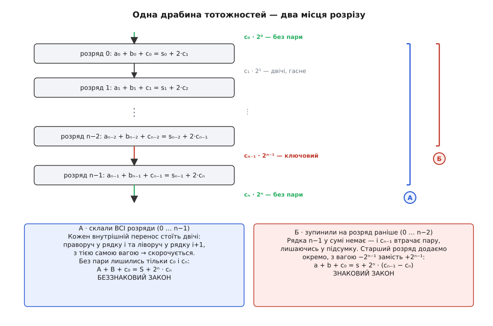
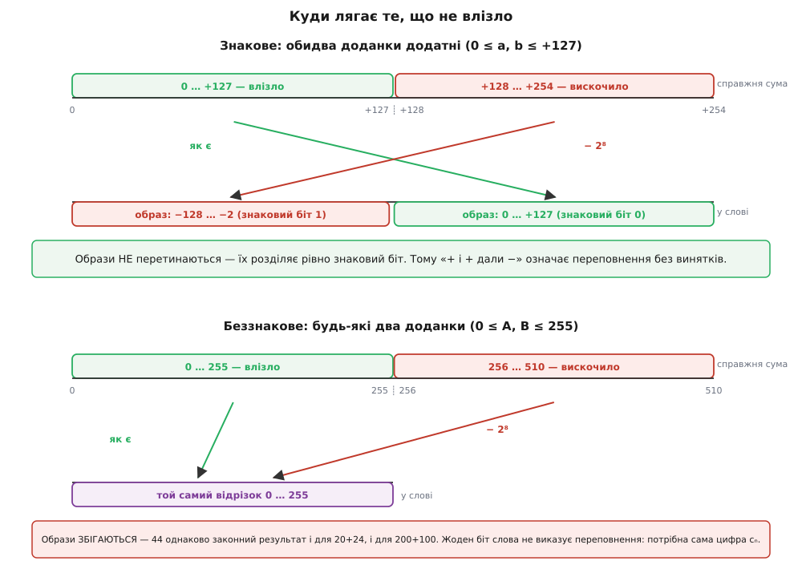

# 🧮 Чому XOR переносів ловить переповнення

Про знакове переповнення в доповняльному коді ходять дві прикмети, і обидві правдиві.

Перша зрозуміла: **два доданки однакового знаку дали суму протилежного знаку**. Друга загадкова: **перенос, що зайшов у старший розряд, не дорівнює переносу, що вийшов з нього**, тобто `V = cₙ₋₁ ⊕ cₙ`.

Друга прикмета мала б насторожувати. «Виключне або» — операція булевої алгебри; вона нічого не знає ні про діапазон, ні про знак, ні про те, які числа ви мали на увазі. А переповнення — подія суто арифметична: справжня сума не вмістилась у відведені n розрядів. І от XOR двох дротів збігається з цією арифметичною подією **точно**: без винятків, без «майже», без окремих застережень для нуля чи для найменшого від'ємного. Такі збіги в арифметиці не трапляються самі собою — за ними завжди щось стоїть.

Стоїть ось що: XOR тут узагалі не логічна операція. Це **арифметична похибка**, яка вдягла булеву маску. Щоб її роздягти, почнімо з єдиного, що суматор насправді вміє.

### Усе, що вміє суматор, — одна цифра за раз

Схема, яка складає два n-бітні числа, не знає ні про знак, ні про діапазон, ні про доповняльний код. Вона знає одне-єдине правило, і те правило стосується **одного розряду**.

Візьмімо розряд номер i. У нього заходять три біти: aᵢ, bᵢ і перенос cᵢ з молодшого сусіда. Їхня сума — ціле число від 0 до 3. Одним двійковим розрядом такі числа не запишеш: двійка й трійка туди не влазять. Отже, потрібні два розряди — молодша цифра лишається тут, старша їде до сусіда ліворуч. Це і є вся операція:

```
aᵢ + bᵢ + cᵢ = sᵢ + 2·cᵢ₊₁
```

Ліворуч — три біти, що зайшли. Праворуч — те саме число, записане двома цифрами: sᵢ лишається в розряді i, а cᵢ₊₁ переїздить у розряд i+1 і тому важить удвічі. Це не «правило суматора» й не чиясь домовленість — це буквально означення того, що значить записати число від 0 до 3 двома двійковими цифрами.

Сама ідея, що цифра має вагу за своїм місцем, а надлишок понад основу переїздить до сусіда старшою цифрою, — це [позиційний запис](book:math/positional-systems): число дорівнює сумі своїх цифр, помножених на ваги 2⁰, 2¹, 2², …, і жодна цифра не сміє дорівнювати основі чи перевищити її. Як із цього правила виростає складання двійкових чисел стовпчиком, розряд за розрядом, розбирає [арифметика в двійковій системі](book:math/binary-arithmetic).

Зверніть увагу на головне: **перенос — це цифра**. Не сигнал, не прапорець, не ознака поломки — старша цифра двоцифрової відповіді. Усе, що буде далі, виросте з цього одного рядка й ні з чого більше.

### Драбина, що сама себе гасить

Зберімо розряди докупи. Рядок розряду i описує події з вагою 2ⁱ, тож помножмо його на 2ⁱ і складімо всі рядки від i = 0 до i = n−1:

```
Σ 2ⁱ·aᵢ  +  Σ 2ⁱ·bᵢ  +  Σ 2ⁱ·cᵢ   =   Σ 2ⁱ·sᵢ  +  Σ 2ⁱ⁺¹·cᵢ₊₁
                          (усі суми: i = 0 … n−1)
```

Перші два доданки ліворуч — це просто беззнакові значення A і B, а перший праворуч — беззнакове значення результату S. Лишились переноси, і саме з ними стається цікаве. Ліворуч вони стоять із вагами 2⁰·c₀, 2¹·c₁, …, 2ⁿ⁻¹·cₙ₋₁. Праворуч — 2¹·c₁, 2²·c₂, …, 2ⁿ·cₙ. Придивіться: c₁ важить 2¹ і ліворуч, і праворуч. c₂ важить 2² і там, і там. І так кожен перенос, народжений усередині слова: він виходить із рядка i−1 праворуч і тієї ж миті заходить у рядок i ліворуч — з тією самою вагою. Усі вони скорочуються.

Усі, та не всі. У c₀ немає партнера праворуч, бо немає рядка «мінус першого», з якого він міг би вийти. У cₙ немає партнера ліворуч, бо немає рядка n, у який він міг би зайти. Ці двоє переживають скорочення:

```
A + B + c₀ = S + 2ⁿ·cₙ            ← беззнаковий закон
```

Це точна рівність цілих чисел — не наближення, не «за модулем», не «зазвичай». І в ній уже сидить відповідь на питання, чому беззнаковий перенос — це просто перенос зі старшого розряду. **Перенос cₙ нічого не «виявляє».** Він — старша цифра правильної відповіді, тієї самої, яку суматор чесно порахував; просто в слові для неї не знайшлося розряду. Справжня сума A + B + c₀ — це (n+1)-цифрове число, молодші n цифр якого лягли в S, а найстарша лишилась у cₙ. Питати «чи сталося беззнакове переповнення» — те саме, що питати «чи не нуль та цифра, яку нікуди було покласти». Ознака збігається з цифрою не тому, що хтось так вигадав схему, а тому, що це одна й та сама річ.

> 🔧 **Навіщо це.** Звідси видно, чому помітити беззнакове переповнення в залізі **безкоштовно**. Суматор не робить ані краплі зайвої роботи: cₙ народжується сам собою як остання сходинка драбини, незалежно від того, дивиться на нього хтось чи ні. Процесор не «перевіряє» суму — він виводить назовні цифру, яка в нього вже є, і тому додавання з прапорцем переносу коштує рівно стільки ж, скільки без нього. А от у мові високого рівня, де цієї цифри не видно, ту саму відповідь доводиться відновлювати обхідними шляхами — і це вже задарма не дається.

### Той самий підрахунок, зупинений на розряд раніше

Тепер найцікавіше. Ми склали всі n рядків і дістали беззнаковий закон. А що як зупинити драбину на **один рядок раніше**?

Складімо рядки від 0 до n−2 — усі, крім найстаршого. Скорочення відбудеться так само, але тепер рядка n−1 у сумі немає, і переносу cₙ₋₁ нема куди заходити. Він втрачає партнера й лишається:

```
Aₗ + Bₗ + c₀ = Sₗ + 2ⁿ⁻¹·cₙ₋₁
```

де Aₗ, Bₗ, Sₗ — значення молодших n−1 бітів. Той самий підрахунок, той самий механізм скорочення — просто розрізаний на розряд раніше, і тому без пари лишилась інша цифра.

Навіщо різати саме там? Бо саме там доповняльний код розходиться з беззнаковим. Молодші n−1 розрядів в обох прочитаннях важать однаково: 2⁰, 2¹, …, 2ⁿ⁻². Уся різниця сидить у старшому розряді — беззнаково він важить +2ⁿ⁻¹, а знаково **−2ⁿ⁻¹**. Це і є суть [доповняльного коду](book:math/twos-complement-algebra): від'ємні числа не позначають окремим знаком, а дають найстаршому розряду від'ємну вагу, тож те саме слово читається двояко, а самі значення різняться рівно на 2ⁿ. Отже, знакове значення — це молодша частина мінус вага старшого біта, якщо той піднятий:

```
a = Aₗ − 2ⁿ⁻¹·aₙ₋₁       b = Bₗ − 2ⁿ⁻¹·bₙ₋₁       s = Sₗ − 2ⁿ⁻¹·sₙ₋₁
```

Далі — чиста підстановка. Складімо a + b, замінивши Aₗ + Bₗ за нашим розрізаним законом:

```
a + b = (Aₗ + Bₗ) − 2ⁿ⁻¹·(aₙ₋₁ + bₙ₋₁)
      = (Sₗ + 2ⁿ⁻¹·cₙ₋₁ − c₀) − 2ⁿ⁻¹·(aₙ₋₁ + bₙ₋₁)
```

А чому дорівнює aₙ₋₁ + bₙ₋₁, ми теж знаємо. Найстарший розряд живе за тим самим правилом, що й решта, — іншого суматор не має:

```
aₙ₋₁ + bₙ₋₁ + cₙ₋₁ = sₙ₋₁ + 2·cₙ     ⟹     aₙ₋₁ + bₙ₋₁ = sₙ₋₁ + 2·cₙ − cₙ₋₁
```

Підставмо й розкриймо дужки:

```
a + b = Sₗ + 2ⁿ⁻¹·cₙ₋₁ − c₀ − 2ⁿ⁻¹·(sₙ₋₁ + 2·cₙ − cₙ₋₁)
      = (Sₗ − 2ⁿ⁻¹·sₙ₋₁) − c₀ + 2ⁿ⁻¹·cₙ₋₁ + 2ⁿ⁻¹·cₙ₋₁ − 2ⁿ·cₙ
      = s − c₀ + 2ⁿ·cₙ₋₁ − 2ⁿ·cₙ
```

Перенесімо c₀ ліворуч — і ось він, близнюк першого закону:

```
a + b + c₀ = s + 2ⁿ·(cₙ₋₁ − cₙ)      ← знаковий закон
```


*Обидва закони — це одна драбина, складена до різних місць. Кожен внутрішній перенос стоїть у ній двічі з однаковою вагою (виходить із рядка i, заходить у рядок i+1) і тому гасне. Складіть усі рядки — без пари лишаться c₀ і cₙ, дістанете беззнаковий закон. Зупиніться на розряд раніше — пару втрачає cₙ₋₁, і після того, як найстарший розряд додано окремо, з від'ємною вагою, виходить знаковий. Два прапорці — не дві різні перевірки, а два місця розрізу одного підрахунку.*

### Ось де народжується XOR

Поставмо два закони поруч. Це та сама сума, ті самі дроти, той самий такт — просто два прочитання:

```
беззнакове:   A + B + c₀ = S + 2ⁿ·cₙ
знакове:      a + b + c₀ = s + 2ⁿ·(cₙ₋₁ − cₙ)
```

Ліворуч у кожному — **справжня** відповідь, та, якої хотіла математика. Праворуч — те, що лягло у слово, плюс **похибка**: наскільки прочитаний результат відхилився від істини.

```
похибка беззнакового:   2ⁿ · cₙ
похибка знакового:      2ⁿ · (cₙ₋₁ − cₙ)
```

Результат правильний рівно тоді, коли похибка нульова. Для беззнакового це `cₙ = 0` — одна цифра. Для знакового це `cₙ₋₁ − cₙ = 0`, тобто `cₙ₋₁ = cₙ` — **рівність двох цифр**. Ось чому знакова ознака дивиться на два переноси, а беззнакова на один: не з примхи схемотехніка, а тому, що такі в них похибки.

Лишився останній крок, і він майже смішний. Нам потрібна ознака «cₙ₋₁ − cₙ ≠ 0» одним бітом. Обидві величини — біти, тож їхня різниця буває тільки −1, 0 або +1, а її модуль — 0 або 1. Випишімо цей модуль для всіх чотирьох випадків:

```
cₙ₋₁  cₙ  │  cₙ₋₁ − cₙ  │  |cₙ₋₁ − cₙ|
  0    0  │      0      │      0
  0    1  │     −1      │      1
  1    0  │     +1      │      1
  1    1  │      0      │      0
```

Останній стовпчик — таблиця істинності «виключного або». Для бітів **XOR і є модуль різниці**: x ⊕ y = |x − y|. Тому

```
V = |cₙ₋₁ − cₙ| = cₙ₋₁ ⊕ cₙ
```

Ніякої логіки тут не було й немає. V — це модуль арифметичної похибки, поділений на 2ⁿ; XOR просто виявився тим, як цей модуль виглядає на двох бітах. Прикмета збігається з подією точно, бо вона **і є** ця подія, лише переписана іншою абеткою.

І тепер видно, що саме XOR **викидає**. Модуль губить знак: він каже, що похибка є, але мовчить про те, чи була вона +2ⁿ, чи −2ⁿ, — тобто в який бік сума вискочила. Той напрямок несе не сам факт нерівності, а те, яка саме з двох цифр піднята: cₙ₋₁ = 1 при cₙ = 0 — похибка +2ⁿ, сума втекла вгору; навпаки — похибка −2ⁿ, сума втекла вниз. Один біт не вмістить трьох станів («усе гаразд», «вгору», «вниз»), тож V відповідає лише на перше питання, а напрямок доводиться діставати з іншого місця.

> 🔧 **Навіщо це.** Похибка знакового закону містить **два** переноси, і один із них — cₙ₋₁ — живе всередині слова. Це не абстракція: у суматорі з послідовним переносом він є фізичним дротом між шостим і сьомим розрядом байта, і взяти його звідти не коштує нічого. У швидких схемах, де переноси рахують наперед, дріт «між розрядами» ніби зникає — але й там cₙ₋₁ лишається окремим сигналом, бо [суматор із прискореним переносом](book:electronics/carry-lookahead-adder) для того й будується, щоб обчислити **всі** переноси паралельно, а не лише останній. Тому V коштує рівно один вентиль XOR понад те, що в схемі вже є, — і саме тому знакове переповнення теж дістається процесорові задарма.

### Дві прикмети — одна подія

Тепер доведімо, що загадкова прикмета й зрозуміла — одне й те саме. Досі ми жодного разу не глянули на знаки. Гляньмо — і побачимо, що вони випадуть самі, без жодного припущення з нашого боку.

Похибка знакового закону дорівнює +2ⁿ рівно тоді, коли cₙ₋₁ = 1, а cₙ = 0. Підставмо ці дві цифри в рівняння найстаршого розряду:

```
aₙ₋₁ + bₙ₋₁ + cₙ₋₁ = sₙ₋₁ + 2·cₙ
aₙ₋₁ + bₙ₋₁ +   1  = sₙ₋₁ + 0
aₙ₋₁ + bₙ₋₁        = sₙ₋₁ − 1
```

І тут арифметика затискає нас у глухий кут — у найкращому сенсі. Ліворуч сума двох бітів: щонайменше 0. Праворуч sₙ₋₁ − 1: щонайбільше 0, бо sₙ₋₁ ≤ 1. Дві рівні між собою величини, з яких одна не менша за нуль, а друга не більша, — обидві нулі. Іншого виходу немає:

```
sₙ₋₁ = 1    і    aₙ₋₁ + bₙ₋₁ = 0,  тобто  aₙ₋₁ = bₙ₋₁ = 0
```

Прочитаймо словами: **обидва доданки мають старший біт 0 (обидва невід'ємні), а результат — старший біт 1 (читається від'ємним)**. Ми не припускали про знаки нічого — вони вискочили з нерівностей, бо інакше рівність не сходиться.

Дзеркальний випадок. Похибка −2ⁿ — це cₙ₋₁ = 0, cₙ = 1:

```
aₙ₋₁ + bₙ₋₁ +   0  = sₙ₋₁ + 2
aₙ₋₁ + bₙ₋₁        = sₙ₋₁ + 2
```

Ліворуч щонайбільше 2, праворуч щонайменше 2 — знову затиснуто намертво:

```
sₙ₋₁ = 0    і    aₙ₋₁ = bₙ₋₁ = 1
```

**Обидва доданки від'ємні, а результат читається невід'ємним.** Складімо все докупи:

```
похибка = +2ⁿ   ⟺   обидва «+», результат «−»      (cₙ₋₁ = 1,  cₙ = 0)
похибка = −2ⁿ   ⟺   обидва «−», результат «+»      (cₙ₋₁ = 0,  cₙ = 1)
похибка =  0    ⟺   усе решта                      (cₙ₋₁ = cₙ)
```

Ось і рівність прикмет. Ліві стовпчики — це `V = cₙ₋₁ ⊕ cₙ`, праві — це «однакові знаки дали інший знак». Не дві умови, а одна подія, побачена з двох боків: з боку переносів (зручно схемі — два дроти й вентиль) і з боку знаків (зручно людині — видно, ЧОМУ ламається саме знак).

Заразом упало й те, що доданки **різних** знаків переповнення дати не можуть: у переліку немає жодного випадку з aₙ₋₁ ≠ bₙ₋₁. Це не окреме правило й не щасливий збіг — просто рівняння найстаршого розряду не має розв'язку з різними знаками при ненульовій похибці.

**Приклад: −70 + −80 на байті.** Обидва доданки від'ємні, справжня сума −150 — за межею −128, тож переповнення мусить бути. Простежмо за обома прикметами:

```
−70 = 10111010        −80 = 10110000

   10111010    (−70)
 + 10110000    (−80)
 ----------
 1 01101010    у слові 01101010 = +106,   перенос-вихід  cₙ = 1

молодші 7 бітів:  0111010 (58) + 0110000 (48) = 106,  а 106 < 128
                  → у старший розряд не зайшло нічого:  cₙ₋₁ = 0

V = cₙ₋₁ ⊕ cₙ = 0 ⊕ 1 = 1        похибка = 2⁸·(cₙ₋₁ − cₙ) = 2⁸·(−1) = −256
знаковий закон:   a + b + c₀ = s + похибка
                  (−70) + (−80) + 0 = (+106) + (−256) = −150   ✓
```

Прикмета знаків: старші біти доданків 1 і 1, старший біт результату 0 — обидва «−» дали «+». Прикмета переносів: 0 ≠ 1. Обидві спрацювали, як і мусили, бо це та сама подія. А похибка ще й показала напрямок: справжня сума втекла **вниз**, за межу −128, і слово повернуло її на 256 угору, викинувши на +106.

### Чому одного оберту досить і чому знак не вміє змовчати

Одне питання ми досі обходили: чому похибка буває лише 0, +2ⁿ або −2ⁿ, а не, скажімо, 2·2ⁿ? Відповідь — у розмірах. Кожен знаковий доданок лежить у −2ⁿ⁻¹ … 2ⁿ⁻¹−1, тож їхня сума разом із переносом-входом не вибереться за межі −2ⁿ … 2ⁿ−1. А вікно, у яке ми її кладемо, має ширину рівно 2ⁿ. Хоч би як не пощастило, справжня сума відстоїть від вікна менш ніж на один оберт — тому одного скидання на ±2ⁿ завжди досить, щоб її туди повернути. Саме тому переповнення описується **одним** бітом: більше станів просто не буває.

А тепер найтонше. Скиданням на 2ⁿ ми повертаємо число у вікно — але куди саме воно там сяде? Візьмімо два невід'ємні доданки. Кожен ≤ +127, тож справжня сума лежить десь у 0 … +254. Розріжмо цей відрізок межею вікна:

```
справжня сума  0 … +127     влізла     → у слові    0 … +127     старший біт 0
справжня сума  +128 … +254  вискочила  → у слові  −128 … −2      старший біт 1
                                          (бо +128 − 256 = −128,  +254 − 256 = −2)
```

Гляньте на праву колонку: два образи **не перетинаються**. Усе, що влізло, читається невід'ємним; усе, що вискочило, читається від'ємним. Між ними немає жодного спільного значення — їх розділяє рівно старший біт. Ось чому прикмета «два плюси дали мінус» працює **без винятків**: це не евристика, що «здебільшого спрацьовує», а точний опис того, куди скидання закидає втікача. Знак не вміє змовчати про знакове переповнення, навіть якби хотів.

І тут-таки видно, чому з беззнаковим цей трюк не проходить. Два беззнакові доданки ≤ 255 дають справжню суму 0 … 510:

```
справжня сума  0 … 255      влізла     → у слові  0 … 255
справжня сума  256 … 510    вискочила  → у слові  0 … 254
```

Образи майже **збігаються**. Слово `00101100` = 44 — це і чесна сума 20 + 24, і обгорнута 200 + 100. Жоден біт результату, жодна їх комбінація, жодне порівняння з чим завгодно всередині слова не відрізнить одне від одного, бо відрізняти нема за чим: обидва рази у слові лежить те саме число. Уся звістка про переповнення пішла в cₙ — і коли ту цифру викинути, вона не «стає непомітною», вона зникає назовсім.


*Куди скидання на 2ⁿ закидає те, що не влізло. Угорі: обидва доданки додатні, і чесні суми сідають у невід'ємну половину вікна, а вискочені — у від'ємну; образи не перетинаються, тож старший біт результату сам їх і розділяє. Унизу: беззнакові образи лягають на той самий відрізок 0 … 255, і у слові їх уже не розрізнити. Знаковому переповненню досить трьох бітів — знаків двох доданків і знаку результату; беззнаковому мало всього слова, бо потрібна цифра, якої у слові немає.*

### Віднімання: той самий закон, перевернута цифра

Обидва закони ми виводили для додавання, а суматор віднімає тим самим залізом: замість B йому подають побітове доповнення ~B, а в перенос-вхід — одиницю. Нових формул це не потребує: закони чинні для будь-яких бітів на входах, а ~B — теж біти.

Беззнаково ~B = (2ⁿ − 1) − B, бо всі одиниці разом і є 2ⁿ − 1. Тож те, що складає суматор, дорівнює

```
A + ~B + 1 = A + (2ⁿ − 1 − B) + 1 = (A − B) + 2ⁿ
```

Справжня різниця, зміщена вгору на 2ⁿ. Саме це зміщення й перевертає прочитання цифри cₙ. Підставмо його в беззнаковий закон: (A − B) + 2ⁿ = S + 2ⁿ·cₙ, звідки

```
A − B = S − 2ⁿ·(1 − cₙ)
```

Коли A ≥ B, різниця невід'ємна, і рівність сходиться лише з cₙ = 1: зміщення 2ⁿ вийшло назовні цілим, позичати не довелося. Коли A < B, різниця від'ємна — а в слові лежать самі невід'ємні біти, тож зміщення 2ⁿ мусить лишитися всередині, щоб підняти S над нулем. Саме його й звуть позикою, і назовні тоді не виходить нічого: cₙ = 0. Отже, **позика — це рівно ¬cₙ**: та сама цифра, той самий дріт, лише зміщений на 2ⁿ сенс.

Знаково — ще коротше. Біти ~B читаються як −1 − b (перевірте на найгіршому: ~`10000000` = `01111111`, тобто +127, а −1 − (−128) якраз +127). Тож ліворуч у знаковому законі стоїть a + (−1 − b) + 1 = a − b, і закон читається

```
a − b = s + 2ⁿ·(cₙ₋₁ − cₙ)
```

Дослівно та сама похибка, та сама `V = cₙ₋₁ ⊕ cₙ`. Один суматор і один вентиль XOR обслуговують чотири різні питання — беззнакове й знакове додавання, беззнакове й знакове віднімання — тими самими двома цифрами. Як цю цифру називає конкретна архітектура (чесним переносом чи інвертованою позикою) і як із неї та знаку складають умови порівнянь, розбирають [умови прапорців](book:electronics/alu-flags/math-flag-conditions.md): там і знакове «менше» як N ⊕ V, і чому C з V ніколи не заважають одне одному.

### Коли переносів не видно

У мові високого рівня жодних cₙ₋₁ і cₙ немає — є лише числа. Але закони від цього нікуди не діваються, і з них прямо випливає, як ту саму перевірку зібрати з того, що лишилось.

Беззнаковий випадок. Закон каже S = A + B − 2ⁿ·cₙ. Порівняймо результат із доданком:

```
S < A   ⟺   A + B − 2ⁿ·cₙ < A   ⟺   B < 2ⁿ·cₙ
```

Якщо cₙ = 0, праворуч нуль, і «B < 0» хибне завжди — беззнакове ж. Якщо cₙ = 1, праворуч 2ⁿ, і «B < 2ⁿ» істинне завжди. Отже, `S < A` — це рівно cₙ = 1, точно й без винятків. Зниклу цифру таки можна відновити, але ціною повного порівняння двох чисел, а не поглядом на один біт.

Знаковий випадок дає ту саму прикмету знаків, згорнуту в бітову формулу. Нам треба «знаки a і b однакові, а знак s інший». Вираз `a ^ s` має старший біт 1 рівно тоді, коли знаки a і s різні; так само `b ^ s`. Їхнє «і» має старший біт 1 тоді, коли **обидва** доданки різняться знаком із результатом, — а таке можливе, лише коли між собою вони однакові:

```
((a ^ s) & (b ^ s)) < 0     ⟺     V = 1
```

І тут-таки пастка, через яку цього рядка не можна писати в C просто так. Мова не обіцяє, що `a + b` для знакових узагалі щось поверне: знакове переповнення в C — **невизначена поведінка**, тож перевіряти суму *після* того, як ти її обчислив, запізно. Програма вже зламана, і оптимізатор має повне право викинути перевірку разом із гілкою, бо «цього не буває». Цікаво, що C23 нарешті зобов'язав знакові типи бути саме доповняльним кодом — а переповнення все одно лишив невизначеним, щоб не забирати в компіляторів простору для оптимізацій. Беззнакові такої біди не мають: зведення до беззнакового типу стандарт визначає як лишок за модулем 2ⁿ, тож `S < A` — цілком законний код.

Правильний спосіб — попросити в компілятора те, що процесор і так має. C23 завів для цього окремий заголовок, а Rust виніс обидві цифри просто в тип результату:

:::tabs
```c
#include <stdckdint.h>   /* C23: ckd_add / ckd_sub / ckd_mul */
#include <stdint.h>
#include <stdio.h>

int main(void) {
    /* Знакове. Порахувати a + b, а потім «перевірити» — запізно:
       саме переповнення вже невизначене. Тож питаємо ДО того.
       ckd_add рахує так, ніби точність нескінченна, кладе молодші
       біти в s і повертає true, якщо справжня відповідь не влізла. */
    int8_t s;
    if (ckd_add(&s, (int8_t)127, (int8_t)1))
        printf("знакове вискочило, у слові лишилось %d\n", s);   /* −128 */

    /* Беззнакове. Цифри cₙ не видно — відновлюємо її порівнянням,
       бо зведення до uint8_t стандарт визначає як лишок за 2⁸.   */
    uint8_t A = 200, B = 100;
    uint8_t S = (uint8_t)(A + B);            /* 300 → 44 */
    printf("%d + %d = %d, перенос = %d\n", A, B, S, S < A);  /* 44, 1 */
    return 0;
}
```
```rust
fn main() {
    // overflowing_add повертає РІВНО пару з нашого закону:
    // що лягло у слово  +  чи похибка ненульова.
    let (s, v) = 127i8.overflowing_add(1);
    println!("{s} {v}");                     // -128 true

    // Той самий виклик для беззнакового — але цей прапорець
    // уже не V, а сама цифра cₙ: 300 не влізло у байт.
    let (s, c) = 200u8.overflowing_add(100);
    println!("{s} {c}");                     // 44 true

    // Коли обгортання — саме те, що треба, його просять уголос:
    assert_eq!(127i8.wrapping_add(1), -128);
    // Коли не треба — None замість тихої брехні:
    assert_eq!(127i8.checked_add(1), None);
}
```
:::

Rust тут показовий: `overflowing_add` повертає пару «результат і ознака» — буквально ті самі дві величини, що стоять по різні боки наших законів. Для знакового типу другий елемент пари — це V, для беззнакового — сама цифра cₙ; той самий метод, те саме залізо під ним, різні питання.

> 🔧 **Навіщо це.** Обидва рядки — `S < A` і `((a ^ s) & (b ^ s)) < 0` — коректні, і вивели ми їх строго. Але писати їх руками варто лише там, де інакше не можна, і ось чому: процесор ті самі відповіді вже має готовими в прапорцях, а компілятор із `ckd_add` чи `overflowing_add` просто прочитає їх звідти — вийде одна команда переходу замість порівняння з XOR-ами. Ручна ж перевірка знакового випадку до того ж мусить обходити невизначену поведінку, а не наступати на неї. Тобто явна перевірка не лише коротша в записі — вона ще й швидша, бо повертає нас туди, звідки ми почали: до двох цифр, які суматор порахував задарма.

### Що з цього лишається

Уся будова тримається на одному рядку — на тому, що розряд суматора вміє тільки записати число 0…3 двома цифрами: `aᵢ + bᵢ + cᵢ = sᵢ + 2·cᵢ₊₁`. Складіть ці рядки з вагами по всіх n розрядах — внутрішні переноси погасять одне одного, і лишиться беззнаковий закон `A + B + c₀ = S + 2ⁿ·cₙ`, де cₙ виявляється не ознакою, а просто старшою цифрою правильної відповіді, якій не дісталось розряду. Зупиніть ту саму драбину на розряд раніше й додайте найстарший біт окремо, з від'ємною вагою, — вийде знаковий закон `a + b + c₀ = s + 2ⁿ·(cₙ₋₁ − cₙ)`.

Далі все падає само. Похибка знакового прочитання дорівнює 2ⁿ·(cₙ₋₁ − cₙ), тож «результат правильний» — це «дві цифри рівні», а «неправильний» — це модуль їхньої різниці; на бітах модуль різниці і є XOR. Підставте ту різницю назад у рівняння найстаршого розряду — і нерівності затиснуть єдиний можливий розв'язок намертво: однакові знаки доданків і протилежний знак результату. Звідси й тотожність двох прикмет, і неможливість переповнення при різних знаках. А оскільки доданки не годні завести суму далі, ніж на один оберт від вікна, одного біта на всю цю історію вистачає.

Лишається асиметрія, заради якої варто було рахувати. Знакове переповнення видає себе саме: скидання на 2ⁿ неминуче закидає втікача в чужу за знаком половину вікна, тож старший біт мусить збрехати — і ця брехня і є доказом. Беззнакове ж не видає себе нічим: обгорнута сума сідає рівно туди, де сидять законні, і жодного сліду у слові не лишає. Тому знак доводиться читати, а перенос — зберігати.
