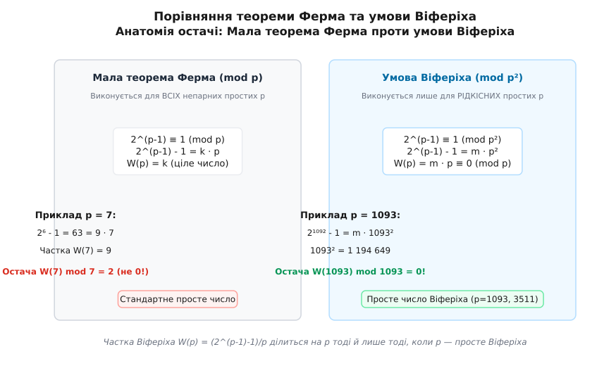
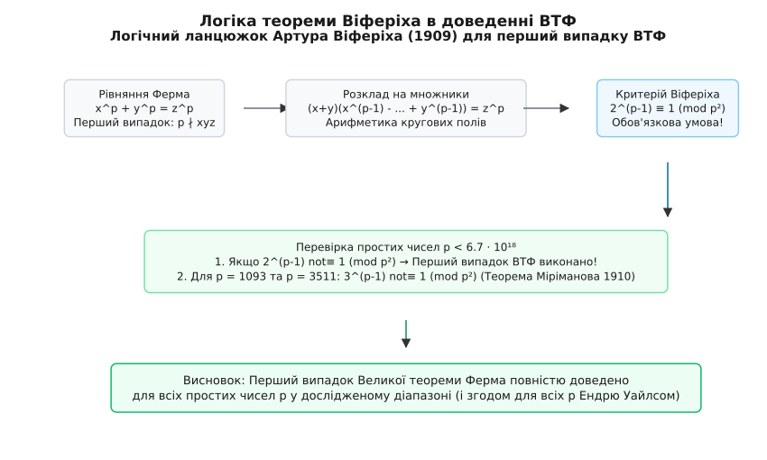
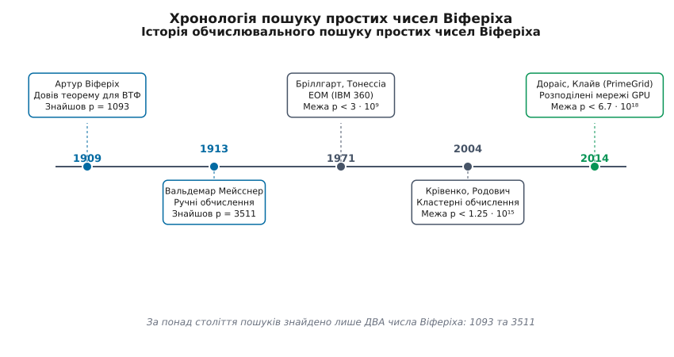

# Прості числа Віферіха

<preknowlist>
- [Мала теорема Ферма](topic:math/fermat-little-theorem) — розширена інформація про властивість `aᵖ⁻¹ ≡ 1 (mod p)` для непарних простих чисел `p`.
- [Модульна арифметика](topic:math/modular-arithmetic) — порівняння за модулем, обчислення остач та квадрат модульного модуля `p²`.
- [Велика теорема Ферма](topic:math/fermats-last-theorem) — діофантове рівняння `xⁿ + yⁿ = zⁿ` та його поділ на перший і другий випадки.
- [Прості числа Мерсенна](topic:math/mersenne-primes) — числа виду `2ⁿ - 1` та їхні прості дільники.
</preknowlist>

Якщо взяти довільне непарне просте число `p` і піднести двійку до степеня `p - 1`, то за Малою теоремою Ферма результат при діленні на `p` завжди дає остачу 1. Це означає, що різниця `2ᵖ⁻¹ - 1` завжди ділиться на `p` націло. Однак якщо поставити значно суворіше та глибше запитання — чи ділиться ця сама різниця `2ᵖ⁻¹ - 1` не просто на `p`, а на **квадрат** простого числа `p²`, — відповідь виявиться дивовижно рідкісною. Переважна більшість простих чисел залишають ненульову остачу від ділення різниці `2ᵖ⁻¹ - 1` на `p²`. Лише для двох простих чисел серед багатьох мільярдів перевірених — числа `1093` та числа `3511` — ця остача дорівнює нулю.

Прості числа `p`, для яких виконується порівняння `2ᵖ⁻¹ ≡ 1 (mod p²)`, називаються **простими числами Віферіха** (Wieferich primes). Вони лежать на фундаментальному перетині алгебраїчної теорії чисел, діофантового аналізу, p-адичної аналітичної геометрії та теорії ймовірностей, а їхній пошук став одним із найвідоміших завдань практичних комп'ютерних обчислень у теорії чисел.



*Різниця між звичайним простим числом та простим числом Віферіха: у той час як Мала теорема Ферма вимагає лише подільності 2ᵖ⁻¹ - 1 на p, умова Віферіха вимагає подільності на квадрат p².*

## Від остачі за модулем p до остачі за модулем p²

Зведемо фундаментальне розрізнення до мови модульної арифметики. Для будь-якого непарного простого числа `p` розглянемо ціле число:

```
2ᵖ⁻¹ - 1 = k · p   для деякого цілого k
```

Число `k` залежить від `p` і зветься **часткою Віферіха (або часткою Ферма)**:

```
W(p) = (2ᵖ⁻¹ - 1) / p
```

Мала теорема Ферма гарантує, що `W(p)` є цілим числом для будь-якого `p > 2`. Тепер дослідимо ділення `W(p)` на `p`. Оскільки `W(p)` може давати будь-яку з остач `0, 1, 2, …, p - 1` при діленні на `p`, ми маємо `p` рівноможливих варіантів остачі.

Якщо остача `W(p) mod p` дорівнює нулю, тобто `W(p) ≡ 0 (mod p)`, це означає, що `W(p) = m · p` для деякого цілого `m`. Підставляючи це у формулу для двійки, дістаємо:

```
2ᵖ⁻¹ - 1 = (m · p) · p = m · p²
```

Отже, умова `W(p) ≡ 0 (mod p)` повністю рівносильна порівнянню `2ᵖ⁻¹ ≡ 1 (mod p²)`.

Перевіримо це правило послідовно на перших непарних простих числах, аби наочно переконатися, наскільки важко для простого числа стати числом Віферіха:

- Для **`p = 3`**:
  ```
  2³⁻¹ - 1 = 2² - 1 = 3
  3 mod 3² = 3 mod 9 = 3 ≠ 0
  W(3) = 3 / 3 = 1 ≢ 0 (mod 3)
  ```
  Остача дорівнює 1. Отже, 3 не є числом Віферіха.

- Для **`p = 5`**:
  ```
  2⁵⁻¹ - 1 = 2⁴ - 1 = 15
  15 mod 5² = 15 mod 25 = 15 ≠ 0
  W(5) = 15 / 5 = 3 ≢ 0 (mod 5)
  ```
  Остача дорівнює 3. Отже, 5 не є числом Віферіха.

- Для **`p = 7`**:
  ```
  2⁷⁻¹ - 1 = 2⁶ - 1 = 63
  63 mod 7² = 63 mod 49 = 14 ≠ 0
  W(7) = 63 / 7 = 9 ≡ 2 (mod 7)
  ```
  Остача дорівнює 2, а не 0. Отже, 7 не є числом Віферіха.

- Для **`p = 11`**:
  ```
  2¹⁰ - 1 = 1023
  1023 mod 11² = 1023 mod 121 = 55 ≠ 0
  W(11) = 1023 / 11 = 93 ≡ 5 (mod 11)
  ```
  Остача дорівнює 5.

- Для **`p = 13`**:
  ```
  2¹² - 1 = 4095
  4095 mod 13² = 4095 mod 169 = 39 ≠ 0
  W(13) = 4095 / 13 = 315 ≡ 3 (mod 13)
  ```
  Остача дорівнює 3.

- Для **`p = 17`**:
  ```
  2¹⁶ - 1 = 65535
  65535 mod 17² = 65535 mod 289 = 238 ≠ 0
  W(17) = 65535 / 17 = 3855 ≡ 13 (mod 17)
  ```
  Остача дорівнює 13.

- Для **`p = 19`**:
  ```
  2¹⁸ - 1 = 262143
  262143 mod 19² = 262143 mod 361 = 228 ≠ 0
  W(19) = 262143 / 19 = 13797 ≡ 4 (mod 19)
  ```
  Остача дорівнює 4.

- Для **`p = 23`**:
  ```
  2²² - 1 = 4194303
  4194303 mod 23² = 4194303 mod 529 = 483 ≠ 0
  W(23) = 4194303 / 23 = 182361 ≡ 21 (mod 23)
  ```
  Остача дорівнює 21.

- Для **`p = 29`**:
  ```
  2²⁸ - 1 = 268435455
  268435455 mod 29² = 268435455 mod 841 = 435 ≠ 0
  W(29) = 268435455 / 29 = 9256395 ≡ 15 (mod 29)
  ```
  Остача дорівнює 15.

- Для **`p = 31`**:
  ```
  2³⁰ - 1 = 1073741823
  1073741823 mod 31² = 1073741823 mod 961 = 341 ≠ 0
  W(31) = 1073741823 / 31 = 34636833 ≡ 11 (mod 31)
  ```
  Остача дорівнює 11.

- Для **`p = 37`**:
  ```
  2³⁶ - 1 = 68719476735
  W(37) = (2³⁶ - 1) / 37 ≡ 31 (mod 37)
  ```
  Остача дорівнює 31.

- Для **`p = 41`**:
  ```
  2⁴⁰ - 1 = 1099511627775
  W(41) = (2⁴⁰ - 1) / 41 ≡ 15 (mod 41)
  ```
  Остача дорівнює 15.

- Для **`p = 43`**:
  ```
  2⁴² - 1 = 4398046511103
  W(43) = (2⁴² - 1) / 43 ≡ 12 (mod 43)
  ```
  Остача дорівнює 12.

- Для **`p = 47`**:
  ```
  2⁴⁶ - 1 = 70368744177663
  W(47) = (2⁴⁶ - 1) / 47 ≡ 14 (mod 47)
  ```
  Остача дорівнює 14.

Будь-яке просте число, для якого остача `W(p) mod p` є ненульовою, називається **звичайним (не-віферіховим) простим числом**. Для таких чисел квадратичний модуль `p²` залишає ненульовий «хвіст» при діленні `2ᵖ⁻¹ - 1`.

Першим винятком у нескінченному рядку простих чисел є **`p = 1093`**. Перевіримо його остачу:

```
1093² = 1 194 649
2¹⁰⁹² - 1 = m · 1 194 649
W(1093) = (2¹⁰⁹² - 1) / 1093 ≡ 0 (mod 1093)
```

Отже, `1093` задовольняє порівняння `2¹⁰⁹² ≡ 1 (mod 1093²)` точно, без остачі. Це перше просте число Віферіха, яке у 1913 році знайшов Вальдемар Мейсснер (Артур Віферіх у 1909 році довів теорему, але чисел Віферіха не обчислював і не знаходив).

Другим винятком є **`p = 3511`**:

```
3511² = 12 327 121
2³⁵¹⁰ - 1 = m · 12 327 121
W(3511) = (2³⁵¹⁰ - 1) / 3511 ≡ 0 (mod 3511)
```

Число `3511` задовольняє порівняння `2³⁵¹⁰ ≡ 1 (mod 3511²)`. Це друге просте число Віферіха, яке у 1922 році знайшов Н. Ґ. В. Г. Біґер (N. G. W. H. Beeger). Докладніше про те, як математики знаходили ці два числа вручну та на перших обчислювальних машинах, описано в історичній вставці [Історія відкриття чисел Віферіха](topic:math/wieferich-primes/hist-wieferich-flt.md).

## Критерій Віферіха для Великої теореми Ферма

Виникає природне запитання: чому взагалі вимогу `2ᵖ⁻¹ ≡ 1 (mod p²)` почали досліджувати? Навіщо підносити двійку до степеня за модулем квадрата простого числа?

Відповідь полягає в тому, що ця умова виникла не як довільна математична забава, а як ключ до розв'язання **першого випадку Великої теореми Ферма**.

Нагадаємо, що Велика теорема Ферма стверджує відсутність цілочисельних розв'язків рівняння:

```
xᵖ + yᵖ = zᵖ   для непарного простого показника p
```

Починаючи з праць Куммера, проблему розділили на два класичних випадки:
1. **Перший випадок (Case 1):** Показник `p` не ділить жодне з чисел `x, y, z` (`p ∤ xyz`).
2. **Другий випадок (Case 2):** Показник `p` ділить принаймні одне з чисел `x, y, z` (`p ∣ xyz`).

Перший випадок тривалий час залишався неприступним для великих простих показників, оскільки відсутність подільності `xyz` на `p` не дозволяла будувати прямі p-адичні суперечності. У 1909 році німецький математик Артур Віферіх довів епохальну теорему, яка перевернула дослідження цього випадку:

> **Теорема Віферіха (1909):** Якщо для непарного простого показника `p` існують цілі числа `x, y, z`, що задовольняють рівняння `xᵖ + yᵖ = zᵖ` за умови `p ∤ xyz` (тобто не виконується перший випадок ВТФ), то просте число `p` **обов'язково мусить бути простим числом Віферіха**, тобто задовольняти порівняння:
>
> `2ᵖ⁻¹ ≡ 1 (mod p²)`



*Логічна схема доведення першого випадку Великої теореми Ферма через критерій Віферіха: якщо 2ᵖ⁻¹ ≢ 1 (mod p²), то перший випадок ВТФ автоматично доведено для показника p.*

Контрапозиція теореми Віферіха є потужним обчислювальним інструментом: якщо для даного простого числа `p` виявиться, що `2ᵖ⁻¹ ≢ 1 (mod p²)`, то рівняння `xᵖ + yᵖ = zᵖ` **не має жодних розв'язків у першому випадку**.

Оскільки майже всі прості числа `p` задовольняють умову `2ᵖ⁻¹ ≢ 1 (mod p²)`, перевірка однієї модульної конгруенції дозволяє за частки секунди довести перший випадок ВТФ для мільйонів простих чисел підряд!

Повне алгебраїчне виведення теореми Віферіха через кругові числа та біноміальний розклад наведено у математичній вставці [Виведення теореми Віферіха та частка Віферіха](topic:math/wieferich-primes/math-wieferich-flt-proof.md).

Звісно, постало запитання про ті два винятки `p = 1093` та `p = 3511`, які задовольняють умову Віферіха. Чи означає це, що для них перший випадок теореми Ферма не виконується? Ні! У 1910 році Дмитро Міріманов підсилив результат Віферіха, довівши, що якщо перший випадок не виконується, то поруч із двійкою аналогічній порівнянності мусить задовольняти й трійка: `3ᵖ⁻¹ ≡ 1 (mod p²)`.

Обчисливши остачі для основи 3, математики з'ясували:

```
3¹⁰⁹² mod 1093² = 485401 ≢ 1 (mod 1093²)
3³⁵¹⁰ mod 3511² = 11186228 ≢ 1 (mod 3511²)
```

Жодне з двох простих чисел Віферіха не задовольняє умову Міріманова! Згодом Фробеніус, Вандівер, Поллачек і Морішіма довели аналогічні умови для основ `q = 5, 7, 11, 13, 17, 19, 23, 29, 31`.

Розглянемо список найменших чисел Віферіха для різних основ `q`:
- Для **`q = 2`**: найменші числа — `1093, 3511`.
- Для **`q = 3`**: найменші числа — `11, 1006003`.
- Для **`q = 5`**: найменші числа — `2, 3, 20771`.
- Для **`q = 7`**: найменші числа — `5, 491531`.

Оскільки для виникнення суперечності в першому випадку ВТФ просте число `p` мусило б бути числом Віферіха одночасно для всіх основ `q ≤ 31`, а спільних винятків серед них немає, перший випадок Великої теореми Ферма було повністю доведено для всіх простих чисел у досліджених діапазонах задовго до загального доведення Ендрю Уайлса 1995 року.

## Арифметика частки Віферіха та p-адичні зв'язки

Частка Віферіха `Wₐ(p) = (aᵖ⁻¹ - 1) / p mod p` володіє властивостями, які роблять її схожою на класичний логарифм.

Розглянемо добуток двох чисел `a` та `b`, взаємно простих із `p`. Завдяки тотожності:

```
(a · b)ᵖ⁻¹ - 1
= (aᵖ⁻¹ - 1) · bᵖ⁻¹ + (bᵖ⁻¹ - 1)
```

Поділивши обидві частини на `p` і застосувавши Малу теорему Ферма `bᵖ⁻¹ ≡ 1 (mod p)`, маємо:

```
Wₐᵦ(p) ≡ Wₐ(p) + Wᵦ(p) (mod p)
```

Частка Віферіха є **адитивною функцією за модулем p** від мультиплікативного аргументу! Вона переводить множення чисел за модулем `p` у додавання остач частки.

Також виконується степеневе правило для будь-якого цілого `k ≥ 1`:

```
W_{a^k}(p) ≡ k · Wₐ(p) (mod p)
```

У p-адичному аналізі p-адичний логарифм `logₚ(x)` визначається через степенний ряд для елементів кільця цілих p-адичних чисел `Zₚ`. Виявляється, що остача частки Віферіха дорівнює точній тотожності:

```
Wₐ(p) ≡ - logₚ(a) / p (mod p)
```

Отже, умова Віферіха `2ᵖ⁻¹ ≡ 1 (mod p²)` означає, що p-адичний логарифм числа 2 ділиться на `p²`, тобто `logₚ(2) ≡ 0 (mod p²)`.

Це глибоке алгебраїчне спостереження пов'язує прості числа Віферіха з алгебраїчною незалежністю p-адичних логарифмів та теорією трансцендентних чисел.

Крім того, постає питання про підйом розв'язків за лемою Гензеля: якщо `2ᵖ⁻¹ ≡ 1 (mod p²)`, чи виконується умова третього степеня `2ᵖ⁻¹ ≡ 1 (mod p³)`? За лемою Гензеля розв'язок `tᵖ⁻¹ ≡ 1 (mod p²)` піднімається до єдиного розв'язку в p-адичних цілих числах `Zₚ`, однак для конкретної основи `a = 2` значення `2ᵖ⁻¹ mod p³` дорівнює `1 + k · p²`.

Безпосередні обчислення показують:
- Для `p = 1093`: `2¹⁰⁹² mod 1093³ = 1 + 364 · 1093² ≠ 1`.
- Для `p = 3511`: `2³⁵¹⁰ mod 3511³ = 1 + 1755 · 3511² ≠ 1`.

Отже, жодне з відомих простих чисел Віферіха не є числом Віферіха третього порядку (тобто не задовольняє умову `2ᵖ⁻¹ ≡ 1 (mod p³)`).

Слід також відзначити близьку спорідненість чисел Віферіха з **простими числами Волла-Суня-Суня** (Wall-Sun-Sun primes), які визначаються через періодичність чисел Фібоначчі за модулем `p²`. Для простих чисел Волла-Суня-Суня вимагається, щоб порядок періоду Пізано `π(p²)` збігався з `π(p)`, що рівносильно тому, що `F_{p - (p/5)} ≡ 0 (mod p²)`. На сьогоднішній день не знайдено жодного числа Волла-Суня-Суня.

## Квадратичні дільники чисел Мерсенна

Інше фундаментальне застосування простих чисел Віферіха полягає в дослідженні дільників чисел Мерсенна `M_q = 2^q - 1`, де `q` — просте число.

Число називається **бесквадратним (square-free)**, якщо воно не ділиться на квадрат жодного простого числа (тобто в його розкладі на прості множники всі показники дорівнюють 1). Відома проблема теорії чисел запитує: чи є всі числа Мерсенна бесквадратними?

Теорема пов'язує це питання безпосередньо з простими числами Віферіха:

> **Теорема про квадрати дільників:** Якщо квадрат простого числа `p²` ділить число Мерсенна `2^q - 1`, то `p` **мусить бути простим числом Віферіха**.

Зробимо короткий огляд доведення:
1. Якщо `p² ∣ (2^q - 1)`, то `2^q ≡ 1 (mod p²)`, і отже `2^q ≡ 1 (mod p)`.
2. Порядок двійки за модулем `p`, позначений `d = ord_p(2)`, мусить ділити просте число `q`. Оскільки `2¹ ≢ 1 (mod p)`, маємо `d = q`.
3. За Малою теоремою Ферма `d ∣ (p - 1)`, тому `q ∣ (p - 1)`.
4. Тепер розглянемо порядок двійки за модулем `p²`: `D = ord_{p²}(2)`. Оскільки `2^q ≡ 1 (mod p²)`, маємо `D = q`.
5. Порядок `D = q` ділить `φ(p²) = p(p - 1)`. Оскільки `gcd(q, p) = 1`, маємо `q ∣ (p - 1)`.
6. Підносячи порівняння `2^q ≡ 1 (mod p²)` до степеня `(p - 1)/q`, дістаємо `2ᵖ⁻¹ ≡ 1 (mod p²)`.

Розглянемо практичні приклади дільників кількох невеликих чисел Мерсенна:
- Для `q = 11`: `M₁₁ = 2¹¹ - 1 = 2047 = 23 · 89`. Жодне з чисел `23` та `89` не є числом Віферіха, а їхні квадрати `23² = 529` та `89² = 7921` не ділять 2047.
- Для `q = 23`: `M₂₃ = 2²³ - 1 = 8388607 = 47 · 178481`. Числа `47` та `178481` не є числами Віферіха, і `M₂₃` є бесквадратним.
- Для `q = 29`: `M₂₉ = 2²⁹ - 1 = 536870911 = 233 · 1103 · 2089`. Жоден із квадратів не ділить `M₂₉`.

З цієї теореми випливає важливий практичний висновок: **якщо серед дільників числа Мерсенна трапиться квадрат `p²`, то це просте число `p` обов'язково є числом Віферіха**.

На сьогоднішній день перевірено, що відомі числа Віферіха `1093` та `3511` не ділять жодне число Мерсенна `M_q` для простих `q < 10⁶`. Отже, всі досліджені числа Мерсенна є бесквадратними.

## Ймовірнісні оцінки, гіпотеза ABC та скільки їх існує

Скільки взагалі існує простих чисел Віферіха? Чи їхня кількість скінченна, чи їх нескінченно багато?

Сьогодні відповідь на це запитання залишається **відкритою проблемою теорії чисел**. Однак евристичний імовірнісний аналіз дозволяє зробити дивовижно точні передбачення.

Зафіксуємо просте число `p`. За Малою теоремою Ферма число `2ᵖ⁻¹ - 1` є кратним `p`. Значення частки `W(p) = (2ᵖ⁻¹ - 1) / p` може давати будь-яку з остач `0, 1, 2, …, p - 1` за модулем `p`.

Якщо припустити, що остача `W(p) mod p` розподілена випадковим чином і рівномірно серед `p` можливих значень, то ймовірність того, що просте число `p` є числом Віферіха, дорівнює:

```
P(p є Віферіховим) = 1 / p
```

Згідно з теоремою Мертенса про суму обернених простих чисел, очікувана кількість простих чисел Віферіха у діапазоні від 2 до `X` обчислюється як сума ймовірностей:

```
E[N(X)] = ∑_{p ≤ X} (1 / p) = ln(ln(X)) + M + O(1 / log X)
```

де `M ≈ 0.261497` — константа Мейсселя-Мертенса.

Поява логарифма логарифма `ln(ln(X))` береться від інтегрування функції щільності простих чисел `1 / (t · ln t)` за теоремою про розподіл простих чисел.

Підставимо у цю формулу сучасну межу комп'ютерного пошуку `X = 6.7 · 10¹⁸`:

```
ln(X) = ln(6.7 · 10¹⁸) ≈ 43.348
ln(ln(X)) = ln(43.348) ≈ 3.769
E[N(6.7 · 10¹⁸)] ≈ 3.769 + 0.261 ≈ 4.03
```

Ймовірнісна модель передбачає, що в діапазоні до `6.7 · 10¹⁸` має існувати близько **4 простих чисел Віферіха**. Практичні обчислення виявили рівно **2 числа** (`1093` та `3511`). З точки зору теорії ймовірностей, знаходження двох об'єктів при математичному сподіванні близько чотирьох є блискучим підтвердженням імовірнісної моделі!

З цієї ж формули випливає гіпотеза: **простих чисел Віферіха існує нескінченно багато**, але їхня кількість зростає надзвичайно повільно — як потрійний логарифм від числа кандидатів.

Що стосується звичайних (не-віферіхових) простих чисел, то у 1988 році Джозеф Сільверман довів: якщо вірна **гіпотеза ABC**, то існує нескінченно багато простих чисел `p`, які **не** є числами Віферіха, і їхня кількість до `X` зростає щонайменше як `C · log(X)`.



*Історична хронологія комп'ютерного пошуку простих чисел Віферіха від праць Віферіха, Мейсснера та Біґера до проекту PrimeGrid.*

## Обчислювальний пошук та сучасні алгоритми

Оскільки ймовірність знайти нове число Віферіха для великого `p` дорівнює `1/p`, перевірка окремого простого числа вимагає швидких модульних обчислень.

Шуканий алгоритм спирається на **двійкове піднесення до степеня за модулем p²**. Двома головними перешкодами під час програмування є:

1. **Розмір модуля:** Для простих чисел `p > 4.29 · 10⁹` квадрат `p² > 1.84 · 10¹⁹` не вміщується у стандартний 64-бітний беззнаковий тип `uint64_t`. Компілятори розв'язують це через 128-бітний тип `unsigned __int128`.
2. **Швидкодія ділення:** Операція `% p²` для 128-бітних чисел на процесорі є відносно повільною. На практиці її прискорюють за допомогою **перетворення Монтгомері**, замінюючи ділення на бітові зсуви.

Детальну програмну реалізацію мовами C та C++ з використанням паралельних потоків наведено у практичній вставці [Реалізація пошуку простих чисел Віферіха](topic:math/wieferich-primes/proj-wieferich-search.md).

Для інтеграції функцій верифікації у сторонні системи аналізу розроблено програмний інтерфейс (C API) та інструмент командного рядка, які описано у довідковій вставці [Інтерфейс бібліотеки та CLI верифікатора](topic:math/wieferich-primes/api-wieferich-verifier.md).

> 🔧 **Навіщо це.**
> Дослідження простих чисел Віферіха та перевірка конгруенцій виду `aᵖ⁻¹ ≡ 1 (mod p²)` є основою для тестування бесквадративності великих чисел, криптографічної стійкості алгоритмів на основі точкових груп еліптичних кривих та оптимізації критеріїв простоти у розподілених обчислювальних мережах. Технології швидкого піднесення до степеня за модулем `p²`, розроблені для пошуку чисел Віферіха, безпосередньо застосовуються в асиметричній криптографії (RSA, ECC, Paillier) для захисту даних.
