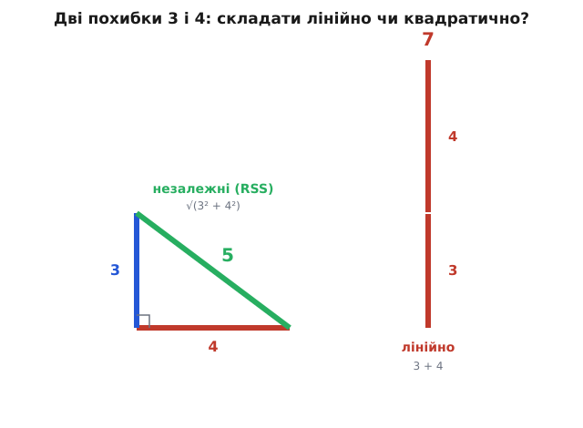
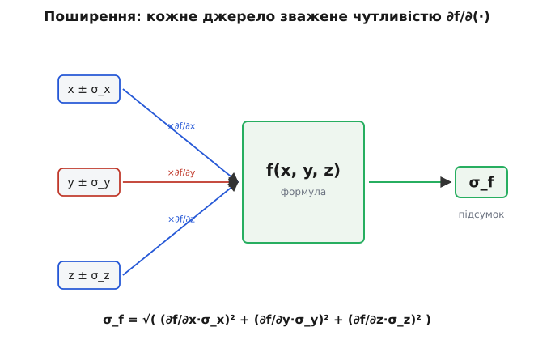

# 🧮 Бюджет похибок

> Жодне вимірювання не буває точним: кожне число тягне за собою хвостик невизначеності. Коли таких чисел кілька й вони складаються в один результат, постає питання, на яке інтуїція відповідає неправильно — **наскільки невпевнений підсумок?** Тут розберемо, як зводити похибки з різних джерел в одну, **чому** незалежні складаються квадратично, а найгірший випадок — лінійно, і як похибка проходить крізь формулу.

### Звідки взагалі береться питання

Уявіть найпростішу річ: ви міряєте довжину столу, прикладаючи метрову лінійку двічі. Кожне прикладання — не ідеальне: око зміщує позначку на якийсь міліметр-два туди-сюди. Перший відрізок ви знаєте з точністю ±1 мм, другий — теж ±1 мм. Питання, яке вирішує все подальше: довжина столу — це сума двох відрізків, а з якою точністю ви знаєте **суму**? Інстинкт підказує «±2 мм»: дві похибки по міліметру, складемо — два. І саме цей інстинкт здебільшого хибний.

Хибний він тому, що мовчки припускає найгірше: ніби обидва промахи неодмінно ляжуть в один бік — перший відрізок ви завищили на міліметр **і** другий завищили на міліметр, тож завищення накопичилися. Але промах лінійки — випадковий: цього разу око зсунулося праворуч, наступного ліворуч, без жодної змови між двома прикладаннями. Здебільшого один промах частково гасить інший, і реальна невизначеність суми виходить **меншою** за просте додавання. Наскільки меншою — це не питання смаку, на нього є точна відповідь, і вона починається з того, щоб розрізнити два геть різні сценарії складання.

> 🔧 **Навіщо це.** Бюджет похибок (англ. *error budget* — кошторис похибок) — це таблиця, де інженер виписує всі джерела невизначеності пристрою (давач, опорна напруга, температурний дрейф, шум АЦП) і зводить їх в одне число: яку точність система видасть на виході. Без такого кошторису ви або переплачуєте за зайво точні деталі там, де вони не вирішують, або, навпаки, дивуєтеся, чому прилад бреше, хоча кожен компонент «начебто точний».

### Два способи скласти: найгірший випадок і незалежні джерела

Перший спосіб — **найгірший випадок** (worst case). Тут ми свідомо припускаємо найгіршу можливу збіжність обставин: усі похибки промахнулися в один бік одночасно й підсилили одна одну. Тоді вони складаються найпрямолінійніше — **лінійно**, простим додаванням модулів:

```
Δ_сум = Δ₁ + Δ₂ + Δ₃ + …
```

Це чесна **верхня межа**: гірше за неї точно не буде, бо гіршого збігу, ніж «усі промахнулися максимально й в один бік», просто не існує. За це гарантії платять ціну — межа песимістична. Імовірність, що десяток незалежних похибок справді змовляться й усі ляжуть в один бік на повну, мізерна, тож реальний розкид майже завжди тісніший.

Другий спосіб питає не «як гірше за все», а «як буде **зазвичай**», і саме він описує більшість вимірювань. Якщо джерела похибок **незалежні** — кожне промахується саме по собі, не знаючи про інші, — вони не складаються в лоб. Вони частково гасять одне одного, бо знаки промахів випадкові: десь плюс, десь мінус. Складають їх **квадратично** — корінь із суми квадратів (англ. *root sum of squares*, RSS):

```
σ_сум = √(σ₁² + σ₂² + σ₃² + …)
```

Тут σ (грецька «сигма») — стандартна міра розкиду одного джерела, його [типове відхилення](book:math/mean-variance) від істинного значення. Дві формули дають разюче різні числа. Повернімося до тих самих двох похибок, тільки візьмімо їх покрупніше — 3 і 4 (в однакових одиницях), щоб арифметика була чистою:

```
найгірший випадок:  Δ = 3 + 4         = 7
незалежні (RSS):    σ = √(3² + 4²)    = √25 = 5
```

Сім проти п'яти з тих самих вхідних чисел. Різниця не косметична: незалежне складання врахувало, що промахи зазвичай не дружать, і дало чесніше — менше — число. Лишається головне питання, без якого формула RSS — просто магічний корінь: **чому саме квадрати?**

### Чому незалежні похибки складаються квадратично

Корінь із суми квадратів — це теорема Піфагора, і це не збіг. Уявіть дві незалежні похибки як два відрізки, які тягнуться в **різних, не пов'язаних напрямках**. Незалежність — це і є «під прямим кутом»: знаючи, куди й наскільки промахнулося перше джерело, ви нічого не дізнаєтеся про друге, так само як зсув уздовж горизонталі нічого не каже про зсув по вертикалі. А коли два відрізки перпендикулярні, їхня спільна довжина — не сума, а гіпотенуза прямокутного трикутника: √(a² + b²).


*Та сама пара похибок, два способи скласти. Незалежні промахи «перпендикулярні», тож зводяться як катети у гіпотенузу — √(3²+4²) = 5. Найгірший випадок ставить їх в один бік, у стовпчик, — 3+4 = 7. Корінь із суми квадратів коротший за пряму суму завжди, окрім виродженого випадку повної залежності.*

Чому саме квадрати, а не самі довжини, видно й без картинки — з того, як поводиться розкид. Коли ви додаєте дві незалежні випадкові величини, додаються не їхні розкиди, а їхні **квадрати розкиду** — величина, яку звуть [дисперсією](book:math/mean-variance) (англ. *variance*, від лат. *variare* — змінюватися). Це властивість самої незалежності: середній квадрат суми двох незалежних відхилень дорівнює сумі їхніх середніх квадратів, бо перехресний доданок (добуток двох промахів) у середньому занулюється — адже знаки промахів незалежні й однаково часто дають плюс і мінус. Запишемо цей ключовий факт прямо:

```
σ_сум² = σ₁² + σ₂²        ← дисперсії додаються (для незалежних)
σ_сум  = √(σ₁² + σ₂²)     ← а відхилення — корінь із суми
```

Ось і вся причина кореня. Природна величина, що складається просто, — це σ², дисперсія; вона адитивна. А σ — лише її корінь, тож і сумарне σ виходить коренем із суми. Перехід «дисперсії додаються → відхилення беруть корінь» — це серце всього бюджету похибок, і він прямо випливає з того, що в незалежних доданків перехресний член зникає.

Звідси одразу й практичний наслідок, який ламає інтуїцію. У сумі квадратів **великий доданок задавлює малі**. Візьмімо похибки 10 і 3:

```
σ = √(10² + 3²) = √(100 + 9) = √109 ≈ 10.44
```

Похибка 3 додала до підсумку аж 0.44 — майже нічого. Її квадрат (9) потонув у квадраті десятки (100). Це означає, що **домінує найбільше джерело**, а боротися варто саме з ним: зменшивши головну похибку вдвічі, ви помітно посунете підсумок, а вилизуючи дрібні — майже ні. Кошторис похибок тому передусім показує, **куди не варто витрачати зусиль**.

> 🔧 **Навіщо це.** Це правило економить гроші просто в специфікації. Якщо в тракті вимірювання одне джерело дає 10 одиниць похибки, а решта — по 2–3, то ставити точніший (і дорожчий) компонент замість котрогось дрібного — викинуті кошти: підсумок не зрушить. Спершу б'ють по найбільшому доданку у квадратичній сумі, і лише коли він зрівнявся з рештою, береться за наступний.

### Коли який спосіб брати

Вибір між лінійним і квадратичним складанням — це не питання зручності, а питання про **природу джерел і про те, що ви обіцяєте**.

Беріть **найгірший випадок** (лінійно), коли потрібна тверда гарантія «не гірше за X»: у допусках, що йдуть у контракт, у запасі міцності, у вимогах безпеки. Тут песимізм доречний — ви свідомо платите трохи зайвого запасу за те, щоб не порушити обіцянку ніколи. Лінійна сума доречна й тоді, коли похибки насправді **не незалежні**, а пов'язані спільною причиною: якщо все коло прогрівається від одного джерела тепла, температурні дрейфи всіх деталей зміщуються разом, в один бік, — і їх чесніше додати лінійно, бо «перпендикулярності» між ними немає.

Беріть **RSS** (квадратично), коли джерела справді незалежні й вас цікавить типовий, очікуваний розкид, а не апокаліптичний: шум давача, випадкова похибка зчитування, незалежні допуски різних деталей. Це опис того, що ви побачите на практиці, повторивши вимір багато разів. Контрольне питання одне: **чи можуть ці промахи мати спільну причину, що зсуває їх разом?** Можуть — лінійно (вони корельовані); не можуть, кожен сам по собі — квадратично.

Між цими полюсами лежить уся правда: реальний розкид майже завжди десь **між** RSS і лінійною сумою, ближче до RSS, якщо джерел багато й вони незалежні. Тому два числа — RSS і найгірший випадок — корисно тримати поряд: перше каже «ось що буде зазвичай», друге — «ось межа, за яку не вийде».

### Поширення похибки крізь формулу

Досі ми складали похибки, що міряються в **тих самих одиницях** і просто додаються в суму. Але частіше результат — це не сума входів, а **формула** над ними: площа = довжина × ширина, потужність = напруга² / опір, швидкість = відстань / час. Похибки входів треба якось провести крізь цю формулу до виходу. І тут одного складання замало: перш ніж складати, кожну похибку треба **зважити** — бо однаковий промах на вході дає різний промах на виході залежно від того, наскільки круто формула реагує саме на цей вхід.

Міра цієї крутості — **похідна** (англ. *derivative*): ∂f/∂x показує, на скільки зміниться вихід f, якщо вхід x ворухнути на одиницю. Її звуть **чутливістю** виходу до даного входу. Маленька похибка входу δx перетворюється на виході на похибку приблизно (∂f/∂x)·δx — вхідне дрожання, помножене на чутливість. Це як важіль: довге плече (велика чутливість) підсилює мале коливання входу, коротке — приглушує.


*Кожне джерело входить у підсумок не «як є», а помножене на свою чутливість ∂f/∂(·) — наскільки круто формула реагує саме на цей вхід. Зважені внески потім складаються квадратично (бо входи незалежні). Та сама похибка входу важить більше там, де функція крутіша.*

Зібравши обидві ідеї — зважування чутливістю й квадратичне складання незалежних, — дістаємо загальну **формулу поширення похибки** (для незалежних входів):

```
σ_f = √( (∂f/∂x · σ_x)² + (∂f/∂y · σ_y)² + (∂f/∂z · σ_z)² )
```

Читається вона просто, попри ∂: кожен доданок під коренем — це «похибка входу, помножена на чутливість до нього»; усе складається квадратично, бо входи незалежні. Для двох найчастіших випадків ця громіздка формула згортається в дуже зручні правила, які варто знати напам'ять.

**Сума чи різниця** (f = x + y або f = x − y). Чутливості дорівнюють 1, тож **складаються самі похибки** — квадратично:

```
σ_f = √(σ_x² + σ_y²)
```

Зверніть увагу: для різниці теж **плюс** під коренем, не мінус. Похибки ніколи не віднімаються — невизначеність від віднімання величин тільки росте, бо обидва промахи додають невпевненості в результат.

**Добуток чи частка** (f = x·y або f = x/y). Тут зручніше рахувати у **відсотках**: складаються квадратично **відносні** похибки:

```
(σ_f / f)² = (σ_x / x)² + (σ_y / y)²
```

Тобто при множенні чи діленні величин складаються їхні відсоткові невизначеності, а не абсолютні. Якщо ви знаєте довжину з точністю 2% і ширину з точністю 3%, площу ви знаєте з точністю √(2² + 3²) ≈ 3.6%, незалежно від самих розмірів.

### Розбір прикладу: точність вимірювання потужності

**Умова.** Прошивка ESP32 рахує потужність навантаження як P = U·I, читаючи напругу U = 12.0 В і струм I = 2.00 А з двох незалежних [АЦП-каналів](book:electronics/adc). Канал напруги дає відносну похибку 1.5%, канал струму — 2.0%. З якою точністю мікроконтролер знає потужність, і скільки це у ватах?

Потужність — добуток, тож складаємо квадратично **відносні** похибки:

```
δU = 1.5%      δI = 2.0%
δP = √(δU² + δI²) = √(1.5² + 2.0²) = √(2.25 + 4.00) = √6.25 = 2.5%
```

Тепер переведемо відсоток у ватти. Номінальна потужність і абсолютна похибка:

```
P  = U·I = 12.0 × 2.00 = 24.0 Вт
ΔP = 2.5% × 24.0 Вт = 0.6 Вт
```

А ось той самий розрахунок у коді прошивки — короткий і реальний:

```c
// Відносні похибки двох АЦП-каналів (з даташита), у частках
const float dU = 0.015f;   // 1.5 %
const float dI = 0.020f;   // 2.0 %

float U = 12.0f, I = 2.00f;           // зчитані значення
float P = U * I;                      // 24.0 Вт

// Добуток → складаємо ВІДНОСНІ похибки квадратично (RSS)
float dP = sqrtf(dU*dU + dI*dI);      // ≈ 0.025  (2.5 %)
float P_abs = dP * P;                 // ≈ 0.6 Вт
// Підсумок: P = 24.0 ± 0.6 Вт
```

**Висновок.** Потужність відома як 24.0 ± 0.6 Вт (±2.5%). Зверніть увагу на головне: 2.5% — це **менше**, ніж проста сума 1.5% + 2.0% = 3.5%, яку підказав би наївний інстинкт, бо канали незалежні й їхні промахи частково гасяться. І видно, який канал домінує: квадрат струмової похибки (4.00) майже вдвічі більший за квадрат напругової (2.25), тож якщо точність треба підтягти, братися слід за **струмовий** канал — поліпшення напругового дасть куди менше.

> 🔧 **Навіщо це.** Саме так читають даташит на вимірювальний тракт. Виробник дає похибку кожного вузла окремо (опорна напруга ±0.1%, підсилювач ±0.5%, АЦП ±0.2%); ваша робота — звести їх у підсумкову точність приладу. Порахувавши кошторис, ви одразу бачите і фінальне число, яке можна обіцяти, і слабку ланку, заміна якої справді щось дасть.

### Де це працює щодня

**Калібрування.** Калібруючи давач за еталоном, ви успадковуєте **і** похибку самого еталона, **і** похибку процедури звірки. Підсумкова невпевненість каліброваного приладу — це RSS цих внесків; саме тому еталон беруть помітно точнішим за прилад — щоб його похибка потонула у квадратичній сумі й не зіпсувала результат.

**Ланцюги давачів.** Між фізичною величиною й числом у програмі стоїть кілька ланок: сам давач, аналоговий тракт, опорна напруга, квантування АЦП, числове перетворення. Кожна додає свою похибку; бюджет зводить їх в одну й каже, чого взагалі варта остання цифра на екрані. Часто виявляється, що молодші біти показника — це чистий шум, і відображати їх — самообман.

**Допуски й збирання.** Коли деталь складається зі стопки елементів із власними допусками, сумарний допуск стопки рахують і за найгіршим випадком (для гарантії, що все влізе), і за RSS (для реалістичного очікування браку). Статистичний, квадратичний підхід зазвичай дозволяє послабити вимоги до окремих деталей — а отже, здешевити виробництво — без реального зростання відсотка браку.

**Багаторазове вимірювання.** Окремий, але споріднений випадок: ви міряєте **те саме** N разів і усереднюєте. Похибки кожного виміру незалежні, тож за тим самим квадратичним законом випадкова похибка середнього падає як √N — щоб удвічі звузити розкид, треба вчетверо більше вимірів. Це пряме застосування «дисперсії додаються»: дисперсія середнього в N разів менша за дисперсію одного виміру.

### Чого кошторис не ловить

Квадратичне складання має чітку межу застосовності, і мовчазне порушення цієї межі — найчастіше джерело хибно оптимістичних кошторисів.

**RSS бреше, коли джерела залежні.** Уся міць кореня зі суми квадратів стоїть на одному припущенні — незалежності. Якщо два джерела насправді ходять разом (спільна температура, спільне живлення, той самий збій годинника), їхній перехресний доданок **не** занулюється, і реальна похибка більша за RSS, ближча до лінійної суми. Перш ніж складати квадратично, чесно спитайте: чи немає спільної причини, що зсуває ці промахи в один бік? Є — лінійно.

**Бюджет ловить випадкове, а не систематичне.** Похибки бувають двох порід. **Випадкова** (random) — це розкид навколо істини, різний щоразу; саме її приборкує RSS і саме її глушить усереднення. **Систематична** (systematic) — це стале зміщення в один бік: незнятий нуль, неврахований температурний дрейф, хибний калібрувальний коефіцієнт. Її усереднення не прибере — скільки не повторюй вимір зі збитим нулем, середнє лишиться зміщеним, — і у квадратичну суму її кидати не можна. Систематику виловлюють і прибирають окремо (калібруванням, корекцією нуля), а вже до залишку застосовують бюджет випадкових похибок. Плутати ці дві породи — означає отримати красивий маленький кошторис і прилад, що стабільно бреше на ту саму величину.

> 🔧 **Навіщо це.** Найбільш дошкульні польові баги — саме систематичні: прилад показує гарну повторюваність (випадкова похибка мала), і йому вірять, а він увесь час зміщений на пів-градуса через неврахований саморозігрів. Кошторис похибок такого не покаже — він про розкид, не про зсув. Тому поряд із бюджетом завжди тримають окреме питання: а що тут може зміщувати результат **стабільно**, і чи я це зняв?
