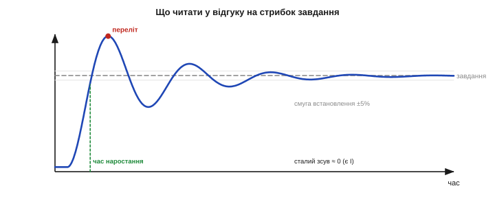
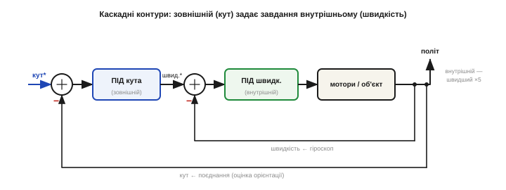
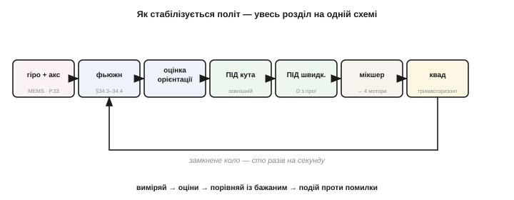

# Налаштування й каскадні контури

Маючи робочий [дискретний ПІД](book:algorithms/discrete-pid), залишаються дві найпрактичніші речі: **навчитися добирати** три коефіцієнти під конкретний апарат — і **структурувати** кілька регуляторів у каскад, як це роблять справжні польотні контролери. Зрештою це доведе нас аж до того, як стабілізується політ дрона.

Це той момент, коли вся теорія зустрічається з реальним апаратом. Можна досконало знати формули P, I та D — і все одно не підняти дрон, якщо не вмієш добрати три числа під **його** мотори, масу й давачі. І навпаки: досвідчений інженер часто налаштовує ПІД майже без розрахунків, на самих спостереженнях за поведінкою. Тож ця тема — менше про математику й більше про **ремесло**: як перетворити робочий код на апарат, що впевнено тримається в повітрі.

### Читати відгук: що каже крива

Налаштування починається з уміння **читати** відгук системи на стрибок завдання. У цій кривій зашифровано все, що треба знати, який коефіцієнт крутити.


*Рис. Що читати у відгуку на стрибок завдання. **Час наростання** — як швидко вихід дістався цілі (замалий Kp — повільно). **Переліт** — наскільки проскочив (завеликий Kp чи замалий Kd). **Час встановлення** — коли заспокоївся в межах ±5 %. **Сталий зсув** — застиг нижче завдання (бракує I). Кожна риса кривої вказує на свою складову.*

Чотири головні риси: **час наростання** (швидкодія — за неї відповідає Kp), **переліт** (надмірна різкість — Kp завеликий або Kd замалий), **час встановлення** (як довго гойдається — демпфування Kd) і **сталий зсув** (недотягування — бракує Ki). Навчившись пов'язувати симптом із коефіцієнтом, ви перетворюєте налаштування з ворожіння на діагностику.

Щоб ці риси побачити, систему треба **спровокувати**: дати стрибок завдання (раптом задати новий кут) або поштовх (легенько штовхнути апарат) і дивитися, як він повертається. У відповіді на таке збурення характер регулятора — як на долоні: млявий повзе назад поволі, надто різкий стрибає туди-сюди, добре налаштований швидко й чисто повертається на місце. Тому серйозне налаштування завжди супроводжують **логуванням**: записують криву відгуку, щоб **бачити**, що насправді робить апарат, а не здогадуватися навпомацки.

### Налаштування вручну

Найнадійніший ручний метод — додавати складові **по черзі**, у правильному порядку: спершу [пропорційну](book:math/proportional-control), потім похідну, наприкінці інтегральну.


*Рис. Ручне налаштування крок за кроком. (1) Лише **P**: піднімайте Kp, доки система не почне ледь коливатися, тоді відступіть приблизно вдвічі. (2) Додайте **D**: він гасить переліт — і дозволяє підняти Kp ще, для швидкості. (3) Додайте **I**: він прибирає сталий зсув. Один коефіцієнт за раз — і видно дію кожного.*

Порядок не випадковий: P дає основну силу, D її приборкує (даючи запас підняти P), а I наприкінці прибирає те, чого не може жоден із них, — сталий зсув. Робити це навпаки чи все одразу — певний шлях до хаосу, де незрозуміло, що на що впливає.

Кілька порад із практики. Міняйте коефіцієнт **відчутними** кроками (скажімо, в півтора раза вгору чи вниз), а не на крихту, — інакше різниці не побачите. Після кожної зміни давайте те саме збурення, щоб порівнювати однакове. І будьте **терплячі**: добре налаштування — це кілька десятків таких циклів, а не одне геніальне вгадування.

І про безпеку: перші проби робіть **обережно**. Дрон — зі знятими пропелерами або міцно закріплений; промисловий привід — на холостому ходу. Завищений Kp чи Kd легко кидає апарат у різке гойдання, тож першу перевірку — «чи в той бік діє регулятор і чи не розгойдується» — варто робити там, де помилка нічого не зламає й нікого не травмує. Лише переконавшись, що контур поводиться розумно, переходять до справжнього польоту.

### Метод Зіглера–Ніколса

Є й напівформальний рецепт — класичний метод **Зіглера–Ніколса** (*Ziegler–Nichols*, 1942), що дає коефіцієнти за двома легко вимірюваними числами. Спершу, лишивши тільки P, піднімають Kp до **граничної жорсткості** Ku, за якої система входить у стійкі, незгасні коливання; заразом міряють їхній **період** Tu.


*Рис. Метод Зіглера–Ніколса. Піднімаємо Kp до граничного Ku, за якого коливання стають **сталими** (ні згасають, ні ростуть), і міряємо їхній період Tu. Тоді коефіцієнти ПІД беруть за готовими формулами від Ku й Tu. Це швидка **відправна точка** — щоправда, агресивна (розрахована на загасання коливань із відношенням сусідніх амплітуд ¼, тож переліт виходить чималий), яку потім підкручують вручну.*

За Ku й Tu коефіцієнти рахують за табличними формулами:

```
 Класичний ПІД за Зіглером–Ніколсом:
   Kp = 0.6 · Ku
   Ki = 1.2 · Ku / Tu          (інтегральний час Ti = 0.5·Tu)
   Kd = 0.075 · Ku · Tu        (диференційний час Td = 0.125·Tu)
```

**Приклад (Зіглер–Ніколс).** Знайдено Ku = 8 і Tu = 0.5 с.

```
 Kp = 0.6·8           = 4.8
 Ki = 1.2·8/0.5       = 19.2
 Kd = 0.075·8·0.5     = 0.3
 → агресивна відправна точка; далі трохи зменшують Kp і донастроюють.
```

Метод цінний як **швидкий старт**, але його налаштування зумисне різке (розраховане на чвертьамплітудне загасання коливань, із чималим перельотом), тож його завжди беруть лише за відправну точку, а не за остаточну істину.

Є й важливе застереження безпеки. Метод вимагає **довести систему до коливань** — а для багатьох апаратів це небезпечно чи руйнівно: ви ж не ганятимете реальний літак чи важкий промисловий привід на самій межі стійкості, ризикуючи аварією. Тому на таких об'єктах Зіглера–Ніколса застосовують обачно — на безпечному стенді чи моделі, а не «наживо». Сам метод народився 1942 року (Джон Зіглер і Натаніель Ніколс, стаття «Оптимальні налаштування автоматичних регуляторів») і дав інженерам перший широко вживаний простий, повторюваний рецепт там, де доти панувало саме лиш відчуття.

### Симптом → ліки

На практиці ж найчастіше налаштовують **за поведінкою**: дивляться на симптом і крутять відповідний коефіцієнт. Ось коротка шпаргалка, що зводить усе вивчене докупи.

Одне застереження до неї: складові **не цілком незалежні**. Піднявши Kp, ви часто посилюєте й переліт (тоді треба підняти Kd), а сильніший Kd може зажадати чистішого виміру. Тому реальне налаштування — не разовий прохід по таблиці, а кілька **ітерацій**: підкрутили одне — перевірили, чи не зіпсувалося інше — підкрутили знову. Гарний кінцевий набір коефіцієнтів завжди є компромісом, у якому всі три числа узгоджені між собою.


*Рис. Симптом → ліки. Повільно реагує — підняти Kp. Застигає нижче завдання — підняти Ki. Перестрілює й коливається — підняти Kd або знизити Kp. Повільне наростальне гойдання — знизити Ki. Мотори деренчать — почистити вимір, знизити Kd або профільтрувати D. Практичний підсумок налаштування ПІД.*

> 🔧 **Навіщо це.** Налаштовуйте **спостерігаючи**, а не теоретизуючи. Дайте системі стрибок завдання чи поштовх і дивіться на відгук: повільно — додайте Kp; недотягує — додайте Ki; перестрілює й дзвенить — додайте Kd (або зменшіть Kp); деренчить — чистіть вимір і фільтруйте D. Міняйте **один** коефіцієнт за раз і дивіться, що сталося. Кілька таких циклів дають кращий результат, ніж години розрахунків, бо реальний апарат завжди трохи інший, ніж будь-яка модель.

Існують і **автоналаштувальники** (*auto-tune*): прошивка сама дає апарату пробні збурення, міряє відгук і вираховує коефіцієнти. Для багатьох систем це чудовий старт. Та навіть із автотюном розуміти, **що** означає кожен коефіцієнт, конче треба: автоматика дає лише відправну точку, а доводити апарат до ідеалу й розгадувати його примхи однаково доводиться людині. Тому ми й розбирали ПІД із перших принципів, а не як чорну скриньку з трьома повзунками.

### Каскадні контури

Тепер — як із цих регуляторів будують **складні** системи керування. Рідко все вішають на один ПІД; натомість контури **вкладають** один в одний — це **каскадне** керування. Зовнішній, повільніший контур не керує мотором прямо, а **задає завдання** внутрішньому, швидшому.


*Рис. Каскадні контури на прикладі польоту. **Зовнішній** контур (кута) порівнює бажаний нахил із виміряним і видає не вплив на мотори, а **бажану кутову швидкість**. Її підхоплює **внутрішній** контур (швидкості), що вже й керує моторами. Внутрішній мусить бути значно **швидшим** за зовнішній — тоді для зовнішнього він виглядає майже миттєвим і слухняним.*

Навіщо так складно? Бо це дає величезні переваги. Внутрішній швидкий контур **миттєво гасить** збурення (порив вітру) і ховає примхи об'єкта, тож зовнішній контур «бачить» уже **простий, слухняний** об'єкт, який легко налаштувати. Кожен контур стає простішим окремо, ніж один спільний ПІД на все.

Є й практичний наслідок для надійності: якщо зовнішній контур (скажімо, утримання положення за GPS) дасть збій чи відмовить його давач, внутрішній контур швидкості й далі тримає апарат керованим — він просто перестане отримувати нові завдання, але не впаде. Каскад природно розшаровує систему на рівні відповідальності, де нижній, найшвидший рівень — найпростіший і найнадійніший. Це теж причина, чому критичні системи будують саме так: серце тримається на простому й швидкому, а складне й повільне лише надбудовується згори й може будь-коли відпасти без катастрофи. Залізне правило каскаду: внутрішній контур має бути помітно (умовно у 5 разів) **швидшим** за зовнішній, інакше вони почнуть заважати один одному.

Саме так улаштовані польотні режими дрона. У **режимі швидкості** (acro, для трюків) працює лише внутрішній контур: ручка задає бажану кутову швидкість, апарат слухняно її тримає, але самого горизонту «не знає». У **режимі кута** (self-level, для новачків) згори вмикається зовнішній контур: ручка задає **кут**, а він уже обчислює потрібну швидкість для внутрішнього. Те саме «зсередини назовні» діє й у налаштуванні: спершу до пуття доводять внутрішній контур швидкості, і лише на готовому, слухняному внутрішньому надбудовують зовнішній контур кута.

> 🔧 **Навіщо це.** Якщо одним ПІД ніяк не виходить і швидко, і стійко — подумайте про **каскад**. Розбийте задачу на швидкий внутрішній контур (керує безпосередньою величиною — швидкістю, струмом) і повільний зовнішній (керує тим, що вас справді цікавить, — кутом, положенням). Налаштовуйте їх **зсередини назовні**: спершу внутрішній, тоді — поверх готового внутрішнього — зовнішній. Так роблять і польотні контролери, і промислові приводи: один контур рідко тягне все.

### Як це сходиться: стабілізація польоту

Складімо тепер **усе** докупи — і побачимо, як тримається в повітрі квадрокоптер. Тут сходяться обидві половини задачі: «знати орієнтацію» і «тримати» її.


*Рис. Як стабілізується політ — уся картина на одній схемі. Гіроскоп і акселерометр ([MEMS](book:electronics/mems)) → **поєднання** ([комплементарний фільтр](book:algorithms/complementary-filter) чи [Калман](book:algorithms/kalman-filter)) дає надійну орієнтацію → зовнішній **ПІД кута** видає бажані кутові швидкості → внутрішній **ПІД швидкості** (вимір швидкості — прямо з гіроскопа!) рахує поправки → **мікшер** розподіляє їх на чотири мотори → апарат тримає горизонт. Замкнене коло — сто разів на секунду.*

Прослідкуймо коло. Гіроскоп і акселерометр (крихітні [MEMS](book:electronics/mems)) дають сирий рух; **поєднання** ([комплементарний фільтр](book:algorithms/complementary-filter) чи [фільтр Калмана](book:algorithms/kalman-filter)) поєднує їх у надійну оцінку орієнтації — кватерніон чи кути. Зовнішній **ПІД кута** порівнює бажаний нахил із цією оцінкою й видає **бажані кутові швидкості**. Внутрішній **ПІД швидкості** порівнює їх із показом гіроскопа (та сама ідея [«швидкість без диференціювання»](book:math/derivative-control)) і рахує поправки. **Мікшер** перетворює поправки по крену, тангажу й рисканню на команди чотирьом моторам. Апарат повертається — давачі це бачать — коло замикається. Усі складові працюють тут **разом**, сто разів на секунду.

Один елемент варто пояснити окремо — **мікшер** (мотор-мікс). Поправки виходять окремо по крену, тангажу й рисканню, а керувати треба чотирма моторами — тож мікшер їх **комбінує**: щоб нахилити по крену, він додає тяги моторам одного боку й знімає з протилежного; по тангажу — переду чи заду; по рисканню — грає на різниці обертів діагоналей (бо сусідні пропелери крутяться в різні боки). Кожен мотор дістає суму всіх трьох поправок плюс загальну тягу газу. Проста арифметика — а саме вона й перетворює абстрактні «поправки ПІД» на конкретні оберти, що тримають апарат у повітрі.

Це і є відповідь на питання **як апарат тримає сам себе**. Не магія, а зворотний зв'язок — той самий, що крутив відцентровий регулятор Ватта й вів «Аполлон» до Місяця, тільки тепер у вигляді кількох ПІД у каскаді на копійчаному чипі.

І це не навчальне спрощення, а буквально те, що роблять справжні польотні прошивки — ArduPilot, PX4, Betaflight. Усередині кожної — той самий ланцюг: поєднання орієнтації (часто EKF), каскад ПІД «кут → швидкість», мотор-мікс і захисти. Відкривши їхні налаштування, ви впізнаєте кожен повзунок: P, I, D для крену, тангажа й рискання, фільтри, межі. Тепер це для вас не магічні числа, а складові, зміст яких ви розумієте з перших принципів — і знаєте, що крутити й чому.

> 🔧 **Навіщо це.** Коли наступного разу побачите, як дрон завмер у повітрі попри вітер, ви знатимете **всю** машинерію за цим: MEMS-давачі, поєднання, оцінку орієнтації, каскад ПІД, мікшер моторів — і чому кожна ланка саме така. Це знання — не лише про дрони: той самий ланцюг «виміряй → оціни → порівняй із бажаним → подій проти помилки» лежить в основі будь-якої системи, що тримає себе сама, від 3D-принтера до супутника. Опанувавши його раз, ви впізнаєте й збудуєте його будь-де.

Озирніться, скільки всього зійшлося, щоб дрон просто завис рівно: фізика MEMS-вантажика на пружинках, математика кватерніонів, статистика фільтра Калмана, частотний погляд на шум, дискретна арифметика мікроконтролера й теорія зворотного зв'язку, вирощувана від Ватта до Мінорського. Жодна з цих частин **окремо** не втримала б апарат; тримає його саме їхня **спільна** робота. У цьому і краса інженерії систем: ціле вміє те, чого не вміє жодна з частин — і тепер ви бачите це ціле.
