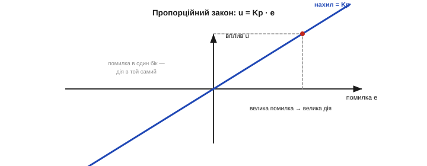
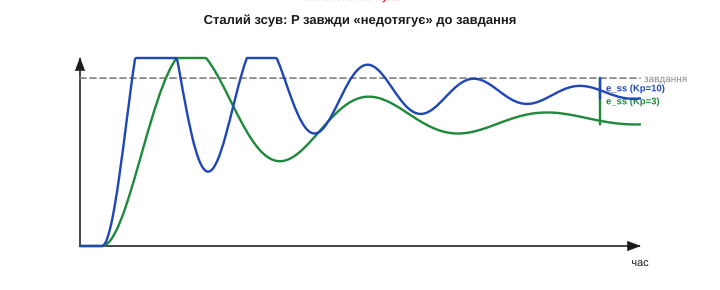

# Пропорційний регулятор (P): сила за помилкою

Регулятор має перетворювати помилку e (наскільки система відхилилася від завдання) на вплив u (що подати на виконавчий орган). Найпростіше й найприродніше правило — діяти **пропорційно** помилці: що більше схибив, то сильніше виправляй. Це **пропорційний регулятор**, літера **P** у «ПІД». Він уже сам по собі вміє тримати систему — і вже сам по собі має характерну ваду, заради якої знадобляться ще дві літери. Розберемо і силу, і слабкість P.

Варто одразу сказати: пропорційна складова — **головна** в більшості регуляторів. Саме вона робить основну роботу — швидко й сильно реагує на відхилення, — а інтегральна й диференційна лише **доточують** її, прибираючи дрібні, але дратівливі вади. Чимало реальних контурів узагалі обходяться **самим P** (або P із крихтою D). Тому зрозуміти пропорційну складову до кінця — найважливіше; решта ляже на неї як уточнення. До того ж P історично перший: саме «дій сильніше, що далі від цілі» першим спадає на думку, коли хочеш щось утримати.

### Правило: дія пропорційна помилці

Уся суть пропорційного регулятора — в одному рядку:

```
 u = Kp · e            (e = r − y — помилка)

 велика помилка  →  велика дія
 мала помилка    →  м'яка дія
 нульова помилка →  дії нема
```


*Рис. Пропорційний закон u = Kp·e. Вплив — пряма лінія через нуль із нахилом Kp: що далі вихід від завдання (більша помилка), то сильніша дія; на самій цілі (e = 0) дія зникає. Знак автоматично правильний: помилка в один бік — дія в той самий, що повертає до завдання.*

Число **Kp** — **пропорційний коефіцієнт** (підсилення). Він задає «жорсткість» регулятора: скільки впливу припадає на одиницю помилки. Більший Kp — сильніша, різкіша реакція; менший — м'якша, повільніша. Уся поведінка P-регулятора визначається цим одним числом — і вибір Kp і є його налаштуванням.

Найважливіша риса пропорційного регулятора — він **миттєвий і без пам'яті**. Його дія залежить **тільки** від помилки **зараз**: ні від того, якою вона була секунду тому, ні від того, як довго вона тривала. Свіже відхилення на 5° і відхилення на ті самі 5°, що держиться вже хвилину, P відпрацює **однаково**. Ця простота — і сила (нема чого нагромаджувати, реакція негайна), і корінь головної вади: не маючи пам'яті про **минуле**, P не здатний помітити, що «недотягує» вже довго, — і тому не виправляє сталого зсуву. Саме цю безпам'ятність компенсує [інтегральна складова](book:math/integral-control), що накопичує помилку в часі.

Зверніть увагу й на **розмірність** Kp: він переводить помилку у вплив, тож має одиниці «вплив на одиницю помилки» — наприклад, «одиниць тяги на градус крену». Знак виходить правильним автоматично й симетрично в обидва боки: відхилення вгору дає дію вниз, відхилення вниз — дію вгору. У процесному керуванні те саме Kp часто задають «навиворіт» — як **смугу пропорційності** (*proportional band*): на скільки відсотків має змінитися помилка, щоб вплив пройшов увесь свій діапазон. Велика смуга = малий Kp, вузька смуга = великий Kp; це лише інша мова про те саме число.

### Як пружина

Найкраща інтуїція для P — **пружина**. Розтягніть пружину сильно — вона тягне сильно; трохи — тягне трохи; відпустіть у спокої — не тягне зовсім. Пропорційний регулятор робить те саме з помилкою: що далі система від цілі, то дужче він її «притягує» назад, як пружина притягує вантаж до положення спокою.


*Рис. P — це «пружина» до завдання. Сила, з якою регулятор повертає вихід до цілі, пропорційна відхиленню (помилці) — точно як сила пружини пропорційна її розтягу. Kp — це «жорсткість» цієї віртуальної пружини: більший Kp — тугіша пружина, що смикає сильніше.*

Та сама картинка працює і з кермом: що далі ви з'їхали від центру смуги, то крутіше підвертаєте кермо назад. Пропорційне керування — це найприродніший спосіб, яким діє й людина, і пружина: **реакція за величиною відхилення**.

Аналогія з пружиною підказує і ваду. Пружина теж **не має пам'яті**: у своєму положенні спокою вона не тягне зовсім, хоч би скільки там стояла. Повісьте на неї вантаж — вона розтягнеться рівно настільки, щоб її сила зрівноважила вагу, і застигне в **новому** положенні, **нижчому** за вільне. Точно так само поводиться P під навантаженням: щоб дати потрібну для утримання силу, він мусить лишитися трохи «розтягнутим» — трохи відхиленим від цілі. Те, що для пружини є просядання під вантажем, для регулятора є **сталий зсув** — і це та сама фізика, а не випадковість.

Корисно протиставити P найгрубішому регулятору — **дворежимному** (*bang-bang*, «увімк-вимк»), як-от у простого термостата: холодно — нагрівач на повну, тепло — вимкнено. Він теж замкнений, але діє **стрибком**, тож величина весь час «пилкою» гуляє довкола завдання, а виконавчий орган клацає туди-сюди. Пропорційний регулятор натомість **дозує** дію плавно — що ближче до цілі, то м'якше — і тому тримає вихід рівніше, без різких перемикань і зайвого зносу. Саме тому термостат у холодильнику чутно клацає, а добре налаштований регулятор обертів двигуна тримає швидкість гладко й нечутно. Плавність — головна перевага P над грубим «увімк-вимк».

### Коефіцієнт Kp: швидше проти стійкіше

Чому не поставити Kp якомога більшим, щоб виправляти помилку миттєво? Бо тут постає той самий компроміс, що супроводжує будь-який [замкнений контур](book:math/open-vs-closed-loop): швидкість проти стійкості. **Малий Kp** — регулятор м'який: підходить до цілі повільно, ліниво. **Великий Kp** — різкий: швидко кидається до цілі, але **перестрілює**, вертається, знову перестрілює — і за завеликого Kp розгойдується.


*Рис. Як Kp змінює відгук (обчислено для об'єкта з інерцією). Малий Kp (зелений) — повільно повзе до завдання й зупиняється помітно нижче. Середній (синій) — добрий баланс. Великий (червоний) — стрімко кидається, перестрілює й довго розгойдується. Швидкість і стійкість тягнуть Kp у різні боки.*

Отже, Kp не можна ні занизити, ні завищити: десь посередині лежить добрий баланс — швидко, але без розгойдування.

Як його шукати на практиці? Найпоширеніший рецепт для P: вимкніть поки що інтегральну й диференційну складові (I = D = 0), почніть із **малого** Kp і поступово **піднімайте** його, спостерігаючи за апаратом. Спершу реакція пришвидшуватиметься; у певний момент система почне ледь помітно **коливатися** на сталій амплітуді — це «гранична» жорсткість. Трохи відступіть назад (приблизно вдвічі) — і матимете швидкий, але ще стійкий P. Цей прийом «підняти до межі коливань і відступити» — основа багатьох [методик налаштування](book:math/pid-tuning-cascade) (зокрема Зіглера–Ніколса).

> 🔧 **Навіщо це.** Налаштовуйте ПІД **по черзі**, починаючи з чистого P. Спокуса крутити всі три коефіцієнти одразу майже завжди закінчується хаосом — ви не розумієте, що на що впливає. Спершу самим Kp досягніть швидкої, ледь-ледь недорозгойданої реакції (I і D у нулі); аж потім додавайте решту — [диференційну складову](book:math/derivative-control) проти коливань та [інтегральну](book:math/integral-control) проти зсуву (їхній порядок і причини — частина загальної [методики налаштування](book:math/pid-tuning-cascade)). Один коефіцієнт за раз — і ви бачитимете дію кожного окремо, а не гадатимете. Та хоч би як влучно ви обрали Kp, лишиться ще одна, тонша вада, якої самим лиш Kp **не прибрати**.

### Вроджена вада: сталий зсув

Придивіться до кривих відгуку ще раз: **жодна** з них не сіла точно на завдання — усі застигли трохи **нижче**. Це не випадковість і не погане налаштування, а **вроджена** вада пропорційного регулятора — **сталий зсув** (*steady-state error*, або «просідання», *droop*).


*Рис. Сталий зсув пропорційного регулятора. Вихід застигає не на завданні, а трохи нижче — на відстані e_ss. Більший Kp (синій) лишає менший зсув, ніж малий (зелений), — але **жоден** скінченний Kp не зводить його до нуля. P-регулятор за самою своєю природою «недотягує».*

Звідки він береться? З простого, але невблаганного факту. Щоб **утримувати** систему в заданому стані проти сталого опору — ваги, тертя, втрат тепла, перекосу, — потрібен **ненульовий** вплив u₀. А P-регулятор дає вплив **лише з помилки**: u = Kp·e. Виходить замкнене коло: щоб мати ненульовий вплив, потрібна ненульова помилка. Тож регулятор **навмисне** тримає маленьку постійну помилку — рівно таку, щоб вона породжувала потрібний для утримання вплив.


*Рис. Чому зсув неминучий. Щоб тримати об'єкт проти сталого навантаження (вага, тертя, втрати), потрібен ненульовий вплив u₀. Але P дає вплив тільки з помилки: u = Kp·e. Отже, щоб був вплив u₀, мусить лишатися помилка e_ss = u₀/Kp. Прибрати її пропорційним регулятором **неможливо** — лише зменшити, піднявши Kp.*

Кількісно зсув дорівнює `e_ss = u₀/Kp`: чим більший Kp, тим менший зсув, — але оскільки Kp не можна піднімати безмежно (розгойдається), якийсь зсув **завжди** лишається.

**Приклад (пропорційне керування креном дрона).** Нехай Kp = 4 (одиниці тяги на градус).

```
 Виміряно крен +10°, ціль 0°  →  e = 0 − 10 = −10°
 Дія: u = Kp·e = 4·(−10) = −40   →  нахилити назад.
 Що ближче крен до нуля, то слабша дія — апарат м'яко вирівнюється.

 Сталий зсув: щоб тримати рівень проти перекосу, треба u₀ = 8.
   e_ss = u₀/Kp = 8/4 = 2°   →  дрон зависає на 2° від рівня.
   Піднімемо Kp до 16 → e_ss = 8/16 = 0.5°, але ближче до розгойдування.
```

Дрон тримається — але не рівно, а з невеликим постійним нахилом. Збільшення Kp цей нахил зменшує, та водночас підштовхує апарат до коливань. Класична пастка: зсув і стійкість тягнуть Kp у протилежні боки, і пропорційним регулятором обидві проблеми одразу не розв'язати.

Зверніть увагу, від чого залежить величина зсуву: від **навантаження** й від Kp. Що більший потрібний для утримання вплив u₀ (важчий вантаж, сильніше тертя, крутіший пагорб), то більший зсув за того самого Kp. Якщо ж навантаження мізерне — об'єкт і сам охоче лишається де треба, — зсув буде крихітним, ледь помітним. Тому той самий P-регулятор може здаватися бездоганним на стенді без навантаження й помітно «недотягувати» в реальній роботі. Для нашого дрона роль такого сталого навантаження грає, скажімо, трохи зміщений центр ваги (батарея не точно по центру): P утримає апарат, але — з невеликим постійним нахилом у бік перекосу, і що важчий перекіс, то більший нахил.

І ще одне про Kp, що рятує від плутанини: це число **не універсальне**. Його «правильне» значення залежить від усього вашого контуру — від сили моторів, маси апарата, одиниць, у яких ви міряєте помилку й видаєте вплив, навіть від частоти циклу. Kp = 4, чудовий для одного дрона, може бути надто млявим або згубно різким для іншого. Тому коефіцієнти ПІД ніколи не переносять наосліп із чужого проєкту — їх **налаштовують під конкретний апарат**, а чуже значення годиться хіба що як груба відправна точка. Запам'ятайте це як осторогу проти копіювання коефіцієнтів із форумів: те, що ідеально літало в когось, у вас може й перекинути апарат.

> 🔧 **Навіщо це.** Якщо ваш P-регульований апарат стабільно «недотягує» — тримається трохи нижче завдання, з постійним однаковим зсувом, — **не кидайтеся** лікувати це безкінечним підкручуванням Kp. Сталий зсув — не помилка налаштування, а **вроджена** риса пропорційного керування; великий Kp лише зменшить його ціною коливань. Правильні ліки — інша складова, [інтегральна](book:math/integral-control), а не більший Kp. Розпізнати «це сталий зсув P, а не поганий Kp» — половина успіху в налаштуванні.

### Чому не просто збільшити Kp

Спокуса «підняти Kp і забути про зсув» розбивається не лише об розгойдування. Великий Kp ще й **підсилює шум**: регулятор діє на помилку, а помилка несе тремтіння давача, тож що більший Kp, то сильніше це тремтіння перетікає в смикання моторів. До того ж виконавчий орган **не безмежний**: за великої помилки u = Kp·e може вискочити за межі того, що мотор узагалі здатен дати (**насичення**), — і далі рости Kp вже немає куди. Тож Kp обмежений з усіх боків: стійкістю, шумом і насиченням.

На насиченні варто спинитися окремо, бо воно підступне. Коли вплив упирається в стелю (мотор уже на повних обертах, кермо вивернуте до упору), регулятор **більше нічого не може зробити**, хоч би яку велику помилку показував давач, — і на цей час контур фактично **розмикається**: апарат летить «як вийде», поки помилка не спаде. Тому проєктувати Kp, мовби виконавчий орган здатен на будь-яку дію, — небезпечно: у реальності він має межу, і добрий регулятор поводиться розумно, навіть коли в неї впирається. (Своя, навіть гірша, біда від насичення спіткає й [інтегральну складову](book:math/integral-control) — це сумнозвісний *windup*.)

> 🔧 **Навіщо це.** Перевіряйте регулятор не лише на дрібних відхиленнях, а й на **великих**. Саме там вплив u = Kp·e вискакує в **насичення** виконавчого органу — і поведінка стає геть іншою, ніж підказує лінійна формула. Якщо апарат добре тримається біля цілі, але дивно поводиться після сильного поштовху чи різкої зміни завдання, перша підозра — насичення моторів. Знати межу свого виконавчого органу так само важливо, як і вибрати Kp.

### Автоматичний «скидач»

Сталий зсув — давня проблема. Ще відцентровий регулятор Джеймса Уатта тримав оберти парової машини трохи нижче бажаних — і це було те саме «просідання». У ранніх промислових регуляторах оператор прибирав зсув **вручну**: підкручував окремий гвинт-«скидач» (*reset*), додаючи постійну поправку, аж поки вихід не сідав точно на завдання.


*Рис. Пропорційний регулятор швидко й стійко підводить вихід до завдання, але лишає **сталий зсув**. Прибрати його «руками» щоразу — марудно; тож цей «скидач» **автоматизували** — і так народилася інтегральна складова, що сама накопичує поправку, доки зсув не зникне.*

А потім інженери зробили очевидне: **автоматизували** цей скидач. Хай регулятор сам потроху додає поправку, доки лишається помилка, — і сам її прибере, коли вихід дотягнеться до завдання. Так народилася [інтегральна складова](book:math/integral-control). Пропорційна частина дає швидку, пружну реакцію на помилку **тут і тепер**; інтеграл додає до неї пам'ять про **накопичену** помилку — і сталий зсув зникає сам.

Підсумуймо. Пропорційний регулятор — кістяк усього ПІД: проста, миттєва, «пружна» реакція на поточну помилку, керована одним числом Kp. Він дає основну силу, що тримає систему біля цілі, і його самого часто майже досить. Та через свою **безпам'ятність** він лишає **сталий зсув**, а нарощувати Kp без міри не дають коливання, шум і насичення. Бракує двох речей: пам'яті про **минулу** помилку (щоб прибрати зсув) і чуття до **майбутньої** (щоб погасити коливання). Перше дає [інтегральна складова](book:math/integral-control), друге — [диференційна](book:math/derivative-control). Адже сталий зсув — не дрібниця: для дрона це постійний нахил, для нагрівача — вічно недогріта кімната, для круїз-контролю — хронічний недобір швидкості на підйомі. Прибрати цей зсув і покликана інтегральна складова.

---
