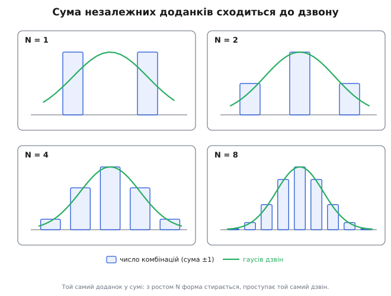

# Центральна гранична теорема

Покладіть під давач увесь набір дрібних безладів, що в реальності псують вимір: теплове дрижання електронів у резисторі, наводку від сусідньої доріжки, квантування в АЦП на один молодший розряд, мікроскопічну вібрацію контакту. Жоден із цих впливів сам по собі не великий і не схожий на інші — у кожного свій характер, свій розподіл. А підсумкова похибка відліку — це їхня **сума**. І ось дивина: якщо набрати тисячі таких відліків і побудувати гістограму похибок, вийде не якась рвана крива з відбитком кожного джерела, а гладкий симетричний **дзвін** — той самий, що в розкиді зросту людей, у розсіянні куль навколо мішені, у похибках астрономічних спостережень XVIII століття. Природа джерел стерлася; лишилася та сама форма.

Це не збіг і не магія. Це найсильніше твердження теорії ймовірностей — **центральна гранична теорема**: коли багато незалежних випадкових доданків, кожен дрібний на тлі суми, складаються разом, розподіл їхньої суми сходиться до **нормального** (гаусового) незалежно від того, як розподілений кожен окремий доданок. Дзвін — не властивість якогось одного процесу, а **доля суми** взагалі. Саме тому він усюди: будь-яка реальна величина, що є накопиченням багатьох дрібних незалежних впливів, приречена на нього. Розберімо, **чому** так має бути — не як формулу для запам'ятовування, а від першопричини: чому сума стирає особливості доданків, за яких умов це працює, а за яких ламається, і чому з тієї самої причини усереднення придушує шум саме як √N.

## Що каже теорема, перш ніж питати чому

Спершу домовмося про предмет. Маємо N незалежних випадкових величин X₁, X₂, …, X_N, однаково розподілених, кожна зі скінченним центром μ і скінченним розкидом σ² — тобто [сподіванням і дисперсією](book:math/mean-variance). Самі вони можуть бути якими завгодно: кидок кубика (шість рівних стовпчиків), підкидання монети (два значення), показ давача з несиметричним шумом — форма кожного значення не важить. Складімо їх:

```
S_N = X₁ + X₂ + … + X_N
```

Питання теореми: як розподілена сума S_N, коли N росте? У неї свій центр і свій розкид. Центр суми — це сума центрів (сподівання завжди додаються), а для незалежних доданків додаються й дисперсії:

```
сподівання:   E[S_N] = N·μ
дисперсія:    Var(S_N) = N·σ²        (для НЕЗАЛЕЖНИХ доданків)
```

Те, що дисперсії незалежних величин додаються, — пряме продовження думки, чому розкид міряють саме квадратом: дисперсія поводиться як **потужність**, а потужності незалежних джерел складаються. Цю властивість варто тримати під рукою, бо з неї виросте все подальше.

> 🔧 **Навіщо це.** Перше, що дає теорема інженерові, — право описувати складну похибку **двома числами**. Якщо підсумковий шум гаусів (а він майже завжди гаусів, бо є сумою багатьох джерел), то весь його розподіл задається лише середнім і σ. Не треба знати природу кожного джерела наводки — досить заміряти σ підсумку, і ви вже знаєте, що 68 % відліків лежать у межах ±σ, а за ±3σ виходить менш ніж 0.3 %. Уся бюджетизація похибок стоїть на цьому.

Тепер головне твердження. Якщо **відцентрувати** суму (відняти її центр N·μ) і **відмасштабувати** (поділити на її стандартне відхилення σ√N — звідки саме √N, побачимо нижче), то отримана величина при великих N розподілена дедалі ближче до **стандартного нормального** розподілу — дзвону з центром 0 і одиничною шириною:

```
        S_N − N·μ
Z_N =  ───────────   ──→  𝒩(0, 1)     при N → ∞
          σ·√N
```

Праворуч — той самий гаусів дзвін, заданий формулою щільності, що не залежить ні від чого, крім z:

```
            1
φ(z) =  ───────── · e^(−z²/2)
          √(2π)
```

Уся сила — у словах «**незалежно від розподілу X**». Кубик, монета, несиметричний шум — усе одно ведуть до тієї самої кривої. Доданки можуть бути дискретними, а сума виходить гладкою; доданки можуть бути перекошеними, а сума — симетричною. Теорема не каже, що X_i стають нормальними — вони які були, такі й лишились. Вона каже, що **сума забуває** їхню форму. Лишається питання, через який механізм забуває.

## Чому сума стирає форму доданка

Спробуймо побачити стирання на найгрубішому прикладі, де від нормальності, здавалося б, нічого немає, — на чесній монеті. Хай кожна X_i дає +1 (орел) або −1 (решка) з імовірністю ½. Розподіл одного кидка — два однакові стовпчики, нічого спільного з дзвоном. Складаймо.

Сума двох кидків S₂ може дати −2, 0, +2. Але 0 виходить **двома** способами (орел-решка і решка-орел), а кожен край — лише одним. Уже не рівні стовпчики: середина вдвічі вища за краї. Чому? Бо крайній результат вимагає, щоб **усі** доданки змовилися в один бік, а середній досягається багатьма різними комбінаціями плюсів і мінусів. Крайнощів мало, бо мало способів їх отримати; середини багато, бо способів багато.

Додаймо третій, четвертий кидок — і ця нерівність наростає лавиною. Кількість способів отримати суму — це біноміальні коефіцієнти (скільки наборів дають саме стільки плюсів): для N кидків число способів дати k плюсів дорівнює числу сполучень із N по k. Ось висоти стовпчиків для кількох N (нормовані на одиницю в піку):

```
N=1:   ▁              █              ▁
N=2:   ▂       ▅       █       ▅       ▂
N=4:   ▁   ▃   ▆   █   ▆   ▃   ▁
N=8:  ▁ ▂ ▄ ▆ █ ▆ ▄ ▂ ▁
```

З кожним доданком крива вирівнюється в купол. Два рівні стовпчики монети, складаючись, дають дзвін — не тому, що монету «полагодили», а тому, що **способів потрапити в середину незрівнянно більше, ніж на край**. Це геометричне ядро всієї теореми: сума багатьох доданків концентрується там, де комбінацій найбільше, а їх найбільше посередині, бо там плюси й мінуси доданків взаємно гасяться найрізноманітнішими шляхами.


*Той самий доданок (±1 з рівною ймовірністю) у сумі. При N=1 — два рівні стовпчики, від дзвону нічого. Та вже сума кількох доданків вища посередині: середину дає багато комбінацій плюсів і мінусів, край — лише одна. З ростом N форма доданка стирається, проступає той самий гаусів профіль.*

Чому саме **гаусів**, а не якийсь інший купол? Тут потрібна тонша опора, ніж комбінаторика, і її варто хоча б окреслити чесно, не ховаючись за «так виходить».

## Чому дзвін, а не інша гладка крива

Купол міг би бути будь-яким — трикутником, дугою, аркою. Та виходить рівно гаусів, і причина в особливій ролі суми незалежних величин. Найчистіше її видно через два аргументи, що сходяться до одного.

**Перший — самовідтворення дзвону.** Спитаймо: чи є форма, яка при складанні сама себе не міняє — лише ширшає? Тобто сума двох незалежних величин такої форми знову має ту саму форму. Якщо така стійка форма одна, то будь-яка сума, складаючись усе далі, мусить зсуватися саме до неї — як до нерухомої точки. Виявляється, серед розподілів зі скінченною дисперсією така форма єдина — це **гаусів дзвін**: сума двох незалежних гаусових величин знову гаусова, лише з більшою дисперсією. Дзвін — нерухома точка операції додавання. Будь-який інший купол при подальшому складанні ще трохи зміниться; дзвін уже не змінюється. Тому всі шляхи додавання ведуть саме до нього: він єдиний, на якому процес зупиняється.

**Другий — складання згладжує.** Сума двох незалежних величин — це операція, що математично є **згорткою** їхніх розподілів: щоб дістати ймовірність суми, треба перебрати всі пари доданків, які дають це значення, і скласти добутки їхніх ймовірностей. А згортка завжди **згладжує**: гострі кути, стрибки, асиметрія розмиваються, бо кожне підсумкове значення усереднює сусідні. Складіть прямокутник сам із собою — дістанете трикутник (гостріший пік, спадні боки); ще раз — дугу, ще гладкішу; і так крок за кроком кути зрізаються, поки не лишиться єдина крива без жодного зламу. Кожне нове додавання усереднює попередню форму саму із собою, а нескінченне усереднення гострого дає гладке.

Обидва аргументи можна звести в одну строгу нитку через **характеристичні функції** (перетворення, що згортку перетворює на звичайний добуток, — тоді складання N доданків стає піднесенням до N-го степеня, і границя рахується прямо), але суть від цього не зміниться: дзвін — і єдина стійка до складання форма, і єдина, до якої згладжування все стягує. Дві різні мови про той самий факт. Через те будь-яка достатньо довга сума незалежних дрібних впливів осідає на гаусів профіль — не на трикутник і не на дугу, а саме на нього.

> 🔧 **Навіщо це.** Звідси випливає річ, на якій тримається вся робота з шумом: **сума гаусових — знову гаусова**. Якщо ви складаєте кілька джерел шуму, кожне з яких уже гаусове (а підсилювальний тракт робить їх такими), то й сумарний шум гаусів, і його σ рахується з σ доданків простим додаванням дисперсій — σ_total = √(σ₁² + σ₂² + …). Не треба моделювати спільний розподіл — досить кореня з суми квадратів.

## Умови: коли теорема працює, а коли ні

Теорема могутня, але не безумовна, і кожна умова — не формальність, а пряме «інакше зламається». Розберімо їх по черзі, бо саме на них найчастіше спотикаються на практиці.

**Незалежність.** Доданки мають бути незалежні — знання одного нічого не каже про інші. Це серце доказу: лише для незалежних дисперсії додаються (Var(S) = N·σ²), і лише так працює згортка. Якщо доданки **зчеплені** — рухаються разом, — то однобічна змова перестає бути рідкісною, бо один спільний поштовх тягне всі доданки в той самий бік одночасно. Тоді край розподілу важчає, концентрація в середині слабшає, і гаусова границя пливе. Спільна наводка, що б'є по всіх каналах разом, корельований дрейф від спільного джерела живлення — класичні випадки, де «складемо багато — вийде дзвін» оманливе: складаємо не незалежне, а одне й те саме в кількох масках.

**Скінченна дисперсія.** Кожен доданок мусить мати скінченний розкид σ². Це здається само собою зрозумілим, та буває не так. Є розподіли з такими важкими хвостами, що дуже великі викиди трапляються надто часто, і дисперсія розходиться в нескінченність (канонічний приклад — розподіл Коші). Тоді одного-єдиного гігантського доданка вистачає, щоб самотужки задати всю суму, — він не тоне серед інших, а домінує. Усереднення такого не вгамовує: середнє тисячі значень Коші розкидане так само широко, як одне. Без скінченної дисперсії немає масштабу σ√N, до якого стягувати, — і теорема мовчить. Практичний бік: розподіли з рідкісними, але катастрофічно великими подіями (деякі фінансові втрати, лавинні відмови) не підкоряються звичайному дзвону, і рахувати їхній ризик за гаусом небезпечно.

**Жоден доданок не панує.** Споріднена, але окрема вимога: внесок кожного доданка має бути дрібним на тлі суми. Якщо один доданок у багато разів більший за решту разом узятих, сума несе **його** форму, а не гаусову — інші просто не встигають її розмити. Дзвін постає лише з **демократії дрібних впливів**, де жоден не вирішальний. Тому одне грубе джерело шуму (наприклад, потужна періодична наводка) ламає гаусів профіль навіть серед безлічі дрібних: спершу його треба прибрати, і аж тоді решта дасть дзвін.

А **однакова розподіленість** доданків, усупереч першому враженню, не обов'язкова. У строгіших версіях теореми доданки можуть бути з **різних** розподілів — аби лиш були незалежні, з обмеженими дисперсіями, і жоден не домінував над сумою. Саме тому теорема така всюдисуща в техніці: реальні джерела шуму **різні** за природою (тепловий, дробовий, квантування), а сума однаково сходиться до дзвону. Природа доданків може бути строкатою — важить лише, щоб їх було багато, вони не змовлялися й жоден не переважав.

## Чому дзвін усюди

Тепер видно, чому нормальний розподіл трапляється так нав'язливо часто, що його й назвали «нормальним». Будь-яка величина, що в реальності є **накопиченням багатьох дрібних незалежних впливів**, потрапляє під теорему — а таких величин довкола безліч.

Зріст людини — сума сотень дрібних генетичних і середовищних чинників, кожен додає дещицю; разом дають дзвін. Похибка вимірювального приладу — сума багатьох незалежних джерел (тепло, тертя, квантування, наводки); разом дзвін, тому-то теорію похибок ще у XVIII–XIX столітті побудували на гаусовому законі. Розсіяння куль навколо точки прицілювання — сума дрібних незалежних відхилень (вітер, неоднорідність заряду, дрож руки); звідси дзвоноподібний «закон розсіювання» в балістиці. Тепловий шум у резисторі — сума мільярдів незалежних поштовхів від хаотичного руху електронів; на виході гаусів шум.

Спільне в усіх випадках одне: **багато доданків, незалежних, дрібних, жоден не панує** — рівно умови теореми. Дзвін з'являється не тому, що так влаштовані зріст, чи похибки, чи електрони окремо, а тому, що всі вони — **суми**, а суму чекає та сама доля. Це й робить теорему такою цінною: вона дозволяє очікувати гаусів розподіл наперед, навіть нічого не знаючи про механіку кожного доданка, — за самим лише фактом, що величина є накопиченням багатьох незалежних дрібниць.

Та сама логіка одразу й застерігає, **де** дзвону не буде: коли доданків мало, коли вони зчеплені, коли один панує над рештою або коли в гри важкі хвости. Тоді на гаус розраховувати не можна — і теорема, чесно окреслюючи свої межі, рятує від не менш частої помилки, ніж незнання її самої.

## Звідки √N: усереднення й закон кореня

Лишився борг — пояснити масштаб σ√N, що стояв у знаменнику, і показати, як із нього прямо випливає головна практична користь дзвону: чому усереднення придушує шум саме як корінь із кількості відліків.

Повернімося до дисперсії суми. Для N незалежних доданків з однаковою дисперсією σ²:

```
Var(S_N) = N·σ²        →        σ(S_N) = σ·√N
```

Розкид суми росте не як N, а як **√N** — повільніше за саму суму. Причина суто в тому, що дисперсії додаються, а стандартне відхилення є коренем із дисперсії: складемо вчетверо більше доданків — дисперсія вчетверо більша, а розкид лише вдвічі. Доданки частково гасять одне одного: коли один випадково завеликий, інший так само випадково замалий, і в сумі їхні відхилення взаємно скорочуються тим повніше, чим їх більше. Тому сума росте швидше за свій розкид — звідси й корінь.

Тепер не сумуймо, а **усереднюймо** — поділімо суму на N. Центр середнього лишається μ (усереднення не зміщує центр), а от його розкид падає:

```
              S_N        σ²                       σ
X̄ = mean =  ─────   →   Var(X̄) = ───   →   σ(X̄) = ───
               N                   N                √N
```

Ось він, **закон кореня**: стандартне відхилення середнього з N незалежних відліків у √N разів менше за розкид одного відліку. Усереднили чотири відліки — шум удвічі тихіший; сто — у десять разів; десять тисяч — у сто. Віддача спадна (щоб зменшити шум іще вдесятеро, відліків треба в сто разів більше), але працює завжди, поки відліки незалежні. Це найпряміший спосіб витиснути точність із шумного давача без жодного нового заліза — просто набрати більше відліків і усереднити; як саме цей виграш рахують і де він упирається в межу, докладніше — у темі про [виграш усереднення](book:math/averaging-gain).

І тут теорема замикає коло. Вона каже не лише, що середнє стає точнішим (це дав би сам закон кореня), а й **якої форми** його розкид: середнє багатьох незалежних відліків розподілене **гаусово** навколо правдивої величини, з шириною σ/√N. Тому, усереднивши N відліків, можна впевнено сказати: правдиве значення лежить у межах ±σ/√N від нашого середнього приблизно з імовірністю 68 %, у межах ±2σ/√N — із 95 %. Дзвін дає не просто меншу похибку — він дає **точні межі довіри** до неї.

> 🔧 **Навіщо це.** Це робоча формула планування точності. Давач має шум σ = 0.5 °C, а вам треба впевнено розрізняти зміни в 0.05 °C. Один відлік цього не дасть. Скільки усереднити? Потрібно σ/√N ≤ 0.05, тобто √N ≥ 10, N ≥ 100. Сто відліків — і шум середнього падає до 0.05 °C, задача розв'язана без зміни заліза. А гаусова форма ще й каже, що за ±0.15 °C (3σ середнього) вихід практично виключений. Уся ця певність — пряме дитя центральної граничної теореми.

## Що тримати в руках

Центральна гранична теорема каже коротко: **сума багатьох незалежних дрібних доданків розподілена гаусово, хоч би якими були доданки окремо**. Дзвін постає не з властивостей конкретного процесу, а з самої природи додавання незалежного — бо способів потрапити в середину незрівнянно більше, ніж на край (комбінаторне ядро), а складання незалежних величин стягує будь-яку форму саме до гаусової як до єдиної стійкої (аналітичне ядро). Тому нормальний розподіл і трапляється всюди, де реальна величина є накопиченням багатьох незалежних дрібниць.

Працює це за чотирьох умов, кожна з яких — справжня: доданки незалежні, кожен зі скінченною дисперсією, жоден не панує над сумою, і їх багато; однаковість розподілів при цьому не обов'язкова. Порушиш умову — і дзвін пливе: зчеплені доданки, важкі хвости чи один панівний внесок виводять із-під теореми, і покладатися на гаус уже не можна.

Практичний підсумок з усього один, але вагомий: розкид суми росте як √N, а розкид **середнього** спадає як 1/√N — і спадає по дзвону, з точними межами довіри ±σ/√N. Звідси й уся сила усереднення проти шуму, і право описувати складну похибку лише [середнім та дисперсією](book:math/mean-variance), і впевненість, з якою інженер називає допуск приладу. Зрозумівши тут **чому** — чому сума забуває форму доданків і чому її розкид росте саме коренем, — ви тримаєте не формулу, а ту першопричину, з якої гаусів дзвін заповнив і техніку, і природу.
