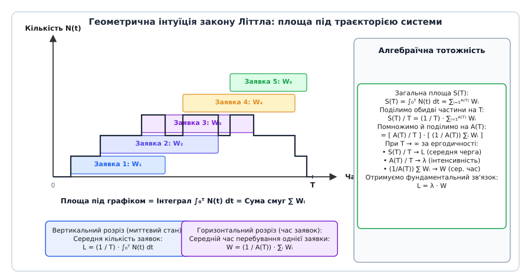
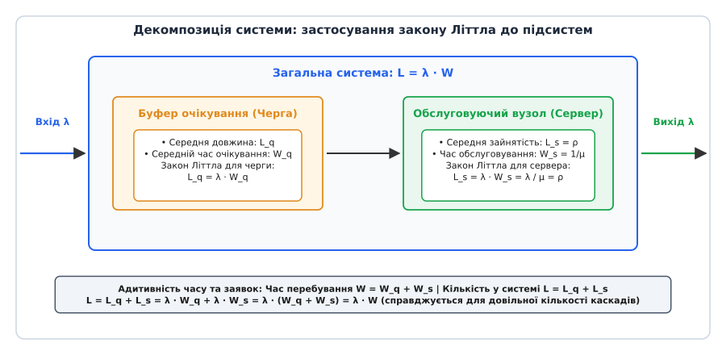
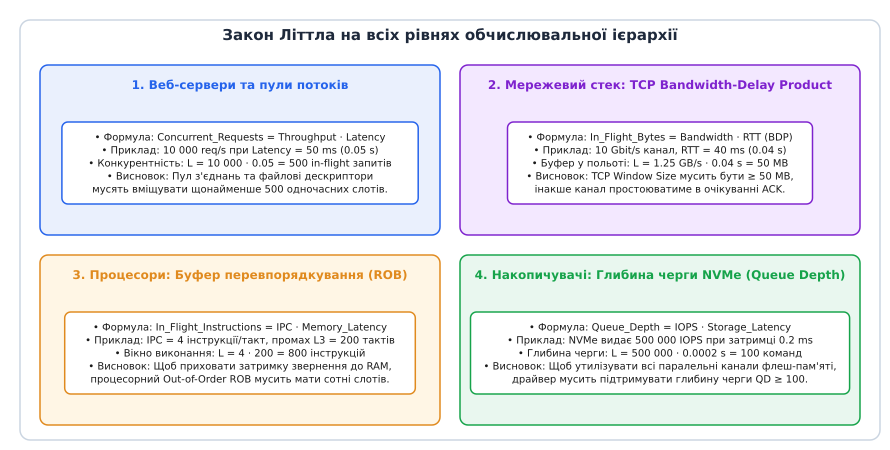
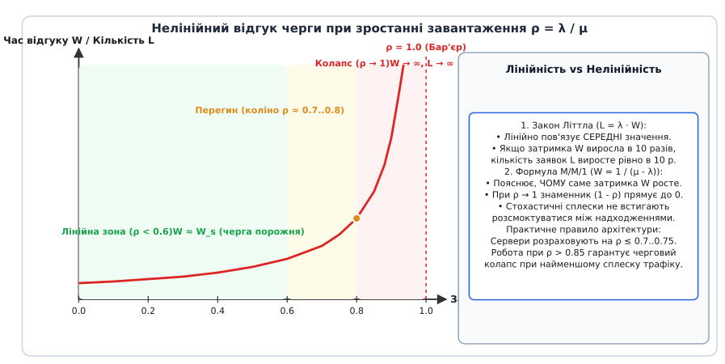

# Закон Літтла та аналіз черг у комп'ютерних системах

<preknowlist>
- [Математичне сподівання та дисперсія](book:math/mean-variance) — центр розподілу випадкової величини та міра її розсіювання.
- [Пуассонівський процес](book:math/poisson-process) — модель потоку випадкових подій із постійною середньою інтенсивністю.
- [Ланцюги Маркова](book:math/markov-chain) — переходи між станами стохастичної системи без пам'яті про минуле.
</preknowlist>

Уявіть шлюз прикладного інтерфейсу (API Gateway) сучасного хмарного сервісу, який отримує стабільний потік із 10 000 вхідних запитів за секунду. Кожен запит у середньому потребує 50 мілісекунд (0.05 с) для звернення до бази даних, авторизації та формування JSON-відповіді. Скільки з'єднань, дескрипторів сокетів та активних контекстів виконання перебувають у пам'яті сервера одночасно в будь-який випадковий момент часу? 

Якщо системний інженер виділить пул лише на 100 потоків обробки, вважаючи, що «запити виконуються майже миттєво», сервер миттєво зазнає колапсу: вхідні запити вишикуються у гігантську чергу, час очікування підскочить із мілісекунд до десятків секунд, клієнти почнуть розривати з'єднання за таймаутом, а черга повторних спроб остаточно поховає сервіс під лавиною перевантаження.

Фізична кількість запитів, що одночасно перебувають «у польоті» (англ. *in-flight requests*), визначається суворим математичним законом: якщо за одну секунду надходить 10 000 запитів, і кожен живе всередині системи 0.05 секунди, то в системі постійно перебуває рівно `10 000 × 0.05 = 500` запитів. Пул на 100 потоків не здатен вмістити цей обсяг у принципі. 

Цей найпростіший на вигляд, але найпотужніший в інженерній практиці зв'язок називається **законом Літтла** (англ. *Little's Law*):

```
L = λ · W
```

де `L` — середня кількість заявок у системі, `λ` — середня швидкість надходження (пропускна здатність), а `W` — середній час перебування однієї заявки всередині системи.

## Анатомія закону: що саме вимірюють L, λ та W

Закон Літтла розглядає довільну систему як «чорну скриньку» (лат. *machina clausa*), що має чітко окреслену межу. Всередину системи потрапляють об'єкти (запити, пакети, інструкції, клієнти), проводять там певний час, виконуючи роботу або очікуючи в черзі, після чого залишають систему.

```
                  ┌───────────────────────────────┐
  Вхідний потік   │       ДОВІЛЬНА СИСТЕМА        │   Вихідний потік
 ────────────────>│   Кількість усередині: L      ├─────────────────>
  Інтенсивність λ │   Час перебування: W          │   Інтенсивність λ
                  └───────────────────────────────┘
```

Розберімо кожну з трьох фундаментальних величин:

1. **Середня заповненість системи `L` (англ. *Lead / Occupancy / Queue Length*):**
   Це математичне сподівання кількості заявок, що одночасно перебувають усередині системи в будь-який фіксований момент часу. Одиниця вимірювання — кількість об'єктів (запити, пакети, транзакції). У стаціонарному режимі це середнє за часом значення (англ. *time-average*).

2. **Пропускна здатність / Інтенсивність надходження `λ` (грец. *lambda*, англ. *Arrival Rate / Throughput*):**
   Це середня кількість заявок, що перетинають межу системи за одиницю часу. Одиниця вимірювання — об'єкти за секунду (`req/s`, `IOPS`, `пакети/с`). Якщо система стабільна (не накопичує нескінченну чергу), середня швидкість входу строго дорівнює середній швидкості виходу.

3. **Середній час перебування `W` (англ. *Wait / Residence Time / Latency*):**
   Це математичне сподівання повного інтервалу часу від моменту, коли заявка перетнула вхідну межу системи, до моменту, коли вона повністю перетнула вихідну межу. Одиниця вимірювання — секунди. `W` включає як безпосереднє виконання корисної роботи, так і пасивне очікування в буферах.

Перевірка розмірностей підтверджує фізичну узгодженість формули:

```
[об'єкти] = [об'єкти / секунда] · [секунди]
```

> 🔧 **Навіщо це.** Закон Літтла — це фундаментальний міст між трьома головними метриками будь-якої системи: місткістю, продуктивністю та затримкою. Знаючи будь-які дві величини, інженер однозначно знаходить третю без детального аналізу внутрішньої будови вузла:
> - Якщо відома пропускна здатність `λ` і допустимий час відгуку `W`, обчислюється необхідний розмір пулів пам'яті та потоків `L = λ · W`.
> - Якщо моніторинг показує розмір черги `L` і надходження `λ`, вираховується реальна середня затримка клієнтів `W = L / λ`.
> - Якщо пам'ять обмежує кількість паралельних з'єднань величиною `L`, а бекенд дає затримку `W`, знаходиться гранична пропускна здатність системи `λ = L / W`.

## Геометрична інтуїція: чому закон Літтла істинний завжди

Чому закон Літтла залишається абсолютно точним незалежно від того, як саме поводяться окремі заявки? Щоб побачити причину, звернемося до геометрії вибіркових траєкторій.


*Геометричне виведення закону Літтла: інтегрування миттєвої заповненості системи N(t) за часом еквівалентне сумуванню індивідуальних тривалостей перебування заявок W_i.*

Розгляньмо інтервал спостереження тривалістю `T`. Нехай за цей час у систему надійшло `A(T)` заявок. Позначимо через `N(t)` кількість заявок, що одночасно перебувають у системі в момент часу `t`.

Обчислимо повну площу `S(T)` під графіком функції `N(t)` двома різними способами:

### Спосіб 1. Вертикальне інтегрування за часом
Площа під сходинковим графіком `N(t)` за означенням інтеграла дорівнює:

```
S(T) = ∫₀ᵀ N(t) dt
```

Якщо ми поділимо цю площу на повний час спостереження `T`, то отримаємо середню за часом кількість заявок у системі:

```
L = (1 / T) · ∫₀ᵀ N(t) dt
```

### Спосіб 2. Горизонтальне сумування смуг заявок
Кожна заявка `i` проводить у системі певний час `W_i = t_out(i) − t_in(i)`. На графіку це відповідає горизонтальній смужці одиничної висоти та довжини `W_i`. 

Сумарна площа всіх таких смужок для `A(T)` заявок дорівнює:

```
S(T) ≈ ∑_{i=1}^{A(T)} W_i
```

Крайові ефекти (заявки, які зайшли до моменту 0 або не встигли вийти до моменту `T`) при великих значеннях `T` стають нескінченно малими порівняно із загальною сумою.

### Алгебраїчне зведення
Прирівняємо обидва вирази для площі `S(T)`:

```
∫₀ᵀ N(t) dt  ≈  ∑_{i=1}^{A(T)} W_i
```

Поділимо обидві частини рівності на загальний час `T`:

```
(1 / T) · ∫₀ᵀ N(t) dt  ≈  (1 / T) · ∑_{i=1}^{A(T)} W_i
```

Тепер помножимо і поділимо праву частину на загальну кількість заявок `A(T)`:

```
(1 / T) · ∫₀ᵀ N(t) dt  ≈  [ A(T) / T ] · [ (1 / A(T)) · ∑_{i=1}^{A(T)} W_i ]
```

Проаналізуємо кожен множник при спрямуванні часу спостереження до нескінченності (`T → ∞`):
1. Ліва частина `(1 / T) · ∫₀ᵀ N(t) dt` прямує до середньої заповненості `L`.
2. Перший дріб праворуч `A(T) / T` прямує до середньої швидкості надходження `λ`.
3. Другий дріб праворуч `(1 / A(T)) · ∑ W_i` є середнім арифметичним часів перебування всіх заявок і прямує до `W`.

Отримуємо строгу тотожність:

```
L = λ · W
```

Для ознайомлення з повним формальним доведенням через лебегівські міри та теорему про затиснуту границю відкрийте [строге доведення за вибірковими траєкторіями](book:math/littles-law/math-sample-path-proof.md). А про те, як ця формула пройшла шлях від емпіричних спостережень телефонних інженерів до строгої статті 1961 року, читайте у вставці про [детальну історію відкриття закону Літтла](book:math/littles-law/hist-littles-law.md).

## Універсальність та межі застосовності

Унікальність закону Літтла полягає в його повній інваріантності до внутрішньої структури системи. Більшість теорем теорії ймовірностей вимагають суворих припущень (незалежність, нормальність, показниковий розподіл). Закон Літтла **не вимагає майже нічого**.

### Чого закон Літтла НЕ вимагає:

1. **Не вимагає пуассонівського потоку:**
   Заявки можуть приходити рівномірно (детерміновано), періодичними пачками (англ. *bursty traffic*), утворювати автокорельовані послідовності чи фрактальні процеси.
2. **Не вимагає показникового розподілу тривалості обслуговування:**
   Час обробки може бути сталим (наприклад, конвеєрний такт процесора), бімодальним (швидкі попадання в кеш проти повільних промахів) або мати важкі хвости (розподіл Парето для передачі файлів у вебі).
3. **Не вимагає дисципліни FIFO:**
   Черга може оброблятися у зворотному порядку LIFO (як стек викликів), за пріоритетами, методом випадкового вибору (Random), за алгоритмом найкоротшої задачі (SJF) чи з розділенням процесора (Processor Sharing / Round Robin). Порядок вилучення заявок із черги взагалі не впливає на загальну площу `S(T)`.
4. **Не вимагає одного сервера:**
   Усередині системи може бути один процесор, пул із сотень паралельних потоків, складна мережа мікросервісів із конвеєрами та зворотними петлями.

### Єдині фундаментальні умови виконання:

1. **Збереження потоку та стабільність (англ. *Conservation of Flow / Stability*):**
   Система не повинна генерувати заявки «з повітря» або безслідно їх знищувати без обліку. Середня швидкість виходу повинна дорівнювати середній швидкості входу (`λ_in = λ_out`). Якщо система перевантажена (`λ > μ`) і черга безперервно накопичується до нескінченності, стаціонарне середнє `L` просто не існує.
2. **Існування стаціонарних середніх (англ. *Stationarity / Ergodicity*):**
   Вибірковий процес повинен мати скінченні граничні середні значення `L`, `λ` та `W` при `T → ∞`.

## Декомпозиція системи: черга проти сервера

Система довільної складності може бути розбита на довільну кількість вкладених підсистем. Оскільки закон Літтла є універсальним, він виконується **для кожної підсистеми окремо** та для їхньої суперпозиції.

Найважливіша декомпозиція в інженерії — розділення системи на **буфер очікування (чергу)** та **обслуговуючий прилад (сервер)**.


*Декомпозиція системи: повний час перебування складається з очікування в черзі та безпосередньої обробки сервером.*

Нехай загальний час перебування заявки `W` розпадається на два неперетинні етапи:
- `W_q` — середній час очікування в черзі до початку виконання (англ. *Queueing Delay*);
- `W_s` — середній час безпосереднього обслуговування на сервері (англ. *Service Time*), де `W_s = 1 / μ`, а `μ` — продуктивність сервера.

Тоді повний середній час перебування за властивістю лінійності сподівання дорівнює:

```
W = W_q + W_s
```

Застосуймо закон Літтла до кожної частини окремо:

1. **Закон Літтла для черги очікування:**
```
L_q = λ · W_q
```
де `L_q` — середня кількість заявок, що чекають у черзі (англ. *Queue Length*).

2. **Закон Літтла для обслуговуючого сервера:**
```
L_s = λ · W_s
```
де `L_s` — середня кількість заявок, що одночасно обробляються сервером.

Якщо сервер один, величина `L_s` має фундаментальний фізичний зміст: це ймовірність того, що сервер зайнятий обробкою, тобто його **коефіцієнт завантаження** `ρ` (грец. *rho*, англ. *Utilization*):

```
L_s = λ · W_s = λ · (1 / μ) = λ / μ = ρ
```

3. **Підсумовування компонентів:**
Складемо кількість заявок у черзі та на сервері:

```
L = L_q + L_s
= λ · W_q + λ · W_s       [підставили закон Літтла для підсистем]
= λ · (W_q + W_s)         [винесли спільний множник λ за дужки]
= λ · W                   [оскільки W = W_q + W_s]
```

Ця адитивність дозволяє аналізувати багатокаскадні конвеєри обробки: загальна кількість об'єктів у розподіленій системі дорівнює сумі об'єктів на кожному мікросервісі:

```
L_total = ∑_{k=1}^{M} L_k = ∑_{k=1}^{M} (λ_k · W_k)
```

## Закон Літтла в мережах черг: відкриті та закриті мережі Джексона

У реальних розподілених системах (мікросервісні архітектури, багатоядерні кристали, кластери баз даних) заявки не проходять поодинокий сервер, а циркулюють складною мережею вузлів. Розподілена система моделюється як **мережа масового обслуговування Джексона** (англ. *Jackson Network*), що складається з `M` обслуговуючих вузлів.

Коли заявка завершує обробку у вузлі `i`, вона з імовірністю `p_{ij}` переходить до вузла `j`, або з імовірністю `p_{i0} = 1 − ∑_{j=1}^M p_{ij}` остаточно залишає мережу.

Зовнішній потік нових заявок надходить у вузол `i` з інтенсивністю `γ_i`. Сумарна швидкість надходження у вузол `i` (з урахуванням внутрішніх переходів і повторних циклів) задовольняє систему лінійних рівнянь балансу трафіку:

```
λ_i = γ_i + ∑_{j=1}^M (λ_j · p_{ji})      для кожного i = 1, 2, ..., M
```

Застосовуючи закон Літтла до кожного окремого вузла `i`, знаходимо середню кількість заявок у цьому вузлі:

```
L_i = λ_i · W_i
```

де `W_i` — середній час перебування заявки у вузлі `i` за одне відвідування.

Якщо сумарна інтенсивність надходження зовнішніх заявок у всю мережу становить `γ_total = ∑_{i=1}^M γ_i`, то середня кількість усіх заявок у розподіленій системі дорівнює:

```
L_total = ∑_{i=1}^M L_i = ∑_{i=1}^M (λ_i · W_i)
```

Згідно з глобальним законом Літтла, повний середній час `W_total`, який заявка проводить у розподіленій системі від моменту першого входу до остаточного виходу (включаючи всі повторні звернення та цикли), однозначно дорівнює:

```
W_total = L_total / γ_total = (1 / γ_total) · ∑_{i=1}^M (λ_i · W_i)
```

Введемо коефіцієнт відвідуваності `V_i = λ_i / γ_total` — середню кількість разів, яку одна зовнішня заявка проходить через вузол `i`. Тоді отримуємо елегантну формулу агрегації затримки:

```
W_total = ∑_{i=1}^M (V_i · W_i)
```

Загальний час відгуку розподіленої системи є зваженою сумою затримок на кожному мікросервісі, де вагами виступають коефіцієнти відвідуваності. Якщо один мікросервіс викликається 5 разів за транзакцію (`V_auth = 5`) і має затримку 10 мс, він додає до сумарного бюджету відповіді рівно `5 · 10 = 50 мс`.

## Операційні закони Б'юзена для комп'ютерних систем

У 1976 році американський комп'ютерний науковець Джеффрі Б'юзен (англ. *Jeffrey Buzen*) сформулював так званий **операційний аналіз** (англ. *Operational Analysis*). Б'юзен показав, що закони теорії черг можна строго формулювати для вимірюваних параметрів телеметрії операційної системи без жодних абстрактних імовірнісних моделей.

Операційний аналіз спирається на чотири фундаментальні закони:

1. **Закон утилізації ресурсу (Utilization Law):**
   Коефіцієнт завантаження процесора чи диска `U_i` дорівнює добутку його пропускної здатності `X_i` на середній час виконання однієї інструкції/операції `S_i`:
```
U_i = X_i · S_i
```

2. **Закон примусового потоку (Forced Flow Law):**
   Пропускна здатність внутрішнього компонента `X_i` жорстко пов'язана із загальною пропускною здатністю системи `X` через коефіцієнт відвідуваності `V_i`:
```
X_i = V_i · X
```

3. **Закон загального часу відповіді (General Response Time Law):**
   Середній повний час відгуку системи `R` дорівнює сумі добутків коефіцієнтів відвідуваності на час відгуку окремих ресурсів `R_i`:
```
R = ∑_{i=1}^M (V_i · R_i)
```

4. **Операційний закон Літтла для інтерактивних систем (Interactive Response Time Law):**
   Розгляньмо закриту систему з `N` активними користувачами або клієнтськими сесіями. Кожен користувач чергує два стани: відправляє запит і чекає відповіді сервера протягом часу `R` (Response Time), після чого вивчає отриману сторінку протягом часу обдумування `Z` (англ. *Think Time*).
   
   Повний цикл сесії триває `R + Z`. Застосувавши закон Літтла до сукупності `N` користувачів, отримуємо:
```
N = X · (R + Z)
```
де `X` — загальна пропускна здатність бекенду (запитів за секунду).

Звідси виражається фундаментальна формула часу відгуку інтерактивної системи:

```
R = (N / X) − Z
```

### Практичний розрахунок за законом Б'юзена

Нехай в інтернет-магазині одночасно працює `N = 1 200` активних користувачів. Середній час перегляду сторінки товару перед наступним кліком становить `Z = 4.0 секунди`. Моніторинг веб-сервера фіксує продуктивність `X = 200 запитів/с`.

Обчислимо середній час відгуку сторінки для користувачів:

```
R = (N / X) − Z
= (1 200 / 200 req/s) − 4.0 s           [підстановка N, X та часу обдумування Z]
= 6.0 s − 4.0 s                         [обчислення повного часу циклу]
= 2.0 секунди                           [середній час відгуку сервера]
```

Якщо бізнес вимагає знизити затримку відгуку до `R = 0.5 с`, то необхідна пропускна здатність бекенду за тим самим законом Б'юзена складе:

```
X_потрібна = N / (R + Z)
= 1 200 / (0.5 s + 4.0 s)               [підстановка цільової затримки R = 0.5 с]
= 1 200 / 4.5 s                         [сумарний скорочений цикл сесії]
≈ 266.7 запитів/с                       [необхідна потужність сервісу (+33.3 %)]
```

Ці розрахунки не залежать від того, як саме влаштований веб-фреймворк чи база даних: вони випливають із закону збереження станів у закритій інтерактивній системі.

## Комп'ютерні системи: практичний аналіз на всіх рівнях архітектури

Закон Літтла діє скрізь, де є потік дискретних сутностей і затримка їхнього переміщення або обробки. Розгляньмо чотири конкретні рівні обчислювальних систем.


*Застосування закону Літтла від мікроархітектури процесорів до мережевих стеків та розподілених баз даних.*

### 1. Веб-сервери, пули з'єднань і пропускна здатність бекенду

Нехай високонавантажений мікросервіс обробляє платежі з інтенсивністю `λ = 2 000 req/s`. Час обробки запиту базою даних через блокування рядків зріс із нормальних `W = 20 мс` (0.02 с) до деградованих `W = 250 мс` (0.25 с).

Розрахуймо необхідний розмір пулу активних з'єднань HTTP/DB:

```
У нормальному стані:
L_норма = 2 000 req/s · 0.02 s = 40 з'єднань

Під час деградації БД:
L_деградація = 2 000 req/s · 0.25 s = 500 з'єднань
```

Якщо пул з'єднань був жорстко обмежений значенням у 100 слотів, то при деградації БД до 250 мс максимальна пропускна здатність сервісу неминуче впаде:

```
λ_max = L_max / W
= 100 / 0.25 s                          [ділення ліміту слотів на деградовану затримку]
= 400 req/s                             [максимальна фактична пропускна здатність]
```

Решта 1 600 запитів щосекунди відкидатимуться сервером із помилкою `503 Service Unavailable` або `HTTP 429 Too Many Requests`. Закон Літтла точно вказує причину відмови: для збереження продуктивності 2 000 req/s при затримці 250 мс система **зобов'язана** підтримувати 500 одночасних контекстів у пам'яті.

### 2. Мережевий стек: Bandwidth-Delay Product (BDP) у TCP

У комп'ютерних мережах класична формула добутку пропускної здатності на затримку (англ. *Bandwidth-Delay Product, BDP*) — це пряме втілення закону Літтла:

```
BDP = Пропускна_здатність · Час_кругового_обігу (RTT)
L_bytes = λ_bytes/s · RTT
```

Розгляньмо трансконтинентальний оптичний канал із пропускною здатністю 10 Гбіт/с (1.25 ГБ/с) та круговою затримкою сигналу між серверами у Франкфурті та Каліфорнії `RTT = 80 мс` (0.08 с).

Скільки байтів даних повинно перебувати «в польоті» всередині оптоволоконного кабелю одночасно, щоб канал використовувався на 100 %?

```
BDP = 1.25 · 10⁹ B/s · 0.08 s
= 100 · 10⁶ B                           [множення швидкості на затримку RTT]
= 100 МБ                                [необхідний розмір вікна в польоті]
```

Якщо розмір вікна прийому TCP (англ. *TCP Receive Window*) у конфігурації ядра Linux (`/proc/sys/net/ipv4/tcp_rmem`) обмежений застарілим значенням 64 КБ, то максимальна реальна швидкість передачі складе:

```
Швидкість = Window_Size / RTT
= 65 536 B / 0.08 s                     [підстановка розміру вікна та RTT]
= 819 200 B/s ≈ 0.82 МБ/с              [результат обчислення швидкості]
```

Канал простоюватиме понад 99.9 % часу в очікуванні підтверджень (ACK). Щоб наповнити трубу, розмір TCP Window Scaling мусить бути сконфігурований щонайменше на 100 МБ.

### 3. Мікроархітектура процесорів: буфер перевпорядкування (ROB)

Сучасні суперскалярні процесори виконують інструкції позачергово (англ. *Out-of-Order Execution, OoO*). Процесор вибирає інструкції з потоку, виконує їх паралельно на різних конвеєрних портах і складає в буфер перевпорядкування (англ. *Reorder Buffer, ROB*), щоб зафіксувати результати (commit/retire) у вихідному програмному порядку.

Нехай процесор виконує в середньому `IPC = 4` інструкції за такт (інтенсивність `λ = 4 inst/cycle`). Якщо інструкція завантаження з пам'яті (load) зазнає промаху в кеш-пам'яті L3 і змушена звертатися до DRAM, затримка становить `W = 200 тактів`.

Скільки слотів мусить мати буфер ROB, щоб процесор не зупинив конвеєр (не зазнав pipeline stall), очікуючи дані з оперативної пам'яті?

```
ROB_size = IPC · Memory_Latency
= 4 інструкції/такт · 200 тактів        [підстановка значень IPC та затримки пам'яті]
= 800 інструкцій                        [розмір буфера для приховування затримки]
```

Саме тому сучасні архітектури (як-от Apple M-серії та останні покоління Intel/AMD Zen) збільшують розмір буферів ROB до 500–600+ елементів: закон Літтла диктує мінімальну місткість апаратних структур для приховування затримки пам'яті.

### 4. Дискові підсистеми: глибина черги NVMe (Queue Depth)

Твердотілі накопичувачі SSD з протоколом NVMe мають сотні паралельних каналів зв'язку з флеш-пам'яттю NAND. Один NVMe-накопичувач здатний видавати `500 000 IOPS` (операцій вводу/виводу за секунду) за середньої затримки обробки команди `W = 0.2 мс` (0.0002 с).

Яка середня глибина черги команд (англ. *Queue Depth, QD*) потрібна драйверу операційної системи, щоб повністю завантажити паралельні кристали флеш-пам'яті?

```
Queue_Depth = IOPS · Storage_Latency
= 500 000 ops/s · 0.0002 s              [підстановка значень IOPS та затримки команди]
= 100 команд                            [необхідна глибина черги контролера]
```

Якщо синтетичний бенчмарк (наприклад, утиліта `fio`) запускається з глибиною черги за замовчуванням `qd=1`, накопичувач фізично не зможе розвинути паспортну швидкість:

```
IOPS_max(qd=1) = QD / Latency
= 1 / 0.0002 s                          [ділення одиничної черги на затримку 0.2 мс]
= 5 000 IOPS                            [гранична швидкість при послідовному доступі]
```

Замість 500 000 операцій тестувальник побачить лише 5 000 IOPS і зробить хибний висновок про несправність SSD, тоді як насправді черга була недовантажена за законом Літтла в 100 разів.

### 5. Підсистема пам'яті: регістри промахів MSHR та конкурентність DRAM

Сучасні процесорні кеші є неблокуючими (англ. *Non-blocking Caches*): після промаху в кеші L1 або L2 процесор не зупиняється, а продовжує виконувати незалежні інструкції, відправляючи запити на вибірку наступних кеш-ліній у фоновому режимі.

Для відстеження кожного незавершеного запиту до оперативної пам'яті апаратний контролер кешу виділяє спеціальну комірку — **регістр утримання стану промаху** (англ. *Miss Status Holding Register, MSHR*). Кількість слотів MSHR у процесорному ядрі є жорстко обмеженою на рівні кремнієвої топології (зазвичай від 16 до 32 слотів на ядро).

Нехай одне ядро виконує потоковий обхід великого масиву даних у пам'яті. Час затримки звернення до оперативної пам'яті DRAM становить `W_mem = 60 нс` (`60 · 10⁻⁹ с`), розмір однієї кеш-лінії дорівнює 64 байти, а кеш L2 має `M_MSHR = 16` слотів MSHR.

Обчислімо за законом Літтла максимальну пропускну здатність шини пам'яті, яку здатне утилізувати це процесорне ядро:

```
λ_lines_max = M_MSHR / W_mem
= 16 / (60 · 10⁻⁹ s)                    [ділення кількості слотів MSHR на затримку DRAM]
≈ 266 666 667 ліній/с                   [максимальна швидкість вибірки кеш-ліній]
```

Переведемо цю швидкість у гігабайти за секунду:

```
Bandwidth_max = λ_lines_max · 64 байти
= 266 666 667 · 64 B/s                  [множення кількості ліній на розмір лінії]
≈ 17 066 666 667 B/s ≈ 17.07 ГБ/с       [максимальна швидкість читання з DRAM]
```

Цей результат пояснює відомий парадокс системної продуктивності: навіть якщо материнська плата з двоканальною пам'яттю DDR5-6400 має теоретичну пропускну здатність шини 102.4 ГБ/с, одне процесорне ядро фізично не зможе вичитати пам'ять зі швидкістю понад 17.07 ГБ/с при послідовних промахах без апаратного асинхронного передвибірника (Hardware Prefetcher). Закон Літтла встановлює непорушний зв'язок: щоб подвоїти швидкість вибірки пам'яті при незмінній затримці DRAM, архітектори зобов'язані подвоїти кількість апаратних регістрів MSHR у кристалі процесора.

## Нелінійність затримки: чому черги вибухають при ρ → 1

Закон Літтла `L = λ · W` демонструє ідеальну **лінійність**: якщо середній час відгуку `W` зростає у 5 разів, кількість запитів у системі `L` зростає рівно у 5 разів.

Проте виникає критичне питання: **чому саме зростає сам час відгуку `W`?** Як затримка залежить від завантаження системи `ρ`?


*Нелінійне зростання затримки та черги в системі M/M/1: точка перегину («коліно») виникає при коефіцієнті завантаження понад 70–80 %.*

Для найпростішої марковської черги `M/M/1` (пуассонівський потік з інтенсивністю `λ`, показниковий час обслуговування з інтенсивністю `μ`, один сервер) середня тривалість перебування `W` виражається класичною формулою:

```
W = 1 / (μ − λ) = (1 / μ) / (1 − ρ)
```

де `W_s = 1 / μ` — час роботи сервера без черги, а `ρ = λ / μ` — коефіцієнт завантаження.

Підставивши цей вираз у закон Літтла, знаходимо середню кількість заявок у системі:

```
L = λ · W
= λ · [ (1 / μ) / (1 − ρ) ]             [підставили формулу затримки M/M/1]
= (λ / μ) / (1 − ρ)                     [перегрупували дріб]
= ρ / (1 − ρ)                           [оскільки ρ = λ / μ]
```

Погляньмо на поведінку величин `W` та `L` при зміні завантаження `ρ`:

| Завантаження `ρ` | Множник затримки `1 / (1 − ρ)` | Середній час `W` (при `W_s = 10 мс`) | Середня черга `L` | Стан системи |
| :--- | :--- | :--- | :--- | :--- |
| **0.10 (10 %)** | 1.11 | 11.1 мс | 0.11 запитів | Сервер майже завжди вільний |
| **0.50 (50 %)** | 2.00 | 20.0 мс | 1.00 запит | Комфортна стабільна робота |
| **0.70 (70 %)** | 3.33 | 33.3 мс | 2.33 запитів | Оптимальна інженерна зона |
| **0.80 (80 %)** | 5.00 | 50.0 мс | 4.00 запитів | Початок зони перегину («коліно») |
| **0.90 (90 %)** | 10.00 | 100.0 мс | 9.00 запитів | Небезпечна зона: висока чутливість до сплесків |
| **0.95 (95 %)** | 20.00 | 200.0 мс | 19.00 запитів | Затримка зросла у 20 разів! |
| **0.99 (99 %)** | 100.00 | 1 000.0 мс (1 с) | 99.00 запитів | Повний колапс сервісу |

### Механізм виникнення колапсу

Звідки береться ця вибухова нелінійність при `ρ → 1`? Чому при 95 % завантаження затримка зростає у 20 разів, хоча сервер нібито справляється з потоком?

Причина полягає у **випадковій дисперсії інтервалів між подіями**. Заявки приходять не за метрономом: іноді між двома запитами минає 100 мс, а іноді 5 запитів надходять майже одночасно протягом 2 мс. 

Коли завантаження низьке (`ρ = 0.5`), між сплесками надходження сервер має вдосталь вільного часу (idle time), щоб спустошити чергу до нуля. Але коли завантаження наближається до 100 % (`ρ = 0.95`), випадковий тимчасовий сплеск створює чергу, яку сервер фізично не встигає розібрати до приходу наступного сплеску. Черги нашаровуються одна на одну, і система входить у режим каскадного накопичення затримок.

Щоб побачити цей процес на реальних числових траєкторіях і виміряти точність формули в експерименті, перегляньте [дискретно-подійний симулятор черг](book:math/littles-law/proj-queue-simulator.md), де наведено повноцінний код симуляції мовами C++20 та Python.

## Типові інженерні пастки та помилки трактування

Попри простоту формули `L = λ · W`, на практиці розробники регулярно припускаються грубих концептуальних помилок при її застосуванні.

### Пастка 1. Плутанина середніх значень із перцентилями (p95, p99)

Закон Літтла сформульований **виключно для математичних сподівань (середніх значень)**. Він **не діє** для окремих перцентилів розподілу:

```
L_{p99} ≠ λ · W_{p99}    [ХИБНЕ ЗАСТОСУВАННЯ!]
```

Якщо 99-й перцентиль затримки запитів становить `W_{p99} = 2 секунди` при `λ = 1 000 req/s`, це категорично не означає, що 99-й перцентиль кількості одночасних з'єднань становить `2 000`. Перцентилі черги залежать від вищих моментів розподілу (дисперсії, асиметрії, коефіцієнта варіації), які закон Літтла навмисно ігнорує.

### Пастка 2. Вимірювання швидкості на клієнті замість сервера при перевантаженні

Якщо сервіс перевантажений і починає відкидати запити (drop requests / connection reset), швидкість вхідних спроб клієнтів `λ_clients` стає більшою за пропускну здатність сервера `λ_server`. 

Закон Літтла описує стан усередині контуру системи: якщо запит був відкинутий на мережевому рівні ядра Linux за 0.01 мс, він провів у системі мізерний час і не формував чергу пам'яті бекенду. Розрахунок `L` повинен враховувати лише той потік, що реально потрапив усередину досліджуваної межі.

### Пастка 3. Застосування формули до нестаціонарних перехідних процесів

Закон Літтла справедливий на інтервалах часу, де система перебуває у відносному статистичному балансі (збереження потоку). Якщо внаслідок збою бази даних запити раптово заблокувалися і взагалі не виходять із системи (`D(t) = 0`), система переходить у перехідний режим прямого накопичення:

```
N(t) = A(t) = λ · t
```

У цей період часу черга росте лінійно з кожною секундою `t`, і застосовувати стаціонарну формулу `L = λ · W` безглуздо, оскільки границя середнього часу `W` розходиться до нескінченності.

## Практичний чеклист для проектування систем

При проектуванні будь-якого мережевого сервісу, черги повідомлень (RabbitMQ, Apache Kafka), пулу потоків чи конфігурації сховища дотримуйтеся такого алгоритму:

1. **Окресліть чітку межу системи:**
   Визначте, що саме ви аналізуєте: весь сервіс, тільки пул потоків обробника чи тільки підсистему дискового вводу/виводу.
2. **Виміряйте або задайте два параметри:**
   - Очікувану пропускну здатність `λ` (наприклад, цільові `5 000 req/s`).
   - Базову тривалість операції на бекенді `W_s` (наприклад, `30 мс = 0.03 с`).
3. **Обчисліть мінімальний робочий рівень конкурентності:**
   `L_min = λ · W_s = 5 000 · 0.03 = 150` активних обробників.
4. **Закладіть запас на завантаження ρ ≤ 0.7:**
   Щоб черга не вибухнула при стохастичних коливаннях трафіку, номінальна пропускна здатність мусить перевищувати навантаження:
   `Розмір_пулу = L_min / 0.7 ≈ 215` потоків/дескрипторів.
5. **Налаштуйте захист від перевантаження (Backpressure / Load Shedding):**
   Обмежте максимальний розмір буфера очікування `L_q_max`. За законом Літтла максимальний допустимий час очікування в черзі складе `W_q_max = L_q_max / λ`. Якщо клієнт має клієнтський таймаут 2 секунди, розмір черги ніколи не повинен перевищувати `L_q_max = λ · 2.0 s`, інакше всі запити в кінці черги гарантовано будуть скинуті клієнтом ще до початку їхньої фактичної обробки.
