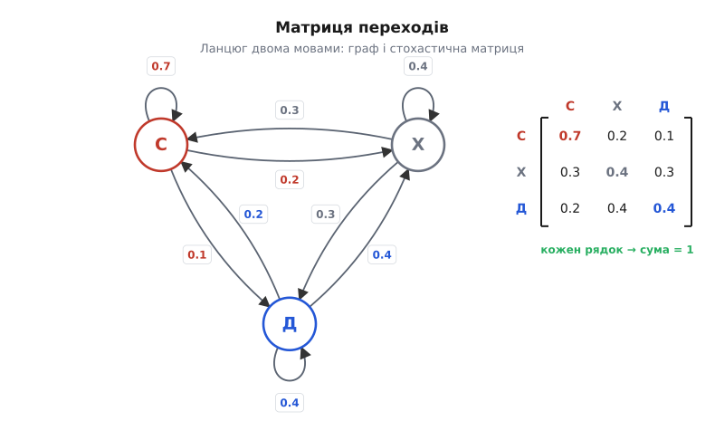
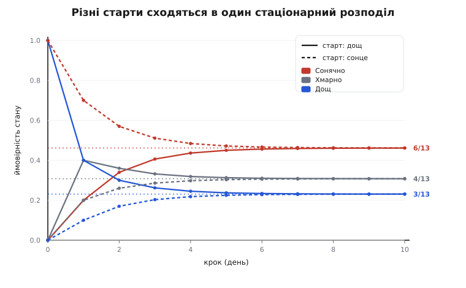
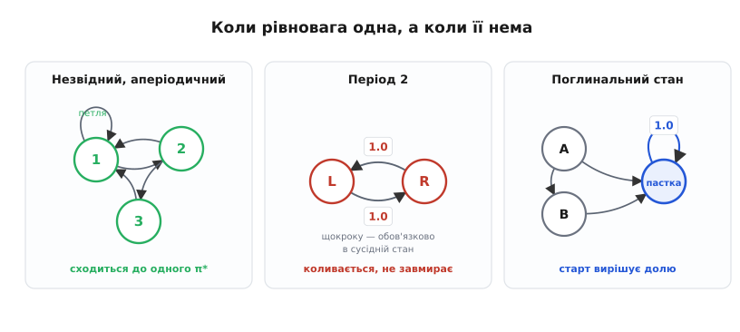

# Ланцюги Маркова

<preknowlist>
- [Імовірність як міра непевності](topic:math/probability-basics) — ймовірність як число від 0 до 1 і **умовна ймовірність**: наскільки правдоподібна подія, коли вже щось відомо.
- [Складові вектора](topic:math/vector-components) — вектор як упорядкований набір чисел; тут ним буде розподіл шансів по станах.
- [Матриці як дії](topic:math/matrices-as-operations) — матриця, що діє на вектор (множення матриці на вектор); саме так один крок ланцюга перетворює розподіл.
</preknowlist>

Спробуйте чесно передбачити, у якому стані завтра буде якась жива система — погода над містом, черга на касі, партія настільної гри, ланцюжок літер у слові. Здається, для доброго прогнозу треба знати всю історію: адже минуле накопичилось у теперішньому, і хтозна, який давній слід іще вплине. Це майже безнадійно — історія нескінченно докладна, тримати її всю неможливо.

І ось клас систем, де стається маленьке диво: **уся історія стискається в теперішнє**. Знати, де система зараз, — рівно так само корисно для прогнозу, як знати весь її шлях до цієї миті. Минуле не додає нічого понад те, що вже видно в поточному стані. Такі системи описують **ланцюгом Маркова** (на честь Андрія Маркова, який їх увів), і диво це не рідкість, а робоча модель для величезної частини світу — від того, як Google ранжує сторінки, до того, як фізик рахує теплову рівновагу. Розберімо від першопричини: **чому** відсутність пам'яті — така сильна властивість, як вона перетворює прогноз на просте множення, і чому майже завжди система зрештою забуває, звідки почала, і осідає в ту саму рівновагу.

## Марковська властивість: майбутнє забуває шлях

Почнімо з того, що взагалі означає «система без пам'яті», бо в цьому вся суть, і легко зрозуміти її неправильно.

Уявімо жабу, що стрибає між кількома листками латаття на ставку. У кожну мить вона на якомусь одному листку — це її **стан**. Куди стрибне далі — випадково, але з певними шансами: з центрального листка вона частіше стрибає на сусідній лівий, зрідка на дальній. Питання одне: **від чого залежать ці шанси?** Марківська система — та, у якій шанси наступного стрибка залежать **тільки від того, на якому листку жаба сидить зараз**, і ні на крихту від того, як вона на цей листок потрапила — прилетіла з лівого чи з правого, вперше тут чи вдесяте. Теперішній листок знає про майбутнє все, що взагалі можна знати; шлях, яким жаба сюди дісталася, не додає жодної підказки.

Це і є **марковська властивість**. Мовою умовної ймовірності вона каже: ймовірність опинитися в наступному стані, **за умови** що відомий увесь минулий шлях, дорівнює ймовірності за умови що відомий лише теперішній стан. Усе минуле, крім останньої миті, у прогнозі скорочується:

```
P(завтра = j | сьогодні = i, вчора = …, позавчора = …)  =  P(завтра = j | сьогодні = i)
```

Ліворуч — повне знання всієї історії; праворуч — саме лише теперішнє. Рівність між ними й означає, що історія зайва. Термін «марковський» став синонімом цього «майбутнє залежить від минулого лише через теперішнє».

Тут криється перша й найважливіша пастка, і чесно її назвати відразу. Марковськість — **не** властивість природи, а властивість того, **як ви обрали стан**. Візьмімо колоду карт, з якої тягнуть по одній. Якщо станом назвати «остання витягнута карта», система **не** марковська: шанси наступної карти залежать від усіх, що вже вийшли, бо їх у колоді вже немає. Але варто **розширити стан** до «повний список карт, що ще лишились у колоді» — і властивість повертається: цей список вичерпно задає майбутнє, а те, в якому порядку карти виходили, більш нічого не додає. Той самий процес то марковський, то ні — залежно від того, що ми запхали в поняття стану. Звідси практичне правило: якщо система пам'ятає щось із минулого, це «щось» треба **втягнути в стан**, і тоді пам'ять зникає — не тому, що її не було, а тому, що вона тепер уся в теперішньому. Мистецтво моделювання ланцюгом — знайти таке визначення стану, за якого пам'ять справді збирається в одну точку.

> 🔧 **Навіщо це.** Уся вигода — у різкому спрощенні. Система з довгою пам'яттю вимагає тримати й обробляти всю історію; марковська — лише поточний стан, скінченну табличку чисел. Прогноз на завтра не риється в архіві, а дивиться на одну змінну. Тому ланцюгами Маркова моделюють те, де повна історія неозора: стан каналу зв'язку, знос деталі, поведінку користувача на сайті, послідовність основ у ДНК. Головна інженерна робота — правильно обрати стан, щоб властивість виконувалась; далі все стає простим.

## Матриця переходів: уся система в таблиці чисел

Якщо майбутнє залежить лише від теперішнього стану, то весь опис системи — це відповідь на одне питання для кожного стану: **куди й з якими шансами вона піде з нього за один крок?** Занумеруймо стани 1, 2, …, m. Для кожної пари станів i та j є число — ймовірність за один крок перейти зі стану i у стан j. Позначмо його P(i→j). Складімо ці числа в квадратну таблицю (матрицю) P, де рядок i — це всі шанси виходу зі стану i:

```
        у стан 1   у стан 2   у стан 3
зі стану 1 [ P(1→1)   P(1→2)   P(1→3) ]
зі стану 2 [ P(2→1)   P(2→2)   P(2→3) ]
зі стану 3 [ P(3→1)   P(3→2)   P(3→3) ]
```

Ця P — **матриця переходів**, і вона містить геть усе про динаміку ланцюга. На неї накладено одну-єдину, але залізну умову. Куди б система не пішла зі стану i, вона мусить опинитися **в якомусь** зі станів — інших варіантів немає. Отже, шанси виходу з кожного стану в сумі дають рівно одиницю: **кожен рядок матриці додається до 1**. Числа невід'ємні (це ймовірності) і кожен рядок нормований — така матриця зветься **стохастичною** (грец. stokhastikós — «здатний влучати, вгадувати», від stókhos — «ціль, здогад»). Стохастичність — не окрема вимога, а прямий запис очевидного факту: зі стану завжди кудись потрапляєш, тож увесь шанс, що виходить із рядка, десь та й осідає.

Ту саму матрицю зручно бачити як **граф**: намалюймо кожен стан кружечком, а кожен ненульовий перехід — стрілкою від стану до стану, підписаною його ймовірністю. Петля на кружечку — шанс лишитися на місці. Це [граф переходів](topic:math/graph-theory) ланцюга; матриця й граф — дві мови про одне й те саме, і кожна десь зручніша: граф одразу показує, звідки куди взагалі можна дійти, а матриця дає рахувати.


*Той самий ланцюг двома мовами. Кожна стрілка графа — один запис матриці; петля — діагональний запис (шанс лишитися). Рядок матриці збирає всі виходи зі стану й тому додається рівно до 1: піти система мусить кудись.*

> 🔧 **Навіщо це.** Матриця переходів — це вся модель, стиснута в m×m чисел, які легко **виміряти з даних**: полічіть, скільки разів зі стану i система пішла в j, поділіть на число виходів з i — маєте оцінку P(i→j). Так із голого журналу подій (логи сервера, кліки, показники давача) будують працездатну прогнозну модель, не знаючи механіки процесу зсередини. І щойно матриця в руках, усе подальше — арифметика над нею.

## Крок еволюції: розподіл тече по станах

Досі ми говорили про одну систему, що сидить в одному стані. Та часто ми не знаємо точно, де вона, а знаємо лише шанси: сьогодні сонячно з імовірністю 0.5, хмарно з 0.3, дощ з 0.2. Це **розподіл** по станах — вектор-рядок невід'ємних чисел, що додаються до 1:

```
π = ( π₁, π₂, π₃ ),   π₁ + π₂ + π₃ = 1
```

Кожне πᵢ — наша поточна певність, що система в стані i. Питання, заради якого все й затівалось: **як цей розподіл зміниться за один крок?** Тобто, знаючи шанси станів сьогодні, які шанси станів завтра?

Візьмімо один цільовий стан, скажімо j, і спитаймо, звідки в нього можна потрапити. З будь-якого стану i — з імовірністю P(i→j), але лише якщо система спершу була в i, а це шанс πᵢ. Отже, внесок стану i у завтрашній шанс стану j дорівнює πᵢ·P(i→j). Різні вихідні стани — це різні, взаємно виключні способи опинитися завтра в j, тож їхні внески просто **додаються** (це закон повної ймовірності — розбити подію на несумісні випадки й скласти):

```
π'ⱼ = π₁·P(1→j) + π₂·P(2→j) + … + π_m·P(m→j)
```

Придивімося до правого боку: це рядок π, «прочесаний» через стовпець j матриці — сума добутків відповідних елементів. А зробити це для кожного j одразу — і є **множення вектора-рядка на матрицю**. Один крок ланцюга — це рівно одна така дія:

```
π' = π · P
```

Ось чому марковська система така зручна: ціле майбутнє одного кроку — це [множення розподілу на матрицю](topic:math/matrices-as-operations), знайома лінійна дія. Уся ймовірнісна механіка сховалась у P, а прогноз став чистою арифметикою. І тут відразу видно, як іти далі в часі. Розподіл через два кроки — це (π·P)·P, тобто π·P². Через n кроків:

```
πₙ = π₀ · Pⁿ
```

Матриця Pⁿ сама має гарний зміст: її запис у рядку i, стовпці j — це ймовірність за **рівно n кроків** дістатися з i у j усіма можливими шляхами (степінь матриці автоматично перебирає й підсумовує всі проміжні маршрути). Тож питання «де система буде через тиждень» — це піднесення однієї матриці до степеня. Подивімось, що при цьому відбувається, бо саме тут ланцюг показує найдивовижніше.

## Дивина: система забуває, звідки почала

Візьмімо конкретний ланцюг і покрутімо його вперед. Хай погода буває **Сонячна (С)**, **Хмарна (Х)**, **Дощова (Д)**, а завтрашня залежить лише від сьогоднішньої за такою матрицею переходів:

```
        С     Х     Д
  С  [ 0.7   0.2   0.1 ]
  Х  [ 0.3   0.4   0.3 ]
  Д  [ 0.2   0.4   0.4 ]
```

(Кожен рядок додається до 1 — перевірте.) Почнімо з повної певності, що **сьогодні дощ**: π₀ = (0, 0, 1). Крок за кроком женемо πₙ = πₙ₋₁·P.

**Прогноз погоди на багато днів уперед від дощового старту:**

```
день 0:   С=0.000   Х=0.000   Д=1.000     (певний дощ)
день 1:   С=0.200   Х=0.400   Д=0.400     = рядок «Д» матриці
день 2:   С=0.340   Х=0.360   Д=0.300
день 3:   С=0.406   Х=0.332   Д=0.262
день 4:   С=0.436   Х=0.319   Д=0.245
день 5:   С=0.450   Х=0.313   Д=0.237
   …
день ∞:   С=0.462   Х=0.308   Д=0.231
```

Розподіл швидко перестає рухатись і завмирає на (0.462, 0.308, 0.231). А тепер найголовніше: почнімо натомість із повної певності, що **сьогодні сонячно**, π₀ = (1, 0, 0):

```
день 0:   С=1.000   Х=0.000   Д=0.000     (певне сонце)
день 1:   С=0.700   Х=0.200   Д=0.100
день 2:   С=0.570   Х=0.260   Д=0.170
день 3:   С=0.511   Х=0.286   Д=0.203
день 5:   С=0.472   Х=0.303   Д=0.225
   …
день ∞:   С=0.462   Х=0.308   Д=0.231
```

**Та сама точка.** Дощовий старт підходив до неї знизу, сонячний — згори, але обидва прийшли в один і той самий розподіл (0.462, 0.308, 0.231). Система **забула, звідки почала**. Через достатньо днів прогноз погоди вже не залежить від того, яка погода була в день 0, — лишається сама матриця переходів, і вона диктує єдину відповідь. Це не випадковість цих чисел, а типова доля ланцюга, і в неї є точна причина.

Той розподіл, на якому все завмирає, зветься **стаціонарним** (лат. statiōnārius — «нерухомий»). Позначмо його π*. Він нерухомий у прямому сенсі: якщо система вже розподілена як π*, то ще один крок нічого не міняє —

```
π* · P = π*
```

Ось ключ до того, **чому** саме сюди все стягується. Один крок ланцюга — це дія множення на P; більшість розподілів вона зсуває. Але є розподіл, який ця дія лишає на місці, — **нерухома точка** перетворення. Крок за кроком динаміка підтягує будь-який стартовий розподіл до цієї нерухомої точки, бо на кожному кроці розбіжність із нею стискається (нижче побачимо, наскільки). Рівняння π* = π*·P каже, що π* — це **власний вектор** матриці P (лівий) із власним значенням рівно 1: напрям, який множення на P не повертає, а лишає незмінним. Стохастична матриця завжди має власне значення 1 (бо її рядки додаються до 1), і відповідний власний вектор — це і є рівновага, до якої тягнеться ланцюг. Хто хоче побачити, чому таке власне значення 1 завжди існує, чому відповідний розподіл додатний і єдиний, і **чому решта власних значень за модулем менші від одиниці** (саме через це збіжність і відбувається), — усе це строго доводить [теорема Перрона–Фробеніуса та математика стаціонарного розподілу](topic:math/markov-chain/math-stationary.md).

Стаціонарний розподіл можна знайти двома шляхами, і обидва варто мати в руках. Перший — просто **ітерувати**: женіть πₙ₊₁ = πₙ·P, поки не завмре; ми щойно так і зробили. Другий — **розв'язати рівняння** π = π·P разом з умовою, що компоненти додаються до 1. Для нашої погоди це дає точну відповідь дробами:

```
π* = ( 6/13,  4/13,  3/13 ) = ( 0.4615,  0.3077,  0.2308 )
```

Саме до неї сходились обидва наші прогнози. Тепер видно її фізичний зміст: якщо стежити за погодою роками, то **частка сонячних днів у довгому ряді** дорівнюватиме 6/13, хмарних — 4/13, дощових — 3/13. Стаціонарний розподіл — це не лише кінцевий прогноз, а й **довгочасна частка часу**, яку система проводить у кожному стані.


*Ланцюг забуває початок. Суцільні лінії — прогноз від дощового старту, пунктирні — від сонячного; обидва набори сходяться до тих самих стаціонарних рівнів (штрихові горизонталі). Різниця між стартами тане з кожним кроком у ~0.46 раза, тож уже за десяток кроків її не видно.*

Лишилось пояснити оте «стискається у ~0.46 раза», бо воно й задає, **як швидко** система забуває старт. Погляньте на відхилення частки сонячних днів від її стаціонарного значення 0.4615 у дощовому прогнозі: на кроці 1 воно −0.262, на кроці 2 −0.121, далі −0.056, −0.025, −0.011. Кожне наступне менше за попереднє приблизно в 0.456 раза — розбіжність із рівновагою **зменшується вдвічі десь щокроку**, геометрично. Це число не випадкове: 0.456 — це **друге за величиною власне значення** матриці P (перше — та сама одиниця, що дає стаціонарний розподіл). Швидкість, з якою ланцюг стягується до рівноваги, диктує саме друге власне значення λ₂: чим воно ближче до 1, тим повільніше згасає пам'ять про старт, а розрив між одиницею та |λ₂| (його звуть **спектральною щілиною**) і є мірою «швидкості забування». Ланцюг зі щілиною, близькою до нуля, місяцями тягтиме слід початкового стану; ланцюг із широкою щілиною забуває його за кілька кроків. Точний зв'язок швидкості з λ₂ виводить [та сама вставка про стаціонарний розподіл](topic:math/markov-chain/math-stationary.md), а власні значення й вектори як такі — тема [власних значень](topic:math/eigenvalues).

> 🔧 **Навіщо це.** Стаціонарний розподіл — це відповідь на питання «а що в середньому / зрештою?», яке в інженерії ставлять раз у раз. Яку частку часу сервер буде перевантажений? Яка усталена частка бракованих виробів на конвеєрі зі станами машини? Яку частку запитів побачить кожен вузол? Усе це — компоненти π*, і рахуються вони з матриці переходів без жодного тривалого моделювання. А спектральна щілина каже друге важливе: **скільки чекати**, поки система вийде на цей усталений режим, і чи встигне взагалі.

## Коли рівновага існує і єдина

Тепер обережність, бо «система забуває старт і сходиться до єдиної рівноваги» — правда не для всякого ланцюга, і кожна умова тут не формальність, а пряме «інакше зламається». Розберімо, що може піти не так, бо саме на цьому найчастіше спотикаються.

**Ланцюг має бути незвідним.** *Незвідність* означає: з кожного стану можна (за скількись кроків) дістатися до кожного іншого. Граф переходів — суцільно зв'язаний, не розпадається на ізольовані шматки. Якщо ж він розпадається — уявіть дві групи станів, між якими немає жодної стрілки, — то ланцюг має **не одну** рівновагу, а свою для кожної групи, і те, куди він прийде, залежить від того, в якій групі почав. Забування старту ламається в найгрубший спосіб: старт визначає, у якому з розділених світів система застрягне назавжди. Крайній випадок — **поглинальний стан**, з якого немає виходу (петля з імовірністю 1): потрапив — лишився навіки, і рівновага одна на весь ланцюг лише тоді, коли поглинальний стан один і досяжний звідусіль.

**Ланцюг має бути аперіодичним.** Навіть суцільно зв'язаний ланцюг може не завмирати, а вічно **коливатися**. Уявіть дві кімнати й правило: щокроку обов'язково переходь у сусідню. Хто почав ліворуч, буде ліворуч на парних кроках і праворуч на непарних — розподіл стрибає туди-сюди й **ніколи не завмирає**, хоча система й незвідна. Це *періодичність*: стани відвідуються за жорстким розкладом, з періодом 2 (чи більшим). Стаціонарний розподіл (0.5, 0.5) тут формально існує — це середнє по коливанню, — але прогноз до нього **не сходиться**, бо вічно осцилює навколо. Щоб збіжність була, ланцюг мусить бути *аперіодичним*: не мати такого спільного розкладу. Достатньо крихти — однієї петлі (ненульовий шанс лишитися на місці бодай в одному стані), і жорсткий такт «крок — обов'язково в сусідню» ламається, коливання розмивається, розподіл починає завмирати.


*Коли рівновага одна, а коли ні. Ліворуч: незвідний + аперіодичний — усі старти сходяться до одного π*. Посередині: чистий період 2 — розподіл стрибає між станами й ніколи не осідає. Праворуч: поглинальний стан «пастка» — куди прийде система, вирішує старт, спільної рівноваги немає.*

Разом ці дві умови — **незвідність і аперіодичність** — дають те, що зветься *ергодичністю* (грец. érgon — «робота», hodós — «шлях»): ланцюг, у якому один довгий шлях блукання проходить усі стани в правильних частках, і система гарантовано забуває старт та сходиться до **єдиного** стаціонарного розподілу, звідки б не почала. Це і є точний зміст дива, з якого ми почали: не всяка марковська система забуває історію, а саме **ергодична** — незвідна й аперіодична. Обидві умови справжні: прибери незвідність — і старт визначає, у якому кутку застрягнеш; прибери аперіодичність — і система вічно коливається, так і не осівши.

> 🔧 **Навіщо це.** Ці умови — перше, що перевіряють, перш ніж довіритись усталеному розрахунку. Якщо в моделі є стани-пастки (незворотна відмова, завершений процес), ланцюг звідний — і «середня частка часу» не має єдиного сенсу; питати треба інше — **ймовірність і час до поглинання**. Якщо система тактована жорстким циклом, вона періодична — і усереднювати миттєвий стан не можна, лишень по повному періоду. Побачити пастку чи цикл у графі переходів — значить не порахувати нісенітницю там, де рівноваги в звичайному сенсі просто нема.

## Коли ланцюг застрягає: поглинальні стани

Той випадок із пасткою вартий окремого погляду, бо він не патологія, а **сам предмет** цілого класу задач. Часто нас цікавить не усталений режим (його й немає), а протилежне: система рано чи пізно потрапляє в один із **поглинальних** станів і там лишається — питання лише, **у який саме** і **як скоро**.

Класичний приклад — **розорення гравця**. Гравець починає з якоюсь сумою, скажімо 3 монети, і щокроку з рівними шансами виграє або програє одну, аж поки не дійде до 0 (розорився) чи до якоїсь стелі (зірвав банк). Це [випадкове блукання](topic:math/random-walk) з двома поглинальними бар'єрами: капітал робить крок ±1 щоразу, поки не впреться в один із двох країв. Стани — це капітал 0, 1, 2, …, до стелі; крайні (0 і стеля) поглинальні — гра там завершується. Проміжні стани минущі: система блукає між ними, та зрештою **напевно** випадає в один із двох кінців. Тут безглуздо питати про стаціонарний розподіл серед проміжних станів — уся ймовірність зрештою стече в поглинальні. Змістовні питання інші: з якою ймовірністю гравець розориться, а не зірве банк? Скільки кроків у середньому триватиме гра до кінця? І на них ланцюг відповідає точно — через ту саму матрицю переходів, тільки цілять не в нерухому точку, а в **час і місце поглинання**. Це той самий апарат, повернутий іншим боком: незвідний ланцюг питають про рівновагу, ланцюг із пастками — про долю блукання до пастки.

## Чому вони всюди

Тепер видно, чому ланцюги Маркова трапляються так нав'язливо часто. Причина проста: **безліч систем справді залежать від минулого лише через теперішнє** — або їх можна такими зробити, вдало обравши стан. А щойно система марковська, з нею працює вся ця машина: один крок — множення на матрицю, довгочасна поведінка — стаціонарний розподіл, швидкість виходу на режим — спектральна щілина. Ось де ця машина працює наживо.

**Ранжування вебсторінок.** Уявіть людину, що безцільно блукає інтернетом: на сторінці навмання клікає одне з посилань і йде далі. Це ланцюг Маркова, де стани — сторінки, а переходи — посилання між ними. Стаціонарний розподіл такого блукання каже, яку частку часу блукач проводить на кожній сторінці, — і це напрочуд добра міра важливості сторінки. Саме так влаштований **PageRank**, з якого виріс Google: важливість сторінки — це її вага в стаціонарному розподілі велетенського ланцюга з мільярдів станів, а рахують її степеневими ітераціями πₙ₊₁ = πₙ·P — тим самим «женемо крок за кроком до рівноваги», що й у нашій погоді, лише на неосяжно більшій матриці. Як саме це роблять на практиці — навіщо додають «телепортацію», щоб ланцюг лишався незвідним, і як степенева ітерація сходиться, — розбирає окрема стаття [Алгоритм ранжування графів PageRank](topic:algorithms/pagerank-algorithm).

**Мова й тексти.** Уже сам Марков випробував свою ідею на живому тексті: 1913 року він пройшовся першими 20 000 літерами «Євгенія Онєгіна» Пушкіна, розмітив кожну як голосну чи приголосну й полічив, як часто за голосною йде голосна, за приголосною приголосна тощо, — тобто побудував двостановий ланцюг просто з тексту. Він показав, що літери **не незалежні**: наступна залежить від попередньої, і ця залежність гарно описується матрицею переходів. Це історичний прабатько всіх мовних моделей: передбачати наступний символ чи слово за поточним — марковська задача, і саме з неї виросла ціла традиція обробки мови. Як народилась ця ідея, проти чого й проти кого Марков її будував, розповідає [історія народження ланцюгів Маркова](topic:math/markov-chain/hist-markov.md).

**Фізика, черги, симуляція.** Молекула газу, що перескакує між енергетичними рівнями; заявка, що блукає між станами «в черзі» й «на обслуговуванні»; знос деталі, що повзе від «нова» до «відмова», — усе це ланцюги, і їхній стаціонарний розподіл дає теплову рівновагу, середню довжину черги, усталену частку відмов. А в зворотний бік ту саму ідею повертає **марковський метод Монте-Карло** (MCMC): щоб набрати вибірку зі складного розподілу, який годі задати формулою, будують ланцюг, чий стаціонарний розподіл — рівно той, що потрібен, і просто дають ланцюгу блукати; його довгий шлях сам собою відтворює шуканий розподіл у правильних частках. Тут ергодичність із теоретичної гарантії стає робочим інструментом: без неї блукання не відтворило б потрібне.

Спільне в усіх випадках одне: **майбутнє залежить від минулого лише через теперішнє**, а щойно так — розподіл тече по станах множенням на матрицю й майже завжди осідає в єдину рівновагу. Ланцюг Маркова цінний не тим, що описує якусь одну систему, а тим, що ловить цю повторювану рису світу — безпам'ятність — і перетворює її на просту й точну арифметику.

## Що тримати в руках

Ланцюг Маркова — це система, чиє **майбутнє залежить від минулого лише через теперішній стан**; уся її динаміка вміщається в стохастичну матрицю переходів P, кожен рядок якої додається до одиниці, бо зі стану система мусить кудись потрапити. Один крок у часі — це множення розподілу-рядка на цю матрицю, π' = π·P (закон повної ймовірності, записаний матрицею), а n кроків — множення на Pⁿ.

Головна доля ланцюга — **забути, звідки почав**: розподіл сходиться до єдиної нерухомої точки π* = π*·P, стаціонарного розподілу, який є лівим власним вектором матриці P із власним значенням 1 і водночас довгочасною часткою часу в кожному стані. Стягується сюди все тому, що множення на P стискає розбіжність із π* щокроку — у стільки разів, скільки становить друге власне значення |λ₂|; ширша спектральна щілина 1−|λ₂| — швидше забування.

Та це диво не безумовне: рівновага єдина й досяжна лише для **незвідного** (звідусіль скрізь дійти) й **аперіодичного** (без жорсткого циклу) ланцюга — разом це ергодичність. Звідний ланцюг розпадається на окремі рівноваги або застрягає в пастці; періодичний вічно коливається й не осідає. Де є поглинальні стани, питають не про рівновагу, а про ймовірність і час поглинання. Зрозумівши тут **чому** — чому безпам'ятність стискає всю історію в теперішнє, чому крок стає множенням на матрицю й чому система майже завжди зрештою забуває старт, — ви тримаєте не набір формул, а ту першопричину, з якої ланцюги Маркова описують і блукання вебом, і літери в тексті, і теплову рівновагу однією й тією ж мовою.
