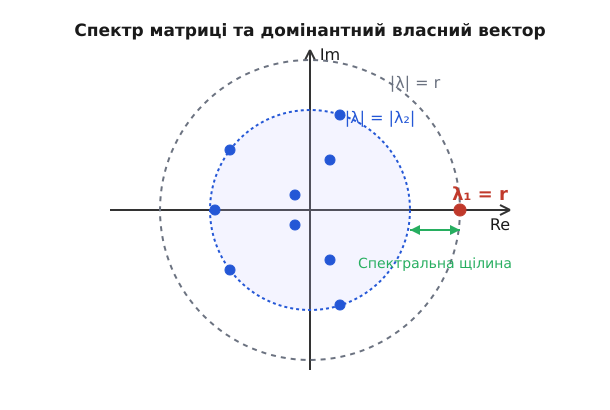

<preknowlist>
- [Власні значення та власні вектори](/book/math/linear-algebra/eigenvalues-vectors) — основа спектрального аналізу.
- [Ланцюги Маркова](/book/math/probability/markov-chain) — випадкові процеси з дискретним часом.
- [Графи та матриці суміжності](/book/math/discrete/graphs-matrices) — представлення структурних зв'язків.
</preknowlist>

# Теорема Перрона — Фробеніуса: стаціонарність, спектральна щілина і PageRank

Уявіть, що ви вивчаєте велику систему, яка постійно змінюється з часом, але при цьому зберігає певну загальну масу або кількість енергії. Це може бути популяція тварин, де одні види народжуються, а інші гинуть; це може бути економіка країни, де гроші постійно переходять з однієї галузі в іншу; або це може бути інтернет, де користувачі безперервно клікають на посилання і переходять з однієї вебсторінки на іншу. Усі ці процеси мають одну спільну рису: вони описуються матрицями, що складаються виключно з додатних або невід'ємних чисел (адже не буває від'ємної кількості тварин, від'ємної ймовірності або від'ємної кількості користувачів). 

Коли ми описуємо переходи в таких системах за допомогою матриці P, головне питання, яке нас цікавить: **чи прийде ця система з часом до стану стабільної рівноваги?** І якщо так, то чи залежатиме ця рівновага від того, з чого ми почали? Саме на ці питання дає вичерпну та неймовірно красиву відповідь теорема Перрона — Фробеніуса.

> 🔧 **Навіщо це.**
> Теорема Перрона — Фробеніуса є фундаментальним математичним двигуном, який приводить у рух безліч сучасних алгоритмів. Без неї алгоритм PageRank від Google, який сортує результати пошуку на основі важливості вебсторінок, не міг би гарантувати знаходження єдиного і правильного рейтингу. У фінансах вона лежить в основі моделі міжгалузевого балансу Василя Леонтьєва (за яку він отримав Нобелівську премію). У теорії ймовірностей ця теорема є базовим доказом того, що марковські ланцюги не хаотично блукають, а прагнуть до стійкого і передбачуваного стаціонарного розподілу. Будь-який процес, у якому відбувається перерозподіл «додатних» сутностей, керується законами, відкритими Перроном і Фробеніусом.

## 1. Додатні та невід'ємні матриці

Для початку згадаємо базові поняття. Матриця P називається **строго додатною**, якщо кожен її елемент Pᵢⱼ строго більший за нуль (Pᵢⱼ > 0). Вона називається **невід'ємною**, якщо серед її елементів допускаються нулі, але жоден елемент не є від'ємним (Pᵢⱼ ≥ 0).

Властивості лінійних перетворень визначаються їхніми власними значеннями (λ) та власними векторами (v). Власний вектор — це такий особливий напрямок у просторі, який під дією матриці не змінює свого напрямку, а лише масштабується. Математично це записується як:
P v = λ v.

У загальному випадку матриці можуть мати комплексні власні значення і комплексні власні вектори. Їх складно уявити геометрично, і ще складніше інтерпретувати фізично. Наприклад, якщо ми шукаємо стабільний розподіл ймовірностей (який має бути вектором з дійсних додатних чисел), комплексний вектор нам ніяк не допоможе.

Але тут вступає в гру магія додатності. Оскар Перрон у 1907 році довів, що якщо матриця P строго додатна, то в її спектрі (наборі всіх власних значень) відбувається щось дивовижне.

### Корінь Перрона

Згідно з теоремою Перрона, строго додатна квадратна матриця P має одне особливе власне значення r, яке називають **коренем Перрона** (або домінантним власним значенням), і яке має такі безпрецедентні властивості:
1. Число r є строго додатним дійсним числом (r > 0).
2. За абсолютною величиною (модулем) число r строго більше за всі інші власні значення матриці. Тобто, якщо λ — будь-яке інше власне значення (дійсне чи комплексне), то виконується строга нерівність: r > |λ|. Позначають r = ρ(P), де ρ(P) — спектральний радіус матриці.
3. Цьому власному значенню відповідає власний вектор v, усі координати якого є строго додатними дійсними числами (vᵢ > 0 для всіх i).
4. Корінь Перрона є простим (його алгебраїчна кратність дорівнює 1), і це єдине власне значення, яке має власний вектор лише з невід'ємними координатами.

Тобто додатність матриці якимось чином «виштовхує» одне дійсне власне значення далеко вперед, роблячи його абсолютним лідером серед усіх інших. А відповідний йому власний вектор лежить виключно в першому октанті (всі координати додатні), що робить його ідеальним кандидатом на роль розподілу ймовірностей чи фізичної маси.

## 2. Нерозкладні матриці та графи

Теорема Перрона — це чудово, але вимагати, щоб матриця не мала жодного нуля — це занадто жорстко. У реальному світі (наприклад, у графі інтернету) більшість сторінок не посилаються на всі інші сторінки у світі; матриця зв'язків має величезну кількість нулів (вона розріджена).

Георг Фробеніус розширив результати Перрона на набагато ширший клас матриць — **невід'ємні нерозкладні матриці**. Що означає нерозкладність?

Уявіть матрицю як опис зв'язків між містами. Елемент Pᵢⱼ вказує на ймовірність (або пропускну здатність) переходу з міста i до міста j. Матриця є **нерозкладною** (незвідною), якщо з будь-якого міста можна дістатися до будь-якого іншого міста за скінченну кількість кроків (можливо, через інші міста). Якщо ж міста можна розділити на дві ізольовані групи так, що з першої групи неможливо потрапити до другої, то така матриця є розкладною.

Якщо невід'ємна матриця P є нерозкладною, теорема Фробеніуса гарантує, що для неї також існує додатне максимальне власне значення r, і відповідний йому власний вектор має строго додатні координати. Однак тут виникає один нюанс: нерівність між максимальним коренем і рештою власних значень стає нестрогою. Можуть існувати інші комплексні власні значення, модуль яких дорівнює r. 

Щоб повернути строгу нерівність (r > |λ| для всіх інших λ), матриця повинна бути не просто нерозкладною, а ще й **примітивною**. Примітивна матриця — це така невід'ємна матриця, для якої існує деяка ціла степінь k, після піднесення до якої матриця Pᵏ стає строго додатною (не містить жодного нуля). Для графів це означає, що існує певна довжина шляху k, така, що з будь-якого вузла можна потрапити в будь-який інший вузол рівно за k кроків. Якщо граф є нерозкладним і не є періодичним (не цикліться жорстко), його матриця суміжності примітивна.

## 3. Спектр матриці та спектральна щілина

Давайте візуалізуємо, що відбувається з власними значеннями примітивної матриці на комплексній площині. Власні значення — це в загальному випадку комплексні числа (x + iy), які можна зобразити точками на площині.

На рисунку вище зображено спектр примітивної матриці. Корінь Перрона (r = λ₁) лежить на додатній частині дійсної осі (Re) і визначає найбільший радіус кола |λ| = r, яке охоплює всі власні значення. Жодне інше власне значення не лежить на цьому зовнішньому колі; усі вони знаходяться всередині меншого кола радіусом |λ₂|, де λ₂ — друге за величиною (за модулем) власне значення.

Відстань між радіусом зовнішнього кола r і радіусом внутрішнього кола |λ₂| називається **спектральною щілиною** (spectral gap).
Спектральна щілина = r - |λ₂|.

Спектральна щілина — це не просто геометрична цікавинка. Це найголовніший параметр, який визначає, наскільки швидко система забуває свій початковий стан і приходить до стану рівноваги. 

Уявімо, що ми починаємо з деякого вектора стану v₀ і починаємо діяти на нього матрицею P. Кожен крок системи — це множення: v₁ = P v₀, v₂ = P v₁, ..., vₙ = Pⁿ v₀.
Ми можемо розкласти початковий вектор v₀ на компоненти, які відповідають власним векторам матриці P. Під час множення на Pⁿ кожна компонента множиться на відповідне власне значення в степені n:
Pⁿ v₀ = c₁ (λ₁)ⁿ v₁ + c₂ (λ₂)ⁿ v₂ + ... + cₖ (λₖ)ⁿ vₖ.

Оскільки λ₁ = r є домінантним (найбільшим за модулем), то при великих n член (λ₁)ⁿ зростає набагато швидше за всі інші. Якщо ми поділимо весь вираз на rⁿ, то отримаємо:
(Pⁿ v₀) / rⁿ = c₁ v₁ + c₂ (λ₂/r)ⁿ v₂ + ...

Оскільки |λ₂/r| < 1, то при n → ∞ всі члени, окрім першого, експоненційно швидко прямують до нуля. Залишається лише напрямок, заданий домінантним власним вектором v₁. Швидкість, з якою затухають «зайві» шумові компоненти, визначається відношенням |λ₂|/r. Чим більша спектральна щілина (чим менше |λ₂| порівняно з r), тим швидше система збігається до рівноваги. Якщо щілина мала, системі знадобиться дуже багато ітерацій, щоб досягти стаціонарності.

## 4. Стохастичні матриці Маркова

Одне з найважливіших застосувань теореми Перрона — Фробеніуса виникає в теорії ланцюгів Маркова. Уявімо систему, яка перебуває в одному з множини станів і з певною ймовірністю переходить в інший стан на кожному кроці. Матриця таких імовірностей називається **стохастичною**. 

Особливість стохастичної матриці переходів P полягає в тому, що сума елементів у кожному її рядку дорівнює 1 (адже сума ймовірностей усіх можливих переходів зі стану i становить 100%). Математично це означає, що якщо помножити матрицю P на вектор-стовпець, який складається з одних одиниць (позначимо його 1), ми отримаємо той самий вектор:
P 1 = 1.
Звідси відразу випливає феноменальний висновок: стохастична матриця завжди має власне значення λ = 1. Оскільки жодне власне значення такої матриці не може перевищувати 1 за модулем, це означає, що **корінь Перрона для будь-якої стохастичної матриці завжди дорівнює точно 1 (r = 1).**

Але для ланцюгів Маркова нас більше цікавлять не вектори-стовпці, а вектори-рядки. Стан системи описується вектором-рядком ймовірностей π = (π₁, π₂, ..., πₙ), де кожна координата — це ймовірність того, що система перебуває у відповідному стані. Новий стан обчислюється множенням вектора-рядка на матрицю P зліва:
πₙ₊₁ = πₙ P.

Згідно з лінійною алгеброю, ліві та праві власні значення матриці збігаються. Оскільки r = 1 є правим власним значенням, воно є і лівим. Теорема Перрона — Фробеніуса (для нерозкладної примітивної матриці P) гарантує нам, що існує єдиний додатний лівий власний вектор π, який відповідає власному значенню 1:
π P = 1 · π = π.

Цей вектор π є святим Граалем теорії ймовірностей — він називається **стаціонарним розподілом**. Рівність π P = π означає, що якщо система досягне стану π, то наступний крок (множення на P) нічого не змінить. Система перебуватиме в динамічній рівновазі назавжди.

Більше того, теорема гарантує нам, що:
1. Цей стаціонарний розподіл існує і він унікальний (жодного іншого не існує).
2. Усі його координати строго додатні (система з ненульовою ймовірністю відвідуватиме кожен можливий стан).
3. З якого б початкового розподілу ймовірностей ми не почали (головне, щоб сума дорівнювала 1), після великої кількості кроків система гарантовано і невідворотно прийде саме до розподілу π.

## 5. Алгоритм PageRank: як Google впорядкував інтернет

Найвідомішим практичним тріумфом теореми Перрона — Фробеніуса є алгоритм PageRank, винайдений засновниками Google Ларрі Пейджем і Сергієм Бріном. 

Їхня ідея полягала в тому, щоб виміряти «важливість» кожної сторінки в інтернеті. Сторінка є важливою, якщо на неї посилаються інші важливі сторінки. Якщо вебсторінка A має посилання на вебсторінку B, вона передає їй частину свого рейтингу (своєї ймовірнісної маси). Усю мережу інтернет можна представити як гігантську матрицю переходів P, де Pᵢⱼ — це ймовірність переходу зі сторінки i на сторінку j. 

Стаціонарний розподіл π для цієї матриці — це і є рейтинг PageRank! Значення πⱼ показує, яку частку часу нескінченний випадковий серфер проведе на сторінці j.

Але тут виникає проблема: реальний інтернет не є нерозкладним. Існують групи сторінок, які посилаються одна на одну, але не мають посилань на зовнішній світ (так звані павутини-пастки). Існують сторінки без жодних зовнішніх посилань (висячі вузли). Відповідно, матриця реального інтернету не задовольняє умов теореми Фробеніуса, і стаціонарний розподіл може не існувати, або їх може бути нескінченно багато, або рейтинг може скупчуватися лише на кількох ізольованих сайтах.

Геніальне рішення Бріна і Пейджа полягало в тому, щоб примусово зробити матрицю строго додатною! Вони ввели так званий **фактор загасання (damping factor)** d, який зазвичай встановлюють на рівні 0.85 (85%). 
Створена ними «Матриця Google» G визначається як:
G = d · P + (1 - d) / N · E,
де N — загальна кількість сторінок, а E — матриця, що складається виключно з одиниць.

Що означає ця формула фізично? З імовірністю 85% серфер переходить за випадковим посиланням на поточній сторінці. Але з імовірністю 15% він «нудиться», закриває поточну вкладку і переходить на абсолютно випадкову сторінку всього інтернету. 

Завдяки доданку (1 - d) / N · E матриця G більше не містить жодного нуля. Вона стає строго додатною. І тут вступає в дію найпотужніша зброя — теорема Оскара Перрона з 1907 року. Оскільки матриця G суворо додатна:
1. Існує єдиний унікальний стаціонарний вектор π (рейтинг PageRank).
2. Спектральна щілина стає величезною. Друге найбільше власне значення матриці G не перевищує d (тобто |λ₂| ≤ 0.85). 

Завдяки широкій спектральній щілині, обчислення PageRank за допомогою степеневого методу (множення вектора на матрицю G знову і знову) збігається блискавично. Навіть для матриці розміром у мільярди рядків і стовпців алгоритму потрібно лише близько 50 ітерацій, щоб досягти прийнятної точності й відсортувати весь інтернет.

## Підсумок

Теорема Перрона — Фробеніуса є перлиною лінійної алгебри. Вона вчить нас простого, але глибокого правила: у системах, де немає місця для негативних взаємодій (де всі елементи матриці невід'ємні), структура гарантує стабільність. Незалежно від того, яким складним і хаотичним здається граф зв'язків, якщо він є зв'язним, система обов'язково знайде свій єдиний стаціонарний ритм. Від поведінки молекул у тепловій ванні до ранжування вебсторінок — усі ці невідворотні процеси рівноваги спираються на міцний фундамент, закладений понад століття тому.
