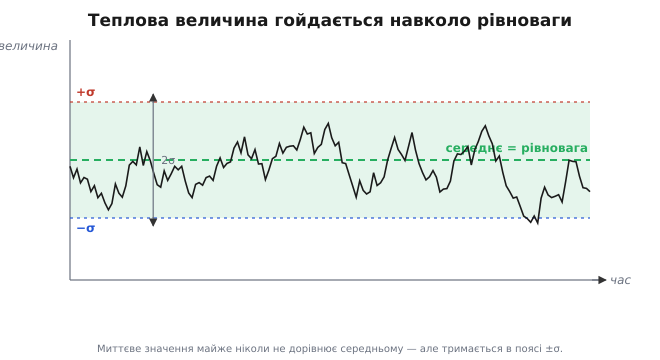
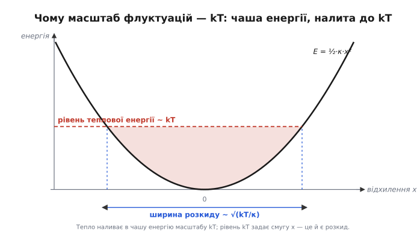
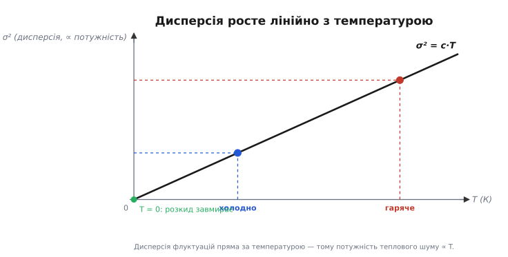

# Теплові флуктуації

Будь-яка фізична величина, яку ви міряєте, дрібно тремтить — навіть коли все довкола нерухоме. Покладіть конденсатор на стіл, не чіпайте його, і напруга на ньому не стоятиме як укопана: вона безперервно дрібно гойдатиметься навколо свого значення. Закоротьте резистор і дивіться на струм крізь нього — середній струм нуль, але в кожну мить крізь резистор тече крихітний випадковий струм то в один бік, то в інший. Підвісьте дзеркальце на тонкій нитці у вакуумі, заберіть усі протяги — і воно все одно ледь помітно посмикуватиметься. Це не брак приладу й не недогляд: це **теплові флуктуації** (лат. *fluctuatio* — «коливання, хвилювання») — випадкові коливання величин, що породжує сам тепловий рух речовини. Вони є завжди, у всьому, що тепліше за абсолютний нуль, і поставити їх можна не як перешкоду, а як прямий наслідок того, що матерія всередині ніколи не буває по-справжньому спокійною.

Питання, на яке варто відповісти від самої першопричини, троїсте. Звідки взагалі береться це тремтіння — чому величина, лишена сама на себе, не стоїть на місці? Чому його масштаб виявляється всюди той самий — пропорційний до добутку **kT**, температури на сталу Больцмана? І як це тремтіння перетворюється на конкретний шум у проводах та на межу того, що взагалі можна виміряти? Відповіді сходяться в одну: розкид величини — це міра теплового безладу, і вся арифметика тут — це арифметика дисперсії, прикладена до енергії.

## Звідки тремтіння: безлад, який не вщухає

Усередині будь-якого тіла за температури вище абсолютного нуля панує безперервний **хаотичний тепловий рух**. Атоми тремтять навколо своїх місць, молекули газу літають і стикаються мільярди разів за секунду, вільні електрони в металі снують туди-сюди й відскакують від ґратки. Це не рух «кудись» — у нього немає переважного напрямку, інакше тіло саме собою кудись поїхало б. Це безлад: кожна частинка щомиті летить навмання, а сусіди штовхають її в випадковий бік.

Тепер придивімося, що цей безлад робить із будь-якою величиною, яку ми міряємо. Візьмімо напругу на розімкненому конденсаторі. Вона задається тим, скільки зайвих електронів зібралося на одній обкладці проти іншої. Електрони ж не сидять смирно — їх безперестанку штовхає тепловий рух, і в кожну мить випадково то трохи більше їх опиняється на одній обкладці, то на іншій. Жодна сила не тримає рівновагу ідеально жорстко, тож заряд щомиті трохи «недобирає» або «перебирає» — і напруга дрібно стрибає навколо свого середнього. Те саме зі струмом крізь резистор: тепловий рух електронів сам собою щомиті жене їх трохи більше в один бік — виникає крихітний випадковий струм, який наступної миті міняє знак. Те саме з положенням підвішеного дзеркальця: молекули повітря (чи й самі атоми нитки) б'ють по ньому з усіх боків, і хоч у середньому удари врівноважені, у кожну мить з одного боку випадково припадає трохи більше — дзеркальце посмикується.

Скрізь та сама схема. Є величина, яку утримує біля рівноваги якась сила повернення (електричне поле тягне заряд назад, пружна нитка — дзеркальце назад). І є **тепловий рух**, що безперестанку б'є по цій величині випадковими поштовхами. Рівновага — це не спокій, а **середній** спокій: миттєве значення майже ніколи не дорівнює рівноважному, воно весь час трохи збите вбік останнім поштовхом і ще не повернулося, коли надходить наступний. Тіло перебуває не в точці рівноваги, а в безперервному дрібному танці навколо неї.


*Лишена сама на себе, теплова величина не стоїть на місці: кожен тепловий поштовх збиває її вбік, сила повернення тягне назад, наступний поштовх знову збиває. Середнє дорівнює рівновазі (нульова добавка), але миттєве значення майже ніколи не дорівнює середньому — воно гойдається в поясі ±σ. «Спокій» тут означає лише середній спокій.*

Звідси одразу видно дві риси будь-якої теплової флуктуації, які варто закріпити, бо на них стоїть уся подальша математика. **Перша: середнє дорівнює нулю.** Точніше — середня *добавка* до рівноваги нульова: немає причини, щоб поштовхи в один бік переважали поштовхи в інший, тож за досить довгий час перекоси в обидва боки рівно гасяться. Сама величина гойдається навколо свого рівноважного значення, а її відхилення від нього усереднюється в нуль. **Друга: розкид не нульовий.** У кожну окрему мить відхилення є, і воно то більше, то менше. Отже, описати флуктуацію одним числом — її середнім — марно: середнє нічого не каже, бо воно завжди дорівнює рівновазі. Уся інформація про тремтіння сидить у **другому** числі — у тому, наскільки широко величина розповзається навколо середнього.

> 🔧 **Навіщо це.** Розуміння, що теплове тремтіння невитравне, рятує інженера від гонитви за привидами. Побачивши «траву» на чутливому вході приладу, новачок місяцями шукає, «де витікає», міняє деталі, паяє екрани — а це часто просто теплові флуктуації, і їх там рівно стільки, скільки наказує фізика. Досвідчений натомість одразу прикидає очікуваний рівень теплового тремтіння й порівнює з побаченим: збігається — це межа, і боротися треба не з «витоком», а зі смугою чи з опором; шуму помітно більше — отам уже варто шукати наводку або поганий компонент.

## Розкид — це і є флуктуація

Якщо середнє теплової добавки завжди нуль, то весь зміст флуктуації несе її **розкид** — те, наскільки кучно чи широко величина гойдається навколо рівноваги. А розкид випадкової величини має точну математичну міру, і будувати її наново тут не треба: це **дисперсія** — середній квадрат відхилення від середнього.

> Дисперсія σ² = E[(X − μ)²] — це середній квадрат відхилення величини від її середнього μ; її корінь σ (стандартне відхилення) — типовий розмір відхилення в тих самих одиницях, що й сама величина. Відхилення підносять у квадрат, аби прибрати знак (інакше плюси й мінуси гасилися б у нуль) і щоб дисперсії незалежних джерел складалися як потужності. Докладно — у статті [середнє й дисперсія](book:math/mean-variance).

Чому саме квадрат відхилення, а не, скажімо, модуль, — питання не косметичне, і для теплових флуктуацій воно вирішальне. Квадрат відхилення — це **енергія**. Коли заряд відхилився на величину q від рівноваги, енергія, запасена в цьому відхиленні, пропорційна q²; коли дзеркальце повернулося на кут φ, пружна енергія нитки пропорційна φ². Будь-яка сила повернення, що тягне величину назад до рівноваги, запасає при відхиленні енергію, квадратичну за цим відхиленням, — так само як стиснута пружина запасає енергію, пропорційну квадрату стиснення. Тому **середній квадрат відхилення — це середня енергія, запасена у флуктуації**. Дисперсія величини й теплова енергія її коливань — це, з точністю до сталого множника, одне й те саме число.

Ось чому розкид теплової величини не можна міряти модулем чи ще чимось «простішим»: природа сама міряє його квадратом, бо квадрат відхилення — це енергія, а саме енергією орудує тепло. Питання «наскільки широко гойдається величина» виявляється тим самим питанням, що «скільки теплової енергії припадає на це гойдання». А на нього фізика дає напрочуд просту й універсальну відповідь.

## Чому масштаб — kT

Тепер головне «чому» теми. Чому розкид теплових флуктуацій — байдуже, заряду, напруги чи положення дзеркальця — щоразу виявляється прив'язаним до тієї самої величини kT? Звідки ця універсальність?

Корінь — у тому, як тепло ділить свою енергію. Уявімо нашу величину в **пастці**: сила повернення тягне її до рівноваги, і енергія відхилення росте квадратично, E(x) = ½·κ·x², де κ — жорсткість пастки (наскільки круто росте енергія з відхиленням). Це звичайнісінька параболічна «чаша»: дно — у рівновазі, гілки вгору тим крутіші, чим жорсткіша сила повернення. Тепло «наливає» в цю чашу енергію. Але скільки саме?

Тут вступає один із найглибших законів статистичної фізики — **рівнорозподіл енергії** (англ. *equipartition theorem*). Він каже: тепло розподіляє свою енергію порівну між усіма незалежними способами, якими система може її запасати, і на **кожен** такий спосіб припадає в середньому однакова порція — рівно

```
⟨E на один спосіб запасати енергію⟩ = ½·kT
```

де k — стала Больцмана, T — абсолютна температура. Звідки тут саме kT — окрема глибока розмова про те, чому добуток температури на сталу Больцмана є універсальним масштабом теплової енергії (≈ 26 меВ при кімнатній температурі), і вона ведеться у фізиці. Нам тут досить самого факту: кожна квадратична «комірка» для енергії дістає від тепла в середньому ½·kT — не більше й не менше, незалежно від того, що це за комірка фізично.

А наша флуктуація — рівно така комірка: енергія відхилення квадратична, E = ½·κ·x². Отже, рівнорозподіл прямо каже, скільки енергії в ній сидить у середньому:

```
⟨E⟩ = ½·κ·⟨x²⟩ = ½·kT
```

Ліворуч — середня запасена енергія флуктуації (через дисперсію ⟨x²⟩, бо середнє самого x нуль). Праворуч — порція, яку наливає тепло. Прирівнявши їх і скоротивши ½, дістаємо дисперсію відхилення:

```
σ² = ⟨x²⟩ = kT / κ
```

Ось вона, відповідь. **Дисперсія теплової флуктуації дорівнює kT, поділеному на жорсткість сили повернення.** Розкид тим більший, чим гарячіше (більше kT — більше енергії наливає тепло), і тим менший, чим жорсткіша пастка (більша κ — крутіша чаша, та сама енергія підіймає рівень не так широко). А типовий розмір відхилення — це корінь:

```
σ = √(kT / κ)
```


*Енергія відхилення квадратична — параболічна чаша з дном у рівновазі. Тепло наливає в чашу енергію масштабу kT; рівень kT відсікає смугу відхилень, у якій величина реально гойдається, — це і є розкид. Гарячіше (вищий рівень) — ширша смуга, більша σ. Жорсткіша пастка (крутіші гілки) — вужча смуга за того самого kT. Звідси σ ~ √(kT/κ).*

Тепер видно, звідки універсальність. Жорсткість κ у кожної фізичної системи своя — у конденсатора одна, у нитки дзеркальця інша, у молекули газу третя. Тому й сам розкид σ скрізь різний, і вимірюється він у різних одиницях: десь у вольтах, десь у кулонах, десь у радіанах. Але **чисельник скрізь той самий — kT**. Тепло однаково наливає по ½·kT у будь-яку квадратичну комірку, хоч би яка фізика за нею стояла. Саме тому kT вигулькує в кожній формулі для теплових флуктуацій: це не збіг, а пряма дія рівнорозподілу. Систему задає κ у знаменнику; температуру — kT у чисельнику; а те, що чисельник завжди kT, і робить ці флуктуації однією родиною явищ.

Перевірмо, чи відповідь поводиться розумно на краях. Підморозьмо систему до абсолютного нуля: T → 0, отже kT → 0, отже σ → 0 — тремтіння завмирає. І справді, без теплового руху нема й теплових флуктуацій; саме тому надчутливі прилади та детектори охолоджують рідким азотом чи гелієм — менше kT, менший розкид. Зробімо пастку нескінченно жорсткою: κ → ∞, і знову σ → 0 — намертво затиснуту величину тепло не зрушить. А пом'якшимо пастку (κ мале) — і та сама температура дасть широчезний розкид: дзеркальце на дуже тонкій нитці посмикується помітно навіть оком. Усе сходиться: розкид росте з теплом і спадає з жорсткістю, рівно як каже σ² = kT/κ.

## Дисперсія росте з температурою — і це вже шум

Один наслідок формули σ² = kT/κ варто витягти окремо, бо саме він зв'язує теплові флуктуації з тим, що інженер бачить на екрані як шум. **Дисперсія прямо пропорційна температурі.** Для даної системи (κ фіксоване) розкид росте лінійно з T: нагрів удвічі — дисперсія вдвічі. Це пряма через початок координат: при T = 0 розкиду нема, далі він рівномірно наростає з температурою.


*Дисперсія σ² росте лінійно з абсолютною температурою — пряма через нуль. Холодніше — менший розкид; при T = 0 флуктуації завмирають. Оскільки дисперсія відхилення дорівнює, з точністю до множника, потужності його коливань, ця сама пряма означає, що потужність теплового шуму пропорційна T.*

Чому це важливо? Бо дисперсія — це середній квадрат відхилення, а середній квадрат коливної величини є її **потужність**. Дисперсія напруги флуктуацій — це потужність шумової напруги; дисперсія струму — потужність шумового струму. Тож «дисперсія росте з T» означає буквально: **потужність теплового шуму пропорційна абсолютній температурі.** Це вже не абстракція, а пряме передбачення для проводів і деталей.

І воно справджується найточніше у класичному тепловому шумі резистора. Хаотичний тепловий рух електронів у резисторі — це рівно та флуктуація, яку ми розбирали: середній струм нуль, але миттєвий — ні, тож на виводах резистора весь час є крихітна випадкова напруга. Її потужність, як і має бути, пропорційна kT, і це закріплено законом Найквіста.

> Тепловий (джонсонівський) шум — це випадкова напруга на резисторі, породжена тепловим рухом його електронів; її середньоквадратичне значення Uш = √(4·k·T·R·B) росте з температурою T, опором R і смугою вимірювання B. Потужність цього шуму (квадрат напруги) пропорційна kT — це та сама дисперсія теплової флуктуації, лише прикладена до напруги на резисторі. Докладно — у статті [тепловий шум Джонсона—Найквіста](book:physics/thermal-noise).

Зв'язок прямий: множник 4kT у формулі Найквіста — це слід того самого ½·kT з рівнорозподілу, а квадрат напруги під коренем — це дисперсія теплової флуктуації напруги. Інакше кажучи, джонсонівський шум — не окреме явище, а теплові флуктуації, побачені на конкретній величині (напрузі резистора) і виражені в інженерних одиницях. Те, що ми вивели з парабол і рівнорозподілу — σ² ∝ kT, — закон Найквіста просто записує для резистора повністю, з усіма множниками.

Тут варто помітити одну тонкість, через яку дисперсію шуму завжди подають разом зі **смугою**. Тепловий розкид величини залежить від того, **як швидко** ми за нею стежимо. Дивитися на флуктуацію в широкій смузі частот — означає ловити і повільні, і найшвидші посмикування; звузити смугу — означає відсіяти швидкі й лишити тільки повільні, а отже, побачити менший розкид. Тому повна дисперсія шумової напруги пропорційна не лише kT, а й смузі B (звідси B у формулі Найквіста), і казати «дисперсія така-то» можна лише вказавши, у якій смузі. Сам же добуток kT задає **рівень** на одиницю смуги — універсальний масштаб, від якого все відраховується.

## Де це працює: шум давачів і межа чутливості

Найвідчутніше теплові флуктуації б'ють там, де треба виміряти щось дуже мале, — на вході чутливих давачів і підсилювачів. Тут вони ставлять не просто перешкоду, а **абсолютну межу**, нижче якої не пускає жоден прилад, хоч би який досконалий.

Логіка така. Будь-який давач має якийсь внутрішній опір, і цей опір — тепла деталь, отже, він флуктуує за Найквістом: на ньому вже є теплова шумова напруга з дисперсією ∝ kT, ще до того, як сигнал дійшов до підсилювача. Ця напруга домішується до корисного сигналу прямо в джерелі. Хоч який тихий підсилювач ви поставите далі, прибрати її він не може — вона вже в сигналі. Отже, **тепловий шум самого джерела — це підлога**: корисний сигнал має бути більшим за неї, інакше його просто не видно крізь тремтіння. Це й називають межею чутливості: найменший сигнал, який ще можна відрізнити від теплового шуму.

Звідси випливає вся стратегія боротьби, і вона прямо читається з формули σ² = kT/κ та з закону Найквіста. Важелів рівно три, і корінь у формулах одразу каже, який чого вартий.

```
σ² ∝ kT       →  σ ∝ √(kT)        дисперсія лінійна за T, напруга — як корінь
Uш = √(4kTRB) →  Uш ∝ √T, √R, √B  кожен множник входить під корінь
```

**Температуру** можна знизити — і дисперсія падає лінійно, тому глибоке охолодження так помітно стишує надчутливі прилади. Та в звичайній техніці кімнатних 300 К нікуди не дінеш, а кріогеніка дорога. **Опір джерела** варто тримати малим: високоомний давач шумить дужче (Uш ∝ √R) і важче піддається тихому підсиленню, тому для слабких сигналів обирають низькоомні джерела. **Смугу** звужують до тієї, що реально потрібна сигналу, — це найдешевший важіль: зайва смуга впускає зайвий шум із частот, де сигналу й нема, а простий фільтр відсікає його задарма. Корінь, проте, нагадує: щоб удвічі стишити шумову напругу, кожен із цих множників доведеться покращити аж учетверо — теплова межа піддається важко, бо напруга росте лише як корінь із потужності.

> 🔧 **Навіщо це.** Знаючи, що дисперсія шуму ∝ kT·B, інженер ще до паяння прикидає, чи взагалі задача розв'язна цим давачем: рахує теплову підлогу й порівнює з очікуваним сигналом. Якщо сигнал помітно вищий — усе гаразд, шум не завадить. Якщо вони одного порядку — без охолодження, нижчого опору джерела чи вужчої смуги (а часто й без усереднення багатьох відліків, що теж звужує смугу) не обійтися. А якщо сигнал нижчий за теплову підлогу — жоден підсилювач не врятує, і це треба знати наперед, а не після місяців паяння екранів.

Та сама межа стоїть і за чутливими механічними приладами: тепловий рух молекул газу та атомів підвісу посмикує дзеркальця, мікроваги, чутливі елементи акселерометрів і гіроскопів — і дисперсія цього посмикування знову ∝ kT/κ. Тому надточну механіку теж охолоджують і роблять якомога жорсткішою (більше κ), а вакуум прибирає удари молекул повітря. Усюди та сама фізика: розкид величини є мірою теплового безладу, його дисперсія прив'язана до kT, і це ставить останню, термодинамічну межу точності.

Підсумувати варто однією думкою, заради якої й розкладено все вище. Теплові флуктуації — це не дефект і не перешкода ззовні, а прямий наслідок того, що матерія всередині гаряча й невпинно рухається. Описати їх одним числом, середнім, не вийде — воно завжди дорівнює рівновазі; весь зміст несе **друге** число, дисперсія. А дисперсія теплової флуктуації виявляється напрочуд простою: kT, поділене на жорсткість, — універсальний тепловий чисельник над індивідуальним знаменником системи. Звідси й однаковий масштаб усіх теплових флуктуацій, і їхній прямий ріст із температурою, і конкретний шум у проводах, і остання межа того, що взагалі можна виміряти. Розкид і є мірою теплового безладу — а керувати ним можна лише трьома важелями: холодом, жорсткістю та смугою.
