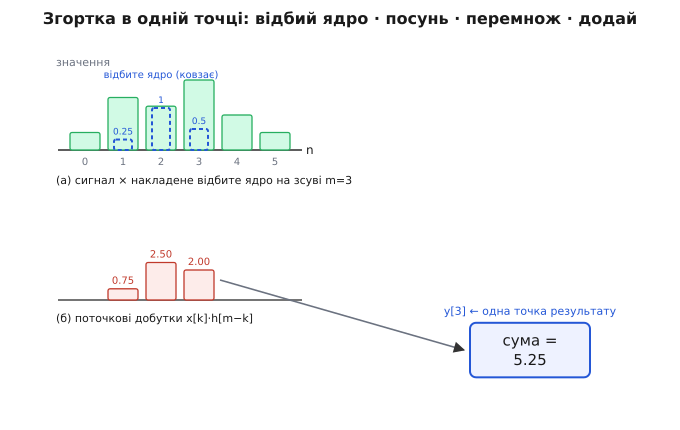
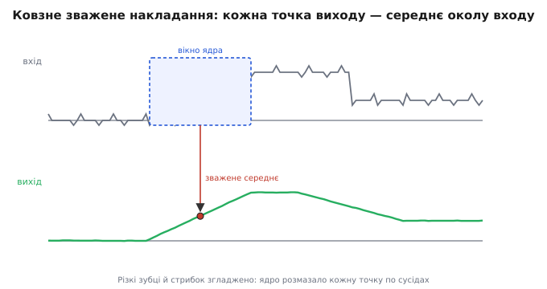
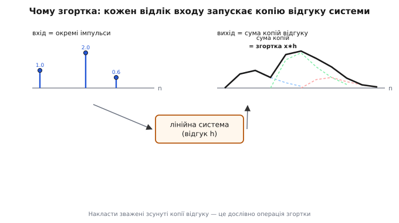
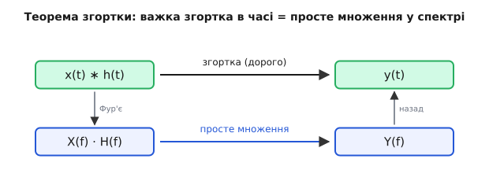

# Згортка

Уявіть просту задачу: давач відстані шумить, і кожен його відлік підстрибує на пару одиниць навколо правди. Хочеться згладити — замінити кожне значення на середнє з кількох сусідніх. Тепер інша задача: ви вдарили по дзвону, і він не змовкає миттєво, а гуде, поволі згасаючи; як звучатимуть **два** удари поспіль, що накладаються один на одного? І ще одна: промінь світла проходить крізь неідеальну лінзу, яка кожну точку трохи розмазує в пляму, — як виглядатиме на знімку ціле зоряне небо?

На перший погляд це три різні світи: статистика, акустика, оптика. Та за всіма трьома стоїть **одна** математична дія. Вона бере дві функції — сигнал і деяке «правило впливу» — і сплітає їх в одну. Зветься ця дія **згорткою** (англ. *convolution*, від лат. *convolvere* — «звивати, скручувати разом»; саме так, бо одну функцію ми ніби накручуємо на іншу). Розберімо її від першопричини: спершу — навіщо вона взагалі природна, тоді — як рахується для чисел і для неперервних функцій, далі — чому без неї не обходиться жодна лінійна система, і нарешті — її напрочуд глибокий зв'язок зі спектром.

## Інтуїція: ковзне зважене накладання

Почнімо з найпростішого — згладжування шуму. Хай маємо ряд відліків і хочемо кожен замінити середнім із трьох: він сам, сусід зліва, сусід справа. Це означає: ковзаємо вздовж сигналу маленьким «віконцем» з трьох комірок, у кожному положенні беремо три накриті значення, усереднюємо — і записуємо результат у центр. Зсунули вікно на крок — повторили. Так народжується нова, згладжена крива.

А тепер придивімось, що саме робить це віконце. Воно множить кожне накрите значення на вагу **⅓** і додає. Ніщо не заважає взяти **інші** ваги: скажімо, центр із вагою 0.5, а сусідів по 0.25 — тоді центральне значення впливає сильніше, і згладжування виходить м'якшим. Цей набір ваг — і є те саме «правило впливу», окрема маленька функція. Її називають **ядром** (англ. *kernel*) згортки. Згортка — це і є **ковзне зважене накладання сигналу й ядра**: у кожному положенні перемнож накриті значення на ваги ядра, додай — отримаєш одну точку результату.


*Згортка в одній точці зсуву. Угорі: стовпчики сигналу (зелені) і накладене на них ядро (синій пунктир) у поточному положенні. Посередині: добутки накритих пар. Унизу: сума цих добутків — одне-єдине число, одна точка виходу. Зсунули ядро на крок — і так само народиться наступна точка.*

Чому ж це накладання таке корисне, що виринає скрізь? Бо воно — машина **локального впливу**. Ядро каже, як кожна точка входу «розтікається» на свій окіл: чи розмазується по сусідах (згладжування), чи залишає по собі згасаючий хвіст (відлуння), чи підкреслює різницю з сусідами (підкреслення країв). Підбираючи форму ядра, ми керуємо тим, **який** саме вплив накладається. А сама механіка — помнож і додай у кожному положенні — лишається тією самою.

> 🔧 **Навіщо це.** Майже все «причісування» сигналів — це згортка з правильно дібраним ядром. Усереднювальне ядро глушить шум; ядро з від'ємними краями навпаки **загострює**; короткий згасальний хвіст імітує відлуння. Змінюєте не код, а лише числа в ядрі — і той самий цикл «помнож-додай» виконує зовсім інший фільтр. Тому згортку варто розуміти як **єдиний** інструмент, а не як купу окремих трюків.

## Чому ядро відбивають

У механіці згортки є одна тонкість, повз яку легко проскочити: перш ніж прикласти ядро, його **відбивають** — перевертають зліва направо. У формулі це видно як `h[m−k]` замість `h[k]`: індекс ядра біжить **назустріч** індексу сигналу. Звідки цей переворот і навіщо він?

Він не примха, а пряма вимога **причинності**. Уявіть ядро як відгук системи на один поштовх: ударили в мить нуль — система відповідає `h[0]` одразу, `h[1]` за крок, `h[2]` за два. Тепер питаємо, який сумарний відгук **зараз**, у мить `m`. До нього додається: поштовх, що стався **щойно** (в мить `m`), своєю «свіжою» частиною `h[0]`; поштовх **кроком раніше** (в мить `m−1`) — уже своєю частиною `h[1]`; поштовх **двома кроками раніше** — частиною `h[2]`. Тобто що **давніший** вхід, то **пізнішу** ділянку ядра він зараз являє. Саме це й записує `h[m−k]`: свіже множиться на початок ядра, давнє — на хвіст. Переворот ставить час у правильний бік.

Якщо цю тонкість прибрати — брати `h[k]` без перевороту — вийде теж корисна дія, **кореляція** (вона лежить в основі [детектора частоти в ДПФ](book:math/dft) і пошуку шаблона в сигналі). Згортка й кореляція — близькі родичі, що відрізняються рівно цим відбиттям ядра. Для **симетричного** ядра (як усереднювальне `[0.25, 0.5, 0.25]`) переворот нічого не міняє, і їх легко сплутати; для несиметричного — різниця суттєва, і плутати їх не можна.

## Дискретна згортка: формула й покроковий приклад

Запишімо ковзне накладання точно. Хай сигнал — масив `x`, ядро — масив `h`. Тоді точка результату з номером `m`:

```
        ┌──
y[m]  =  Σ   x[k] · h[m − k]
        └── k
```

Сума береться по всіх `k`, де обидва множники існують (де вікно ядра накриває сигнал). Прочитати її просто: **зафіксуй зсув m, пройди ядром по сигналу, перемнож накриті пари, додай**. Кожне `m` дає одну точку виходу; перебравши всі `m`, дістанемо всю криву.

Скільки точок буде на виході? Якщо сигнал має `Nx` значень, а ядро — `Nh`, то результат має рівно:

```
Ny = Nx + Nh − 1
```

Чому на `Nh−1` довше за сигнал? Бо ядро «звисає» з обох країв: воно починає накладатися, ще тільки зачепивши перший відлік краєм, і відпускає, аж зійшовши з останнього. Ці «недонакладені» крайові положення й додають хвостики — згортка завжди трохи ширша за вхід.

Тепер порахуймо повністю, на тих самих числах, що й на фігурі вище. Сигнал і ядро:

```
x = [1,  3,  2.5,  4,  2,  1]      (індекси 0…5)
h = [0.5,  1.0,  0.25]             (індекси 0…2)
```

Відбите ядро — `[0.25, 1.0, 0.5]` — ковзаємо по сигналу. У кожному положенні множимо три накриті пари й додаємо:

```
y[0] = 1·0.5                       = 0.5
y[1] = 1·1.0 + 3·0.5              = 2.5
y[2] = 1·0.25 + 3·1.0 + 2.5·0.5  = 4.5
y[3] = 3·0.25 + 2.5·1.0 + 4·0.5  = 5.25   ← положення з фігури
y[4] = 2.5·0.25 + 4·1.0 + 2·0.5  = 5.625
y[5] = 4·0.25 + 2·1.0 + 1·0.5    = 3.5
y[6] = 2·0.25 + 1·1.0            = 1.5
y[7] = 1·0.25                     = 0.25
```

Вийшло `6 + 3 − 1 = 8` точок, як і обіцяла формула довжини. Є й чудова **перевірка**: коли всі числа додатні, сума всього виходу дорівнює добутку сум входу й ядра. Тут `сума x = 13.5`, `сума h = 1.75`, їх добуток `23.625` — і сума всіх `y` теж `23.625`. Збіглося, отже ніде не схибили. Ця рівність — не випадковість: кожне значення сигналу множиться на **всі** ваги ядра по черзі (на різних зсувах), тож сумарний внесок одного відліку `x[k]` дорівнює `x[k]·(сума h)`.

Ось як ця механіка виглядає робочим кодом — короткий цикл «помнож-додай», який і є вся дискретна згортка:

**Згортка масиву сигналу з ядром (C).** Прямий переклад формули `y[m] = Σ x[k]·h[m−k]`:

:::tabs
```c
// x[0..nx-1] — сигнал, h[0..nh-1] — ядро, y[0..nx+nh-2] — результат
void convolve(const float *x, int nx,
              const float *h, int nh,
              float *y)
{
    int ny = nx + nh - 1;
    for (int m = 0; m < ny; m++) {
        float acc = 0.0f;
        for (int k = 0; k < nx; k++) {
            int j = m - k;                 // індекс ядра, біжить назустріч
            if (j >= 0 && j < nh)          // лише там, де ядро накриває сигнал
                acc += x[k] * h[j];        // помнож і додай
        }
        y[m] = acc;
    }
}
```
```python
import numpy as np

# x — сигнал, h — ядро; повертає масив довжини len(x)+len(h)-1
def convolve(x, h):
    x = np.asarray(x, dtype=float)
    h = np.asarray(h, dtype=float)
    ny = len(x) + len(h) - 1
    y = np.zeros(ny)
    for m in range(ny):
        for k in range(len(x)):
            j = m - k                       # індекс ядра, біжить назустріч
            if 0 <= j < len(h):             # лише там, де ядро накриває сигнал
                y[m] += x[k] * h[j]         # помнож і додай
    return y

# на практиці той самий результат дає готова np.convolve(x, h)
```
:::

Два вкладені цикли: зовнішній перебирає зсуви `m`, внутрішній — накопичує суму добутків. Перевірка `j` всередині відсікає ті пари, де ядро звисає за край сигналу, — саме вона й дає правильні хвостики. Десяток рядків — і це повноцінна згортка, без жодної бібліотеки.

## Неперервна згортка: від суми до інтеграла

Для неперервних функцій ідея та сама, лише дискретна сума перетікає в [інтеграл](book:math/integral) — нескінченне додавання нескінченно тонких внесків. Якщо `x(t)` — сигнал, а `h(t)` — ядро, їх згортка `(x ∗ h)(t)` — це функція:

```
              ⌠ +∞
(x ∗ h)(t) =  │   x(τ) · h(t − τ) dτ
              ⌡ −∞
```

Зірочка `∗` — стандартний знак згортки. Читається так само, як дискретна сума, лише дрібніше: змінна `τ` (тау) пробігає всі моменти; у кожному беремо значення сигналу `x(τ)`, множимо на **відбите й зсунуте** ядро `h(t−τ)` і додаємо всі ці добутки інтегралом. Аргумент `t−τ` — той самий переворот, що й `m−k` у дискретному випадку, лише для неперервного часу: ядро відбите (мінус перед `τ`) і зсунуте на `t`.

Картинка лишається фізичною: ядро `h`, відбите дзеркально, ковзає вздовж осі; у кожному положенні `t` рахуємо **площу перекриття** добутку `x(τ)·h(t−τ)` — і ця площа є значенням результату в точці `t`. Там, де ядро накладається на «сильні» ділянки сигналу, площа велика; де на порожні — мала. Згортка просто проводить це відбите ядро крізь увесь сигнал і записує площу перекриття в кожній точці.


*Ковзне зважене накладання дає всю криву результату. Угорі — зашумлений вхід зі стрибком; синє вікно — ядро, що ковзає вздовж нього. Кожна точка виходу (унизу) — зважене середнє того околу входу, який накрило вікно. Дрібні зубці згладжені, різкий стрибок розмитий у плавний схил: ядро розмазало кожну точку по сусідах.*

Видно й важливу річ: **ширина ядра задає силу впливу**. Вузьке ядро накриває малий окіл — згладжує ледь-ледь, зберігаючи деталі. Широке захоплює багато сусідів — глушить шум сильніше, але й розмазує справжні різкі переходи. Це загальний компроміс будь-якого згладжування: чистіше від шуму коштує втрати гостроти. Форма ядра вирішує, де саме на цьому компромісі ви опинитесь.

## Навіщо згортка: серце лінійних систем

Тепер — найглибша причина, чому згортка взагалі всюди. Дуже широкий клас систем у природі й техніці — **лінійні та незмінні в часі**: підсилювач, RC-фільтр, струна, кімната з відлунням, оптична лінза. «Лінійна» означає, що подвоєний вхід дає подвоєний вихід, а сума входів — суму виходів (це [принцип суперпозиції](book:math/linearity)). «Незмінна в часі» — що відгук на поштовх однаковий, коли б той поштовх не стався. Виявляється, **будь-яку** таку систему повністю описує одна-єдина функція — і пов'язує вхід із виходом саме згортка.

Що це за функція? Ударте систему найкоротшим можливим поштовхом — одиничним імпульсом — і запишіть, як вона відповідає. Цей відгук називають **імпульсною характеристикою** (англ. *impulse response*) і позначають `h`. Це паспорт системи: для дзвона — згасальний гуд; для кімнати — розсип відлунь; для лінзи — пляма розмиття точки. Знаючи `h`, ви знаєте про лінійну систему **все**.

Чому ж саме згортка? Бо будь-який вхідний сигнал можна розкласти на **послідовність окремих імпульсів** різної висоти — кожен відлік є таким імпульсом. Система лінійна, тож на кожен із них вона відповідає **масштабованою копією** своєї імпульсної характеристики `h`: вищий відлік — вища копія. А незмінна в часі — тож копія лише **зсувається** туди, де стояв її імпульс, не міняючи форми. Повний вихід — це сума всіх цих зсунутих масштабованих копій `h`, накладених одна на одну. А накласти зважені зсунуті копії — це **дослівно** і є згортка.


*Чому згортка природна для лінійних систем. Зліва — вхід, розкладений на окремі імпульси різної висоти. Кожен, пройшовши систему, породжує масштабовану й зсунуту копію імпульсної характеристики `h` (кольорові пунктири справа). Їх сума (чорна крива) — і є вихід. Накладання зважених зсунутих копій відгуку — це й є операція згортки `x ∗ h`.*

Звідси й уся практична сила: щоб передбачити, як система спотворить **будь-який** сигнал, не треба розв'язувати її рівняння щоразу. Досить один раз виміряти імпульсну характеристику `h` — а далі будь-який вихід дається згорткою `вхід ∗ h`. Запис відлуння реальної зали (її `h`) дозволяє накласти точно те саме відлуння на будь-яку музику. Виміряне розмиття лінзи дозволяє передбачити (а почасти й прибрати) розмиття на знімку. Одна функція `h` плюс згортка — і поведінка лінійної системи передбачена повністю.

> 🔧 **Навіщо це.** Імпульсна характеристика — це **специфікація фільтра одним масивом**. Цифровий фільтр зі скінченною імпульсною характеристикою (FIR) — це буквально масив коефіцієнтів `h`, а його робота — згортка вхідного потоку з цим масивом. Спроєктувати фільтр = підібрати числа в `h`; застосувати = крутити той самий цикл «помнож-додай». Тому згортка — не абстракція, а щоденний робочий інструмент обробки сигналів на будь-якому мікроконтролері.

## Властивості, що роблять згортку зручною

Згортка поводиться напрочуд охайно — майже як звичайне множення, і це не випадково: зв'язок зі справжнім множенням закладено в самій її природі. Три її властивості варто тримати в голові.

**Переставність:** `x ∗ h = h ∗ x`. Байдуже, що вважати сигналом, а що ядром, — результат той самий. У задачі згладжування це означає, що «сигнал крізь ядро» і «ядро крізь сигнал» дають одне й те саме; математично сигнал і ядро рівноправні.

**Сполучність:** `(x ∗ h₁) ∗ h₂ = x ∗ (h₁ ∗ h₂)`. Пропустити сигнал через два фільтри поспіль — те саме, що через один фільтр, заздалегідь склеєний згорткою двох ядер. Звідси практичний висновок: каскад фільтрів можна **згорнути в одне** еквівалентне ядро й рахувати дешевше.

**Одиниця:** є особливе ядро, що нічого не міняє, — одиничний імпульс (одне `1`, решта нулі). Згортка з ним повертає сигнал незмінним: `x ∗ δ = x`. Це нейтральний елемент, як `1` для множення; зсунутий імпульс, до речі, просто **зсуває** сигнал, нічого не спотворюючи. На цих властивостях тримається вся алгебра лінійних фільтрів.

## Зв'язок зі спектром: теорема згортки

Лишилася найкрасивіша частина. Згортка в часі — дія важка: кожна точка результату коштує суми по всьому ядру, а для довгих сигналів і ядер це багато множень. Та є несподіваний обхід через [спектр](book:math/spectrum). Він каже:

```
згортка в часі   ⇄   множення спектрів
x(t) ∗ h(t)      ⇄   X(f) · H(f)
```

Це **теорема згортки**, і вона приголомшлива. Замість повзати ядром по сигналу можна: перевести обидва у [частотну область](book:math/fourier-idea) (узяти їхні спектри `X` і `H`), **просто перемножити** їх частота за частотою — і повернутися назад у час. Громіздке ковзне накладання обертається поточковим множенням.


*Теорема згортки: два шляхи до того самого результату. Прямий (угорі) — згортка в часі, дорога. Обхідний (унизу) — перейти у спектр, перемножити `X(f)·H(f)` поточково (дешево) і повернутися назад. Перетворення Фур'є з'єднує два світи: складна дія в часі стає простою у частоті.*

Чому так? Інтуїція проста, якщо згадати, що таке фільтр у частотній мові. Фільтр діє на кожну частоту окремо: одні пропускає, інші глушить. Його імпульсна характеристика `h` у спектрі — це `H(f)`, **коефіцієнт пропускання на кожній частоті**. Пропустити сигнал крізь фільтр означає: кожну частотну складову сигналу `X(f)` помножити на те, наскільки фільтр її пропускає, `H(f)`. Звідси й `X(f)·H(f)` — звичайне множення на кожній частоті. А те, що в простій частотній мові є множенням, у часовій обертається складною згорткою. Дві мови описують одне явище — лише одна з них тут разюче простіша.

Практична вага цього — величезна. Згортка двох довгих сигналів «у лоб» коштує близько `N²` множень — для великих `N` це непідйомно. Та через спектр її рахують за допомогою [швидкого перетворення Фур'є](book:algorithms/fft) куди дешевше: перевести в спектр, перемножити, перевести назад — і все це масштабується як `N·log N` замість `N²`. Саме так насправді й згортають довгі сигнали в цифровій обробці. Те, що теорія описала як елегантну рівність, інженер використовує як прямий спосіб **прискорити** обчислення — і ця ниточка тягнеться від простого згладжування шуму аж до основ усієї цифрової фільтрації.
