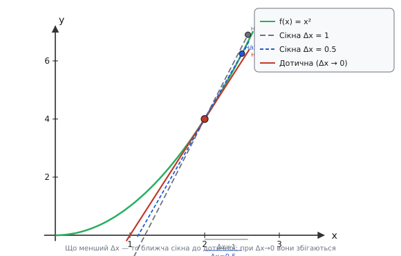

# Похідна: швидкість зміни й нахил у кожній точці

Уявіть: датчик відстані надсилає нові відліки щодесять мілісекунд. Кожне нове значення знаємо одразу — але від нас хочуть не саме значення, а те, **як швидко воно зараз міняється**. Положення відомо; швидкість — ні. І це не лише фізична задача: та сама потреба виникає в хімії (швидкість реакції), електроніці (як швидко росте напруга на конденсаторі), регуляторах (de/dt у D-складовій), економіці, медицині, навігації.

Здавалося б, просто: взяти два сусідні значення й поділити різницю на час між ними. Але це дає **середню** швидкість за проміжок — 50 км/год за дві години поїздки. Спідометр же показує щось інше: швидкість саме зараз, у цю мить, а не за минулий відрізок. Як виміряти швидкість **в одну мить**, якщо за нульовий час нічого не встигає змінитися, і відношення Δx/Δt вироджується в 0/0?

Відповідь — не уникати ділення на дедалі менший проміжок, а **простежити, куди прямує це відношення**, коли проміжок стискається до нуля. Саме це й є похідна (англ. *derivative*, від лат. *derivare* — відводити, виводити одне з іншого). Теорія не оминає 0/0, а обходить його: замість підставити нуль, спостерігає тенденцію. На цій ідеї — границі (лат. *limes* — межа) — тримається весь апарат диференціального числення.

## Середня швидкість зміни: відношення приростів

Позначмо приріст аргументу через Δx (дельта, гр. *Δ* — різниця), а відповідний приріст функції — через Δy = f(x+Δx) − f(x). Тоді **середня швидкість зміни** на проміжку:

```
Δy     f(x + Δx) − f(x)
── = ─────────────────────
Δx            Δx
```

Геометричний сенс простий: це **нахил сікної** (лат. *secans* — та, що розтинає) — прямої, яка з'єднує дві точки графіка: (x, f(x)) та (x+Δx, f(x+Δx)). Що крутіша ця пряма, то більше відношення; що пологіша — то менше.

Чому ж «середня»? Бо на проміжку функція могла стрибати вгору-вниз, а відношення усереднює ці рухи — як поїздка за одним числом ховає весь трафік. Щоб побачити конкретну тенденцію в конкретній точці, треба позбутися довжини проміжку.

Подивімось на прикладі. Нехай f(x) = x², точка x = 2, і ми зменшуємо Δx:

```
Δx = 1.00:  Δy/Δx = (9 − 4) / 1.00  = 5.00
Δx = 0.10:  Δy/Δx = (4.41 − 4) / 0.10 = 4.10
Δx = 0.01:  Δy/Δx = (4.0401 − 4) / 0.01 = 4.01
```

Результат невпинно наближається до 4. Це вже не випадковість — це тенденція, що її треба зафіксувати формально.


*Січна через дві точки параболи повертається разом із другою точкою, що повзе до першої. При Δx→0 вона переходить у дотичну — пряму, що торкається кривої лише в одній точці й має той самий нахил, що й крива там.*

## Границя: стискаємо проміжок до миті

Ключове спостереження: при кожному **ненульовому** Δx відношення Δy/Δx цілком визначене — жодного ділення на нуль. Нас цікавить **тенденція**: куди прямує це відношення, коли Δx стає як завгодно малим, але лишається ненульовим?

Для f(x) = x² відповідь проступає вже в таблиці — 4. А доведемо це так: розкриємо чисельник і скоротимо Δx:

```
Δy     (x + Δx)² − x²     x² + 2x·Δx + Δx² − x²     2x·Δx + Δx²
── = ─────────────────── = ─────────────────────────── = ────────────
Δx           Δx                        Δx                    Δx

   = 2x + Δx
```

Множник Δx у чисельнику й знаменнику скоротився — тепер 0/0 позаду. Залишилося 2x + Δx, і при Δx→0 це прямує до 2x. У точці x=2 — до 4. Саме так «прохід 0/0» відбувається в дійсності: не ділення на нуль, а скорочення перед підстановкою.

Узагальнення цього прийому дає **означення похідної**:

```
          f(x + Δx) − f(x)
f′(x) = lim ─────────────────
        Δx→0       Δx
```

Читається: «границя при Δx, що прямує до нуля, від відношення приростів». Значення, якщо ця границя існує, і є **похідна** функції f у точці x.

Геометрично: коли друга точка повзе до першої вздовж кривої, сікна обертається й у граничному положенні стає **дотичною** (лат. *tangens* — той, що торкається) — єдиною прямою, яка торкається кривої в точці x і має той самий нахил, що й крива там. Похідна — це і є **нахил дотичної**.

Фізично: якщо f(t) — положення тіла в момент часу t, то f′(t) — миттєва швидкість. Те, що показує спідометр (точніше — модуль цього значення при прямолінійному русі), є саме |dx/dt| у кожну мить. Узагальнення: похідна будь-якої величини за часом — її миттєва швидкість зміни.

Межа можливостей: границя існує не завжди. У точці «зламу» функція |x| при x=0 зліва має нахил −1, справа — +1. Немає єдиного нахилу — немає й дотичної, немає й похідної. Похідна існує там, де крива «гладка» в точці, без кутів і розривів.

## Похідна як функція й нотація

Похідна f′(x) — **нова функція**: вона зіставляє кожній точці x нахил кривої f саме там. Для f(x) = x², отримали f′(x) = 2x. Перевірмо: при x = 2 маємо f′(2) = 4 — саме те, до чого прямувала таблиця; при x = 0 маємо f′(0) = 0 — горизонтальна дотична у вершині параболи.

На практиці склалися дві нотації, кожна зі своїм ареалом:

- **Лагранжева** (систематично поширена Жозефом-Луї Лагранжем, «Théorie des fonctions analytiques», 1797; хоча символ, за деякими джерелами, першим вжив Ейлер): **f′(x)** — компактна, зручна для чистої математики й там, де часто пишуть похідні підряд.
- **Лейбніцева** (Готфрід Вільгельм Лейбніц, рукописи 1675 р.; перша публікація — «Nova Methodus...», Acta Eruditorum, 1684): **dy/dx** або **df/dx** — нагадує, що похідна є границею відношення приростів; **d/dx** як оператор диференціювання.

Лейбніцева нотація особливо виграє в інженерії та фізиці: одиниці читаються прямо з запису. Якщо Q — заряд у кулонах, а t — час у секундах, то dQ/dt — у кулонах на секунду, тобто в амперах. Це не просто запис, а підказка про фізичний зміст. Саме тому в рівняннях кіл пишуть i = C·dV/dt (струм через конденсатор — [похідна напруги](topic:math/capacitor-derivative)), а в регуляторах — de/dt як вхід [D-складової](root:embedded/derivative-control).

Другу похідну записують як f″(x) або d²f/dx²: це похідна від f′, тобто швидкість зміни самої швидкості зміни. Якщо x(t) — положення, v = dx/dt — швидкість, то a = dv/dt = d²x/dt² — прискорення. Від першого закону Ньютона до рівнянь руху планет — скрізь стоїть друга похідна.

## Правила диференціювання: звідки беруться

Щоразу брати границю — громіздко. Є правила, що дають похідну майже механічно.

**Степенева:** (xⁿ)′ = n·xⁿ⁻¹. Для x² ми це вже бачили: вийшло 2x. Для x³ той самий прийом із Δ-розкладом дає 3x². Загальний доказ узагальнює цей трюк — скорочення Δx у чисельнику й знаменнику залишає рівно n членів виду xⁿ⁻¹. Правило справджується для будь-якого дійсного n (для нецілого n домен — x > 0, для від'ємних цілих — x ≠ 0).

**Сталий множник і сума:** (c·f)′ = c·f′; (f+g)′ = f′+g′. Ці правила випливають із лінійності границі: якщо розтягти графік функції вдвічі по вертикалі, нахил у кожній точці теж подвоїться. Так само приріст суми = сума приростів — і ця властивість зберігається в границі.

**Стала:** (c)′ = 0. Горизонтальна лінія не нахиляється ніде. Цей тривіальний факт несе не тривіальний наслідок: там, де похідна обертається на нуль, крива переходить від зростання до спадання (або навпаки) — горизонтальна дотична. Це вже заявка на пошук екстремумів.

**Добуток, частка, ланцюгове правило** — три важливі правила для складніших функцій. Особливо корисне ланцюгове: якщо f = g(h(x)), то f′(x) = g′(h(x))·h′(x). Інтуїція: якщо A міняється вдвічі швидше за B, а B — утричі швидше за C, то A міняється вшестеро швидше за C — «швидкості зміни перемножуються» по ланцюжку. Виведення цих правил і детальний розгляд прикладів — за межами базової статті.

**Похідні «цеглинок»:** (sin x)′ = cos x (справедливо при x у радіанах) — це стандартний результат, доведений через формулу різниці кутів і властивості границь; він живе у [похідній синуса](topic:math/sine-derivative). Функція eˣ унікальна: (eˣ)′ = eˣ — вона дорівнює власній похідній; загальний розв'язок f′ = f це C·eˣ, і з точністю до сталого множника eˣ єдиний клас; пов'язано з [логарифмами](topic:math/logarithms) і [рядом Ейлера](topic:math/e-series).

## Миттєва швидкість із сирих відліків: реальний C

**Умова.** Мікроконтролер читає АЦП кожні Δt = 10 мс. Потрібно отримати миттєву швидкість зміни сигналу — наприклад, швидкість руху або тренд тиску — із потоку відліків.

Ідеальна похідна dx/dt недосяжна в залізі: не можна зробити Δt = 0. Замість неї беремо **скінченну різницю** (finite difference):

```
f′(t) ≈ (x[n] − x[n−1]) / Δt      ← backward difference, похибка O(Δt)
```

Точніша альтернатива — центральна різниця:

```
f′(t) ≈ (x[n+1] − x[n−1]) / (2·Δt) ← центральна, похибка O(Δt²)
```

Центральна точніша, бо симетричне розміщення точок гасить непарні члени ряду Тейлора — похибка першого порядку скорочується, залишається квадратична. Але вона потребує «заглянути» на один крок уперед, що не завжди можливо в реальному часі. Проста backward-різниця звичайно достатня для прошивки.

```c
/* dt — час між відліками АЦП у секундах */
static const float dt = 0.010f;   /* 10 мс */
static float  x_prev    = 0.0f;
static bool   have_prev = false;

/* Повертає миттєву швидкість зміни сигналу [одиниць/с] */
float sample_rate_of_change(float x_now)
{
    if (!have_prev) {
        x_prev    = x_now;
        have_prev = true;
        return 0.0f;   /* перший відлік: похідна невідома */
    }
    float dx_dt = (x_now - x_prev) / dt;   /* скінченна різниця ≈ похідна */
    x_prev = x_now;
    return dx_dt;
}
```

**Розбір на числах.** Нехай x_prev = 1.20, x_now = 1.25, dt = 0.010:

```
dx_dt = (1.25 − 1.20) / 0.010
      = 0.05 / 0.010
      = 5.0  одиниць/с
```

Сигнал зростає зі швидкістю 5 одиниць за секунду — це і є наближення до dx/dt в цей момент.

**Підступ: шум підсилюється.** Різниця двох близьких чисел приховує пастку: якщо x_now і x_prev мають однакову абсолютну похибку ±ε, то різниця їхніх похибок сягає ±2ε, а при малому Δt чисельник сам малий — відносна похибка похідної набагато більша, ніж похибка самих відліків. Що менший Δt, то ближче до істинної похідної в математичному сенсі, але то сильніший вплив шуму. Це фундаментальний компроміс чисельного диференціювання.

> 🔧 **Навіщо це.** Диференціювання підсилює шум: оператор d/dt множить амплітуду гармоніки частоти ω на коефіцієнт ∝ ω — тому шум з широкою спектральною смугою після диференціювання набуває великої відносної ваги. Саме тому D-складову [регулятора](root:embedded/derivative-control) тримають скромною і зазвичай фільтрують сигнал перед диференціюванням — наприклад, [згорткою](topic:math/convolution) з вікном згладжування.

## Знак і нуль похідної: куди йде функція

Знак похідної прямо розповідає про поведінку функції. Якщо f′(x) > 0, нахил дотичної спрямований угору — функція **зростає** у цій точці; якщо f′(x) < 0 — **спадає**; якщо f′(x) = 0 — дотична горизонтальна, функція «зупинилася» на мить.

Точки, де f′(x) = 0, — кандидати на **максимум або мінімум**. Вершина параболи x² — у x=0, де f′=0; пік сигналу — там, де тренд змінює знак із «+» на «−». Знак похідної до й після нуля розповідає, що саме це за точка: якщо зліва f′>0 і справа f′<0, функція перейшла від зростання до спадання — це максимум. Детально — у темі [екстремумів](topic:math/extrema): там і другий критерій (через f″), і практика пошуку оптимуму.

Де похідна дорівнює нулю, там і знаходять оптимум у тисячах задач — від піку потужності транзистора до найкоротшого шляху та моменту перемикання в алгоритмі. Прирівнювання похідної до нуля — це і є математична мова слова «оптимальний».

Але похідна — лише половина числення. Вона вимірює **миттєву зміну**; зворотна дія — відновити з похідної саму функцію, накопичити зміни на проміжку — це [інтеграл](topic:math/integral). Похідна й інтеграл пов'язані основною теоремою числення: вони обернені одне до одного — як множення й ділення, тільки для функцій.
