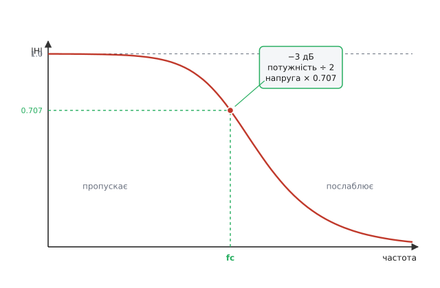
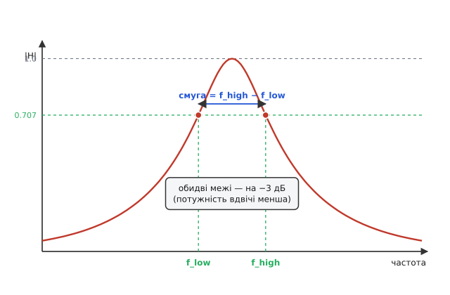

# Точка половинної потужності

Налаштовуючи фільтр чи розглядаючи характеристику підсилювача, раз у раз натрапляєш на дивну межу: «−3 дБ». Її називають частотою зрізу, краєм смуги, точкою спаду — і чомусь саме на ній проводять кордон між тим, що пристрій пропускає, і тим, що глушить. Дивина в тому, що −3 дБ звучить як майже непомітне послаблення: всього три децибели з умовної сотні. А насправді в цій точці сигнал слабшає рівно вдвічі за потужністю. Звідки взялося це число, чому саме половина і чому половина потужності відповідає аж 70 відсоткам за напругою, а не п'ятдесяти, — усе це випливає з однієї простої причини, варто лише простежити її до кінця.

Корінь усього — у тому, що **потужність залежить не від самої величини сигналу, а від її квадрата**. Це не домовленість і не зручність запису; це фізика того, як сигнал віддає енергію. Якщо тримати цей факт у голові, усе інше — половина, корінь із двох, число −3 — складеться саме собою.

## Чому потужність — це квадрат

Візьмімо найпростіше: напруга U прикладена до опору R. Через опір тече струм, і він гріє опір — у цьому й полягає виділення потужності. Закон Ома каже, що струм пропорційний напрузі: `I = U / R`. А потужність — це добуток напруги на струм, бо кожен кулон заряду, проходячи під напругою U, віддає енергію, і що більший потік зарядів (струм), то більше енергії за секунду:

```
P = U · I
```

Підставмо сюди струм із закону Ома, щоб лишити саму напругу:

```
P = U · I = U · (U / R) = U² / R
```

Ось воно: потужність пропорційна **квадрату** напруги. Не самій напрузі, а її другому степеню. Те саме вийде, якщо лишити струм і прибрати напругу (`U = I · R`, тому `P = I² · R`): потужність — квадрат струму. Який бік не візьми, амплітуда сигналу входить у потужність у квадраті.

Ця квадратична залежність — не примха електрики. Кінетична енергія тіла теж іде як квадрат швидкості (`mv²/2`), енергія пружини — як квадрат розтягу, енергія хвилі — як квадрат амплітуди. Скрізь, де щось накопичує чи переносить енергію, ця енергія росте з квадратом «розмаху». Тому все, що ми зараз виведемо для напруги на опорі, тримається й для звукового тиску, і для механічних коливань, і для будь-якого сигналу, чия потужність іде як квадрат амплітуди.

> 🔧 **Навіщо це.** У розробці ця квадратичність — джерело найпоширенішої похибки на око. Коли індикатор показує, що сигнал «упав наполовину» за рівнем (за напругою), потужність насправді впала вже до чверті, бо `(1/2)² = 1/4`. І навпаки: щоб віддати вдвічі більше потужності в навантаження, напругу треба підняти не вдвічі, а лише в √2 ≈ 1.41 раза. Плутати рівень із потужністю — означає помилятися рівно в цей квадрат; саме тому межі фільтрів і запас підсилення завжди звіряють у потужності, а не «на вигляд».

## Половина потужності означає 1/√2 за напругою

Тепер головне питання. Нехай сигнал має якусь найбільшу потужність — назвімо її P₀ (наприклад, у смузі пропускання фільтр віддає максимум). Запитаймо: якою стане напруга, коли потужність впаде рівно вдвічі, до P₀/2?

Потужність іде як квадрат напруги, тож відношення потужностей — це квадрат відношення напруг. Запишімо це прямо. Якщо в максимумі напруга U₀ дає потужність `P₀ = U₀²/R`, а в шуканій точці напруга U дає `P = U²/R`, то поділивши одне на одне, опір скорочується:

```
P / P₀ = (U² / R) / (U₀² / R) = U² / U₀² = (U / U₀)²
```

Відношення потужностей дорівнює квадрату відношення напруг — це той самий квадрат, лише записаний для двох станів одразу. Тепер підставмо нашу умову «потужність впала вдвічі», тобто `P / P₀ = 1/2`:

```
(U / U₀)² = 1/2
```

Щоб дістати саме відношення напруг, візьмімо квадратний корінь з обох боків:

```
U / U₀ = √(1/2) = 1/√2 ≈ 0.707
```

Ось і відповідь, повна несподіванка для ока. **Половина потужності — це не половина напруги, а 1/√2 ≈ 0.707 від неї.** Сигнал за рівнем падає всього на ~29 %, а потужність при цьому вже зрізана навпіл. Причина — той самий квадрат: напруга встигає опуститися лише до 0.707, але 0.707 у квадраті — це вже 0.5. Перевірмо просто на числі:

```
0.707² = 0.4998… ≈ 0.5
```

Точне значення кореня з половини — 0.70710678…, а його квадрат дає рівно 1/2. Тому 0.707 — не наближене «майже пів», а точний поріг половинної потужності за амплітудою. Запам'ятовується він легко: 1/√2 — те саме, що √2/2, те саме, що косинус 45°. Усюди, де мова про половину потужності, спливе саме це число.

Звідси й двоїстість назв однієї точки. «Точка половинної потужності» дивиться на енергію — там її рівно 50 %. «Точка 0.707» дивиться на амплітуду — там її 70.7 %. Це **одна** точка, описана з двох боків квадратичного зв'язку; плутанина виникає лише тоді, коли забувають, що потужність і амплітуда — різні величини, зв'язані квадратом.

## Звідки береться рівно −3 децибели

Лишилося пояснити третю назву тієї ж точки — найзагадковіше «−3 дБ». Децибел — це спосіб міряти відношення двох потужностей через [логарифм](topic:math/logarithms), а не через пряму різницю. Причина проста: коли величини охоплюють мільйони разів, лінійна різниця стає незручною, а логарифм перетворює множення на додавання й стискає неосяжний діапазон у кілька десятків поділок; крок «×10 за потужністю» дає сталий приріст незалежно від того, де він на шкалі. Рівень у децибелах означають саме як десятковий логарифм відношення потужностей, помножений на десять:

```
рівень (дБ) = 10 · lg(P / P₀)
```

Підставмо в цю формулу нашу половину потужності, `P / P₀ = 1/2`, і подивімось, що вийде:

```
рівень = 10 · lg(1/2)
       = 10 · (−0.30103)
       = −3.0103 дБ
       ≈ −3 дБ
```

Ось звідки рівно −3. Усе тримається на одному значенні десяткового логарифма: `lg 2 = 0.30103…`, тому `lg(1/2) = −lg 2 = −0.30103`. Помножене на десять, воно дає −3.0103 — на практиці завжди округлюють до −3. Тобто «−3 дБ» — це просто інженерна назва для «потужність поділена на два». Знак мінус каже, що сигнал послаблено; трійка — що послаблено саме вдвічі за потужністю. Якби потужність впала вчетверо, це було б `10·lg(1/4) = −6 дБ`; удесятеро — рівно −10 дБ. Кожне ділення потужності навпіл забирає 3 децибели, бо кожне додає −0.301 під логарифмом.

Тепер найкрасивіше. Подивімось на ту саму точку очима **амплітуди**. Для амплітуд (напруги, струму, тиску) децибел означають з множником **20**, а не 10:

```
рівень (дБ) = 20 · lg(U / U₀)
```

Звідки взялося 20 замість 10 — теж із квадрата, і це не випадковий збіг. Потужність іде як U², а логарифм квадрата — це подвоєний логарифм (`lg(U²) = 2·lg U`, бо логарифм степеня виносить показник наперед). Підставивши `P/P₀ = (U/U₀)²` у формулу потужності, дістаємо `10·lg((U/U₀)²) = 10·2·lg(U/U₀) = 20·lg(U/U₀)`. Двадцятка для амплітуд — це десятка для потужності, помножена на квадрат у показнику. Перевірмо, що тоді дасть наша точка 1/√2:

```
рівень = 20 · lg(1/√2)
       = 20 · (−0.150515)
       = −3.0103 дБ
       ≈ −3 дБ
```

**Те саме −3 дБ.** І це не диво, а саме та причина, заради якої децибел означили з множником 20 для амплітуд: щоб одна фізична точка давала **одне** число дБ, з якого боку на неї не дивись. Половина потужності й 0.707 амплітуди — це одна точка, тому обидві мусять давати −3 дБ. Якби для амплітуд лишили множник 10, числа б розійшлися й децибел утратив би сенс єдиної шкали. Двадцятка зшиває обидва погляди: `10·lg(½) = 20·lg(1/√2) = −3` дБ.


*Коефіцієнт передачі за напругою падає плавно; точка −3 дБ — там, де він проходить через 0.707, тобто де потужність на виході вже вдвічі менша за максимум. Ліворуч від неї фільтр майже не чіпає сигнал, праворуч — дедалі сильніше глушить. Зверніть увагу: за напругою це лише ~70 %, а за потужністю — вже рівно половина.*

## Смуга пропускання: межа, проведена по −3 дБ

Тепер видно, чому саме цю точку взяли за кордон. Будь-який реальний фільтр, резонатор чи підсилювач не має різкого краю: його характеристика спадає плавно, і питання «де закінчується робоча область» не має очевидної відповіді. Потрібна **домовленість** — рівень, нижче за який сигнал уважаємо вже непридатним. І природний вибір тут — половина потужності: точка, де пристрій віддає рівно вдвічі менше енергії, ніж у найкращій своїй смузі. Вище за неї — «пропускає», нижче — «послаблює». Цей рівень і називають краєм смуги.

Звідси й точне означення. **Смуга пропускання** (англ. *bandwidth*, дослівно «ширина смуги») — це проміжок частот, на якому потужність сигналу не падає нижче за половину максимуму, тобто де характеристика тримається вище за рівень −3 дБ. У фільтра нижніх частот цей проміжок іде від нуля до однієї частоти зрізу f_c — тієї єдиної точки, де крива вперше торкається −3 дБ; смуга дорівнює просто f_c. У смугового ж фільтра чи резонатора край є з обох боків: характеристика підіймається, проходить через верхню точку й знову спадає, перетинаючи рівень 0.707 двічі — на нижній частоті f_н і на верхній f_в. Ширина смуги — це відстань між цими двома точками половинної потужності:

```
смуга = f_в − f_н
```


*Обидві межі смуги проведено на одному рівні — там, де потужність удвічі менша за максимальну в центрі. Усе, що між ними, вважають смугою пропускання; усе, що поза нею, — придушеним. Та сама точка половинної потужності працює кордоном з обох боків.*

Чому домовилися саме про половину, а не, скажімо, про десяту частину? Бо половина потужності — це межа, за якою сигнал помітно «просідає» на тлі того, що поряд, але ще не зникає; це природна границя корисної області. До того ж −3 дБ зручне числом: один поділ навпіл, один крок логарифма. Якби взяли інший поріг, край смуги довелося б щоразу обумовлювати; домовившись про −3 дБ, інженери дістали єдину мову, у якій «смуга» означає те саме для фільтра, антени, підсилювача й каналу зв'язку.

Ця ж точка веде й до глибшої характеристики — добротності. Що вужча смуга навколо резонансу, то «гостріший» пристрій, і відношення центральної частоти до ширини смуги (`Q = f₀ / смуга`) називають добротністю. Але і вона міряється тими самими двома точками −3 дБ: спершу знаходять, де потужність падає вдвічі, а тоді беруть відстань між цими краями. Усе зводиться до того самого порога половинної потужності.

## Приклад: знайти частоту зрізу RC-фільтра

**Умова.** Найпростіший фільтр нижніх частот — резистор R послідовно з конденсатором C, сигнал знімають із конденсатора. Його коефіцієнт передачі за напругою дорівнює `1/√(1 + (f/f_c)²)`, а частота зрізу — `f_c = 1 / (2π·R·C)`. Мікроконтролер має порахувати цю частоту для заданих R і C, щоб знати, де проходить межа −3 дБ.

На частоті зрізу `f = f_c` знаменник стає `√(1 + 1) = √2`, тож коефіцієнт передачі дорівнює `1/√2 ≈ 0.707` — рівно точка половинної потужності, як і має бути. Тому достатньо порахувати f_c за формулою, і ми одразу знаємо, де лежить −3 дБ.

:::tabs
```cpp
#include <cmath>

/* Частота зрізу (−3 дБ) RC-фільтра нижніх частот, Гц.
   R — опір в омах, C — ємність у фарадах. */
float rc_cutoff_hz(float r_ohm, float c_farad)
{
    if (r_ohm <= 0.0f || c_farad <= 0.0f) {
        return 0.0f;            /* некоректні дані — межі немає */
    }
    return 1.0f / (2.0f * static_cast<float>(M_PI) * r_ohm * c_farad);
}
```
```python
import math


def rc_cutoff_hz(r_ohm: float, c_farad: float) -> float:
    """Частота зрізу (−3 дБ) RC-фільтра нижніх частот, Гц.
    R — опір в омах, C — ємність у фарадах."""
    if r_ohm <= 0.0 or c_farad <= 0.0:
        return 0.0  # некоректні дані — межі немає
    return 1.0 / (2.0 * math.pi * r_ohm * c_farad)
```
:::

**Розбір на числах.** Візьмімо типові R = 1.6 кОм і C = 100 нФ = 100·10⁻⁹ Ф:

```
f_c = 1 / (2π · 1600 · 100·10⁻⁹)
    = 1 / (2π · 1.6·10⁻⁴)
    = 1 / (1.00531·10⁻³)
    ≈ 994.7 Гц
```

Отже, приблизно на 995 Гц цей фільтр віддає половину потужності: вище неї він дедалі сильніше глушить, нижче — пропускає майже без втрат. Якщо тепер перевірити коефіцієнт передачі рівно на цій частоті, дістанемо `1/√(1+1) = 0.707`, тобто −3 дБ — підтвердження, що формула частоти зрізу й рівень половинної потужності описують ту саму точку. Подвоївши ємність, ми вдвічі знизимо частоту зрізу (межа з'їде до ~497 Гц), бо f_c обернено пропорційна добутку R·C; це і є практичний важіль, яким посувають край смуги.

## Що варто тримати в голові

Усе зводиться до одного: **потужність — це квадрат амплітуди**, і три на перший погляд різні величини описують одну й ту саму точку. Половина потужності, 0.707 (тобто 1/√2) за напругою й −3 дБ — це три імені для межі, де енергія на виході спадає вдвічі. Половина береться з домовленості про корисну область; корінь із двох — з квадратичного зв'язку потужності й амплітуди; трійка — зі значення `lg 2 = 0.301`, помноженого на десять. А множник 20 у децибелах для амплітуд узято навмисне таким, щоб обидва погляди — на потужність і на напругу — давали те саме −3 дБ.

Через цю точку проводять край смуги пропускання: у фільтра нижніх частот — одну частоту зрізу, у смугового — дві межі, відстань між якими і є смуга. Зрозумівши, чому 0.707 — це насправді половина, перестаєш дивуватися, що «лише три децибели» означають утрату половини всієї потужності.
