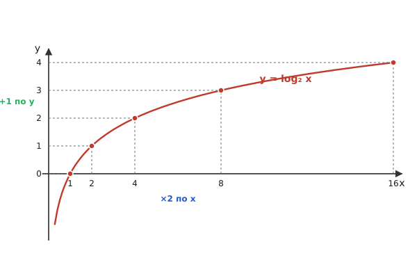
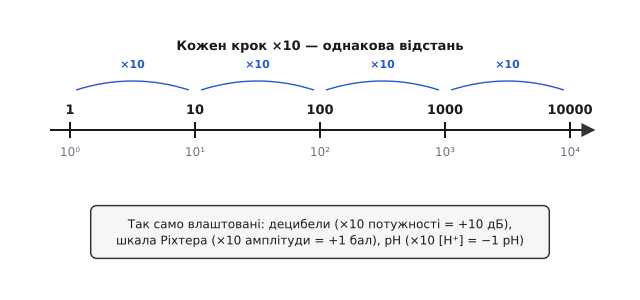

# Логарифми

Помножити 2 на себе кілька разів легко: 2, 4, 8, 16, 32. А зворотне питання вже хитріше: скільки разів треба перемножити двійку, щоб дістати 1000? Десять разів дає 1024 — майже, але трохи забагато. Точна відповідь лежить десь між дев'ятьма й десятьма, і знайти її «в лоб» не вийде: жодним перебором цілих степенів у число 1000 не влучити рівно. Саме на це питання — «у який степінь треба піднести задане число, щоб отримати інше» — і відповідає логарифм.

Питання здається штучним, поки не помітиш, що воно перевертає одну з найкорисніших дій у математиці. Піднесення до степеня бере основу й показник і видає результат: 2 у степені 10 = 1024. Логарифм іде назад: має основу й результат, шукає показник. Це така сама пара, як додавання й віднімання чи множення й ділення — друга дія розв'язує те, що зав'язала перша. І як віднімання не «новий звір», а просто інша сторона додавання, так і логарифм — інша сторона степеня.

Слово склав шотландець Джон Непер (John Napier) у 1614 році, з двох грецьких коренів: *λόγος* (logos — відношення, лад, число-міра) і *ἀριθμός* (arithmos — число). Дослівно — «число відношення»: показник, що зв'язує члени геометричної прогресії (де кожен наступний у стільки ж разів більший) з членами арифметичної (де кожен наступний на стільки ж більший). Ця назва вже містить головну ідею, заради якої логарифм і з'явився.

## Навіщо він виник: множення стає додаванням

Уявіть астронома початку XVII століття. Щоб обчислити положення планети, він щодня перемножує багатоцифрові числа — синуси, косинуси, відстані. Множення стовпчиком двох семизначних чисел — це десятки дрібних множень і додавань, і кожне з них — нагода помилитися. Праці на місяці, а одна описка псує весь результат.

Непер шукав спосіб **замінити важке множення на легке додавання**. Додавати числа люди вміють швидко й без помилок; множити — повільно й з ризиком. І логарифм дає саме такий обмін, бо переводить мову степенів у мову показників, а в показниках множення справді обертається додаванням.

Подивімось, звідки це береться, на степенях двійки. Запишемо їх поряд із показниками:

```
2¹ = 2     2² = 4     2³ = 8     2⁴ = 16     2⁵ = 32     2⁶ = 64
```

Тепер помножимо 8 на 4. У верхньому рядку це 8 × 4 = 32. А в нижньому — показники 3 і 2, і 3 + 2 = 5, а 2⁵ = 32. Збіглося не випадково: коли множимо степені однієї основи, показники **додаються** — це базове правило `aᵐ · aⁿ = aᵐ⁺ⁿ`, бо помножити «a само на себе m разів» на «a само на себе n разів» означає взяти a множником m + n разів. Логарифм — це і є той показник. Отже, якщо вміти швидко переходити «число → його показник» і назад, важке множення зводиться до легкого додавання показників.

Саме так працювали логарифмічні таблиці три з половиною століття. Щоб перемножити A на B: знаходиш у таблиці log A і log B, додаєш їх, а тоді в зворотній таблиці шукаєш число, чий логарифм дорівнює цій сумі. Три погляди в таблицю й одне додавання замість многоцифрового множення. Інженери носили цей принцип у кишені у вигляді логарифмічної лінійки — двох шкал, що ковзають одна вздовж одної; зсунути одну шкалу на довжину log B означає механічно додати показники, і навпроти потрібного числа стоїть готовий добуток. До появи кишенькових калькуляторів у 1970-х лінійка була головним інструментом інженера.

## Логарифм як обернення степеня

Дамо точне означення, спираючись на цю інтуїцію. Зафіксуємо **основу** b (додатне число, не рівне одиниці). Тоді логарифм числа x за основою b — це показник, у який треба піднести b, щоб отримати x:

```
logᵦ x = y    ⇔    bʸ = x
```

Стрілка в обидва боки (⇔) означає, що це два записи одного й того самого факту. «Логарифм 1000 за основою 10 дорівнює трьом» і «10 у кубі — це 1000» — одне твердження, сказане з різних кінців. Логарифм просто питає степінь, який інакше стоїть на видноті.

З цього означення одразу випливають дві опорні точки, які варто тримати в голові. По-перше, `logᵦ 1 = 0` для будь-якої основи: щоб дістати одиницю, основу треба піднести в нульовий степінь (`b⁰ = 1` завжди). По-друге, `logᵦ b = 1`: основа в першому степені — це вона сама. Між цими двома точками логарифм і розгортається.

Чому основа не може дорівнювати одиниці? Бо 1 у будь-якому степені — це знову 1, і рівняння `1ʸ = x` не має розв'язку для жодного x ≠ 1. Одиниця не вміє «дорости» до інших чисел — тому й логарифма за основою 1 не існує. І чому x мусить бути додатним? Бо додатна основа в будь-якому дійсному степені дає лише додатний результат: `2ʸ` ніколи не стане нулем чи від'ємним, хоч як малий чи великий y. Тому логарифм визначений тільки для x > 0 — від'ємних чисел і нуля для нього не існує.

Подивімось, як логарифм поводиться, якщо вести x угору, множачи його на основу. Візьмемо основу 2 й простежимо: x = 1, 2, 4, 8, 16. Аргумент щоразу **подвоюється** — це множення. А логарифм при цьому дає 0, 1, 2, 3, 4 — росте **на одиницю** щокроку, це додавання. Ось воно, серце логарифма, видиме на очах: рівномірні кроки множення на вході перетворюються на рівномірні кроки додавання на виході.


*Логарифм проходить через точку (1, 0) — будь-який логарифм дорівнює нулю в одиниці — і далі росте дедалі повільніше. Помітьте темп: щоб логарифм виріс на сталу величину, аргумент щоразу треба помножити на ту саму величину. Множення на осі x обертається додаванням на осі y.*

Графік показує і другу важливу рису: логарифм **росте, але дедалі повільніше**. Щоб додати до нього ще одиницю, аргумент доводиться знову подвоїти — а подвоєння великого числа дає величезний приріст по x задля скромного кроку по y. Між 1 і 2 логарифм набирає цілу одиницю; щоб набрати наступну, треба дійти аж до 4; наступну — до 8. Ця сповільнена хода — не вада, а саме та властивість, заради якої логарифм незамінний там, де треба приборкати числа, що міняються в мільйони разів.

## Властивості й чому вони саме такі

Уся сила логарифма тримається на трьох тотожностях. Вони не аксіоми — кожна прямо випливає з правил степенів, бо логарифм і є показник степеня. Розберімо кожну від першопричини.

**Логарифм добутку — сума логарифмів.**

```
logᵦ(x · y) = logᵦ x + logᵦ y
```

Чому? Позначмо m = logᵦ x і n = logᵦ y. За означенням це значить `bᵐ = x` і `bⁿ = y`. Перемножимо: `x · y = bᵐ · bⁿ = bᵐ⁺ⁿ`. Але запис `x · y = bᵐ⁺ⁿ` за означенням логарифма й каже, що `logᵦ(x · y) = m + n`. Підставляємо m і n назад — і маємо суму. Все правило народжується з одного факту, що показники при множенні додаються; логарифм лише читає цей факт уголос. Саме ця тотожність і перетворювала множення на додавання в таблицях.

**Логарифм частки — різниця логарифмів.**

```
logᵦ(x / y) = logᵦ x − logᵦ y
```

Та сама логіка з діленням: `x / y = bᵐ / bⁿ = bᵐ⁻ⁿ`, бо при діленні степенів показники віднімаються. Звідси `logᵦ(x / y) = m − n`. Ділення обертається відніманням — друга половина тієї ж вигоди.

**Логарифм степеня — показник попереду.**

```
logᵦ(xᵏ) = k · logᵦ x
```

Тут джерело — правило `(bᵐ)ᵏ = bᵐᵏ` (степінь у степені перемножує показники). Якщо `x = bᵐ`, то `xᵏ = (bᵐ)ᵏ = bᵐᵏ`, а отже `logᵦ(xᵏ) = m·k = k · logᵦ x`. Це правило ще цінніше за перші два: воно перетворює **піднесення до степеня на множення**, а добування кореня (степінь 1/k) — на ділення. Обчислити сімнадцятий корінь із числа на папері майже неможливо; через логарифм це стає діленням логарифма на 17 і одним зворотним переходом.

Зверніть увагу на спільну схему всіх трьох: логарифм **знижує дію на щабель**. Множення стає додаванням, ділення — відніманням, піднесення до степеня — множенням, корінь — діленням. Кожна операція спрощується рівно на одну сходинку. Через це логарифм історично й був не теорією, а робочим інструментом обчислення.

З цих правил легко вивести й **перехід між основами**. Іноді треба логарифм за основою, якої немає в таблиці чи в калькуляторі. Будь-який логарифм виражається через логарифми за іншою основою:

```
logᵦ x = (logₐ x) / (logₐ b)
```

Чому так? Нехай `y = logᵦ x`, тобто `bʸ = x`. Візьмемо логарифм за основою a від обох боків: `logₐ(bʸ) = logₐ x`. Ліворуч за правилом степеня показник виходить уперед: `y · logₐ b = logₐ x`. Лишається поділити — і дістаємо формулу. Практичний наслідок: маючи в калькуляторі лише натуральний чи десятковий логарифм, можна порахувати логарифм за будь-якою основою. Наприклад, `log₂ 1000 = (lg 1000) / (lg 2) = 3 / 0.30103 ≈ 9.966` — той самий «майже десять разів», з якого ми почали, тепер уже точно.

## Дві важливі основи: десяткова і натуральна

Основою може бути будь-яке додатне число (крім 1), але дві з них трапляються незрівнянно частіше за решту.

**Десятковий логарифм** (основа 10) пишуть `lg x` або просто `log x`. Він зручний, бо ми рахуємо в десятковій системі: `lg 10 = 1`, `lg 100 = 2`, `lg 1000 = 3` — десятковий логарифм просто лічить нулі, точніше, **порядок величини** числа. Для будь-якого числа його ціла частина каже, скільки в ньому розрядів: у 47 000 логарифм трохи більший за 4, бо це п'ятирозрядне число між 10⁴ і 10⁵. Саме за це десятковий логарифм люблять там, де величини охоплюють багато порядків. Перехід до основи 10 запропонував англієць Генрі Бріґґс (Henry Briggs), який після зустрічі з Непером переробив таблиці на цю зручну основу й видав їх 1624 року; десяткові логарифми досі звуть бріґґсовими.

**Натуральний логарифм** має основу e ≈ 2.71828… і власний запис `ln x` (від лат. *logarithmus naturalis*). Основа виглядає дивною — нерівне, нескінченне число замість охайної десятки. Чому ж саме воно «натуральне»? Бо e з'являється само собою скрізь, де щось росте чи спадає пропорційно до власної величини: відсотки на відсотки, розряд конденсатора, розпад радіоактивного ядра, остигання чаю. У всіх цих процесів швидкість зміни в кожну мить пропорційна тому, що є зараз, — і математика такого росту неминуче приводить до e.

Найпростіше відчути e на складних відсотках. Покладімо 1 гривню під 100 % річних. За рік нарахують ще гривню — буде 2. А якщо нараховувати піврічними частинами, по 50 %? Тоді 1 → 1.5 → 1.5 × 1.5 = 2.25 — уже більше, бо на друге півріччя відсотки йдуть і на накопичені. Поквартально дає 2.44, щомісяця — 2.61, щодня — близько 2.71. Що дрібніші проміжки нарахування, то ближче річний підсумок до певної межі — і ця межа і є e. Число e — це гранична вигода неперервного, миттєвого нарахування на саме себе. Саме тому показникова функція з основою e й натуральний логарифм — рідна мова всякого неперервного росту; докладніше це число розкриває [ряд Ейлера](topic:math/e-series).

Натуральний логарифм невіддільний від похідної. Функція eˣ унікальна тим, що дорівнює власній [похідній](topic:math/derivative): швидкість її зростання в кожній точці дорівнює самому її значенню. А похідна `ln x` — це рівно `1/x`. Через цей простий вигляд `ln` природно виникає всюди в аналізі, навіть там, де числа спершу нічим не нагадують про відсотки чи ріст. Першими на цей зв'язок натрапили в середині XVII століття, рахуючи площу під гіперболою y = 1/x: фламандець Ґреґуар де Сен-Вінсент (Grégoire de Saint-Vincent) і його учень помітили, що ця площа поводиться як логарифм, а сам термін «натуральний логарифм» увів Ніколас Меркатор 1668 року. Символ e й більшу частину сучасного апарату дав уже швейцарець Леонард Ейлер (Leonhard Euler) у XVIII столітті.

Перейти між цими логарифмами легко: за формулою заміни основи `ln x = lg x / lg e = lg x · 2.302585…`, тобто натуральний і десятковий логарифми всюди відрізняються лише сталим множником. Усі логарифми — той самий графік, лише по-різному вертикально розтягнутий; форма й усі властивості в них спільні.

## Де логарифм працює: коли числа не вміщаються

Окрема велика причина, чому логарифм усюди, — він **стискає масштаб**. Коли величина міняється не на відсотки, а в тисячі й мільйони разів, лінійна вісь стає безпорадною: на ній або не видно дрібного, або не вміщається велике. Логарифмічна вісь кладе рівні **відношення** на рівні відстані, і неосяжний діапазон стає осяжним графіком.


*На звичайній лінійці число 10000 стояло б у тисячу разів далі за 10, і дрібні значення злилися б біля нуля. На логарифмічній шкалі кожне множення на 10 — однаковий крок, тож вісь однаково добре показує і одиниці, і десятки тисяч. На цьому принципі збудовані всі шкали, де важливе саме відношення величин.*

Найвідоміший приклад — **децибели** в техніці звуку та зв'язку. Людське вухо сприймає гучність не за абсолютною різницею, а за відношенням потужностей: подвоєння потужності звучить як однаковий приріст, чи то від тихого до трохи гучнішого, чи від гучного до ще гучнішого. Тому гучність природно міряти логарифмом відношення: `рівень у дБ = 10 · lg(P / P₀)`, де P₀ — опорна потужність. Множення потужності на 10 додає рівно 10 дБ; діапазон від шепоту до реактивного двигуна — це мільярди разів за потужністю, але всього близько 120 дБ за шкалою. Сам термін «бел» названо на честь Александера Ґрейама Белла, а одиницю ввели в лабораторіях його телефонної компанії у 1920-х. На цій же логіці стоїть і [точка -3 дБ](topic:math/half-power) — межа смуги фільтра, де потужність падає вдвічі.

Так само влаштовані й інші відомі шкали. **Шкала Ріхтера** для землетрусів логарифмічна за основою 10: магнітуда на одиницю більша означає вдесятеро більшу амплітуду коливань ґрунту (її запропонував 1935 року американець Чарльз Ріхтер разом із Бено Ґутенберґом). **Шкала pH** у хімії — це `pH = −lg[H⁺]`, від'ємний десятковий логарифм концентрації йонів водню; крок на одиницю pH означає десятикратну зміну кислотності (її ввів данець Сьорен Сьоренсен 1909 року). У всіх трьох випадках логарифм робить те саме: бере величину, що змінюється на багато порядків, і вкладає її в кілька зручних поділок.

Логарифм оселився й у самій теорії обчислень. Коли кажуть, що пошук у відсортованому масиві коштує `log₂ n` кроків, ідеться про те саме обернення степеня: кожен крок двійкового пошуку відкидає половину даних, тож число кроків — це скільки разів n можна поділити навпіл до одиниці, тобто `log₂ n`. У масиві з мільярда елементів це лише близько тридцяти кроків, бо `2³⁰ ≈ 10⁹`. Саме логарифмічна, а не лінійна залежність робить такі алгоритми придатними для величезних обсягів даних; де похідна шукає [екстремуми](topic:math/extrema), там логарифм оцінює вартість.

> 🔧 **Навіщо це.** У прошивці логарифм найчастіше потрібен, щоб показати величину з широким діапазоном на вузькому індикаторі або привести її до людського відчуття. Рівень сигналу від мікрофона, освітленість, потужність радіоканалу міняються в тисячі разів — лінійна смужка-індикатор тут марна: вона або впирається в максимум, або не ворушиться на дрібному. Переведення в децибели (`10·lg`) стискає весь діапазон у кілька десятків поділок, рівномірних для вуха й ока. Та сама причина — чому регулятори гучності й яскравості роблять логарифмічними: рівні кроки користувача дають рівні **відчутні** зміни, а не рівні зміни абсолютної величини.

## Логарифм рівня сигналу в децибелах: реальний C

**Умова.** Мікроконтролер виміряв потужність сигналу P (у тих самих одиницях, що й опорна P₀) і має показати рівень у децибелах для шкали-індикатора. Потрібна функція, що рахує `10·lg(P / P₀)` і коректно поводиться з нульовою чи від'ємною потужністю (логарифм для них не існує).

Стандартна бібліотека дає натуральний логарифм `logf` та десятковий `log10f`; беремо десятковий — він прямо лягає у формулу децибела. Єдина пастка — аргумент мусить бути строго додатним, тож нульову й від'ємну потужність обробляємо окремо, повертаючи «дно» шкали.

:::tabs
```c
#include <math.h>

/* Опорна потужність шкали (наприклад, мінімум чутливості). */
static const float P_REF   = 1.0f;
/* Дно шкали, коли сигналу фактично немає (lg(0) = −∞). */
static const float DB_FLOOR = -120.0f;

/* Рівень потужності P у децибелах відносно P_REF. */
float power_to_db(float p)
{
    if (p <= 0.0f) {
        return DB_FLOOR;          /* логарифм нуля/від'ємного не існує */
    }
    return 10.0f * log10f(p / P_REF);
}
```
```python
import math

# Опорна потужність шкали (наприклад, мінімум чутливості).
P_REF = 1.0
# Дно шкали, коли сигналу фактично немає (lg(0) = −∞).
DB_FLOOR = -120.0


def power_to_db(p: float) -> float:
    """Рівень потужності p у децибелах відносно P_REF."""
    if p <= 0.0:
        return DB_FLOOR          # логарифм нуля/від'ємного не існує
    return 10.0 * math.log10(p / P_REF)
```
:::

**Розбір на числах.** Нехай опорна потужність P₀ = 1, а виміряна P = 1000:

```
рівень = 10 · lg(1000 / 1)
       = 10 · lg(1000)
       = 10 · 3
       = 30 дБ
```

Тисячократна потужність — це лише +30 дБ; а якби сигнал упав до 0.01 від опорного, дістали б `10 · lg(0.01) = 10 · (−2) = −20 дБ`. Уся шкала від мільйонної частки до мільйона разів вкладається приблизно у 120 поділок — рівно те стиснення масштабу, заради якого логарифм сюди й беруть. А якщо в потоці трапиться `p = 0`, функція не зірветься на нескінченності, а спокійно поверне дно шкали.

Зверніть увагу й на дрібну, але типову економію: щоб додати два сигнали за потужністю в децибелах, не можна просто додати їхні дБ — спершу треба повернутися до лінійних потужностей. А от помножити сигнал на сталий коефіцієнт у децибелах — це лише **додати** сталу кількість дБ, без жодного множення. Це та сама вигода, з якої логарифм починався: множення лінійних величин — це додавання їхніх логарифмів.

## Коротка історія: як народилося поняття

Що логарифм виник саме як інструмент обчислення, а не як абстрактна ідея, добре видно з його історії. Наприкінці XVI століття астрономічні розрахунки потопали в ручному множенні, і кілька людей незалежно шукали вихід.

Першим **опублікував** систему логарифмів Джон Непер 1614 року у праці «Mirifici Logarithmorum Canonis Descriptio». Він-таки склав і саму назву. Майже одночасно — і, ймовірно, навіть трохи раніше задумавши ідею, хоч надрукувавши пізніше (1620) — до логарифмів самостійно дійшов швейцарський годинникар Йост Бюрґі (Jost Bürgi). Що Бюрґі винайшов їх **незалежно**, історики не сумніваються; що саме він був першим у часі — правдоподібно, але строго не доведено, і через пізню публікацію його праця лишилася майже непоміченою. Це типова для науки картина: винахід рідко належить одній людині, і «хто перший подумав» та «хто перший оприлюднив» — різні питання.

Вирішальний практичний крок зробив Генрі Бріґґс: він переконав Непера перейти на основу 10 і власноруч перерахував величезні таблиці, виданням яких 1624 року заклав той вигляд логарифмів, яким користувалися інженери три століття. А математичну глибину — зв'язок із числом e, з площею під гіперболою, з рядами — розкривали вже впродовж XVII–XVIII століть Сен-Вінсент, Меркатор і насамперед Леонард Ейлер, який і запровадив позначення e та сучасний апарат показникової й логарифмічної функцій. Так робочий обчислювальний трюк поступово виріс у одне з опорних понять усього аналізу.

Логарифм лишається таким двоїстим і досі: з одного боку — практична машинка, що зводить множення до додавання й стискає неосяжні масштаби до зручних шкал; з іншого — невіддільна половина показникового росту, без якої не обходяться ані [похідні](topic:math/derivative), ані опис будь-якого процесу, що росте пропорційно до самого себе.
