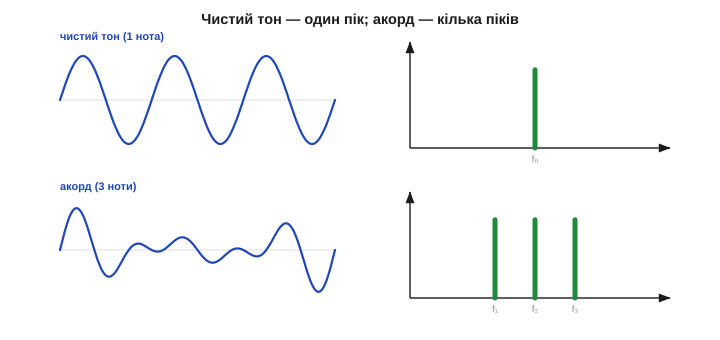
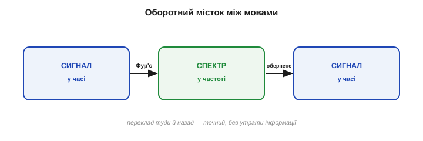

# Сигнал у часі й частоті: дві мови

Під'єднайте осцилограф до мікрофона й заспівайте одну ноту. На екрані — хвиляста лінія, що біжить зліва направо: тиск повітря в кожну мить. А тепер питання: **яка це нота**? Подивившись на хвилю, ви цього прямо не скажете — доведеться міряти період лінійкою й рахувати. Сигнал містить відповідь, але **ховає** її: у часовій формі «яка частота» — не на видноті. Варто ж глянути на той самий звук **іншою мовою**, частотною, — і відповідь сама стрибне в очі одним-єдиним піком. Уся ця стаття — про те, що в кожного сигналу є **дві рівноправні мови опису**, і про те, коли яку брати. Це понятійний фундамент усієї спектральної обробки: не навчившись бачити сигнал двома очима, не зрозумієш ні спектра, ні фільтрів, ні Фур'є.

### Дві мови одного сигналу

**Часова область** (*time domain*) — це те, до чого ми звикли: значення сигналу як функція **часу**. По горизонталі — час, по вертикалі — амплітуда (напруга, тиск, відстань). Так показує осцилограф, так лягають відліки АЦП у пам'ять, так зображають сигнал звичайні графіки. Часова мова відповідає на питання «**що було в цю мить**» і «**як воно мінялося**».

**Частотна область** (*frequency domain*) — це опис того самого сигналу через його **складові частоти**: скільки в ньому повільних коливань, скільки швидких, скільки кожної «ноти». По горизонталі тепер не час, а **частота**, по вертикалі — наскільки сильно ця частота присутня. Така картинка зветься **спектром** (*spectrum*). Частотна мова відповідає на інше питання — «**з чого** сигнал складається».


*Один сигнал — два описи. Ліворуч (часова область) — хвиля, що біжить у часі: сума повільного й швидкого коливань зливається в заплутану лінію. Праворуч (частотна область) — її спектр: два чисті піки, по одному на кожну частоту-складову. Та сама інформація, але друга мова одразу каже те, що перша ховала: тут рівно два тони.*

Ключове, що це **не два різні сигнали, а один**, поданий по-різному — як те саме число «дванадцять» можна записати арабською «12», римською «XII» чи словом. Часова й частотна форми — два записи однієї суті, і між ними можна переходити туди й назад без втрат. Просто **одне питання зручніше ставити однією мовою, інше — другою**.

Варто одразу прив'язати осі до звичних одиниць. У часовій мові горизонталь — це секунди (чи мілісекунди, чи просто номер відліку), а крок між сусідніми точками задає **частота дискретизації** — скільки відліків за секунду знімає АЦП. У частотній мові горизонталь — це **герци**, цикли за секунду: ліворуч повільні коливання, праворуч швидкі. А **висота** кожної спектральної лінії каже, **скільки** цієї частоти в сигналі, — це її амплітуда, «гучність» тону. Тож читати спектр просто: положення по горизонталі — яка частота, висота — наскільки вона сильна. Низький широкий горб ліворуч означає повільну основу сигналу; гострий високий пік праворуч — швидкий тон або заваду.

### Та сама пісня — два записи

Найприродніша аналогія — музика, і вона не випадкова: саме звук історично породив цю двоїстість, ще від спроб описати коливання натягнутої струни. Заспіваний звук — це **коливання тиску повітря**, тобто хвиля в часі. Але музикант записує ту саму музику зовсім інакше — **нотами**: до, мі, соль. Нотний запис не каже, який тиск був у яку мілісекунду, — він каже, **які частоти звучать**. Партитура — це, по суті, **частотний опис** музики.


*Від ноти до спектра. Угорі — чистий тон (одна синусоїда): у часі рівна хвиля, у спектрі — один пік на її частоті. Унизу — акорд із трьох нот: у часі складна, начебто хаотична хвиля, а в спектрі — три охайні піки, по одному на ноту. Спектр буквально «читає партитуру» сигналу.*

Чистий тон — одна синусоїда — це в часі рівна, нудна хвиля, а в спектрі **один-єдиний пік** на її частоті: уся енергія зосереджена на одній «ноті». Заграйте акорд із трьох нот — і часова хвиля стане заплутаною, бо три синусоїди накладаються й інтерферують у складний візерунок; а спектр лишиться простим і прозорим — **три піки**, рівно по одному на кожну ноту. Те, що в часі виглядає мішаниною, у частоті часто виявляється елементарним. У цьому й уся сила другої мови: **складність у часі ≠ складність по суті**.

Чому ж часова хвиля акорду така заплутана? Бо три синусоїди весь час **то складаються, то віднімаються**: там, де їхні гребені збігаються, сумарна хвиля підскакує, а де гребінь припадає на западину — гасне. Виходить пульсівний, на вигляд хаотичний візерунок (його повільні пульсації музиканти чують як **биття**). Жодного справжнього хаосу в ньому немає — це строга сума трьох чистих тонів; просто час показує **результат** їхнього накладення, а не самі **складові**. Частотна ж мова показує саме складові — і тому бачить просте там, де час бачить кашу. Запам'ятати це варто як головну причину переходити в частоту: вона **розплутує суму назад на доданки**.

### Що видно в одній мові й сховано в іншій

Якщо обидві мови несуть ту саму інформацію, навіщо взагалі дві? Бо те, що **очевидне** в одній, буває майже **невидиме** в іншій — і навпаки.

Часова область сильна там, де питання — «**коли**»: коли стався удар, де в записі різкий фронт, як швидко наростає перехідний процес, чи є раптовий стрибок. Усе це — локальні в часі події, і на осцилограмі вони видні відразу.

А от частотна область сильна там, де питання — «**що за тон**» і «**чи є прихована періодичність**». Уявіть давач, чий сигнал на вигляд — суцільний безлад, тремтлива каша. У часі ви нічого не вчепите. Та якщо в тій каші захована **стала періодична завада** — скажімо, наводка 50 Гц від мережі, — спектр викриє її **миттєво**: серед низького трав'яного шуму вистрелить один чіткий високий пік на 50 Гц.


*Що ховає час і викриває частота. Ліворуч — сигнал у часі: корисне повільне коливання потонуло в шумі й виглядає безладною кашею, завади не видно. Праворуч — той самий сигнал у спектрі: гострий пік на 50 Гц одразу виказує мережеву наводку, а низький горб ліворуч — корисний сигнал. Те, що час сховав, частота показала пальцем.*

Саме тому досвідчений інженер, побачивши незрозумілий шум, першим ділом **дивиться на спектр**: підозрілий пік прямо називає винуватця за його частотою — 50 Гц це мережа, кілогерци це часто перемикальний блок живлення, сотні герц це може бути вібрація двигуна. Частота — це **підпис** джерела.

> 🔧 **Навіщо це.** Коли давач «шумить», а на осцилограмі сам безлад, переведіть сигнал у спектр — і причина часто **називає себе сама**. Рівний пік на 50/60 Гц — мережева наводка (екрануй, виткни землю); рівний килим по всій осі — тепловий шум (його гасить [усереднення](book:algorithms/moving-average)); вузький пік на частоті обертання — механічна вібрація. Те, що в часі невідрізнене від каші, у частоті стає адресою джерела. Це найшвидший спосіб налагодження аналогового тракту, який тільки є.

### Дзеркало: та сама інформація, інша форма

Підкреслимо те, що легко проґавити: перехід між мовами **нічого не втрачає**. Узявши хвилю в часі, можна порахувати її спектр; узявши спектр, можна **точно відновити** ту саму хвилю. Це дзеркало, а не спрощення: обидва описи **повні** й **рівносильні**.

Це принципово відрізняє перетворення від **фільтра**. [Фільтр](book:algorithms/signal-noise) свідомо **викидає** частину інформації — шум, викиди — і назад її вже не повернеш; це вулиця з одностороннім рухом. Перетворення Фур'є не викидає **нічого**: воно лише **перекладає** ті самі дані іншою мовою, і переклад оборотний до останнього біта. Тому спектр — це не «оброблений», а просто **інакше побачений** той самий сигнал. Усі ліки — прибрати гул, стиснути звук — застосовують **уже після** переходу, працюючи у частотній мові; саме ж перетворення чесно зберігає все, що було, щоб після обробки можна було точно повернутися в час.

Інструмент, що переводить часову мову в частотну, зветься **перетворенням Фур'є** (*Fourier transform*) — на честь Жозефа Фур'є, який його й винайшов. Зворотний переклад, із частот назад у час, — **обернене перетворення Фур'є**. Як саме воно влаштоване — що [сигнал розкладають на суму синусоїд](book:math/fourier-idea) і як [рахують «скільки кожної»](book:math/dft) — окрема велика тема. Тут важлива лише сама **картина**: є дві мови й точний **словник** між ними в обидва боки.


*Оборотний місток. Перетворення Фур'є переводить сигнал із часової мови в частотну; обернене перетворення повертає назад — точно, без утрати інформації. Це не спрощення сигналу, а зміна **точки зору** на нього: ті самі дані, інша вісь. Питання лиш у тому, з якого боку містка зручніше шукати відповідь.*

Звідси й практичний рецепт усього розділу: **перейди в ту мову, де твоє питання просте, дай відповідь там — і, за потреби, повернися назад**. Хочеш прибрати гул 50 Гц? У часі це важко, а в частоті — просто витри пік і перетвори назад (це і є [частотна фільтрація](book:algorithms/filter-as-spectrum-shaper)). Хочеш виміряти оберти двигуна за вібрацією? Шукай пік у спектрі. Міст працює в обидва боки, і вся майстерність — обрати правильний берег.

**Приклад (корисний сигнал під гулом).** Давач нахилу віддає повільний корисний сигнал ~2 Гц, але на нього накладена мережева наводка 50 Гц. У часі вони зливаються в тремтливу лінію, де очима «корисне» від «завади» не відділиш:

```
часова мова:   2 Гц + 50 Гц злиті разом  →  заплутана хвиля, очі безсилі
частотна мова: |                                  
   корисне →   ▉ (пік на 2 Гц)                     
   завада  →   .............▉ (пік на 50 Гц)       
висновок: дві частоти видно нарізно → ясно, що різати 50 Гц
```

Той самий сигнал, та сама інформація — але частотна мова **відразу** показала, що завада окремо від сигналу й де саме її різати. Це й є причина, чому інженери так часто дивляться на спектр: він **розплутує** те, що час сплутав.

### Крайні випадки, що будують інтуїцію

Щоб мова частот стала рідною, корисно завчити кілька **граничних пар** «час ↔ частота» — вони працюють як опорні точки.


*Чотири опорні пари. (1) Чиста синусоїда — один пік: уся енергія на одній частоті. (2) Стала (постійний рівень) — пік на нульовій частоті (0 Гц = «не коливається»). (3) Різкий короткий імпульс-клац — рівний спектр: клац містить геть усі частоти потроху. (4) Білий шум — широкий рівний килим: безлад у часі = усі частоти разом. Вузьке в часі — широке в частоті, і навпаки.*

- **Чиста синусоїда → один пік.** Одна частота — уся енергія в одній точці спектра. Це найпростіший можливий спектр.
- **Стала величина (постійний рівень) → пік на 0 Гц.** Якщо сигнал не коливається зовсім, уся його «енергія» сидить на **нульовій частоті**. Тому 0 Гц у спектрі — це просто **середній рівень** (постійна складова, *DC*); цікаве ж зазвичай починається праворуч від нуля.
- **Різкий клац (короткий імпульс) → рівний спектр.** Що **коротша** подія в часі, то **ширший** її спектр: ідеальний миттєвий клац містить **усі** частоти потроху. Ось чому короткий «тик» звучить так різко — у ньому намішано все.
- **Білий шум → широкий рівний килим.** Цілковитий безлад у часі — це присутність **усіх** частот одночасно й порівну; звідси й назва «білий» (як біле світло — суміш усіх кольорів).

Ці чотири пари — як таблиця множення частотної мови: завчивши їх, ви вгадуватимете форму спектра ще до будь-яких обчислень. Побачили в спектрі самотній гострий пік — десь у сигналі є чиста періодика (тон чи завада); широкий рівний килим — переважає шум; усе притиснуте до лівого краю, до нуля, — сигнал майже сталий, без швидких коливань. І навпаки: знаючи, що сигнал — повільна синусоїда з домішком клацань, ви наперед скажете, що в спектрі буде низький пік плюс рівномірний фон. Ця гра «вгадай спектр» і є та інтуїція, заради якої варто завчити опорні пари.

В усіх цих парах прозирає одна глибока закономірність: **що вужче сигнал у часі, то ширший він у частоті**, і навпаки. Нескінченно довга синусоїда — нескінченно вузький пік; миттєвий клац — нескінченно широкий килим. Ця обернена залежність — насправді той самий компроміс «локальність проти роздільності», що стоїть і за [затримкою згладжувальних фільтрів](book:algorithms/smoothing-vs-lag), і за [межею роздільної здатності спектра](book:math/windowing-leakage). Досить відчути її нутром: **гострота в одній мові — це розмитість у другій**.

> 🔧 **Навіщо це.** Інструмент, що показує спектр у реальному часі, зветься **аналізатором спектра**, і його не треба купувати окремо: на мікроконтролері спектр рахує [**ШПФ**](book:algorithms/fft) — кілька рядків коду перетворюють масив відліків АЦП на стовпчики частот. Маючи цей погляд, ви бачите в сигналі те, чого не видно на жодній осцилограмі: тони, гул, вібрації, биття. Це як отримати друге око — і багато задач, безнадійних у часі, у частоті стають тривіальними.

### Яку мову обрати під питання

Підсумуймо практично. Перш ніж дивитися на сигнал, спитайте себе, **що саме** ви хочете дізнатися, — і це підкаже, з якого берега містка заходити.


*Яка мова під яке питання. «Коли це сталося? Який різкий фронт? Як швидко наростає?» — часова область. «Які тони всередині? Чи є прихований період? Де гул-завада? Як стиснути?» — частотна. Багато задач легко розв'язати, лише ставши на правильний берег; половина успіху — впізнати, який це берег.*

- Питання про **час і події** — «коли стався удар», «який перехідний процес», «де стрибок», «як змінюється рівень» — ставте в **часовій** області.
- Питання про **вміст і періодичність** — «які частоти всередині», «чи є прихований тон», «де мережевий гул», «як стиснути звук чи зображення» — ставте в **частотній**.

Часто найсильніший хід — **поєднати обидві**: знайти винуватця в частоті, а діяти в часі; або навпаки. Саме на цій двомовності й стоїть уся цифрова обробка сигналів, а опанувати її означає довести другу, частотну мову до рівня рідної.

> 🔧 **Навіщо це.** Перед налагодженням сигналу спитайте не «що я бачу?», а «**що я хочу дізнатися?**» — і свідомо оберіть мову. Шукаєте момент події — лишайтесь у часі; шукаєте приховану частоту чи заваду — переходьте в спектр; не певні — гляньте на обидві картинки поряд. Звичка дивитися двома мовами замість однієї відрізняє інженера, що **бачить** сигнал, від того, хто лише дивиться на лінію й гадає.

Отже, у кожного сигналу є дві рівносильні мови, а між ними — точний оборотний місток на ім'я «перетворення Фур'є». Лишається питання, на чому цей місток стоїть, — і відповідь дає [сама зухвала ідея Фур'є](book:math/fourier-idea), та, у яку не вірив Лагранж: що **будь-який** сигнал, хоч би який складний, є нічим іншим, як **сумою простих синусоїд**.

---
