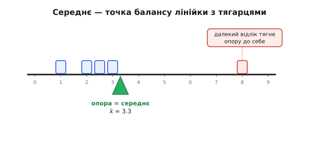
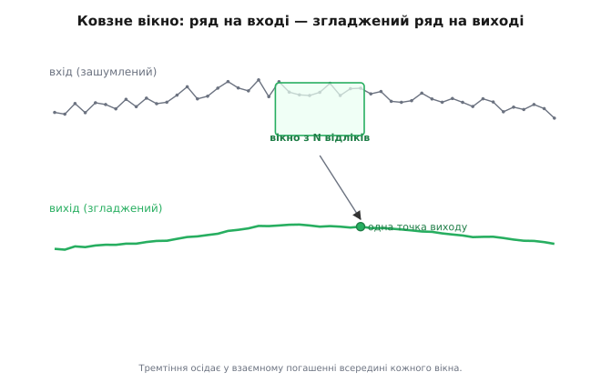
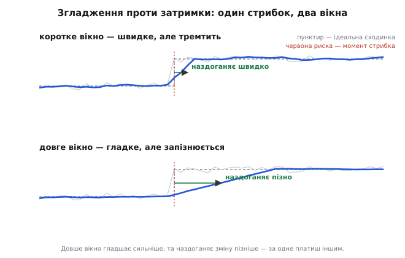

# Усереднення

Перед вами ряд чисел, що мали б бути однаковими, та не є: 25.3, 24.8, 25.1, 24.6, 25.2. Давач міряє ту саму температуру, а показ щоразу інший — поверх справжнього значення сидить дрібне безладне тремтіння. Око людини робить тут одну й ту саму річ несвідомо: воно не чіпляється за окреме число, а вловлює, **навколо чого вони купчаться** — десь близько 25. Усереднення — це та сама дія, лише точно сформульована: звести пригорщу чисел до одного, що каже, де їхній спільний центр.

Та звести можна по-різному, і вибір не безневинний. Можна скласти все й поділити порівну. Можна декому з відліків довіряти більше, декому менше. Можна не зупиняти потік, а вести середнє на ходу, у рухомому вікні. Кожен спосіб — це **операція над сигналом**: на вході ряд чисел, на виході — теж число або теж ряд, але інший, причесаніший. Розберімо, що саме ця операція робить із сигналом, **чому** вона згладжує безлад, і яку ціну за згладження доводиться платити — бо безкоштовно воно не дається.

Окреме, дуже конкретне питання — **наскільки** усереднення прибирає випадковий шум у числах — має точну відповідь (виграш росте як корінь із кількості відліків) і розібране окремо. Тут нас цікавить сама операція: що вона є, як діє й де її межа.

> Усереднення N незалежних відліків зменшує випадковий шум не в N разів, а лише у **√N разів**: сотня відліків прибирає шум удесятеро, а не в сто. Це випливає з того, як додаються розкиди незалежних величин. Тут ми цим числом лише користуємось; звідки воно — окремо.
>
> Докладніше: [виграш усереднення](topic:math/averaging-gain).

## Просте середнє: операція, що шукає центр

Найпростіший спосіб звести ряд до центру — **середнє арифметичне** (від лат. *arithmetica*, через грец. *arithmós* — число): скласти всі відліки й поділити на їхню кількість.

```
x̄ = (x₁ + x₂ + … + x_N) / N = (1/N)·Σ xᵢ
```

Риска над x (читають «ікс із рискою») — стала позначка середнього. Формула проста до банальності, та за нею ховається точний зміст: середнє — це така **єдина точка, від якої всі відліки відхиляються збалансовано**. Сума відхилень угору від неї точно дорівнює сумі відхилень униз; якби це було не так, центр стояв би не там. Саме тому середнє ловить «де купчаться числа»: воно стоїть рівно в тій точці рівноваги, де додатні й від'ємні промахи врівноважені.

Це варто відчути фізично. Уявіть відліки як однакові тягарці, нанизані на невагому лінійку в точках їхніх значень. Підставте під лінійку палець так, щоб вона не перехилялась, — палець опиниться рівно під середнім. Середнє — це **центр ваги** ряду чисел; кожен відлік тягне лінійку до себе з однаковою силою, і точка балансу враховує їх усіх порівну.


*Кожен відлік — однаковий тягарець у точці свого значення. Середнє — це точка опори, за якої лінійка не перехиляється: сумарний момент зліва дорівнює сумарному моментові справа. Один далекий відлік (праворуч) помітно тягне опору до себе — середнє чутливе до викидів.*

Образ із тягарцями одразу показує і слабке місце операції. Один відлік, що відскочив далеко вбік — груба похибка, збій давача, випадковий стрибок, — тягне точку балансу на себе тим сильніше, чим він дальший. Просте середнє **довіряє всім відлікам однаково**, зокрема й брехливому. Це перша тріщина, з якої народиться потреба у зваженому середньому.

## Чому середнє згладжує безлад

Тепер головне питання теми: **чому** ця операція прибирає тремтіння? Чому середнє п'яти стрибучих чисел спокійніше за кожне з них окремо?

Розкладімо кожен відлік на дві частини — справжнє значення й випадкову добавку:

```
xᵢ = s + εᵢ
```

Тут s — те, що ми хочемо виміряти (воно в усіх відліках **однакове**: давач же міряє ту саму температуру), а εᵢ (грец. «епсилон», стала позначка малої похибки) — шум, що **щоразу інший**: то трохи вгору, то трохи вниз, без сталого нахилу в якийсь бік. Підставмо цей розклад у середнє й подивімось, що з ним станеться:

```
x̄ = (1/N)·Σ (s + εᵢ) = s + (1/N)·Σ εᵢ
```

Середнє чисто розпалось надвоє, і це розділення — уся розгадка. Перша частина — просто s: ми N разів додали те саме s і поділили на N, тож воно вийшло з операції **недоторканим**. Уся дія — у другій частині, у середньому самих шумів. От якби воно було нулем, лишилося б чисте s.

Нулем воно не буде, але стане **малим**, і ось чому. Шуми різнознакові: у будь-якій пригорщі частина додатна, частина від'ємна. Коли їх складаєш, додатні й від'ємні **частково гасять одне одного** — не дотла (це ж не дзеркальні пари), а статистично. Що більше доданків, то повніше це взаємне погашення, і то ближче їхня сума тулиться до нуля. А поділ на N тисне її ще нижче. Справжнє s стоїть непорушно; випадкова добавка біля нього танне.

Ось де **корінь усього механізму**: усереднення не однаково діє на дві частини сигналу. Те, що **стале** в усіх відліках (корисний сигнал s), воно зберігає цілим; те, що **щоразу різне** (шум ε), воно притискає взаємним погашенням. Операція ділить світ на постійне й мінливе й давить лише мінливе. Це не дрібниця стилю формулювання, а той стрижень, на якому тримається все застосування усереднення — і та сама причина його головної межі, до якої ще дійдемо.

> 🔧 **Навіщо це.** Звідси перше робоче правило для будь-якого шумного давача: усереднення лікує **випадкове** тремтіння, але безсиле проти сталого. Якщо давач відкалібрований на 0.4 °C вище, ніж треба, ця похибка стала — вона є в кожному відліку однаково, тож виходить із усереднення цілою, точнісінько як корисний сигнал. Усереднюй хоч мільйон відліків — стабільно отримаєш стабільно неправильне число. Перше питання інженера завжди: ця похибка щоразу різна (тоді усереднюй) чи та сама (тоді калібруй)?

## Зважене середнє: коли відліки не рівноцінні

Просте середнє ставить усі відліки нарівно. Та часто це невиправдано. Один вимір зроблено точним приладом, другий — грубим. Один свіжий, другий застарів. Один давач певний, другий зашумлений. Зрівнювати їх — викидати інформацію про те, кому довіряти.

**Зважене середнє** (англ. *weighted mean*) дає кожному відлікові свою **вагу** wᵢ — число, що каже, наскільки сильно цей відлік впливає на результат:

```
x̄ = (w₁x₁ + w₂x₂ + … + w_N x_N) / (w₁ + w₂ + … + w_N) = Σ(wᵢ·xᵢ) / Σwᵢ
```

Чисельник — сума відліків, кожен помножений на свою вагу; знаменник — сума самих ваг, він нормує результат назад у природні одиниці. Перевірмо, що це чесне узагальнення: якщо всі ваги однакові (скажімо, всі дорівнюють 1), спільний множник виноситься й скорочується, і формула стає звичайним середнім (1/N)·Σxᵢ. Тобто просте середнє — це окремий випадок зваженого, де всім роздали порівну.

Вернімось до образу з тягарцями, бо він прямо показує суть ваги. Раніше тягарці були однакові; тепер кожен має **свою масу** wᵢ. Точка балансу зміщується до важчих — і це рівно те, чого ми хотіли: відлік із більшою вагою сильніше притягує центр до себе. Зважене середнє — це той самий центр ваги, але тягарці більше не рівні.

Звідки беруть самі ваги? Тут є точний інженерний орієнтир, а не свавілля. Найкорисніше зважування — **обернено до розкиду**: відлікові тим більша вага, чим менший його власний шум. Прилад утричі точніший заслуговує більшої довіри. Це не випадковий рецепт: можна показати, що ваги, обернені до дисперсії кожного відліку (wᵢ = 1/σᵢ²), дають середнє з **найменшим можливим** розкидом — жодне інше зважування не вичавить із тих самих даних точнішого результату.

> Дисперсія (англ. *variance*) — міра розкиду випадкової величини, середній квадрат відхилення від середнього; її корінь σ (сигма) — це типовий масштаб шуму в природних одиницях (вольтах, градусах). Що менша дисперсія відліку, то він певніший. Глибше про обидва поняття — окремо.
>
> Докладніше: [середнє й дисперсія](topic:math/mean-variance).

> 🔧 **Навіщо це.** Так зливають **кілька давачів в одне число**. Якщо температуру міряють два давачі — точний, але повільний, і швидкий, але шумний, — наївне «(a+b)/2» псує точний показ грубим. Зважування обернено до шуму дає кожному рівно стільки голосу, скільки він заслуговує, і поєднаний показ виходить кращим за будь-який окремий. Це фундамент усього злиття даних — від двох термометрів до десятка інерційних давачів у польотному контролері.

## Ковзне середнє: усереднення потоку, а не пригорщі

Досі ми мали скінченну пригорщу й діставали з неї одне число. Та в реальному приладі дані **течуть без кінця**: давач видає відлік за відліком, поки система живе. Тут не «усереднити й спинитись» — тут потік треба згладжувати **на ходу**, видаючи на кожен вхідний відлік свіже, причесане значення.

Ось де народжується **ковзне (рухоме) середнє** (англ. *moving average*). Ідея проста: тримати «вікно» з останніх N відліків і весь час видавати їхнє середнє. Надходить новий відлік — вікно зсувається на крок: найновіший заходить, найстаріший випадає, і середнє рахується наново. Виходить уже не одне число, а **новий ряд** — згладжена версія вхідного:

```
yₜ = (xₜ + xₜ₋₁ + … + xₜ₋ₙ₊₁) / N
```

Тут yₜ — згладжений вихід у момент t; він збирає N останніх входів — від теперішнього xₜ назад до xₜ₋ₙ₊₁. На кожному кроці вікно ковзає вперед на один відлік (звідси й назва), і весь розрахунок повторюється. Це вже не разова дія над пригорщею, а **операція над усім сигналом**: ряд увійшов — ряд вийшов.


*Вікно з N останніх відліків ковзає вздовж зашумленого входу; кожне його положення дає одну точку згладженого виходу. Вихідна крива (внизу) повторює форму входу, та без дрібного тремтіння — воно осіло у взаємному погашенні всередині вікна.*

Згладжує ковзне середнє рівно з тієї самої причини, що й звичайне: усередині кожного вікна випадкові добавки різнознакові й частково гасяться, а спільна для сусідніх відліків плавна частина сигналу переживає усереднення цілою. Різниця лише в тому, що тепер ми робимо це **в кожній точці** ряду, тягнучи вікно крізь увесь сигнал. На виході — той самий сигнал, але тремтіння згладжене.

І тут уперше прозирає ціна. Вікно дивиться **назад**, на минулі відліки. Тому згладжений вихід завжди трохи **відстає** від справжнього сигналу: якщо вхід різко піде вгору, вікно ще якийсь час тягтиме у своєму середньому старі, нижчі значення, і вихід наздожене стрибок не одразу. Згладження й це запізнення — нерозлучна пара, і саме їхній компроміс вирішує, яким брати вікно.

## Чому згладжує: усереднення як фільтр низьких частот

Щоб зрозуміти компроміс точно, треба глянути на усереднення з іншого боку — **з боку частот**. Будь-який сигнал можна уявити сумою коливань різної частоти: повільні, плавні зміни — це низькі частоти; швидке дрібне тремтіння — високі. Корисний сигнал зазвичай повільний (температура пливе плавно), а шум — швидкий (стрибає від відліку до відліку). Тоді «прибрати шум, лишити сигнал» означає **пропустити низькі частоти й погасити високі**. Пристрій, що так робить, зветься фільтром низьких частот.

> Будь-який сигнал розкладається на суму синусоїд різної частоти — це ідея Фур'є. Повільні зміни сидять у низьких частотах, різке тремтіння — у високих. Дивитися на сигнал «за частотами» часто корисніше, ніж за окремими відліками: видно, що згладити, а що лишити. Звідки це розкладання — окремо.
>
> Докладніше: [ідея Фур'є](topic:math/fourier-idea).

Ковзне середнє — саме такий фільтр, і видно це з простого міркування. Уяви на вході дуже **повільне** коливання: за час одного вікна воно майже не змінюється, всі N відліків у вікні майже однакові, тож їхнє середнє дорівнює самому сигналу — низька частота проходить **наскрізь, не зачеплена**. Тепер уяви дуже **швидке** коливання: за час вікна воно встигає кілька разів збігати вгору-вниз, у вікні опиняється порівну гребенів і западин, вони складаються майже в нуль — висока частота **гаситься**. Між цими крайнощами фільтр пропускає тим менше, чим вища частота. Ось чому усереднення згладжує: воно буквально вирізає швидку частину сигналу, лишаючи повільну.

Звідси й кермо керування згладженням — **довжина вікна N**. Що довше вікно, то нижча межа, вище за яку частоти душаться: довге вікно ловить навіть доволі повільні коливання й вихід виходить дуже гладким. Коротке вікно чіпає лише найшвидше тремтіння, гладшає делікатно. N — це регулятор сили фільтра: більше N — сильніше згладжування.

> 🔧 **Навіщо це.** Цей погляд рятує від типової халепи. Якщо в шумі давача сидить **періодична** наводка — скажімо, 50 чи 60 Гц від мережі живлення, — її можна **прицільно** прибити ковзним середнім, узявши вікно рівно на цілу кількість періодів цієї наводки: тоді гребені й западини наводки в кожному вікні точно зрівноважуються й вона гасне повністю. Промахнешся з довжиною вікна — наводка пролізе крізь фільтр недодушеною. Знати, що усереднення є фільтр із керованою смугою, — означає вміти націлити його, а не лупити навмання.

## Компроміс: згладження проти затримки

Тепер зведімо обидва боки докупи, бо в них — головне практичне рішення теми. Довге вікно дає два ефекти **одночасно**, і вони тягнуть у різні боки.

З одного боку, довге вікно **краще згладжує**: воно усереднює більше відліків, тож сильніше душить високі частоти, і вихід виходить чистіший. З іншого боку — і це неминуча розплата — довге вікно **дужче запізнюється**. Воно тримає у своєму середньому довшу історію минулого, тож реагує на свіжу зміну повільніше: реальний сигнал уже стрибнув, а вихід ще довго тягне старі значення, поки вони не випадуть із вікна. Згладження й затримка ростуть **разом** із N — за одне платиш іншим.


*Один і той самий різкий стрибок входу під двома вікнами. Коротке вікно (зверху) наздоганяє стрибок майже одразу, та лишає на сигналі тремтіння. Довге вікно (знизу) гладеньке, але наздоганяє помітно пізніше — затримка тим більша, чим довше вікно. Однією дією краще й швидше водночас не буде.*

Звідси й уся інженерна вправність із вибором N: не «яке вікно найкраще» (такого нема), а **який компроміс терпить задача**. Згладжуєш повільну температуру в кімнаті, де запізнення на секунду нікого не обходить, — бери вікно довге, ріж шум сміливо. Згладжуєш сигнал у контурі керування, де керунок мусить реагувати **миттєво**, — кожен зайвий відлік затримки розхитує систему, тож вікно бери якомога коротше, терпи трохи шуму. Те саме усереднення в одній задачі — рятунок, в іншій — джерело небезпечного відставання.

Той самий компроміс під іншим іменем: затримку, яку додає ковзне середнє, легко прикинути. Вікно з N відліків зсуває вихід приблизно на півширини вікна назад у часі — десь на (N−1)/2 відліків. Подвоїш вікно заради вдвічі сильнішого згладження — приблизно подвоїш і запізнення. Жодного безкоштовного згладження не буває: чистіший вихід завжди платить часом.

## Worked-приклад: вибрати вікно під допустиму затримку

**Умова.** Давач видає відлік щомиті (період між відліками — 1 мс). Шум треба згладити ковзним середнім, але керунок не терпить затримки понад 5 мс. Яке найдовше вікно N можна взяти — і що воно дасть зі згладженням?

Затримка ковзного середнього — приблизно (N−1)/2 відліків, а кожен відлік триває 1 мс. Прирівняймо до межі й розв'яжімо щодо N:

```
затримка ≈ (N − 1)/2 · 1 мс  ≤  5 мс
(N − 1)/2 ≤ 5
N − 1     ≤ 10
N         ≤ 11  відліків
```

Отже вікно — щонайбільше 11 відліків; візьмімо рівно 11. Тепер прикиньмо, що це дає для шуму. Згладження ковзного середнього з боку придушення випадкового шуму підкоряється тому самому закону кореня: вікно з N відліків тисне випадковий шум приблизно у √N разів.

```
придушення шуму ≈ √N = √11 ≈ 3.3 раза
затримка        = (11 − 1)/2 = 5 відліків = 5 мс   ← рівно на межі
```

Висновок просто читає компроміс у числах. Одинадцять відліків — це найбільше, що дозволяє ліміт затримки; вони притискають випадковий шум приблизно втричі. Захотіли б давити шум удесятеро — знадобилося б вікно зі ста відліків (бо √100 = 10), а це затримка близько 50 мс, удесятеро понад дозволене. Тут видно суть теми як на долоні: затримка жорстко обмежує, наскільки сильно вільно згладжувати. За межами цього ліміту шум доводиться бити інакше — не довшим вікном.

## Усереднення потоку в прошивці: реальний C

**Умова.** Мікроконтролер приймає відліки з давача один за одним і має на кожен видавати ковзне середнє по останніх N. Перерахувати щоразу суму всіх N відліків — марнотратно; зробімо це за сталу роботу на кожен крок.

Хитрість — **кільцевий буфер** і **збережена сума**. Тримаємо вікно з N останніх відліків і поточну їхню суму. Надходить новий відлік — віднімаємо з суми той, що випадає з вікна, додаємо новий, а старий затираємо новим. Сума оновлюється двома діями замість N, скільки б не було вікно.

:::tabs
```cpp
#include <cstdint>

constexpr int WIN = 11;        // довжина вікна: компроміс згладження↔затримка

static uint16_t buf[WIN];      // кільцевий буфер останніх WIN відліків
static uint32_t sum = 0;       // збережена сума вмісту вікна (широка — проти переповнення)
static int      pos = 0;       // куди ляже наступний відлік

// Згодувати новий відлік, дістати ковзне середнє по останніх WIN.
uint16_t moving_average(uint16_t sample)
{
    sum -= buf[pos];           // прибрати найстаріший відлік (той, що випадає з вікна)
    sum += sample;             // додати найновіший
    buf[pos] = sample;         // затерти найстаріший новим
    pos = (pos + 1) % WIN;     // зсунути вікно по колу
    return static_cast<uint16_t>(sum / WIN);   // свіже середнє вікна
}
```
```python
WIN = 11                       # довжина вікна: компроміс згладження↔затримка

_buf = [0] * WIN               # кільцевий буфер останніх WIN відліків
_sum = 0                       # збережена сума вмісту вікна
_pos = 0                       # куди ляже наступний відлік

def moving_average(sample):
    """Згодувати новий відлік, дістати ковзне середнє по останніх WIN."""
    global _sum, _pos
    _sum -= _buf[_pos]         # прибрати найстаріший відлік (той, що випадає з вікна)
    _sum += sample            # додати найновіший
    _buf[_pos] = sample       # затерти найстаріший новим
    _pos = (_pos + 1) % WIN   # зсунути вікно по колу
    return _sum // WIN         # свіже середнє вікна (цілочислове)
```
:::

**Розбір на числах.** Хай вікно вже повне й містить значення з сумою навколо 2000·11. Надходить новий відлік 2050, а найстаріший у вікні був 1990. Сума оновлюється двома діями:

```
було:   sum = 22000           (умовно, 11 відліків ≈ по 2000)
крок:   sum = 22000 − 1990 + 2050 = 22060
вихід:  22060 / 11 = 2005 (округлення)
```

Жодного перебирання всього вікна — рівно одне віднімання й одне додавання, хоч би яким довгим було WIN. Це і є сенс збереженої суми: робота на крок **стала**, не залежить від N.

**Дві пастки.** Перша — **переповнення**: сума WIN відліків легко переростає тип одного відліку, тому `sum` беремо широким (`uint32_t`), а не в типі `sample`. Друга, тонша, — **прогрів буфера**: поки вікно ще не заповнилось першими WIN відліками, у ньому сидять нулі (чи сміття), і середнє занижене. Або заповни буфер першим відліком на старті, або не довіряй виходу, доки не надійшло WIN відліків, — інакше перші кілька значень збрешуть.

## Де це працює щодня

Усереднення — найдешевша й найпоширеніша операція очищення сигналу; воно тихо стоїть усюди, де є шум і змога його згладити.

В **АЦП і давачах** ковзне середнє — найперший фільтр на сирому потоці відліків: кілька рядків коду перетворюють тремтливий вхід на спокійний, придатний для подальшого розрахунку. Звідси й близька рідня — **експоненційне згладжування**, де замість жорсткого вікна свіжий відлік щоразу підмішують до накопиченого середнього з невеликою вагою; це те саме усереднення потоку, лише з плавно спадною пам'яттю про минуле й майже без буфера.

У **керуванні** усереднення доводиться дозувати обережно: воно гладшає шумний вимір перед регулятором, але кожен відлік затримки, що його додає вікно, з'їдає запас стійкості контуру — тут компроміс згладження↔затримка з абстракції стає прямою причиною, чи буде система спокійною, чи піде в розгойдування.

Та сама операція виринає скрізь, де борються з безладом накопиченням: біржові графіки ведуть «ковзні середні» цін, щоб за денним стрибанням побачити тренд; згладжування рейтингів і лічильників прибирає випадкові сплески; обробка зображень розмиває дрібне зерно, усереднюючи сусідні пікселі. Скрізь діє один і той самий механізм — стале переживає усереднення, мінливе гасне — і та сама невблаганна ціна: що сильніше згладжуєш, то більше відстаєш від того, що згладжуєш.
