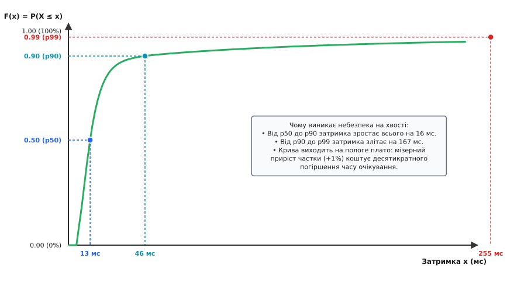
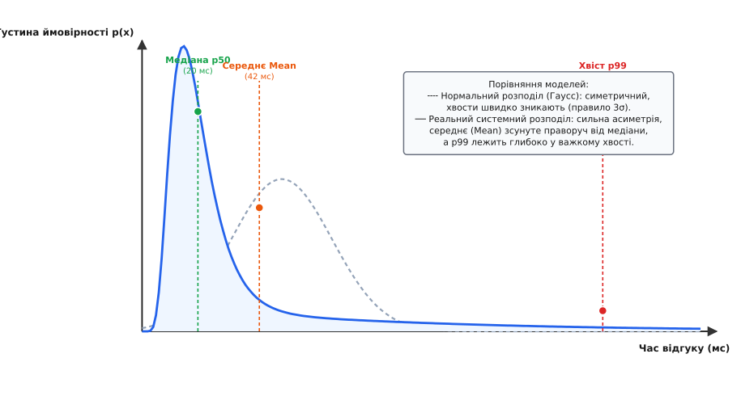
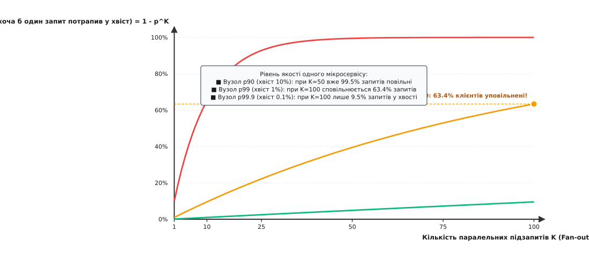

# Перцентилі й хвости розподілів у системах

<preknowlist>
- [Середнє й дисперсія](book:math/mean-variance) — базові показники центральної тенденції та розкиду вибірки.
- [Випадкові величини](book:math/probability-basics) — поняття ймовірності, функції розподілу та випадкової величини.
- [Усереднення](book:math/averaging) — як адитивні вимірювання поєднуються в єдину оцінку.
</preknowlist>

Веб-сервіс обробляє тисячу клієнтських запитів на секунду. Дев'ятсот дев'яносто дев'ять із них виконуються миттєво за 5 мілісекунд, але один запит потрапляє на паузу збирача сміття або блокування дискового введення-виведення і зависає на 5000 мілісекунд (5 секунд). Якщо розрахувати звичайне середнє арифметичне, вийде:

```
(999·5 + 1·5000) / 1000
= (4995 + 5000) / 1000   [обчислили добутки]
= 9995 / 1000            [додали чисельник]
= 9.995 ≈ 10 мс          [знайшли середнє]
```

Інженерна панель моніторингу забарвлена в зелений колір і показує середній час відгуку 10 мс. Проте для кожного тисячного користувача сторінка виглядає зламаною. Якщо система обслуговує мільйон запитів на добу, тисяча реальних людей щодня стикаються з п'ятисекундним очікуванням, скидають сесію або залишають сервіс. Середнє арифметичне приховало серйозний збій, змішавши нормальну роботу переважної більшості запитів із поодинокими, але катастрофічними затримками.

Ця розбіжність виникає через те, що час виконання операцій у комп'ютерних системах не підпорядковується симетричному закону. Щоб бачити справжню поведінку системи, статистика використовує апарат порядкових статистик і квантилів.

## Порядкові статистики та строге визначення квантиля

Нехай ми маємо вибірку з `N` числових спостережень затримки `X = {x₁, x₂, ..., x_N}`. Якщо переставити ці числа в порядку неспадіння (від найменшого до найбільшого), ми отримаємо впорядкований ряд:

```
x_(1) ≤ x_(2) ≤ ... ≤ x_(N)
```

де `x_(k)` називається `k`-ю порядковою статистикою (від латинського *ordo* — «ряд, порядок»). Елемент `x_(1)` є вибірковим мінімумом, `x_(N)` — вибірковим максимумом, а елемент посередині ряду ділить вибірку навпіл.

Для теоретичної випадкової величини `X` її поведінка повністю описується кумулятивною функцією розподілу `F(x)` (від латинського *cumulatio* — «накопичення»):

```
F(x) = P(X ≤ x)
```

Функція `F(x)` показує ймовірність того, що випадкова затримка не перевищить значення `x`. Вона монотонно зростає від нуля до одиниці.

Квантилем (від латинського *quantilis* — «якого розміру, скільки») порядку `p ∈ (0, 1)` неперервного розподілу називається таке значення `Q(p)`, для якого ймовірність отримати результат, менший або рівний `Q(p)`, точно дорівнює `p`:

```
P(X ≤ Q(p)) = p
```

Якщо функція розподілу `F(x)` є строго монотонною та неперервною, квантиль є значенням оберненої функції розподілу:

```
Q(p) = F⁻¹(p)
```

Для довільних функцій розподілу (зокрема східчастих емпіричних або дискретних розподілів, де `F(x)` може мати розриви або горизонтальні ділянки), квантиль строго визначається через інфімум (найбільшу нижню межу):

```
Q(p) = inf { x ∈ ℝ : F(x) ≥ p }
```

Перцентиль (від латинського *per centum* — «на сотню») — це той самий квантиль, але параметр `p` виражається у відсотках від 0 до 100:
- **50-й перцентиль (`p50`) або медіана:** значення, нижче за яке лежить рівно половина всіх спостережень (`p = 0.50`).
- **90-й перцентиль (`p90`):** значення, яке покриває 90% найшвидших запитів; лише 10% запитів тривають довше.
- **99-й перцентиль (`p99`):** поріг для 99% запитів; відображає затримку для одного найгіршого випадку зі ста.
- **99.9-й перцентиль (`p99.9`):** поріг для 99.9% запитів; відображає затримку для одного найгіршого випадку з тисячі.


*Кумулятивна функція розподілу затримок F(x). На пологій ділянці кривої невеликий приріст частки спостережень від p90 до p99 призводить до стрибкоподібного зростання часу очікування.*

Як показано на графіку, функція розподілу затримок спочатку стрімко підіймається, формуючи швидкі відповіді (медіана `p50 = 12 мс`), але потім виходить на довге пологе плато. На цій ділянці для того, щоб піднятися за ймовірністю всього на 9% (від p90 до p99), значення затримки має зрости зі 28 мс до 195 мс.

Історичний шлях відмови від усереднення на користь квантильних шкал докладно описано в [історичному нарисі](book:math/statistics/percentiles-quantiles/hist-percentiles.md).

## Чому системні розподіли мають важкі хвости

У класичній фізиці та метрології більшість похибок підпорядковується нормальному розподілу Гаусса завдяки дії центральної граничної теореми: сума великої кількості незалежних дрібних флуктуацій утворює симетричний дзвоноподібний розподіл. Для нормального розподілу ймовірність відхилення від середнього `μ` на величину понад три стандартні відхилення (`3σ`) становить лише 0.27%:

```
P(|X - μ| > 3σ) ≈ 0.0027
```

Відхилення на `6σ` трапляється з імовірністю менше двох на мільярд (`2·10⁻⁹`). У світі нормальних розподілів екстремальні події практично неможливі.

У комп'ютерних системах діють принципово інші фізичні й алгоритмічні механізми, які формують розподіли з важкими хвостами (heavy-tailed distributions):

1. **Ефекти черг і теорія масового обслуговування:**
   Коли інтенсивність надходження запитів наближається до пропускної здатності сервера, довжина черги зростає не лінійно, а гіперболічно. За формулою Поллачека-Хінчина затримка в черзі типу `M/G/1` прямує до нескінченності при завантаженні системи `ρ → 1`. Короткочасний сплеск навантаження створює затор, який сповільнює всі наступні запити.
2. **Багатошарові суміші режимів обробки (Multimodal Distributions):**
   Час доступу до даних у системі є сумішшю кардинально різних фізичних процесів:
   - попадання в кеш L1/L2 процесора: ~1–5 наносекунд;
   - зчитування з оперативної пам'яті (RAM): ~50–100 наносекунд;
   - звернення до локального NVMe SSD: ~20–100 мікросекунд;
   - мережевий запит до віддаленої бази даних або холодного диска: ~5–50 мілісекунд.
   Промах повз кеш змінює час виконання операції не на кілька відсотків, а на три-чотири порядки (у 1000–10000 разів).
3. **Недетерміновані паузи середовища:**
   Збирання сміття (Garbage Collection Stop-The-World), скидання брудних сторінок пам'яті ядром ОС на диск (fsync), міграція віртуальних машин, ретрансмісії втрачених TCP-пакетів та конкуренція за блокування м'ютексів (lock contention) додають у хвіст розподілу дискретні сплески тривалістю від десятків мілісекунд до кількох секунд.


*Густина ймовірності нормального розподілу проти реального розподілу в обчислювальних системах. Асиметрія зміщує середнє праворуч від медіани, а важкий хвіст простягається далеко в область великих затримок.*

У системних розподілах щільність імовірності на великих значеннях спадає не експоненційно (`e^(-x²)`), а значно повільніше — за логнормальним законом або степеневим законом Парето (`x^(-α)`). Через це події рівня `p99.9` відбуваються не раз на мільярд років, а щосекунди.

## Підсилення хвоста в розподілених системах

Найнебезпечніша властивість квантилів проявляється під час масштабування та побудови розподілених систем. Сучасні бекенд-сервіси рідко обробляють запит монолітно: один вхідний запит користувача розпаралелюється на десятки мікросервісів, шардованих баз даних або кеш-вузлів (патерн *fan-out*).

Нехай для формування однієї сторінки веб-сервер робить `K` незалежних паралельних запитів до різних сервісів. Загальний час очікування клієнта `T_total` визначається найповільнішим із цих `K` компонентів:

```
T_total = max(T₁, T₂, ..., T_K)
```

Припустимо, що кожен окремий сервіс має однакову функцію розподілу часу відповіді `F(t) = P(T_i ≤ t)`. Нехай ми обрали деякий поріг затримки `t`, у який окремий сервіс вкладається з імовірністю `p` (наприклад, `p = 0.99` для порогу 99-го перцентиля).

Оскільки підзапити виконуються незалежно, загальна відповідь укладеться в час `t` тоді й лише тоді, коли **всі** `K` сервісів дадуть відповідь швидше за `t`. За правилом множення ймовірностей для незалежних подій:

```
P(T_total ≤ t)
= P(T₁ ≤ t ∧ T₂ ≤ t ∧ ... ∧ T_K ≤ t)
= P(T₁ ≤ t) · P(T₂ ≤ t) · ... · P(T_K ≤ t)   [незалежність викликів]
= p · p · ... · p                            [однаковий розподіл]
= p^K                                        [піднесли до степеня K]
```

Відповідно, ймовірність того, що клієнт відчує затримку понад поріг `t` (хоча б один із `K` сервісів потрапить у свій повільний хвіст), становить:

```
P(T_total > t) = 1 - P(T_total ≤ t) = 1 - p^K
```

Якщо позначити ймовірність потрапляння окремого вузла у свій хвіст як `p_tail = 1 - p`, формулу можна записати через похибку одного вузла:

```
P(повільний запит) = 1 - (1 - p_tail)^K
```

### Числовий розрахунок підсилення для різних рівнів паралелізму

Візьмемо якісний сервіс, у якого 99-й перцентиль затримки становить 100 мс (`p = 0.99`, тобто `p_tail = 0.01`). Порахуємо ймовірність того, що клієнт отримає відповідь повільнішу за 100 мс при різній кількості підзапитів `K`:

**1. Один підзапит (`K = 1`):**
```
P(T_total > 100 мс)
= 1 - 0.99¹              [підставили K = 1]
= 1 - 0.99               [обчислили степінь]
= 0.01                   [отримали 1% користувачів]
```

**2. Десять підзапитів (`K = 10`):**
```
P(T_total > 100 мс)
= 1 - 0.99¹⁰             [підставили K = 10]
= 1 - 0.9044             [обчислили степінь 0.99^10]
= 0.0956                 [отримали ≈ 9.6% користувачів]
```

**3. П'ятдесят підзапитів (`K = 50`):**
```
P(T_total > 100 мс)
= 1 - 0.99⁵⁰             [підставили K = 50]
= 1 - 0.6050             [обчислили степінь 0.99^50]
= 0.3950                 [отримали ≈ 39.5% користувачів]
```

**4. Сто підзапитів (`K = 100`):**
```
P(T_total > 100 мс)
= 1 - 0.99¹⁰⁰            [підставили K = 100]
= 1 - 0.3660             [обчислили степінь 0.99^100]
= 0.6340                 [отримали ≈ 63.4% користувачів]
```


*Ймовірність уповільнення загального запиту залежно від ступеня паралелізму K. При ста підзапитах навіть надійність вузла p99 призводить до того, що 63.4% клієнтських запитів потрапляють у хвіст.*

Цей розрахунок демонструє фундаментальний закон розподілених систем: **99-й перцентиль окремого вузла при `K = 100` перетворюється на 37-й перцентиль для кінцевого користувача** (`1 - 0.634 = 0.366`). Майже дві третини користувачів страждають від повільних відповідей, попри те, що кожен окремий сервер 99% часу працює бездоганно.

Щоб кінцевий агрегований запит гарантував якість на рівні 99-го перцентиля (`P(T_total ≤ t) = 0.99`), кожен окремий підсервіс повинен забезпечувати надійність:

```
p_single = (0.99)^(1/K)
= (0.99)^(1/100)         [підставили K = 100]
≈ 0.999899               [обчислили корінь 100-го степеня]
```

Тобто окремий мікросервіс повинен гарантувати поріг затримки на рівні **p99.99** (один повільний запит на 10000), аби система зі 100 вузлами забезпечила клієнту рівень p99.

## Чому не можна усереднювати перцентилі

Поширена інженерна помилка полягає в спробі обчислити загальний перцентиль кластера шляхом знаходження середнього арифметичного перцентилів окремих серверів:

```
p99_cluster ≠ (p99_сервер_1 + p99_сервер_2 + ... + p99_сервер_M) / M
```

Перцентиль є нелінійним позиційним оператором. Операція взяття квантиля не має властивості адитивності: квантиль об'єднання множин не дорівнює комбінації квантилів цих множин.

### Контрприклад: розрахунок двох серверів

Нехай кластер складається з двох серверів A і B, кожен з яких обробив по 100 запитів.

- **Сервер A:** обробив 90 швидких запитів по 1 мс і 10 важких запитів по 10 мс.
  Його 90-й перцентиль (90-й елемент у відсортованому ряду):
  `p90(A) = 1 мс`.
- **Сервер B:** обробив 10 швидких запитів по 1 мс і 90 важких запитів по 100 мс.
  Його 90-й перцентиль (90-й елемент у відсортованому ряду):
  `p90(B) = 100 мс`.

Якщо ми усереднимо перцентилі двох серверів, отримаємо:

```
(p90(A) + p90(B)) / 2
= (1 + 100) / 2          [підставили p90(A) = 1 мс та p90(B) = 100 мс]
= 101 / 2                [додали значення в чисельнику]
= 50.5 мс                [виконали ділення навпіл]
```

Тепер об'єднаємо всі 200 реальних запитів у єдиний масив і відсортуємо його:
- запити по 1 мс: `90 + 10 = 100` штук;
- запити по 10 мс: `10` штук;
- запити по 100 мс: `90` штук.

Знайдемо справжній 90-й перцентиль об'єднаної вибірки з 200 елементів (індекс `0.90 · 200 = 180`):
Перші 100 елементів дорівнюють 1 мс.
Наступні 10 елементів (зі 101-го по 110-й) дорівнюють 10 мс.
Решта 90 елементів (со 111-го по 200-й) дорівнюють 100 мс.

180-й елемент лежить у групі значень 100 мс. Отже, справжній перцентиль:

```
p90(A ∪ B) = 100 мс
```

Усереднення перцентилів дало 50.5 мс, занизивши реальну затримку вдвічі. У реальних системах з нерівномірним розподілом навантаження помилка від усереднення перцентилів може як маскувати серйозні проблеми, так і створювати хибні аномалії. Перцентилі можна обчислювати лише з первинного об'єднаного розподілу даних.

## Практичні методи оцінки квантилів

Коли вибірка містить скінченну кількість спостережень `N`, точний квантиль часто потрапляє між двома сусідніми порядковими статистиками `x[j]` та `x[j+1]`. Для усунення цієї невизначеності застосовують лінійну інтерполяцію:

```
Q(p) = (1 - γ)·x[j] + γ·x[j+1]
```

де `j = ⌊h⌋` — ціла частина дійсного індексу `h = p·(N - 1) + 1`, а `γ = h - j` — дробова частина.

Існує дев'ять стандартизованих математичних методів вибору індексу `h` (методи R-1 ... R-9 за класифікацією Гайндмана-Фена), які відрізняються властивостями незміщеності та поведінкою на краях вибірки. Детальний математичний аналіз цих дев'яти методів та побудову непараметричних довірчих інтервалів наведено в [математичному розборі](book:math/statistics/percentiles-quantiles/math-estimation.md).

## Обчислення квантилів у реальному часі

Збереження всіх вимірювань для точного сортування вимагає пам'яті `O(N)` та часу `O(N log N)`. Для систем, що генерують терабайти метрик за добу, це технічно неможливо. Для моніторингу в потоці застосовують два підходи:

1. **Логарифмічні гістограми з фіксованою відносною похибкою (HdrHistogram, DDSketch):**
   Діапазон можливих значень (наприклад, від 1 мікросекунди до 1 години) розбивається на логарифмічні кошики (buckets), ширина яких експоненційно зростає: `bucket[i] = bucket[0] · (1 + γ)^i`. Це гарантує сталу відносну похибку (наприклад, не більше 1%) при фіксованому розмірі пам'яті в кілька кілобайтів. Гістограми мають найважливішу перевагу — вони адитивні: гістограми з тисячі серверів можна просто побітово скласти, отримавши точний перцентиль усього кластера.
2. **Алгоритми однопрохідної апроксимації квантилів (P², t-digest):**
   Алгоритм `P²` відстежує рух п'яти ключових маркерів за допомогою шматочно-параболічної інтерполяції, потребуючи лише `O(1)` пам'яті та `O(1)` часу на кожне нове спостереження.

Повну реалізацію та інженерний аналіз потокового алгоритму `P²` наведено в [проектній вставці](book:math/statistics/percentiles-quantiles/proj-streaming-quantile.md).

> 🔧 **Навіщо це.**
> Розуміння квантилів і підсилення хвостів визначає інженерні патерни проектування високонавантажених систем:
> - **Запити з перестраховкою (Hedged Requests):** клієнт надсилає запит до одного репліка-сервера. Якщо відповідь не надійшла протягом часу `p95`, автоматично відправляється дублюючий запит до іншого сервера, і береться той результат, що прийшов першим. Це зрізає хвіст `p99` до рівня `p95` ціною всього 5% додаткового мережевого трафіку.
> - **Зв'язані запити (Tied Requests):** запит надсилається одночасно двом серверам із позначкою черги; сервер, який першим дістав запит на виконання, надсилає іншому команду на скасування.
> - **Обмеження конкурентності за квантилями (Concurrency Limits):** система скидає надлишкове навантаження (load shedding) не за середнім завантаженням процесора CPU, а коли час перебування запиту в черзі перевищує поріг `p90`.

Квантилі перетворюють невидимі аномалії на вимірювані інженерні межі, дозволяючи будувати стабільні розподілені системи з неідеальних компонентів.
