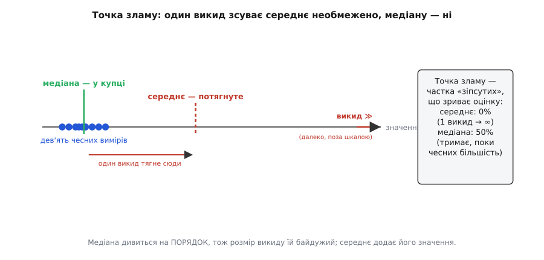
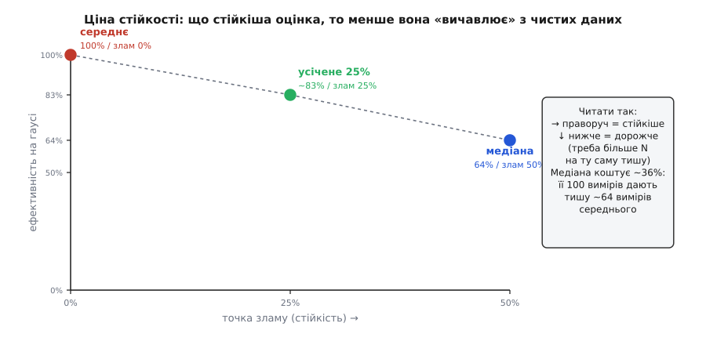

# Робастні оцінки

<preknowlist>
- [Середнє й дисперсія](book:math/mean-variance) — середнє як центр даних, дисперсія й σ як міра розкиду.
- [Виграш усереднення](book:math/averaging-gain) — чому середнє з N незалежних вимірів має розкид σ/√N.
- [Нормальний розподіл](book:math/normal-distribution) — гаусова «дзвіниця» та її щільність, зокрема висота піка.
</preknowlist>

Маємо десять вимірів однієї величини — давач мав би показувати 0.12. Дев'ять лягли купкою: 0.10, 0.11, 0.13, 0.12… А десятий раптом вискочив на 3.5 — щось смикнуло вхід саме тоді. Обчислимо два звичні «центри» цієї десятки. Середнє поповзло аж на 0.46 — його потягнув той єдиний викид. Медіана (значення посеред вишикуваного ряду) лишилася на 0.12, наче нічого й не сталося. Одне брехливе число зруйнувало одну оцінку й не зачепило другу. Чому?

Питання не риторичне, і відповідь — не «медіана краща». Відповідь у тому, що середнє й медіана дивляться на дані по-різному, і кожна відмінність має точну ціну, яку можна порахувати. Тут ми рахуємо обидві сторони: наскільки медіана стійкіша (виявиться — рівно вдвічі витриваліша, ніж узагалі може бути оцінка) і скільки ця стійкість коштує на чистих даних (виявиться — рівно 2/π ≈ 64% ефективності). А тоді знайдемо оцінки, що беруть краще з обох світів.

## Оцінка, викид, точка зламу

Домовимося про три слова. Правило, яким з кількох вимірів дістають одне число — свою найкращу здогадку про справжнє значення, — назвемо **оцінкою** (англ. *estimator* — той, що оцінює). Середнє — оцінка. Медіана — теж оцінка. Уся стаття про одне: яка оцінка краще тримається, коли серед чесних вимірів трапляється брехливий.

Брехливий вимір назвемо **викидом** (англ. *outlier* — те, що лежить осторонь). Викид — це не просто трохи більший шум; це число, що народилося не з того самого джерела, що решта. Дев'ять вимірів юрмляться довкола 0.12, а десятий показує 3.5 — бо саме тоді у вхід ударила стороння завада. Це чуже число, що затесалося в чесну компанію, і весь фокус у тому, як оцінка на нього реагує.

**Медіана** (лат. *medianus* — серединний) — вишикуй виміри за зростанням і візьми той, що стоїть **посередині** ряду (для парної кількості — середнє двох центральних). Ключове слово — «посередині за **порядком**». Медіана не додає значень, вона їх **ранжує**: її цікавить лише, хто за ким стоїть, а не наскільки хтось більший.

Тепер — головне поняття, те, що перетворює розпливчасте «медіана стійкіша» на число. **Точка зламу** (англ. *breakdown point*) оцінки — це **найменша частка зіпсутих вимірів, якої досить, щоб зірвати оцінку в нескінченність**, зробити її як завгодно хибною. Простіше: скільки викидів витримує оцінка, поки ще тримається за правду. Що вища точка зламу — то стійкіша оцінка. Це поняття ввів Френк Хампель (1971); зручне «скінченне» формулювання для вибірки дали Девід Донохо й Петер Губер (1983). Воно й є мірою робастності (англ. *robust* — витривалий, стійкий до збурень), яку ми шукаємо.

> 🔧 **Навіщо це.** Точка зламу відповідає на практичне питання «скільки лихих вимірів мій спосіб переживе, перш ніж почне брехати». Знаючи це число для кожної оцінки, ти обираєш спосіб не за відчуттям, а за тим, скільки завад реально чекаєш у даних.

## Чому середнє беззахисне, а медіана — фортеця

Крихкість середнього найлегше побачити на очах. Візьми дев'ять чесних вимірів довкола 0.12 і повільно **відсувай** десятий праворуч: 1, 10, 1000, мільйон. Що робить середнє? Слухняно повзе слідом — бо середнє це сума, поділена на кількість, а в сумі кожен вимір присутній **своїм повним значенням**. Відсунув викид на мільйон — середнє поїхало на сто тисяч. Одне-єдине число здатне затягти середнє куди завгодно далеко.


*Дев'ять чесних вимірів лягли купкою ліворуч; десятий — величезний викид, що не влазить у шкалу. Середнє (пунктирне) потягнуте викидом далеко праворуч, геть від правди. Медіана стоїть у самій купці — бо викид опинився скраю ряду, і на серединний елемент його розмір не впливає.*

Ось чому **точка зламу середнього — 0%**. Не «мала», а рівно нуль: достатньо **одного** зіпсутого виміру з нескінченним значенням, і середнє зірване, хоч скільки б чесних його оточувало. Частка «один із N» прямує до нуля зі зростанням N — тому й кажуть «нульова точка зламу». Середнє демократичне до згубного: воно вислуховує кожного однаково уважно, зокрема й брехуна, що кричить гучніше за всіх.

Є й другий бік тієї самої крихкості, суто арифметичний. Середнє мінімізує суму **квадратів** відхилень, а квадрат робить далеке ще далекішим: вимір, що відхилився вдесятеро сильніше, тисне на середнє в сто разів дужче. Викид входить у дисперсію квадратом — і саме квадрат є тим механізмом, яким одне число перекрикує сотню. Точка зламу дивиться на цю беззахисність якісно («скільки витримає»), квадрат у дисперсії — кількісно («наскільки потягне кожен»); це дві проєкції однієї слабкості суми.

А тепер медіана — і тут уся краса. Відсувай той самий викид праворуч: 10, 1000, мільйон. Що з медіаною? **Нічого.** Викид, хоч би яким величезним він став, лишається одним елементом **скраю** вишикуваного ряду. А медіану визначає той, хто стоїть **посередині**, і йому байдуже, чи крайній сусід більший за нього вдвічі чи в мільярд разів. Медіана бачить лише **порядок**, а порядок від розміру викиду не змінюється: найбільший так і лишається найбільшим, де б він не опинився.

Щоб зрушити медіану, викид мусить не просто бути великим — він мусить **перейти на інший бік** середини, тобто змінити, хто стоїть у центрі. А для цього викидів має набратися **стільки ж, скільки чесних вимірів**: поки чесних більшість, центр ряду сидить серед них, і жоден натовп велетнів скраю до нього не дотягнеться. Ось звідки **точка зламу медіани — 50%**: медіана тримається, аж поки зіпсутих не стане половина. Це найвище значення, яке точка зламу взагалі може мати, — бо коли зіпсутих уже більшість, жодна оцінка не відрізнить, де правда, а де підміна (понад половину розрізнити неможливо в принципі).

Дві оцінки — два характери. Середнє **складає** і тому вразливе до величини кожного. Медіана **ранжує** і тому глуха до величини крайніх. Річ не в тім, що медіана «краща», — а в тім, на що кожна дивиться.

## Ціна стійкості в числах

Якщо медіана така незламна, чому ж не брати її завжди? Бо стійкість не безплатна. За неї платять **ефективністю** — тим, наскільки повно оцінка вичавлює точність із чесних даних, коли викидів немає. І тут медіана програє середньому — рівно настільки, наскільки виграє в стійкості. Виведемо цю ціну від першопричини.

### Розкид середнього

Одну половину порівняння дає класичний результат про усереднення. Якщо кожен незалежний вимір має розкид σ, то середнє з N вимірів має розкид σ/√N; мовою дисперсії (квадрата розкиду) це:

```
дисперсія середнього:  σ²(x̄) = σ² / N
```

Це наш еталон — найкраще, що можна вичавити з N вимірів за гаусового шуму. Чому саме так і чому середнє тут оптимальне, виводить [виграш усереднення](book:math/averaging-gain); нам воно потрібне як **точка відліку**, з якою порівнюватимемо медіану.

### Розкид медіани

Розкид **медіани** дається складніше — і саме він розкриває ціну стійкості. Виведемо його ідею, не занурюючись у повну теорію порядкових статистик.

Уяви, що ти взяв N вимірів, знайшов медіану; тоді взяв **нову** пачку N вимірів — і знову медіану. І ще, і ще. Ці медіани самі трохи різнитимуться між собою — питання в тому, наскільки. Медіана — це значення m, нижче якого лежить рівно половина вимірів. Тож дрож медіани від пачки до пачки залежить від того, як **щільно виміри юрмляться довкола середини**: якщо їх там густо, межа «половина нижче / половина вище» стоїть твердо, ледь ворушиться; якщо ж біля середини вимірів рідко, та сама межа гуляє туди-сюди помітно.

«Наскільки густо виміри біля середини» — це в точності **щільність розподілу** шуму в точці медіани, яку позначають f(m). Строга теорія (асимптотична нормальність вибіркової медіани) дає точну формулу через цю щільність:

```
дисперсія медіани:  σ²(med) ≈ 1 / (4 · N · f(m)²)
```

Прочитаймо її, перш ніж підставляти числа: розкид медіани тим **менший**, чим **щільніше** виміри довкола середини (більше f(m)) — рівно як підказала інтуїція про тверду межу. І так само спадає з N. Формула загальна, придатна для будь-якого шуму; лишилося підставити наш, гаусів.

### Зведення докупи: рівно 2/π

Для гаусового (нормального) шуму зі стандартним відхиленням σ щільність у самій середині, де вона найвища, дорівнює f(m) = 1/(σ·√(2π)) — це висота піка [нормального розподілу](book:math/normal-distribution). Підставимо це в щойно виведену формулу — і вся арифметика ціни розкриється сама:

```
гаусів шум:   f(m) = 1/(σ·√(2π))   →   f(m)² = 1/(2π·σ²)
підставляємо: σ²(med) ≈ 1/(4·N · 1/(2π·σ²)) = 2π·σ²/(4N) = (π/2)·σ²/N
```

Ось обидві дисперсії поряд, і все стає ясно:

```
середнє:  σ²(x̄)  = σ²/N              ← еталон
медіана:  σ²(med) ≈ (π/2)·σ²/N ≈ 1.571·σ²/N
```

Дисперсія медіани в **π/2 ≈ 1.571** раза більша за дисперсію середнього. Це ціна стійкості в чистому вигляді. Переведімо її у дві звичні мови.

Мовою **розкиду** (самого σ — кореня з дисперсії): розкид медіани більший у √(π/2) ≈ **1.25** раза. Медіана з тієї самої пачки тремтить на чверть сильніше за середнє.

Мовою **ефективності** — «яку частку даних оцінка використовує з користю». Ефективність визначають як відношення дисперсій, і воно виходить обернене:

```
ефективність медіани = σ²(x̄) / σ²(med) = 1 / (π/2) = 2/π ≈ 0.6366
```

**≈64%.** Зміст цього числа дуже конкретний: медіана зі 100 вимірів дає таку саму тишу, як середнє лише з **64** вимірів. Решту 36 зі ста медіана фактично витрачає намарне — це і є плата за незламність. (Результат класичний: асимптотична відносна ефективність медіани проти середнього на нормальному шумі рівно 2/π.)

> 🔧 **Навіщо це.** 64% — це прямий перерахунок кількості даних. Хочеш **тієї самої** чистоти, що дало б середнє з 64 вимірів, але фільтруєш медіаною? Бери ≈100 вимірів. Для тихих даних без викидів це чистий програш — бери середнє; для даних із поодинокими завадами півтора раза вимірів дешевші за один зіпсутий результат.

## Усічене середнє: золота середина

Отже, ми в лещатах. Середнє — 100% ефективності, 0% стійкості. Медіана — 50% стійкості, лише 64% ефективності. Невже треба обирати одну крайність? Ні. Між ними лежить сімейство компромісів, і найпростіший — **усічене середнє** (англ. *trimmed mean* — підстрижене середнє).

Ідея очевидна, щойно глянути на неї як на суміш двох попередніх. Викиди сидять **скраю** вишикуваного ряду. То **відкинь** k найменших і k найбільших вимірів, а решту, серединні, **усередни** звичайно. Викиди відлетять разом із крайніми й не потраплять у суму, а всередині ти повертаєш собі всю силу усереднення по тому, що лишилось.

Поглянь, як усічене середнє плавно з'єднує дві крайності. Не відкидаєш нічого (k = 0) — це рівно середнє: вся ефективність, нуль стійкості. Відкидаєш усе, крім центрального, — лишається сам центральний елемент, тобто рівно медіана: максимум стійкості ціною ефективності. А поміж ними — плавна шкала: що більше відкидаєш, то стійкіше й то дорожче.


*Три оцінки на площині «стійкість (точка зламу) — ефективність на гаусовому шумі». Середнє — верхній лівий кут (100% ефективності, 0% стійкості). Медіана — правий (64% ефективності, 50% стійкості). Усічене середнє лежить між ними на кривій компромісу: відкинувши по чверті з кожного боку, маєш ≈83% ефективності при 25% точки зламу. Праворуч і нижче — стійкіше, але дорожче.*

Точка зламу усіченого середнього рахується просто: якщо відкидаєш частку α вимірів з **кожного** боку, оцінка витримує до α викидів, перш ніж зіпсутий елемент прорветься крізь підрізку в суму. Відкинув по 10% — точка зламу 10%; по 25% — 25%. Ефективність же на гаусовому шумі падає з α повільно й помірно: відкинувши навіть по 25% з кожного краю (половину всіх вимірів!), зберігаєш ще ≈83% ефективності — куди більше за 64% медіани, а стійкість уже пристойна. Ось чому усічене середнє — робочий кінь там, де викиди рідкісні, але можливі: майже вся точність середнього плюс надійний захист від поодиноких завад.

Зручність усіченого середнього ще й у тому, що вся потрібна робота — вишикувати виміри за порядком — робиться заразом. Відсортував N вимірів — і замість брати самий центр (медіану), усередни центральні N − 2k. Один і той самий відсортований ряд дає на вибір і медіану, і будь-яке усічене середнє: різниця лише в тому, скільки елементів із середини ти складеш.

## Спершу медіана, потім усереднення

Є ще один прийом, найпоширеніший на практиці, і числа показують, **чому** ця двоступенева схема така вдала — і чим вона відрізняється від усіченого середнього.

Логіка — поділ праці між двома різними бідами. Викиди й дрібний рівномірний шум — це **дві окремі напасті**, і кожна має свій найкращий лік. Проти викидів немає нічого стійкішого за ранжування (медіану), бо воно глухе до їхньої величини. Проти рівномірного гаусового шуму немає нічого ефективнішого за усереднення, бо воно вичавлює всі 100% (той самий √N). Тож розумно напустити на кожну біду її природного ворога, а не шукати один прийом на обидві.

Схема така. Розбий довгу серію вимірів на невеликі групи — скажімо, по 5. У кожній візьми **медіану** — це вбиває будь-який поодинокий викид усередині групи (доки в п'ятірці не більше двох завад, медіана чиста). Тепер у тебе потік «очищених» медіан, у якому викидів уже нема, зате лишився звичайний шум. І цей чистий потік **усередни** — тут працює повний виграш кореня, бо гасити лишилося саме той рівномірний шум, для якого усереднення й створене.

```
серія:   x₁ x₂ x₃ x₄ x₅ | x₆ x₇ x₈ x₉ x₁₀ | …   ← групи по 5
крок 1:  m₁ = median(перша п'ятірка)             ← вбиває викид у групі
         m₂ = median(друга п'ятірка)
крок 2:  результат = (m₁ + m₂ + …) / K            ← усереднення гасить шум
```

Чим це краще за просте усічене середнє на всій серії? Стійкістю до **черг** викидів. Усічене середнє відкидає фіксовану частку **всієї** серії з країв — і якщо викиди збилися разом (завада стукнула кілька разів поспіль), вони можуть переповнити підрізку. А групова медіана дає кожній маленькій групі **власний** бар'єр міцності 50%: щоб зіпсувати результат, викиди мусять становити більшість **у кожній** групі окремо — куди суворіша умова. Платиш за це трохи більшою втратою ефективності (кожна медіана-з-5 несе свої 64%, хоч і частково компенсовані усередненням поверх), зате купуєш захист, що не тріскається від пачок завад.

## Worked-приклад: три оцінки на одних даних

**Умова.** Сім вимірів однієї величини: 10, 11, 12, 11, 13, 12, 98. Шість юрмляться довкола 11–12, сьомий (98) — очевидний викид. Порахуймо три оцінки й подивімось, котра каже правду.

```
дані (за порядком):  10  11  11  12  12  13  98

середнє:   (10+11+12+11+13+12+98) / 7 = 167 / 7 ≈ 23.9   ← викид потягнув удвічі вище за всі чесні
медіана:   серединний (4-й з 7) елемент            = 12    ← стоїть просто в купці
усічене (відкинь по 1 з країв):  (11+11+12+12+13) / 5 = 59 / 5 = 11.8   ← 98 і хиб-мінімум 10 відлетіли
```

Середнє ≈ 23.9 не схоже на жоден чесний вимір — воно бреше, бо додало 98 повним значенням. Медіана 12 і усічене середнє 11.8 обидва лягли просто в купку чесних даних. Викид відкинув усічене середнє лише трохи (він відлетів разом із крайнім знизу), а медіани не торкнувся зовсім: 12 стояв би посередині ряду, хоч би сьомий вимір був 98 чи 98000. Ось точка зламу в дії — на семи числах, які можна перерахувати в голові.

## Де ці числа працюють

Дві прості поради про викиди — «проти різких завад бери медіану» і «медіана коштує точності» — виявилися не порадами, а числами.

«Медіана стійкіша» має міру: **точка зламу** медіани — 50% проти 0% у середнього. Один викид у нескінченність зриває середнє (бо воно **складає** значення) і не зрушує медіану (бо вона **ранжує**, а порядок від розміру крайнього не залежить).

«Медіана коштує точності» має ціну: на гаусовому шумі її ефективність — **2/π ≈ 64%**, бо дисперсія медіани (π/2)·σ²/N проти σ²/N у середнього. Сто вимірів медіаною = тиша від 64 вимірів середнім. Між двома крайнощами лежить **усічене середнє** (відкинь k з кожного краю — точка зламу k/N, ефективність спадає повільно), а найкращий практичний прийом — **медіана в малих групах, тоді усереднення поверх**: кожен інструмент проти своєї біди.

Лишається застереження, що рятує від класичної помилки. І медіана, і усереднення борються з **випадковим** розкидом (медіана — з рідкісним-різким, усереднення — з рівним-дрібним). Проти **сталого зсуву** — систематичної похибки, однакової в кожному вимірі — безсилі обидві: скільки не бери медіан, систематичний недобір нікуди не дінеться, його знімає лише калібрування. А коли вікно вимірів довге (десятки-сотні відліків), перераховувати медіану щоразу з нуля марнотратно — тоді естафету переймає **ковзна медіана**, що підтримує впорядкований буфер і за кожен новий відлік робить лише вставку-видалення; її ідею й реалізацію розбирає [медіанний фільтр](book:algorithms/median-filter) — там і про те, як медіана заразом зберігає гострі краї сигналу, чого усереднення не вміє.
