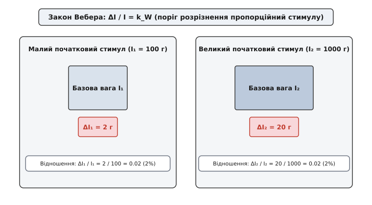
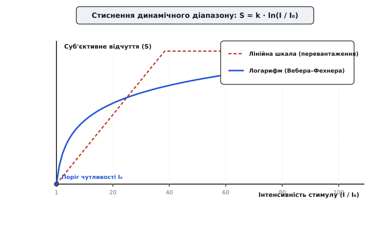
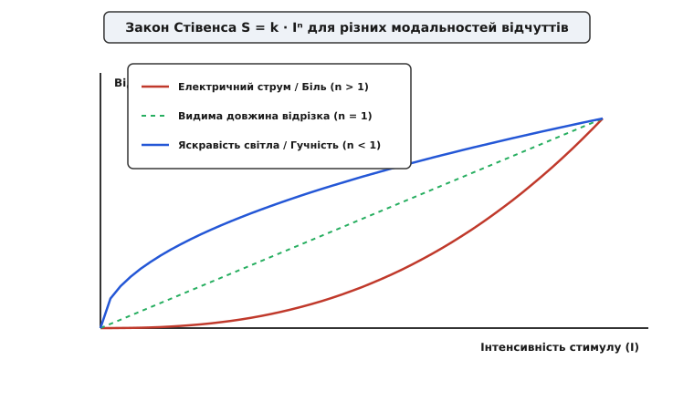

# Закон Вебера–Фехнера

<preknowlist>
- [Децибели](topic:electronics/decibels) — логарифмічна шкала для вимірювання відносного рівня сигналу.
- [Частотна характеристика](topic:electronics/frequency-response) — амплітудно-частотна залежність у логарифмічному масштабі.
</preknowlist>

Людина в темній кімнаті здатна помітити спалах слабкого ліхтарика з світловим потоком 10 люменів, але на залитій сонцем вулиці додавання тих самих 10 люменів до загального потоку в 100 000 люменів залишається абсолютно невидимим. Якби зорова система реагувала на абсолютний фізичний приріст фотонів, око або вигорало б від перевантаження у сонячний день, або втрачало будь-яку чутливість у сутінках. Тіла живих організмів щомиті стикаються з фізичними стимулами, інтенсивність яких змінюється на 10–12 порядків — від тиску звукових хвиль у `20 µPa` на порозі чутності до `20 Pa` біля порогу больового відчуття.

Пряма лінійна передача сигналів у такій ситуації неможлива: жоден біологічний іонний канал і жодна нейронна мережа не мають лінійного динамічного діапазону у трильйон разів. Біологічне вирішення цієї проблеми полягає в логарифмічному стисненні інформації на вході рецепторів. Саме цей фундаментальний біофізичний принцип описує закон Вебера–Фехнера: суб'єктивна інтенсивність відчуття зростає пропорційно логарифму фізичної інтенсивності стимулу.

## Емпіричний закон Вебера та поріг розрізнення

Перший крок до математичного опису сенсорного сприйняття зробив німецький анатом і фізіолог Ернст Генріх Вебер у 1834 році. Досліджуючи соматосенсорну систему та сприйняття ваги, Вебер виявив, що людина оцінює зміну фізичного параметру не за його абсолютною величиною `ΔI`, а за відношенням цієї зміни до початкового значення стимулу `I`.

У сенсорній фізіології мінімальний приріст стимулу, який людина здатна надійно відрізнити від початкового рівня, називають **порогом розрізнення** або **ледве помітною відмінністю** (Just-Noticeable Difference, JND). Згідно з дослідженнями Вебера, для кожної модальності відчуттів відношення порогу розрізнення `ΔI` до початкової інтенсивності `I` є сталою величиною.


*Закон Вебера: ледве помітна відмінність стимулу ΔI зростає пропорційно початковій інтенсивності I, зберігаючи стале відношення k_W.*

Математичне вираження емпіричного закону Вебера має вигляд:

```
ΔI / I = k_W
```

де `k_W` — константа Вебера (дріб Вебера), яка показує відносну чутливість конкретного аналізатора.

Значення константи Вебера суттєво різниться залежно від типу аналізатора та фізичної природи стимулу:

| Сенсорна модальність | Фізичний стимул | Константа Вебера (`k_W`) | Відносна чутливість |
| :--- | :--- | :--- | :--- |
| **Слух (частота)** | Частота звукового тону (1 кГц) | `0.003` | `0.3%` |
| **Зір (яскравість)** | Інтенсивність світла | `0.01` | `1.0%` |
| **Дотик (вага)** | Оцінка важкості предмета | `0.02` | `2.0%` |
| **Слух (гучність)** | Звуковий тиск | `0.088` | `8.8%` |
| **Смак (солоність)** | Концентрація NaCl у розчині | `0.083` | `8.3%` |
| **Нюх (аромат)** | Концентрація пахучої речовини | `0.10–0.25` | `10–25%` |

Якщо людина тримає в руці вантаж 100 грамів, то при `k_W = 0.02` вона помітить збільшення ваги лише тоді, коли додати щонайменше `ΔI = 100 · 0.02 = 2` грами. Якщо ж початковий вантаж становить 1000 грамів, той самий приріст у 2 грами залишиться абсолютно невідчутним: для виникнення відчуття зміни знадобиться приріст у `ΔI = 1000 · 0.02 = 20` грамів.

Причиною такої закономірності є не механічна недосконалість органів чуття, а адаптивна стратегія обробки інформації: рецепторна система оптимізована для виявлення відносних змін у навколишньому середовищі, які мають найбільшу біологічну цінність. Контраст об'єкта відносно фону залишається постійним незалежно від того, розглядаємо ми його при похмурому небі чи при яскравому полуденному сонці. Закон Вебера забезпечує інваріантність сприйняття контрасту до загального рівня освітленості.

Історію формування психофізики як науки, експерименти Вебера та його дискусії з сучасниками детально розкрито у вставці [📜 Народження психофізики: Вебер, Фехнер і Стівенс](topic:physics/weber-fechner/hist-psychophysics-birth.md).

## Логарифмічне осяяння Фехнера

У 1860 році німецький фізик і філософ Густав Теодор Фехнер об'єднав емпіричне спостереження Вебера з математичним апаратом математичного аналізу. Фехнер висунув фундаментальну гіпотезу: **усі одиниці ледве помітної відмінності (JND) викликають однаковий за величиною приріст суб'єктивного відчуття `dS`**.

Якщо кожен пороговий крок відчуття `dS` є сталою величиною `c`, то з формули Вебера `ΔI / I = k_W` випливає диференціальне рівняння психофізики:

```
dS = k · (dI / I)
```

де `k = c / k_W` — коефіцієнт пропорційності, що враховує індивідуальні властивості сенсорної системи.


*Стиснення динамічного діапазону: логарифмічна залежність перетворює 6 порядків фізичного стимулу на рівномірну шкалу відчуттів S.*

Інтегруючи це диференціальне рівняння від абсолютно порогу чутливості `I₀` (при якому суб'єктивне відчуття `S(I₀) = 0`) до довільної інтенсивності `I`, отримуємо основне рівняння закону Вебера–Фехнера:

```
S = k · ln(I / I₀)
```

де `ln` — натуральний логарифм, `I` — фізична інтенсивність стимулу, `I₀` — абсолютний поріг сприйняття (мінімальна інтенсивність сигналу, що здатна викликати відповідь рецептора).

Прикрощам інтегрування, виведенню сталої інтегрування та математичній поведінці функції при граничних значеннях присвячено вставку [🧮 Виведення та математичний апарат закону Вебера–Фехнера](topic:physics/weber-fechner/math-weber-fechner-derivation.md).

Головний наслідок закону Вебера–Фехнера полягає в тому, що **коли фізична інтенсивність стимулу зростає в геометричній прогресії (`I₀, I₀ · q, I₀ · q², I₀ · q³...`), суб'єктивна інтенсивність відчуття зростає в арифметичній прогресії (`0, S₀, 2S₀, 3S₀...`)**. Це забезпечує потужне стиснення даних безпосередньо на периферійному рівні сприйняття.

## Біофізичні та нейрофізіологічні механізми адаптації

Логарифмічна залежність — це не просто емпірична характеристика психологічних відповідей, а наслідок фундаментальних біохімічних і мембранних процесів у рецепторних клітинах. Кожна сенсорна модальність реалізує свій унікальний молекулярний каскад адаптації, який підтримує чутливість у серединному динамічному діапазоні.

### 1. Зоровий фототрансдукційний каскад
У фоторецепторах сітківки (паличках і колбочках) поглинання фотона молекулою родопсину запускає ферментативний каскад за участю G-білка (трансдуцину) та фосфодіестерази (PDE). Фосфодіестераза розщеплює циклічний гуанозинмонофосфат (cGMP), що призводить до закриття cGMP-залежних натрій-кальцієвих каналів мембрани і гіперполяризації клітини.

При низькій інтенсивності освітлення один фотон закриває сотні каналів. Проте при зростанні освітленості вмикається кальцієвий зворотний зв'язок: падіння внутрішньоклітинної концентрації іонів `Ca²⁺` стимулює гуанілатциклазу через білки GCAP (Guanylyl Cyclase Activating Proteins), відновлюючи cGMP, а білок рековерин втрачає кальцій і прискорює фосфорилювання родопсину аррестином. У результаті чутливість фоторецептора авторегульовано знижується пропорційно фоновому потоку світла.

На рівні фоторецепторної відповіді гіперполяризаційний потенціал описується фундаментальним рівнянням Нака–Руштона (Naka-Rushton equation):

```
R / R_max = I^n / (I^n + K^n)
```

де `R` — амплітуда відгуку, `R_max` — максимальна відповідь у насиченні, `K` — інтенсивність напівнасичення, `n` — показник Хілла (`n ≈ 0.7–1.0`). У широкому серединному діапазоні інтенсивностей (`0.1 K < I < 10 K`) рівняння Нака–Руштона аппроксимується логарифмічною кривою Вебера–Фехнера.

### 2. Механотрансдукція у волоскових клітинах слуху
У внутрішньому вусі звукові коливання зсувають стереоцилії волоскових клітин завитки. Стереоцилії з'єднані між собою білковими нитками — верхівковими з'єднаннями (Tip Links). Відхилення пучка стереоцилій механічно натягує Tip Links і відкриває катіонні канали `MET` (Mechanosensitive Electrical Transduction), викликаючи вхід іонів `K⁺` та деполяризацію клітини.

При тривалому або сильному зсуві моторні білки міозину (Myosin 1c та Myosin 15a), які утримують верхівкові з'єднання на актиновому скелеті стереоцилії, ковзають униз під дією входження `Ca²⁺`, зменшуючи натяг нитки. Це відновлює вихідний рівень натягу каналів при новому середовищному тиску. Механічна адаптація волоскової клітини точно реалізує пропорційний відгук Вебера `ΔI / I = k_W`.

Додатково акустичний рефлекс (скорочення стремінцевого м'яза `m. stapedius` у середньому вусі) механічно послаблює передачу звукових коливань від бубняної перетинки до овального вікна при звуках понад 80 дБ, забезпечуючи додатковий логарифмічний аттенюатор потужних звукових сигналів.

### 3. Соматосенсорні механорецептори та швидкість адаптації
Соматосенсорна система використовує чотири основні типи шкірних механорецепторів, які різняться за швидкістю адаптації та розміром рецептивного поля:

1. **Тельця Пачіні (FA II — Fast Adapting Type II):** Швидкоадаптивні рецептори у глибоких шарах дерми. Реагують лише на прискорення та високочастотну вібрацію (50–400 Гц). Пластинчаста капсула тельця Пачіні діє як механічний фільтр високих частот: при постійному тиску рідина між пластинами перерозподіляється, знімаючи напругу з центрального аксона за 10–20 мілісекунд.
2. **Тельця Мейсснера (FA I):** Швидкоадаптивні рецептори поверхневого шару дерми, реагують на низькочастотну вібрацію (10–50 Гц) та ковзання об'єкта по шкірі.
3. **Диски Меркеля (SA I — Slowly Adapting Type I):** Повільноадаптивні рецептори, що постійно генерують імпульси під час стаціонарного тиску. Надають інформацію про форму та текстуру поверхні.
4. **Тельця Руффіні (SA II):** Повільноадаптивні рецептори натягу шкіри та суглобових капсул.

Повільноадаптивні рецептори Меркеля та Руффіні точно дотримуються закону Вебера–Фехнера для стаціонарного тиску, тоді як швидкоадаптивні рецептори Пачіні кодують логарифм швидкості зміщення або амплітуди вібрації.

### 4. Частотне кодування в нервових волокнах (Rate Coding)
Генераторний потенціал рецептора перетворюється у синапсі на частоту потенціалів дії (спайків) у волокнах зорового або слухового нерва. Максимальна частота генерації спайків біологічним аксоном обмежена абсолютним рефрактерним періодом (інактивацією швидких потенціалзалежних натрійних каналів `Na_v1.6`) і рідко перевищує 500–800 Гц.

Логарифмічне стиснення на рівні первинного рецептора дозволяє вкласти 10 порядків фізичної інтенсивності в обмежений біологічний діапазон частот від 10 до 500 Гц. Рефрактерність та інактивація каналів створюють спайкову адаптацію (Spike Frequency Adaptation, SFA), що додатково стискає динамичний діапазон імпульсного потоку на шляху до кори головного мозку.

З точки зору теорії інформації Шеннона, логарифмічна характеристика перетворення є оптимальною для каналів із мультиплікативним шумом (де амплітуда шуму зростає пропорційно амплітуді сигналу). Логарифмічне квантування максимізує взаємну інформацію між фізичним стимулом та спайковим кодом при обмеженій середній частоті розрядів.

## Межі застосовності та степенний закон Стівенса

Закон Вебера–Фехнера є наближеною моделлю, яка працює в середньому діапазоні інтенсивностей стимулу. На межах фізично можливого сприйняття виникають суттєві відхилення:

1. **Поблизу абсолютного порогу (`I ≈ I₀`):** Внутрішні шуми сенсорної системи (термічні коливання мембран, спонтанний розпад фотопігментів) стають співмірними зі стимулом. Дріб Вебера `ΔI / I` різко зростає. Для оптичного сприйняття при дуже низькій освітленості квантові флуктуації світла підпорядковуються статистиці Пуассона (закон Роза–Де Вріса, де `ΔI ∝ √I`), і лише при середніх рівнях освітленості відбувається перехід до закону Вебера (`ΔI ∝ I`).
2. **Поблизу порогу насичення (`I → I_max`):** Усі іонні канали закриті (або відкриті), а нейротрансмітер у синаптичній щілині виснажений. Сенсорна система виходить у плато і втрачає чутливість до приросту.

У 1957 році американський психолог Стенлі Сміт Стівенс, застосувавши метод прямої оцінки величини (Magnitude Estimation), показав, що для багатьох сенсорних систем залежність між відчуттям `S` та стимулом `I` краще описується степенною функцією — **степенним законом Стівенса**:

```
S = k · (I - I₀)ⁿ
```

де `n` — показник степеня, який визначається біофізикою конкретного рецептора та вищих відділів ЦНС.


*Степенний закон Стівенса для різних рецепторних модальностей: сублінійні, лінійні та суперлінійні характеристики відчуття.*

За значенням показника степеня `n` усі сенсорні модальності поділяють на три групи:

1. **Сублінійні модальності (`n < 1`):** Світловий потік (`n ≈ 0.33`), звуковий тиск (`n ≈ 0.6`), запах (`n ≈ 0.55`). Характеризуються стисненням діапазону сигналів, поводячись подібно до логарифма Фехнера.
2. **Лінійні модальності (`n ≈ 1.0`):** Сприйняття видимої довжини відрізка (`n ≈ 1.0`), оцінка часу. Суб'єктивна величина точно відповідає фізичній.
3. **Суперлінійні модальності (`n > 1`):** Електричний струм через шкіру (`n ≈ 3.5`), больове здавлювання (`n ≈ 1.6`), відчуття важкості при граничних навантаженнях. Зростання стимулу викликає прискорене вибухове зростання відчуття.

Суперлінійна характеристика болю має протективне значення для виживання організму: якщо сигнал сигналізує про руйнування тканин, біологічна система не повинна стискати інформацію — навпаки, вона має максимально швидко мобілізувати захисні рефлекси.

Математично доведено, що логарифмічна функція Фехнера є граничним випадком степенної функції Стівенса при прямуванні показника `n` до нуля (`n → 0`). Строге математичне доведення цього граничного переходу через розклад у ряд Тейлора наведено у вставці [🧮 Виведення та математичний апарат закону Вебера–Фехнера](topic:physics/weber-fechner/math-weber-fechner-derivation.md).

## Інженерні та наукові застосування

Логарифмічна природа людського сприйняття лежить в основі багатьох міжнародних стандартів, технічних систем та алгоритмів.

### 1. Акустика та децибели
Оскільки людський слух сприймає гучність логарифмічно, абсолютну виміряну звукову потужність або тиск виражають у децибелах (шкала dBSPL). Зміна рівня звукового тиску на `20 dB` відповідає зміні тиску у 10 разів, але для людського сприйняття це означає приблизно подвоєння суб'єктивної гучності. Детально про децибельні обчислення викладено у [Децибели](topic:electronics/decibels).

Крім того, людська чутливість до гучності залежить від частоти звуку, що описується кривими рівної гучності Флетчера–Мансона (ISO 226:2023). Одиницею суб'єктивної гучності є фон (phon), який на частоті 1000 Гц чисельно дорівнює рівню звукового тиску в децибелах, але на низьких частотах (наприклад 50 Гц) вимагає значно більшої акустичної потужності для досягнення того самого суб'єктивного відчуття.

### 2. Астрономія та шкала зоряних величин
Астрономічна шкала видимої зоряної величини `m`, розроблена Гіппархом і оцифрована Норманом Погсоном у 1856 році, є прямим втіленням закону Вебера–Фехнера. Різниця у 5 зоряних величин відповідає зміні світлового потоку `I` точно в 100 разів:

```
m₂ - m₁ = -2.5 · log₁₀(I₂ / I₁)
```

Зменшення яскравості зорі у `100` разів сприймається оком як зміна зоряної величини на `5` одиниць.

### 3. Комп'ютерна графіка, дисплеї та гамма-корекція
Якби цифрові зображення зберігали яскравість пікселів у лінійній шкалі (наприклад, 8-бітний колір від 0 до 255), людське око легко помічало б ступені квантування в темних ділянках (тінях) і не помічало б різниці між сусідніми рівнями у светлих ділянках (градаціях білого).

Щоб розподілити 256 дискретних рівнів відповідно до логарифмічної чутливості ока, використовують **гамма-корекцію** (sRGB простір):

```
I_out = I_in^γ
```

з коефіцієнтом `γ ≈ 2.2`. Для сучасних дисплеїв із розширеним динамічним діапазоном (HDR) використовують функцію PQ (Perceptual Quantizer, SMPTE ST 2084), побудовану безпосередньо на контрастній чутливості людського ока (крива Бартена), що дозволяє передавати діапазон яскравостей від `0.0001` до `10 000 cd/m²` без видимих смуг квантування за допомогою 10 або 12 бітів.

### 4. Обробка сигналів та компандування (A-law / µ-law)
У цифровій телефонії та аудіокодеках амплітуду мовного сигналу стискають за логарифмічним законом (A-law в Європі, µ-law в США) перед квантуванням аналого-цифровим перетворювачем (АЦП). Це гарантує стале відношення сигналу до шуму квантування для як тихих, так и гучних звуків.

Програмну реалізацію та алгоритми моделювання логарифмічних сенсорних шкал наведено у вставці [⚙️ Моделювання сенсорної адаптації та шкал сприйняття](topic:physics/weber-fechner/proj-sensory-scale-sim.md).

> 🔧 **Навіщо це.**
> Розуміння закону Вебера–Фехнера є необхідним при розробці користувацьких інтерфейсів (UI/UX), регуляторів гучності, системи керування яскравістю екранів та обробки аудіо/відео сигналів. Якщо ви створюєте слайдер регулювання яскравості чи гучності і робите його шкалу лінійною, користувач відчує, що 90% діапазону регулювання сконцентровано на перших 10% ходу повзунка. Щоб регулювання здавалося людині плавним і природним, передавальна характеристика елемента керування мусить бути логарифмічною або степенною.
