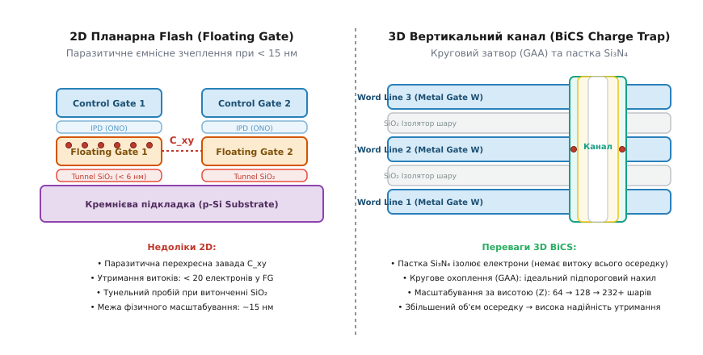
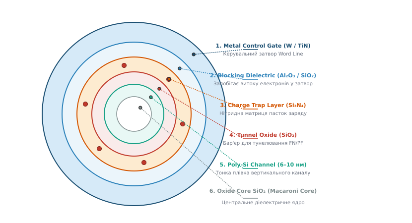
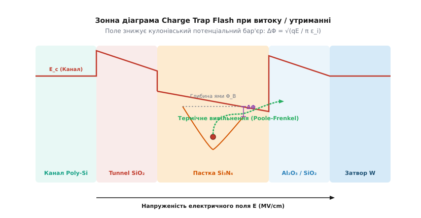
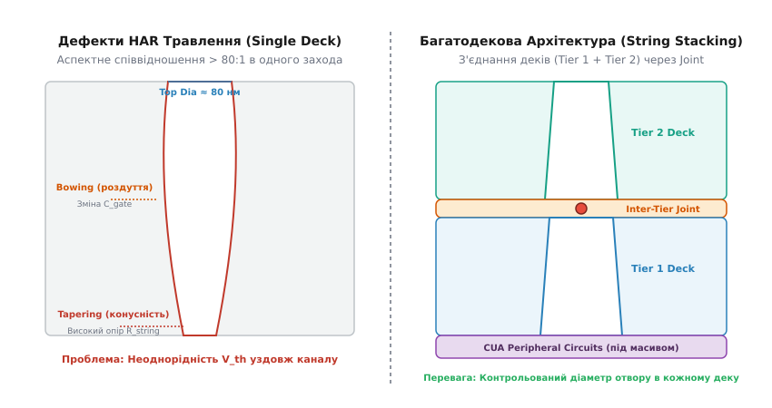

# 3D NAND: фізика вертикального стека

<preknowlist>
- [Зонна теорія твердого тіла](book:physics/band-theory) — формування енергетичних зон, потенціальні бар'єри та розподіл електронних станів у кремнії та діелектриках.
- [Термоелектронна та автоелектронна емісія (Річардсон — Фаулер — Нордгейм)](book:physics/thermal-field-emission) — тунелювання електронів крізь потенціальний бар'єр під дією сильного електричного поля.
- [Пробій діелектриків](book:physics/dielectric-breakdown) — інжекція носіїв, струми витоку та утворення дефектів у тонких оксидних плівках.
</preknowlist>

При зменшенні топологічного розміру двовимірної (*2D Planar*) Flash-пам'яті нижче позначки 15 нанометрів фізика твердого тіла поставила нездоланний тупик. Відстань між сусідніми плаваючими затворами (*floating gates*, від англ. *gate* — затвор) скоротилася до кількох десятків атомних шарів, що викликало катастрофічне паразитичне ємнісне зчеплення, а об'єм полікремнієвого осередку зменшився настільки, що бітовий стан «0» чи «1» кодувався всього 10–20 електронами. Спроба зменшити товщину тунельного діелектрика SiO₂ нижче 6 нанометрів призводила до вибухового зростання струмів тунелювання Фаулера — Нордгейма в режимі очікування, позбавляючи осередки здатності тримати заряд роками.

Виходом із фізичного глухого кута став перехід від плоского літографічного звуження у площині X-Y до вертикального нарощування шарів уздовж осі Z — створення тривимірної архітектури **3D NAND**.

## 1. Фізична межа плоского планарного масштабування

Щоб зрозуміти необхідність тривимірного стека, розберемо фізичні деструктивні чинники, які зупинили літографічне вдосконалення 2D Flash.

У планарному транзисторі з плаваючим затвором елемент пам'яті являє собою класичний MOSFET, у якому між підкладкою та керувальним затвором вбудований ізольований шар провідного полікремнію. Заряд, інжектований у цей плаваючий затвор, змінює порогову напругу `V_th` транзистора, що дозволяє розрізняти зчитаний стан.

```
2D Floating Gate:                      3D Vertical Channel Charge Trap:
+-------------------+                  +-------------------------------+
| Control Gate (CG) |                  | Word Line Gate (W Metal)      |
+-------------------+                  +-------------------------------+
| Inter-poly Oxide  |                  | Blocking Dielectric (Al₂O₃)   |
+-------------------+   crosstalk C_xy +-------------------------------+
| Floating Gate(FG1)| <~~~~~~~~~~~~~~> | Charge Trap Layer (Si₃N₄)     |
+-------------------+                  +-------------------------------+
| Tunnel SiO₂       |                  | Tunnel SiO₂ Oxide             |
+-------------------+                  +-------------------------------+
| Substrate (p-Si)  |                  | Vertical Poly-Si Channel      |
+-------------------+                  +-------------------------------+
```

При зменшенні розміру осередку `F` виникли три фундаментальні фізичні бар'єри:

1. **Паразитичне ємнісне зчеплення (`C_xy`):** Ємність між плаваючими затворами сусідніх осередків зростала обернено пропорційно відстані між ними. Запис заряду в осередок `A` створював індукований потенціал на плаваючому затворі сусіднього осередку `B`, зсуваючи його порогову напругу на величину `ΔV_th = (C_xy / C_total) · ΔV_FG`. При `F < 15` нм розширена перехресна завада (*crosstalk*) зробила неможливим надійне розрізнення 8 або 16 рівнів напруги у багатобітових осередках (TLC/QLC).
2. **Статистика кількості електронів та флуктуація випадкових домішок:** При об'ємі полікремнієвого затвора 15 × 15 × 10 нм³ повний діапазон між стираним стан «1» і записаним стан «0» контролювався лише 15–20 електронами. Випадкова термічна флуктуація або втрата кількох носіїв через мікроскопічний дефект у діелектрику викликала спотворення бітового стану. Одночасно дискретність атомарного легування каналу (*Random Dopant Fluctuation*, RDF) створювала хаотичний зсув порогової напруги від осередку до осередку.
3. **Квантове тунелювання витоку та пробій:** Зменшення товщини тунельного оксиду SiO₂ нижче 6 нанометрів призводило до прямих тунельних витоків електронів у підкладку без прикладання зовнішнього поля. Накопичувач втрачав здатність зберігати дані протягом гарантованого 10-річного терміну. Повторні цикли запису та стирання генерували пастки у діелектрику (*stress-induced leakage current*, SILC), прискорюючи деградацію.


*Зліва: паразитичне ємнісне зчеплення C_xy між плаваючими затворами у плоскому 2D масиві при розмірах менше 15 нм. Справа: тривимірна архітектура вертикального каналу BiCS із круговим затвором GAA та нітридною пасткою заряду Si₃N₄.*

Рішенням стало розчеплення геометричного розміру від роздільної здатності фотолітографії. Відмовившись від провідного плаваючого затвора, інженери перейшли до технології **Charge Trap Flash (CTF)** із ізольованим діелектриком та сформували вертикальний канал, розібраний у [історії переходу до 3D NAND та архітектури BiCS](book:physics/condensed-matter-physics/3d-nand-architecture/hist-bics-revolution.md).

## 2. Геометрія та електростатика вертикального каналу BiCS / TCAT

У 3D NAND пам'яті фізична орієнтація каналу транзистора змінюється з горизонтальної на вертикальну. Замість того, щоб формувати окремі транзистори на площині кремнію, на підкладку послідовно наносять альтернативні шари металевих затворів (Word Lines) та ізолюючого діоксиду кремнію SiO₂. Після цього за допомогою глибокого реактивного іонного травлення (*High-Aspect-Ratio Etching*) у цьому стеку пробиваються мільярди наскрізних циліндричних отворів.

Усередині кожного отвору послідовно осаджуються функціональні шари, утворюючи структуру кругового затвора **Gate-All-Around (GAA)**.

```
                     Вертикальна вісь Z
                             │
       ┌─────────────────────┼─────────────────────┐
       │   Control Gate W    │   Control Gate W    │
       ├─────────────────────┼─────────────────────┤
       │   Al₂O₃ Blocking    │   Al₂O₃ Blocking    │
       ├─────────────────────┼─────────────────────┤
       │   Si₃N₄ Charge Trap │   Si₃N₄ Charge Trap │
       ├─────────────────────┼─────────────────────┤
       │   SiO₂ Tunnel Oxide │   SiO₂ Tunnel Oxide │
       ├─────────────────────┼─────────────────────┤
       │   Poly-Si Channel   │   Poly-Si Channel   │
       └─────────────────────┼─────────────────────┘
                             │
                      SiO₂ Oxide Core
```

Електростатична перевага циліндричного затвора GAA є фундаментальною. У планарному 2D транзисторі затвор притискає канал лише з одного (верхнього) боку, через що електричне поле стоку здатне проникати під затвор, викликаючи ефект зниження бар'єра, індукований стоком (DIBL — *Drain-Induced Barrier Lowering*). У циліндричній геометрії затвор оточує напівпровідниковий канал по всьому колу на 360°.

Це забезпечує повне збіднення тонкої напівпровідникової плівки (*Fully Depleted Channel*) та створює ідеальний контроль потенціалу в центрі каналу:

```
S = (d(log₁₀ I_d) / dV_g)⁻¹ = (k_B · T / q) · ln(10) · (1 + C_d / C_ox)
```

Завдяки циліндричному охопленню ємність затвора `C_ox` суттєво перевищує ємність збідненої області `C_d`, завдяки чому підпороговий нахил `S` наближається до свого теоретичного мінімуму для кімнатної температури (`S ≈ 60` мВ/дек). Це дозволяє різко відсікати струм у закритому стані транзистора (`I_off < 10⁻¹⁴` А) та забезпечує високу крутизну характеристики при зчитуванні.


*Концентричні радіальні шари вертикального осередку 3D NAND: від зовнішнього вольфрамового затвора (Word Line) крізь блокуючий High-k діелектрик Al₂O₃, нітридну пастку Si₃N₄ та тунельний SiO₂ до тонкої плівки полікремнію та центрального оксидного ядра Macaroni Core.*

Внутрішня будова вертикального каналу містить ключову конструктивну особливість — структуру **Macaroni** (від італ. *maccheroni* — трубка). Замість суцільного стержня полікремнію канал робиться у вигляді тонкостінної трубки товщиною всього 6–8 нанометрів, внутрішній простір якої заповнюється діелектриком SiO₂.

У суцільному полікремнієвому стержні через високу товщину каналу електричне поле не здатне вирівняти потенціал у центрі. Натомість порожниста структура Macaroni усуває об'ємний шар і гарантує, що вся товщина напівпровідникового каналу знаходиться під впливом поверхневого потенціалу інверсії.

Польна фізико-структурна характеристика та геометричні параметри цих шарів описані у вставці [Будова вертикального каналу Macaroni та ONO-стека](book:physics/condensed-matter-physics/3d-nand-architecture/comp-macaroni-channel.md).

## 3. Носії заряду та фізика френкелівського тунельного транспорту

На відміну від 2D Flash, де електрони накопичувалися у суцільному провідному полікремнієвому плаваючому затворі, в 3D NAND пам'яті використовується матричний ізолятор — аморфний нітрид кремнію (Si₃N₄).

У матриці Si₃N₄ через відсутність дальнього порядку виникає висока концентрація структурних дефектів — розірваних кремнієвих зв'язків, які називаються K⁰-центрами. Ці дефекти утворюють локалізовані кулонівські потенціальні ями (пастки заряду) у забороненій зоні нітриду з енергетичною глибиною `Φ_B ≈ 1.05` еВ від дна зони провідності.

```
       E_c (Зона провідності Si₃N₄)
────────────────────────────────────────────────────
                                      ▲
                                      │ ΔΦ = √(q·E / π·ε_i)
            ─────────                 ▼
           /         \           ──────────── (Знижений бар'єр)
          /           \         /
         /  Кулонівська\       /
        /     яма       \     /
       /      Φ_B        \   /
──────┴───────────────────┴─┴───────────────────────
           • (Електрон у пастці)
```

При перезарядці дефекту відбуваються термоподібні амфотерні переходи: порожня пастка `K⁺` захоплює електрон і переходить у нейтральний стан `K⁰`, після чого додатковий електрон утворює негативний стан `K⁻`.

Коли електрон тунелює крізь тунельний оксид SiO₂ під час запису, він захоплюється однією з таких ям і стає повністю локалізованим у просторі. Навіть якщо в тунельному діелектрику поруч виникне локальний точковий дефект пробою, витечуть лише ті електрони, що знаходяться безпосередньо біля дефекту; решта заряду в масиві Si₃N₄ лишиться неушкодженою.

Проте під час зберігання даних та в режимах читання, коли до керувального затвора прикладено помірне електричне поле `E`, у шарі Si₃N₄ виникає струм витоку, що описується ефектом **Френкеля — Пуля** (*Poole-Frenkel Emission*, від прізвищ фізиків Якова Френкеля та Горація Пуля).

Фізична сутність ефекту полягає в тому, що зовнішнє електричне поле `E` спотворює симетричний кулонівський потенціал пастки. Потенціальна енергія електрона у полі набуває вигляду:

```
U(x) = - q² / (4 · π · ε_i · x) - q · E · x
```

де `q` — заряд електрона, `ε_i = ε_r · ε_0` — оптична діелектрична проникність матеріалу, `x` — координата.

Нахил потенційного профілю під дією поля знижує висоту потенціального бар'єра в напрямку поля на величину `ΔΦ`:

```
ΔΦ = √(q³ · E / (π · ε_i))
```


*Зонна діаграма структури Charge Trap Flash при витоку заряду. Зовнішнє електричне поле E викривляє дно зони провідності та знижує кулонівський бар'єр пастки на величину ΔΦ, полегшуючи термоподібне вивільнення електронів у зону провідності Si₃N₄.*

Через зменшення висоти бар'єра від `Φ_B` до `(Φ_B - ΔΦ)` імовірність термічної іонізації електрона з ями згідно з розподілом Больцмана зростає експоненційно. Підсумкове рівняння для густини струму Френкеля — Пуля `J_PF` описується формулою:

```
J_PF = C · E · exp(- q · (Φ_B - √(q · E / (π · ε_i))) / (k_B · T))
```

де `C` — константа матеріалу, `k_B` — стала Больцмана, `T` — абсолютна температура в кельвінах.

На відміну від емісії Шотткі (*Schottky Emission*), яка визначається інжекцією носіїв через поверхневий бар'єр на межі `Метал-Діелектрик`, ефект Френкеля — Пуля є внутрішньооб'ємним ефектом іонізації нейтральних дефектів у товщі нітриду.

Важливо чітко розрізняти два тунельні механізми, які визначають роботу 3D NAND:
- **Тунелювання Фаулера — Нордгейма (FN Tunneling):** Домінує при високих полях (`E > 8` МВ/см) під час операцій запису та стирання (`V_pgm ≈ 20` В). Електрони тунелюють крізь трикутний бар'єр тунельного оксиду SiO₂. Струм майже не залежить від температури, але надзвичайно сильно залежить від напруги.
- **Емісія Френкеля — Пуля (PF Emission):** Домінує при помірних полях (`E ≈ 1–3` МВ/см) та підвищених температурах (85–125 °C) у режимі зберігання даних. Носії термічно вивільняються з пасток нітриду Si₃N₄, знижених полем, що викликає повільний витік заряду та дрейф порогової напруги `ΔV_th` з часом.

Повний математичний розв'язок рівнянь потенціального максимуму та виведення нахилу графіків Френкеля — Пуля наведено у вставці [Математична модель та виведення транспорту Френкеля — Пуля](book:physics/condensed-matter-physics/3d-nand-architecture/math-poole-frenkel.md).

## 4. Динаміка інжекції заряду та алгоритм програмування ISPP

Точний контроль кількості накопичених електронів у нітридній пастці є фундаментальною умовою функціонування багатобітових осередків пам'яті (MLC, TLC, QLC). Оскільки в одному осередку TLC зберігається 3 біти інформації, діапазон порогових напруг розділяється на 8 дискретних станів (від стираного стану `Erase` до найвищого programmed-стану `P7`). Проміжок між сусідніми станами складає менше 0.5 Вольта.

Щоб потрапити в цей вузький довірчий інтервал без перевищення заряду (*over-programming*), фізичний процес запису виконується не одним тривалим імпульсом, а серією коротких наростаючих імпульсів за алгоритмом **ISPP** (*Incremental Step Pulse Programming*).

Фізичний цикл ISPP складається з двох послідовних фаз, що повторюються у циклі:
1. **Фаза програмування (Program Pulse):** На обрану слівну лінію Word Line подається імпульс високої напруги `V_pgm` тривалістю 10–20 мікросекунд, який інжектує порцію електронів у нітрид Si₃N₄ за механізмом Фаулера — Нордгейма.
2. **Фаза перевірки (Verify Pulse):** На затвор подається контрольна напруга перевірки `V_verify`. Контролер зчитує струм вертикального каналу: якщо порогова напруга осередку досягла цільового значення `V_th_target`, інжекція припиняється (осередок блокується вихідною напругою на бітовій лінії). Якщо поріг не досягнуто, напруга програмування збільшується на фіксований крок `ΔV_pgm ≈ 0.2–0.4` Вольта, і крок повторюється.

Зсув порогової напруги після кожного кроку програмування лінійно повторює приріст напруги імпульсу: `ΔV_th ≈ ΔV_pgm`. Це дозволяє утримувати ширину статистичного розподілу порогових напруг осередків у межах 0.15–0.20 Вольта.

Одночасно при програмуванні обраного осередку на тій самій слівній лінії виникає паразитичний ефект **Program Disturb** на необраних вертикальних ланцюгах. Щоб запобігти випадковому тунелюванню електронів у необрані осередки, їхні полікремнієві канали самостійно піднімають свій потенціал за рахунок ємнісної наводки від опрацьованого затвора (*Self-Boosting Channel Potential*), зменшуючи ефективне поле до безпечних величин.

## 5. Паразитичні фізичні ефекти: Read Disturb та бічна дифузія

Окрім прямого витоку за ефектом Френкеля — Пуля, надійність вертикального стека 3D NAND обмежена двома специфічними паразитичними фізичними явищами.

### Деградація від зчитування (Read Disturb)

Операція зчитування сторінки даних вимагає подачі напруги зчитування `V_read_ref` на обрану слівну лінію Word Line, тоді як на всі інші 100+ необраних слівних ліній даного вертикального ланцюга подається так звана напруга відкриття `V_pass` (`6.0–8.0` Вольта). Це необхідно для того, щоб перетворити всі інші транзистори ланцюжка на провідний опір і виміряти струм лише обраного осередку.

Проте прикладання напруги `V_pass = 8` В створює помірне електричне поле в діелектрику необраних осередків. При виконанні мільйонів операцій зчитування з однієї блок-зони це поле викликає слабку примусову інжекцію електронів у нітридні пастки необраних осередків. Порогова напруга `V_th` «холодних» сусідніх осередків повільно повзе вгору, що з часом призводить до помилки читання.

### Бічний дрейф носіїв (Lateral Charge Spreading)

На відміну від 2D Flash, де кожен плаваючий затвор був фізично ізольований від сусідніх осередків повітряними або оксидними проміжками, шар нітриду кремнію Si₃N₄ у 3D NAND суцільно простягається вздовж усього вертикального каналу від дна до верху.

Хоча електрони локалізовані у глибоких кулонівських ямах, при тривалому зберіганні накопичений град за градієнтом концентрації починає повільно дифундувати у поздовжньому напрямку вздовж осі Z. Рівняння поздовжньої дифузії описується другим законом Фіка:

```
∂ N(z, t) / ∂ t = D_charge · (∂² N(z, t) / ∂ z²)
```

де `D_charge` — коефіцієнт дифузії заряду в нітриді, що залежить від температури за законом Арреніуса `D_charge = D_0 · exp(-E_a / (k_B · T))`.

Бічний дрейф електронів від записаного осередку (стан `P7`, висока концентрація заряду) до сусіднього стираного осередку (стан `Erase`) викликає згладжування порогових потенціалів між шарами. При підвищених температурах швидкість поздовжньої дифузії зростає, розширюючи піки порогових напруг та вимагаючи застосування алгоритмів калібрування напруги читання у контролерах FTL.

## 6. Масштабування вертикальних шарів та технологічні обмеження

Головним рушієм зниження собівартості 3D NAND є нарощування кількості вертикальних шарів затворів у стеку: від 24–32 шарів у перших поколіннях до 176, 232 та понад 300 шарів у сучасних накопичувачах. Проте це масштабування зустрічає важкі фізичні та технологічні бар'єри.

### Дефекти глибокого реактивного іонного травлення (HAR Etching)

Формування вертикальних каналів вимагає пробивання отворів діаметром 60–80 нм на глибину понад 10–12 мікрометрів. Аспектне співвідношення (*Aspect Ratio*, від лат. *aspectus* — вигляд, відношення) перевищує 80:1–100:1.

Під час іонного плазмового травлення виникають три фізичні дефекти каналу:
1. **Конусність отвору (Tapering):** Через знос маски та падіння кінетичної енергії іонів на дні отвору діаметр каналу внизу на 30% менший, ніж угорі (`d_top ≈ 75` нм, `d_bottom ≈ 45` нм). Це викликає нерівномірність порогової напруги `V_th` транзисторів залежно від їхньої вертикальної позиції у стеку.
2. **Роздуття в середині (Bowing):** Вторинні розсіяні іони витравлюють бічні стінки в середній частині стека, розширюючи отвір, що змінює ємність затвора `C_ox`.
3. **Викривлення осі (Twisting):** Відхилення напрямку іонного пучка від вертикалі призводить до зсуву отвору у площині, загрожуючи коротким замиканням із сусідніми контактами.


*Зліва: фізичні дефекти однопрохідного глибокого травлення отвору HAR (конусність Tapering та роздуття Bowing). Справа: технологія String Stacking — з'єднання двох незалежно травлених деків (Tier 1 та Tier 2) через стиковий шар Inter-Tier Joint.*

Щоб подолати обмеження HAR-травлення, випробувано технологію **String Stacking** (багатодекову архітектуру). Стек розділяють на два або три окремі деки (наприклад, 2 деки по 116 шарів для створення 232-шарової пам'яті). Кожен дек трубиться та заповнюється окремо, після чого вони прецизійно суміщаються один над одним через проміжний контактний шар (*Inter-Tier Joint*).

Програмну модель для чисельного розрахунку витоків Френкеля — Пуля у таких каналах наведено у вставці [Симулятор струмів витоку Френкеля — Пуля](book:physics/condensed-matter-physics/3d-nand-architecture/proj-frenkel-poole-sim.md).

### Розсіювання носіїв на межах зерен у каналі Poly-Si

На відміну від 2D NAND, де канал формувався у монокристалічному кремнієвому субстраті з рухливістю електронів `μ_n ≈ 500` см²/(В·с), вертикальний канал 3D NAND осаджується у вигляді тонкої полікристалічної плівки (*poly-Si*).

У полікристалічному кремнії безліч окремих монокристалічних зерен розділені міжкристалічними межами (*grain boundaries*). На цих межах виникає висока щільність хаотичних потенціальних бар'єрів та дефекти-пастки. Внаслідок цього:
- Ефективна рухливість електронів у вертикальному каналі падає до `μ_eff ≈ 10–35` см²/(В·с).
- Струм зчитування вертикального ланцюга (*String Current*) знижується до `I_cell ≈ 10–20` нА.
- При збільшенні кількості шарів до 200+ загальний послідовний опір вертикального каналу `R_string` зростає, що вимагає збільшення часу зчитування сторінки `t_R`.

### Перенесення периферії під масив (CMOS Under Array — CUA)

У традиційній компоновці периферійні схеми (декодери адрес, підсилювачі зчитування, насоси високої напруги) займали до 20–30% площі кремнієвого кристала поруч із масивом пам'яті.

Для підвищення ефективності використання кремнію створено архітектуру **CMOS Under Array (CUA)** (також відому як **CuA** або **COP** — *Circuit Over Array*). При такому підході високотемпературні периферійні CMOS-транзистори виготовляються першими на кремнієвій підкладці, після чого безпосередньо над ними вирощується багаторазовий 3D масив NAND. Це дозволяє повернути майже 100% площі кристала під зберігання даних.

Повна таблиця матеріалознавчих, геометричних та електричних параметрів усіх поколінь 3D NAND наведена у [довіднику фізичних та інженерних параметрів 3D NAND](book:physics/condensed-matter-physics/3d-nand-architecture/api-3d-nand-params.md).

> 🔧 **Навіщо це.** Фізика вертикального стека 3D NAND безпосередньо визначає межі надійності та швидкісні характеристики сучасних SSD-накопичувачів. Розуміння транспорту Френкеля — Пуля пояснює, чому твердотільні накопичувачі, що тривалий час зберігаються при підвищеній температурі у знеструмленому стані, починають втрачати дані (дрейф порогової напруги `V_th`). Знання обмежень полікремнієвого каналу та дефектів конусності отворів дозволяє розробникам прошивок FTL (*Flash Translation Layer*) проектувати адаптивні алгоритми считування з динамічним зсувом реферних напруг (`V_read` Calibration) та застосовувати потужні коди виправлення помилок LDPC, подовжуючи термін служби накопичувачів корпоративного та споживчого класу.
