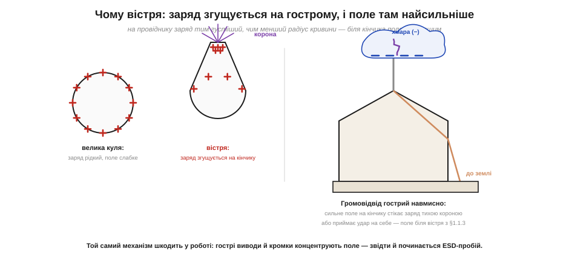

# Пробій повітря: іскра, корона й вістря

Повітря — ізолятор. На цьому стоїть половина електротехніки: проводи в повітрі не замикаються, контакти розімкнутого вимикача не проводять. Та все ж кожен бачив іскру з пальця й знає про блискавку. Виходить, за певних умов ізолятор-повітря раптом стає провідником — і то лавиноподібно, за частки наносекунди. Це явище зветься **пробоєм** (*breakdown*), і в нього є чіткий поріг: близько **3 кіловольти на кожен міліметр** сухого повітря. Зрозуміти механізм пробою важливо подвійно: він пояснює і нешкідливу іскру з пальця, і чому громовідвід роблять гострим, і чому гострі виводи на платі — найнебезпечніше місце для ESD.

### Електронна лавина: як ізолятор стає провідником

У повітрі завжди є кілька **вільних електронів** — їх вибиває космічне проміння й природна радіоактивність. У звичайному полі вони нічого не роблять. Але якщо поле досить сильне, один такий електрон встигає між зіткненнями з молекулами розігнатися так, що, врізавшись у молекулу, **вибиває з неї ще один електрон**. Тепер вільних електронів два, кожен розганяється й вибиває наступний — і число носіїв росте лавиною.


*Сильне поле між електродами розганяє вільний електрон так, що він іонізує молекулу — вибиває з неї ще один електрон, лишаючи позаду додатний іон. Електрони множаться лавинно (1→2→4→8…), і за частки наносекунди ниткою біжить мільярд носіїв. Це і є струм іскри. Поріг — близько 3 кВ на міліметр сухого повітря (≈ 3 МВ/м).*

Ключове слово — **лавина** (*avalanche*). Поки поле слабке, електрон не встигає набрати між зіткненнями енергію, достатню для іонізації, і нічого не множиться — повітря лишається ізолятором. Але як тільки поле перевищує поріг, лавина зривається: один електрон за лічені кроки породжує мільярди, утворюючи розжарений провідний канал. Саме тому пробій такий різкий — це не плавне «потекло трошки», а раптовий обвал від нуля до повної провідності. Канал світиться (збуджені молекули віддають світло) і тріщить (різкий нагрів і розширення повітря — крихітний грім) — звідси видима іскра й чутний клац.

Звідки ж береться сам **поріг** — чому є чітка межа поля, нижче якої лавини немає, а трохи вище вона вибухає? Розгадка — у балансі двох речей: яку енергію електрон **набирає** від поля між зіткненнями й скільки йому **треба** на іонізацію молекули. Електрон у повітрі весь час налітає на молекули; середній шлях між зіткненнями зветься **довжиною вільного пробігу** й за нормального тиску дуже малий. На цьому коротенькому шляху поле підганяє електрон, додаючи йому енергію — це [робота сили на відстані](topic:physics/electric-potential). Якщо поле слабке, набрана за пробіг енергія мала — електрон врізається в молекулу «не розігнавшись», лише трохи її струшує, і нічого не вибиває. А коли поле сягає ~3 МВ/м, набраної за один пробіг енергії якраз вистачає, щоб вибити з молекули електрон — і запускається ланцюгова реакція. Поріг — це і є та напруженість поля, за якої «розгін за один пробіг» дорівнює «ціні іонізації».

Ця картина одразу пояснює дві речі, важливі для практики. По-перше, чому пробій **залежить від тиску**: за нижчого тиску молекул менше, довжина вільного пробігу більша, електрон встигає розігнатись на меншому полі — тож розріджене повітря пробивається легше (ця залежність і ховається за кривою Пашена). По-друге, чому важлива **сухість**: волога й бруд у повітрі трохи змінюють умови, але головне — [волога на **поверхнях**](topic:physics/humidity-static-control) дає заряду стекти ще до того, як напруга дійде до пробою. Тому «3 кВ/мм» — це орієнтир саме для чистого сухого повітря за нормального тиску.

### Правило 3 кВ/мм: скільки треба напруги на який зазор

Поріг пробою зручно тримати в голові як просте інженерне правило: щоб пробити проміжок, потрібно приблизно **3 кВ на кожен міліметр** зазору (для рівних електродів у сухому повітрі за нормальних умов).


*Пробивна напруга приблизно лінійна за зазором: V ≈ 3 кВ/мм · d. Звідси й зворотне читання: довжина іскри ≈ напруга / 3 кВ. Поколювання пальцем (~1 кВ) дає мікроіскру ~0.3 мм; відчутні 6 кВ — іскру ~2 мм; сильна статика 20 кВ — іскру ~6–7 мм.*

Це правило одразу пов'язує дві речі. По-перше, **довжина іскри міряє напругу**: побачив іскру в кілька міліметрів — отже, було кілька десятків кіловольтів. По-друге, воно пояснює форму [драбини відчуттів від заряду на тілі](topic:physics/body-charge): укол, який людина відчуває з 3 кВ, відповідає мікроіскрі близько міліметра — рівно тоді, коли проміжок між пальцем і ручкою стає достатньо малим. А поки напруги мало (сотні вольтів), іскра не проскакує навіть впритул — заряд переходить тихо, через прямий дотик, і саме так гине чип, не давши жодного зовнішнього знаку.

**Приклад (яка іскра від 12 кВ).** Дитина з'їхала з пластикової гірки й набрала 12 кВ. З якої відстані вже проскочить іскра на металеві поручні?

```
правило:  V ≈ 3 кВ/мм · d   →   d ≈ V / (3 кВ/мм)
d ≈ 12 кВ / 3 кВ/мм
d ≈ 4 мм
```

Іскра здатна перестрибнути проміжок близько 4 мм — тобто стрельне ще до того, як палець торкнеться поручня. Це й пояснює відчуття «вдарило, хоч я ще не торкнувся».

Звідси випливає й корисне практичне правило **мінімальної відстані наближення**. Якщо ти заряджений до напруги V, то небезпечний (здатний пробитись) проміжок — приблизно V/(3 кВ/мм). Тобто чим вищий заряд, тим з більшої відстані іскра вже може стрибнути. Для роботи з електронікою це означає: «здалеку — ще не безпечно». Заряджена рука, піднесена на кілька міліметрів до виводу, може стрельнути в нього розрядом, не торкнувшись, — а для чипа з його [десятками вольтів порога](topic:physics/body-charge) цього більш ніж досить. Тому правило «спершу розрядись, потім тягни руку до плати» діє навіть тоді, коли ти не збираєшся ні до чого торкатись: достатньо просто наблизитись.

Це ж пояснює, чому статику з тіла знімають **навмисно й заздалегідь** — торкнувшись великого заземленого металевого предмета *перед* роботою. Краще злити заряд контрольовано, через товстий безпечний шлях (велика площа контакту, нема чутливого оксиду), ніж дати йому стрельнути іскрою в перший-ліпший вивід. Той самий заряд, та сама фізика пробою — але результат протилежний залежно від того, **куди** ми пустили розряд.

Варто чесно зазначити межі правила. Воно для **рівних** електродів (плоских, із великим радіусом кривини) і нормальних умов. Залежність пробою від тиску й зазору насправді не строго лінійна, а описується **кривою Пашена** — і за дуже малих зазорів поводиться неочікувано. Цю тонкість розгортає вставка 🧮 [Крива Пашена](topic:physics/air-breakdown/math-paschen.md). Та є й важливіший виняток із правила — вістря.

### Чому вістря: концентрація заряду й поля на кінчику

Якщо електрод не плоский, а **гострий**, пробій починається набагато раніше — при куди меншій напрузі. Причина — у тому, [як заряд розподіляється по провіднику](topic:physics/electric-field): на провіднику заряд тим **густіший**, чим менший радіус кривини поверхні. На гострому кінчику заряд згущується, а густий заряд означає **сильне поле** поряд.


*На великій кулі заряд лежить рідко, поле біля поверхні слабке. На вістрі заряд згущується на кінчику — і поле там може сягнути порога пробою, навіть коли загальна напруга помірна. Тоді біля кінчика виникає **корона** — тихий безперервний розряд. Громовідвід роблять гострим саме для цього: сильне поле на кінчику або стікає заряд короною, або приймає удар на себе.*

З цього випливають два важливі наслідки. Перший — **корона** (*corona discharge*): біля гострого зарядженого кінчика поле перевищує поріг лише в тонкому шарі повітря, тож виникає не повна іскра, а тихий, локальний, безперервний розряд — синювате світіння й шипіння. Корона повільно стікає заряд у повітря через іонізацію.

Другий наслідок — **громовідвід** (*lightning rod*). Усупереч поширеній думці, його гострий кінчик не «притягує блискавку заради краси»: гостра форма забезпечує сильне локальне поле, що, по-перше, безперервно стікає заряд короною (трохи розряджаючи хмару над собою), а по-друге, якщо удар усе ж стається, надійно приймає його на металевий стрижень і відводить струм у землю безпечним шляхом. Це пряме прикладне читання того, як [згущення заряду на малому радіусі](topic:physics/electric-field) піднімає поле.

Корисно усвідомити й зворотний бік цього правила — **притуплення проти пробою**. Якщо вістря шкодить (концентрує поле й пускає корону там, де нам не треба), то рятунок — зробити поверхню **гладкою й заокругленою**. Великий радіус кривини «розводить» заряд рідше, поле біля поверхні нижче, і пробій починається пізніше. Саме тому високовольтні деталі роблять округлими, без гострих кутів і задирок: круглі екрани, тороїдальні «бублики» на верхівках високовольтних установок, згладжені краї провідників. Те саме міркування діє й у мініатюрі на платі: гладкий заокруглений вивід чи полігон концентрує поле слабше за гострий кутик доріжки, тож і ESD-пробій біля нього починається за вищої напруги. Одне правило — «гостре концентрує, гладке розводить» — працює від громовідводу до кутика мідної доріжки.

**Приклад (чому корона з вістря, а не іскра наскрізь).** Хай заряджений тонкий щуп має на кінчику радіус r ≈ 0.1 мм, а до заземленої пластини — 10 мм. Поле біля гострого кінчика приблизно в R/r разів сильніше за «середнє» поле проміжку (де R — характерний масштаб, тут ~10 мм):

```
підсилення поля ≈ R / r ≈ 10 мм / 0.1 мм = 100×
тож біля кінчика поріг пробою (≈3 МВ/м) досягається,
коли «середнє» поле ще в ~100 разів менше
→ розряд починається з тонкого шару БІЛЯ вістря (корона),
   а не одразу пробиває всі 10 мм наскрізь
```

Через стократне підсилення поля кінчик «запалюється» першим — і дає локальну тиху корону, тоді як решта проміжку ще міцно тримається. Ось чому гострі об'єкти **світяться по краях** (корона), а пробивають наскрізь лише за значно вищої напруги.

> 🔧 **Навіщо це.** Концентрація поля на вістрі — це і пастка, і інструмент. **Пастка:** на платі гострі виводи компонентів, обрізані «під корінь» ніжки, кутики доріжок і задирки — це мікрогромовідводи, що концентрують поле так само, як кінчик громовідводу. Саме звідти найчастіше починається ESD-пробій: заряджений палець ще за міліметр від плати, а поле біля гострого виводу вже сягнуло порога — і розряд стрибнув. Тому в чутливих місцях уникають голих гострих виводів, а в потужних — округлюють усе, де можливе високе поле. **Інструмент:** там, де розряд бажаний і керований, навмисно ставлять вістря чи малий проміжок, щоб пробій стався в заздалегідь обраному безпечному місці, а не випадково в чипі — на цьому стоять найстаріші захисні елементи, [іскрові проміжки й газові розрядники (GDT)](topic:electronics/gdt), старші за будь-який напівпровідник.

### Іскра, корона й тиха провідність: три режими того самого пробою

Корисно скласти докупи режими, у яких повітря «здається» провідним, бо новачок часто плутає їх в одне. **Іскра** (*spark*) — це повний пробій проміжку: яскравий гарячий канал від електрода до електрода, різкий струмовий імпульс, тріск. Вона стається, коли поле перевищує поріг **по всьому** проміжку (або коли стример проростає його наскрізь). **Корона** (*corona*) — частковий, локальний пробій лише в тонкому шарі біля вістря, де поле понадпорогове, тоді як решта проміжку ще тримається: тихе світіння, шипіння, повільне стікання заряду без повного замикання. І, нарешті, **тиха поверхнева провідність** — узагалі не пробій повітря, а [стікання заряду по вологій плівці на поверхнях](topic:physics/humidity-static-control). Три різні явища, одна спільна причина-родич: заряд шукає, де стекти, і знаходить то іскру, то корону, то плівку — залежно від поля, форми електродів і вологості.

Звідси й відповідь на питання, чому **за тієї самої напруги** іноді б'є іскрою, а іноді ні. Усе вирішує, чи встигне десь поле сягнути порога **раніше**, ніж заряд стече тихо. Гострі краї й малі проміжки штовхають до іскри/корони (поле згущується). Волога й розсіювальні поверхні штовхають до тихого стікання (заряд іде, не встигнувши накопичитись до пробою). Тому той самий заряджений предмет у сухій кімнаті стрельне іскрою, а у вологій — тихо розрядиться без жодного «клац». Пробій — лише один із можливих фіналів, і [керуванням вологістю та матеріалами](topic:physics/humidity-static-control) можна навмисно підштовхнути заряд до **тихого**, нешкідливого шляху замість іскри в чип.

Один механізм — **електронна лавина** — дає всю картину: коли поле перевищує близько 3 кВ/мм, повітря зривається з ізолятора в провідник, і довжина іскри прямо міряє напругу; а на **вістрі** заряд і поле згущуються, тож пробій (або тиха корона) починається раніше — звідси і гострий громовідвід, і небезпека гострих виводів на платі. У найбільшому масштабі та сама фізика розгортається як [блискавка](topic:physics/lightning) — «велика іскра» завдовжки в кілометри, але з тим самим порогом і тією самою лавиною.

---
