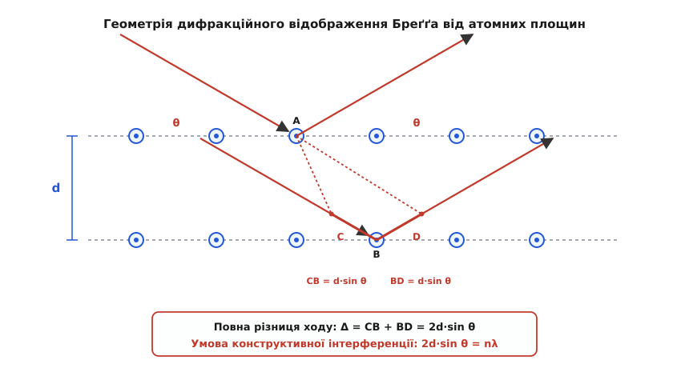
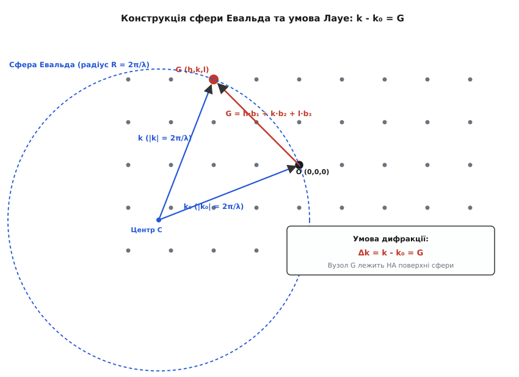
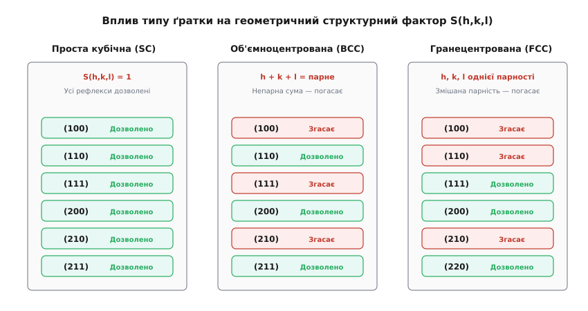
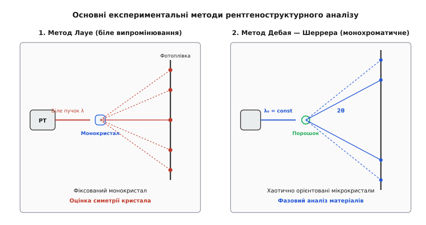

# Дифракція Бреґґа

<preknowlist>
- [Хвильова оптика та дифракція](topic:physics/diffraction) — інтерференція хвиль, різниця ходу та умови конструктивних максимумів.
- [Обернена ґратка та зони Бріллюена](topic:physics/reciprocal-lattice) — періодичність кристалів, індекси Міллера (h, k, l) та трансляційна симетрія.
</preknowlist>

Дифракція Бреґґа розв'язує фундаментальну задачу експериментального визначення міжплощинних відстаней і розшифрування тривимірної атомарної будови кристалів за кутовим розподілом розсіяних хвиль. Ця задача виникла через фізичну неможливість дослідити внутрішнє впорядкування атомів у твердих тілах за допомогою класичної оптики: коли видиме світло з довжиною хвилі від 400 до 700 нанометрів проходить крізь прозорий кристал, воно зазнає лише звичайного заломлення і не демонструє жодних дифракційних візерунків чи спектрального розщеплення. Причина полягає у макроскопічному масштабі світлових хвиль: період кристалічної ґратки більшості твердих тіл становить від `0.2` до `0.5` нанометра, що в тисячі разів менше за довжину хвилі оптичного діапазону. Без дифракційного розсіювання кристал залишався для фізиків «чорною скринькою», а точні координати атомів у ґратці неможливо було виміряти жодним прямим інструментом.

Щоб кристал спрацював як тривимірна дифракційна ґратка, довжина падаючої хвилі мусить бути співмірною з відстанями між атомами. У 1912 році фізики виявили, що рентгенівські промені мають довжину хвилі порядка `0.1` нанометра. Коли когерентний рентгенівський пучок падає на кристал під певними кутами, вторинні хвилі, розсіяні електронами окремих атомів, інтерферують між собою і формують гострі кутові максимуми інтенсивності. Це явище отримало назву дифракції Бреґґа (лат. *diffractus* — розламаний, переломлений).

---

## 1. Фізичний механізм та розрахунок умови Бреґґа

У класичній оптиці дифракційна ґратка складається з паралельних прорізів або штрихів на плоскій поверхні. У кристалічному тілі атоми впорядковані у тривимірній періодичній решітці Браве. Англійські фізики Вільям Генрі Бреґґ (англ. *Bragg*) та його син Вільям Лоренс Бреґґ у 1912 році запропонували наочну модель: уявити кристал як сімейство паралельних атомних площин, віддалених одна від одної на міжплощинну відстань `d`.

Падаючий паралельний пучок монохроматичних хвиль з довжиною `λ` спрямовується на кристал під кутом ковзання `θ` (англ. *glancing angle*). Зверніть увагу: на відміну від класичної оптики, де кут падіння відраховується від нормалі до поверхні, у рентгенівській кристалографії кут Бреґґа `θ` вимірюється між напрямком пучка та самою атомною площиною.


*Геометрія відображення Бреґґа: плоский хвильовий фронт падає під кутом ковзання θ на паралельні атомні площини з інтервалом d. Різниця ходу між променями 1 та 2 дорівнює CB + BD = 2d sin θ.*

### Фізичний механізм когерентного розсіювання площиною
Чому відображення від атомної площини є дзеркальним (кут падіння дорівнює куту відбивання)?
Згідно з принципом Гюйгенса — Френеля, кожен атом у площині, перевипромінює сферичну хвилю під дією змінної електричної напруженості падаючого поля. Усі атоми, що лежать в одній і тій самій атомній площині, омиваються плоским хвильовим фронтом під кутом `θ`. Вторинні хвилі, розсіяні різними атомами **у межах однієї площини**, інтерферують конструктивно виключно під кутом відображення, що дорівнює куту падіння `θ`. За будь-якого іншого кута фазовий зсув між сусідніми атомами у площині взаємно погашає амплітуду.

Таким чином, кожна окрема атомна площина діє як частково прозоре напівдзеркало, яке відбиває невеличку частку випромінювання (порядку `10⁻⁴...10⁻⁵` від інтенсивності падаючого променя) під кутом `θ`, а решту енергії пропускає углиб кристала.

### Інтерференція між послідовними площинами
Розглянемо когерентне розсіювання двох паралельних променів від двох сусідніх атомних площин:
1. Промінь 1 відбивається від атома `A`, розташованого на першій (верхній) площині.
2. Промінь 2 проходить углиб кристала і відбивається від атома `B`, розташованого на другій площині прямо під атомом `A`.

З точок `A` на площині опускаються два перпендикуляри `AC` та `AD` на траєкторію другого променя (до і після відображення). Відрізки `CB` та `BD` становлять додатковий шлях, який долає другий промінь порівняно з першим. З прямокутних трикутників `ABC` та `ABD` довжина кожного з цих відрізків дорівнює:

```
CB = d · sin θ
BD = d · sin θ
```

Повна геометрична різниця ходу `Δ` між двома розсіяними променями дорівнює сумі двох відрізків:

```
Δ = CB + BD = 2 · d · sin θ
```

Щоб розсіяні хвилі підсилили одна одну у результаті конструктивної інтерференції, різниця ходу `Δ` мусить дорівнювати цілому числу довжин хвиль `n · λ`. Це дає фундаментальне **рівняння Бреґґа**:

```
2 · d · sin θ = n · λ
```

де:
- `d` — міжплощинна відстань для даного сімейства кристалографічних площин із індексами Міллера `(h, k, l)` (м);
- `θ` — кут Бреґґа (кут ковзання падаючого променя);
- `n` — ціле число (`n = 1, 2, 3...`), яке називається порядком дифракційного відображення;
- `λ` — довжина хвилі падаючого випромінювання (м).

Якщо умова Бреґґа не виконується хоча б на малу величину, хвилі, що відбиваються від сотень і тисяч послідовних глибинних атомних площин, виявляються у протифазі та повністю гасять одна одну руйнівною інтерференцією. Саме тому дифракційне відображення спостерігається виключно при суворо визначених дискретних кутах `θ`.

### Поляризаційний фактор Томсона
Взаємодія електромагнітного поля рентгенівської хвилі з електронами атомів описується класичним розсіюванням Томсона. Якщо падаюче випромінювання є неполяризованим, інтенсивність розсіяного променя під кутом `2θ` додатково помножується на поляризаційний фактор `P`:

```
P = (1 + cos² 2θ) / 2
```

Для малого кута розсіювання (`2θ → 0°`) фактор `P → 1`, тоді як під прямим кутом (`2θ = 90°`) інтенсивність поляризованої складової спадає вдвічі (`P = 0.5`).

Детальний історичний екскурс про відкриття рентгенівської дифракції Максом фон Лауе та батьком і сином Бреґґами винесено у вставку [📜 Історія відкриття дифракції рентгенівських променів та електронів](topic:physics/bragg-diffraction/hist-bragg-discovery.md).

---

## 2. Умови Лауе та векторний опис у просторі оберненої ґратки

Геометрична модель Бреґґа зручна для наочного сприйняття, проте для аналізу складних кристалографічних симетрій використовують строго векторний підхід, розроблений Максом фон Лауе.

Розглянемо пружне розсіювання хвилі, коли падаючий хвильовий вектор `k₀` перетворюється у розсіяний вектор `k`. Оскільки енергія фотона при пружному розсіюванні не змінюється, модулі векторів однакові:

```
|k| = |k₀| = 2π / λ
```

Вектор розсіювання (переданий імпульс) визначається як різниця векторів:

```
q = k - k₀
```

Умови конструктивної інтерференції хвилі на тривимірній кристалічній ґратці Браве із примітивними векторами `a₁, a₂, a₃` задаються трьома скалярними **рівняннями Лауе**:

```
a₁ · (k - k₀) = 2π · m₁
a₂ · (k - k₀) = 2π · m₂
a₃ · (k - k₀) = 2π · m₃
```

де `m₁, m₂, m₃` — довільні цілі числа.


*Конструкція сфери Евальда у просторі оберненої ґратки. Умова дифракції Лауе k - k₀ = G виконується тоді, коли вузол оберненої ґратки G(h,k,l) перетинає поверхню сфери радіуса R = 2π/λ.*

З математичного визначення оберненої ґратки (грец. *ἀντίστροφος* — обернений) випливає, що три рівняння Лауе виконуються одночасно тоді й тільки тоді, коли вектор розсіювання `q = k - k₀` збігається з вектором оберненої ґратки `G`:

```
k - k₀ = G_{hkl} = h·b₁ + k·b₂ + l·b₃
```

Ця умова має елегантне геометричне тлумачення за допомогою **сфери Евальда**:
1. У просторі оберненої ґратки будується коло або сфера радіуса `R = |k₀| = 2π / λ` із центром у точці `C`.
2. Напрямок падаючого променя задається вектором `k₀`, який закінчується у початку координат оберненої ґратки `O(0,0,0)`.
3. Дифракційний максимум із індексами `(h, k, l)` виникає лише тоді, коли вузол оберненої ґратки `G_{hkl}` потрапляє суворо на поверхню сфери Евальда.

Якщо довжина хвилі випромінювання занадто велика (`λ > 2d_max`), радіус сфери Евальда `R = 2π / λ` стає меншим за відстань до найближчого вузла оберненої ґратки. У цьому випадку сфера Евальда містить у собі лише початок координат `O(0,0,0)`, жоден інший вузол її не перетинає, і дифракція стає фізично неможливою.

Строге математичне виведення еквівалентності умови Лауе `k - k₀ = G` та закону Бреґґа `2d sin θ = n λ` наведено у вставці [🧮 Виведення умов Лауе, сфери Евальда та структурного фактора](topic:physics/bragg-diffraction/math-structure-factor.md).

---

## 3. Атомний та геометричний структурний фактор: Систематичні згасання

Рівняння Бреґґа визначає кутові положення можливих дифракційних піків, виходячи лише з розмірів та форми елементарної комірки. Однак воно не враховує, які саме атоми розташовані всередині комірки та де вони знаходяться.

Амплітуда когерентно розсіяної хвилі від елементарної комірки визначається **комплексним структурним фактором** `F(h,k,l)`:

```
F(h,k,l) = ∑_{j=1}^{M} f_j(q) · exp(-2π i · (h·x_j + k·y_j + l·z_j))
```

де:
- `M` — кількість атомів в елементарній комірці;
- `(x_j, y_j, z_j)` — приведені координати `j`-го атома у частках ребер комірки;
- `f_j(q)` — **атомний фактор розсіювання** (формфактор), який описує ефективну здатність електронної хмари даного атома розсіювати рентгенівські промені. Для кута розсіювання `q = 0` атомний фактор дорівнює атомному номеру елемента `f_j(0) = Z`.

Зі зростанням кута розсіювання `θ` атомний фактор `f_j(q)` монотонно спадає, оскільки розсіювання на різних ділянках електронного хмари одного й того самого атома має фазовий зсув.

Якщо всі атоми в кристалі однакові, структурний фактор розпадається на добуток атомного фактора `f` та **геометричного структурного фактора** `S(h,k,l)`:

```
S(h,k,l) = ∑_{j=1}^{M} exp(-2π i · (h·x_j + k·y_j + l·z_j))
```

Інтенсивність дифракційного рефлексу пропорційна квадрату модуля структурного фактора: `I(h,k,l) ∝ |S(h,k,l)|²`.


*Систематичні згасання (погасання) рефлексів у кубічних ґратках. У BCC ґратці рефлекси з непарною сумою (h+k+l) повністю гасяться через руйнівну інтерференцію від центрального атома.*

Через внутрішньоосередкову інтерференцію хвилі від додаткових атомів у базисі можуть повністю погасити певні відображення. Це явище називається **систематичним згасанням (погасанням)**:

1. **Проста кубічна ґратка (SC)**: Базис містить 1 атом `(0,0,0)`. `S(h,k,l) = 1`. Усі рефлекси дозволені.
2. **Об'ємноцентрована кубічна ґратка (BCC)**: Базис містить 2 атоми: `(0,0,0)` та `(1/2, 1/2, 1/2)`.
   `S(h,k,l) = 1 + exp(-π i · (h + k + l)) = 1 + (-1)^(h+k+l)`.
   - Рефлекс дозволений, якщо сума `(h + k + l)` **парна** (`S = 2`).
   - Рефлекс **погасає** (`S = 0`), якщо сума `(h + k + l)` **непарна** (наприклад, піки `(100), (111), (210)` відсутні).
3. **Гранецентрована кубічна ґратка (FCC)**: Базис містить 4 атоми: `(0,0,0)`, `(1/2, 1/2, 0)`, `(1/2, 0, 1/2)`, `(0, 1/2, 1/2)`.
   - Рефлекси дозволені лише тоді, коли всі три індекси `h, k, l` мають **однакову парність** (усі парні або усі непарні: `(111), (200), (220)`).
   - Рефлекси зі **змішаною парністю** індексів (`(100), (110), (210)`) повністю згасають.

---

## 4. Кінематична та динамічна теорії дифракції

У першому наближенні — **кінематичній теорії дифракції** — припускають, що розсіювання є настільки слабким, що падаюча хвиля проходить крізь кристал без суттєвого зменшення амплітуди, а вторинно розсіяні хвилі не розсіюються повторно. Ця модель чудово описує порошки, дрібні нанокристали та загартовані полікристали.

Проте для ідеальних товстих монокристалів (наприклад, кремнієвих пластин високої чистоти) кінематична теорія порушується. Тільки-но дифракційний промінь утворюється під бреґґівським кутом `θ`, він відразу ж знову відбивається від тих самих атомних площин під кутом `-θ`, тобто повертається у напрямок прямого пучка. Цей процес багаторазового перерозподілу енергії між прямим та розсіяним пучками описується **динамічною теорією дифракції (Дарвіна — Евальда — Лауе)**.

### Наслідки динамічного розсіювання:
- **Екстінкція (згасання падаючої хвилі)**: Енергія прямого пучка переходить у розсіяну хвилю на набагато менших глибинах (порядок `1–10 мкм`), ніж глибина звичайного фотоелектричного поглинання.
- **Маятникові рішення (Pendellösung)**: Інтенсивність випромінювання періодично перекачується з прямого променя у дифракційний та назад із глибиною занурення у кристал.
- **Ширина кривої відображення Дарвіна**: Для ідеального монокристала кутова ширина дифракційного піка (крива хитання) становить від `5` до `30` кутових секунд. У межах цього вузького кутового інтервалу коефіцієнт відбивання становить майже `100%`.

---

## 5. Корпускулярно-хвильовий дуалізм: Дифракція електронів та нейтронів

Формула Бреґґа описує дифракцію будь-яких хвиль хвильової або квантово-механічної природи. Відповідно до гіпотези Луї де Бройля, рухома частинка з масою `m` та швидкістю `v` демонструє хвильові властивості з довжиною хвилі:

```
λ = h / p = h / (m · v)
```

де `h ≈ 6.626 × 10⁻³⁴ Дж·с` — стала Планка.

### Дифракція електронів
Для електронів, які прискорюються електричним потенціалом `V` (вольт), кінетична енергія дорівнює `e · V`. У нерелятивістському наближенні дебройлівська довжина хвилі електрона обчислюється як:

```
λ_e = h / √(2 · m_e · e · V) ≈ 1.226 / √V  (нанометрів)
```

Наприклад, при прискорювальній напрузі `V = 150 В` довжина хвилі електрона дорівнює:

```
λ_e = 1.226 / √150 ≈ 0.100 нм
```

Це точно відповідає міжплощинним відстаням металевих і напівпровідникових кристалів. У 1927 році Клінтон Девіссон і Лестер Джермер провели експеримент із розсіювання повільних електронів на монокристалі нікелю, спостерігаючи дифракційні піки, які суворо підпорядковувалися закону Бреґґа. Це стало першим експериментальним доказом хвильової природи матеріальних частинок.

Завдяки великому перерізу взаємодії електронів із речовиною електронна дифракція застосовується для аналізу поверхонь у методах дифракції повільних електронів (LEED) та дифракції швидких електронів на відбивання (RHEED). У сучасних просвічувальних електронних мікроскопах (TEM) високої напруги (`V = 200–300 кВ`) довжина хвилі електрона становить лише `0.0025 нм`, що дозволяє отримувати точні кристалографічні картини окремих атомних стовпчиків.

### Дифракція нейтронів
Теплові нейтрони, які перебувають у термодинамічній рівновазі при кімнатній температурі (`T ≈ 300 K`), мають кінетичну енергію `E ≈ (3/2) k_B T ≈ 25 меВ`. Їхня довжина хвилі становить:

```
λ_n = h / √(2 · m_n · E) ≈ 0.18 нм
```

На відміну від рентгенівських променів і електронів, які розсіюються електронними хмарами атомів, нейтрони не мають електричного заряду і розсіюються безпосередньо на **атомних ядрах** за рахунок сильних ядерних сил. Це робить нейтронну дифракцію незамінною для:
- Визначення положення легких атомів (зокрема водню та дейтерію) у присутності важких атомів (наприклад, у гідридах металів або білках).
- Дослідження магнітної структури кристалів, оскільки власний магнітний момент (спін) нейтрона розсіюється на впорядкованих магнітних моментах неспарених електронів у антиферомагнетиках та спінових склах.

---

## 6. Основні експериментальні методи кристалографії

Залежно від стану зразка (монокристал чи полікристалічний порошок) та спектрального складу випромінювання (поліхроматичне чи монохроматичне) у дослідній фізиці використовують три класичні методи.


*Принципові схеми двох основних експериментальних методів: метод Лауе (використовує монокристал і біле випромінювання) та метод Дебая — Шеррера (використовує полікристалічний порошок і монохроматичний пучок).*

### 1. Метод Лауе
Нерухомий монокристал опромінюється неперервним (білим) рентгенівським випромінюванням. Оскільки міжплощинна відстань `d` та орієнтація кристала фіксовані, умова Бреґґа `2d sin θ = n λ` задовольняється автоматично для різних сімейств площин за рахунок підбору відповідної довжини хвилі `λ` з неперервного спектра. На плоскій фотоплівці утворюються симетричні групи плям (лауеграма), за якими оцінюють точкову симетрію та орієнтацію монокристала.

### 2. Метод обертового кристала
Монокристал обертається навколо однієї з головних кристалографічних осей у пучку монохроматичного випромінювання (`λ = const`). Під час обертання різні кути `θ` послідовно проходять через положення бреґґівського відображення, що дозволяє виміряти періоди ґратки уздовж осі обертання.

### 3. Порошковий метод Дебая — Шеррера
Зразок являє собою тонко подрібнений полікристалічний порошок із мільйонами хаотично орієнтованих мікрокристалітів, що опромінюється монохроматичним пучком `λ₀`. Оскільки серед безлічі частинок завжди знайдеться частина кристалітів, орієнтованих під потрібним кутом Бреґґа `θ_{hkl}`, розсіяні промені утворюють суцільні дифракційні конуси з кутом розхилу `4θ`. На плоскому або циліндричному детекторі ці конуси залишають концентричні кільця (дебаєграми).

Повний довідник експериментальних параметрів анодів, таблиці розрахунку `d(h,k,l)` для різних сингоній та формулу Шеррера наведено у вставці [📋 Довідник методів дифрактометрії: Лауе, обертовий кристал та дебаєграми](topic:physics/bragg-diffraction/api-diffraction-methods.md).

Практичний програмний модуль для чисельного розрахунку бреґґівських кутів та перевірки систематичних згасань доступний у вставці [⚙️ Симуляція дифракційної картини та геометричного структурного фактора](topic:physics/bragg-diffraction/proj-diffraction-simulation.md).

---

> 🔧 **Навіщо це.**
> Дифракція Бреґґа є головним безруйнівним методом діагностики матеріалів у фізиці конденсованого стану, хімії та матеріалознавстві:
> 1. **Ідентифікація фазового складу (XRD)**: Кожна кристалічна речовина має унікальну «дактилоскопічну карту» дифракційних піків `I(2θ)`. За базильними базами даних (ICDD PDF) автоматично розпізнають фазовий склад мінералів, кераміки та сплавів.
> 2. **Напівпровідникова індустрія**: Вимірювання точних деформацій та напружень у епітаксійних шарах кремній-германію (`SiGe`) чи нітриду галію (`GaN`) на кремнієвих підкладках для процесорів із високорухливими каналами.
> 3. **Структурна біологія та ліки**: Розшифровка тривимірної атомарної структури білків, ферментів та вірусів за допомогою синхротронного рентгенівського випромінювання, а також розширене аналізування поліморфізму фармпрепаратів.
