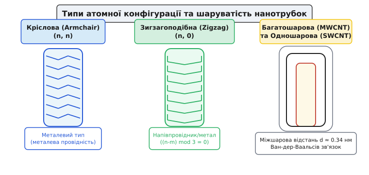
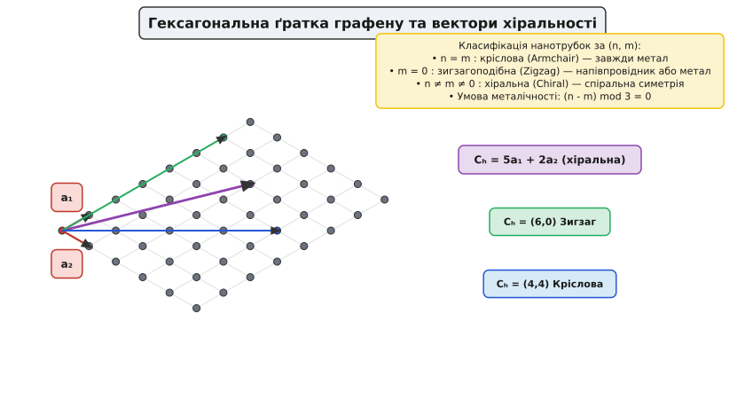
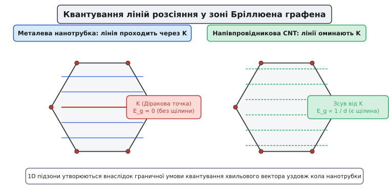
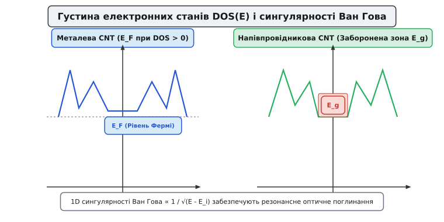

# Вуглецеві нанотрубки

<preknowlist>
- [Зонна теорія твердого тіла](topic:physics/band-theory) — формування дозволених та заборонених енергетичних зон у періодичному потенціалі.
- [Рівень Фермі](topic:physics/fermi-level) — межа енергетичного заповнення електронних станів при абсолютному нулю.
- [Рухливість носіїв заряду](topic:physics/carrier-mobility) — коефіцієнт пропорційності між дрейфовою швидкістю електронів та електричним полем.
</preknowlist>

Мідний провідник у сучасній мікроелектроніці при досягненні густини струму понад `10⁶ A/cm²` незворотно руйнується внаслідок електроміграції — масового переносу атомів металу імпульсом електронів провідності. Водночас кремнієвий канал напівпровідникового транзистора при зменшенні геометричних розмірів до кількох нанометрів втрачає високу провідність через інтенсивне розсіяння носіїв заряду на шорсткостях поверхонь та фононах. Циліндрична структура із згорнутого моноатомного шару вуглецю витримує густину струму до `10⁹ A/cm²` без руйнування завдяки надміцним ковалентним `sp²`-зв'язкам C–C та забезпечує довжину вільного пробігу електронів у сотні нанометрів при кімнатній температурі.

Така унікальна геометрія поєднує в собі квантовий балістичний транспорт електронів, екстремальну механічну міцність та рекордну теплопровідність, що робить її одним із найважливіших об'єктів фізики конденсованого стану речовини та фундаментальною основою наноелектроніки наступного покоління. Докладно про шлях від перших електронно-мікроскопічних спостережень порожнистих вуглецевих ниток середини XX століття до відкриття та синтезу ідеальних одношарових трубчастих кристалів розказано у [історії відкриття нанотрубок](topic:physics/carbon-nanotubes/hist-discovery.md).

## Атомна гібридизація та ефекти кривизни поверхні

Вільний атом вуглецю у основному стані має електронну конфігурацію `1s² 2s² 2px¹ 2py¹`. У кристалічному графіті один `2s`-орбіталь та два `2p`-орбіталі змішуються, утворюючи три гібридизовані `sp²`-орбіталі, розташовані в одній площині під кутами `120°` одна до одної. Ці орбіталі утворюють між сусідніми атомами надміцні плоскі ковалентні `σ`-зв'язки (від грецького *στερεός* — твердий) з довжиною `a_{C-C} ≈ 0.142 нм` та енергією зв'язку близько `6.8 еВ`. Четвертий, негібридизований `2pz`-орбіталь орієнтований перпендикулярно до графенової площини. Перекриття сусідніх `2pz`-орбіталей формує де локалізовану систему `π`-зв'язків (від грецького *πίεσις* — тиск), яка відповідає за електронну провідність та оптичні властивості матеріалу.

При згортанні плоского моноатомного листа графена у циліндр орієнтація атомних орбіталей зазнає просторової деформації. `2pz`-орбіталі на зовнішній поверхні циліндра розходяться, а на внутрішній — зближуються, втрачаючи строгу паралельність. Це викликає вимушене змішування `π`-орбіталей із `σ`-орбіталями, яке називається ефектом кривизни (perpendicular orbital vector deviation).

Чим менший діаметр циліндра, тим сильнішою є вимушена partial `sp³`-гібридизація. При діаметрах `d < 0.8 нм` ця кривизна суттєво зміщує електронні рівні: зростає хімічна реакційна здатність зовні циліндра, а в електронному спектрі металевих нанотрубок виникають додаткові енергетичні щілини порядку десятків міліелектронвольт.


*Кріслова (n, n), зигзагоподібна (n, 0) та хіральна (n, m) нанотрубки, а також структура одношарових (SWCNT) і багатошарових (MWCNT) труб.*

За кількістю концентричних вуглецевих шарів нанотрубки поділяють на два основні класи:
- **Одношарові вуглецеві нанотрубки** (SWCNT — Single-Walled Carbon Nanotubes) — ідеальні циліндри з товщиною стінки в один атом та діаметром від `0.4` до `2.0 нм`.
- **Багатошарові вуглецеві нанотрубки** (MWCNT — Multi-Walled Carbon Nanotubes) — набір концентричних циліндрів, вкладених один в одний на зразок мотрійки. Міжшарова відстань дорівнює `d ≈ 0.34 нм`, що практично збігається з міжплощинною відстанню у кристалічному графіті. Взаємодія між окремими циліндрами забезпечується слабкими дисперсійними силами Ван-дер-Ваальса (від імені нідерландського фізика Йоганнеса ван дер Ваальса).

## Індекси хіральності та вектори геометричної симетрії

Структурні та електронні властивості нанотрубки повністю визначаються напрямком, уздовж якого двовимірна графенова ґратка згортається у циліндр. Властивість об'єкта не збігатися зі своїм дзеркальним відображенням називається хіральністю (від грецького *χείρ* — рука).

У площині графена обирають початкову точку та розкладають вектор згортання — вектор хіральності `C_h` — за примітивними базисними векторами трансляції ґратки `a₁` та `a₂`:

```
C_h = n·a₁ + m·a₂
```

де `(n, m)` — пара цілих чисел, званих індексами хіральності. Вектор `C_h` з'єднує дві точки графенової площини, які збігаються при формуванні циліндра.


*Вектор хіральності C_h = n a₁ + m a₂ визначає лінію згортання графенового листа та тип геометрії нанотрубки.*

Довжина вектора `C_h` дорівнює периметру або довжині кола нанотрубки `L`:

```
L = |C_h| = a · √(n² + n·m + m²)
```

де `a = |a₁| = |a₂| = a_{C-C}·√3 ≈ 0.24613 нм` — стала ґратки. Звідси зовнішній діаметр нанотрубки `d` становить:

```
d = L / π = (a / π) · √(n² + n·m + m²)
```

За співвідношенням індексів `(n, m)` і кутом хіральності `θ` (кут між вектором `C_h` та вектором `a₁`) нанотрубки поділяють на три геометричні класи:

1. **Кріслові** (Armchair): `n = m`, кут `θ = 30°`. Поперечний край атомів нагадує підлокітники крісла. Вони мають площину дзеркальної симетрії, що проходить уздовж осі трубки.
2. **Зигзагоподібні** (Zigzag): `m = 0` (або `n = 0`), кут `θ = 0°`. Крайні атоми утворюють зигзагоподібну лінію.
3. **Хіральні** (Chiral): `n ≠ m ≠ 0`, кут `0° < θ < 30°`. Вуглецеві шестикутники утворюють спіраль, яка закручується ліворуч або праворуч навколо осі циліндра.

Осьова періодичність циліндра визначається вектором одномірної трансляції `T`, який перпендикулярний до вектора хіральності (`C_h · T = 0`). Чисельні алгоритми розрахунку елементарних комірок та 3D-координат атомів наведено у [програмному генераторі геометрії CNT](topic:physics/carbon-nanotubes/proj-cnt-structure-generator.md).

## Квантове зонне згортання та електронна провідність

Електронні властивості нанотрубок описуються за допомогою методу зонного згортання (zone folding) на основі електронного спектра графена. У двовимірному графіті валентна `π`-зона та `π*`-зона провідності торкаються в шести вершинах першої зони Бріллюена (від імені французького фізика Леона Бріллюена) — Діракових точках `K` та `K'` (названих на честь Поля Дірака). Поблизу цих точок енергетичний спектр є строго лінійним: `E(k) = ± ℏ·v_F·|k - K|`, де `v_F ≈ 10⁶ м/с` — швидкість Фермі.

Згортання двовимірного листа у циліндр радіуса `R = d / 2` накладає циклічну граничну умову Борна — фон Кармана на хвильову функцію електрона уздовж кола трубки:

```
k · C_h = 2·π·q                       [q ∈ ℤ — ціле квантове число]
```

Це означає, що хвильовий вектор `k` не може набувати довільних значень у поперечному напрямку. Двовимірна зона Бріллюена графену розрізається на набір паралельних еквідистантних ліній (1D-підзон).


*Перетин Діракової точки K лініями дискретного квантування k уздовж кола трубки обумовлює металевий або напівпровідниковий тип провідності.*

Електронний тип нанотрубки повністю залежить від того, чи проходить хоча б одна з дозволених ліній квантування безпосередньо через Діракову точку `K`:

- Якщо лінія розрізу **проходить через точку `K`**, електронні стани на рівні Фермі є доступними. Нанотрубка поводиться як **одновимірний метал** із високою провідністю при `E_F = 0`.
- Якщо лінії квантування **проходять повз точку `K`**, виникає енергетична щілина. Нанотрубка поводиться як **напівпровідник** із забороненою зоною `E_g`.

Умова металічності аналітично виводиться зі скалярного добутку `K · C_h = 2·π·q`. Повний алгебраїчний вивід наведено у [математичному виводі зонної структури](topic:physics/carbon-nanotubes/math-chirality-graphene.md). Кінцева умова металічності має вигляд:

```
(n - m) mod 3 = 0
```

Це дає суворі фундаментальні наслідки:
- Усі кріслові нанотрубки `(n, n)` мають `n - n = 0`, тому вони є **ідеальними металами** при будь-яких діаметрах.
- Зигзагоподібні `(n, 0)` та хіральні `(n, m)` нанотрубки є металами тільки тоді, коли різниця `n - m` кратна 3 (це становить близько `1/3` від усіх можливих конфігурацій).
- Решта `2/3` конфігурацій, для яких `(n - m) mod 3 ≠ 0`, є **напівпровідниками**.

Ширина забороненої зони напівпровідникових нанотрубок `E_g` обернено пропорційна діаметру:

```
E_g = (4 · ℏ · v_F) / (3 · d) = 2 · a_{C-C} · t / d ≈ 0.8 eV / d(nm)
```

де `t ≈ 2.7 еВ` — інтеграл перекриття `π`-орбіталей. Для нанотрубки діаметром `d = 1 нм` ширина забороненої зони становить близько `0.8 еВ`, що співрозмірно із забороненою зоною кремнію (`1.1 еВ`).

## 1D сингулярності Ван Гова та балістичний транспорт

Густина електронних станів (DOS — Density of States) у одновимірних кристалах істотно відрізняється від тривимірних матеріалів. Внаслідок одномірної дисперсії `E(k_z)` густина станів містить математичні розбіжності вигляду `DOS(E) ∝ 1 / √(E - E_i)`, де `E_i` — дно або вершина відповідної 1D-підзони. Ці піки називаються сингулярностями Ван Гова (від імені бельгійського фізика Леона Ван Гова).


*1D сингулярності Ван Гова у густині електронних станів викликають піки оптичного поглинання та випромінювання.*

При оптичному збудженні електронів кванти світла поглинаються резонансно між симетричними піками Ван Гова у валентній зоні та зоні провідності (переходи `v₁ → c₁`, `v₂ → c₂`). Це дає змогу ідентифікувати діаметр та хіральність окремих нанотрубок оптичними методами (спектроскопія поглинання та люмінесценція).

У металевих нанотрубках рівень Фермі перетинає дві 1D-підзони, що утворює два незалежні квантові канали провідності. За відсутності розсіяння носіїв на дефектах та фононах транспорт електронів стає балістичним (від грецького *βάλλειν* — кидати). Довжина вільного пробігу електронів `l_e` у чистих SWCNT досягає `700 нм` при кімнатній температурі.

Квантова провідність `G` ідеального одновимірного каналу описується формулою Ландауера — Бюттікера (від імен фізиків Рольфа Ландауера та Маркуса Бюттікера):

```
G = (2·e² / h) · M · T_tr
```

де `e` — заряд електрона, `h` — стала Планка, `M` — кількість каналів провідності, `T_tr` — коефіцієнт проходження. Для металевої SWCNT з двома каналами (`M = 2`) та ідеальним проходженням (`T_tr = 1`):

```
G_max = 2 · (2·e² / h) = 4·e² / h ≈ (12.9 кОм)⁻¹ ≈ 77.5 мкСм
```

Опір ідеальної нанотрубки балістичної довжини не залежить від її довжини і дорівнює квантовому опору контакту `R_q = h / (4·e²) ≈ 6.45 кОм`.

При високих електричних полях (коли напруга `V > 0.16 В`) електрони набувають енергії, достатньої для генерації високочастотних оптичних фононів (`ℏω_opt ≈ 160 меВ`). Це викликає інтенсивне неупруге розсіяння електронів і приводить к сатурації (насиченню) електричного струму на рівні `I_sat ≈ 20 – 25 мкА` для окремої одношарової нанотрубки.

## Електрон-фононна взаємодія та пікосекундна релаксація

Акустичні фонони у нанотрубках поширюються вздовж циліндра зі швидкістю понад `10,000 м/с`. При низьких температурах основним механізмом опору є квазіпружне розсіяння на акустичних фононах, для якого довжина вільного пробігу становить `l_ac > 500 нм`.

При кімнатній температурі збуджені електрони провідності обмінюються енергією з ґраткою за пікосекундні інтервали часу (`τ_rel ≈ 1 – 2 пс`). Це забезпечує високу стійкість нанотрубок до теплового пробою порівняно зі звичайними металевими плівками.

## Механічні та теплові властивості

Вуглецеві нанотрубки є найміцнішими з відомих матеріалів на розрив. Ця властивість пояснюється виключно високою енергією ковалентних `sp²`-зв'язків C–C.

- **Модуль Юнга** (від імені англійського фізика Томаса Юнга) вздовж осі одношарової нанотрубки становить `E ≈ 1.0 – 1.2 ТПа`, що в 5 разів перевищує модуль Юнга високоміцної сталі (`200 ГПа`) і збігається з модулем Юнга алмазу.
- **Межа міцності на розрив** досягає `50 – 100 ГПа`. Для порівняння, межа міцності конструкційної сталі становить `0.4 – 1.5 ГПа`.

При осьовому стисканні нанотрубки не ламаються крихко, а зазнають пружної втрати стійкості — утворення локальних складки (buckling) без розриву хімічних зв'язків. Після зняття механічного навантаження структура повністю відновлює першопочаткову форму.

Перенос тепла у нанотрубках здійснюється не електронами, а квантами коливань кристалічної ґратки — фононами (від грецького *φωνή* — звук). Завдяки високій швидкості звуку у графеновій площині (`v_s ≈ 10⁴ м/с`) та довжині вільного пробігу акустичних фононів у сотні нанометрів, вздовж осі SWCNT спостерігається балістичний теплоперенос. Теплопровідність `κ` окремої одношарової нанотрубки при кімнатній температурі досягає `3000 – 6000 Вт/(м·К)`, що перевищує теплопровідність чистого мідного провідника (`400 Вт/(м·К)`) та алмазу (`2000 Вт/(м·К)`). Зведені фізичні константи деталізовано у [довіднику фізичних параметрів CNT](topic:physics/carbon-nanotubes/api-cnt-properties-ref.md).

> 🔧 **Навіщо це.** Завдяки комбінації стійкості до густини струму `10⁹ A/cm²` та теплопровідності понад `3000 Вт/(м·K)` вуглецеві нанотрубки розглядаються як єдина реальна альтернатива мідним міжз'єднанням (interconnects) у надвеликих інтегральних схемах (VLSI) з топологічною нормою менше `2 нм`, де мідні провідники виходять з ладу через електроміграцію та перегрів.

## Синтез та селективне розділення за хіральністю

Вирощування нанотрубок вимагає підведення великої енергії для розриву зв'язків у вихідному вуглецевому сировині та наявності металевих каталізаторів. Основний механізм зростання описується моделлю «Пара — Рідна речовина — Тверде тіло» (VLS — Vapor-Liquid-Solid):

1. Вуглецевовмісний газ (метан `CH₄`, етилен `C₂H₄`, монооксид вуглецю `CO`) дисоціює на поверхні нанокраплі розплавленого металу-каталізатора (залізо, кобальт, нікель) при температурі `600 – 1000 °C`.
2. Атоми вуглецю розчиняються у рідкій металевій краплі до досягнення межі насичення.
3. При перенасиченні вуглець випадає в осад на поверхні краплі, самоорганізуючись у напівсферичний фулереновий купол.
4. Купол піднімається над краплею, витягуючи за собою циліндричну стінку нанотрубки.

Потім синтезований матеріал сортують за індексами хіральності `(n, m)` за допомогою методів градієнтного ультрацентрифугування у щільності (DGU) та двофазного рідкого розділення (ATP), що дозволяє відокремлювати напівпровідникові нанотрубки від металевих із чистотою понад `99.9%`.

Для ідентифікації отриманих структур застосовують три основні фізичні методи:

- **Просвічувальна електронна мікроскопія високої роздільності** (HRTEM) — пряма візуалізація кількості стінок, міжшарової відстані та внутрішнього каналу.
- **Сканувальна тунельна мікроскопія** (STM) — вимірювання локальної густини станів та візуалізація атомної решітки з визначенням індексів хіральності `(n, m)`.
- **Спектроскопія комбінаційного розсіяння світла** (Раман-спектроскопія) — найбільш доступний неруйнівний метод діагностики. Спектр містить радіальну дихальну моду RBM (Radial Breathing Mode), частота якої прямо пов'язана з діаметром:

```
ω_{RBM} = 227 / d + 12                [в см⁻¹, d в нм]
```

## Транзисторні архітектури CNTFET та перспективи

Польові транзистори на основі напівпровідникових нанотрубок (CNTFET — Carbon Nanotube Field-Effect Transistor) будуються у двох основних конфігураціях:
- **Балістичний транзистор із керованим каналом (MOSFET-like):** Омічні контакти з паладію (`Pd`) для p-каналу або з ітрію (`Y`) для n-каналу забезпечують безбар'єрну ін'єкцію носіїв у нанотрубку.
- **Транзистор із затвором навколо каналу (Gate-All-Around / GAA):** Нанотрубка оточується діелектриком із високою діелектричною проникністю (`HfO₂` або `Al₂O₃`) та металевим затвором.

Транзистори CNTFET демонструють граничну крутість підпорогового нахилу `SS ≈ 60 мВ/дек` при кімнатній температурі, що відповідає фундаментальній термодинамічній межі. Порівняно з кремнієвими елементами FinFET, нанотрубкові транзистори забезпечують у 5 разів вищу швидкодію при потрійному зменшенні споживаної потужності.
