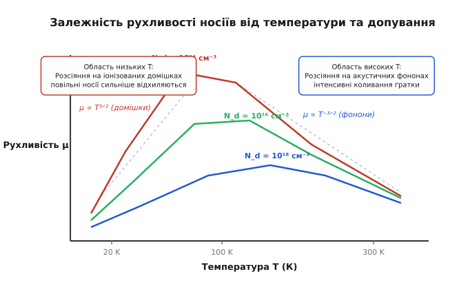
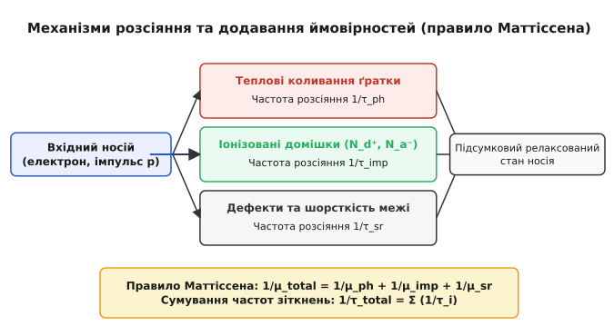
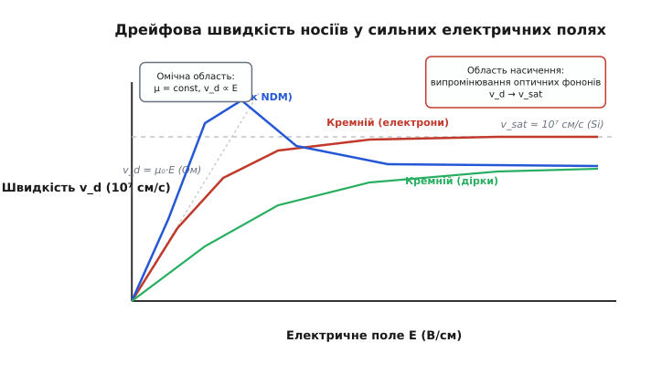
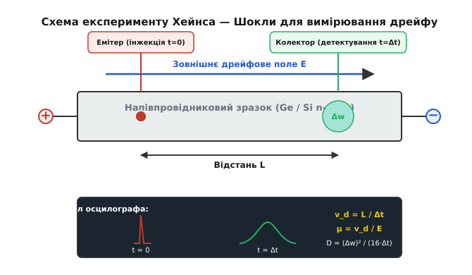

# Рухливість носіїв заряду

<preknowlist>
- [Модель Друде](book:physics/drude-model) — час релаксації, дрейфова швидкість та середня довжина вільного пробігу.
- [Зонна теорія твердого тіла](book:physics/band-theory) — ефективна маса носіїв, енергетичні зони та долони.
- [Напівпровідник](book:physics/semiconductor) — власна та домішкова провідність, електрони й дірки.
- [Легування](book:physics/doping) — донори, акцептори, іонізована та нейтральна домішка.
</preknowlist>

Коли до кристала напівпровідника з питомим опором у кілька Ом-сантиметрів прикладають зовнішнє електричне поле напруженістю `100 В/см`, електрони у зоні провідності не прискорюються нескінченно. Замість безперервного розгону носії досягають постійної середньої швидкості дрейфу всього у кілька тисяч сантиметрів за секунду. Причина полягає у тому, що кожні `10⁻¹³ секунди` електрон хаотично змінює свій напрямок у результаті зіткнень із тепловими коливаннями атомів та іонами домішок.

Здатність носіїв заряду маневрувати крізь кристалічні ґрати під дією електричного поля визначає коефіцієнт пропорційності між напруженістю цього поля та набутою середньою дрейфовою швидкістю. Цю фізичну величину називають **рухливістю носіїв заряду** (лат. *mobilitas* — здатність до руху, грец. *κίνησις* — дрейфовий рух). Вона є фундаментальним параметром, що зв'язує мікроскопічні квантові зіткнення частинок із макроскопічним струмом напівпровідникових приладів.

## 1. Фізична природа дрейфового транспорту та означення рухливості

У відсутності зовнішнього електричного поля вільні електрони та дірки перебувають у стані безперервного хаотичного теплового руху. Середня швидкість цього хаотичного руху при кімнатній температурі підкоряється розподілу Максвелла — Больцмана або Фермі — Дірака і становить величезну величину порядку `10⁷ см/с` (близько `100 км/с`). Проте векторна сума всіх швидкостей дорівнює нулю, тому результуючий електричний струм у кристалі відсутній.

При накладанні зовнішнього електричного поля `E` на хаотичний тепловий рух накладається слабкий спрямований зсув — **дрейф**. Між двома послідовними зіткненнями електрична сила `F = q · E` надає носію прискорення `a = q · E / m*`, де `m*` — ефективна маса носія заряду у кристалічній ґратці. За час вільного пробігу `τ` (час релаксації імпульсу) носій набуває додаткової дрейфової швидкості `v_d = a · τ`.

Коли електрон зіштовхується з дефектом ґратки або фононом, накопичений напрямлений імпульс практично повністю розсіюється, і процес прискорення починається знову. Усереднена за часом та по ансамблю частинок дрейфова швидкість визначається співвідношенням:

```
v_d = (q · ⟨τ⟩ / m*) · E
```

Коефіцієнт пропорційності між дрейфовою швидкістю `v_d` та напруженістю електричного поля `E` називають **рухливістю** `μ`:

```
v_d = μ · E
```

У системі SІ рухливість вимірюється в `м²/(В·с)`, однак у фізиці напівпровідників традиційно та загальноприйнято використовують позасистемну одиницю **`см²/(В·с)`**. Векторний зв'язок між мікроскопічним дрейфом та густиною струму `j` задається формулою:

```
j = q · n · v_dn + q · p · v_dp = q · (n · μ_n + p · μ_p) · E
```

де `n` та `p` — об'ємні концентрації електронів та дірок, `μ_n` та `μ_p` — їхні відповідні рухливості. Звідси випливає фундаментальний зв'язок між рухливістю та питомою електричною провідністю напівпровідника `σ`:

```
σ = q · (n · μ_n + p · μ_p)
```

Зв'язок рухливості з мікроскопічними параметрами ґратки виражається класичною формулою Друде — Ланжевена:

```
μ = q · ⟨τ⟩ / m*
```

Ця формула розкриває двояку природу рухливості:
1. Вона **прямо пропорційна середному часу релаксації імпульсу** `⟨τ⟩` — що рідше носій зазнає зіткнень, то вища його рухливість.
2. Вона **обернено пропорційна ефективній масі** `m*` — легкі носії швидше відгукуються на прискорювальне поле.

### Зонна анізотропія та тензор ефективної маси
У багатьох напівпровідниках зонна структура має анізотропні (еліпсоїдальні) ізоенергетичні поверхні. Наприклад, у кремнії зона провідності має шість еквівалентних `X`-долин вздовж напрямків `⟨100⟩`, де ефективна маса електрона є анізотропною: поздовжня маса `m_l* ≈ 0.98 m_0` (уздовж осі еліпсоїда) та поперечна маса `m_t* ≈ 0.19 m_0` (у перпендикулярній площині).

У кожній окремій долині рухливість є тензорною величиною:

```
μ_l = q · ⟨τ⟩ / m_l*  (поздовжня)
μ_t = q · ⟨τ⟩ / m_t*  (поперечна)
```

Для кубічного кристала кутова сума за всіма шістьма доказовими долинами рівномірно усереднюється, утворюючи скалярну провідну рухливість з усредненою **тензорною ефективною масою провідності** `m_c*`:

```
1 / m_c* = (1 / 3) · (1 / m_l* + 2 / m_t*)
```

Для кремнію підстановка чисел дає `m_c* ≈ 0.26 m_0`. Слід відрізняти масу провідності `m_c*` від маси густини станів `m_dos* = 6^(2/3) · (m_l* · m_t*²)^(1/3) ≈ 1.08 m_0`, яка використовується при обчисленні термодинамічної концентрації носіїв.

Завдяки суттєво меншій ефективній масі електронів порівняно з дірками у більшості напівпровідників (`m_n* < m_p*`), електронна рухливість `μ_n` значно перевищує діркову рухливість `μ_p`. У кремнії при кімнатній температурі для чистого матеріалу `μ_n ≈ 1400 см²/(В·с)`, тоді як `μ_p ≈ 470 см²/(В·с)` (співвідношення приблизно `3:1`). В арсеніді галію `GaAs` через дуже легку `Γ`-долину (`m_n* ≈ 0.067 m_0`) електронна рухливість сягає `8500 см²/(В·с)`, що у `20` разів перевищує діркову рухливість (`μ_p ≈ 400 см²/(В·с)`).

## 2. Мікроскопічні канали розсіяння та температурна динаміка

Ідеальний періодичний потенціал кристала не створює жодного опору руху квантової електронної хвилі. Відхилення від ідеальної періодичності викликає розсіяння носіїв. Головними мікроскопічними механізмами розсіяння в об'ємі напівпровідника є:

1. **Розсіяння на теплових коливаннях ґратки (акустичних та оптичних фононах)**.
2. **Розсіяння на іонізованих домішках (донорах та акцепторах)**.
3. **Розсіяння на нейтральних домішках та точкових дефектах**.
4. **Міжносійне розсіяння (електрон-електронне та електрон-діркове)**.
5. **П'єзоелектричне розсіяння** (у полярних кристалах `III-V` та `II-VI`).

Детальне математичне виведення інтенсивностей квантового розсіяння на основі рівняння Больцмана та золотого правила Фермі наведено у вставці [Квантово-механічна теорія розсіяння носіїв](book:physics/condensed-matter-physics/carrier-mobility/math-scattering-mechanisms.md).


*Залежність рухливості носіїв у кремнії від температури при різних рівнях легування донорами.*

### Акустичне та оптичне фононе розсіяння
При температурах, відмінних від абсолютного нуля, атоми кристалічної ґратки здійснюють теплові коливання навколо положень рівноваги. Квантами цих коливань є **фонони**. Зсув атомів створює флуктуації кристалічного потенціалу (деформаційний потенціал), на яких розсіюються хвилі носіїв.

Розрізняють дві основні гілки фононів:
- **Акустичні фонони**: сусідні атоми зміщуються в одному напрямку. Створюють довгохвильові деформації, які пружно розсіюють носії.
- **Оптичні фонони**: сусідні атоми зміщуються у протилежних фазах. Мають високу квантову енергію `ℏω_opt` (`~63 меВ` у кремнії, `~36 меВ` у `GaAs`). Їхнє поглинання або випромінювання є суттєво непружним.

У невірнолегованих або слаболегованих напівпровідниках при високих температурах (`T > 100 К`) фононне розсіяння є домінуючим. Кількість акустичних фононів зростає пропорційно температурі `N_ph ∝ T`, а густина кінцевих станів пропорційна `√E ∝ √T`. У результаті середній час релаксації падає як `⟨τ_ph⟩ ∝ T⁻³ᐟ²`.

Звідси випливає теоретичний температурний закон для фононної рухливості невиродженого 3D-напівпровідника:

```
μ_ph ∝ T⁻³ᐟ²
```

Для багатьох реальних напівпровідників експериментальний показник степеня виявляється навіть більшим за `1.5` через суттєвий внесок оптичних фононів та міждолинного розсіяння (`g`-процеси та `f`-процеси перекиду між долинами). Наприклад, у кремнії для електронів `μ_ph ∝ T⁻²·⁴²`, а для дірок `μ_ph ∝ T⁻²·²⁰`.

### Розсіяння на іонізованих домішках
Коли у напівпровідник вводять легуючі домішки (наприклад, фосфор або бор у кремній), при кімнатній температурі атоми домішок іонізуються, перетворюючись на нерухомі позитивні `N_d⁺` або негативні `N_a⁻` іони. Електрон, що пролітає поблизу іона, зазнає кулонівського відхилення (аналог квантового розсіяння Резерфорда).

Ключова особливість кулонівського розсіяння полягає у залежності від швидкості носіїв: **повільні носії зазнають значно сильнішого відхилення, ніж швидкі**. При підвищенні температури середня теплова швидкість носіїв зростає (`v_th ∝ √T`), вони швидше пролітають повз іони і розсіюються менш ефективно.

Модель Брукса — Геррінга дає наступну залежність рухливості від температури та концентрації іонізованих домішок `N_i`:

```
μ_imp ∝ T³ᐟ² / N_i
```

Таким чином, розсіяння на іонізованих домішках має **протилежну температурну залежність** порівняно з фононним розсіянням: при охолодженні напівпровідника домішково-обмежена рухливість падає.


*Паралельне додавання частот зіткнень різних механізмів розсіяння за правилом Маттіссена.*

### Правило Маттіссена та результуюча крива рухливості
Якщо в кристалі одночасно діють кілька незалежних механізмів розсіяння, ймовірності зіткнень за одиницю часу (частоти зіткнень `1/τ`) додаються для кожного енергетичного рівня:

```
1 / τ_total = 1 / τ_ph + 1 / τ_imp + 1 / τ_sr
```

Звідси випливає макроскопічне **правило Маттіссена**: зворотна величина підсумкової рухливості дорівнює сумі зворотних величин парціальних рухливостей для кожного механізму:

```
1 / μ_total = 1 / μ_ph + 1 / μ_imp + 1 / μ_sr
```

Аналіз сумарної температурної кривої `μ(T)` розкриває три характерні області:
1. **Область низьких температур (`T < 50 К`)**: домінує розсіяння на іонізованих домішках, рухливість зростає за законом `μ ∝ T³ᐟ²`.
2. **Максимум рухливості (`T ≈ 50–100 К`)**: інтенсивності домішкового та фононного розсіяння порівнюються, досягається пікове значення рухливості (у чистому кремнії — понад `10⁴ см²/(В·с)`).
3. **Область високих температур (`T > 150 К`)**: домінує розсіяння на фононах ґратки, рухливість падає за законом `μ ∝ T⁻³ᐟ²` (або `T⁻²·⁴`).

## 3. Залежність від концентрації домішок та ефекти екранування

При збільшенні рівня допування напівпровідника сумарна кількість розсіювальних центрів `N_i = N_d + N_a` зростає. У слаболегованому напівпровіднику (`N < 10¹⁴ см⁻³`) домішкове розсіяння при кімнатній температурі є нехтовно малим, і рухливість визначається виключно фононами (`μ_n ≈ 1400 см²/(В·с)` у `Si`).

Зі зростанням концентрації домішок понад `10¹⁶ см⁻³` відстань між іонами зменшується, і кулонівське розсіяння починає суттєво деградувати рухливість. При концентраціях `N > 10¹⁸ см⁻³` рухливість електронів у кремнії падає більш ніж у `10` разів — до величин близько `100 см²/(В·с)`.

### Фізика кулонівського екранування Дебая та Томаса — Фермі
У сильнолегованих напівпровідниках кулонівське поле домішкового іона екранується рухомою хмарою вільних носіїв. Ефективний радіус дії кулонівського потенціалу для невиродженого електронного газу визначається **довжиною екранування Дебая**:

```
λ_D = √( (ε · k_B · T) / (q² · n) )
```

Для виродженого електронного газу при високих концентраціях (`E_F > k_B T`) радіус екранування розраховується за моделлю Томаса — Фермі: `λ_TF = √( (2 · ε · E_F) / (3 · q² · n) )`.

При високих концентраціях вільних носіїв `n` радіус екранування зменшується, що частково пригнічує кулонівське розсіяння на далеких відстанях, однак висока густина іонів компенсаторно збільшує загальну частоту зіткнень.

При двох діапазонах допування застосовують різні теоретичні зрізи:
- **Середнє легування (`10¹⁵–10¹8 см⁻³`)**: використовується модель Брукса — Геррінга, де екранування розраховується за довжиною Дебая `λ_D`.
- **Високе легування (`N > 10¹⁹ см⁻³`)**: екранований радіус Дебая стає меншим за середню відстань між іонами `N_i⁻¹ᐟ³`. У цій області Брукс — Геррінг дає похибку, і застосовується модель Конуелл — Вайспкопфа з жорстким відсіканням прицільного параметра `d = 1 / (2 N_i¹ᐟ³)`.

При дуже низьких температурах (`T < 20 К`) електрони «виморожуються» назад на донорні рівні, і іонізоване розсіяння змінюється **розсіянням на нейтральних домішках**. Вираз Ергінсоя для нейтрального розсіяння передбачає незалежність часу релаксації від температури: `μ_neut = (m* · q³) / (20 · ε · ℏ³ · N_neut)`.

Таблиці емпіричних коефіцієнтів та стандартних параметрів для чисельного розрахунку концентраційної залежності рухливості за моделями Коугі — Томаса та Масетті наведено у вставці [Довідник емпіричних моделей та параметрів рухливості носіїв](book:physics/condensed-matter-physics/carrier-mobility/api-mobility-models.md).

## 4. Динаміка у сильних електричних полях та насичення швидкості

У слабких електричних полях (`E < 10³ В/см`) середня енергія, яку носій отримує від поля за час вільного пробігу, є незначною порівняно з середньою тепловою енергією `(3/2) k_B T`. Електронний газ перебуває у термодинамічній рівновазі з кристалічною ґраткою, а дрейфова швидкість зростає строго лінійно з полем: `v_d = μ₀ · E` (Омічний режим).

При збільшенні напруженості поля понад `10³ В/см` ситуація кардинально змінюється. Носії отримують від поля більше енергії, ніж встигають віддавати акустичним фононам. Середня енергія носіїв зростає, їхня ефективна температура стає вищою за температуру ґратки (`T_e > T_lattice`) — носії стають **«гарячими»**.

Оскільки хаотична теплова швидкість гарячих носіїв зростає, час між зіткненнями `τ` зменшується, і диференційна рухливість `μ_diff = dv_d / dE` починає падати.


*Залежність дрейфової швидкості електронів та дірок від напруженості електричного поля.*

Коли кінетична енергія носія досягає порогової енергії оптичного фонона `ℏω_opt` (`~63 меВ` у кремнії), відкривається надзвичайно ефективний канал дисипації — випромінювання оптичних фононів. Час випромінювання оптичного фонона є вкрай малим (`τ_opt ≈ 10⁻¹³ с`). Як тільки електрон прискорюється до енергії `ℏω_opt`, він миттєво випромінює оптичний фонон, втрачає свою кінетичну енергію і зупиняється, після чого процес прискорення повторюється.

У результаті дрейфова швидкість досягає свого фізичного максимуму — **швидкості насичення `v_sat`**:

```
v_sat = √( ℏω_opt / (2 m*) )
```

Для кремнію швидкість насичення при кімнатній температурі становить:
- Для електронів: `v_sat,n ≈ 1.07 × 10⁷ см/с` (при критичному полі `E_c ≈ 10⁴ В/см`).
- Для дірок: `v_sat,p ≈ 8.37 × 10⁶ см/с` (при критичному полі `E_c ≈ 2 × 10⁴ В/см`).

Емпірична формула Коугі — Томаса для розрахунку польової залежності дрейфової швидкості має вигляд:

```
v_d(E) = (μ₀ · E) / [ 1 + (μ₀ · E / v_sat)^β ]^(1 / β)
```

де `β ≈ 1.1` для електронів у кремнії та `β ≈ 1.2` для дірок.

### Негативна диференційна рухливість та ефект Ганна у прямих напівпровідниках
В арсеніді галію `GaAs` та індій фосфіді `InP` залежність `v_d(E)` має складний немонотонний характер із ділянкою **негативної диференційної рухливості** (NDM, Negative Differential Mobility).

Зонна структура `GaAs` складається з центральної низької `Γ`-долини з малою ефективною масою (`m_Γ* = 0.067 m_0`) та високою рухливістю (`~8500 см²/(В·с)`), а також вищих по енергії бічних `L`-долин (віддалених на `ΔE ≈ 0.29 еВ`) з великою ефективною масою (`m_L* = 0.55 m_0`) та низькою рухливістю (`~100 см²/(В·с)`).

У слабких полях усі електрони знаходяться в `Γ`-долині й рухаються з високою швидкістю. Коли поле досягає критичного значення `E_c ≈ 3.5 кВ/см`, електрони розігріваються до енергії `0.29 еВ` і починають інтенсивно переходити в бічні `L`-долини (міждолинний перехід). Оскільки в `L`-долині маса носія у `8` разів більша, дрейфова швидкість електронів стрімко падає від пікового значення `2.2 × 10⁷ см/с` до насиченого рівня `1.2 × 10⁷ см/с`.

Цей ефект викликає виникнення негативного диференційного опору і лежить в основі роботи диодів Ганна — генераторів та підсилювачів надвисокочастотного (СВЧ) випромінювання міліметрового діапазону.

## 5. Методи експериментального вимірювання рухливості

Для точного вимірювання кінетичних параметрів у фізичних лабораторіях застосовують прямі та непрямі експериментальні методи.

### Метод Холла (Hall Effect Measurement)
Найпоширенішим непрямим методом є вимірювання ефекту Холла у комбінації з вимірюванням питомої провідності на прямокутній структурі (мостик Холла) або за методом Ван дер Пау (Van der Pauw).

При пропущенні струму `I` через зразок у перпендикулярному магнітному полі `B` виникає поперечна холлівська різниця потенціалів `V_H`. Коефіцієнт Холла визначається як `R_H = V_H · d / (I · B) = r_H / (q · n)`.

Добуток коефіцієнта Холла на питому провідність `σ` визначає **холлівську рухливість** `μ_H`:

```
μ_H = R_H · σ = r_H · μ_d
```

де `r_H = ⟨τ²⟩ / ⟨τ⟩²` — **Холл-фактор** (безрозмірний коефіцієнт, що враховує статистичний розкид часу релаксації за енергіями).

Точні квантово-статистичні значення Холл-фактора залежать від механізму розсіяння:
- Для розсіяння на акустичних фононах (`τ(E) ∝ E⁻¹ᐟ²`): `r_H = (3π / 8) ≈ 1.18`.
- Для розсіяння на іонізованих домішках (`τ(E) ∝ E³ᐟ²`): `r_H = (315π / 512) ≈ 1.93`.
- У сильному магнітному полі (`ω_c · τ ≫ 1`) або у виродженому електронному газі: `r_H → 1.00`.

### Термоелектричні та термомагнітні ефекти (Нернст — Еттінгсгаузен та Зеебек)
Додатковим фізичним інструментом для роздвоєння температурної залежності `τ(E)` є термоелектричний аналіз. У градієнті температур `∇T` виникає термоерс Зеебека `S = (k_B / q) · [ (r + 2) - E_F / (k_B T) ]`, де `r` — показник степеня у енергетичній залежності часу релаксації `τ(E) ∝ E^r`. Поперечний термомагнітний ефект Нернста — Еттінгсгаузена дозволяє безпосередньо виміряти показник `r`, даючи незалежну перевірку домінуючого механізму розсіяння без застосування зовнішніх контактів.

### Метод Хейнса — Шокли (Haynes — Shockley Experiment)
Прямим та найдемонстративнішим методом вимірювання дрейфової рухливості неосновних носіїв є класичний експеримент Хейнса — Шокли (1949).


*Схема експерименту Хейнса — Шокли для прямого вимірювання дрейфової швидкості та коефіцієнта дифузії неосновних носіїв.*

У даному експерименті напівпровідниковий брусок перебуває у поздовжньому розпірному полі `E`. За допомогою короткого світлового спалаху або емітерного інжектора в зразок локально впорскується згусток неосновних носіїв. Дрейфуючи вздовж зразка на відстань `L`, хмара носіїв досягає колекторного зонда через час затримки `Δt`.

Дрейфова рухливість обчислюється безпосередньо з геометрії та часу:

```
μ_d = L / (E · Δt)
```

Детальний історичний нарис розвитку експериментальних методів вимірювання від перших дослідів Друде до інжекційних методів Шокли висвітлено у вставці [Історія вимірювання рухливості](book:physics/condensed-matter-physics/carrier-mobility/hist-haynes-shockley.md).

## 6. Особливості транспортних властивостей у перспективних напівпровідниках

За межами класичного кремнію сучасна фізика конденсованого стану досліджує нові класи матеріалів із рекордними або специфічними кінетичними характеристиками.

### Широкозонні напівпровідники (`4H-SiC`, `GaN`, `Ga₂O₃`, Алмаз)
У силовой мікроелектроніці високих напруг і температур домінують карбід кремнію (`4H-SiC`) та нітрид галію (`GaN`). Завдяки високій енергії зв'язку ґратки вони мають високі критичні поля пробою (`E_br > 3 МВ/см`) та високі швидкості насичення:
- **`4H-SiC`**: `v_sat,n ≈ 2.2 × 10⁷ см/с`, `μ_n ≈ 950 см²/(В·с)`.
- **`GaN`**: `v_sat,n ≈ 2.5 × 10⁷ см/с`, `μ_n ≈ 1250 см²/(В·с)`.
- **Алмаз (C)**: має рекордну теплопровідність та високі об'ємні рухливості як для електронів (`μ_n ≈ 4500 см²/(В·с)`), так і для дірок (`μ_p ≈ 3800 см²/(В·с)`).

### Низькорозмірні та низькомірні матеріали (Графен та Вуглецеві нанотрубки)
У двовимірному безщілинному напівметалі — **графені** — зонна структура біля точок Дірака має лінійний закон дисперсії `E(k) = ℏ · v_F · k`, де `v_F ≈ 10⁸ см/с` — ферміївська швидкість. Завдяки відсутності ефективної маси спокою (діраківські безмасові ферміони) та слабкому фононному розсіянню кімнатна рухливість електронів у графені на підкладках з гексагонального нітриду бору (`h-BN`) перевищує `100 000 см²/(В·с)`.

У одностінкових **вуглецевих нанотрубках** (SWCNT) балістичний транспорт носіїв уздовж осі трубки дозволяє досягати довжин вільного пробігу у кілька мікрометрів, що дає еквівалентну рухливість понад `100 000 см²/(В·с)`.

### Органічні напівпровідники та полярний транспорт
В органічних напівпровідниках (монокристали пентацену, фулерени `C60`, провідні полімери) молекулярні кристали тримаються на слабких ван-дер-ваальсових силах. Замість делокалізованих зонних хвиль носієм є **полярон** — електрон, оточений локальною деформацією молекулярного остова.

Транспорт описується не вільним дрейфом, а термоактивованими стрибками (hopping transport) за теорією Маркуса. Рухливість в органічних напівпровідниках є вкрай низькою (`μ ≈ 0.1–10 см²/(В·с)`) і, на відміну від неорганічних кристалів, **зростає при нагріванні** за експоненційним законом `μ ∝ exp(- E_act / k_B T)`.

## 7. Інженерія рухливості у сучасній мікроелектроніці

У сучасній нанорозмірній напівпровідниковій індустрії (технопроцеси `7 нм`, `5 нм`, `3 нм` FinFET та GAAFET) рухливість носіїв заряду перестала бути статичною константою матеріалу. Вона стала об'єктом активної інженерної модифікації.

### Модуляційне легування та двовимірний електронний газ (2DEG)
Головне обмеження об'ємних напівпровідників — неможливість одночасно отримати високу концентрацію носіїв та високу рухливість через кулонівське розсіяння на легуючих іонах.

Цю проблему вирішують за допомогою **модуляційного легування** у гетероструктурах (наприклад, `AlGaAs/GaAs` або `AlGaN/GaN`). Донорні домішки вводяться тільки у широконосний шар `AlGaAs`, а вільні електрони стікають у вузькозонний потенціальний шар `GaAs`, утворюючи двовимірний електронний газ (2DEG).

Оскільки електрони просторово відокремлені від своїх донорних центрів дистанційним спейсерним шаром, кулонівське розсіяння пригнічується. У результаті рухливість 2DEG при температурах `4.2 К` досягає фантастичних величин понад `10⁷ см²/(В·с)` (порівняно з `10⁴ см²/(В·с)` в об'ємному легованому `GaAs`). Це забезпечує роботу надшвидкодіючих транзисторів HEMT у супутникових приймачах та радарах на частотах понад `100 ГГц`.

### Поверхневе розсіяння у каналах MOSFET транзисторів
У каналах кремнієвих MOSFET носії рухаються у потенціальній ямі інверсійного шару шириною `2–5 нм`. Поперечне поле затвора `E_n` підсилює два додаткові поверхневі механізми деградації:
1. **Розсіяння на поверхневих фононах**: підсилені поверхневі коливання `Si/SiO₂`.
2. **Розсіяння на шорсткості межі розділу (Surface Roughness Scattering)**: флуктуації товщини окису `Δ(r)` створюють квантові потенціальні бар'єри. Частота розсіяння пропорційна квадрату нормального поля `1/τ_sr ∝ E_n²`.

Через це поверхнева рухливість у каналі кремнієвого транзистора становить всього `300–500 см²/(В·с)` для електронів та `100–150 см²/(В·с)` для дірок (приблизно втричі нижче за об'ємні значення).

### Інженерія деформацій (Strained Silicon)
Починаючи з 90-нанометрового технологічного вузла CMOS (2003 рік), для прискорення процесорів застосовують **деформований кремній** (Strained Si).

Механічні напруження змінюють симетрію кристалічної ґратки кремнію:
- **Осьове розтягнення (Uniaxial Tension)** каналу n-MOSFET транзистора розщеплює шість здетивованих `X`-долин зони провідності. Електрони заселяють нижчі долини з меншою поперечною ефективною масою `m_t* = 0.19 m_0`, що знижує провідну масу і одночасно пригнічує міждолинне фононне розсіяння. Це підвищує рухливість електронів на `30–50%`.
- **Осьове стиснення (Uniaxial Compression)** каналу p-MOSFET транзистора (наприклад, за рахунок вирощування витоку та стоку з кремній-германію `SiGe`) деформує валентну зону. Зняття виродження між зоною важких та легких дірок знижує ефективну масу дірок, збільшуючи діркову рухливість у `2–3` рази.

Обчислювальний двигун для автоматизованого розрахунку температурних, концентраційних та польових залежностей рухливості реалізовано у вставці [Обчислювальний двигун моделювання рухливості носіїв заряду](book:physics/condensed-matter-physics/carrier-mobility/proj-mobility-calculator.md).

> 🔧 **Навіщо це.**
> Знання рухливості носіїв заряду необхідне розробникам напівпровідникових приладів для розрахунку граничної частоти транзисторів `f_T ≈ v_sat / (2π · L_g)` та крутизни вольт-амперних характеристик `g_m ∝ μ_n · C_ox · (W/L)`. При проектуванні силових MOSFET та IGBT транзисторів рухливість визначає питомий опір у відкритому стані `R_ds(on)` та омічні втрати теплової потужності `P_loss = I² · R_ds(on)`. У фотовольтаїці та світлодіодах від рухливості залежить дифузійна довжина неосновних носіїв `L_D = √(D · τ_rec) = √( (k_B T / q) · μ · τ_rec )`, яка визначає коефіцієнт корисної дії збору фотоносіїв у сонячних батареях.
