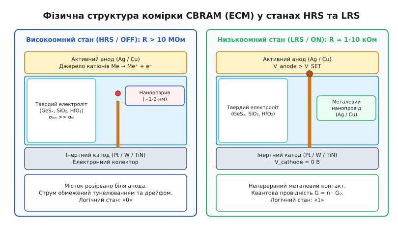
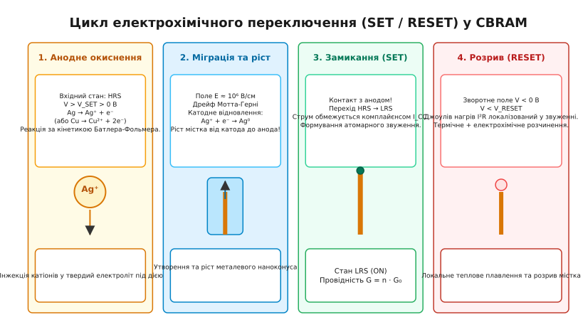
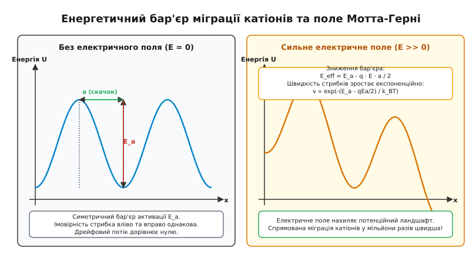
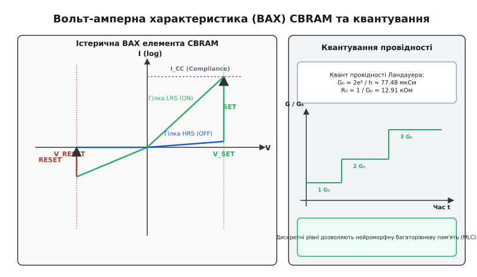

# Провідна місткова оперативна пам'ять (CBRAM / Нанопровода)

<preknowlist>
- [Рухливість носіїв заряду](book:physics/carrier-mobility) — міграція заряду під дією електричного поля та градієнта концентрації.
- [Електроміграція](book:physics/electromigration) — перенос маси речовини під дією високої густини струму й електричного поля.
- [Опір та провідність](book:physics/resistance) — мікроскопічний механізм електронного транспорту у провідниках та диелектриках.
</preknowlist>

При зменшенні фізичних розмірів традиційних осередків планарної та тривимірної Flash-пам'яті нижче `10 нм` товщина ізолюючого тунельного оксиду кремнію стає меншою за `3 нм`. За таких товщин тунельний струм витоку квантовомеханічно розряджає плаваючий затвор або пастку заряду за лічені дні, ламаючи фундаментальну вимогу енергонезалежного збереження даних протягом десяти років. Розв'язанням цієї фізичної кризи стали пристрої резистивної оперативної пам'яті (RRAM), у яких інформація кодується не накопиченим електричним зарядом у ємності, а реверсивною зміною питомого електричного опору твердотільної матриці.

Серед різновидів резистивної пам'яті провідна місткова оперативна пам'ять (**Conductive-Bridging Random-Access Memory, CBRAM**), також відома як пам'ять на основі електрохімічної металізації (**Electrochemical Metallization, ECM**), вирізняється рекордними показниками масштабованості та енергоефективності. Робота комірки CBRAM базується на локальному електрохімічному розчиненні активного металевого анода, переносі катіонів крізь шар твердого електроліту під дією напруженості електричного поля порядка `10⁶ В/см` та формуванні металевого нанопровідника (містками) завтовшки всього в кілька атомарних діаметрів між двома електродами.

## 1. Архітектура двополюсника та фізичний механізм електрохімічної металізації

Елемент пам'яті CBRAM являє собою тонкоплівкову гетероструктуру типу «Метал — Твердий електроліт — Метал» (Metal — Insulator/Solid Electrolyte — Metal, MIM). Фізичний стек складається з трьох послідовних шарів, кожен з яких виконує чітко визначену електрохімічну та електронну функцію.


*Двополюсна структура елемента CBRAM з активним анодом, твердим електролітом та інертним катодом у високоомному (HRS) та низькоомному (LRS) станах.*

Верхній електрод виготовляють із хімічно активного окиснювального металу — найчастіше срібла (`Ag`) або міді (`Cu`). Цей електрод виконує роль донора катіонів. Проміжний шар товщиною `3–15 нм` являє собою іонний провідник або твердий електроліт. У цій ролі використовують як аморфні халькогенідні стекла (сполуки систем `Ge-S`, `Ge-Se`, `Ge-Te`, `Cu-S`), так і високоїзолюючі оксиди напівпровідникової технології (`SiO₂`, `HfO₂`, `Al₂O₃`, `Ta₂O₅`). Нижнім електродом слугує хімічно інертний електронний колектор — платина (`Pt`), вольфрам (`W`), нітрид титану (`TiN`) або вуглець (`C`), який не розчиняється у робочому діапазоні потенціалів. Докладну деталізацію матеріалів та геометричну морфологію шарів висвітлює [конструкція та геометрична морфологія шарів елемента CBRAM](book:physics/condensed-matter-physics/cbram-cell-physics/comp-cbram-stack-structure.md).

Функціонування осередку базується на реверсивному перемиканні між двома крайніми станами провідності:
- **Високоомний стан (High Resistance State, HRS / Стан «0»)**: металевий місток відсутній або розірваний. Опір структури визначається низькою власною провідністю диелектричної матриці та становить `10 МОм ... 1 ГОб`. У цьому стані струм витоку визначається тунелюванням електронів через диелектричний проміжок та термоелектронною емісією Пуле — Френкеля.
- **Низькоомний стан (Low Resistance State, LRS / Стан «1»)**: між анодом і катодом сформовано суцільний металевий нанопровідник з атомів `Ag` або `Cu`. Опір елемента падає до `1 ... 10 кОм`, а електронний транспорт стає балістичним або дифузійним металевим.

Термодинамічним рушієм процесу є різниця електрохімічних потенціалів між електродами. При прикладанні зовнішнього поля електрична енергія компенсує зміну вільної енергії Гіббса при переході металу в іонний стан у матриці, створюючи спрямований потік маси. Перехід супроводжується локальними фазовими змінами у твердому електроліті, де нанокластери срібла створюють провідні канали з низьким активаційним бар'єром. Історичний шлях розвитку електрохімії твердого тіла від перших дослідів Фарадея та Вагнера до відкриття програмованих металізаційних осередків Майклом Козіцьким детально описано у висвітленні [історія відкриття твердих електролітів та розвитку ECM-мемристорів](book:physics/condensed-matter-physics/cbram-cell-physics/hist-ecm-memristors.md).

## 2. Анодні окисно-відновні реакції та кінетика Батлера — Фольмера

Початок процесу запису (перехід SET) вимагає переведення нейтральних атомів металу активного анода в іонізований стан та їхньої інжекції в матрицю твердого електроліту. Коли до активного анода прикладають позитивний потенціал відносно інертного катода (`V_anode > V_SET > 0 В`), на інтерфейсі «Анод / Твердий електроліт» відбувається гетерогенна окисно-відновна реакція:

```
Ag (анод) ⇄ Ag⁺ (електроліт) + e⁻ (зовнішнє коло)
```

Для мідного анода реакція протікає з утворенням одно- або двовалентних катіонів залежно від робочої температури та матриці:

```
Cu (анод) ⇄ Cu²⁺ (електроліт) + 2 e⁻ (зовнішнє коло)
```

Окиснений катіон `Ag⁺` залишає кристалічну ґратку анода і долає потенційний бар'єр сольватації на межі розділу фаз, в той час як звільнений електрон виходиться у зовнішнє електричне коло.


*Послідовні стадії електрохімічної металізації: анодне окиснення, катіонний дрейф, катодне відновлення з ростом містка та Джоулів розрив звуження.*

Швидкість утворення катіонів та відповідна густина струму окиснення `j_ox` підкоряються фундаментальній кінетиці феноменологічного рівняння Батлера — Фольмера. Електрична напруга `V`, прикладена до інтерфейсу, зміщує рівень Фермі електронів та знижує ефективну висоту активаційного бар'єра анодного розчинення:

```
j_ox = j_0 · [ exp( (α · z · q · η) / (k_B · T) ) - exp( -((1 - α) · z · q · η) / (k_B · T) ) ]
```
[рівняння Батлера — Фольмера: анодний та катодний струми на інтерфейсі]

Тут `j_0` позначує рівноважний струм обміну, `α` — коефіцієнт симетрії зарядового переносу (`0 < α < 1`, зазвичай `α ≈ 0.5`), `z` — валентність іона (`z = 1` для `Ag⁺`), `q` — елементарний заряд, `η = V_interface - V_eq` — перенапруження на межі фаз, `k_B` — стала Больцмана, а `T` — локальна абсолютна температура.

При напругах запису, що перевищують `0.3 В`, перенапруження `η` значно перевищує тепловий потенціал `k_B T / (z q)`. За таких умов швидкістю зворотної реакції відкладення металу на аноді можна знехтувати, і кінетика розчинення описується експоненціальним законом Тафеля:

```
j_ox ≈ j_0 · exp( (α · z · q · η) / (k_B · T) )
```

Це означає, що підвищення напруги на кожні `0.1 В` прискорює генерацію катіонів на кілька порядків. Таким чином, швидкість генерації іонного носія на вході в диелектрик повністю визначається прикладеним електричним поляризуючим потенціалом.

Окиснення супроводжується електронним переносом через потенційний бар'єр Шотткі або тунельний бар'єр на межі металу й диелектрика. Зміна заповнення електронних станів на анодному інтерфейсі призводить до накопичення позитивного об'ємного заряду іонів у приповерхневому шарі електроліту. Це накопичення підвищує місцеву напруженість поля, що додатково прискорює подальшу інжекцію катіонів углиб матриці.

## 3. Катіонний транспорт у твердому електроліті: іонний дрейф Мотта — Герні

Утворення катіонів на аноді є лише першою стадією транспорту. Щоб сформувати провідний місток, іони `Ag⁺` або `Cu²⁺` повинні перетнути об'єм диелектричної матриці та досягти протилежного катода.

Усередині аморфного твердого електроліту катіон перебуває у потенційних ямах, утворених сумісними атомами кисню або халькогену. Відстань між сусідніми ямами становить `a ≈ 0.3 ... 0.5 нм`, а висота енергетичного бар'єра між ними за відсутності поля дорівнює `E_a ≈ 0.6 ... 1.0 еВ`. За відсутності зовнішнього поля іони здійснюють хаотичні теплові стрибки з частотою `ν_0 ≈ 10¹³ Гц`, проте результуючий іонний потік дорівнює нулю через симетрію потенціалу.


*Потенційний ландшафт твердого електроліту: симетричний активаційний бар'єр без поля та асиметричне зниження бар'єра у сильному електричному полі.*

При прикладанні зовнішньої напруги `V` у тонкому шарі електроліту товщиною `d ≈ 10 нм` виникає надвисоке електричне поле напруженістю:

```
E = V / d = 1.0 В / (10 × 10⁻⁷ см) = 10⁶ В/см
```

Це поле деформує потенційний рельєф ґратки: для стрибка в напрямку поля енергетичний бар'єр зменшується на величину `ΔE = z · q · E · a / 2`, тоді як для стрибка проти поля бар'єр зростає на таку ж величину. Густина іонного струму дрейфу `j_ion` описується моделлю польового стрибка Мотта — Герні:

```
j_ion = 2 · z · q · n_ion · a · ν_0 · exp( -E_a / (k_B · T) ) · sinh( (z · q · E · a) / (2 · k_B · T) )
```
[модель Мотта — Герні: іонний дрейф у сильному електричному полі]

де `n_ion` — концентрація вільних катіонів у матриці. У сильному електричному полі (`z q E a >> 2 k_B T`) гіперболічний синус переходить в експоненту:

```
j_ion ≈ z · q · n_ion · a · ν_0 · exp( -(E_a - z · q · E · a / 2) / (k_B · T) )
```

Звідси випливає фундаментальна властивість CBRAM: дрейфова швидкість катіонів експоненціально залежить від напруженості електричного поля. При робочій напрузі `V_SET ≈ 1.2 В` іони долають 10-нанометровий шар електроліту за час менше `1 нс`, тоді як при напрузі зчитування `V_READ ≈ 0.1 В` швидкість дрейфу падає на 10 порядків, забезпечуючи стабільність збереженого стану без самодовільного замикання.

Мікроскопічний механізм переносу маси відрізняється від електронного дрейфу: іон має масу у `10⁴ ... 10⁵` разів більшу за електрон, тому його рух супроводжується локальною деформацією кристалічних або аморфних зв'язків середовища. Внаслідок цього іонний дрейф супроводжується утворенням полярних або дефектних комплексів, що знижують місцеву енергію активації для наступних іонів.

Польовий дрейф катіонів у твердому середовищі також розглядається через призму деформаційного полярного транспорту. Катіон `Ag⁺` під час руху захоплює навколишні атоми матриці, створюючи локальний деформаційний потенціал. Ця подвійна квазічастинка пересувається крізь кристалічну або аморфну сітку, перескочуючи між вакансіями й міжвузлями за рахунок термоактивованого флуктуаційного полегшення.

## 4. Катодний ріст нанокаплі, нуклеація та утворення металевого містка

Коли катіони `Ag⁺` досягають поверхні інертного катода (`Pt`, `W` або `TiN`), вони захоплюють електрони, які постачаються з зовнішнього кола через катодний інтерфейс. Відбувається електрохімічна реакція відновлення:

```
Ag⁺ (електроліт) + e⁻ (катод) → Ag⁰ (метал)
```

Відновлені нейтральні атоми металу групуються у стабільні металеві зародки (нуклеація). Завдяки високій поверхневій енергії між зародком металу та матрицею електроліту відновлені атоми стають привабливими центрами для наступних катіонів. На відміну від стандартного електролізу у рідких розчинах, ріст металевого містка в CBRAM відбувається напрямком **від катода до анода**.

У міру нарощування металевого наноконуса від катода відстань між верхівкою містка `h` та анодом зменшується до `d - h`. Це приводить до локального посилення електричного поля в зазорі:

```
E_gap(h) = V / (d - h)
```

Виникає потужний позитивний зворотний зв'язок: що ближче верхівка містка підходить до анода, то вищим стає поле `E_gap`, то швидше дрейфують катіони і то інтенсивнішим стає нарощування металу. Коли верхівка містка торкається анодного електрода, виникає безперервний металевий контакт. Опір структури стрибкоподібно падає на кілька порядків — відбувається перехід осередку в низькоомний стан (SET).

Для запобігання деструктивному тепловому пробою та запіканню занадто товстого містка під час переходу SET струм через комірку жорстко обмежують на певному рівні `I_CC` (Compliance Current) за допомогою послідовного транзистора-селектора. Детальний математичний апарат кінетики росту та теплообміну наведено в висвітленні [математичну модель кінетики іонного транспорту та росту містка](book:physics/condensed-matter-physics/cbram-cell-physics/math-cation-growth.md).

Зміна геометричного профілю містка під час росту підкоряється закону термодинамічної мінімізації поверхневої енергії Гіббса. Якщо швидкість катодного відновлення переважає швидкість іонної інжекції з анода, місток набуває форми гострого наноконуса з мінімальним атомарним перерізом біля анода. Якщо ж обмежуючим етапом є іонний дрейф у товщі електроліту, місток може розгалужуватися на кілька дендритних гілок, що створює багаторазові шляхи провідності.

Геометрія зародження металевої фази на катоді підкоряється закону Томсона — Гіббса: критичний радіус металевого зародка `r_crit` залежить від електрохімічного перенапруження `η`:

```
r_crit = (2 · γ_inter · V_m) / (z · q · η)
```

де `γ_inter` — питома міжфазна поверхнева енергія між металом та електролітом, а `V_m` — молярний об'єм металу. При підйомі напруги `V > V_SET` перенапруження `η` зростає, зменшуючи критичний радіус зародка до суб-нанометрових розмірів (`r_crit < 0.5 нм`), що дозволяє формувати стабільні містки з кількох атомів.

## 5. Квантування провідності та формалізм Ландауера у звуженні нанопровідника

У стані LRS поперечний переріз утвореного металевого містка в його найвужчій частині (атомарному звуженні, constriction) складається лише з одного або кількох атомів срібла чи міді. Коли діаметр звуження `d_constriction` стає порівняним із довжиною хвилі де Бройля для електронів у металі (`λ_F ≈ 0.5 нм`), електронний транспорт перестає підкорятися класичному закону Ома та описується квантовим формалізмом Ландауера — Бюттікера.


*Істерична ВАХ елемента CBRAM у напівлогарифмічному масштабі з позначеними напругами SET/RESET та ступенями квантованої провідності.*

Згідно з формалізмом Ландауера, провідність `G` одновимірного балістичного квантового каналу задається фундаментальним співвідношенням:

```
G = (2 · e² / h) · ∑ T_i = G_0 · ∑ T_i
```
[формула Ландауера: квантування провідності у балістичному нанопровіднику]

де `e` — заряд електрона, `h` — стала Планка, `T_i` — коефіцієнт прозорості `i`-го електронного каналу, а `G_0` — квант провідності Ландауера:

```
G_0 = (2 · e²) / h ≈ 77.48 мкСм   (R_0 = 1 / G_0 ≈ 12.91 кОм)
```

Якщо звуження містка утворює ідеальний атомарний контакт з одного атома срібла (`T_1 = 1`), провідність комірки точно дорівнює `1 G_0` (опір `12.91 кОм`). При розширенні звуження до двох або трьох атомів провідність зростає дискретними ступенями `2 G_0` (`6.45 кОм`), `3 G_0` (`4.30 кОм`) і так далі.

Дискретність провідності CBRAM є основою для створення багаторівневої (MLC) та аналогової синаптичної пам'яті: регулюючи струм обмеження `I_CC` при виготовленні містка, можна стабільно фіксувати різну кількість атомарних каналів `n · G_0`, програмуючи промежуточні значення опору. Зведені електрофізичні параметри, діапазони опорів та специфікації наведено у висвітленні [паспорт специфікацій та електрофізичних параметрів CBRAM](book:physics/condensed-matter-physics/cbram-cell-physics/api-cbram-electrical-params.md).

Хвильова природа електронного транспорту в атомарному звуженні призводить до того, що розсіювання електронів на межах каналу практично відсутнє (балістичний режим). Завдяки цьому густина струму у звуженні може досягати рекордних значений `10⁸ ... 10⁹ А/см²` без негайного руйнування кристалічної решітки електроміграцією, оскільки довжина вільного пробігу електрона перевищує довжину самого звуження.

Формування дискретних квантових сходинок провідності при імпульсному розширенні містка вимірюється експериментально за допомогою осцилографування струму при пікосекундних імпульсах напруги. Наявність плоских плато на рівнях `1 G_0`, `2 G_0`, `3 G_0` прямим чином доводить атомарну дискретність каналу провідності.

## 6. Механізм зворотного розчинення (RESET): локальний Джоулів нагрів та термічний розрив

Для стирання збереженої інформації (перехід RESET із стану LRS у стан HRS) до активного анода прикладають напругу зворотної полярності (`V_anode < 0`, `V_RESET ≈ -0.5 ... -1.0 В`).

Процес стирання розгортається за сумісним електрохімічним та термічним механізмом. Полярність електричного поля тепер сприяє окисненню атомів металу містка та їхній міграції назад до анодного електрода:

```
Ag (місток) → Ag⁺ + e⁻
```

Проте при накладанні зворотної напруги через вузьке металеве звуження протікає високий електронний струм. Згідно із законом Джоуля — Ленца, густина виділення теплової потужності у найвужчому перерізі містка досягає критичних значень:

```
p_joule = j_el² · ρ(T) = (I / A_constriction)² · ρ(T)
```

Оскільки об'єм атомарного звуження є мікроскопічним (`V_constriction < 10⁻²⁴ м³`), виділення тепла викликає швидкий локальний нагрів містка до температур `T_max ≈ 500 ... 700 K`. Одновимірний розподіл температури вздовж містка у стаціонарному наближенні задається рівнянням теплопровідності із законом Відемана — Франца:

```
T_max = T_env + (V_RESET² / (8 · L_Lorenz))
```

де `L_Lorenz = (π² / 3) · (k_B / q)² ≈ 2.44 × 10⁻⁸ В²/К²` — число Лоренца.

Локальне підвищення температури призводить до двох важливих фізичних наслідків:
1. Експоненційно зростає коефіцієнт термоактивованої дифузії атомів срібла або міді `D = D_0 exp(-E_diff / (k_B T))`.
2. Виникає ефект поверхневого натягу рідкої або сильнорозпушеної металевої фази, яка прагне мінімізувати поверхневу енергію та розриває тонкий шийок містка (капілярна нестійкість Релея).

Поєднання Джоулевого нагріву та поля іонного дрейфу приводять до швидкого розриву нанопровідника у найвужчому місці поблизу анодного інтерфейсу за час менше `20 нс`. Між залишком містка та анодом виникає нанометровий ізолюючий зазор, і комірка повертається у високоомний стан HRS. Програмну модель, яка інтегрує описані кінетичні та теплові рівняння для побудови петлі істерезису ВАХ, реалізовано у висвітленні [чисельне моделювання динаміки SET/RESET та ВАХ істерезису CBRAM](book:physics/condensed-matter-physics/cbram-cell-physics/proj-cbram-kinetics-sim.md).

Після розриву містка локальна температура звуження миттєво знижується до кімнатної через високий коефіцієнт тепловідводу в масивні металеві електроди (`d T / dt ≈ 10¹¹ К/с`). Це забезпечує загартування розриву та фіксацію високоомного стану HRS без подальшого теплового пливу атомів.

Розрив містка є термодинамічно стабільним станом, оскільки виникнення нанорозриву шириною `1–2 нм` створює високий тунельний бар'єр. Для повторного з'єднання потрібна позитивна напруга `V_SET`, що перевищує енергетичний бар'єр утворення нового зародка.

## 7. Матеріалознавство твердих електролітів: халькогеніди проти бінарних оксидів

Фізико-хімічні властивості матриці твердого електроліту визначають ключові параметри CBRAM: напругу переключення, швидкодію, час збереження даних (retention) та ресурсоємність (endurance). У сучасній твердотільній електроніці сформувалися два головні класи матеріалів для осередків ECM.

### Халькогенідні стекла (`GeSₓ`, `GeSeₓ`, `Cu₂S`)
Халькогенідні аморфні матриці володіють низькою енергією активації міграції катіонів срібла чи міді (`E_a ≈ 0.3 ... 0.5 еВ`).
- **Переваги**: надзвичайно низька напруга переключення (`V_SET < 0.5 В`), висока іонна рухливість, можливість роботи при низьких струмах обмеження (`I_CC < 1 мкА`).
- **Недоліки**: відносно низька температура кристалізації халькогенідних склів (`T_cryst ≈ 200 ... 250 °C`). Це ускладнює їхнє проходження крізь стандартний технологічний цикл інтеграції BEOL (Back-End-of-Line), який вимагає термічної стійкості до `400 °C`.

### Бінарні оксиди диелектриків (`SiO₂`, `HfO₂`, `Al₂O₃`, `Ta₂O₅`)
Прості оксиди кремнію та перехідних металів є базовими диелектриками сучасних CMOS-транзисторів.
- **Переваги**: абсолютна сумісність із кремнієвим виробництвом, висока термічна стабільність (до `450 °C`), висока напруга тунельного пробою HRS.
- **Особливості**: оскільки щільна кристалічна або аморфна структура оксиду має високий енергетичний бар'єр активації іонного дрейфу (`E_a ≈ 0.8 ... 1.2 еВ`), для ефективної міграції `Ag⁺` або `Cu²⁺` у шар оксиду вводять спеціальні дефекти, створюють пористу структуру або використовують ультратонкі шари товщиною `2 ... 5 нм`.

Вибір матеріалу електроліту також визначає механізм розпадного зносу (degradation). У халькогенідних матрицях тривале циклювання може призводити до накопичення надлишкового срібла в об'ємі матриці, що знижує опір HRS. В оксидних матрицях головним чинником деградації є генерація власних кисневих вакансій під дією сильного поля, що з часом трансформує ECM-механізм у змішаний ECM/VCM режим.

Мікроструктурне моделювання показує, що двошарові диелектричні стеки (наприклад, `Al₂O₃ / HfO₂`) поєднують переваги обох типів матеріалів. Шар `HfO₂` слугує резервуаром із високою катіонною провідністю, а тонкий шар `Al₂O₃` товщиною `1 нм` працює як тунельний обмежувальний бар'єр, що пригнічує струми витоку і звужує статистичний розкид опорів HRS.

## 8. Масштабування, стохастичність та застосування у нейроморфних обчисленнях

Фундаментальною перевагою пристроїв CBRAM є їхня унікальна фізична масштабованість. Оскільки функціональним елементом збереження інформації є металевий нанопровідник з атомарним перерізом, фізичний розмір всієї двополюсної комірки обмежується лише можливостями літографії форм-фактора електродів. У дослідних лабораторних зразках продемонстровано працездатність осередків площею менше `5 нм × 5 нм`.

Головним фізичним викликом при практичній експлуатації CBRAM є **стохастичний характер нуклеації та росту містка**. Оскільки утворення зародка металу на катоді є ймовірнісним процесом, траєкторія та точна атомарна конфігурація звуження містка відрізняються від циклу до циклу (Cycle-to-Cycle варіативність) та від комірки до комірки (Device-to-Device варіативність). Це спричиняє флуктуації напруги `V_SET` в межах `±0.2 В` та опору `R_LRS`. Для пригнічення стохастичності застосовують алгоритми програмування імпульсами з зворотним зв'язком (Write-Verify) та інженерію дефектів електроліту для фіксації точки нуклеації містка.

Стохастичні флуктуації моментів нуклеації описуються статистикою Пуассонівських процесів. Середній час очікування утворення зародка `τ_nuc` залежить від надлишку напруги над пороговим значенням:

```
τ_nuc = τ_0 · exp( (E_nuc - z · q · V) / (k_B · T) )
```

Ця статистична варіативність обмежує використання CBRAM у високошвидкісних масивах cache-пам'яті, проте створює унікальні переваги для генераторів дійсних випадкових чисел (True Random Number Generators, TRNG) та фізично неклонованих функцій (PUF) у криптографічних мікросхемах.

Окрім традиційної енергонезалежної пам'яті зі станами «0» та «1», фізика CBRAM відкрила широкі перспективи у **нейроморфній інженерії**. Динаміка поступового проростання або розчинення нанопровідника под дією пачки коротких електричних імпульсів точно копіює біологічні явища синаптичної пластичності — тривалої потенціації (Long-Term Potentiation, LTP) та тривалої депресії (Long-Term Depression, LTD). Великі кросбар-матриці CBRAM дозволяють виконувати операції аналогового матрично-векторного множення (Vector-Matrix Multiplication, VMM) безпосередньо в масиві пам'яті за законами Кірхгофа та Ома, досягаючи рекордного прискорення обчислень штучних нейронних мереж із мінімальними витратами енергії.
