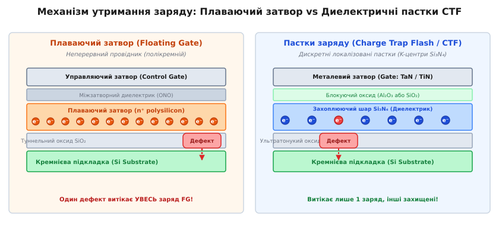
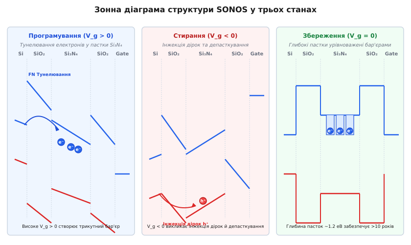
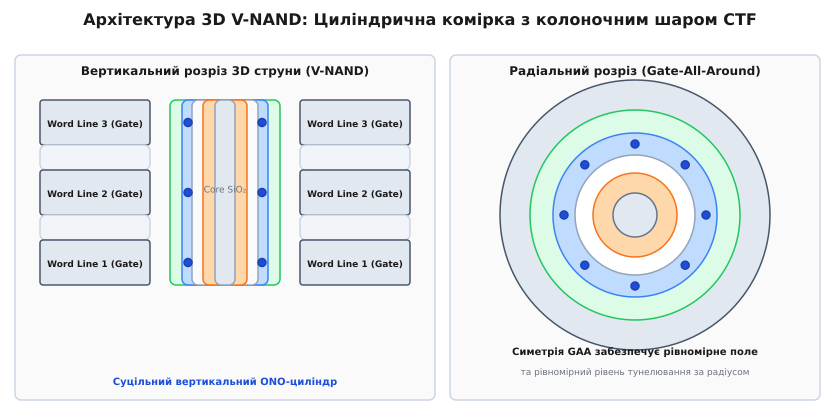

# Локалізований захват заряду та Flash-пам'ять SONOS/CTF

<preknowlist>
- [PN-перехід: бар'єр і збіднена область](topic:physics/pn-junction) — гомоперехід, збіднена область, вбудований потенціал та дифузія носіїв.
- [Тунелювання та термоелектронна емісія](topic:physics/thermal-field-emission) — потенціальні бар'єри, проходження частинки та термополева емісія.
- [Зонна теорія твердих тіл](topic:physics/conductors-insulators) — валентна зона, зона провідності, ширина забороненої зони та діелектричні властивості.
- [Рівень Фермі та робота виходу](topic:physics/fermi-level) — термодинамічна рівновага, розподіл Фермі-Дірака та контактна різниця потенціалів.
</preknowlist>

Коли розмір кремнієвого транзистора у планарних мікросхемах энергонезалежної Flash-пам'яті зменшився нижче 20 нанометрів, класична архітектура з плаваючим затвором (*Floating Gate*) зіткнулася з жорсткою фізичною стіною. У плаваючому затворі електрони зберігаються у суцільному провідному шарі полікремнію у вигляді вільного електронного газу. Зменшення товщини тунельного диелектрика `SiO2` нижче 7–8 нанометрів призводило до катастрофічного наслідку: появи в оксиді хоча б одного локального кристалічного дефекту або нанотріщини виявлялося достатньо, щоб **усі** накопичені в плаваючому затворі електрони за частки секунди витекли у кремнієву підкладку, повністю стерши записану інформацію.

Крім того, плаваючий затвор має значну товщину (понад 20–30 нм), через що два сусідні плаваючі затвори, розташовані на відстані 15 нм один від одного, утворюють паразитний конденсатор з високою ємністю. Заряд, записаний в одну комірку, за рахунок паразитного ємнісного зв'язку (*FG-to-FG Crosstalk*) змінював порогову напругу сусідньої комірки, викликаючи масові помилки зчитування.

Фундаментальним виходом із цієї фізичної кризи стала заміна суцільного провідника на диелектрик із високою концентрацією локалізованих точкових пасток заряду — архітектура **Charge Trap Flash (CTF)**, найвідомішим втіленням якої є структура **SONOS** (*Silicon-Oxide-Nitride-Oxide-Silicon*). У цій системі кожен інжектований електрон міцно «закривається» у власній ізольованій потенціальній ямі всередині аморфного нітриду кремнію `Si3N4`. Поява дефекту в оксиді зумовлює витік лише одного носія, розташованого безпосередньо над дефектом, тоді як мільйони інших сусідніх пасток залишаються цілісними.

Саме фізика локалізованого захвату заряду дозволила потоншити тунельні диелектрики до 1.5–2 нанометрів, знизити напруги програмування та прокласти шлях до створення сучасних трьохвимірних мікросхем пам'яті (3D V-NAND / BiCS), у яких сотні шарів осередків шикуються у вертикальні квантові колони.

---

### Фізична мотивація: чому провідник поступається пасткам

Щоб зрозуміти, чому дискретний захват заряду став фундаментальною основою мікроелектроніки XXI століття, слід порівняти поведінку носіїв у провіднику та диелектрику з пастками при наявності локального руйнування ізолятора.

У плаваючому затворі електронний газ описується хвильовими функціями Блоха, що вільно перекриваються по всьому об'єму полікремнію. Якщо у прилеглій оксидній плівці створюється дефектний канал (пінхол) із підвищеною тунельною провідністю, вільні електрони миттєво дрейфують до цього дефекту завдяки високій рухливості (`μ_n ≈ 50–100 cm²/(V·s)`). Заряд розряджається повністю.

У шарі аморфного нітриду кремнію `Si3N4` електрони потрапляють у глибокі локалізовані стани — **K-центри** (дефекти перерваних кремнієвих зв'язків). Хвильова функція захопленого електрона згасає на відстані кількох ангстрем:

```
ψ(r) ∝ exp(-r / r_0)                  [локалізація хвильової функції]
```

де `r_0 ≈ 0.3–0.5 nm` — характерний радіус локалізації. Оскільки бічна (латеральна) провідність у нітриді за відсутності сильного електричного поля прямує до нуля, електрони втрачають здатність вільно переміщатися вздовж шару.

[Історія еволюції Flash-пам'яті від MNOS до 3D NAND](topic:physics/charge-trap-flash/hist-sonos-evolution.md) детально показує, як перехід від алюмінієвих затворів MNOS до багатошарових систем SONOS, MONOS та 3D V-NAND перетворив лабораторну аномалію 1967 року на головну технологію збереження даних у світі.


*Порівняльний механізм витоку заряду: у плаваючому затворі одиночний дефект викликає повну розрядку провідника, у CTF — витікає лише один заряд із локалізованої пастки.*

---

### Зонний профіль та потенціальний рельєф структури SONOS

Багатошаровий стек SONOS являє собою послідовність атомарно-тонких плівок, що утворюють складний потенціальний рельєф для електронів у зоні провідності `E_c` та дірок у валентній зоні `E_v`.

Класична планарна структура SONOS складається з п'яти послідовних шарів:
1. **S**ubstrate: Напівпровідникова підкладка p-типу з монодефектного кремнію `Si` (ширина забороненої зони `E_g = 1.12 eV`, спорідненість `χ = 4.05 eV`);
2. **O**xide: Ультратонкий тунельний диелектрик `SiO2` товщиною `d_tox = 1.5–2.5 nm` (`E_g = 8.9 eV`, `χ = 0.9 eV`);
3. **N**itride: Диелектричний шар пасток з аморфного нітриду кремнію `Si3N4` товщиною `d_nit = 4–7 nm` (`E_g = 5.1 eV`, `χ = 2.1 eV`);
4. **O**xide: Блокуючий диелектрик `SiO2` або High-k `Al2O3` товщиною `d_box = 6–10 nm` (`E_g = 8.8 eV`, `χ = 1.0 eV`);
5. **S**ilicon Gate: Управляючий затвор із сильнолегованого n⁺ полікремнію або металу (`TaN`/`TiN`).

#### Енергетичні розриви на межах розділу
За правилом Андерсона при з'єднанні шарів виникають стрибки дна зони провідності `ΔE_c` та верху валентної зони `ΔE_v`:

- **Межа кремній / тунельний SiO2:**
  ```
  ΔE_c(Si/SiO2) = χ_Si - χ_SiO2 = 4.05 - 0.9 = 3.15 eV   [потенціальний бар'єр для електронів]
  ```
  ```
  ΔE_v(Si/SiO2) = E_g(SiO2) - E_g(Si) - ΔE_c = 8.9 - 1.12 - 3.15 = 4.63 eV  [бар'єр для дірок]
  ```

- **Межа тунельний SiO2 / захоплюючий Si3N4:**
  ```
  ΔE_c(SiO2/Si3N4) = χ_Si3N4 - χ_SiO2 = 2.1 - 0.9 = 1.20 eV  [стрибок зони провідності]
  ```
  ```
  ΔE_v(SiO2/Si3N4) = E_g(SiO2) - E_g(Si3N4) - ΔE_c = 8.9 - 5.1 - 1.20 = 2.60 eV  [стрибок валентної зони]
  ```

У результаті шар нітриду кремнію `Si3N4`, затиснутий між двома шарами `SiO2` з ширшою забороненою зоною, утворює **глубоку потенціальну яму** першого типу (вкладене зонне вирівнювання). Дно зони провідності `Si3N4` лежить на 1.95 еВ нижче за дно зони провідності `SiO2` (відносно сили вакуумного рівня), що створює природний квантовий конфайнмент для інжектованих електронів.


*Зонна діаграма структури SONOS у станах програмування (V_g > 0), стирання (V_g < 0) та тривалого збереження (V_g = 0).*

---

### Фізична природа диелектричних пасток: K-центри

Захоплення носіїв у шарі `Si3N4` відбувається не у квантовані рівні вільного руху, а у точкові дефекти аморфної сітки нітриду кремнію (`a-SiN_x:H`).

Основним фізичним носієм пасткування є так званий **K-центр** — атом кремнію, зв'язаний із трьома атомами азоту, який має один неспарений електрон та обрив зв'язку (*dangling bond*), що позначається хімічною формулою `·Si≡N3`.

K-центри володіють амфотерною природою і можуть перебувати у трьох зарядових станах:

1. **`K^+` (Позитивний стан / Порожня пастка):** Атом кремнію втратив електрон (`Si≡N3^+`). Створює сильний кулонівський потенціал притягання для електронів зони провідності.
2. **`K^0` (Нейтральний стан):** Атом містить один неспарений електрон (`·Si≡N3`). Стан є парамагнітним і фіксується методом електронного парамагнітного резонансу (ЕПР).
3. **`K^-` (Негативний стан / Заповнена пастка):** Пастка захопила **пару електронів** із протилежними спінами (`:Si≡N3^-`). Завдяки ефекту негативного кореляційного енергетичного зсуву (негативна енергія Габбарда `U < 0`) локальна релаксація атомарної ґратки кремнію зсуває атом `Si` у площину трьох атомів азоту, виграючи більше енергії деформації, ніж кулонівське відштовхування двох електронів.

Глибина потенціальної ями K-центра `E_t` становить від **1.1 до 1.5 еВ** відносно дна зони провідності `Si3N4`. Оскільки теплова енергія за кімнатної температури `k_B · T ≈ 0.026 eV` є на два порядки меншою за глибину пастки `E_t`, ймовірність термічного депасткування електрона за відсутності сильного електричного поля є нікчемно малою. Це забезпечує теоретичний час збереження заряду понад 100 років при температурах до 85 °C.

---

### Фізичні режими роботи: Програмування, Стирання та Збереження

Функціонування осередку CTF базується на керованій зміні кількості локалізованого заряду за допомогою тунелювання та полевої емісії.

#### 1. Режим програмування (Program: V_g > 0)
До управляючого затвора прикладається позитивний імпульс напруги `V_g = +15 – +20 V`, а підкладка заземлюється.
- В електричному полі `E_ox > 8 MV/cm` потенціальний бар'єр тунельного оксиду стає трикутним.
- Електрони з інверсійного каналу кремнію тунелюють крізь оксид за допомогою **тунелювання Фаулера-Нордгейма** (або прямого тунелювання при `d_tox < 2 nm`) у зону провідності `Si3N4`.
- Просуваючись углиб нітриду, електрони з високою ймовірністю захоплюються позитивними й нейтральними K-центрами (`K^+ + e⁻ → K^0` та `K^0 + e⁻ → K^-`).
- Накопичений негативний заряд `Q_t` створює протиполе, яке зменшує напруженість поля в тунельному оксиді, автоматично зупиняючи інжекцію (ефект самолімітування). Порогова напруга транзистора `V_th` зсувається у позитивний бік на величину `ΔV_th`.

#### 2. Режим стирання (Erase: V_g < 0)
До управляючого затвора прикладається негативна напруга `V_g = -15 – -20 V`.
- Напруженість поля змінює знак, а зонний рельєф нахиляється у протилежний бік.
- Запускаються два паралельні фізичні процеси:
  1. **Інжекція дірок з підкладки:** Дірки з валентної зони Si тунелюють крізь валентний бар'єр `SiO2` (`ΔE_v = 4.63 eV`) і потрапляють у `Si3N4`, де анігілюють із захопленими електронами:
     ```
     K^- + h⁺ → K^0 ;   K^0 + h⁺ → K^+    [рекомбінація носіїв у пастці]
     ```
  2. **Польове депасткування електронів:** Високе електричне поле знижує бар'єр пасток за рахунок **ефекту Пула-Френкеля**, прискорюючи вихід електронів у зону провідності `Si3N4` з наступним тунелюванням назад у кремнієву підкладку.
- Блокуючий оксид `SiO2`/`Al2O3` запобігає зворотній інжекції електронів із металевого затвора в нітрид, гарантуючи досягнення низького порогового рівня стирання.

#### 3. Режим збереження (Hold / Retention: V_g = 0)
Усі зовнішні напруги зняті.
- Електрони локалізовані у потенціальних ямах K-центрів глибиною ~1.2 еВ.
- З обох боків шар нітриду заблокований високими енергетичними бар'єрами `SiO2` (`ΔE_c = 1.95 eV`).
- Термічний викид за кімнатної температури придушений експоненціальним фактором Больцмана `exp(-E_t / (k_B · T))`.

[Математичний апарат тунелювання, пасткування та емісії Пула-Френкеля](topic:physics/charge-trap-flash/math-trapping-kinetics.md) наводить точні диференціальні рівняння ВЕНК-тунелювання, кінетики заповнення пасток та електростатичний розрахунок зсуву порогової напруги через центроїд заряду `z_bar`.

---

### Матеріалознавча еволюція: від SONOS до MONOS та TANOS

Хоча класична структура SONOS довела свою життєздатність, зростання вимог до швидкодії стирання виявило її слабке місце — паразитне зворотне тунелювання електронів із полікремнієвого затвора під час стирання за негативної напруги.

Щоб подолати цей ефект, фізика конденсованого стану запропонувала три послідовні матеріалознавчі модифікації:

```
SONOS (Si - SiO2 - Si3N4 - SiO2 - PolySi)
  ↓ [Заміна Poly-Si на метал із високою роботою виходу]
MONOS (Si - SiO2 - Si3N4 - SiO2 - TiN/W)
  ↓ [Заміна блокуючого SiO2 на High-k Al2O3]
TANOS (Si - SiO2 - SiN_x - Al2O3 - TaN)
```

[Архітектура та інженерія матеріалів осередків SONOS, MONOS, TANOS та 3D CTF](topic:physics/charge-trap-flash/comp-3d-ctf-cell.md) дає порівняльну таблицю товщин, діелектричних проникностей `k` та ширин заборонених зон `E_g` для всіх шарів новітніх осередків пам'яті.

Ключовим проривом у структурі **TANOS** стало застосування **оксиду алюмінію Al2O3** як блокуючого диелектрика:
- Оксид алюмінію має ширину забороненої зони `E_g ≈ 8.8 eV` та високу діелектричну проникність `k_Al2O3 ≈ 9.0` (проти `k_SiO2 = 3.9`).
- Згідно з умовою неперервності нормальної компоненти вектора електричного зсуву `D = ε · E`, напруженість поля у тунельному оксиді відносно блокуючого шару зростає пропорційно відношенню їхніх діелектричних сталих:

```
E_tox = E_box · (ε_box / ε_tox)         [підсилення поля в тунельному оксиді]
```

Завдяки цьому використання `Al2O3` дозволяє створити сильне тунельне поле `E_tox` при значно меншому полі в блокуючому шарі `E_box`, що майже повністю блокує зворотну інжекцію носіїв із металевого затвора `TaN` (робота виходу `Φ_m ≈ 4.6 eV`) та розширює вікно пам'яті `ΔV_th` до 5–6 Вольт.

---

### Трьохвимірна архітектура 3D V-NAND (Gate-All-Around)

Найважливішим досягненням технології Charge Trap Flash став її перехід у третій вимір. У 2010-х роках планарне масштабування Flash-пам'яті остаточно зупинилося на позначці 15 нм через фізичну неможливість подальшого зближення осередків. Концепція 3D V-NAND розвернула масив комірок вертикально, вибудовуючи циліндричні струни крізь сотні горизонтальних металевих шарів затворів.

Реалізація 3D V-NAND на концепції Floating Gate виявилася б неможливою: розрізати металеві плаваючі затвори на тисячі ізольованих кілець всередині вузького отвору глибиною 5–10 мікрометрів технологічно нереально.

В архітектурі CTF шар пасток `Si3N4` наноситься як **суцільний неперервний вертикальний циліндр** уздовж усього травленого отвору каналу:


*Поперечний та радіальний розрізи 3D V-NAND комірки з круговою симетрією Gate-All-Around.*

Будова циліндричної осередки Gate-All-Around (GAA) у 3D V-NAND:
1. **Центральне диелектричне ядро (Core SiO2):** Стержень з оксиду кремнію, що заповнює серединний простір каналу (структура *Macaroni*).
2. **Тонкий кремнієвий канал (Poly-Si Channel):** Кільцевий шар з нелегованого полікремнію товщиною ~8–10 нм.
3. **Концентричний тунельний оксид (Tunnel SiO2):** Тонка плівка `SiO2` (~2 нм).
4. **Вертикальний шар пасток (Si3N4 Trapping Layer):** Неперервний нітридний циліндр (~5 нм).
5. **Блокуючий High-k шар (Al2O3):** Зовнішнє диелектричне кільце (~8 нм).
6. **Горизонтальний управляючий затвор (Gate Metal: W):** Пластина вольфраму, яка охоплює циліндр на 360°.

#### Електростатичні переваги кругової симетрії GAA
У круговій геометрії Gate-All-Around електричне поле `E(r)` підпорядковується логарифмічному розподілу потенціалу. Напруженість поля поблизу внутрішнього радіуса каналу `r_ch` виражається формулою:

```
E(r_ch) = V_g / (r_ch · ln(r_gate / r_ch))  [підсилення поля у циліндричній геометрії]
```

Це радіальне підсилення поля створює вищу тунельну густину струму при нижчих зовнішніх напругах програмування `V_g` й усуває паразитні крайові ефекти концентрації поля на кутах, властиві планарним транзисторам.

---

> 🔧 **Навіщо це.**
>
> Фізика локалізованого захвату заряду CTF безпосередньо визначає характеристики та надійність усіх сучасних накопичувачів SSD, смартфонів та серверних масивів даних:
> 
> 1. **Багаторівневі комірки (TLC / QLC / PLC):** Завдяки високій стабільності локалізованого заряду у `Si3N4` інженери ділять вікно порогової напруги `ΔV_th` на 8 (TLC, 3 біти/комірку) або 16 (QLC, 4 біти/комірку) дискретних рівнів. Відстань між сусідніми зарядовими станами в QLC становить лише **кілька десятків електронів**!
> 
> 2. **Компенсація термічного витоку (Read Reclaim):** При тривалій експлуатації SSD за високих температур (60–70 °C) спостерігається повільне депасткування електронів через ефект Пула-Френкеля. Контролер SSD неперервно підраховує кількість помилок коду корекції (LDPC) і при наближенні до межі зчитування автоматично перезаписує блок даних у нові осередки (*Read Reclaim*).
> 
> 3. **Утримання даних у космічній та автомобільній електроніці:** Радіаційно-стійкі мікросхеми SONOS використовуються в супутниках та бортових комп'ютерах автомобілів (стандарт AEC-Q100). Проходження важкої зарядженої космічної частинки крізь CTF викликає локальну розрядку лише кількох пасток уздовж треку частинки, на відміну від Floating Gate, де одна частинка повністю знищує вміст всієї комірки пам'яті.

---

### Порівняльний синтез: Floating Gate проти Charge Trap Flash

Для підсумкового узагальнення фізико-технічних відмінностей зведемо ключові параметри обох концепцій энергонезалежної пам'яті:

| Фізична характеристика | Плаваючий затвор (Floating Gate) | Локалізовані пастки (Charge Trap Flash) |
| :--- | :--- | :--- |
| **Фізичний стан заряду** | Вільний електронний газ у провіднику | Локалізовані електрони у K-центрах ізолятора |
| **Матеріал накопичувача** | Сильнолегований n⁺ полікремній | Аморфний нітрид кремнію `Si3N4` / `SiN_x` |
| **Товщина тунельного SiO2** | ≥ 7–8 нм (критичне обмеження) | 1.5–2.5 нм (ультратонка) |
| **Вплив одиночного дефекту** | Катастрофічний (повне витікання заряду) | Незначний (втрата лише 1 локального заряду) |
| **Міжзатворна паразитна ємність** | Висока (FG-to-FG crosstalk обмежив масштабування) | Мінімальна (відсутність суцільного провідника) |
| **Напруга програмування** | 18 – 22 Вольт | 10 – 14 Вольт |
| **Придатність до 3D-масштабування** | Практично неможлива у масовому виробництві | Ідеальна (суцільний вертикальний ONO-циліндр) |
| **Основний механізм деградації** | Пробій оксиду SILC, ємнісна наводка | Вертикальна дифузія заряду за високих T |

Фізика диелектричних пасток заряду SONOS/CTF перетворила недолік матеріалу — наявність структурних дефектів у нітриді кремнію — на головну функціональную перевагу. Заміна вільного електронного газу на локалізовані квантові стани у K-центрах дозволила подолати фундаментальні ліміти масштабування та створила основу для сучасної напівпровідникової індустрії збереження інформації.
