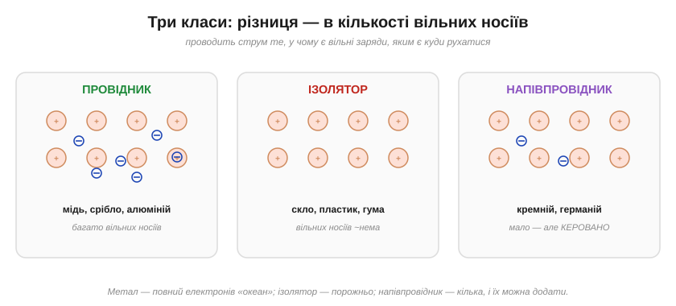
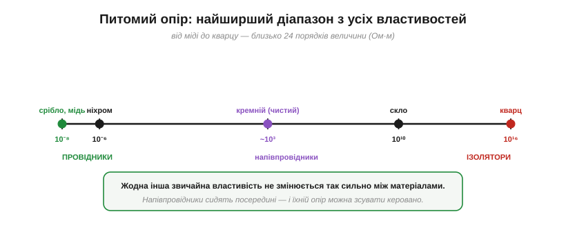

# Чому одні матеріали проводять, а інші ні: механізм провідності

Метал має [«море» вільних електронів](topic:physics/electron-drift), а ізолятор — ні. Та чому, власне, в одних речовинах електрони вільні, а в інших — намертво прив'язані? Це не дрібниця, а **головне** питання матеріалознавства електроніки: відповідь на нього пояснює, чому дроти роблять із міді, ізоляцію — з пластику, а мікросхеми — з кремнію.

### Усе вирішує кількість вільних носіїв

Провідність зводиться до однієї простої умови: **щоб матеріал проводив струм, у ньому мають бути вільні заряди, яким є куди рухатися**. Що більше таких вільних носіїв, то краще речовина проводить. За цією ознакою всі матеріали діляться на три класи.

***Провідник** (мідь, срібло) — повний «океан» вільних електронів. **Ізолятор** (скло, пластик, гума) — вільних носіїв практично нема. **Напівпровідник** (кремній, германій) — їх мало, але, на відміну від перших двох, їхню кількість можна **керовано змінювати**. Уся різниця — у числі вільних носіїв.*

**Провідники** (метали) повні вільних електронів — звідси чудова провідність. **Ізолятори** (діелектрики; гр. *diá* — крізь, бо поле крізь них проходить, а струм — ні) їх майже не мають — тому й не проводять (скло, кераміка, пластик, суха деревина, гума). А **напівпровідники** сидять посередині: вільних носіїв у них мало, але — і це ключове — їхнє число можна **збільшувати** теплом, світлом чи домішками. Саме ця **керованість** і зробила напівпровідники основою всієї електроніки.

### На рівні атомів: відірвані чи зв'язані

Звідки ж беруться (чи не беруться) вільні електрони? Усе залежить від того, **наскільки міцно** атоми тримають свої зовнішні (валентні) електрони.

*У **провіднику** металевий зв'язок такий, що валентні електрони **відриваються** від атомів і гуляють по всьому об'єму — утворюючи [спільне «море»](book:physics/electron-drift). В **ізоляторі** електрони **міцно зв'язані** зі своїми атомами (чи парами атомів у хімічному зв'язку) — відірватися й мандрувати нікому.*

У металі зовнішні електрони тримаються так слабко, що з радістю «усуспільнюються». В ізоляторі ж — навпаки: всі електрони задіяні в міцних зв'язках між атомами, вільних не лишається, і прикладеному полю просто **нема кого** штовхати. Тому ізолятор може витримувати напругу без струму (саме за це ми його й цінуємо).

Чому ж метали тримають валентні електрони так слабко? Бо для відриву зовнішнього електрона їм треба зовсім мало енергії (низька **енергія іонізації**) — атому «вигідніше» віддати його у спільний фонд. А в ізоляторах електрони сидять у міцних спрямованих зв'язках між сусідніми атомами, де кожен потрібен «на своєму місці», — відпускати нема кого й нема куди.

### Глибше «чому»: енергетична щілина

Та чому в одних речовин зв'язок слабкий, а в інших — міцний? Найглибша відповідь — у квантовій картині **енергетичних зон**. Електрони в твердому тілі можуть мати енергію не будь-яку, а лише в дозволених «зонах», розділених забороненими **щілинами**. Нижча зона (валентна) заповнена електронами; щоб електрон став **рухливим**, він мусить піднятися у вищу, порожню зону (провідності) — перестрибнувши щілину.

***Метал**: зони стикаються, щілини практично нема — електрони вільно переходять у зону провідності, тож завжди рухливі. **Напівпровідник**: щілина **мала** — частина електронів перестрибує її від тепла чи світла, даючи трохи носіїв. **Ізолятор**: щілина **велика** — стрибнути нікому, носіїв нема.*

Ось і вся таємниця трьох класів, в одній картинці. У металі щілини фактично немає — електрони завжди рухливі. В ізоляторі щілина така широка, що жодному електронові звичайних умов її не подолати — провідності нема. А **напівпровідник** — це матеріал із **вузькою** щілиною: за абсолютного нуля він був би ізолятором, та за кімнатної температури теплової енергії вистачає, щоб дещиця електронів перестрибнула щілину й стала носіями. Тому-то нагрівання чи освітлення помітно **збільшує** провідність напівпровідника — на цьому працюють терморезистори й фотодавачі.

Щоб ці слова стали конкретними — ось числа (у зручних [електронвольтах](topic:physics/electric-potential)). У металів щілина практично нульова. У кремнію вона ≈ 1.1 еВ — невелика, тож дрібка теплової енергії вже закидає окремі електрони нагору. А в типового ізолятора (як алмаз) щілина ≈ 5.5 еВ — настільки широка, що подолати її майже неможливо. Різниця всього в кілька електронвольтів — а матеріали по різні боки прірви: один проводить, інший ні.

З цього випливає разюча відмінність у поведінці з **температурою**. Нагрій метал — і він проводить **гірше**: вільних електронів від тепла не більшає (їх і так повний океан), зате решітка дужче коливається, зіткнень стає більше, і [дрейф](topic:physics/electron-drift) гальмується. А нагрій напівпровідник — і він проводить **краще**: тепло закидає через щілину **нові** носії, і їх помітно прибуває. Метал і напівпровідник реагують на тепло **протилежно** — і це не курйоз, а робочий факт: на ньому ґрунтуються терморезистори різних типів (PTC у металах, NTC у напівпровідниках). Сама ця [залежність опору від температури](topic:physics/resistance-temperature) має окрему кількісну картину.

> 🔧 **Навіщо це.** Звідси прямий практичний поділ матеріалів у будь-якому пристрої: **мідь** (провідник) — для дротів і доріжок, де струм має текти вільно; **пластик, лак, кераміка** (ізолятори) — для ізоляції, корпусів, прокладок, де струм текти не повинен; **кремній** (напівпровідник) — для самих «мізків», бо лише ним можна **керувати**. Дивлячись на будь-яку плату, ви бачите всі три класи разом, кожен на своєму місці.

### Розмах, якого нема в жодної іншої властивості

Наскільки ж різняться ці класи в числах? Вражаюче.

*Питомий опір речовин (Ом·м) тягнеться приблизно на **24 порядки** — від ~10⁻⁸ у срібла й міді до ~10¹⁶ у кварцу. Це найширший діапазон з усіх звичайних фізичних властивостей матеріалів. Напівпровідники лежать посередині — і їхнє місце на шкалі можна керовано зсувати.*

Жодна інша звична властивість речовини — ні густина, ні міцність, ні теплоємність — не змінюється між матеріалами так колосально, як **електропровідність**. Між найкращим провідником і найкращим ізолятором — двадцять із гаком порядків величини. Саме ця прірва й дає змогу так чітко розділяти «дроти» й «ізоляцію»: різниця між ними не у відсотках, а в трильйони трильйонів разів.

А на самому краю діапазону чекає диво: деякі матеріали, охолоджені до дуже низьких температур, втрачають опір **геть повністю** — стають **надпровідниками**, у яких струм може текти роками без жодних втрат. Це окрема дивовижна історія самостійного фізичного явища.

### Чому напівпровідники змінили світ

Окремо варто наголосити на середньому класі. Сама по собі помірна провідність кремнію не була б цікавою — цінне інше: її можна **навмисно й точно змінювати**. Додавши до надчистого кремнію дрібку домішок ([**легування**](topic:physics/doping), *doping*), у нього «підсаджують» зайві вільні носії — електрони або [дірки](topic:physics/current-direction). Так із [керованого матеріалу](topic:physics/semiconductor) будують діоди й транзистори, де провідність **вмикають і вимикають** напругою. Уся цифрова й аналогова електроніка — це мистецтво керувати числом носіїв у напівпровіднику; тут важливо відчути: напівпровідники цінні не тим, що проводять, а тим, що проводять **рівно настільки, наскільки ми скажемо**.

> 🔧 **Навіщо це.** Залежність провідності напівпровідника від тепла й світла — це не вада, а основа цілого класу давачів: **терморезистор** (NTC/PTC) міняє опір від температури, [**фоторезистор**](topic:electronics/photo-sensors) і фотодіод — від освітлення. А головне — керованість легуванням дала транзистор, тобто весь сучасний світ обчислень. Один матеріал посередині шкали виявився важливішим за обидва її кінці.

Наостанок — ізолятори не такі вже й абсолютні. Якщо [поле](topic:physics/electric-field) стає **дуже** великим, воно здатне силою відірвати електрони навіть від атомів, що міцно їх тримають — і тоді ізолятор раптом «проб'є» й пропустить струм (іскра, пробій діелектрика). Тобто «не проводить» означає «не проводить **за звичайних** полів»; досить сильне поле здолає будь-яку щілину.

---

Коротко: провідність визначається **кількістю вільних носіїв** заряду. У **провідниках** (метали) валентні електрони відірвані й утворюють «море» — носіїв безліч; в **ізоляторах** електрони міцно зв'язані — вільних нема; **напівпровідники** мають вузьку енергетичну **щілину**, тож носіїв мало, зате їхнє число **керовано** змінюють теплом, світлом і легуванням — на цьому стоїть уся електроніка. Розмах питомого опору — ~24 порядки, найбільший серед властивостей речовини. Навіть у доброму провіднику руху щось заважає — звідси й [опір металу](topic:physics/resistance-origin).

---
