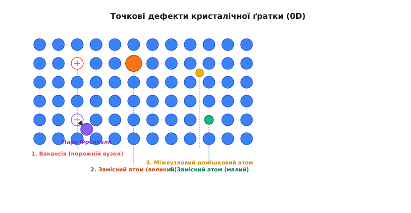
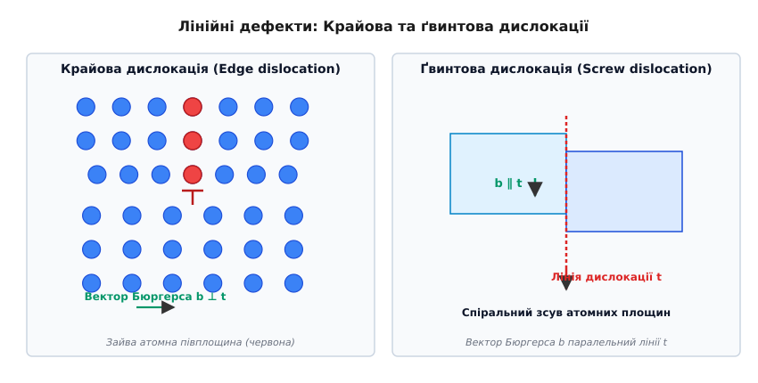
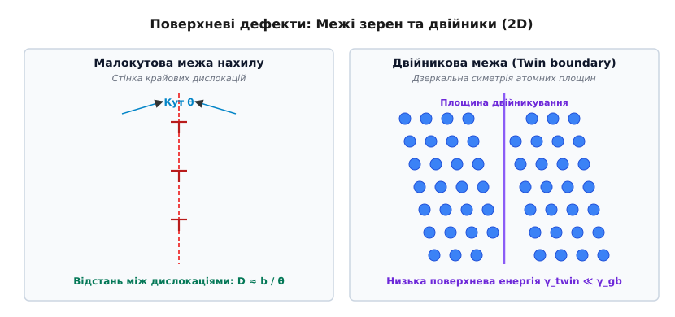
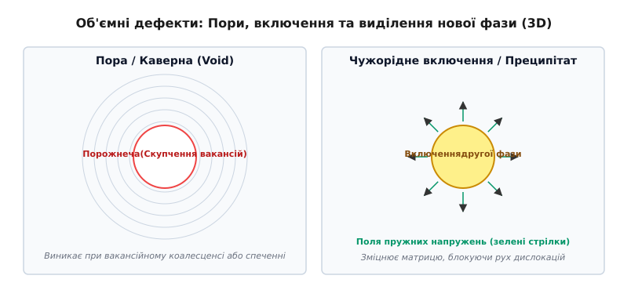

# Дефекти кристалічної ґратки

<preknowlist>
- [Дифракція Брегга](topic:physics/bragg-diffraction) — трансляційна симетрія кристалічної ґратки та розсіювання рентгенівських хвиль.
- [Пружна деформація](topic:physics/elastic-deformation) — закони Гука, модулі зсуву та пружні напруження у твердому тілі.
- [Потенціал Леннард-Джонса](topic:physics/lennard-jones-potential) — крива міжатомної взаємодії, рівноважна відстань та енергія зв'язку.
</preknowlist>

Чистий монокристал міді пластично деформується під дією зсувного механічного напруження усього в кілька мегапаскалів (`~1..3 МПа`). Проте якщо обчислити теоретичну міцність ідеальної кристалічної ґратки, припустивши одночасний зсув цілої атомної площини відносно сусідньої, роззрахункове критичне напруження становить приблизно десяту частину модуля зсуву матеріалу — для міді це понад `4000 МПа`. Експеримент і теорія ідеального кристала розходяться на чотири порядки величини.

Розрахунок Якова Френкеля (1926) описував міжатомну взаємодію періодичною синусоїдальною функцією `τ(x) = (G / 2π) · sin(2π x / b)`. При малих відносних зсувах `x / b ≪ 1` цей вираз узгоджується із законом Гука `τ = G · (x / b)`, що дає теоретичну межу міцності на зсув `τ_crit = G / (2π) ≈ G / 6`.

Джерелом цього глибокого парадоксу є те, що реальні тверді тіла ніколи не володіють ідеальною трансляційною періодичністю. Регулярне розташування атомів переривається геометричними порушеннями — дефектами кристалічної ґратки. Зсув не відбувається одночасно по всій площині: він поширюється естафетно, шляхом послідовного перешнурування поодиноких атомних зв'язків вздовж лінійних дефектів.

Саме дефекти визначають пластичність металів, швидкість дифузії в твердій фазі, електропровідність напівпровідників, механічну міцність конструкційних сплавів та забарвлення коштовних мінералів.

---

## 1. Топологічна класифікація дефектів за розмірністю

У фізиці конденсованого стану дефекти геометрично класифікують за кількістю вимірів, у яких порушення ґратки має макроскопічні (простягнуті) розміри порівняно з міжатомною відстанню `a`:

1. **Точкові дефекти (нульвимірні, 0D):** Локалізовані порушення, просторовий розмір яких у всіх трьох напрямках обмежений одним або кількома атомними радіусами. До них належать вакансії, міжвузлові атоми та домішки.
2. **Лінійні дефекти (одновимірні, 1D):** Порушення періодичності, простягнуті вздовж певної лінії на тисячі й мільйони періодів ґратки, тоді як у поперечному перерізі дефект має атомні розміри. Основний тип 1D-дефектів — дислокації.
3. **Поверхневі дефекти (двовимірні, 2D):** Просторові межі, які розділяють кристалічні області з різною орієнтацією або різною упаковкою атомних шарів. Це межі зерен, двійникові межі та дефекти пакування.
4. **Об'ємні дефекти (тривимірні, 3D):** Макроскопічні утворення, розміри яких у всіх трьох вимірах суттєво перевищують період ґратки. До них належать пори, каверни, включення чужорідних фаз та тріщини.

---

## 2. Точкові дефекти (0D): термодинамічна неминучість

Точкові дефекти — це локальні порушення атомного порядку у вузлах або міжвузлях кристала.


*Класифікація точкових дефектів у 2D кристалічній ґратці: 1 — вакансія (порожній вузол); 2 — великий замісний атом; 3 — міжвузловий домішковий атом; 4 — малий замісний атом; також показана пара Френкеля (вакансія + міжвузловий атом).*

### Основні типи точкових дефектів

1. **Вакансія (дефект Шотткі):** Порожній вузол кристалічної ґратки, з якого вилучено вузловий атом. Для збереження маси кристал передає цей атом на зовнішню поверхню або на межу зерна.
2. **Власний міжвузловий атом (Self-interstitial):** Атом основного елемента, затиснутий у порожнині між регулярними вузлами ґратки. Утворення такого дефекту супроводжується сильним локальним стисненням оточуючих атомів, тому енергія його утворення `E_i` у 3–5 разів перевищує енергію утворення вакансії `E_v`.
3. **Пара Френкеля:** Комбінація вакансії та власного міжвузлового атома, що виникає при зміщенні атома зі свого вузла в сусіднє міжвузля під дією теплової флуктуації або удару високоенергетичної частинки.
4. **Замісна домішка (Substitutional impurity):** Атом іншого хімічного елемента, який займає вузол основної ґратки. Якщо радіус домішкового атома більший за радіус матриці, виникає локальне напруження стиску; якщо менший — напруження розтягу.
5. **Міжвузлова домішка (Interstitial impurity):** Малий чужорідний атом (наприклад, водень, вуглець, азот чи бор у ґратці заліза), розміщений у міжвузловому порідненні. Саме міжвузловий вуглець у ґратці заліза визначає високу міцність сталі.

### Термодинаміка точкових дефектів та вакансійна дифузія

На відміну від лінійних чи поверхневих дефектів, точкові дефекти за температур, вищих за абсолютний нуль `T > 0 К`, є **термодинамічно рівноважними**.

Утворення `n` вакансій вимагає витрати внутрішньої енергії `ΔU = n · E_v`, де `E_v` — ентальпія утворення однієї вакансії (`~0.8..2.0 еВ`). Однак хаотичне розміщення `n` вакансій по `N` вузлах кристала кардинально збільшує кількість можливих мікростанів `W`, що призводить до зростання конфігураційної ентропії `S_conf`:

```
S_conf = k_B * ln( (N + n)! / [ n! * N! ] )
```

Вільна енергія Гіббса `G = H - T·S` унаслідок змагання між енергетичним програшем `n·E_v` та ентропійним виграшем `-T·S_conf` проходитиме через чіткий мінімум. Рівноважна атомна концентрація вакансій `c_v` описується експоненціальним законом Больцмана:

```
c_v = n / N
    = exp( ΔS_vib / k_B ) * exp( -E_v / (k_B * T) )
```

де `ΔS_vib` — зміна вібраційної ентропії коливань ґратки навколо вакансії, `k_B` — стала Больцмана.

При кімнатній температурі (`T = 300 К`) концентрація вакансій у міді становить невисоке значення `c_v ≈ 10⁻¹³` (одна вакансія на трильйон вузлів). Проте поблизу точки плавлення (`T ≈ 1300 К`) концентрація зростає до `c_v ≈ 10⁻³..10⁻⁴` (одна вакансія на тисячу вузлів).

Перескок вакансії у сусідній атомний вузол є основним шляхом самодифузії та дифузії домішок у твердих тілах. Частота перескоків `Γ` залежить від енергетичного бар'єра міграції `E_m`:

```
Γ = ν_0 * exp( -E_m / (k_B * T) )
```

де `ν_0 ≈ 10¹³ с⁻¹` — дебаївська частота коливань ґратки. Самодифузійний коефіцієнт кристала дорівнює добутку ймовірності утворення вакансії на ймовірність її перескоку `D = D_0 · exp( -(E_v + E_m) / (k_B * T) )`.

Детальний математичний вивід варіації вільної енергії, термодинаміки іонних кристалів та вирази для дефектів Шотткі й Френкеля наведено у вставці [🧮 Термодинаміка точкових дефектів та пружна енергія дислокацій](topic:physics/crystal-defects/math-defect-thermodynamics.md).

### Заряджені точкові дефекти та нотація Крьогера-Вінка

У хімічно складних іонних кристалах (оксидах, галогенідах, кераміках) створення вакансії чи домішки супроводжується порушенням локального балансу електричного заряду. Наприклад, вилучення іона `O²⁻` з оксиду залишає у вузлі ефективний позитивний заряд `+2e` відносно недеформованої ґратки.

Для уніфікованого опису квазіхімічних реакцій та дефектних рівноваг у складних фазах використовують міжнародну нотацію Крьогера-Вінка, у якій ефективний заряд позначається крапками (позитивний `•`), штрихами (негативний `'`) та хрестиками (нейтральний `x`).

Повний довідник правил побудови символів, законів збереження заряду, маси та вузлів у квазіхімічних реакціях зібрано у вставці [📋 Нотація Крьогера-Вінка та квазіхімічні рівноваги точкових дефектів](topic:physics/crystal-defects/api-defect-notation.md).

Історичний шлях від перших здогадів Френкеля, Шотткі та Вагнера до сучасної фізики твердого тіла викладено у матеріалі [📜 Історія теорії дефектів кристалів: від ідеального кристала до реальної міцності](topic:physics/crystal-defects/hist-crystal-defects.md).

---

## 3. Лінійні дефекти (1D): дислокації та механічна міцність

Лінійні дефекти, або дислокації (від латинського *dislocatio* — зміщення), — це 1D-дефекти кристалічної ґратки, які утворюють межу між площиною, де відбувся пластичний зсув, та площиною, де зсуву ще не було.


*Схема будови дислокацій: ліворуч — крайова дислокація із зайвою атомною півплощиною (червона), вектор Бюргерса b перпендикулярний лінії t; праворуч — ґвинтова дислокація зі спіральною рамкою атомних площин, вектор Бюргерса b паралельний лінії t.*

### Вектор Бюргерса та замкнений контур

Головною кількісною характеристикою будь-якої дислокації є її **вектор Бюргерса `b`**, названий на честь голландського фізика Йоганнеса Бюргерса.

Щоб визначити вектор Бюргерса:
1. Будують замкнений контур у реальному дефектному кристалі (контур Бюргерса), охоплюючи лінію дислокації та роблячи однакову кількість кроків уперед, праворуч, назад і ліворуч уздовж вузлів ґратки.
2. Побудувати точно такий самий послідовний контур в ідеальному кристалі.
3. В ідеальному кристалі контур не замкнеться. Вектор неузгодження, проведений від кінцевої точки контуру до початкової, і є вектором Бюргерса `b`.

Модуль вектора Бюргерса описує величину атомного зсуву, а його напрямок відносно вектора дотичної до лінії дислокації `t` визначає тип дислокації. Вектор Бюргерса є топологічним інваріантом: він залишається незмінним уздовж усієї довжини дислокаційної лінії.

### Типи дислокацій, системи ковзання та решіткові розщеплення

1. **Крайова дислокація (Edge dislocation):** Утворюється всуванням у кристал зайвої атомної півплощини. Край цієї півплощини утворює лінію дислокації `t`.
   - Вектор Бюргерса **перпендикулярний** до лінії дислокації: `b ⊥ t`.
   - Площина, що містить вектор Бюргерса `b` та лінію дислокації `t`, є єдиною площиною ковзання дефекту.
   - Над лінією дислокації ґратка стиснута, під лінією — розтягнута.

2. **Ґвинтова дислокація (Screw dislocation):** Виникає при частковому зсуві кристала вздовж надрізу, коли атомні площини перетворюються на безперервну гвинтову поверхню (гелікоїд) навколо лінії дефекту.
   - Вектор Бюргерса **паралельний** до лінії дислокації: `b ∥ t`.
   - Ґвинтова дислокація не має фіксованої площини ковзання і може здійснювати поперечне ковзання (cross-slip) у будь-якій площині, що проходить через лінію `t`.

3. **Змішана дислокація (Mixed dislocation):** Реальні дислокаційні лінії у кристалах майже завжди мають криволінійну форму, де кут між вектором Бюргерса `b` та дотичним вектором `t` набуває проміжних значень `0 < θ < 90°`. Вектор Бюргерса такої дислокації розкладається на крайову `b_edge = b · sin(θ)` та ґвинтову `b_screw = b · cos(θ)` компоненти.

4. **Системи ковзання кристалографічних ґраток:** Дислокації ковзають найлегше по найщільніше упаковканих площинах у напрямках найщільнішої упаковки:
   - Гранєцентрирована кубічна (ГЦК / FCC): 12 систем ковзання типу `{111} <110>`. Забезпечує найвищу пластичність при всіх температурах.
   - Об'ємноцентрирована кубічна (ОЦК / BCC): 48 систем ковзання типу `{110} <111>`, `{112} <111>`, `{123} <111>`. Сильна температурна залежність рухливості ґвинтових дислокацій викликає хладноломкість (перехід від пластичного до крихкого стану при низьких температурах).
   - Гексагональна щільноупакована (ГЩУ / HCP): базові системи `(0001) <112̄0>`. Через мале число легких систем ковзання (всього 3) пластична деформація вимагає двійникування.

5. **Часткові дислокації та бар'єр Ломер-Коттрелла:** У ГЦК-ґратці повна дислокація `a/2 <110>` розпадається на дві часткові дислокації Шокллі `a/6 <112>`, між якими утворюється смужка дефекту пакування:
   
   ```
   a/2 [110] → a/6 [211] + a/6 [121̄]
   ```

   При перетині двох розщеплених дислокацій із різних площин ковзання `{111}` утворюється нерухомий дислокаційний бар'єр Ломер-Коттрелла, який ефективно блокує подальше ковзання і викликає інтенсивне деформаційне зміцнення.

6. **Наддислокації у впорядкованих інтерметалідах:** У впорядкованих сплавах (наприклад, `Ni₃Al` у нікелевих суперсплавах) проходження звичайної дислокації порушує хімічний дальній порядок, утворюючи антифазну межу (Antiphase Boundary, APB). Для збереження порядку дислокації рухаються парами — **наддислокаціями (superdislocations)**. Збільшення температури підсилює поперечне ковзання наддислокацій у нековзні площини, що зумовлює унікальний аномальний ріст міцності `Ni₃Al` при нагріванні до `800 °C`.

### Рух дислокацій: ковзання, переповзання та бар'єр Паєрлса-Набарро

Переміщення дислокацій є основним механізмом пластичної деформації кристалічних тіл:

- **Консервативний рух (ковзання, Glide):** Рух дислокації у своїй площині ковзання під дією зсувного напруження `τ`. Для ковзання потрібно лише послідовне перешнурування атомних зв'язків уздовж лінії дефекту.
- **Опір ґратки (Напруження Паєрлса-Набарро):** Внутрішнє бар'єрне напруження ґратки `τ_PN`, яке необхідно подолати для зміщення дислокації:

  ```
  τ_PN = [ 2 * G / (1 - ν) ] * exp( -2 * π * w / b )
  ```

  де `w` — ширина ядра дислокації. У металах з ковалентним зв'язком (силіцій, алмаз) ядро дислокації вузьке (`w ≈ b`), тому `τ_PN` є величезним, і кристал залишається крихким до високих температур. У ГЦК-металах ядро широке (`w ≈ 3..5b`), тому `τ_PN` є мізерним, що визначає їхнову високу пластичність.

- **Неконсервативний рух (переповзання, Climb):** Переміщення крайової дислокації у напрямку, перпендикулярному до площини ковзання. Для цього зайва атомна півплощина повинна наростати (поглинаючи міжвузлові атоми або випускаючи вакансії) або скорочуватися (поглинаючи вакансії). Переповзання вимагає атомної дифузії і відбувається лише при високих температурах (`T > 0.5 T_melt`), зумовлюючи явище високотемпературного повзучості (creep).

### Взаємодія з точковими дефектами: атмосфери Коттрелла

Точкові дефекти заміщення та міжвузля створюють навколо себе поля пружних напружень об'ємного стиску чи розтягу. Згідно з принципом мінімуму енергії:
- Малі міжвузлові атоми (вуглець, азот у залізі) дифундують до розтягнутої зони під крайовою дислокацією.
- Великі замісні атоми збираються у розтягнутій зоні, а малі — у стиснутій зоні над дислокацією.

Ці скупчення домішкових атомів утворюють **атмосфери Коттрелла**, які "блокують" дислокацію. Для початку пластичної деформації необхідно прикласти підвищене напруження верхньої межі плинності, щоб "відірвати" дислокацію від хмари домішок (явище зубу плинності та площадки плинності в маловуглецевих сталях).

### Взаємодія, множення та джерела Франка-Роада

Під час пластичної деформації щільність дислокацій (загальна довжина дислокаційних ліній в одиниці об'єму) зростає від `10⁶ см⁻²` у відпаленому кристалі до `10¹¹..10¹² см⁻²` у сильно деформованому металі.

Головним джерелом генерації нових дислокаційних петель є **джерело Франка-Роада** — зафіксований на кінцях сегмент дислокації довжиною `L`, який під дією прикладеного напруження `τ` роздувається в петлю, змикається й відривається, випускаючи нову дислокацію та відновлюючи початковий сегмент. Критичне напруження активації джерела дорівнює `τ_crit ≈ G · b / L`.

Пружні поля напружень навколо дислокацій спричиняють їхню взаємодію:
- Однойменні крайові дислокації в одній площині ковзання відштовхуються.
- Різнойменні дислокації притягуються й анігілюють (взаємно знищуються), залишаючи ланцюжок вакансій.
- Однойменні крайові дислокації у паралельних площинах ковзання шикуються у вертикальні стінки (полігонізація).

Для чистового чисельного аналізу траєкторій ковзання, розрахунку векторної сили Піча-Келера та симуляції дифузії методом Монте-Карло див. вставку [⚙️ Моделювання дислокаційної динаміки та взаємодії дефектів](topic:physics/crystal-defects/proj-dislocation-dynamics.md).

---

## 4. Поверхневі дефекти (2D): межі зерен та двійники

Поверхневі, або двовимірні дефекти — це внутрішні поверхні розділу між регіонами з різною кристалографічною орієнтацією або різним порядком укладання атомних площин.


*Схема двовимірних дефектів: ліворуч — малокутова межа нахилу, утворена вертикальною стінкою крайових дислокацій з кутом разорієнтації θ; праворуч — двійникова межа з дзеркальною симетрією атомної ґратки.*

### Межі зерен у полікристалах

Більшість технічних матеріалів є полікристалами — агрегатами з мільйонів дрібних кристаликів (зерен), зрослих між собою під довільними кутами.

1. **Малокутові межі (Low-angle grain boundaries, θ < 10–15°):**
   - **Межа нахилу (Tilt boundary):** Утворена вертикальною стінкою крайових дислокацій із однаковим вектором Бюргерса. Кут разорієнтації зерен `θ` пов'язаний із відстанню між дислокаціями `D` співвідношенням `D ≈ b / θ`.
   - **Межа скручування (Twist boundary):** Утворена двовимірною сіткою перехресних ґвинтових дислокацій.
   - Енергія малокутової межі описується класичним рівнянням Ріда-Шоклі `γ_gb = γ_0 · θ · (A - ln θ)`.

2. **Великокутові межі (High-angle grain boundaries, θ > 15°):** Області сильного неузгодження атомних решіток товщиною у 2–3 атомні діаметри. Через високу поверхневу енергію та пухку упаковку великокутові межі слугують шляхами прискореної дифузії ("короткозамикаючі шляхи") та місцями концентрування домішок.
   - **Модель ґратки збіжних вузлів (Coincident Site Lattice, CSL):** Деякі великокутові межі володіють впорядкованою атомною структурою з високою часткою спільних вузлів `1/Σ` (наприклад, межа `Σ3` з трьома спільними вузлами або `Σ9`). Монокристали з високою часткою CSL-меж демонструють стійкість до міжкристалітної корозії та повзучості (інженерія меж зерен, Grain Boundary Engineering).

### Двійникові межі (Twin boundaries)

Двійникова межа — це спеціальна симетрична поверхня розділу, по обидва боки якої кристалічні ґратки перебувають у відношенні дзеркального відображення одна відносно одної.

- Атоми безпосередньо на площині двійникування належать ґраткам обох орієнтацій, тому зв'язки практично не спотворені.
- Поверхнева енергія двійникової межі `γ_twin` є вкрай низькою — у 10–20 разів меншою за енергію звичайної великокутової межі зерна.
- Двійникування є важливим альтернативним механізмом пластичної деформації (особливо при низьких температурах та у кристалах із низькою симетрією, таких як титан чи магній).

### Дефекти пакування (Stacking faults)

У щільноупакованих кристалічних решітках атомні площини укладаються у суворій послідовності:
- У гранецентрованій кубічній ґратці (ГЦК / FCC): `...ABCABCABC...`
- У гексагональній щільноупакованій ґратці (ГЩУ / HCP): `...ABABAB...`

Порушення цієї послідовності (наприклад, шар `...ABCAB|ABC...`, де випав один шар `C`) називається **дефектом пакування**. Дефект пакування обмежений частковими дислокаціями Шокллі (Shockley partials). Енергія дефекту пакування (SFE) є ключовою характеристикою металу: матеріали з низькою SFE (аустенітна сталь, латунь) легко двійникуються, тоді як матеріали з високою SFE (алюміній) деформуються виключно ковзанням повних дислокацій.

---

## 5. Об'ємні дефекти (3D): пори, включення та мікротріщини

Тривимірні дефекти порушують суцільність кристалічної матриці у макроскопічному об'ємі.


*Об'ємні дефекти: ліворуч — пористість (void), утворена коалесценцією надлишкових вакансій; праворуч — включення другої фази (преципітат), що створює локальні поля напружень стиску або розтягу.*

### Типи об'ємних дефектів

1. **Пори та каверни (Voids):** Порожнини, утворені скупченням (коалесценцією) тисяч і мільйонів вакансій. Пори виникають при тривалому високотемпературному відпалі, радіаційному опроміненні (нейтронне спучування конструкційних сталей у реакторах) або як наслідок ефекту Керкендалла при гетерогенній дифузії.
2. **Включення та преципітати (Inclusions and Precipitates):** Частинки другої фази, що виділяються з розпаду пересиченого твердого розчину (наприклад, частинки `Fe₃C` у сталі або `CuAl₂` в алюмінієвих сплавах дуралюмін).
   - **Когерентні включення:** Кристалічні ґратки матриці й преципітата безперервно стикуються (невідповідність `δ = (a_p - a_m)/a_m < 0.05`), але через різницю параметрів ґратки створюються сильні пружні напруження.
   - **Напівкогерентні та некогерентні включення:** При зростанні радіуса частинки пружна енергія перевищує межу утворення дефектів, і на межі розділу виникають дислокації неузгодження (misfit dislocations) або некогерентний злам зв'язків.
3. **Мікротріщини (Microcracks):** Розриви суцільності матеріалу, що виникають у місцях скупчення дислокацій перед непроникними перешкодами (межами зерен або когерентними частинками) за механізмом Стро. Мікротріщини є зародками макроскопічного крихкого руйнування.

---

## 6. Вплив дефектів на макроскопічні властивості та деформаційні процеси

Дефекти не просто псують ідеальний кристал — вони **визначають** увесь спектр фізико-механічних та експлуатаційних характеристик матеріалу.

### Механічні властивості та закони зміцнення

1. **Зміцнення межами зерен (ефект розміру зерна):** Межі між кристалітами є непроникними бар'єрами для ковзання дислокацій, оскільки напрямки ковзання у сусідніх зернах розорієнтовані. Дислокації, рухаючись під дією зсувного напруження, зупиняються перед межею зерна й утворюють плоскі скупчення (дислокаційні затори). Напруження від затору концентрується на головній дислокації і при досягненні критичної величини активує джерела дислокацій у сусідньому зерні. Зменшення середнього розміру зерна `d` скорочує кількість дислокацій у заторній смузі, тому для проштовхування пластичної деформації через межу зерна потрібно прикладати значно більше зовнішнє напруження. Ця фізична залежність описується **законом Голла-Петча (Hall-Petch relation)**:

   ```
   σ_y = σ_0 + k_HP / √d
   ```

2. **Деформаційне зміцнення (наклеп):** При пластичній деформації щільність дислокацій `ρ` зростає. Дислокації перетинаються, утворюючи нерухомі перетяги ("пороги" й "сітки"), що підвищує опір деформації за законом Тейлора:

   ```
   Δτ = α * G * b * √ρ
   ```

3. **Дисперсійне зміцнення (зрізання та механізм Орована):** Дрібні частинки другої фази блокують рух дислокацій.
   - При малих радіусах частинок `r < r_crit` дислокація зрізає (прорізає) частинку (механізм Фріделя), причому напруження зміцнення зростає `Δτ ~ √r`.
   - При великих радіусах `r > r_crit` зрізання стає невигідним, і дислокація огинає частинки за механізмом Орована, залишаючи навколо кожної частинки замкнену дислокаційну петлю:

   ```
   Δτ_Orowan = [ G * b / (2 * π * L_p) ] * ln( L_p / b )
   ```

   де `L_p` — середня відстань між частинками. Максимальна міцність сплаву досягається саме при питомому радіусі `r = r_crit` (критичне старіння / пік зміцнення).

### Втома матеріалу та стійкі смуги ковзання (PSB)

При циклічному (змінному) механічному навантаженні металу дислокації здійснюють зворотній рух. З часом дислокації самоорганізуються у регулярні комірчасті структури та **стійкі смуги ковзання (Persistent Slip Bands, PSB)**.

У місцях виходу смуг PSB на вільну поверхню кристала утворюються мікроскопічні виступи (екструзії) та заглиблення (інтрузії). Інтрузії діють як концентратори напружень, у яких зароджуються втомні мікротріщини, що розростаються й призводять до раптового втомного руйнування дедалі нижче межі плинності.

### Некристалічні та двовимірні системи: деклінації та фазони

У системах із неповною або нетрадиційною симетрією класична теорія дислокацій доповнюється специфічними топологічними дефектами:
- **Деклінації (Disclinations):** Лінійні дефекти обертальної симетрії (порушення орієнтаційного порядку атомних зв'язків), що виникають у рідких кристалах, полімерах та аморфних металевих стеклах.
- **Фазонні дефекти (Phasons) у квазікристалах:** У квазікристалах з аперіодичною симетрією (наприклад, з ікосаедричною симетрією 5-го порядку) крім звичайного фононного зміщення атомів виникають фазонні збудження — локальні перебудови атомних плиток Пенроуза без розриву суцільності.
- **Дефекти у двовимірних матеріалах (графен, MoS₂):** У 2D-кристалах вакансії та 1D-межі зерен утворюють комбінації п'ятикутних і семикутних вуглецевих кілець (петлі 5–7, дефекти Стоуна-Уелеса). Вони викривляють пласку пластину графену у третій вимір, кардинально змінюючи локальну електронну густину станів.

### Ефект пам'яті форми та бездифузійні мартенситні перетворення

Дефекти кристаллографічної ґратки грають вирішальну роль у бездифузійних фазових перетвореннях першого роду (мартенситні перетворення). У сплавах із ефектом пам'яті форми (наприклад, нікелід титану `NiTi` / нітінол) високотемпературна аустенітна фаза при охолодженні переходить у мартенситну фазу шляхом впорядкованого ссуву атомних площин без атомної дифузії.

Пластична деформація мартенситу відбувається не ковзанням дислокацій, а переорієнтацією двойникових доменів (дедеформування). При наступному нагріванні матеріалу зворотне мартенситне перетворення повністю відновлює вихідну форму кристалографічної ґратки, що генерує величезні реактивні механічні зусилля.

### Радіаційні дефекти та каскади зміщень

Під дією бомбардування високоенергетичними нейтронами в ядерних реакторах первинний вибитий атом (Primary Knock-on Atom, PKA) отримує кінетичну енергію від кількох кеВ до мегаелектронвольт. Передаючи енергію іншим атомам, PKA створює каскад атомних зміщень:
- За пікосекунди утворюється розпечений "каскадний пік" (thermal spike), де тисячі атомів вибиваються зі своїх вузлів.
- Після охолодження каскаду у центрі залишається вакансійне ядро, а по периферії — згусток міжвузлових атомів.
- Переважне поглинання міжвузлових атомів дислокаціями (через сильніше пружне притягування) залишає в об'ємі надлишок вакансій. Вони коалесують у пори, викликаючи радіаційне спучування (збільшення об'єму металевих конструкцій активної зони реактора на 10–20%).

### Електричні та оптичні властивості

- **Правило Маттіссена:** Загальний питомий опір металу `ρ_total` складається з фононного компонента `ρ_ph(T)` та залишкового опору `ρ_def`, зумовленого розсіюванням електронів провідності на точкових дефектах, дислокаціях та межах зерен:

  ```
  ρ_total(T) = ρ_ph(T) + ρ_def
  ```

- **Легування напівпровідників:** Введення точкових домішок заміщення у кристал силіцію (бор для p-типу, фосфор для n-типу) збільшує провідність на 6–8 порядків величини.
- **Центри забарвлення (F-центри, від німецького *Farbzentrum*):** Аніонні вакансії в іонних кристалах (наприклад, `NaCl`), які захопили вільні електрони. F-центри вибірково поглинають світло у видимій області, надаючи безбарвним кристалам яскравого забарвлення.

### Експериментальні методи дослідження дефектів

1. **Просвічувальна електронна мікроскопія (TEM):** Дозволяє візуалізувати дислокації, дефекти пакування та преципітати завдяки дифракційному контрасту під кутом Брегга.
2. **Рентгенівська дифрактометрія (метод Вільямсона-Холла):** Оцінює середню щільність дислокацій та розміри областей когерентного розсіювання за розширенням дифракційних піків.
3. **Позитронна анігіляційна спектроскопія (PAS):** Використовується для захоплення позитронів у вакансійні кластери та пори, вимірюючи їх концентрацію від `10⁻⁶`.
4. **Атомно-зондова томографія (Atom Probe Tomography, APT):** Забезпечує тривимірне картування атомарного масштабу для розподілу домішок навколо меж зерен та ядер дислокацій (атмосфери Коттрелла).

---

> 🔧 **Навіщо це.**
> 
> Знання фізики дефектів — це фундаментальний інструмент сучасної мікромеханіки, матеріалознавства та напівпровідникових технологій:
> - **Кремнієва мікроелектроніка:** При виробництві високінтегральних процесорів (вузли 3 нм) найменша вакансійні пора чи дислокація у кристалі силіцію спричиняє струми витоку і виходить з ладу весь чип. Технологія "інженерії дефектів" (defect engineering) регулює прецизійний відпал та ґеттеровання (видалення шкідливих домішок важких металів шляхом їх осадження на спеціально створених дефектах зворотного боку пластини).
> - **Авіабудування та суперсплави:** Лопатки газових турбін працюють при температурах понад `1100 °C` під величезними відцентровими навантаженнями. Для усунення високотемпературного повзучості по межах зерен лопатки вирощують у вигляді **монокристалів** молібдено-нікелевих суперсплавів, повністю позбавлених меж зерен.
> - **Термічна та механічна обробка сталей:** Загартування, відпуск, кування та прокатка сталі — це технологічні операції керування щільністю дислокацій, розміром зерен та розподілом преципітатів карбідів для досягнення необхідного поєднання міцності й в'язкості.
