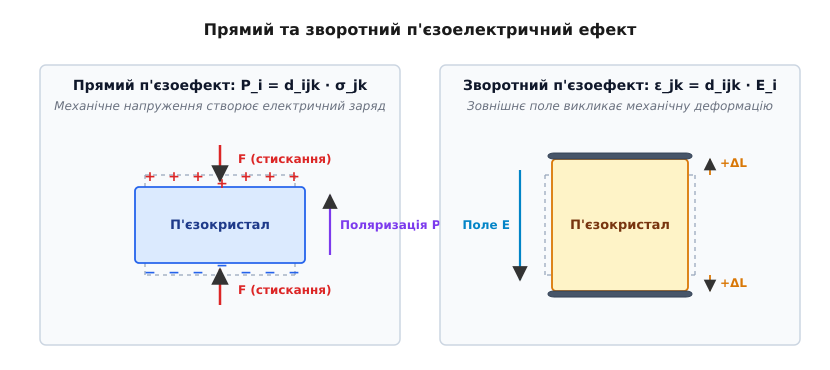
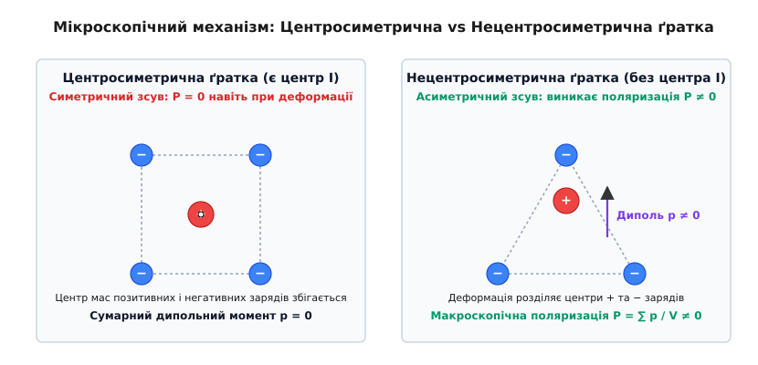
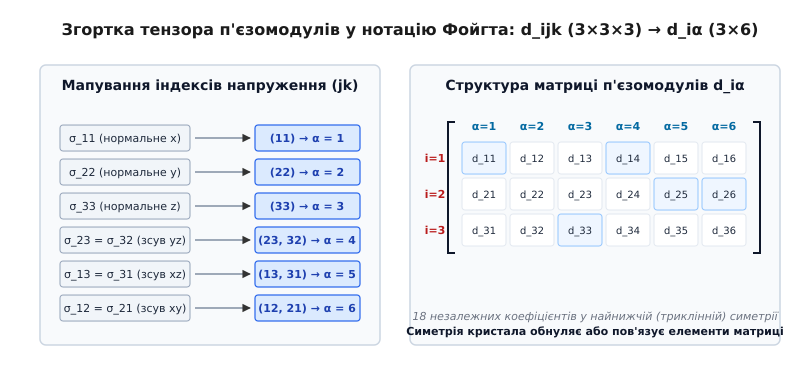

# Симетрія кристалів і п'єзоелектричний ефект

<preknowlist>
- [Електрична поляризація](topic:physics/electric-polarization) — вектор поляризації, пов'язані заряди та діелектричне зміщення в середовищі.
- [Пружна деформація](topic:physics/elastic-deformation) — тензори механічних напружень `σ[jk]`, тензор деформацій `ε[jk]` та закон Гука.
- [Теорія груп](topic:math/group-theory) — точкові кристалографічні групи, повороти, відображення та операція просторової інверсії.
</preknowlist>

Коли монокристал кварцу або турмаліну піддають механічному стисканню вздовж певних кристалографічних напрямків, на його протилежних гранях виникають електричні заряди протилежного знака. Якщо ж цей самий кристал помістити в зовнішнє електричне поле, його геометричні розміри змінюються — кристал розтягується або стискається залежно від напрямку та полярності прикладеного поля. Цей двосторонній фундаментальний зв'язок між механічною деформацією та електричним полем називається п'єзоелектричним ефектом.

П'єзоелектричний ефект належить до структурно-чутливих властивостей твердого тіла: він виникає далеко не в кожному кристалі. З 32 класичних кристалографічних точкових груп п'єзоелектричні властивості демонструють рівно 20 класів. Головним кристалографічним критерієм, який визначає можливість існування п'єзоелектрики, є відсутність у кристалічній ґратці центра симетрії (просторової інверсії).


*Прямий п'єзоефект породжує поверхневі заряди під дією механічної сили, зворотний ефект спричиняє деформацію кристала під дією зовнішнього електричного поля.*

## Мікроскопічна природа: іонні зсуви та феноменологія Ландау

На мікроскопічному рівні кристал є впорядкованою ґраткою, у вузлах якої розташовані позитивно заряджені катіони та негативно заряджені аніони. Електрична поляризація одиниці об'єму середовища `P` визначається як векторна сума елементарних дипольних моментів `p` усіх атомних комірок, поділена на об'єм `V`:

```
P = (1 / V) · ∑ p[n]
= (1 / V) · ∑ q[a] · r[a]                [вектор мікроскопічної поляризації]
```

де `q[a]` — ефективний заряд `a`-го іона всередині комірки, `r[a]` — його радіус-вектор відносно умовного початку координат.

У недеформованому кристалі розташування іонів визначається кристалічною симетрією. Якщо у спокійному стані центри вагомості позитивних і негативних зарядів усередині елементарної комірки точно збігаються, сумарний дипольний момент комірки дорівнює нулю (`p = 0`), і макроскопічна поляризація середовища відсутня (`P = 0`).

При прикладанні зовнішнього механічного напруження `σ[jk]` кристал зазнає пружної деформації `ε[jk]`. Атоми зміщуються зі своїх рівноважних позицій. У рамках моделі жорстких іонів та моделі електронних оболонок Кокермана підґратки катіонів та аніонів під дією деформації зміщуються на різні відстані та в різних напрямках. Якщо кристалічна ґратка позбавлена центра симетрії, таке асиметричне зміщення підґраток порушує компенсацію зарядів і викликає появу некомпенсованого елементарного дипольного моменту `p ≠ 0`. Помножений на кількість комірок в об'ємі, цей момент створює макроскопічний вектор поляризації `P[i]`. Зі зміною напрямку механічної сили (заміна стискання на розтяг) іони зміщуються у протилежний бік, що призводить до зміни знака вектора поляризації на протилежний.

Детальний аналіз експериментального відкриття цього явища П'єром і Жаком Кюрі та його подальшого застосування в ультразвуковій техніці наведено в [Історія відкриття п'єзоефекту братів Кюрі та розвитку акустоелектроніки](topic:physics/crystal-symmetry-piezo/hist-curie-piezo.md).

### Феноменологічна теорія Ландау-Девоншира для сегнетоелектричних п'єзоелектриків

У сегнетоелектричних кристалах (наприклад, титанаті барію `BaTiO3` або ЦТС) п'єзоелектричний ефект тісно пов'язаний зі спонтанною поляризацією. За теорією Ландау-Девоншира вільна енергія `F` розкладається у степеневий ряд за параметром порядку — поляризацією `P`:

```
F(P, σ) = F₀ + (1/2) · α · (T - Tc) · P² + (1/4) · β · P⁴ + (1/6) · γ · P⁶ - Q[ijk] · σ[jk] · P[i] · P[j] - E[i] · P[i]
```

де `Q[ijk]` — тензор електрострикції 4-го рангу.

При переході нижче температури Кюрі `Tc` у кристалі виникає спонтанна поляризація `P₀`. Продиференціювавши вільну енергію за напруженням та полем, отримуємо, що в сегнетоелектричній фазі виникає ефективний п'єзоелектричний модуль `d[ijk]`, який є прямо пропорційним спонтанній поляризації `P₀` та диелектричній проникності `ε`:

```
d[ijk] = 2 · Q[ijkl] · ε₀ · ε[il] · P₀[l]   [лінеаризований п'єзомодуль сегнетоелектрика]
```

Це пояснює, чому сегнетоелектрики володіють гігантськими значеннями п'єзомодулів, які на 2–3 порядки перевищують п'єзомодулі звичайних несегнетоелектричних кристалів на кшталт кварцу.

### П'єзоелектрика проти електрострикції: принципова відмінність за симетрією

Важливо чітко розрізняти п'єзоелектричний ефект та ефект електрострикції:

1. **П'єзоелектричний ефект є ЛІНІЙНИМ по полю та напруженню:** Деформація зміщується за законом `ε = d · E`, а поляризація `P = d · σ`. При зміні напрямку поля зміщується знак деформації. П'єзоефект існує **виключно у 20 нецентросиметричних кристалографічних класах**.
2. **Електрострикція є КВАДРАТИЧНИМ ефектом:** Деформація описується виразом `ε[ij] = Q[ijkl] · P[k] · P[l] = M[ijkl] · E[k] · E[l]`. Оскільки деформація залежить від квадрата поля `E²`, вона не змінює знак при зміні полярності поля. Тензор електрострикції `M[ijkl]` є тензором 4-го рангу. Закони тензорних перетворень показують, що парний тензор 4-го рангу не обнуляється при просторовій інверсії (`(-1)⁴ = +1`). Тому **електрострикція існує абсолютно в усіх 32 кристалографічних точкових групах**, а також в аморфних тілах та рідинах.

### Внутрішній проти зовнішнього (доменного) внеску в п'єзоефект

У монокристалічних та керамічних сегнетоелектриках повний п'єзоелектричний відгук розкладається на дві фізичні складові:

1. **Внутрішній (інстрінсічний) внесок:** Виникає безпосередньо від обратимої деформації елементарної кристалічної комірки під дією поля чи напруження за рахунок зміщення іонів відносно їхніх рівноважних позицій.
2. **Зовнішній (екстрінсічний) внесок:** Пов'язаний з координованим рухом і зміщенням міждоменних меж (180° та 90° доменних стінок). При прикладанні механічного напруження домени з орієнтацією спонтанної поляризації вздовж осі стискання розвертаються на 90°, переходячи у сприятливіші енергетичні стани. Цей нелінійний доменний рух може забезпечувати до 50–70% сумарної величини п'єзомодуля `d33` у м'яких кераміках ЦТС.

### Морфотропна фазова межа та обертання поляризації в PZT

Найвищі значення п'єзоелектричних коефіцієнтів у твердих розчинах ЦТС `Pb(Zr[x]Ti[1-x])O3` досягаються поблизу так званої **морфотропної фазової межі (MPB)** при концентрації цирконію `x ≈ 0.52`. На цій межі відбувається структурний перехід між тетрагональною фазою (симетрія `4mm`) та тригональною фазою (симетрія `3m`).

У вузькій області MPB енергетичний бар'єр між різними кристалографічними напрямками поляризації (напрямки `[100]` у тетрагональній фазі та `[111]` у тригональній фазі) прямує до нуля. Це створює умови для **вільного обертання вектора спонтанної поляризації** в просторі під дією навіть мізерних механічних напружень чи електричних полів. Розрахунки показують, що поблизу MPB виникає проміжна моноклінна фаза `M_A`, яка діє як термодинамічний міст, забезпечуючи максимальну диелектричну проникність `ε33` та п'єзомодулі `d33 > 600 pC/N`.


*У центросиметричній комірці центри мас зарядів при деформації збігаються (P = 0), тоді як у нецентросиметричній ґратці виникає скінченний дипольний момент (P ≠ 0).*

## Центр симетрії та сувора заборона інверсії

Чому механічна деформація створює електричну поляризацію лише в певних кристалах? Відповідь дає аналіз симетрії за допомогою принципу Неймана (Neumann's principle): група симетрії будь-якої фізичної властивості кристала повинна містити в собі елементи точкової групи симетрії самого кристала.

Розглянемо фундаментальну операцію симетрії — просторову інверсію `I`, яка дзеркально відображає всі три просторові координати відносно центра симетрії:

```
x → -x,   y → -y,   z → -z               [операція просторової інверсії I]
```

Проаналізуємо, як поводяться фізичні величини, що беруть участь у п'єзоелектричному ефекті, при застосуванні операції інверсії `I`:

1. **Вектор електричної поляризації `P`** є полярним вектором (тензором першого рангу). При просторовій інверсії будь-який полярний вектор змінює свій напрямок на протилежний:

```
P[i] → -P[i]                             [перетворення полярного вектора при інверсії]
```

2. **Тензор механічних напружень `σ`** є симетричним полярним тензором другого рангу. Його компоненти виражаються через відношення сили до площі (або добуток двох координатних складових). При просторовій інверсії обидва індекси змінюють знак, тому їхній добуток залишається незмінним:

```
σ[jk] → (-1) · (-1) · σ[jk] = +σ[jk]     [перетворення тензора напружень при інверсії]
```

Фізично це означає, що рівномірне стискання кристала вздовж певної осі є інваріантним відносно інверсії: стискання з двох протилежних боків виглядає однаково незалежно від того, спостерігаємо ми його в прямій чи інвертованій системі координат.

Тепер розпишемо феноменологічне рівняння прямого п'єзоелектричного ефекту, яке пов'язує вектор поляризації `P[i]` та тензор напружень `σ[jk]` через тензор п'єзомодулів `d[ijk]`:

```
P[i] = d[ijk] · σ[jk]                    [рівняння прямого п'єзоефекту]
```

Застосуємо операцію просторової інверсії `I` до лівої та правої частин цього рівняння. З одного боку, фізичні величини перетворюються за своїми геометричними законами:

```
-P[i] = d[ijk] · (+σ[jk])
-P[i] = d[ijk] · σ[jk]                   [результат фізичного перетворення полів]
```

З іншого боку, якщо кристал володіє центром інверсії (є центросиметричним), то за принципом Неймана структура кристала після інверсії тотожно збігається з початковою. Отже, п'єзоелектричні модулі `d[ijk]` центросиметричного кристала не повинні змінюватися при інверсії. Це вимагає виконання рівності:

```
P[i] = d[ijk] · σ[jk]                    [вимога інваріантності Неймана]
```

Порівнюючи два одержані вирази, маємо суперечність:

```
-P[i] = +P[i]                            [суперечність для центросиметричного кристала]
2 · P[i] = 0 ⇒ P[i] = 0                  [єдино можливий розв'язок]
```

Оскільки це співвідношення має виконуватися для довільних механічних напружень `σ[jk]`, єдиним можливим розв'язком є повне обнулення всіх компонент тензора п'єзомодулів:

```
d[ijk] = 0   (для всіх i, j, k ∈ {1, 2, 3}) [сувора заборона п'єзоефекту при інверсії]
```

**Фундаментальний висновок:** Кристали, які мають центр симетрії (центросиметричні кристалографічні класи), принципово не можуть володіти п'єзоелектричними властивостями. Механічне напруження в таких кристалах викликає лише симетричний зсув зарядів, який не створює макроскопічного дипольного моменту.

## Тензор п'єзомодулів `d[ijk]` та матрична згортка Фойгта

Математично зв'язок між механічними та електричними величинами описується тензором п'єзоелектричних модулів 3-го рангу `d[ijk]`. У тривимірному просторі такий тензор має `3 × 3 × 3 = 27` компонент.

Оскільки тензор механічних напружень `σ[jk]` є симетричним відносно перестановки індексів (`σ[jk] = σ[kj]`), антисиметрична частина тензора `d[ijk]` за індексами `j` та `k` не дає внеску в поляризацію. Це зменшує кількість незалежних індексних комбінацій:

```
d[ijk] = d[ikj]                          [симетрія п'єзомодулів за індексами напруження]
```

Завдяки цій симетрії кількість незалежних компонент тензора `d[ijk]` скорочується з 27 до 18.

Для зручності обчислень Вольдемар Фойгт запропонував згортку двох симетричних індексів `(jk)` в один матричний індекс `α`, який набуває значень від 1 до 6:

```
(11) → 1  [нормальне напруження σ11 вздовж осі X]
(22) → 2  [нормальне напруження σ22 вздовж осі Y]
(33) → 3  [нормальне напруження σ33 вздовж осі Z]
(23) = (32) → 4  [зсувне напруження σ23 у площині YZ]
(13) = (31) → 5  [зсувне напруження σ13 у площині XZ]
(12) = (21) → 6  [зсувне напруження σ12 у площині XY]
```

У нотації Фойгта тензор 3-го рангу `d[ijk]` перетворюється на двовимірну матрицю `d[iα]` розмірністю 3 рядки на 6 стовпчиків:

```
        ┌                                  ┐
        │  d11  d12  d13  d14  d15  d16  │
d[iα] = │  d21  d22  d23  d24  d25  d26  │
        │  d31  d32  d33  d34  d35  d36  │
        └                                  ┘
```

Рівняння прямого та зворотного п'єзоелектричних ефектів у матричній нотації набувають компактного вигляду:

```
P[i] = d[iα] · σ[α]                      [прямий п'єзоефект: i = 1..3, α = 1..6]
ε[α] = d[iα] · E[i]                      [зворотний п'єзоефект для нормальних деформацій α = 1, 2, 3]
γ[α] = 2 · d[iα] · E[i]                  [зворотний п'єзоефект для інженерних зсувів α = 4, 5, 6]
```

тут `γ[α]` — інженерна зсувна деформація (`γ[4] = 2·ε[23]`, `γ[5] = 2·ε[13]`, `γ[6] = 2·ε[12]`). Множник 2 враховує подвійний внесок симетричних компонент тензора деформацій.

Термодинамічний аналіз показує, що коефіцієнти `d[iα]` у прямому та зворотному ефектах є тотожно рівними, оскільки вони є мишаними похідними термодинамічного потенціалу Гіббса `G(T, σ, E)` за відповідними незалежними змінними.

Детальний термодинамічний вивід усіх чотирьох форм п'єзоелектричних рівнянь та законів перетворення компонент при поворотах координат міститься в [Математичне виведення та тотожності тензора п'єзомодулів](topic:physics/crystal-symmetry-piezo/math-piezo-tensor.md).


*Згортка двох симетричних індексів напруження (jk) у матричний індекс α зменшує 27 компонент тензора d_ijk до 18 елементів матриці d_iα.*

## 20 п'єзоелектричних класів кристалів

З 32 кристалографічних точкових груп рівно 11 володіють центром симетрії. Згідно з доведеним вище правилом, у цих 11 центросиметричних класах п'єзоелектричний ефект суворо заборонений (`d[iα] = 0`).

Решта 21 точкова група не мають центра інверсії. Проте п'єзоелектричними є лише 20 з них.

### Загадкова кубічна група 432 (O): чому нецентросиметричний кристал не є п'єзоелектриком

Точкова група `432` (у нотації Шенфліса — `O`) належить до кубічної сингонії. Вона **не має центра інверсії**, але володіє високою точковою симетрією:
- 3 поворотні осі 4-го порядку (збігаються з осями куба `X, Y, Z`);
- 4 поворотні осі 3-го порядку (збігаються з головними діагоналями куба);
- 6 поворотних осей 2-го порядку.

Застосування принципу Неймана до операцій повороту на кут `90°` навколо осей 4-го порядку та поворотів на `120°` навколо осей 3-го порядку створює таку жорстку систему обмежувальних рівнянь для компонент `d[ijk]`, що всі 18 матричних елементів змушені тотожно дорівнювати нулю.

Наприклад, поворот навколо осі `X` вимагає `d[333] = -d[222]`, а поворот навколо кубової діагоналі вимагає `d[222] = d[333]`. Одночасне виконання цих умов можливе лише при `d[333] = 0`. Послідовний розрахунок показує, що висока поворотна симетрія групи `432` повністю обнуляє тензор п'єзомодулів навіть за відсутності центра інверсії.

Таким чином, усе розмаїття кристалографічних класів розподіляється за п'єзоелектричною активністю наступним чином:

```
32 кристалографічні точкові групи
 ├── 11 центросиметричних класів ───────> п'єзоефект ЗАБОРОНЕНИЙ (d = 0)
 ├── 1 нецентросиметричний клас 432 ────> п'єзоефект ЗАБОРОНЕНИЙ (d = 0)
 └── 20 п'єзоелектричних класів ───────> п'єзоефект ДОЗВОЛЕНИЙ (d ≠ 0)
```

### Полярні та неполярні п'єзоелектричні класи

20 п'єзоелектричних точкових груп розділяються на дві фундаментальні категорії за наявністю спонтанної поляризації:

1. **10 полярних класів (`1, 2, m, mm2, 3, 3m, 4, 4mm, 6, 6mm`):**
   У цих кристалах існує один виділений кристалографічний напрямок (полярна вісь), вздовж якого центри мас позитивних і негативних зарядів розділені навіть за відсутності зовнішніх впливів. Кристали полярних класів володіють спонтанною поляризацією `P₀ ≠ 0`.
   Усі 10 полярних класів є **піроелектриками** (змінюють свою поляризацію при зміні температури). Оскільки вони не мають центра інверсії, вони **одночасно є п'єзоелектриками**. При прикладанні механічного напруження до піроелектрика виникає додаткова п'єзоелектрична поляризація, яка накладається на спонтанну.

2. **10 неполярних п'єзоелектричних класів (`222, 4-bar, 422, 4-bar 2m, 32, 6-bar, 622, 6-bar m2, 23, 4-bar 3m`):**
   Ці кристали не мають полярних осей, тому в недеформованому стані спонтанна поляризація дорівнює нулю (`P₀ = 0`). Кристали цієї групи не є піроелектриками. Поляризація в них виникає **виключно при механічній деформації**, яка асиметрично викривляє кристалічну решітку.

Повний каталог явних матричних форм `d[iα]` для всіх 20 класів із чисельними значеннями коефіцієнтів наведено в [Повний довідник матриць п'єзомодулів для 20 кристалографічних класів](topic:physics/crystal-symmetry-piezo/api-piezo-classes.md).

## Кристалографічний аналіз головних п'єзоелектричних матеріалів

Ступінь симетрії кристала визначає кількість ненульових п'єзомодулів та їхній зв'язок між собою. Розглянемо найважливіші матеріали, що використовуються в сучасній техніці.

### Кварц (α-SiO2): тригональна симетрія (клас 32)

Кристали моноклінного `α`-кварцу належать до неполярного тригонального класу `32` (тригонометріальна трапецоедрична симетрія). Головною віссю симетрії є оптична вісь `Z` 3-го порядку, перпендикулярно до якої розташовані три електричні осі `X` 2-го порядку.

Принцип Неймана скорочує 18 компонент матриці п'єзомодулів кварцу всього до **2 незалежних коефіцієнтів** — `d11` та `d14`:

```
        ┌                                            ┐
        │  d11   -d11     0     d14     0       0   │
d[iα] = │    0      0     0      0    -d14  -2·d11  │   [матриця п'єзомодулів кварцу]
        │    0      0     0      0      0       0   │
        └                                            ┘
```

Значення п'єзомодулів α-кварцу при кімнатній температурі становлять: `d11 ≈ +2.3 pC/N`, `d14 ≈ -0.67 pC/N`.

Аналіз цієї матриці пояснює робочі режими кварцових елементів:
- **Повздовжній п'єзоефект:** При стисканні кварцового бруска вздовж електричної осі `X` (`σ1 ≠ 0`) виникає поляризація вздовж цієї ж осі `P1 = d11 · σ1`.
- **Поперечний п'єзоефект:** При стисканні вздовж механічної осі `Y` (`σ2 ≠ 0`) виникає поляризація вздовж осі `X` протилежного знака `P1 = -d11 · σ2`.
- **Зсувний п'єзоефект:** Напруження зсуву в площині `YZ` (`σ4 ≠ 0`) породжує поляризацію `P1 = d14 · σ4`, а зсув у площині `XZ` (`σ5 ≠ 0`) створює поляризацію `P2 = -d14 · σ5`.
- **Нейтральність осі Z:** Третій рядок матриці повністю складається з нулів (`d31 = d32 = d33 = d34 = d35 = d36 = 0`). Це означає, що яке б механічне напруження не прикладалося до кварцу, поляризація вздовж оптичної осі `Z` не виникає ніколи.

Головною перевагою кварцу є не величина п'єзомодулів (вони відносно малі), а надзвичайно висока механічна добротність (`Q > 10⁵`) та наявність температурно-компенсованих орієнтаційних зрізів (наприклад, `AT`-зріз), у яких температурний коефіцієнт частоти прямує до нуля.

### Сегнетоелектричні кераміки: BaTiO3 та ЦТС / PZT (клас 4mm та C_∞v)

Титанат барію (`BaTiO3`) та цирконат-титанат свинцю (`Pb(Zr,Ti)O3`, ЦТС/PZT) при високих температурах мають кубічну структуру перовськіту (центросиметрична група `m3m`), у якій п'єзоефект відсутній.

При охолодженні нижче температури Кюрі (`Tc`) відбувається сегнетоелектричний фазовий перехід: центральний іон титану або цирконію зміщується відносно кисневого октаедра. Елементарна комірка витягується, набуваючи тетрагональної симетрії (полярний клас `4mm`). Виникає спонтанна поляризація `P₀`.

У монокристалі `BaTiO3` (клас `4mm`) матриця п'єзомодулів містить 3 незалежні коефіцієнти: `d33`, `d31` та `d15`:

```
        ┌                                  ┐
        │    0    0    0    0  d15    0  │
d[iα] = │    0    0    0  d15    0    0  │   [матриця класу 4mm / поляризованої кераміки]
        │  d31  d31  d33    0    0    0  │
        └                                  ┘
```

У полікристалічній п'єзокераміці хаотично орієнтовані домени початково взаємно компенсують поляризацію (`P_макро = 0`). Щоб зробити кераміку п'єзоелектричною, її піддають процедурі **поляризації**: витримують у сильному постійному електричному полі (`E ~ 2–4 kV/mm`) при підвищеній температурі. Вектори спонтанної поляризації доменів розвертаються вздовж поля.

Після зняття поля кераміка набуває макроскопічної симетрії текстури `C_∞v` (`∞m`), яка є ізоморфною кристалографічному класу `6mm`. Вона описується тими самими трьома коефіцієнтами `d33`, `d31`, `d15`.

Завдяки кооперативному сегнетоелектричному зміщенню іонів значення п'єзомодулів у кераміці ЦТС досягають гігантських величин:
- `d33 ≈ +300...600 pC/N` (у 150–250 разів більше, ніж у кварцу);
- `d15 ≈ +500...800 pC/N`.

Це робить сегнетокераміку основним матеріалом для силових ультразвукових випромінювачів, п'єзозапальничок, п'єзоінжекторів дизельних двигунів та позиціонерів у скануючих тунельних мікроскопах.

### Напівпровідникові п'єзоелектрики: GaAs та ZnS (клас 4-bar 3m)

Кристали зі структурою сфалериту (арсенід галію `GaAs`, фосфід індію `InP`, сульфід цинку `ZnS`) належать до кубічного нецентросиметричного класу `4-bar 3m` (`Td`).

Усі нормальні п'єзомодулі в цій симетрії дорівнюють нулю (`d33 = d31 = d11 = 0`), а ненульовим є лише **один зсувний п'єзомодуль**:

```
d14 = d25 = d36 ≠ 0                       [єдиний незалежний модуль класу 4-bar 3m]
```

Для `GaAs` модуль `d14 ≈ -2.7 pC/N`. Поляризація в `GaAs` виникає лише тоді, коли кристал зазнає деформації зсуву в гранях куба. Цей ефект лежить в основі акустоелектронних приладів, де високочастотна ультразвукова хвиля взаємодіє з потоком вільних електронів у провідному каналі напівпровідника.

### Нітрид алюмінію (AlN) та оксид цинку (ZnO): гексагональні п'єзоелектрики (клас 6mm)

Тонкі плівки `AlN` та `ZnO` володіють гексагональною структурою вюрциту (полярний клас `6mm`). Вони мають 3 незалежні п'єзомодулі (`d33`, `d31`, `d15`), причому плівки вирощуються так, що полярна вісь `Z` спрямована нормально до підкладки.

Хоча значення `d33` для `AlN` відносно помірне (`d33 ≈ 5.5 pC/N`), цей матеріал володіє низькими диелектричними втратами, високою швидкістю звуку (`v ≈ 11000 m/s`) та термостійкістю вище `1000 °C`. Це робить тонкі плівки `AlN` основним матеріалом для виготовлення мікроелектромеханічних резонаторів тонкоплівкових об'ємних акустичних хвиль (FBAR) та фільтрів поверхневих акустичних хвиль (SAW), які забезпечують селекцію частотних каналів 4G/5G мобільних телефонів.

### Органічні п'єзоелектрики: PVDF та його кополімери (клас mm2)

П'єзоелектричні властивості володіють не лише монокристали та кераміки, але й деякі сегнетоелектричні полімери, зокрема полівініліденфторид (PVDF, `(-CH2-CF2-)n`) та його кополімер P(VDF-TrFE).

При механічній витяжці полімерної плівки мономерні ланки перетворюються на полярну `β`-фазу (ромбічна симетрія, клас `mm2`), у якій атоми фтору та водню розташовані по протилежні боки від вуглецевого остовного ланцюга. Після високовольтної поляризації плівка PVDF виявляє скінченні п'єзомодулі: `d33 ≈ -33 pC/N` та `d31 ≈ +21 pC/N`.

Завдяки високій гнучкості, малій акустичній імпедансності (`Z ≈ 2.7 MRayl`, що близько до акустичного опору води й біологічних тканин) та стійкості до ударів, полімерні п'єзоелектрики застосовуються в медичній ультразвуковій діагностиці, гідрофонах та гнучкій електронній шкірі.

## Гідростатичний п'єзомодуль та умова всебічного тиску

У практичних застосунках гідроакустики (наприклад, у глибоководних гідрофонах) п'єзоелемент піддається дії всебічного гідростатичного тиску `p`. У цьому випадку тензор напружень має вигляд `σ1 = σ2 = σ3 = -p`, а зсувні компоненти дорівнюють нулю.

Зміна електричної поляризації вздовж полярної осі `Z` описується **гідростатичним п'єзоелектричним модулем `d_h`**:

```
P3 = d31 · (-p) + d32 · (-p) + d33 · (-p)
= (d33 + d31 + d32) · (-p) = d_h · (-p)   [визначення гідростатичного п'єзомодуля d_h]
```

Отже, гідростатичний п'єзомодуль дорівнює сумі нормальних компонент: `d_h = d33 + d31 + d32`.

Для багатьох кристалів і керамік поперечні п'єзомодулі `d31` та `d32` мають протилежний знак відносно повздовжнього модуля `d33` (наприклад, у кераміці ЦТС-4 `d33 ≈ +289 pC/N`, а `d31 ≈ -123 pC/N`). У результаті гідростатичний модуль `d_h = 289 - 123 - 123 = +43 pC/N` виявляється в кілька разів меншим за `d33`.

У деяких кристалах з випадковим або спеціально розрахованим співвідношенням компонент (`d31 + d32 ≈ -d33`) гідростатичний модуль прямує до нуля (`d_h ≈ 0`). Такий кристал є повністю нечутливим до всебічного гідростатичного тиску, хоча демонструє високу чутливість до одноосного стискання.

## Динаміка акустичних хвиль у п'єзоактивному середовищі

Поширення пружних хвиль у п'єзоелектрику описується сумісною системою рівнянь механічного руху суцільного середовища та електродинамічного наближення Максвелла.

Рівняння руху суцільного середовища Нав'є-Кристоффеля має вигляд:

```
ρ · (∂²u[i] / ∂t²) = ∂σ[ij] / ∂x[j]      [другий закон Ньютона для суцільного середовища]
```

де `ρ` — густина матеріалу, `u[i]` — вектор зміщення елемента середовища.

У високочастотному акустичному діапазоні фазова швидкість звукових хвиль (`v ~ 10³...10⁴ m/s`) набагато менша за швидкість світла (`c ≈ 3·10⁸ m/s`), тому електромагнітне поле можна вважати квазістатичним. Це дозволяє виразити електричне поле через градієнт скалярного електричного потенціалу `φ`:

```
E[i] = -∂φ / ∂x[i]                        [квазістатичне наближення для електричного поля]
```

У діелектричному п'єзоелектричному середовищі за відсутності вільних зарядів виконується рівняння неперервності вектора електричного зміщення `D`:

```
∂D[i] / ∂x[i] = 0                        [рівняння Пуассона за відсутності вільних зарядів]
```

Підставивши матеріальні рівняння п'єзоелектрики через константи `e[ijk]` та `ε[ij]`:

```
σ[ij] = c[ijkl]ᵀ · (∂u[k] / ∂x[l]) + e[kij] · (∂φ / ∂x[k])
D[i] = e[ikl] · (∂u[k] / ∂x[l]) - ε[ik]ˢ · (∂φ / ∂x[k])
```

у рівняння руху та рівняння Пуассона, отримуємо зв'язану систему диференціальних рівнянь в частинних похідних:

```
ρ · (∂²u[i] / ∂t²) = c[ijkl]ᵀ · (∂²u[k] / ∂x[j]∂x[l]) + e[kij] · (∂²φ / ∂x[j]∂x[k])
e[ikl] · (∂²u[k] / ∂x[i]∂x[l]) - ε[ik]ˢ · (∂²φ / ∂x[i]∂x[k]) = 0
```

Виразивши електричний потенціал `φ` через деформацію `u` з другого рівняння та підставивши в перше, отримуємо рівняння Кристоффеля з **п'єзоелектрично ожорстченими модулями пружності** `c'[ijkl]`:

```
c'[ijkl] = c[ijkl]ᵀ + (e[mij] · n[m]) · (e[nkl] · n[n]) / (ε[rs]ˢ · n[r] · n[s])  [ожорстчений пружний модуль]
```

де `n` — одиничний вектор напрямку поширення акустичної хвилі.

**Явище п'єзоелектричного ожорстчення (piezoelectric stiffening):** Завдяки п'єзоелектричному ефекту пружна хвиля супроводжується зв'язаною хвилею електричного поля. Це електричне поле створює додаткову відновлювальну силу, яка збільшує ефективну жорсткість кристала та підвищує швидкість поширення звуку:

```
v_piezo = √(c' / ρ) = v₀ · √(1 + k²)      [підвищення швидкості звуку за рахунок п'єзоефекту]
```

тут `v₀ = √(c / ρ)` — швидкість звуку в недеформованому середовищі без урахування п'єзоефекту, `k` — коефіцієнт електромеханічного зв'язку.

Це явище є основою роботи об'ємних (BAW) та поверхневих (SAW) акустичних резонаторів.

## Методи вимірювання п'єзомодулів

Для точного вимірювання елементів матриці `d[iα]` у сучасній кристаллофізиці використовують три основні експериментальні методи:

1. **Динамічний метод Берлінкура (прямий метод):**
   Кристалічний або керамічний зразок затискається між двома електродами й піддається дії гармонічного механічного зусилля з низькою частотою (зазвичай `f = 110 Hz`). Згенерований п'єзоелектричний заряд реєструється зарядним підсилювачем. Метод дозволяє безпосередньо вимірювати значення `d33` та `d31` з точністю до 1%.

2. **Лазерна доплерівська інтерферометрія (зворотний метод):**
   На зразок подається змінна електрична напруга `V` з амплітудою від 1 до 100 В. Зворотний п'єзоефект викликає мікроскопічні зсуви поверхні `ΔL ~ 1–100 pm`. Ці зсуви вимірюються за допомогою гетеродинного лазерного інтерферометра. Метод дозволяє вимірювати п'єзомодулі в умовах високих частот і безмеханічного контакту.

3. **Резонансно-антирезонансний метод (стандарт IEEE 176):**
   За допомогою аналізатора імпедансу вимірюється частотна залежність повного електричного опору п'єзоелемента поблизу механічного резонансу. Визначаються частота мінімуму імпедансу (резонансна частота `fr`) та частота максимуму імпедансу (антирезонансна частота `fa`). Коефіцієнт електромеханічного зв'язку `k` розраховується за формулою:

```
k² / (1 - k²) = (π / 2) · (fa / fr) · tan((π / 2) · (fa - fr) / fr)  [розрахунок k за резонансним розщепленням]
```

З відомих значень `k`, диелектричної проникності `ε` та пружної піддатності `s` обчислюється абсолютне значення п'єзомодуля `d`.

## Напрямок п'єзотроніки та п'єзофототроніки

У 2006 році Чжун Лінь Ван сформулював принципи **п'єзотроніки** — галузі мікроелектроніки, у якій п'єзоелектричний потенціал (п'єзопотенціал), що виникає при деформації наноструктур, використовується як "внутрішнє затворне поле" для безпосереднього керування транспортом носіїв заряду через напівпровідникові контакти (бар'єри Шотткі, p-n переходи).

У нанодротиках `ZnO`, `GaN` та моношарах 2D-матеріалів (`MoS2`, `WSe2`) механічний вигин викликає появу некомпенсованого локального поляризаційного заряду на гетерокодових межах. Цей заряд змінює висоту бар'єра Шотткі та ширину збідненої області, що дозволяє створювати тензорезистивні транзистори без зовнішнього затворного електрода.

У **п'єзофототроніці** п'єзоелектричний потенціал додатково застосовується для підвищення квантового виходу рекомбінації у світлодіодах (LED) та виділення фотоносіїв у сонячних елементах, що робить симетрію кристала інструментом проектування оптоелектронних пристроїв нового покоління.

## Узагальнення: роль симетрії в матеріалознавстві

Отже, симетрія кристалічної ґратки слугує фундаментальним фізичним фільтром, який визначає можливість виникнення п'єзоелектричного ефекту. Відсутність центра інверсії є необхідною умовою для розділення центрів позитивних і негативних зарядів при механічній деформації.

Розуміння точної точкової групи кристала дозволяє завчасно розрахувати не лише кількість ненульових п'єзомодулів, але й визначити найбільш ефективні орієнтаційні зрізи для створення акустичних резонаторів, прецизійних п'єзоактуаторів та надчутливих датчиків. Симетрія перетворює кристал із пасивного матеріалу на активне середовище електромеханічного перетворення.

> 🔧 **Навіщо це у розробці.** Знання точної симетрії тензора п'єзомодулів та ожорстчення пружних модулів дозволяє інженерам вірно обирати кристалографічний зріз матеріалу під конкретне завдання. Наприклад, для створення високочутливого датчика тиску використовують `33`-модуль ЦТС кераміки, для високостабільного генератора частоти — `AT`-зріз кварцу зі зсувним коливанням, а для СВЧ-фільтрів смартфонів — орієнтовані тонкі плівки `AlN`. Спроба використати стискання вздовж осі `Z` у кварці призведе до нульового сигналу, оскільки `d33 = 0`.

## Енергетична ефективність та орієнтаційні зрізи

Ефективність перетворення механічної енергії в електричну (і навпаки) описується безрозмірним **коефіцієнтом електромеханічного зв'язку `k`**:

```
k² = W_ел / W_мех = d² / (sᵀ · εˢ)       [коефіцієнт електромеханічного зв'язку]
```

Значення `k²` показує, яка частка накопиченої пружної енергії перетворюється в енергію електричного поля за один цикл деформації. Для кварцу `k33 ≈ 0.10` (ефективність ~1%), тоді як для сучасної кераміки ЦТС-5H `k33 ≈ 0.75` (ефективність перетворення сягає 56%).

Оскільки тензор п'єзомодулів є анізотропним, величина ефективного п'єзомодуля `d'_33` при довільному напрямку деформації (заданому напрямними косинусами `n1, n2, n3`) виражається через закон тензорного перетворення:

```
d'_33 = n[i] · n[j] · n[k] · d[ijk]       [ефективний п'єзомодуль для довільного зрізу]
```

Підбираючи кути орієнтації кристалографічного зрізу (crystal cut), інженери мінімізують температурні коефіцієнти розширення та частоти, максимізують коефіцієнт зв'язку `k` або пригнічують небажані побічні модальні коливання в акустоелектронних приладах.
