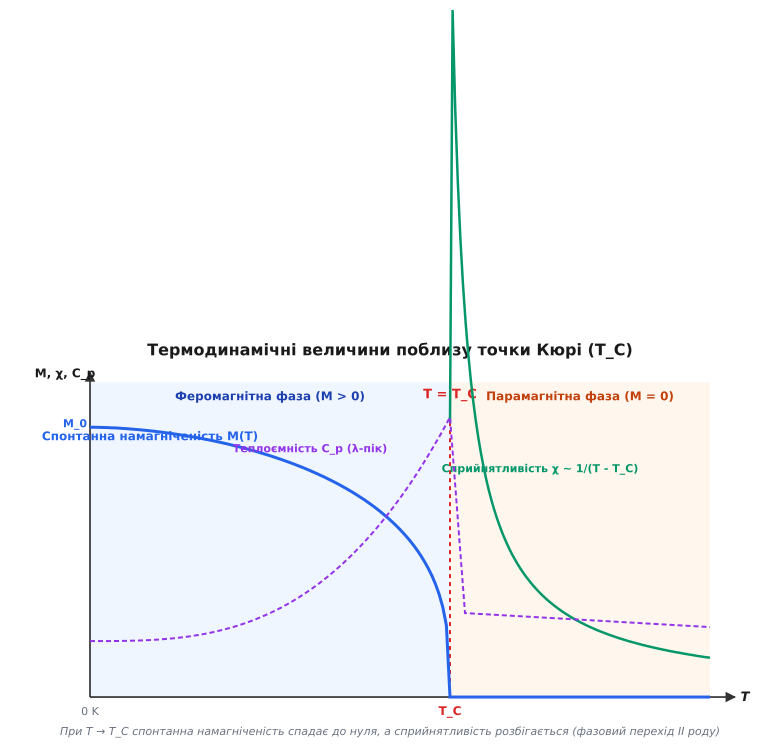
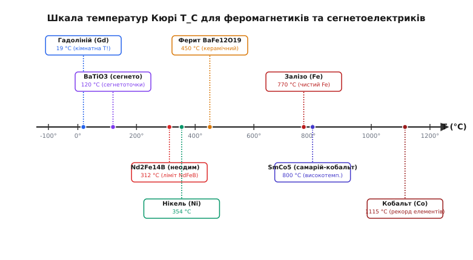
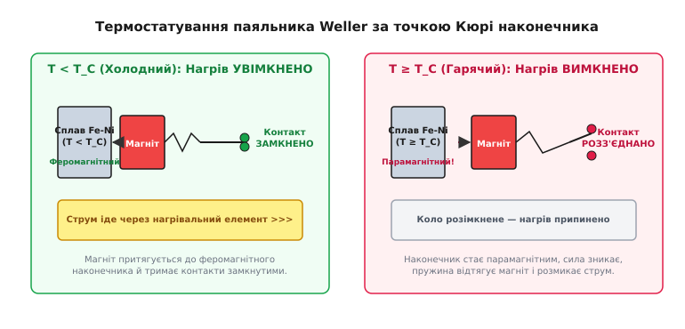

# Точка Кюрі

<preknowlist>
- [Феромагнетизм](book:physics/condensed-matter-physics/ferromagnetism) — спонтанне впорядкування електронних спінів у домени під дією обмінної взаємодії.
- [Постійні магніти](book:physics/condensed-matter-physics/permanent-magnets) — магнітні матеріали з високою коерцитивністю та залишковою намагніченістю.
- [Магнітне насичення та гістерезис](book:physics/condensed-matter-physics/saturation-hysteresis) — зв'язок між напруженістю зовнішнього поля H та індукцією B у матеріалі.
</preknowlist>

Піднесімо звичайний газовий пальник до потужного неодимового магніту, який міцно утримує важку залізну деталь. У міру нагрівання сила притягання непомітно слабшає, а при досягненні температури близько 310 °C магніт раптово й безповоротно «відпускає» метал — деталь падає під власною вагою. Якщо ж подібний дослід провести із залізним цвяхом, піддавши його нагріванню до яскраво-червоного сяйва (понад 770 °C), залізо взагалі перестає реагувати на будь-які найпотужніші зовнішні магніти. Метал залишається залізом, його хімічний склад не змінився, а кристалічна ґратка ще дуже далека від точки плавлення, проте макроскопічний магнетизм зник повністю.

Межа температури, за якою речовина скачкоподібно втрачає спонтанну намагніченість і перетворюється зі звичайного феромагнетика на слабкий парамагнетик, називається **точкою Кюрі** (або температурою Кюрі, `T_C`, від англ. *Curie temperature*). Цей критичний поріг визначає фундаментальну межу існування магнітного порядку у твердих тілах і виступає однією з найважливіших характеристик конденсованого стану речовини.

---

### 1. Межа магнітного порядку: чому нагрітий магніт втрачає силу

Магнетизм у твердому тілі — це не статика, а результат динамічного протиборства двох протилежних фундаментальних фізичних чинників:
1. **Квантова обмінна взаємодія**, яка прагне вишикувати магнітні моменти нескомпенсованих електронів сусідніх атомів строго паралельно один одному, створюючи макроскопічний магнітний порядок.
2. **Хаотичний тепловий рух** атомів кристалічної ґратки, який із підвищенням температури прагне збити орієнтації спінів і перетворити впорядковану систему на повний термодинамічний хаос.

За низьких температур обмінна взаємодія беззаперечно домінує. Сусідні електронні спіни шикуються в одному напрямку, утворюючи макроскопічні області однорідної намагніченості — **домени** (*domains*). Усередині кожного домену трильйони атомних магнітиків орієнтовані узгоджено.

Проте з підвищенням температури амплітуда теплових коливань атомів у вузлах кристалічної ґратки зростає. У спіновій системі виникають теплові збудження — магнітні хвилі або квазічастинки **магнони** (*magnons*). Кожен магнон відповідає відхиленню одного спіна від паралельного напрямку. Що вища температура, то більше магнонів народжується в кристалі, і то сильніше розмивається внутрішня впорядкованість доменів.

При досягненні критичної температури Кюрі `T_C` середня теплова енергія атомів `k_B · T_C` стає співмірною з енергією обмінного зв'язку між спінами. Квантовий порядок остаточно руйнується:
- При `T < T_C` речовина перебуває у **феромагнітному стані** (існує спонтанна намагніченість `M > 0` усередині доменів).
- При `T ≥ T_C` речовина переходить у **парамагнітний стан** (спонтанна намагніченість дорівнює нулю `M = 0`; за відсутності зовнішнього поля спини дивляться хаотично у випадкових напрямках).

Важливо підкреслити: точка Кюрі є характеристикою не конкретного вирібу, деталі чи магнітного домену, а **найважливішою фундаментальною константою самого матеріалу**, яка визначається його хімічним складом, кристалічною ґраткою та тонкою будовою електронних оболонок.

---

### 2. Квантовий механізм: змагання обмінної взаємодії та теплового хаосу

Щоб збагнути, чому точка Кюрі заліза становить колосальні 770 °C (1043 K), необхідно зазирнути на мікроскопічний квантовий рівень. Класичні магнітні диполі, розташовані на відстані атомних радіусів (близько 0.25 нм), взаємодіють між собою надзвичайно кволо. Магнітне поле, яке створює один електронний диполь на сусідньому атомі, становить лише близько 0.1 Тесла. 

Якби феромагнетизм тримався лише на класичних дипольних силах, тепловий рух розрушив би магнітний порядок вже при кріогенній температурі близько **`1 K`** (-272 °C). З погляду класичної електродинаміки існування постійних магнітів за кімнатної температури було абсолютно неможливим і парадоксальним.

Справжнім джерелом існування високих температур Кюрі є квантово-механічний ефект — **обмінна взаємодія** (*exchange interaction*). Вона виникає як прямий наслідок принципу заборони Паулі та електростатичного кулонівського відштовхування електронів із перекриваними хвильовими функціями.

Гамільтоніан взаємодії двох сусідніх спінів `S[i]` та `S[j]` описується формулою Гейзенберга:

```
H_ex = -2 · J · (S[i] · S[j])
```

де `J` — квантовий **обмінний інтеграл** (*exchange integral*).

Якщо `J > 0`, енергетично найвигіднішим є паралельний стан спінів (`↑↑`) — це матеріалізується як **феромагнетизм**. Силу цієї взаємодії у 1907 році французький фізик П'єр Вейсс запропонував описувати через гіпотетичне внутрішнє **молекулярне поле** `B_mol = λ · M`.

Обмінна взаємодія створює всередині кристала заліза еквівалентне магнітне поле порядка **1000 Тесла**. Саме це гігантське поле утримує спіни в паралельному стані проти потужного деструктивного впливу теплового тремтіння ґратки аж до 1043 K.

У твердих тілах виділяють кілька типів обмінної взаємодії:
- **Прямий обмін (Direct Exchange):** Перекриття 3d-орбіталей сусідніх атомів перехідних металів (Fe, Co, Ni).
- **Непрямий суперобмін (Superexchange):** Взаємодія між магнітними катіонами через проміжний немагнітний аніон (наприклад, кисень `O²⁻` у феритах та оксидах).
- **Взаємодія РККІ (RKKY exchange):** Непрямий обмін через електрони провідності у рідкісноземельних металах (Gd, Dy, Tb), що дає складні вихрові та спіральні магнітні структури.

Детальніше про драматичну історію вимірів П'єра Кюрі, висунення гіпотези молекулярного поля та її квантове розшифрування Вернером Гейзенбергом читайте у вставці [Історія відкриття закону Кюрі та температури Кюрі](book:physics/condensed-matter-physics/curie-temperature/hist-curie-law.md).

---

### 3. Термодинаміка фазового переходу II роду

Перехід речовини через точку Кюрі належить до **неперервних фазових переходів (II роду)** за класифікацією Еренфеста та Ландау. На відміну від фазових переходів I роду (таких як плавлення чи кипіння):
- При перетині `T_C` **не виділяється і не поглинається прихована теплота фазового переходу** (прихована теплота `Q = 0`).
- Об'єм і густина речовини змінюються неперервно без стрибка.
- Проте другу похідну вільної енергії — **магнітну сприйнятливість `χ` та ізобарну теплоємність `C_p`** — охоплюють гострі математичні аномалії.


*Термодинамічні величини поблизу точки Кюрі: спонтанна намагніченість M(T) спадає до нуля, сприйнятливість χ(T) за законом Кюрі — Вейсса розбігається, а теплоємність Cp(T) виявляє характерний λ-пік.*

#### 1. Спонтанна намагніченість M(T) — Параметр порядку
Головною характеристикою фазового переходу є **параметр порядку** (*order parameter*), яким у феромагнетиках виступає спонтанна намагніченість домену `M(T)`. При `T = 0 K` усі спіни впорядковані, і намагніченість сягає насичення `M(0) = M_0`. При нагріванні `M(T)` монотонно спадає, а поблизу `T_C` прямує до нуля за критичним степенем:

```
M(T) ∝ (T_C - T)^β    [при T → T_C знизу]
```

У наближенні молекулярного поля критичний індекс `β = 1/2 = 0.5`. Реальні експериментальні виміри у тривимірних кристалах дають значення `β ≈ 0.33–0.38`, що зумовлено потужними флуктуаціями спінів біля точки переходу.

#### 2. Магнітна сприйнятливість χ(T) — Закон Кюрі — Вейсса
Вище точки Кюрі (`T > T_C`) речовина втрачає власну намагніченість, проте під дією зовнішнього поля `H` атоми частково орієнтуються вздовж поля. Магнітна сприйнятливість `χ = M / H` парамагнітної фази підпорядковується **закону Кюрі — Вейсса**:

```
χ = C / (T - T_C)     [при T > T_C]
```

де `C` — константа Кюрі матеріалу.

З цієї формули видно ключовий фізичний ефект: при наближенні до точки Кюрі згори (`T → T_C^+`) знаменник прямує до нуля, а сприйнятливість `χ` **нескінченно зростає (розбігається)**. Матеріал стає надзвичайно «чутливим» до зовнішнього поля: найменший магнітний імпульс здатен викликати величезну відгукову поляризацію, бо спінова система перебуває на межі спонтанного самовпорядкування.

#### 3. Теплоємність C_p(T) — λ-аномалія
Для того щоб зруйнувати впорядковану орієнтацію спінів при нагріванні, кристалу необхідно передати додаткову енергію. Ця додаткова енергія витрачається на подолання обмінних сил між спінами. У результаті на графіку залежності теплоємності від температури `C_p(T)` у точці Кюрі спостерігається гострий асиметричний пік, який за своєю формою нагадує грецьку літеру `λ` (грецька **лямбда-аномалія**).

Повний математичний вивід самоузгодженого рівняння намагніченості, закону Кюрі — Вейсса та розкладу вільної енергії Ландау дивіться у вставці [Математичне виведення закону Кюрі — Вейсса та теорія Ландау](book:physics/condensed-matter-physics/curie-temperature/math-curie-weiss.md).

---

### 4. Статистична фізика: модель Ізінга та точне рішення Онсагера

Для того щоб зрозуміти, як мікроскопічні перевороти окремих спінів приводять до макроскопічного фазового переходу при `T_C`, у статистичній фізиці використовують **модель Ізінга** (*Ising model*).

У цій моделі кристал подається у вигляді двовимірної або тривимірної ґратки, у кожному вузлі якої перебуває дискретна змінна спіну `σ = +1` або `σ = -1`. Точне аналітичне рішення для двовимірної квадратної ґратки Ізінга було отримано видатним фізиком Ларсом Онсагером у 1944 році. Воно стало триумфом теоретичної фізики XX століття.

Онсагер довів, що в двовимірному випадку критична температура Кюрі строго дорівнює:

```
k_B · T_C / J = 2 / ln(1 + √2) ≈ 2.269185
```

Поблизу `T_C` у системі виникають так звані **критичні флуктуації**: радіус кореляції між спінами `ξ(T)` прямує до нескінченності:

```
ξ(T) ∝ |T - T_C|^(-ν)
```

Це означає, що поблизу точки Кюрі спіни об'єднуються у величезні флуктуючі кластери всіх можливих розмірів — від кількох атомів до розмірів усього кристала. Матеріал втрачає масштабно-інваріантну індивідуальність, стаючи фрактальним за своєю магнітною структурою.

Готовий чисельний код симуляції 2D моделі Ізінга методом Монте-Карло (алгоритм Метрополіса) мовами C та C++ з виведенням залежності намагніченості від температури наведено у вставці [Чисельна симуляція фазового переходу в 2D моделі Ізінга](book:physics/condensed-matter-physics/curie-temperature/proj-ising-curie.md).

---

### 5. Шкала температур Кюрі матеріалів: від кімнатних до екстремальних

Значення температури Кюрі вкрай сильно відрізняється залежно від елементного складу, електронної конфігурації та кристалічної ґратки речовини. Знання `T_C` є головним критерієм при виборі магнітних матеріалів для електротехніки, електромобілів, авіації та приладобудування.


*Шкала температур Кюрі для елементарних феромагнетиків, промислових постійних магнітів та сегнетоелектриків.*

#### 1. Чисті елементарні метали
- **Кобальт (`Co`): `T_C = 1115 °C` (1388 K)** — абсолютний рекордсмен серед чистих елементів. Потужна обмінна взаємодія робить кобальт незамінним компонентом жароміцних та високотемпературних магнітних сплавів.
- **Залізо (`Fe`): `T_C = 770 °C` (1043 K)** — класичний феромагнетик. При 770 °C залізо втрачає магнетизм, залишаючись у тій самій кристалічній ОЦК-фазі (альфа-залізо).
- **Нікель (`Ni`): `T_C = 354 °C` (627 K)** — має помірну температуру Кюрі, завдяки чому його сплави з залізом (інвар, пермалой) легко налаштовувати на заданий поріг переходу.
- **Гадоліній (`Gd`): `T_C = 19 °C` (292 K)** — унікальний рідкісноземельний метал. Його точка Кюрі лежить біля кімнатної температури! Шматок гадолінію є феромагнітним у прохолодній воді, але стає парамагнітним, якщо його просто зігріти в долоні. Цей ефект використовують у магнітних теплових насосах та холодильниках.

#### 2. Промислові постійні магніти
- **Неодимові магніти (`Nd_2Fe_14B`): `T_C ≈ 312–320 °C`** — створюють найпотужніше магнітне поле при кімнатній температурі, проте мають порівняно низьку точку Кюрі. Гірше того, їхня коерцитивна сила розпадається набагато раніше — вже при 80–120 °C.
- **Самарій-кобальтові магніти (`SmCo_5` / `Sm_2Co_17`): `T_C ≈ 700–800 °C`** — володіють колосальною тепловою стійкістю. Вони здатні працювати у високотемпературних електродвигунах авіації та космічних апаратів при температурах до 300–500 °C без втрати властивостей.
- **Магніти Альніко (`AlNiCo`, ЮНДК): `T_C ≈ 800–860 °C`** — сплави заліза, алюмінію, нікелю та кобальту. Мають найвищу температурну стабільність серед усіх комерційних магнітів.
- **Керамічні ферити (`BaFe_12O_19` / `SrFe_12O_19`): `T_C ≈ 450 °C`** — феримагнетики на основі оксидів заліза. Дешеві, інертні до корозії та термостійкі.

#### 3. Магнітно-м'які сплави та спеціальні матеріали
- **Інвар 36 (`Fe-64% Ni-36%`): `T_C ≈ 230 °C`** — сплав із нульовим коефіцієнтом теплового розширення біля кімнатної температури. Цей ефект зумовлений тим, що магнітострикційне стискання при підході до точки Кюрі строго компенсує звичайне теплове розширення ґратки.
- **Пермалой (`Fe-80% Ni-20%`): `T_C ≈ 400 °C`** — сплав із високою магнітною проникністю для осердь трансформаторів та магнітних екранів.
- **Сплави Гейслера (`Cu_2MnAl`): `T_C ≈ 330 °C`** — дивовижні металеві сполуки, складені з абсолютно немагнітних елементів (мідь, марганець, алюміній), які при кристалізації утворюють впорядковану феромагнітну ґратку.

---

### 6. Аналогія в інших середовищах: сегнетоелектрична точка Кюрі

Концепція точки Кюрі поширюється далеко за межі магнетизму. У фізиці конденсованого стану існує дзеркальний клас дипольних матеріалів — **сегнетоелектрики** (*ferroelectrics*).

У сегнетоелектриках нижче критичної **сегнетоелектричної точки Кюрі `T_C`** виникає спонтанна електрична поляризація `P > 0` за відсутності зовнішнього електричного поля. Сусідні елементарні комірки кристала зсуваються так, що їхні електричні дипольні моменти шикуються паралельно.

Яскравим прикладом є **титанат барію (`BaTiO_3`)** із сегнетоелектричною точкою Кюрі **`T_C = 120 °C`**:
- При `T > 120 °C` кристалічна ґратка `BaTiO_3` має строго симетричну кубічну форму — кристал є звичайним параелектриком без п'єзоефекту.
- При охолодженні нижче `120 °C` центральний іон титану `Ti⁴⁺` зсувається відносно оксидного октаедра, кристал деформується в тетрагональну фазу, і виникає макроскопічна спонтанна поляризація.

Іншим фундаментальним сегнетоелектриком є **ЦТС (цирконат-титанат свинцю, PZT)** із точкою Кюрі `T_C ≈ 300–400 °C`, на основі якого виготовляють понад 90% усіх п'єзоелектричних актюаторів та давачів у світі.

Вище точки Кюрі сегнетоелектрики повністю втрачають свої цінні властивості — **п'єзоелектричний ефект** (генерація напруги при стисканні) та **піроелектричний ефект** (струм при зміні температури). Тому для п'єзодатчиків ультразвуку, ультразвукових випромінювачів та керамічних конденсаторів температура Кюрі є суворим верхнім лімітом експлуатації.

---

### 7. Практика, діагностика та інженерні застосування

Точка Кюрі — це не лише абстрактний фізичний поріг, а потужний практичний інструмент, який активно використовують у сучасній мікроелектроніці, побутовій техніці та геології.


*Автоматичне термостатування паяльника Weller: при досягненні точки Кюрі наконечник втрачає феромагнітні властивості, відпускає внутрішній магніт і розмикає струм нагрівача.*

#### 1. Термостатовані паяльники Weller (Принцип Magnastat)
Класичним прикладом геніального використання точки Кюрі в інженерії є паяльники **Weller Magnastat**. Вони підтримують точну робочу температуру наконечника без жодної електронної схеми, термопари чи мікроконтролера.

У торець змінно-знімного наконечника впресовано таблетку зі спеціального термомагнітного сплаву заліза та нікелю. При кімнатній температурі сплав феромагнітний. Він притягує постійний магніт, закріплений на рухомому штоку всередині паяльника. Шток зсувається і замкає електричні контакти — нагрівальний елемент отримує живлення.

Коли наконечник розігрівається до точки Кюрі вибраного сплаву (наприклад, строго 370 °C для серії «7»), сплав миттєво стає парамагнітним. Сила притягання зникає, відтяжна пружина відштовхує магніт назад і розмикає контакти — нагрів припиняється. Як тільки температура падає нижче 370 °C, сплав знову стає феромагнітним, магніт притягується, і нагрів вмикається знову. Зміна робочої температури паяльника здійснюється просто заміною наконечника з іншим сплавом Кюрі.

#### 2. Термомагнітний запис HAMR (Heat-Assisted Magnetic Recording)
У сучасних жорстких дисках високої щільності (HAMR) магнітні осередки носія роблять із матеріалів із колосальною коерцитивною силою (наприклад, сплав FePt), щоб дрібні біти не розмагнічувалися самочинно під дією теплових флуктуацій. Але звичайній магнітній голівці не вистачає власного поля, щоб перезаписати такий твердий біт.

Вирішенням став термомагнітний запис: у записувальну голівку вбудовують крихітний нанолазер. Під час запису лазерний промінь на частки наносекунди точково розігріває магнітну пляшечку діаметром в кілька нанометрів майже до її точки Кюрі. У результаті коерцитивна сила плями падає майже до нуля, і слабке поле голівки легко повертає намагніченість біта. Після відведення лазера ділянка миттєво охолоджується і надійно запечатує записану інформацію.

#### 3. Геофізика та палеомагнетизм: Глибина Кюрі
У геофізиці точка Кюрі магнетиту (`Fe_3O_4`, `T_C = 580 °C`) задає фундаментальну межу **глибини Кюрі** (*Curie depth*) у літосфері Землі. З підвищенням глибини температура в надрах зростає через геотермічний градієнт (в середньому на 30 °C на кожен кілометр). На глибинах близько 30–50 км температура перевищує 580 °C. Це означає, що глибші шари мантії та ядра Землі, попри високий вміст заліза, **не можуть мати власного спонтанного феромагнетизму**. Магнітне поле Землі генерується не постійними магнітами надр, а динамічним рухом розплапленого провідного рідкого ядра — ефектом [геодинамо](book:physics/electromagnetism/geodynamo).

Крім того, коли вулканічна лава охолоджується нижче 580 °C, магнетильні мінерали в ній фіксують напрямок земного магнітного поля тієї епохи. Цей ефект (термозалишкова намагніченість, TRM) дозволяє палеомагнітологам відновлювати дрейф материків та інверсії магнітних полюсів Землі за мільйони років.

> 🔧 **Навіщо це.** Враховуйте точку Кюрі та коерцитивний спад при виборі магнітів для інженерних конструкцій. Якщо електродвигун чи магнітний сепаратор працює при 100–120 °C, дешеві неодимові магніти стандарту N35 втратять силу. Для гарячих зон слід обирати високотемпературні марки NdFeB (з позначками SH, UH, EH, де присутня домішка диспрозію) або переходити на SmCo. Також пам'ятайте: якщо вам потрібно повністю розмагнітити сталевий інструмент або деталь після магнітної дефектоскопії, нагрійте її вище точки Кюрі (понад 770 °C для сталі) і повільно охолодіть у відсутності магнітних полів.

---

### 8. Інженерні пастки та межі застосування

Розуміння явища точки Кюрі береже інженера від небезпечних помилок та хибних розрахунків.

#### Пастка 1: Точка Кюрі T_C проти Максимальної робочої температури T_max
Найпоширеніша помилка початківців — плутати фундаментальну точку Кюрі `T_C` із практичною робочою температурою матеріалу `T_max`. 

Для неодимового магніту марки N35 точка Кюрі становить `T_C = 312 °C`. Здавалося б, магніт можна безпечно нагрівати до 200 °C. Проте це катастрофічна помилка! Коерцитивна сила `H_cJ` неодимового магніту спадає з температурою набагато швидше, ніж спонтанна намагніченість. Вже при досягненні `T_max ≈ 80 °C` власне розмагнічувальне поле магніту долає спадну коерцитивність, і магніт зазнає **незворотного розмагнічування**. При нагріванні до 150 °C магніт втратить 80% своєї сили назавжди, хоча до точки Кюрі лишається ще більше 160 градусів!

#### Пастка 2: Чи повернеться магнетизм після охолодження?
Якщо розжарити залізний цвях вище 770 °C і просто дати йому охолонути до кімнатної температури, чи стане він знову магнітом?

Фізична відповідь тонко роздвоюється:
- На **мікроскопічному рівні** всередині матеріалу спонтанна намагніченість відновлюється повністю: при `T < T_C` спіни знову вишикуються в домени.
- Проте на **макроскопічному рівні** за відсутності зовнішнього поля напрямки різних доменів орієнтуються випадковим чином, хаотично компенсаційно гасячи один одного. Зовні цвях виявиться повністю розмагніченим! Щоб перетворити його назад на макроскопічний магніт, його необхідно повторно вишикувати в сильному зовнішньому магнітному полі.

#### Пастка 3: Структурні алотропічні переходи проти магнітних
У багатьох металах та сплавах термодинамічні фазові переходи кристалічної ґратки можуть накладатися на магнітні переходи Кюрі.

Наприклад, у чистому залізі точка Кюрі `T_C = 770 °C` відбувається у межах однієї й тієї самої кристалічної ОЦК-структури (альфа-залізо). При дальшому нагріванні до 912 °C відбувається зовсім інший — структурний фазовий перехід I роду у ГЦК-структуру (гамма-залізо). Не слід плутати точку Кюрі (магнітне розвпорядкування) зі структурною перебудовою кристала чи точкою плавлення. Точка Кюрі — це чистий квантово-магнітний перехід без зміни типу кристалічної ґратки.
