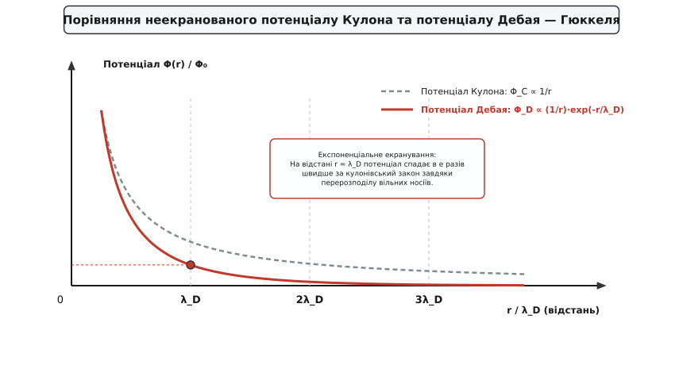
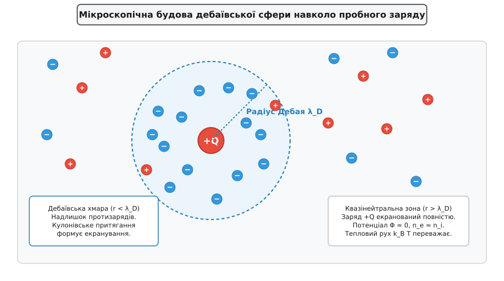
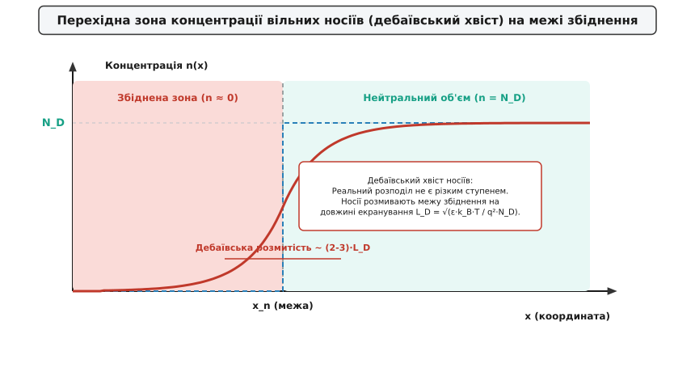

# Довжина екранування Дебая

<preknowlist>
- [Закон Кулона та потенціал](topic:physics/coulomb-law) — електростатичний потенціал точкового заряду та закон обернених квадратів.
- [Рівняння Пуассона та Лапласа](topic:physics/poisson-laplace-eq) — зв'язок між об'ємним розподілом електричного заряду та потенціалом.
- [Фактор Больцмана](topic:physics/boltzmann-factor) — статистична ймовірність заселення енергетичних станів за скінченної температури.
- [Провідність напівпровідників](topic:physics/semiconductor) — вільні електрони, дірки та теплова генерація носіїв.
</preknowlist>

Якщо занурити металевий зонд під від'ємним потенціалом у гарячу газову плазму або прикласти напругу до затвора польового транзистора, кулонівські сили починають відштовхувати однойменні вільні заряди й притягувати протилежні. За класичним законом електростатики потенціал зарядженого тіла мав би проникати крізь усьому об'єм речовини, згасаючи повільно за законом оберненої пропорційності відстані `1/r`. Проте у середовищі з вільно рухливими носіями заряду виникає самоорганізована захисна хмара: вільні частинки миттєво перерозподіляються у просторі й компенсують зовнішній заряд. Внаслідок цієї колективної дії електричне поле експоненціально згасає практично до нуля на дуже короткій відстані, відновлюючи макроскопічну електронейтральність середовища. Характерний просторовий радіус цього термодинамічного пригнічення поля називається **дебаївською довжиною екранування** (*Debye screening length*, `λ_D` або `L_D`).

### 1. Фізичний механізм: протиборство кулонівського порядку та теплового хаосу

У будь-якому середовищі з вільними зарядами — чи то газорозрядній плазмі, розчині електроліту чи напівпровідниковій пластині — одночасно діють два протилежних фізичних чинники, змагання яких і задає внутрішній просторовий масштаб речовини.

Перший чинник — **електростатична взаємодія Кулона** (*Coulomb interaction*, від ім'я французького фізика Шарля де Кулона). Вона намагається впорядкувати систему: притягнути протилежно заряджені частинки якомога ближче до точкового збурення `+Q` та відкинути однойменні заряди на периферію. Якби діяв лише цей чинник, усі вільні електрони випали б на додатний точковий заряд, утворивши щільну нейтралізуючу оболонку зі скінченним радіусом.

Другий чинник — **хаотичний тепловий рух** (*thermal motion*), енергія якого виражається величиною `k_B · T`. Хаотичні зіткнення постійно бомбардують утворену зародкову хмару, намагаючись розмити скупчення зарядів та рівномірно перемішати частинки по всьому доступному об'єму.

Підсумковий стан системи описується динамічною термодинамічною рівновагою. На малих відстанях від пробного заряду кулонівська потенціальна енергія `e · Φ` значно перевищує кінетичну енергію теплового руху `k_B · T`, тому електростатичний порядок перемагає. Проте зі віддаленням від джерела потенціал спадає, і на деякій критичній відстані теплова енергія `k_B T` починає домінувати над електростатичною. Саме цей просторовий масштаб визначає довжину екранування Дебая `λ_D`.


*Порівняння неекранованого потенціалу Кулона (пунктир) та потенціалу Дебая — Гюккеля (суцільна лінія). Завдяки формуванню екрануючої хмари вільних носіїв потенціал спадає у просторі експоненціально стрімко.*

У вакуумі точковий заряд `Q` створює потенціал `Φ₀(r) = Q / (4 · π · ε₀ · r)`. У середовищі з вільно рухливими носіями перерозподіл зарядів перетворює цей потенціал на екранований потенціал Дебая — Гюккеля:

```
Φ(r) = [ Q / (4 · π · ε · r) ] · exp( - r / λ_D )
```

На відстані `r = λ_D` значення потенціалу падає в `e ≈ 2.718` раза швидше, ніж передбачає вакуумний закон Кулона. На відстанях `r > 3 · λ_D` експоненціальний множник `exp(-3) ≈ 0.05` пригнічує електричне поле більше ніж на 95%, роблячи внутрішні області речовини повністю захищеними від зовнішнього електричного збурення.

Детальний опис того, як ця концепція народжувалася у суперечках фізиків-хіміків довкола розчинів солей та як вона була узагальнена для іонізованих газів, наведено в [історії відкриття дебаївського екранування](topic:physics/debye-length/hist-debye-huckel.md).

### 2. Математичний вивід: рівняння Пуассона — Больцмана та лінеаризація

Для кількісного обчислення дебаївської довжини необхідно поєднати макроскопічне рівняння електростатики з мікроскопічним статистичним розподілом частинок.

Розподіл електричного потенціалу `Φ(r)` у середовищі з об'ємною густиною заряду `ρ(r)` задається рівнянням Пуассона:

```
∇² Φ(r) = - ρ(r) / ε
```

де `ε = ε_r · ε₀` — абсолютна діелектрична проникність середовища.

Якщо у середовищі присутні рухливі носії із зарядами `q_i` (наприклад, електрони із зарядом `-e` та іони чи дірки із зарядом `+e`), їхня середня локальна концентрація `n_i(r)` залежить від потенціалу `Φ(r)` згідно з розподілом Больцмана:

```
n_i(r) = n_{i0} · exp( - q_i · Φ(r) / (k_B · T) )
```

де `n_{i0}` — незбурена концентрація носіїв на нескінченності, де `Φ = 0`. Підставляючи ці концентрації у вираз для сумарної об'ємної густини заряду `ρ(r) = ∑ q_i · n_i(r)`, отримуємо нелінійне рівняння Пуассона — Больцмана:

```
∇² Φ(r) = - (1 / ε) · ∑ [ q_i · n_{i0} · exp( - q_i · Φ(r) / (k_B · T) ) ]
```

Аналітичний розв'язок цього нелінійного рівняння у загальному тривимірному випадку є надзвичайно складним. Проте у переважній більшості фізичних ситуацій (за винятком областей, що прилягають безпосередньо до сильних джерел заряду) потенціальна енергія взаємодії частинки з полем є набагато меншою за її середню кінетичну енергію теплового руху:

```
|q_i · Φ(r)| << k_B · T
```

Це дозволяє розкласти експоненту в ряд Тейлора `exp(-x) ≈ 1 - x` і обмежитися першими двома членами. Дане наближення називається **лінеаризацією Дебая — Гюккеля** (*Debye–Hückel linearization*).

Після підстановки лінеаризованого розкладу об'ємна густина заряду набуває вигляду:

```
ρ(r) ≈ ∑ [ q_i · n_{i0} · (1 - (q_i · Φ(r)) / (k_B · T)) ]
ρ(r) = ∑ [ q_i · n_{i0} ] - [ ∑ (n_{i0} · q_i²) / (k_B · T) ] · Φ(r)
```

Перший доданок `∑ (q_i · n_{i0})` дорівнює нулю внаслідок вихідної електронейтральності середовища. Підставляючи залишений другий доданок назад у рівняння Пуассона, отримуємо лінійне диференціальне рівняння:

```
∇² Φ(r) = [ ∑ (n_{i0} · q_i²) / (ε · k_B · T) ] · Φ(r)
```

Коефіцієнт у квадратних дужках має розмірність квадрата оберненої довжини `1 / λ_D²`. Вилучаючи звідси корінь, отримуємо остаточну фундаментальну формулу для **довжини екранування Дебая**:

```
λ_D = √[ (ε · k_B · T) / (∑ n_{i0} · q_i²) ]
```

У разі двокомпонентного середовища з електронами та однозарядними іонами, що перебувають за однакової температури `T_e = T_i = T`, формула перетворюється на:

```
λ_D = √[ (ε · k_B · T) / (2 · n₀ · e²) ] = (1 / √2) · λ_De
```

Проте у багатьох плазмових системах (наприклад, у газовому розряді низького тиску) легкі електрони активно нагріваються високочастотним полем до температур `T_e ~ (1–5) · 10⁴ К` (1–5 еВ), тоді як важкі іони залишаються холодними і мають температуру стінок `T_i ≈ 300 К`. Оскільки іони мають у тисячі разів більшу інерційність (`m_i >> m_e`), вони не встигають реагувати на високочастотні коливання поля. У таких неізотермічних умовах статичне або низькочастотне екранування визначається іонами, тоді як високі частоти екрануються виключно гарячими електронами з довжиною `λ_De`.

Повний математичний вивід розв'язку цього рівняння у сферичній та одновимірній плоскій геометрії (включаючи точний розв'язок Ґуї — Чапмана через гіперболічний тангенс) наведено у [математичному виведенні рівняння Пуассона — Больцмана](topic:physics/debye-length/math-poisson-boltzmann.md).

Аналіз отриманої формули показує дві фундаментальні залежності:
1. **Зростання температури (`T ↑`) збільшує довжину екранування (`λ_D ↑`).** Чим сильнішим є тепловий хаос, тим важче кулонівським силам утримувати частинки у дебаївській хмарі, тому радіус екранування зростає як `√T`.
2. **Зростання концентрації носіїв (`n₀ ↑`) зменшує довжину екранування (`λ_D ↓`).** Чим більше вільних зарядів перебуває в одиниці об'єму, тим менша відстань потрібна для того, щоб зібрати кількість протизарядів, достатню для повної нейтралізації зовнішнього поля (`λ_D ∝ 1/√n₀`).

### 3. Дебаївська сфера та три критерії існування плазми

У фізиці іонізованого газу (плазми) довжина екранування Дебая виступає не просто як характеристика згасання поля, а як **головний критерій**, який визначає, чи є дана система справжньою плазмою, чи лише сукупністю окремих заряджених частинок.

Навколо будь-якого введеного тестового заряду формується сферична область радіуса `λ_D`, яку називають **дебаївською сферою** (*Debye sphere*).


*Мікроскопічна структура дебаївської сфери радіуса λ_D навколо додатного тестового заряду +Q. Всередині сфери спостерігається надлишок від'ємних електронів; зовні середовище залишається квазінейтральним.*

Об'єм такої сфери дорівнює `V_D = (4/3) · π · λ_D³`. Кількість вільних носіїв заряду, які містяться всередині дебаївської сфери, описується безрозмірним **плазмовим параметром** `N_D` (*Debye number*):

```
N_D = n_e · V_D = (4 / 3) · π · n_e · λ_D³
```

Підставляючи вираз для `λ_De`, отримуємо залежність плазмового параметра від температури та концентрації:

```
N_D = (4 / 3) · π · [ (ε₀ · k_B · T_e) / e² ]^(3/2) · (1 / √n_e)
```

Парадокс цієї формули полягає у тому, що при зростанні густини частинок `n_e` кількість частинок всередині дебаївської сфери `N_D` не збільшується, а зменшується як `1/√n_e`. Це пояснюється тим, що стискання радіуса Дебая `λ_D ∝ n_e^(-1/2)` зменшує об'єм сфери `V_D ∝ n_e^(-3/2)` значно швидше, ніж зростає щільність упакування частинок.

Щоб матеріальна система проявляла колективні фізичні властивості плазми, вона повинна одночасно задовольняти три фундаментальні умови:

1. **Критерій макроскопічної квазінейтральності:** характерний геометричний розмір системи `L` має бути набагато більшим за дебаївську довжину (`L >> λ_D`). Якщо ця умова виконується, то майже у всьому об'ємі (за винятком тонких пристінкових шарів товщиною порядку кількох `λ_D`) середовище є строго електронейтральним (`n_e ≈ n_i`). Якщо ж розміри системи `L < λ_D`, вільні носії вилітають на стінки раніше, ніж встигає сформуватися екрануюча хмара, і плазма розпадається на окремі пучки зарядів.
2. **Умова дебаївської сфери (колективність):** кількість частинок всередині дебаївської сфери має бути величезною (`N_D >> 1`). Ця умова гарантує, що статистичне екранування створюється колективною дією багатьох частинок, а не випадковим поодиноким зіткненням. Енергія кулонівської взаємодії між сусідніми частинками при цьому є набагато меншою за їхню кінетичну енергію, що робить плазму ідеальним газом зі слабким зв'язком.
3. **Частотний критерій (відсутність передемпфування):** електронна плазмова частота `ω_pe = √(n_e · e² / (ε₀ · m_e))` повинна перевищувати частоту бінарних зіткнень частинок із нейтральними атомами (`ω_pe · τ_coll >> 1`). Це означає, що колективні електронні коливання встигають зробити багато періодів до того, як вони згаснуть внаслідок парних зіткнень.

Якщо умова `N_D >> 1` порушується (наприклад, у надщільній плазмі ядер юпітеріанських планет чи кріогенній плазмі), середовище переходить у стан **неідеальної (неідеально-зв'язаної) плазми**. У цьому режимі парні кулонівські кореляції стають сильнішими за дебаївське екранування, і континуальна теорія Пуассона — Больцмана втрачає застосовність.

Принципові відмінності між значеннями дебаївської довжини у різних фізичних системах наведено у порівняльній таблиці:

| Фізична система | Концентрація носіїв `n` [см⁻³] | Температура `T` [К] | Дебаївська довжина `λ_D` |
| :--- | :--- | :--- | :--- |
| **Міжзоряний газ** | `1` | `10⁴` | `7.4 м` |
| **Сонячний вітер** | `10` | `10⁵` | `6.9 м` |
| **Лабораторна плазма (тліючий розряд)** | `10¹⁰` | `3 · 10⁴` (3 еВ) | `120 мкм` |
| **Токамак (термоядерна плазма)** | `10¹⁴` | `10⁸` (10 кеВ) | `24 мкм` |
| **Власна зона кремнію (Si, 300 K)** | `1.5 · 10¹⁰` | `300` | `24 мкм` |
| **Легований кремній (Si, N_D = 10¹⁶ см⁻³)** | `10¹⁶` | `300` | `40 нм` |
| **Сильнолегований кремній (N_D = 10¹⁹ см⁻³)**| `10¹⁹` | `300` | `1.3 нм` |
| **Метали (електрони провідності)** | `10²²` | `300` (виродж.) | `0.05 нм` (0.5 Å) |

### 4. Екранування у напівпровідниках та межа збідненого шару

У фізиці напівпровідників дебаївська довжина (часто позначається як `L_D`) описує просторовий масштаб екранування електричних полів вільними електронами та дірками.

Для напівпровідника n-типу з концентрацією донорної домішки `N_D` дебаївська довжина неосновних/основних носіїв задається виразом:

```
L_D = √[ (ε_r · ε₀ · k_B · T) / (q² · N_D) ] = √[ (ε_r · ε₀ · V_T) / (q · N_D) ]
```

де `V_T = k_B · T / q ≈ 25.9 мВ` — тепловий потенціал за кімнатної температури (`300 K`).

У класичній теорії [PN-переходу](topic:physics/pn-junction) та бар'єрів Шотткі часто використовують наближення різкої межі збідненої зони (*depletion approximation*). Згідно з цією спрощеною моделлю, концентрація вільних носіїв у збідненій зоні вважається рівною нулю (`n = 0`), а на межі `x = x_n` вона стрибком зростає до значення в нейтральному об'ємі (`n = N_D`).

Проте у реальному кристалі вільні електрони не можуть утворювати абсолютно різкий ступінь через теплове розмивання. На межі нейтрального напівпровідника та збідненої зони електрони з нейтрального об'єму утворюють дифузійний «хвіст», який заходить углиб потенціального бар'єра.


*Профіль концентрації вільних носіїв n(x) на межі збідненої зони. Замість ідеального ступеня (пунктир) спостерігається гладкий дебаївський перехід шириною в кілька L_D.*

Ширина цього розмитого перехідного шару визначається саме дебаївською довжиною `L_D`. На відстані порядку `(2–3) · L_D` концентрація носіїв експоненціально виходить на плато нейтрального об'єму `N_D`.

Цей ефект має принципове значення при розрахунку ємності збідненого шару `C_dep`. Реальна бар'єрна ємність виявляється дещо більшою за ємність плоского конденсатора з товщиною `W_dep`, оскільки дебаївське розмивання зменшує ефективну відстань між зарядженими обкладками на величину порядку `L_D`:

```
C_eff = (ε_r · ε₀) / ( W_dep + L_D )
```

У сучасних польових транзисторах зі структурами метал-діелектрик-напівпровідник (МДН/MOS) дебаївська довжина визначає просторовий товщинний масштаб інверсійного каналу `x_inv` та критерії виникнення короткоканальних ефектів. Якщо довжина каналу транзистора `L_gate` стає сумірною з `L_D`, потенціал стоку починає проникати углиб витоку, позбавляючи затвор здатності запирати транзистор (ефект ДІБЛ / DIBL).

Алгоритми чисельного розв'язання цих рівнянь на комп'ютері з використанням сіткових методів наведено у вставці [чисельне моделювання дебаївського екранування](topic:physics/debye-length/proj-debye-solver.md).

### 5. Квантове екранування в металах: модель Томаса — Фермі та осциляції Фріделя

У металах і сильнолегованих напівпровідниках концентрація вільних носіїв сягає `n ~ 10²²–10²³ см⁻³`. За таких високих густин середня відстань між електронами є меншою за їхню дебройлівську довжину хвилі, що призводить до квантового виродження електронного газу.

За кімнатної температури теплова енергія `k_B T ≈ 0.026 еВ` є мізерно малою порівняно з енергією Фермі `E_F ≈ 2–7 еВ` (`T << T_F`). Тому розподіл Больцмана втрачає застосовність, і класична формула Дебая дає хибний результат (передбачаючи прямування `λ_D → 0` при `T → 0`).

У квантовій системі роль теплового розмивання виконує енергія Фермі `E_F`, яка описує принцип заборони Паулі та квантовий тиск електронного газу. Застосування статистики Фермі — Дірака до рівняння Пуассона дає формулу для **довжини екранування Томаса — Фермі** (`λ_TF`):

```
λ_TF = √[ (2 · ε₀ · E_F) / (3 · n₀ · e²) ]
```

Виразивши енергію Фермі через концентрацію електронів `E_F = (ℏ² / 2m*) · (3·π²·n₀)^(2/3)`, отримуємо квантову залежність радіуса екранування від густини носіїв:

```
λ_TF = √[ (ε₀ · ℏ² · π^(2/3)) / (m* · e² · (3·n₀)^(1/3)) ]
```

Для міді (`Cu`), де концентрація електронів провідності становить `n₀ ≈ 8.5 · 10²⁸ м⁻³`, а енергія Фермі `E_F ≈ 7 еВ`, обчислення за формулою Томаса — Фермі дає:

```
λ_TF ≈ 0.55 Å  (0.055 нм)
```

Це значення є меншим за радіус першої борівської орбіти атома водню (`0.53 Å`). Фізичний наслідок цього є фундаментальним: будь-яке зовнішнє електростатичне поле пригнічується в металі майже повністю вже на відстані першого атомного шару. Саме тому всередині металевих провідників електростатичне поле завжди дорівнює нулю, а надлишковий заряд зосереджується виключно на їхній поверхні.

Проте квантова механіка готує ще один суттєвий сюрприз, що відрізняє метал від класичної плазми. Через наявність чіткої межі у розподілі Фермі — Дірака (сфери Фермі з імпульсом `p_F = ℏ · k_F`) хвильові функції електронів, що розсіюються на точковому дефекті, інтерферують між собою. Внаслідок цієї квантової інтерференції потенціал екранування на великих відстанях `r >> λ_TF` згасає не за чистою експонентою, а здійснює згасаючі просторові коливання, які називаються **осциляціями Фріделя** (*Friedel oscillations*):

```
Φ_Friedel(r) ∝ [ cos(2 · k_F · r) ] / r³
```

Ці квантові осциляції потенціалу створюють періодичне притягання та відштовхування між домішковими атомами у металевій ґратці та лежать в основі непрямого обмінного зв'язку РККІ (Руддермана — Киттеля — Касуї — Йосиди) у магнітних сплавах.

### 6. Динамічне екранування та діелектрична функція

Досі ми розглядали виключно статичне екранування непорушних полів. Проте якщо джерело поля рухається з високою швидкістю або змінюється з частотою `ω`, перерозподіл носіїв заряду не встигає відбуватися миттєво.

Динамічне екранування описується через **поздовжню діелектричну проникність** `ε(k, ω)`, яка залежить як від хвильового вектора `k` (просторовий масштаб `r ~ 1/k`), так і від частоти `ω`.

У довгохвильовому статичному ліміті (`ω = 0`, `k → 0`) діелектрична функція виродженої або больцманівської плазми виражається формулою:

```
ε(k, 0) = 1 + 1 / (k² · λ_D²)
```

Тоді потенціал джерела з кулонівським спектром `Φ_ext(k) = Q / (ε₀ · k²)` у середовищі перетворюється на:

```
Φ(k) = Φ_ext(k) / ε(k, 0) = Q / [ ε₀ · (k² + 1 / λ_D²) ]
```

Здійснюючи обернене фур'є-перетворення від виразу `1 / (k² + 1/λ_D²)`, ми математично строго повертаємося до тривимірного потенціалу Дебая — Гюккеля `(1/r) · exp(-r/λ_D)`.

Якщо ж швидкість носія заряду `v` перевищує теплову швидкість електронів `v_th`, носій «випереджає» процес утворення дебаївської хмари. За рухомим зарядом виникає не сферична атмосфера, а хвильовий кільватерний слід — трек електростатичних плазмових коливань (ефект трекового екранування).

### 7. Дебаївське екранування у розчинах електролітів та хімії колоїдів

У фізичній хімії та м'якій речовині (*soft matter*) дебаївська довжина описує структуру **подвійного електричного шару** (*electric double layer*, EDL) на межі між твердою поверхнею та рідким розчином електроліту.

Коли занурити заряджену частинку (наприклад, частинку глини, білкову молекулу або колоїдну мікросферу) у воду, її поверхневий заряд притягує протилежно заряджені іони розчину (протиіони). Навколо частинки формується дифузний шар Ґуї — Чапмана, товщина якого дорівнює дебаївській довжині:

```
λ_D = √[ (ε_r · ε₀ · R · T) / (2 · F² · I) ]
```

де `F = N_A · e ≈ 96485 Кл/моль` — стала Фарадея, `R` — універсальна газова стала, а `I` — **іонна сила розчину** (*ionic strength*):

```
I = (1 / 2) · ∑ [ z_i² · c_i ]
```

де `z_i` — валентність іона сорту `i`, а `c_i` — його молярна концентрація.

З цієї формули випливає практичне правило хімії колоїдів: **додавання солі у розчин збільшує іонну силу `I` та стрімко стискає подвійний електричний шар (`λ_D ↓`)**.

Цей механізм лежить в основі класичної **теорії Дерягіна — Ландау — Вервея — Овербека (ДЛВО / DLVO)**, яка пояснює агрегативну стійкість колоїдних розчинів:
* У чистій воді іонна сила мала, тому дебаївська довжина є великою (`λ_D ~ 100 нм`). При наближенні двох колоїдних частинок їхні дебаївські хмари перекриваються, викликаючи сильне електростатичне відштовхування, яке не дає частинкам злипнутися.
* Якщо додати у розчин сіль (наприклад, `NaCl` або `AlCl₃`), іонна сила зростає, дебаївська довжина стискається до `1–2 нм`. Електростатичний бар'єр відштовхування зникає, ван-дер-ваальсові сили притягання перемагають, і відбувається швидка **коагуляція** (випадання осаду).

> 🔧 **Навіщо це.**
> 
> Знання та точний розрахунок довжини екранування Дебая є критично важливими у сучасній інженерії та високих технологіях:
> 
> 1. **Проектування нанотранзисторів (FinFET, GAAFET):** при зменшенні довжини затвора сучасних мікропроцесорів нижче 10 нм товщина напівпровідникового каналу стає порівнянною з `L_D`. Щоб затвор міг надійно перекривати струм витоку, товщина каналу повинна бути меншою за дебаївську довжину (`t_ch < L_D`). Це вимагає перехода до екстремального легування та матеріалів із високою діелектричною проникністю (high-k діелектрики).
> 2. **Плазмова обробка та витравлювання мікросхем:** під час плазмохімічного витравлювання кремнієвих пластин напівпровідник перебуває у контакті з газовою плазмою. Усі прискорюючі напруги падають на пристінковому дебаївському шарі `(3–5) · λ_D`. Керуючи дебаївською довжиною через тиск газу та потужність ВЧ-генератора, інженери контролюють енергію й анізотропію іонного бомбардування.
> 3. **Суперконденсатори та хімічні джерела струму:** у суперконденсаторах (іоністорах) електрична ємність формується на межі високопористого вуглецю та електроліту. Товщина обкладок дорівнює дебаївській довжині `λ_D ≈ 1 нм`, що дозволяє отримувати колосальну питому ємність (сотні фарад на грам).
