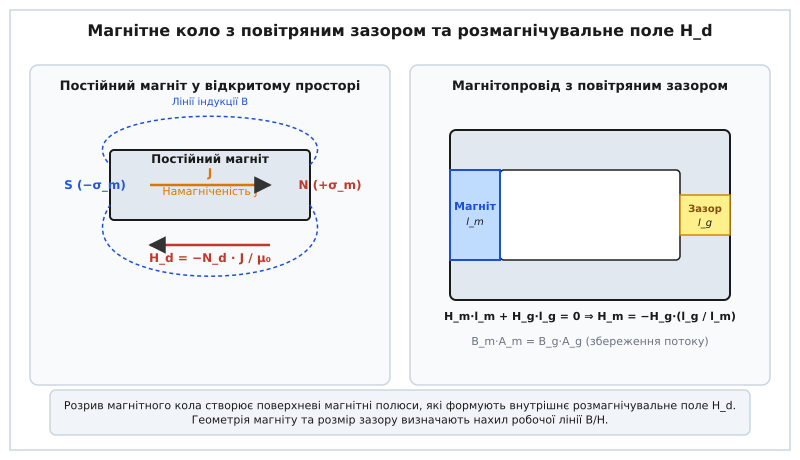
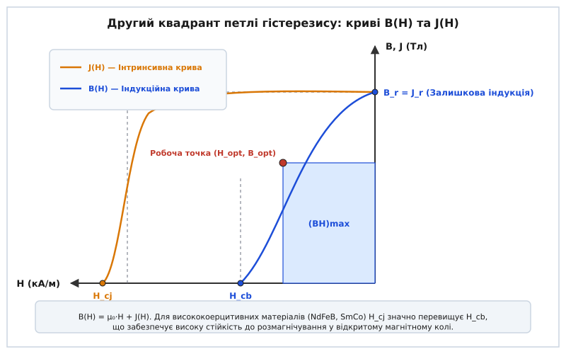
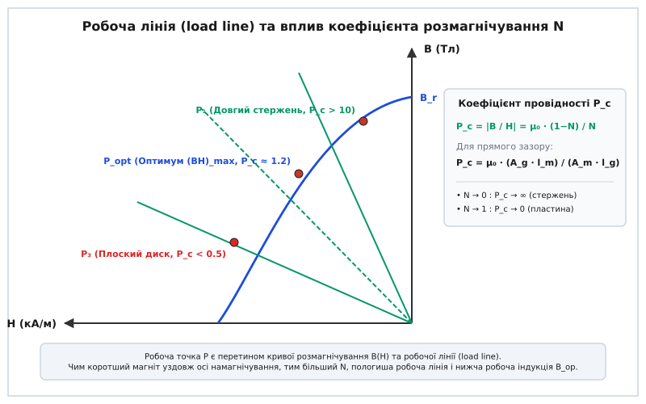
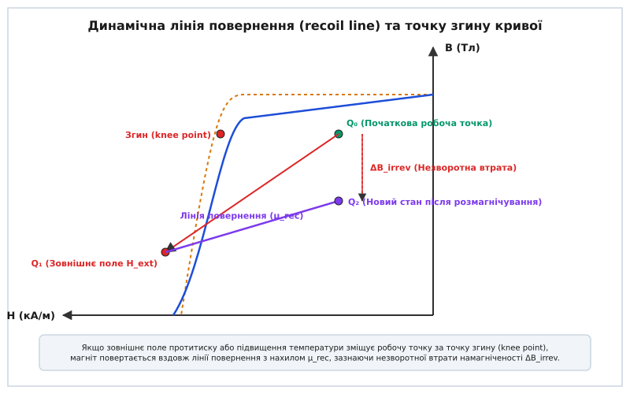

# Крива розмагнічування та робоча точка магніту

<preknowlist>
- [Насичення та гістерезис](topic:physics/saturation-hysteresis) — петля гістерезису, залишкова індукція `B_r` та коерцитивна сила `H_c`.
- [Постійні магніти: ферит і неодим](topic:physics/permanent-magnets) — класи твердомагнітних матеріалів та поняття коерцитивності.
- [Електромагнітна індукція](topic:physics/electromagnetic-induction) — зв'язок векторів `B`, `H` та намагніченості `J` у речовині.
</preknowlist>

Коли феромагнітне кільце намагнічують у замкненому стані, увесь магнітний потік замикається всередині металу. У такій системі немає вільних магнітних полюсів, і матеріал утримує максимальну можливу індукцію — залишкову індукцію `B_r`. Проте варто розрізати це кільце й створити навіть найменший повітряний зазор, як силові лінії індукції вириваються назовні. На торцях магніту виникають поверхневі магнітні полюси, які створюють внутрішнє поле, спрямоване **проти** напрямку намагніченості. Магніт починає сам себе розмагнічувати.

Це власне внутрішнє поле називають **розмагнічувальним полем** `H_d`. Через його наявність напруженість поля всередині постійного магніту у розімкненому стані завжди є від'ємною (`H < 0`). Це означає, що будь-який реальний магніт у робочому стані живе не в точці залишкової індукції `B_r` і не у першому квадранті, а виключно у **другому квадранті петлі гістерезису**. Сама ж крива розмагнічування у цьому квадранті визначає, яку саме індукцію дасть магніт заданої геометрії та скільки енергії він здатен передати у зовнішній простір.

### Парадокс розімкненого магніту та розмагнічувальне поле H_d

Щоб зрозуміти глибоку фізичну природу розмагнічувального поля, уявімо прямокутний стержневий магніт довжиною `l_m` та площею поперечного перерізу `A_m`, намагнічений до стану технічного насичення уздовж своєї поздовжньої осі. Усередині матеріалу кожен атом має елементарний магнітний момент, що утворюється спіновими та орбітальними моментами неохоплених електронів. У намагніченому стані ці моменти вишикувані паралельно за рахунок квантовомеханічної обмінної взаємодії, створюючи макроскопічний вектор намагніченості `J` (або `M = J / μ₀`), спрямований від південного полюса (S) до північного полюса (N).

Зовні магніту силові лінії магнітної індукції `B` виходять із північного полюса N, огинають магніт у навколишньому просторі і замикаються на південному полюсі S. Оскільки вектор індукції `B` є соленоїдальним (`div B = 0`), його лінії ніде не починаються і ніде не закінчуються, утворюючи замкнені петлі через простір і товщу металу.

Натомість вектор напруженості магнітного поля `H` у магнетостатиці за відсутності макроскопічних струмів провідності описується безвихровим рівнянням `rot H = 0`. Це дозволяє ввести скалярний магнітний потенціал `Ψ` та подати поле як його градієнт `H = -∇Ψ`. Джерелами цього потенціалу виступають магнітні заряди. На межі розподілу між магнітним матеріалом та довкіллям виникає стрибок нормальної компоненти намагніченості, який формує поверхневу густину магнітних зарядів `σ_m = n · J`.

На північному торці магніту утворюється позитивний магнітний заряд `+σ_m`, а на південному торці — негативний магнітний заряд `-σ_m`.

За законами магнетостатики, магнітне поле `H`, утворене цими поверхневими зарядами, спрямоване від позитивного заряду до негативного. Поза магнітом це поле збігається за напрямком із лініями індукції. Проте **всередині магнітного матеріалу** вектори потенціального поля `H_d` спрямовані від позитивного північного полюса N до негативного південного полюса S — тобто строго **назустріч** векторам намагніченості `J` та індукції `B`.


*Формування поверхневих магнітних полюсів ±σ_m на межах розподілу середовища утворює внутрішнє розмагнічувальне поле H_d, спрямоване проти вектора намагніченості J. У замкненому магнітопроводі розмір повітряного зазору l_g визначає величину протитиску H_m.*

Величина цього внутрішнього розмагнічувального поля прямо пропорційна намагніченості матеріалу `J` та геометричному **коефіцієнту розмагнічування** `N_d`:

```
H_d = -N_d · (J / μ₀)
```

Коефіцієнт `N_d` є безрозмірною величиною в діапазоні від `0` до `1`, яка залежить виключно від зовнішньої геометрії магніту та напрямку намагнічування. Знак мінус підкреслює, що поле `H_d` є протидіючим: воно прагне розвернути магнітні домени назад у хаотичний стан і знижує підсумкову індукцію `B` всередині матеріалу.

З термодинамічного погляду, розмагнічувальне поле створює власну магнетостатичну енергію `W_ms = (1 / 2) · μ₀ · ∫ H_d² dV`. Щоб зменшити цю енергію, феромагнетик у відкритому стані прагне розпастися на безліч зустрічно намагнічених магнітних доменів. Магнітотверді матеріали опираються цьому розпаду завдяки високій коерцитивній силі, яка блокує зародок нових доменів та зміщення доменних меж.

З фундаментального співвідношення для магнітного середовища:

```
B = μ₀·H + J
```

видно: якщо внутрішнє поле `H` є від'ємним (`H = H_d < 0`), результуюча індукція `B` у розімкненому магніті завжди буде **меншою** за залишкову індукцію `B_r`. Наскільки саме зменшиться індукція, визначається формою матеріалу та його кривою розмагнічування.

Парадокс розімкненого магніту полягає в тому, що магніт **не може працювати без власного розмагнічувального поля**. Щоб створити корисний магнітний потік у зовнішньому просторі, на його полюсах повинні виникнути магнітні заряди `±σ_m`, але саме ці заряди неминуче породжують внутрішнє протиполі `H_d`, яке розмагнічує матеріал.

### Другий квадрант: індукційна B(H) проти інтринсивної J(H) кривої

У технічній літературі та паспортах матеріалів наводять дві різні криві другого квадранта: **інтринсивну криву намагніченості** `J(H)` (або `M(H)`) та **індукційну криву** `B(H)`. Нерозуміння різниці між ними є однією з найпоширеніших помилок при проективанні магнітних систем.

- **Інтринсивна крива `J(H)`** показує власний магнітний момент одиниці об'єму речовини. Вона описує чисто матеріалознавчу стійкість спінової структури кристала до зовнішнього розмагнічувального поля.
- **Індукційна крива `B(H)`** описує сумарну магнітну індукцію, яку створюють як власна намагніченість матеріалу `J`, так і саме напружене поле `H`. Вона розраховується додаванням алгебраїчної величини `μ₀·H` до значення `J(H)`.


*Другий квадрант петлі гістерезису. Інтринсивна крива J(H) демонструє стійкість власного магнітного моменту до від'ємного поля і падає до нуля при H_cj. Індукційна крива B(H) спадає швидше через віднімання μ₀·|H| і перетинає вісь при H_cb. Штрихований прямокутник відповідає точці максимуму енергетичного добутку (BH)_max.*

Розглянемо детально три фундаментальні точки другого квадранта:

1. **Залишкова індукція `B_r` (Remanence):** значення індукції при нульовому зовнішньому полі (`H = 0`). У цій точці `B_r = J_r`, оскільки зовнішнє розмагнічувальне поле відсутнє. Залишкова індукція визначається насиченням спінової підґратки та ступенем текстурування кристалів.
2. **Коерцитивна сила за індукцією `H_cb` (Induction Coercivity):** величина від'ємного поля `H`, за якої сумарна індукція всередині магніту падає до нуля (`B = 0`). Це не означає, що матеріал втратив свій магнетизм. У цій точці власна намагніченість `J` ще існує і є досить великою, але вона точнісінько компенсується внутрішнім від'ємним полем `μ₀·H`: `J = -μ₀·H_cb`. Якщо у цей момент прибрати зовнішнє поле, індукція миттєво підскочить назад.
3. **Власна (інтринсивна) коерцитивна сила `H_cj` (Intrinsic Coercivity):** величина від'ємного поля, яке повністю руйнує впорядковану орієнтацію доменів і перетворює власну намагніченість матеріалу на нуль (`J = 0`). Це межа фізичної стійкості феромагнітного стану матеріалу.

Мікроструктура та магнітна анізотропія матеріалу повністю визначають взаємовідношення між `H_cb` та `H_cj`:

Для класичних литих сплавів типу **Альніко (Alnico)** коерцитивна сила опирається лише на анізотропію форми однодоменних включень заліза. Поле анізотропії є малим, а інтринсивна крива `J(H)` починає стрімко падати вже при незначних від'ємних полях. У таких матеріалах `H_cb` та `H_cj` практично збігаються (`H_cj ≈ H_cb ≈ 40...100 кА/м`), а крива `B(H)` має виражений дугоподібний нелінійний згин.

Натомість для сучасних **рідкісноземельних магнітів (NdFeB, SmCo)** та **гексагональних феритів** фізика розмагнічування обумовлена гігантською **магнітокристалічною анізотропією**. Для повороту вектора намагніченості з легкого напрямку кристалічної ґратки у важкий потрібні від'ємні поля порядку `H_A = 2·K₁ / J_s > 2000...8000 кА/м`.

Унаслідок цього інтринсивна крива `J(H)` залишається абсолютно пласкою горизонтальною лінією у всьому другому квадранті аж до полів порядку `-800...-2000 кА/м`. Оскільки `J(H) = B_r = const`, індукційна крива `B(H)` у другому квадранті для неодиму та фериту стає **строго лінійною**:

```
B(H) = B_r + μ₀·H = B_r - μ₀·|H|
```

При досягненні поля `H = -H_cb` сумарна індукція `B` падає до нуля виключно через математичне віднімання доданка `μ₀·|H|`, тоді як власна намагніченість `J` залишається стовідсотково збереженою. Якщо у цій точці прибрати протиполі, магніт повністю відновить початкову індукцію `B_r` без найменшої незворотної втрати.

Історію того, як інженери та фізики протягом XX століття виборювали розширення другого квадранта та як змінювалися матеріали від вуглецевих сталей до рідкісноземельних сплавів, розкрито у вставці [📜 Еволюція кривих розмагнічування: від критерію Евершеда до рідкісноземельних магнітів](topic:physics/demagnetization-curve/hist-demagnetization-evolution.md).

### Геометричний фактор: розмагнічувальне поле та коефіцієнт N_d

Величина внутрішнього протиполя `H_d` прямо залежить від тривимірної геометрії тіла. Фізичний механізм цієї залежності полягає в тому, що відстань між поверхневими магнітними полюсами `+σ_m` та `-σ_m` визначає напрямок та концентрацію ліній напруженості всередині об'єму.

Для тіл еліпсоїдальної форми розмагнічувальний коефіцієнт `N_d` розраховується точними аналітичними методами. Для трьох головних осей будь-якого еліпсоїда виконується фундаментальна теорема про суму коефіцієнтів розмагнічування:

```
N_x + N_y + N_z = 1
```

Проаналізуємо три крайні геометричні форми:

1. **Ідеальна куля (`N_x = N_y = N_z`):** з умови симетрії випливає, що `N_d = 1/3`. Для кулястого магніту розмагнічувальне поле становить `H_d = -1/3 · (J / μ₀)`.
2. **Тонка плоска пластина (диск), намагнічена перпендикулярно до площини:** полюси N і S розташовані на величезних паралельних площинах, розділених мікроскопічною товщиною `l_m`. Повздовжні компоненти розмагнічування дорівнюють нулю (`N_x = N_y = 0`), тому з умови нормалізації отримуємо `N_z = 1`. Розмагнічувальне поле досягає свого абсолютного максимуму: `H_d = -J / μ₀`. Якщо таку пластину виготовити з Альніко, внутрішнє поле миттєво знищить її намагніченість. Зате неодимовий диск завдяки велетенській `H_cj` спокійно витримує таке протиполі.
3. **Довгий тонкий стержень (голка), намагнічений вздовж осі:** полюси N і S рознесені на велику відстань `l_m`, а їхня площа `A_m` крихітна. У цьому разі `N_z → 0`, а `N_x = N_y → 1/2`. Внутрішнє розмагнічувальне поле практично дорівнює нулю (`H_d ≈ 0`), і стержень утримує повну залишкову індукцію `B ≈ B_r`.

Для циліндричних та прямокутних магнітів, які найчастіше використовуються в електротехніці, коефіцієнт `N_d` розраховують за наближеними формулами або беруть із таблиць залежно від відношення довжини магніту вздовж осі намагнічування до його поперечного розміру (`l_m / d_m`).

У сучасних безколекторних електродвигунах (BLDC) постійні магніти виготовляють у формі тонких дугоподібних сегментів із малим відношенням товщини до площі (`l_m / d_m ≈ 0.1...0.3`). Використання таких форм стало можливим лише після відкриття висококоерцитивних матеріалів (феритів, SmCo та NdFeB), для яких `N_d ≈ 0.7...0.8` не призводить до розмагнічування.

Строге математичне виведення рівнянь магнетостатичного потенціалу, розрахунок тензора розмагнічування для еліпсоїдів та аналітичні формули для прямокутних блоків наведено у вставці [🧮 Виведення рівняння магнітного кола, коефіціента N та робочої лінії](topic:physics/demagnetization-curve/math-demagnetization-circuit.md).

### Робоча лінія (load line) та статична робоча точка

Як визначити, у якій саме точці кривої розмагнічування опиниться магніт у конкретному приладі? Для цього поєднують криву розмагнічування матеріалу `B(H)` із характеристикою зовнішнього магнітного кола — **робочою лінією** (*load line* або лінією навантаження).

Розглянемо магнітне коло, що складається з постійного магніту (довжина `l_m`, площа `A_m`), м'якомагнітного осердя із заліза та повітряного зазору (довжина `l_g`, площа `A_g`).

За циркуляційним законом Ампера за відсутності струмів обхід по замкненому контуру дає:

```
H_m·l_m + H_y·l_y + H_g·l_g = 0
```

Ураховуючи, що магнітна проникність залізного осердя величезна (`μ_y >> μ₀`), падінням магнітного потенціалу в залізі можна знехтувати (`H_y ≈ 0`). Звідси отримуємо зв'язок між полем усередині магніту `H_m` та полем у зазорі `H_g`:

```
H_m = -H_g · (l_g / l_m)
```

З іншого боку, з умови збереження магнітного потоку `div B = 0` випливає, що потік, випромінюваний магнітом `Φ_m = B_m · A_m`, повинен дорівнювати потоку в повітряному зазорі `Φ_g = B_g · A_g` з урахуванням коефіцієнта розсіювання `f_l ≥ 1`:

```
B_m · A_m = f_l · B_g · A_g  ⇒  B_g = (B_m · A_m) / (f_l · A_g)
```

Магнітний потік розсіювання `Φ_leak` виникає через те, що частина силових ліній замикається через повітря довкола зазору. Для врахування цього витоку інженери застосовують коефіцієнт розсіювання `f_l`, який варіюється від `1.1` для вузьких плоских зазорів до `1.5...2.0` для довгих зазорів складного профілю.

Оскільки у повітряному зазорі середовищем є вакуум або повітря (`B_g = μ₀ · H_g`), виразимо `H_g = B_g / μ₀` і підставимо в рівняння поля магніту:

```
H_m = - [ (B_m · A_m) / (μ₀ · f_l · A_g) ] · (l_g / l_m)
```

Впорядкувавши це співвідношення, отримуємо прямий лінійний зв'язок між індукцією `B_m` та напруженістю `H_m` всередині магніту:

```
B_m / H_m = -μ₀ · f_l · (A_g / A_m) · (l_m / l_g)
```

Це рівняння описує пряму лінію, яка проходить через початок координат `(0,0)` у другому квадранті. Її називають **робочою лінією** (*load line*). Модуль нахилу цієї лінії називають **коефіцієнтом провідності** (*permeance coefficient*, `P_c`):

```
P_c = |B_m / H_m| = μ₀ · f_l · (A_g · l_m) / (A_m · l_g)
```

Для окремого магніту у відкритому просторі коефіцієнт провідності зв'язаний із коефіцієнтом розмагнічування `N_d` формулою:

```
P_c = μ₀ · (1 - N_d) / N_d
```


*Залежність положення робочої точки P від коефіцієнта провідності P_c та геометрії магніту. Крута робоча лінія (P₁) відповідає довгому стержню з високою індукцією; пологиша лінія P_opt відповідає оптимальній робочій точці біля (BH)_max; пологий нахил (P₃) характерний для плоских дисків із високим розмагнічувальним фактором.*

Точка перетину робочої лінії `B = -P_c · H` із кривою розмагнічування `B(H)` є **статичною робочою точкою магніту** `(H_op, B_op)`.

Зміна геометрії системи прямо змінює нахил робочої лінії:
- Збільшення довжини магніту `l_m` або зменшення зазору `l_g` збільшує `P_c`. Робоча лінія стає **крутішою**, а робоча точка зміщується вгору до залишкової індукції `B_r`.
- Збільшення повітряного зазору `l_g` або використання короткого плоского магніту зменшує `P_c`. Робоча лінія стає **пологишою**, а робоча точка зсувається ліворуч убік від'ємних полів `H`, знижуючи робочу індукцію `B_op`.

### Максимальний енергетичний добуток (BH)_max та геометрична оптимізація

Чому інженери прагнуть знайти точне положення робочої точки? Відповідь криється в економіці та габаритах: постійні магніти купують не заради того, щоб вони лежали в коробці, а щоб вони створювали магнітне поле у заданому об'ємі повітряного зазору `V_g`.

Енергія магнітного поля `W_g`, яка запасається у повітряному зазорі, дорівнює:

```
W_g = (1 / 2) · B_g · H_g · V_g = (1 / 2 · μ₀) · B_g² · V_g
```

Виразивши параметри зазору `B_g` та `H_g` через параметри магніту `B_m` та `H_m`, отримуємо зв'язок між об'ємом зазору `V_g` та об'ємом магніту `V_m = A_m · l_m`:

```
W_g = (1 / 2 · f_l) · (B_m · (-H_m)) · V_m
```

Звідси випливає фундаментальна формула для визначення необхідного об'єму магнітного матеріалу:

```
V_m = (2 · f_l · W_g) / (B_m · (-H_m))
```

Щоб отримати потрібну магнітну енергію `W_g` у зазорі при **найменшому можливому об'ємі та масі магніту `V_m`**, добуток `(B_m · (-H_m))` повинен бути **максимальним**.

Цю максимальну величину називають **максимальним енергетичним добутком** `(BH)_max` (*maximum energy product*). Вона вимірюється у кілоджоулях на кубічний метр (кДж/м³) або в позасистемних одиницях мега-ґаусс-ерстед (МГс·Е, де `1 МГс·Е ≈ 7.96 кДж/м³`).

З геометричного погляду `(BH)_max` відповідає площі **найбільшого прямокутника**, який можна вписати під індукційну криву `B(H)` у другому квадранті.

Умова досягнення максимуму добутку розраховується з взяття похідної:

```
d(B · H) / dH = 0  ⇒  B + H · (dB / dH) = 0  ⇒  dB / dH = -B / H = -P_c
```

Це означає, що **ідеальне проективання магнітної системи вимагає підбору геометрії `l_m / A_m` таким чином, щоб робоча лінія `P_c` проходила точно через кут прямокутника `(BH)_max`**.

Якщо розрахована робоча точка розташована вище `(BH)_max` (занадто довгий магніт), матеріал використовується неефективно: зазору надається потрібне поле, але об'єм магніту надмірний. Якщо робоча точка лежить нижче `(BH)_max` (занадто короткий магніт), магніт працює в режимі сильного саморозмагнічування, даючи малий потік і вимагаючи більшої площі перерізу.

Порівняння `(BH)_max` сучасних матеріалів показує масштаби прогресу:
- Звичайний ферит (Y30): `(BH)_max ≈ 28 кДж/м³` (`3.5 МГс·Е`).
- Сплав Альніко 5: `(BH)_max ≈ 40 кДж/м³` (`5.0 МГс·Е`).
- Самарій-Кобальт Sm₂Co₁₇: `(BH)_max ≈ 240 кДж/м³` (`30 МГс·Е`).
- Неодим NdFeB N52: `(BH)_max ≈ 415 кДж/м³` (`52 МГс·Е`).

Використання неодимового магніту класу N52 дозволяє зменшити об'єм магнітної системи у 15 разів порівняно з феритовим магнітом при збереженні тієї самої енергії в зазорі.

### Динамічне навантаження, лінія повернення (recoil line) та незворотне розмагнічування

У реальних пристроях — електричних двигунах, генераторах, магнітних сепараторах та соленоїдах — робоча точка постійного магніту не залишається нерухомою.

Коли через обмотку статора двигуна тече струм, створюється зовнішнє обмотувальне розмагнічувальне поле `H_ext`. Це поле додається до власного розмагнічувального поля магніту, зміщуючи підсумкове поле ще далі ліворуч убік від'ємних значень: `H_net = H_m + H_ext`. Робоча точка зсувається вниз по кривій розмагнічування.

Що станеться з магнітом, коли зовнішній струм вимкнеться і поле `H_ext` зникне?

Поведінка системи залежить від того, чи перетнула робоча точка так звану **точку згину** (*knee point*) на інтринсивній кривій `J(H)`.


*Динамічний зміст лінії повернення (recoil line). Якщо розмагнічувальне поле H_ext зсуває робочу точку з Q₀ до Q₁ за точку згину (knee point), після зняття поля індукція не повертається по початковій кривій B(H), а піднімається вздовж лінії повернення з нахилом μ_rec до нової точки Q₂, зазнаючи незворотної втрати ΔB_irrev.*

1. **Оборотний режим (вище точки згину):** Якщо розмагнічувальне поле `H_net` не виходить за межі лінійної ділянки кривої `B(H)` (точка `Q₀`), то після зняття поля `H_ext` робоча точка повертається строго назад у вихідний стан `Q₀`. Зміни індукції є 100% оборотними.
2. **Незворотне розмагнічування (нижче точки згину):** Якщо імпульс зовнішнього поля або важкий запуск двигуна заштовхує робочу точку за точку згину у область стрімкого спаду намагніченості `J(H)` (точка `Q₁`), частина доменів незворотно змінює свій напрямок. Після зняття зовнішього поля магніт **не повертається** по початковій кривій `B(H)`. Замість цього він піднімається по новій траєкторії — **лінії повернення** (*recoil line*).

Нахил лінії повернення описується **відносною магнітною проникністю повернення** `μ_rec`:

```
B_recoil(H) = B_Q1 + μ_rec · μ₀ · (H - H_Q1)
```

Для неодимових магнітів та феритів лінія повернення являє собою майже пряму лінію з нахилом `μ_rec ≈ 1.03...1.08`. Оскільки точка `Q₁` лежить нижче початкової кривої, лінія повернення приходить на вісь `H = 0` у точку з новою, **нижчою залишковою індукцією** `B_r' < B_r`. Магніт зазнає **незворотної втрати індукції** `ΔB_irrev`.

Щоб відновити початкову силу такого розмагніченого магніту, його доведеться витягти з приладу і повторно намагнітити в імпульсному магнітному полі надвисокої напруженості (`H > 3 · H_cj`).

Катастрофічним фактором для незворотного розмагнічування є **температура**. З підвищенням температури залишкова індукція `B_r` та власна коерцитивність `H_cj` зменшуються згідно з температурними коефіцієнтами `α(B_r)` та `β(H_cj)`:

```
B_r(T) = B_r(20°C) · [ 1 + (α / 100) · (T - 20) ]
H_cj(T) = H_cj(20°C) · [ 1 + (β / 100) · (T - 20) ]
```

Оскільки для неодимових магнітів (NdFeB) коефіцієнт `β(H_cj) ≈ -0.5...-0.6 %/°C` є досить високим, при нагріванні від 20°C до 120°C коерцитивність `H_cj` падає **більше ніж удвічі**. Точка згину (*knee point*) зміщується вгору і праворуч, підбираючись до робочої точки. Магніт, який абсолютно стабільно працював при кімнатній температурі, під навантаженням при 120°C може раптово зазнати глибокого незворотного розмагнічування.

Алгоритми чисельного розрахунку зміщення робочої точки, моделювання траєкторій ліній повернення та розрахунок температурних меж незворотного розмагнічування мовами Python та C++ наведено у вставці [⚙️ Моделювання робочої точки магніту та лінії повернення](topic:physics/demagnetization-curve/proj-operating-point-sim.md).

Зведені таблиці розмагнічувальних коефіцієнтів `N_d`, значення `(BH)_max`, `μ_rec` та температурних коефіцієнтів для всіх основних марок феритів, Альніко, SmCo та NdFeB зібрано у довіднику [📋 Довідник розмагнічувальних коефіцієнтів та характеристик матеріалів](topic:physics/demagnetization-curve/api-demag-parameters.md).

### Практичні висновки та інженерний розрахунок

> 🔧 **Навіщо це.** Розрахунок кривої розмагнічування та робочої точки — це головний етап проективання будь-якого пристрою з постійними магнітами. Якщо помилитися з відношенням товщини до площі магніту `l_m / A_m` або не врахувати протидіюче поле пускового струму електродвигуна, пристрій або вийде занадто громіздким та дорогим, або втратить магнітну силу при першому ж температурному або електричному перевантаженні.

Під час розрахунку магнітних систем дотримуються таких послідовних кроків:

1. **Визначення робочого поля у зазорі:** Виходячи з вимог до приладу (наприклад, індукція `B_g = 0.5 Тл` у зазорі `l_g = 2 мм`), розраховують необхідну магнітну енергію `W_g`.
2. **Вибір матеріалу та температурного класу:** За робочою температурою вузла обирають матеріал. Якщо температура перевищує 150°C, замість стандартного неодиму N42 обирають високотемпературні марки N38SH/N35UH або самарій-кобальт Sm₂Co₁₇.
3. **Розрахунок робочої лінії P_c:** За формулою `P_c = μ₀ · f_l · (A_g · l_m) / (A_m · l_g)` задають геометрію магніту так, щоб статична робоча точка знаходилася у точці `(BH)_max` (зазвичай `P_c ≈ 1.0...1.5` для неодиму).
4. **Перевірка динамічного запасу:** Розраховують максимальне розмагнічувальне поле `H_ext_max` при пускових струмах двигуна або короткому замиканні. Перевіряють, щоб сумарне поле `H_net = H_op - H_ext_max` при найвищій робочій температурі `T_max` не перетинала точку згину `H_knee(T_max)`.
5. **Врахування ліній повернення:** Для пристроїв зі змінним повітряним зазором (наприклад, магнітні тримачі або розчеплювачі) магніт розраховують так, щоб найпологиша робоча лінія (відкритий зазор) не виходила з оборотного діапазону лінії повернення.

Дотримання цих правил гарантує, що магнітна система працюватиме із максимальним ККД, мінімальними габаритами та зберігатиме свою силу протягом усього терміну експлуатації.
