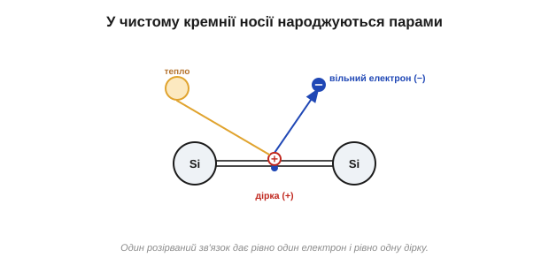
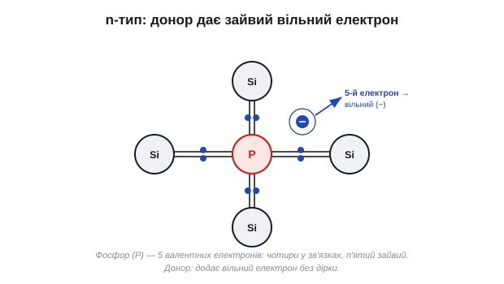
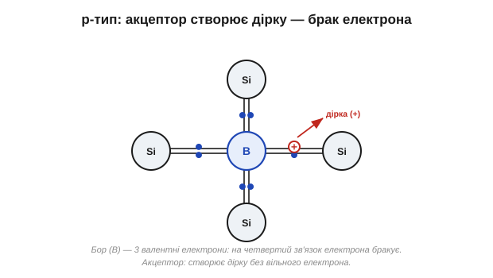
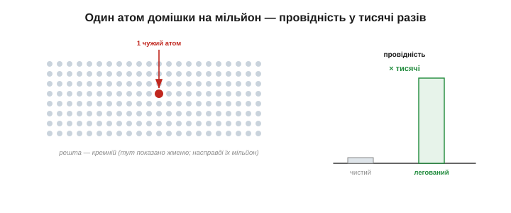

# Легування: n- і p-тип (донори/акцептори)

Провідністю [чистого кремнію](topic:physics/semiconductor) керують тепло і світло — але є ще один важіль, набагато потужніший: **домішки**. Дрібка чужих атомів міняє все, і саме завдяки їй кремній перетворюється з «цікавого каменю» на матеріал, придатний для діодів і транзисторів. Ця ідея — **легування** (*doping*). А щоб її зрозуміти, спершу треба розібратися з другим носієм струму в напівпровіднику — **діркою**: тією самою порожнечею, що лишається від розірваного зв'язку.

### Дірка: носій, якого «немає»

Уявімо розірваний [ковалентний зв'язок](topic:physics/semiconductor) у ґратці кремнію. Електрон вискочив і полетів — а що лишилося на його місці? Порожнє місце у зв'язку. Спокуса сказати «нічого» — і помилитися. Бо сусідній зв'язаний електрон може **перестрибнути** в цю порожнечу й заповнити її — але тоді порожнеча з'явиться вже там, звідки він прийшов. Перестрибне наступний — і порожнеча знову переїде. Виходить, що **порожнеча мандрує кристалом**, хоча жоден окремий електрон далеко не йде.

А оскільки порожнеча — це брак однієї негативної частинки, поводиться вона як рухливий **позитивний** заряд. Їй дали власне ім'я — **дірка** (*hole*). Це другий повноправний носій струму поряд із вільним електроном.


*«Парковка» з електронів. Усі місця зайняті, крім одного (дірка). Коли електрон перестрибує праворуч у вільне місце, сама порожнеча зсувається ліворуч. Електрони рухаються в один бік — дірка ніби пливе в протилежний, як рухливий позитивний заряд.*

Класична аналогія — заповнена парковка з одним порожнім місцем. Машини (електрони) по черзі зсуваються в порожнечу — і та «їде» в протилежний бік, хоч жодна машина не проїхала через увесь паркінг. Дірка — це і є та порожнеча: зручний спосіб говорити про рух багатьох електронів як про рух однієї «частинки» з плюсом.

Як саме дірка переносить струм? Прикладімо поле. Зв'язані електрони перестрибують у бік «плюса», заповнюючи дірки, — а отже, самі дірки дрейфують у бік «мінуса», поводячись як справжні позитивні заряди. Тому в напівпровіднику струм складається з **двох** потоків: вільні електрони пливуть в один бік, дірки — у протилежний. І, що цікаво, обидва потоки **додають** струм в одному й тому самому напрямку — бо протилежні заряди, рухаючись у протилежні боки, дають однаково спрямований струм. Звичка тримати в голові обидва носії — електрони й дірки — і є ключем до роботи [діода](topic:physics/pn-junction) та транзистора.

Отже, у напівпровіднику **два** типи носіїв: вільні **електрони** (заряд −) і **дірки** (заряд +). У чистому кремнії вони народжуються строго **парами**: один розірваний зв'язок дає рівно один вільний електрон і рівно одну дірку.


*У чистому кремнії носії з'являються парами: тепло розриває зв'язок — і водночас народжуються вільний електрон (−) і дірка (+). Тому в чистому матеріалі електронів і дірок порівну.*

### Замало носіїв — додаймо домішки навмисне

У [чистому кремнії](topic:physics/semiconductor) пар обмаль — один вільний носій на десятки трильйонів атомів, — і електронів та дірок порівну, тож матеріал кепський і «безхарактерний». Щоб зробити з нього прилад, треба керувати **двома** речами: **скільки** носіїв і **якого знаку** вони переважно. Саме це й робить легування — заміна крихітної частки атомів кремнію на атоми з **іншим** числом валентних електронів. Дивовижно, як мало їх треба; та спершу подивімося, що саме вони роблять.

Сама ідея гідна подиву: щоб змінити електричний характер речовини, у неї не вливають струм і не прикладають напругу — у неї лише **підселяють** кілька чужих атомів, і кристал назавжди стає «електронним» або «дірковим». Саме цей здогад — що домішки не ворог, а інструмент — Рассел Ол і перетворив на ключ до всієї подальшої електроніки. Подивімося, як працюють два сорти таких «підселенців».

### n-тип: зайвий електрон (донор)

Підмішаймо в кремній атом із **п'ятьма** валентними електронами — наприклад, **фосфор** (*phosphorus*, P) чи **миш'як** (*arsenic*, As) (V група). Чотири його електрони акуратно вбудуються в зв'язки з чотирма сусідами-кремнієм, як і годиться в ґратці. А **п'ятий** — зайвий: йому немає пари, немає зв'язку, де сісти. Він тримається кволо й за кімнатної температури легко відривається, стаючи **вільним електроном** — причому **без** парної дірки.

Атом, що «подарував» кристалові вільний електрон, називають **донором** (*donor*), а кремній із такими домішками — **n-тип** (n — від *negative*, бо переважають негативні носії, електрони).


*Атом фосфору (5 валентних електронів) серед кремнію: чотири електрони йдуть у зв'язки, п'ятий лишається зайвим і легко стає вільним носієм (−). Дірки при цьому не виникає. Так роблять n-тип — кремній із надлишком вільних електронів.*

Важлива тонкість: чи не з'являється тут зайвий заряд? Ні. Віддавши електрон, атом донора сам стає **нерухомим позитивним іоном**, замкненим у ґратці. Його «плюс» точно врівноважує «мінус» відірваного електрона, тож кристал **загалом лишається нейтральним** — просто тепер у ньому є вільні електрони, готові переносити струм. Запам'ятаймо це: легування додає рухливі носії, але **не** додає сумарного заряду.

Чому ж n-тип проводить набагато краще за чистий кремній? Бо звільнити «зайвий» п'ятий електрон донора куди легше, ніж розірвати міцний зв'язок Si–Si: йому й так немає де сісти. Тому вже за кімнатної температури майже **кожен** донор віддає свій електрон — і вільних носіїв стає рівно стільки, скільки ми поклали донорів. Це вже не теплова випадковість, як у чистому кремнії, а кероване, передбачуване число: скільки домішки додав — стільки приблизно й носіїв дістав. Ось чому концентрацією домішки задають провідність наперед.

### p-тип: бракує електрона (акцептор)

Тепер навпаки — підмішаймо атом із **трьома** валентними електронами, наприклад **бор** (*boron*, B) (III група). Він може утворити лише три зв'язки з сусідами; на четвертий зв'язок електрона **не вистачає** — там одразу сидить **дірка**. Сусідній зв'язаний електрон легко перестрибує туди, добудовуючи зв'язок (атом ніби «приймає» електрон), — а дірка переїздить далі й мандрує кристалом.

Атом, що «приймає» електрон, називають **акцептором** (*acceptor*), а такий кремній — **p-тип** (p — від *positive*, бо переважають позитивні носії, дірки).


*Атом бору (3 валентні електрони) серед кремнію: на четвертий зв'язок електрона бракує — лишається дірка (+), яка може мандрувати. Вільного електрона при цьому не додається. Так роблять p-тип — кремній із надлишком дірок.*

І знову нейтральність: прийнявши електрон, акцептор стає **нерухомим негативним іоном**; його «мінус» урівноважує «плюс» дірки. Матеріал нейтральний — просто з рухливими дірками напоготові.

Дзеркально до донора: «недобудований» четвертий зв'язок бору так і проситься, щоб сусідній електрон його заповнив, тож майже кожен атом бору вже за кімнатної температури породжує одну рухливу дірку. Скільки акцепторів поклали — стільки приблизно дірок і дістали, і струм у p-типі несуть переважно вони. Зверніть увагу на симетрію двох випадків: донор дає електрон без дірки, акцептор дає дірку без електрона — кожен додає носій лише **одного** знаку, на відміну від теплової пари в чистому кремнії.

### Більшість, меншість — і обидва нейтральні

Звівши все докупи, отримуємо чіткий поділ:

```
n-тип:  основні носії — електрони (−),  неосновні — дірки (+)
p-тип:  основні носії — дірки (+),       неосновні — електрони (−)
```

Слово **основні** (*majority*) — про тих, кого легування дало вдосталь; **неосновні** (*minority*) — про нечисленних носіїв протилежного знаку, що все одно з'являються від [теплових пар](topic:physics/semiconductor). У n-типі дірок мало, у p-типі мало електронів — але вони є, і саме вони згодом виявляються несподівано важливими.

Наскільки нерівний цей поділ? Дуже. У типово легованому кремнії основних носіїв буває в **мільярди** разів більше за неосновних. Саме ця кричуща перевага одного знаку й надає матеріалові «електронного» (n) чи «діркового» (p) характеру. Та крихітна меншість нікуди не зникає — і, хоч як це дивно, саме неосновні носії визначають, як поводиться [діод під зворотною напругою](topic:electronics/diode-iv-curve). Тож не варто списувати їх з рахунку завчасно: у напівпровідниках навіть «меншість» уміє зіграти ключову роль.


*Ліворуч n-тип: багато вільних електронів (−), нерухомі іони-донори (+) у ґратці, дірок — одиниці. Праворуч p-тип: багато дірок (+), нерухомі іони-акцептори (−), електронів — одиниці. Рухливі носії врівноважені нерухомими іонами, тож кожен шматок **нейтральний** як ціле.*

Зверніть увагу на головне непорозуміння, якого варто уникати: «n» і «p» кажуть про знак **основних носіїв**, а не про заряд матеріалу. І n-, і p-кремній **електрично нейтральні** — у руках ви тримаєте звичайний нейтральний кристал. Просто в одному напоготові негативні носії, у другому — позитивні. Ця нейтральність кожного боку окремо — наріжний камінь для розуміння [PN-переходу](topic:physics/pn-junction).

Образно: n-кремній — це нейтральний натовп, у якому багато людей готові побігти ліворуч (електрони), а p-кремній — натовп, де багато готових побігти праворуч (дірки). Але загалом обидва натовпи стоять на місці й нікуди не зміщені — рівно доти, доки ми не зведемо їх докупи.

> 🔧 **Навіщо це.** Легування дає інженерові подвійний важіль: задати **скільки** носіїв (концентрацією домішки — від цього залежить провідність) і **якого знаку** вони переважно (вибором донора чи акцептора). Це і є та «настройка» матеріалу, якої не має ні мідь, ні скло. Створивши на одному кристалі сусідні n- і p-ділянки потрібної форми, ми дістаємо діоди, транзистори, а зрештою — цілі мікросхеми. Уся напівпровідникова техніка — це, по суті, мистецтво вчасно покласти потрібну домішку в потрібне місце.

І ще одна важлива різниця. [Тепло й світло](topic:physics/semiconductor) крутять провідність **тимчасово**: прибрав вплив — і кремній повернувся до вихідного стану. Легування ж — **назавжди**: домішкові атоми вбудовані в ґратку, тож n- чи p-характер задано раз і назавжди, ще на заводі. Саме ця сталість і дозволяє будувати надійні, повторювані прилади — а не примхливі «котячі вуса» ранніх детекторів, де чутливу точку щоразу шукали навпомацки.

### Як мало домішки треба

Наскільки дрібна та «дрібка»? Часто досить **одного атома домішки на мільйон** (а то й на сто мільйонів) атомів кремнію, щоб провідність зросла в тисячі разів. Звідси й одержимість **чистотою**, до якої свого часу дійшов і Рассел Ол: якщо хочеш керувати домішкою на рівні «один на мільйон», то фоновий бруд має бути ще менший — інакше випадкові домішки заглушать навмисні. Спершу кремній очищають майже до ідеалу, а вже потім додають рівно стільки потрібного, скільки треба.

Щоб відчути цю дрібку: один атом на мільйон — це наче одна-єдина особлива піщинка на повне відро піску або один підмінений гравець серед повного стадіону глядачів. І попри таку мізерність, ця «піщинка» змінює провідність кристала в тисячі разів. Ось чому напівпровідникове виробництво — це передусім боротьба за чистоту вихідного матеріалу й за точність дозування домішки.


*Лише один чужий атом на мільйон атомів кремнію — і провідність підскакує в тисячі разів. Тому спершу домагаються майже ідеальної чистоти, а тоді дозовано вводять домішку (нагріванням — дифузією, або «встрілюванням» іонів).*

Технічно домішки вводять або **дифузією** (розігрітий кремній «всотує» їх із пари), або **іонною імплантацією** («встрілюванням» іонів). А головне — це можна робити **візерунком**: тут n, поряд p, у точно заданих місцях однієї пластини. Саме так на одному кристалі вибудовують мільярди приладів.

### Сам по собі — лише півсправи

Отже, маємо два різновиди кремнію: **n-тип** із надлишком вільних електронів і **p-тип** із надлишком дірок — кожен сам по собі нейтральний і доволі нудний. Уся магія починається, коли їх **з'єднати** в одному кристалі: n з одного боку, p — з іншого. Тоді головне відбувається не в товщі кремнію, а на **межі** між двома його сортами — бо саме там, а не всередині однорідного шматка, і живе клапан. На цій межі — у [PN-переході](topic:physics/pn-junction) — і станеться дещо несподіване, що є серцем діода.

---
