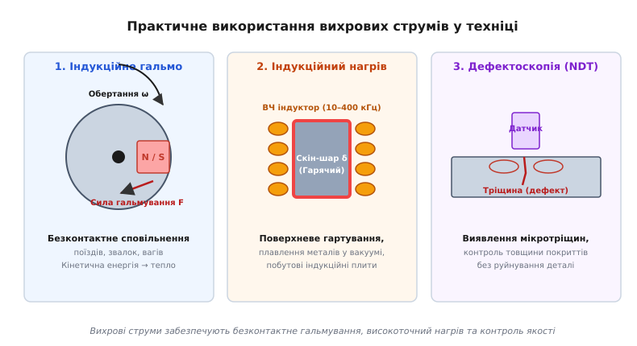
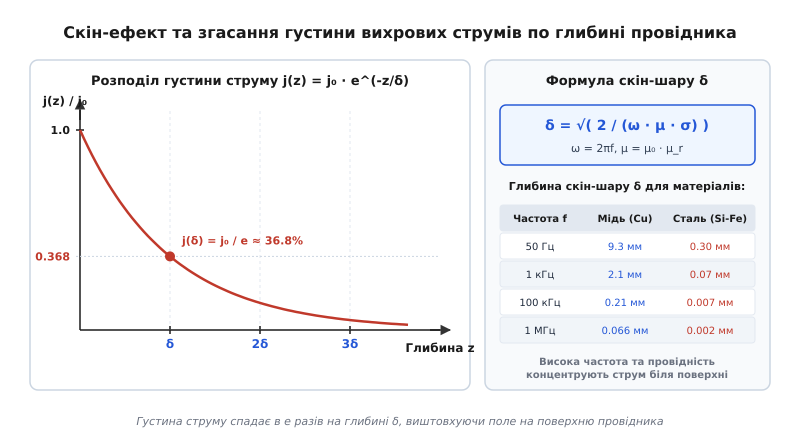
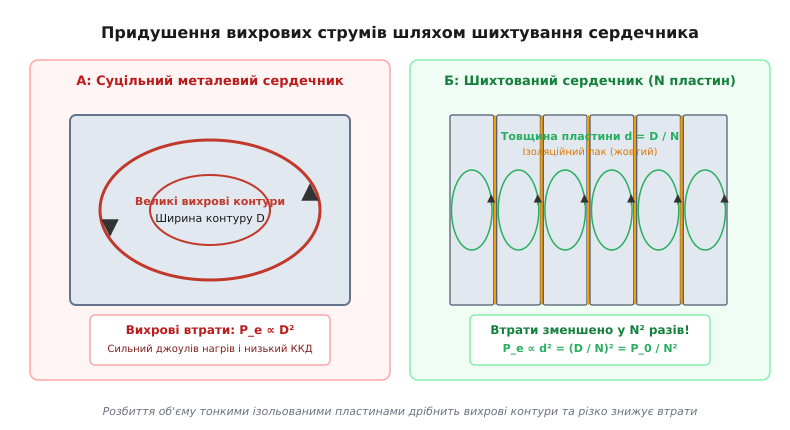

# Вихрові струми

<preknowlist>
- [Закон електромагнітної індукції Фарадея](book:physics/electromagnetism/faraday-law) — виникнення ЕРС індукції при зміні магнітного потоку через контур.
- [Закон Ома у диференціальній формі](book:physics/electromagnetism/ohm-law-differential) — зв'язок між густиною струму та напруженістю електричного поля у провіднику.
- [Рівняння Максвелла](book:physics/electromagnetism/maxwell-equations) — фундаментальні закони класичної електродинаміки суцільних середовищ.
</preknowlist>

Якщо товсту пластину з чистої червоної міді відпустити у вузький зазор між полюсами потужного неодимового магніту, вона не падає вільно під дією сили тяжіння, а різко уповільнюється прямо у повітрі. Метал плавно осідає донизу, ніби занурений у густий в'язкий сироп, не торкаючись при цьому стінок магніту. І навпаки, якщо суцільний чавунний сердечник помістити у котушку змінного струму частотою 50 Гц, вже через кілька хвилин металевий блок нагрівається до сотень градусів за Цельсієм, марнуючи кіловати електроенергії на некорисне виділення тепла та руйнуючи ізоляцію обмоток.

Обидва явища виникають через один і той самий фізичний механізм — макроскопічні замкнені контури електричного струму, що індукуються безпосередньо у товщі масивного провідника при зміні магнітного поля. Ці струми називають **вихровими струмами** або **струмами Фуко** (фр. *courants de Foucault*). У силових трансформаторах, генераторах та електродвигунах вони є головним джерелом енергетичних втрат і паразитного нагріву, тоді як у безконтактних гальмах, індукційних печах та вихрострумових дефектоскопах — виступають основою високоефективних технологічних процесів.

---

### 1. Фізична природа струмів Фуко та закон індукції Фарадея

Виникнення вихрових струмів описується другим рівнянням Максвелла — диференціальною формою закону електромагнітної індукції Майкла Фарадея. Якщо у декількох точках простору змінюється магнітне поле `B(t)` (часова похідна `∂B / ∂t ≠ 0`), у цій області неодмінно виникає соленоїдальне (непотенціальне) вихрове електричне поле `E`:

```
∇ × E = - ∂B / ∂t
```

На відміну від електростатичного поля, створюваного нерухомими зарядами, силові лінії вихрового електричного поля не мають ні початку, ні кінця — вони завжди замкнені самі на себе у вигляді кільцевих контурів, охоплюючи лінії зміни магнітного потоку.

Якщо у це вихрове електричне поле потрапляє суцільне провідне тіло (метал, електроліт або плазма), вільні носії заряду під дією електричного поля починають упорядкований рух. Згідно із законом Ома у диференціальній формі, у кожному елементі об'єму провідника з питомою провідністю `σ` виникає густина струму `j`:

```
j = σ · E
```

Оскільки вихрове електричне поле замкнене, індуковані струми також утворюють замкнені вихрові лінії всередині об'єму провідника. У масивному тривимірному тілі ці контури набувають складної об'ємної конфігурації, що нагадує вихори у рухомій рідині, через що вони й отримали назву *вихрових струмів*.


*Фізичний механізм виникнення вихрових струмів Фуко у суцільному провіднику під дією змінного магнітного поля*

Згідно з правилом Ленца, будь-який індукований струм спрямований так, щоб своїм власним магнітним полем `B_ind` протидіяти зміні первинного магнітного потоку `dB / dt`, що його викликала:
- Якщо зовнішнє магнітне поле зростає (`dB / dt > 0`), вихрові струми замикаються у напрямку, при якому їхнє реакційне поле `B_ind` спрямоване назустріч зовнішньому полю, екрануючи внутрішній об'єм провідника.
- Якщо зовнішнє поле спадає (`dB / dt < 0`), вихрові струми змінюють напрямок на протилежний, підтримуючи згасаючий магнітний потік.

Взаємодія вихрових струмів із зовнішнім магнітним полем створює об'ємну механічну силу Лоренца `F = ∫ (j × B) dV`. У випадку руху провідника у неоднорідному магнітному полі ця сила завжди спрямована проти вектора швидкості `v`, створюючи ефект електродинамічного гальмування.

Фізична природа сили Ампера — Лоренца при гальмуванні полягає у тому, що при входженні провідника у область поля передня кромка металу відчуває зростання потоку (`dB / dt > 0`), викликаючи струми Ленца, що відштовхують деталь від магніту. Натомість задня кромка металу залишає поле (`dB / dt < 0`), унаслідок чого індукуються струми притягання. В результаті обидва края деталі відчувають гальмівний момент, спрямований строго проти руху.

Вихрові струми виникають не лише під дією зовнішнього поля, але й у самому провіднику, через який протікає змінний струм. У цьому випадку власне змінне магнітне поле струму індукує внутрішні вихрові контури, які виштовхують основний струм до зовнішньої поверхні провідника. Це явище носить назву **внутрішнього скін-ефекту** або поверхневого ефекту.

Детальніше про історію відкриття цього явища — від загадкового «магнетизму обертання» Домініка Араго у 1824 році до лабораторних дослідів Леона Фуко зі спалюванням припаю на мідному диску у 1855 році — читайте у вставці [Історія відкриття вихрових струмів та дослідів Фуко](book:physics/condensed-matter-physics/eddy-currents/hist-foucault-eddy-currents.md).

---

### 2. Електромагнітна дифузія, скін-ефект та глибина проникнення (δ)

Процес проникнення змінного електромагнітного поля у провідник описується диференціальним рівнянням дифузійного типу. Комбінуючи закон Фарадея `∇ × E = -∂B / ∂t`, закон Ампера `∇ × H = j` (нехтуючи струмом зсуву у металах) та матеріальні співвідношення `j = σ · E` і `B = μ · H`, отримуємо векторне **рівняння дифузії магнітного поля**:

```
∇²B = μ · σ · (∂B / ∂t)
```

де `μ = μ₀ · μ_r` — абсолютна магнітна проникність матеріалу, а `σ` — його питома електрична провідність.

Коефіцієнт `D_m = 1 / (μ · σ)` відіграє роль магнітної дифузійності (з вимірністю м²/с). Це рівняння показує, що змінне магнітне поле не поширюється у металі миттєво, а «дифундує» у товщу провідника, поступово згасаючи через реакційне екранування вихровими струмами.

Розглянемо випадок плоскої гармонічної хвилі частотою `f` (кругова частота `ω = 2πf`), яка падає на плоску поверхню провідника (`x = 0`). Розв'язок одновимірного рівняння дифузії дає експоненційний закон спаду амплітуди магнітного поля та густини вихрових струмів углиб металу:

```
B(x, t) = B_0 · e^(- x / δ) · cos(ωt - x / δ)
j(x, t) = j_0 · e^(- x / δ) · cos(ωt - x / δ + π/4)
```

де величина `δ` називається **глибиною скін-шару** (*skin depth*) або глибиною проникнення:

```
δ = √( 2 / (ω · μ · σ) ) = √( 1 / (π · f · μ · σ) )
```


*Скін-ефект та згасання густини вихрових струмів по глибині провідника*

Фізичний зміст глибини скін-шару `δ`:
1. На глибині `x = δ` амплітуда густини вихрового струму спадає в `e ≈ 2.718` разів (до 36.8% від поверхневого значення `j_0`), а питома потужність нагріву `p = j² / σ` спадає в `e² ≈ 7.39` разів (до 13.5%).
2. Магнітне поле виштовхується вихровими струмами на поверхню провідника. Майже 86% усього індукованого струму та понад 98% теплових втрат концентруються у тонкому приповерхневому шарі товщиною `3δ`.
3. Глибина проникнення обернено пропорційна квадратному кореню з частоти `√f`, провідності `√σ` та магнітної проникності `√μ`.

Фізична інтуїція скін-ефекту пояснюється внутрішньою самоіндукцією: вихрові струми у центрі провідника створюють власне реакційне магнітне поле, яке на осі провідника спрямоване строго проти первинного змінного поля, ослаблюючи його майже до нуля. Натомість біля зовнішньої поверхні реакційне поле додається до зовнішнього, змушуючи увесь електричний струм протікати тонкою зовнішньою «шкірою» (*skin*).

Порівняння глибини скін-шару для різних матеріалів виявляє вражаючу розбіжність:
- У міді (`σ = 5.8·10⁷ См/м`, `μ_r = 1`) при промисловій частоті 50 Гц глибина скін-шару становить `δ ≈ 9.35 мм`. Проте на радіочастоті 1 МГц вона звужується до `δ ≈ 0.066 мм` (66 мкм).
- У алюмінії (`σ = 3.55·10⁷ См/м`, `μ_r = 1`) при 50 Гц скін-шар дорівнює `δ ≈ 11.9 мм`, що робить алюмінієві шини чудовими провідниками для низькочастотних розподільчих пристроїв.
- У електротехнічній сталі з високою магнітною проникністю (`μ_r = 3000`) навіть при частоті 50 Гц скін-шар становить лише `δ ≈ 0.30 мм`, а на частоті 100 кГц — скочується до мікроскопічних `δ ≈ 0.007 мм` (7 мкм).

Для оцінки поглинання електромагнітної хвилі провідним півпростором вводять **поверхневий імпеданс** `Z_s = R_s + i · X_s`, де активний опір `R_s = 1 / (σ · δ)` строго дорівнює реактивному індуктивному опору `X_s = 1 / (σ · δ)`. Це означає, що скін-шар провідника не лише дисипує енергію у тепло, але й створює власну фазову індуктивну затримку струму відносно напруги на кут `π/4` (45°).

Детальний математичний вивід рівняння дифузії, комплексного хвильового вектора, поверхневого імпедансу `Z_s = (1+i)/(σδ)` та експоненційного розв'язку див. у вставці [Математичний вивід рівняння дифузії, скін-шару та втрат на вихрові струми](book:physics/condensed-matter-physics/eddy-currents/math-skin-effect-derivation.md).

---

### 3. Джоулів нагрів та питомі втрати потужності (P_e)

Протікання вихрових струмів у металі супроводжується безповоротним перетворенням електромагнітної енергії на внутрішню теплову енергію кристалічної ґратки. Миттєва локальна потужність джоулевих втрат на одиницю об'єму виражається законом Джоуля — Ленца:

```
p_e(x, t) = j(x, t)² / σ = σ · E(x, t)²  [Вт/м³]
```

Щоб обчислити сумарні втрати у металевій пластині товщиною `d`, довжиною `L` та висотою `h`, проінтегруємо джоулеве тепло за об'ємом та усереднимо за період гармонічного коливання `T = 1 / f`.

У випадку, коли товщина пластини мала порівняно з глибиною скін-шару (`d << δ`), змінне магнітне поле `B(t) = B_0 · sin(ωt)` проникає у товщу пластини майже без згасання. Індукована ЕРС у вихровому контурі шириною `2x` дорівнює `e(x, t) = - (2x · h) · (dB / dt)`.

Точне інтегрування елементарних контурів від `x = 0` до `x = d/2` дає фундаментальну формулу для **усередненої питомої об'ємної потужності втрат на вихрові струми** `P_e` (Вт/м³):

```
P_e = (π² / 6) · σ · d² · f² · B_0²
```

Якщо виразити провідність через питомий електричний опір матеріалу `ρ = 1 / σ` та перерахувати втрати на одиницю маси `p_e` (Вт/кг, де `ρ_m` — густина речовини):

```
P_e = (π² / (6 · ρ)) · d² · f² · B_0²  [Вт/м³]
p_e = (π² / (6 · ρ · ρ_m)) · d² · f² · B_0²  [Вт/кг]
```

Аналіз отриманого співвідношення показує чотири фундаментальні залежності:
1. **Квадратична залежність від товщини (`P_e ∝ d²`):** Товщина провідника чинить найсильніший вплив на вихрові втрати. Зменшення товщини пластини вдвічі знижує джоулеві втрати у чотири рази.
2. **Квадратична залежність від частоти (`P_e ∝ f²`):** На відміну від втрат на гістерезис `P_h`, які зростають лінійно з частотою (`P_h ∝ f`), втрати на вихрові струми при підвищенні частоти зростають квадратично.
3. **Квадратична залежність від амплітуди індукції (`P_e ∝ B_0²`):** Збільшення робочої індукції у сердечнику трансформатора вимагає квадратичного зростання виділення тепла.
4. **Обернена залежність від питомого опору (`P_e ∝ 1 / ρ`):** Чим вищий електричний опір матеріалу, тим менші вихрові струми у ньому виникають при однаковій індукції.

Якщо товщина пластини порівнянна або перевищує скін-шар (`d ≥ 2δ`), розраховані за класичною формулою втрати некоректно завищуються. У цьому випадку застосовують коефіцієнт Давелла `F_R(d/δ)`, який враховує спад поля у центрі пластини та насичення втрат.

Повні втрати у ферромагнітному сердечнику складаються з трьох компонентів за моделлю Бертотті (*Bertotti loss separation model*):
```
P_total = P_h + P_e + P_exc
```
де:
- `P_h = K_h · f · B_0^n` — втрати на циклічне перемагнічування та подолання сил затримування доменних стінок (гістерезис);
- `P_e = (π² / 6) · σ · d² · f² · B_0²` — класичні об'ємні вихрові втрати у припущенні суцільного однорідного середовища;
- `P_exc = K_exc · f^1.5 · B_0^1.5` — додаткові (аномальні) вихрові втрати, викликані мікроскопічною локалізацією вихрових струмів навколо рухомих 180-градусних доменних межах.

Довідникові значення коефіцієнтів Штейнмеца, параметри втрат для різних марок електротехнічних сталей і ферітів та покрокову методику розрахунку трансформаторних сердечників зібрано у вставці [Довідник параметрів, коефіцієнтів та розрахунку втрат у сердечниках](book:physics/condensed-matter-physics/eddy-currents/api-eddy-current-params.md).

---

### 4. Інженерні методи придушення втрат: шихтування та ферити

Оскільки втрати на вихрові струми у масивних сердечниках досягають десятки і сотні кіловат, конструктори силового електрообладнання використовують два головні фізичні шляхи їх придушення: **геометричне подрібнення контурів** та **матеріалознавче підвищення електричного опору**.

#### Принцип шихтування (Lamination)
Найпоширенішим інженерним рішенням для низьких та середніх частот (50 Гц — 400 Гц) є розбиття суцільного металевого сердечника на масив ізольованих токоннепроникних пластин.

Якщо суцільний сердечник товщиною `D` розділити на `N` тонких пластин товщиною `d = D / N`, кожна з яких ізольована шаром лаку або оксиду, то вихрові струми замикаються окремо всередині кожної малої пластини.


*Придушення вихрових струмів шляхом шихтування сердечника*

Оскільки товщина зменшилася в `N` разів, втрати у кожній окремій пластині спадають як `(d)² = (D / N)² = P_0 / N²`. Сумарні втрати в усіх `N` пластинах дорівнюють:

```
P_laminated = N · (P_0 / N²) = P_0 / N
```

Таким чином, шихтування сердечника з `N` пластин зменшує загальні вихрові втрати у **`N` разів** порівняно із суцільним блоком аналогічного перерізу, а при фиксованій товщині пластини `d` втрати спадають пропорційно `d²`.

Для ізоляції пластин застосовують неорганічні фосфатні покриття (клас Carlite), які витримують високотемпературний відпал при 800 °C, або жаростійкі органічні епоксидні лаки.

#### Легування кремнієм (Кремниста сталь)
Для підвищення питомого опору `ρ` до чистого заліза додають від 3% до 4.5% кремнію (`Si`). Це збільшує електричний опір матеріалу майже в 5 разів (від `0.10` до `0.50 мкОм·м`), що додатково зменшує струми Фуко в стільки ж разів.

Завдяки текстуруванню за методом Ґосса (прокатка із формуванням кристалографічної орієнтації `[100]`) створюється текстурована електротехнічна сталь (GO steel), яка поєднує високий опір із рекордною магнітною проникністю (`μ_r > 10000`) вздовж напрямку прокатки.

#### Високочастотні матеріали: Феріти та аморфні стрічки
У силовій електроніці (імпульсні джерела живлення, інвертори сонячних батарей, зарядні станції електромобілів) робочі частоти становлять від 20 кГц до кількох мегагерц. На таких частотах шихтовані сталеві сердечники непридатні.

Інженерні рішення для високочастотного діапазону:
1. **М'якомагнітні ферити (MnZn та NiZn):** Спічені керамічні матеріали на основі оксидів заліза. Є магнітними напівпровідниками або діелектриками з питомим опором `ρ ≈ 1 - 10⁶ Ом·м` (у мільйони разів вищим за сталь). Вихрові струми у них фактично відсутні на частотах до 100 МГц.
2. **Аморфні та нанокристалічні стрічки (Metglas, Finemet):** Отримуються шляхом гартування розплаву металу на барабані зі швидкістю мільйон градусів на секунду. Товщина стрічки становить лише 15–25 мікронів, що у поєднанні з аморфною структурою повністю придушує струми Фуко на частотах до 100 кГц при індукції насичення `B_sat ≈ 1.2–1.5 Тл`.
3. **Порошкові магнітодіелектрики (Sendust, MPP):** Пресовані з дрібнодисперсного металевого порошку (зerno 10–50 мкм) у сполучній полімерній чи керамічній матриці, де кожна гранула ізольована від сусідніх.

Детальний опис геометрій сердечників (Ш-подібні, C-подібні, тороїдальні), стандартів товщини листування та порівняльні таблиці матеріалів див. у вставці [Шихтовані сердечники, шихтування та феритові матеріали](book:physics/condensed-matter-physics/eddy-currents/comp-laminated-cores-ferrites.md).

---

### 5. Практичні застосування вихрових струмів та індукційний контроль

Незважаючи на те, що у трансформаторах та електродвигунах вихрові струми є шкідливим фактором, у багатьох галузях техніки вони виступають головним робочим механізмом.


*Практичне використання вихрових струмів у техніці*

#### 1. Електродинамічне (індукційне) гальмування
Взаємодія вихрових струмів із зовнішнім магнітним полем створює силу гальмування, пропорційну швидкості руху провідника `F_drag ∝ v`.
- **Швидкісні поїзди та важкий транспорт:** Індукційні рейкові та дискові гальма (застосовуються у поїздах TGV, ICE, маглевах). Гальмування відбувається повністю безконтактно, без механічного зносу колодок чи дисків. Кінетична енергія поїзда перетворюється на теплову енергію рейок або гальмівних дисків.
- **Характеристика швидкості:** Залежність сили гальмування `F_drag(v)` від швидкості має характерний максимум: при низьких швидкостях сила зростає лінійно `F ∝ v`, сягає піку при `v_critical = 2 / (μ · σ · d)`, після чого спадає як `1 / √v` через повне екранування поля скін-ефектом.
- **Лабораторні ваги та аналогові вимірювальні прилади:** Для гасіння коливань стрілки стрілочного приладу під нею встановлюють алюмінієву або мідну пластинку, що рухається у полі постійного магніту.

#### 2. Індукційний нагрів та поверхневе гартування
Якщо металеву деталь помістити всередину котушки (індуктора), через яку протікає високочастотний струм (10 кГц — 400 кГц), індуковані струми Фуко концентруються у тонкому скін-шарі `δ` на поверхні деталі.
- **Поверхневе гартування сталевих валів та шестерень:** Завдяки скін-ефекту за кілька секунд нагрівається лише тонкий поверхневий шар деталі товщиною 0.5–2 мм. Після гартування у воді поверхня стає надзвичайно твердою та зносостійкою, тоді як в'язке ядро деталі зберігає пластичність.
- **Тигельні індукційні печі:** Дозволяють безконтактно плавити надчисті та тугоплавкі метали (титан, цирконій, платину) у вакуумі або інертній атмосфері без контакту з вугільними електродами чи газами.
- **Побутові індукційні плити:** Використовують ВЧ індуктор (20–50 кГц), який збуджує вихрові струми безпосередньо у ферромагнітному дні посуду, нагріваючи каструлю без розжарювання самої склокерамічної поверхні.

#### 3. Вихрострумова дефектоскопія (NDT)
Вихроструковий неруйнівний контроль (Eddy Current Testing, ECT) є одним із найчутливіших методів виявлення поверхневих та підповерхневих мікротріщин у металевих конструкціях.

Датчик дефектоскопа містить мініатюрну вимірювальну котушку, що збуджує вихрові струми у металевій деталі (наприклад, у крилі літака або стінці газопроводу). Наявність мікротріщини, пори чи корозії огинається вихровими струмами, що змінює опір контуру та спотворює вторинне магнітне поле `B_ind`. Прилад фіксує зміну комплексного імпедансу котушки `Z = R + i·ωL` на фазовій площині (R-X plane analysis), виявляючи дефекти розміром у декілька мікрометрів.

#### 4. Магнітна левітація (EDS)
У поїздах на магнітній подушці з електродинамічною підвіскою (Electrodynamic Suspension, EDS — наприклад, японський SCMaglev) надпровідні магніти поїзда рухаються над алюмінієвим жолобом колії. На швидкостях понад 100 км/год вихрові струми у колії створюють відштовхувальну левітаційну силу, яка піднімає поїзд вагою в десятки тонн на висоту 10 см над рейками.

Чисельну модель симуляції електромагнітної дифузії поля методом скінченних різниць, розрахунок просторового розподілу струмів та обчислювальний код мовами Python і C++ наведено у вставці [Чисельне моделювання вихрових струмів та втрат у провідниках](book:physics/condensed-matter-physics/eddy-currents/proj-eddy-current-sim.md).
