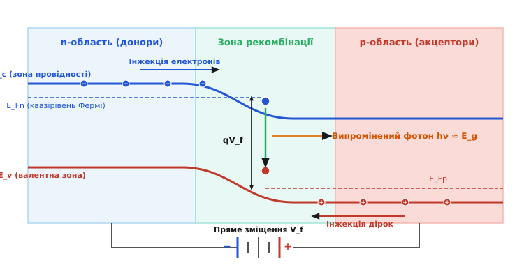
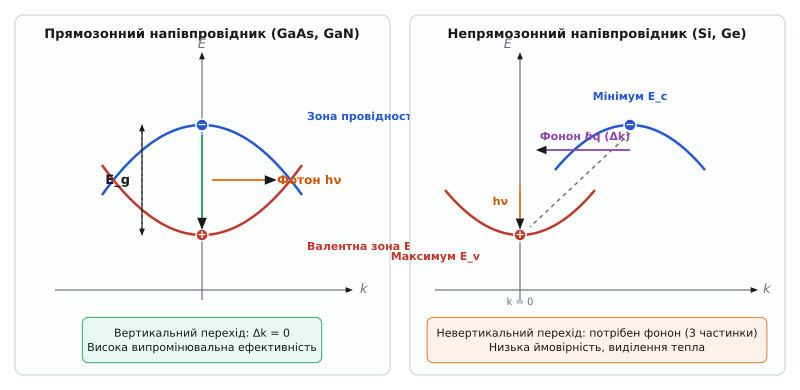

# Електролюмінесценція: випромінювання світла в p-n переході

<preknowlist>
- [PN-перехід](topic:physics/pn-junction) — збіднена область та інжекція носіїв при прямому зміщенні.
- [Напівпровідник](topic:physics/semiconductor) — зонна структура та заборонена зона.
</preknowlist>

Коли крізь звичайну лампу розжарювання тече електричний струм, понад 90% спожитої енергії витрачається на даремне нагрівання вольфрамової нитки. Світло з'являється лише тому, що дуже гаряче тіло починає випромінювати теплові фотони відповідно до закону Планка. **Електролюмінесценція** працює принципово інакше: вона перетворює електричну енергію безпосередньо на світло всередині холодного кристала напівпровідника, повністю минаючи неефективну теплову стадію.

Саме цей квантовий процес забезпечує роботу всіх сучасних світлодіодів (LED) — від крихітних індикаторів на побутовій техніці та надяскравих автомобільних фар до дисплеїв смартфонів, побутового освітлення та високошвидкісних оптичних передавачів у волоконно-оптичних мережах.

### Фізичний механізм перетворення струму на світло

Основні фізичні події відбуваються всередині **p-n переходу** — тонкої межі між двома частинами напівпровідникового кристала з різними типами провідності. У `n`-області існує величезний надлишок вільних електронів, а в `p`-області — надлишок дірок (порожніх квантових місць для електронів у розірваних валентних зв'язках).

У стані рівноваги між цими областями існує вбудоване електричне поле, яке утворює потенціальний бар'єр і заважає носіям змішуватися. Проте коли до `p-n` переходу прикладають **пряму напругу** (плюс джерела живлення підключають до `p`-області, а мінус — до `n`-області), відбуваються три послідовні квантові кроки:

1. **Зниження бар'єра та інжекція.** Зовнішня напруга компенсує вбудоване поле й знижує потенціальний бар'єр. Електрони масово ринуть із `n`-області в `p`-область, а дірки — з `p`-області в `n`-область. Цей потік носіїв через межу називається **інжекцією неосновних носіїв**.
2. **Зустріч у зоні рекомбінації.** В області поблизу межі інжектовані електрони опиняються в середовищі, де повно дірок.
3. **Випромінювальна рекомбінація.** Електрон із вищої енергетичної зони (зони провідності `E_c`) «провалюється» у вакантний стан нижньої валентної зони `E_v`. При цьому електрон і дірка зникають як вільні носії заряду, а вивільнена енергія випромінюється назовні у вигляді єдиного кванта світла — **фотона**.


*При прямому зміщенні p-n переходу електрони та дірки інжектуються в зону рекомбінації. Падіння електрона із зони провідності в дірку валентної зони супроводжується народженням фотона.*

### Колір світла та енергія забороненої зони

Кожен світлодіод випромінює світло чітко визначеного кольору. Енергія народженого фотона `hν` майже точно дорівнює **ширині забороненої зони** напівпровідника `E_g` — енергетичному розриву між зоною провідності та валентною зоною:

```
hν = E_c - E_v = E_g
```

Оскільки довжина хвилі світла `λ` обернено пропорційна енергії фотона, колір випромінювання визначається виключно хімічним складом матеріалу кристала:

```
λ ≈ 1.24 / E_g [еВ]   (у мікронах)
```

Змінюючи напівпровідникову сполуку, інженери отримують будь-який колір спектра:
* **Арсенід галію (GaAs)** з `E_g = 1.42 еВ` дає інфрачервоне випромінювання (`λ ≈ 870 нм`), яке використовується в пультах дистанційного керування.
* **Фосфід-арсенід галію (GaAsP)** дає червоне або оранжеве світло для світлофорів та сигнальних ліхтарів.
* **Нітрид галію-індію (InGaN)** з `E_g ≈ 2.7–3.4 еВ` забезпечує яскраве синє та зелене світло.

Саме винайдення ефективних синіх світлодіодів на основі нітриду галію дозволило створити білі світлодіоди (шляхом нанесення жовтого люмінофора на синій кристалик, який перетворює частину синіх фотонів на жовті). Змішування синього та жовтого світла дає комфортне біле світло для кімнатного освітлення (історію цього відкриття див. у 📜 [Історія відкриття електролюмінесценції](topic:physics/electroluminescence/hist-round-lossev-led.md)).

### Чому кремній не світиться: прямозонні та непрямозонні кристали

Винікає природне запитання: чому світлодіоди виготовляють із порівняно дорогих сполук на зразок `GaAs` чи `GaN`, а не з дешевого кремнію (`Si`), з якого роблять мікросхеми?

Причина полягає у квантово-механічному **законі збереження імпульсу**:

* **Прямозонні напівпровідники (GaAs, GaN):** мінімум зони провідності та максимум валентної зони на енергетичній діаграмі розташовані прямо один під одним у просторі імпульсів (`k = 0`). Електрон переходить у валентну зону напряму (вертикальний перехід), миттєво випромінюючи фотон. Процес займає кільки наносекунд, а ефективність перетворення на світло сягає майже 100%.
* **Непрямозонні напівпровідники (Si, Ge):** мінімум зони провідності зміщений убік. Для рекомбінації електрон мусить одночасно віддати не лише енергію фотону, а й свій імпульс коливанням кристалічної ґратки (**фонону**). Ймовірність такої потрійної зустрічі надзвичайно мала. Електрон чекає випромінювання надто довго і зрештою віддає енергію дефектам кристала у вигляді тепла.


*У прямозонному напівпровіднику перехід відбувається вертикально (збереження імпульсу) з випромінюванням фотона. У непрямозонному (кремній) потрібна участь фонона, тому енергія розсіюється на тепло.*

### Практичне значення та ефективність

Напівпровідникова інжекційна електролюмінесценція є найефективнішим способом генерації штучного світла, створеним наукою. Сучасні світлодіоди перетворюють понад 50–70% електричної енергії на фотони, працюють понад 50 000 годин без заміни та дозволяють економити гігавати електроенергії у масштабах планети.

Особливості режиму живлення світлодіодів обумовлені їхньою експоненціальною вольт-амперною характеристикою. Оскільки після перевищення порогової напруги відкриття `V_{th} ≈ E_g / q` струм зростає катастрофічно швидко, світлодіоди завжди живлять через стабілізатори струму (драйвери).

Отже, електролюмінесценція — це пряме нетеплове перетворення електричного струму на кванти світла під час інжекції носіїв через `p-n` перехід прямозонного напівпровідника, що поєднує високу енергетичну ефективність із тривалим терміном служби.
