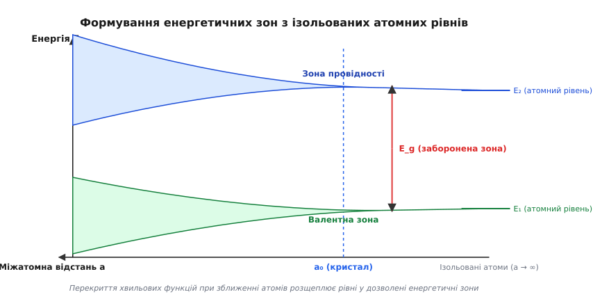
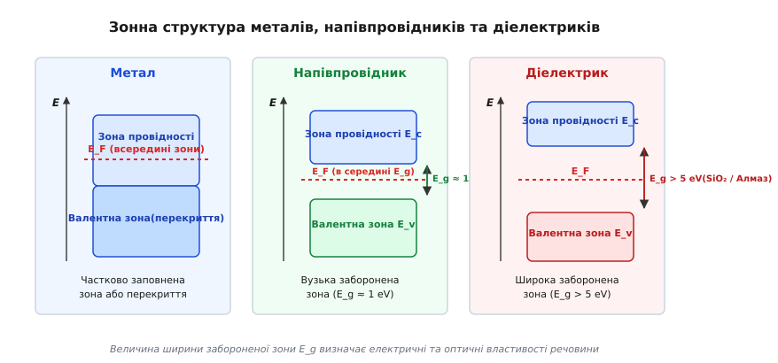
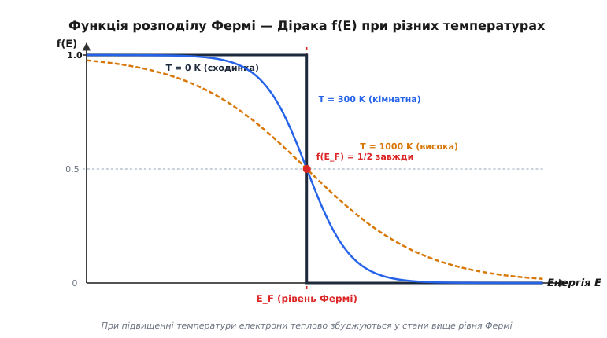
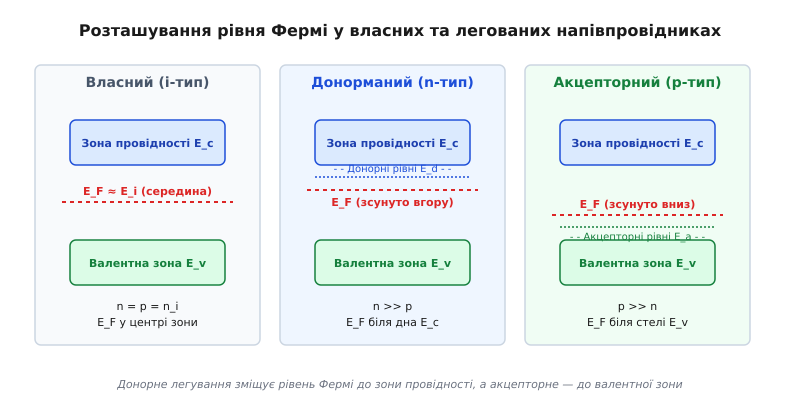

# Зонна структура й рівень Фермі

<preknowlist>
- [Принцип заборони Паулі](book:physics/pauli-exclusion) — два однакові ферміони не можуть займати один і той самий квантовий стан.
- [Одновимірне стаціонарне рівняння Шредінгера](book:physics/stationary-schrodinger-equation) — знаходження власних значень енергії електронних хвиль у потенціалі.
- [Обернена ґратка та зони Бріллюена](book:physics/reciprocal-lattice) — періодичний потенціал кристала визначає дисперсійне співвідношення E(k) у квазіімпульсному просторі.
</preknowlist>

Коли поодинокий атом натрію перебуває в ізольованому вакуумному стані, його валентний 3s-електрон займає строгий дискретний квантовий рівень із фіксованою енергією зв'язку `-5.14 еВ`. Проте якщо зблизити `10²³` таких атомів у твердий кристал із рівноважною міжатомною відстанню `0.37 нм`, дискретний атомний рівень миттєво зникає, розщеплюючись на величезну суцільну смугу з `10²³` близько розташованих квантових станів — енергетичну зону. Саме цей квантовий процес розщеплення атомних рівнів та подальший статистичний розподіл електронів по доступних станах визначає, чому мідний дріт проводить електричний струм у `10²⁰` разів краще за кварцове скло, та чому кремнієвий транзистор здатен керувати струмами під дією зовнішньої напруги.

## 1. Формування енергетичних зон із атомних рівнів

Ув ізольованому атомі хвильові функції електронів локалізовані поблизу власного ядра, а енергетичний спектр задовольняє стаціонарне рівняння Шредінгера з дискретними власними значеннями енергії. Проте при конденсації атомів у кристалічну ґратку міжатомна відстань зменшується до величин порядку декількох ангстремів (`0.1 – 0.5 нм`), що є порівнянним із радіусом зовнішніх електронних орбіт.

На таких малих відстанях потенціальні бар'єри між сусідніми іонними кістяками стають вузькими, а хвильові функції валентних електронів сусідніх атомів починають суттєво перекриватися. Згідно з фундаментальними принципами квантової механіки, якщо `N` однакових квантових систем взаємодіють між собою, кожен вихідний дискретний атомний рівень розщеплюється на `N` квазібезперервних підрівнів. Оскільки кількість атомів у молі речовини дорівнює числу Авогадро `N_A ≈ 6.022 × 10²³`, відстань між сусідніми підрівнями всередині такої енергетичної смуги становить всього `10⁻²² – 10⁻²³ еВ`. Такий спектр сприймається як суцільна **дозволена енергетична зона**.


*Формування енергетичних зон із дискретних атомних рівнів при зближенні атомів на рівноважну відстань a₀*

Внутрішні електронні оболонки атомів (наприклад, 1s- чи 2p-стани в кремнії) міцно зв'язані зі своїми ядрами й практично не перекриваються з сусідніми атомами, залишаючись вузькими нерозщепленими рівнями. Натомість зовнішні валентні оболонки перекриваються найсильніше, утворюючи широкі дозволені зони завтовшки від кількох десятих до кількох електрон-вольт.

У напівпровідниках IV групи перідодичної системи (кремній `Si`, германій `Ge`, алмаз `C`) та сполуках A³B⁵ (арсенід галію `GaAs`) процес формування зон визначається хімічним феноменом `sp³`-гібридизації атомних орбіталей. Уві збудженому стані ізольованого атома кремнію електронні конфігурації `3s² 3p²` гібридизуються у чотири еквівалентні `sp³`-орбіталі, спрямовані під кутами `109.5°` до вершин тетраедра.

При зближенні атомів кремнію в кристалічну ґратку типу алмазу перекриття сусідніх `sp³`-орбіталей утворює симетричні зв'язуючі (`σ`) та антисиметричні розпушуючі (`σ*`) молекулярні орбіталі:
- **Зв'язуючі орбіталі (`σ`)**: характеризуються підвищеною електронною густиною в інтервалі між позитивними ядрами і мають нижчу потенціальну енергію. При конденсації кристала ці стани розщеплюються й утворюють повністю заповнену **валентну зону**.
- **Розпушуючі орбіталі (`σ*`)**: мають вузлову площину між ядрами і вищу енергію. При зближенні атомів вони утворюють порожню **зону провідності**.

Інтервал між енергією зв'язуючих та розпушуючих станів при рівноважній міжатомній відстані `a_0` визначає ширину забороненої зони `E_g`. Оскільки зв'язок `C-C` в алмазі є набагато міцнішим, ніж `Si-Si` чи `Ge-Ge`, міжатомна відстань в алмазі є меншою, а перекриття орбіталей — сильнішим, що дає величезну ширину забороненої зони `E_g ≈ 5.5 еВ` порівняно з `1.12 еВ` у кремнію та `0.66 еВ` у германію.

📜 Детальніше про те, як історична суперечність між класичною теорією Друде та виміряною теплоємністю металів привела до створення квантової статистики та зонного уявлення Вільсона, описано в [історичному екскурсі](book:physics/energy-bands/hist-fermi-dirac.md).

## 2. Періодичний потенціал, теорема Блоха та виникнення заборонених зон

Електрон у кристалі рухається не у вільному просторі, а в періодичному електростатичному полі іонного остова ґратки. Якщо `R` — довільний вектор трансляції кристала, потенціальна енергія електрона задовольняє умову періодичності:

```
V(r + R) = V(r)
```

Згідно з теоремою Блоха, стаціонарні розв'язки рівняння Шредінгера для електрона в такому періодичному потенціалі мають вигляд модульованих плоских хвиль:

```
ψ_{n, k}(r) = u_{n, k}(r) · exp(i · k · r)
```

де `u_{n, k}(r)` — функція з періодичністю кристалічної ґратки `u_{n, k}(r + R) = u_{n, k}(r)`, а `k` — хвильовий вектор (квазіімпульс) електрона, визначений у межах першої зони Бріллюена.

Фізичну природу виникнення заборонених зон наочно ілюструє одновимірна модель Кроніга — Пенні, у якій періодичний потенціал кристала моделюється послідовністю прямокутних потенціальних бар'єрів шириною `b` та висотою `V_0` із періодом `a + b`. Аналітичний розв'язок рівняння Шредінгера з межовими умовами неперервності хвильової функції та її похідної приводить до трансцендентного дисперсійного рівняння:

```
cos(k · a) = cos(α · a) + P · (sin(α · a) / (α · a))
```

де `α = √(2·m·E) / ℏ`, а `P` — безрозмірний параметр потужності потенціального бар'єра.

Оскільки ліва частина рівняння `cos(k·a)` може набувати значень лише в межах від `-1` до `+1`, розв'язки для енергії `E` існують тільки в тих інтервалах, де права частина рівняння не перевищує за модулем одиницю. Інтервали енергій, для яких права частина виходить за межі `[-1, +1]`, відповідають уявним значенням хвильового вектора `k`. У цих ділянках квантові стани не можуть існувати у вигляді поширених хвиль — це і є **заборонені енергетичні зони `E_g`**.

На межах першої зони Бріллюена (`k = ± π / a`) падаюча та відбита електронні хвилі утворюють дві стоячі хвилі з різним просторовим розподілом електронної густини:
- Хвиля `ψ_+ ∝ cos(π·x / a)` має максимуми електронної густини безпосередньо на позитивних іонах ґратки, що мінімізує потенціальну енергію (стеля валентної зони `E_v`).
- Хвиля `ψ_- ∝ sin(π·x / a)` має максимуми у проміжках між іонами, що максимізує потенціальну енергію (дно зони провідності `E_c`).
Різниця потенціальних енергій цих двох стоячих хвиль і визначає ширину забороненої зони `E_g = E(ψ_-) - E(ψ_+)`.

Поблизу екстремумів зон дисперсійне співвідношення описується параболічним наближенням:

```
E(k) = E_c + (ℏ² · k²) / (2 · m_n^*)      [поблизу дна зони провідності]
```

де `m_n^*` — **тензор ефективної маси електрона**, який враховує внутрішню взаємодію електрона з періодичним полем ґратки через кривину зонного спектра:

```
(1 / m^*)_{ij} = (1 / ℏ²) · (∂²E / (∂k_i · ∂k_j))
```

Якщо друга похідна `∂²E / ∂k²` є великою (круті зони), ефективна маса носія є малою, а його рухливість — високою. Поблизу максимуму валентної зони друга похідна `∂²E / ∂k²` є від'ємною, що описує рух вільних вакансій із позитивним ефективним зарядом — **дірок** із ефективною масою `m_p^*`.

У реальних тривимірних кристалах ізоенергетичні поверхні `E(k) = const` мають складну геометрію:
- У **кремнії (`Si`)** дно зони провідності складається з 6 еквівалентних еліпсоїдів обертання вздовж кристалографічних осей `<100>`. Ефективна маса є анізотропною: поздовжня маса `m_l^* ≈ 0.98·m_0`, поперечна маса `m_t^* ≈ 0.19·m_0`.
- У **германію (`Ge`)** дно зони провідності формується 8 еліпсоїдами вздовж осей `<111>` на межі зони Бріллюена (`m_l^* ≈ 1.64·m_0`, `m_t^* ≈ 0.082·m_0`).
- У **арсеніді галію (`GaAs`)** дно зони провідності знаходиться в центрі зони Бріллюена (`k = 0`, `Γ`-долина) і має сферичну симетрію з вкрай малою ізотропною ефективною масою `m_n^* ≈ 0.067·m_0`, що забезпечує надвисоку рухливість електронів (понад `8000 см²/(В·с)` при 300 K).

### Тонка структура валентної зони: важкі, легкі та спін-орбітально розщеплені дірки

Валентна зона більшості кубічних напівпровідників (Si, Ge, GaAs) має складну трипідзонну структуру в центрі зони Бріллюена `k = 0`, що зумовлено спін-орбітальною взаємодією електронного спіну з орбітальним моментом `p`-орбіталей:

1. **Зона важких дірок (`hh` — heavy holes)**: характеризується меншою кривиною зонного спектра `d²E / dk²` та більшою ефективною масою (для кремнію `m_hh^* ≈ 0.49·m_0`).
2. **Зона легких дірок (`lh` — light holes)**: має високу кривину зон і набагато меншу ефективну масу (`m_lh^* ≈ 0.16·m_0` для Si). Зони `hh` та `lh` є строго виродженими (мають спільний максимум) в точці `k = 0`.
3. **Спін-орбітально розщеплена зона (`so` — split-off band)**: через спін-орбітальний взаємозв'язок опускається нижче подвійно виродженої стелі валентної зони на величину спін-орбітального розщеплення `Δ_so`. Для кремнію `Δ_so ≈ 0.044 еВ`, для германію — `0.29 еВ`, а для арсеніду галію — `0.34 еВ`. 

При кімнатній температурі основний внесок у діркову провідність роблять саме важкі та легкі дірки, оскільки заповнення спін-орбітальної підзони є термічно пригніченим.

### Ефект Ганна та міждолинний перехід у багатдолинних напівпровідниках

Особливістю зонної структури арсеніду галію (`GaAs`) та фосфіду індію (`InP`) є наявність додаткових бічних енергетичних долин у зоні провідності. Основний `Γ`-мінімум зони провідності при `k = 0` характеризується малою ефективною масою `m_1^* = 0.067·m_0` та високою рухливістю електронів `μ_1 ≈ 8000 см²/(В·с)`. 

На висоті `ΔE ≈ 0.29 еВ` над `Γ`-мінімумом розташовані супутні `L`-долини із значно більшою ефективною масою `m_2^* ≈ 0.55·m_0` та вкрай низькою рухливістю `μ_2 ≈ 100 см²/(В·с)`.

Коли до кристала `GaAs` прикладається сильне електричне поле `E > 3.3 кВ/см`, електрони в `Γ`-долині прискорюються й отримують кінетичну енергію, достатню для розсіювання у вищі `L`-долини. Оскільки в `L`-долині ефективна маса носіїв є майже в 10 разів більшою, дрейфова швидкість електронів при зростанні поля починає не зростати, а спадати. Це викликає появу **від'ємної диференціальної провідності** (`dv / dE < 0`) — **ефект Ганна**. На основі міждолинного переносу електронів працюють генератори Ганна, що створюють НВЧ-коливання на частотах від 1 до 100 ГГц.

### Валентна зона, зона провідності та енергетична щілина

Усі дозволені зони кристала розділяють на два фундаментальні типи залежно від їхнього заповнення при абсолютному нулю `T = 0 K`:

1. **Валентна зона (`E_v`)**: найвища з дозволених енергетичних зон, повністю заповнена валентними електронами при `T = 0 K`. Стелю валентної зони позначають енергією `E_v`.
2. **Зона провідності (`E_c`)**: найнижча з порожніх дозволених зон, розташована вище валентної зони. Дно зони провідності позначають енергією `E_c`.
3. **Ширина забороненої зони (`E_g`)**: різниця енергій між дном зони провідності та стелею валентної зони:

```
E_g = E_c - E_v
```


*Класифікація твердих тіл за зонною структурою та розташуванням рівня Фермі при T = 0 K*

За формою зонного спектра напівпровідники поділяють на **прямозонні** та **непрямозонні**:
- **Прямозонні (GaAs, InP, GaN)**: мінімум зони провідності `E_c` та максимум валентної зони `E_v` відповідають одному й тому самому значенню хвильового вектора `k = 0`. Рекомбінація та оптичні переходи відбуваються з випромінюванням фотона без участі фононів, що робить їх ідеальними для світлодіодів та напівпровідникових лазерів.
- **Непрямозонні (Si, Ge, SiC)**: мінімум `E_c` зсунутий у `k`-просторі відносно максимуму `E_v`. Оптичний перехід вимагає одночасної зміни енергії та імпульсу, тому потребує участі третьої частинки — кванту коливань ґратки (фонона). Через це ймовірність оптичного випромінювання в Si є в мільйони разів нижчою, а коефіцієнт оптичного поглинання поблизу краю зони зростає набагато плавніше.

Оптичне поглинання напівпровідника суворо квантується зонною структурою: світловий фотон із енергією `ℏ·ω` здатний збудити електрон із валентної зони в зону провідності лише тоді, коли виконано умову `ℏ·ω ≥ E_g`. Коефіцієнт спектрального поглинання поблизу краю фундаментальної смуги описується співвідношеннями:
- Для прямозонних матеріалів: `α(ℏ·ω) = A · (ℏ·ω - E_g)^(1/2)`
- Для непрямозонних матеріалів: `α(ℏ·ω) = B · (ℏ·ω - E_g ± ℏ·Ω)²`, де `ℏ·Ω` — енергія фонона, що поглинається або випромінюється під час оптичного переходу.

Ширина забороненої зони не є абсолютною сталою і зменшується при підвищенні температури через теплове розширення ґратки та електрон-фононну взаємодію, що описується емпіричною формулою Варшні:

```
E_g(T) = E_g(0) - (α · T²) / (T + β)
```

Для кремнію `E_g(0) = 1.17 еВ`, `α = 4.73 × 10⁻⁴ еВ/К`, `β = 636 K`, що дає при кімнатній температурі `T = 300 K` значення `E_g ≈ 1.12 еВ`. Для арсеніду галію `GaAs` при 300 K ширина забороненої зони становить `E_g ≈ 1.42 еВ`, для германію `Ge` — `0.66 еВ`, а для нітриду галію `GaN` — `3.4 еВ`.

## 3. Квантова статистика розподілу носіїв: Функція Фермі — Дірака

Оскільки електрони є ферміонами зі спіном `s = 1/2`, вони підпорядковуються принципу заборони Паулі: у кожному квантовому стані може перебувати не більше ніж один електрон. Рівноважний розподіл електронів за енергетичними станами описується **функцією розподілу Фермі — Дірака**:

```
f(E) = 1 / (exp((E - μ) / (k_B·T)) + 1)
```

де `k_B ≈ 8.617 × 10⁻⁵ еВ/К` — стала Больцмана, `T` — абсолютна температура в Кельвінах, а `μ` — термодинамічний **хімічний потенціал** системи частинок.


*Функція розподілу Фермі — Дірака f(E) при абсолютному нулю (T = 0 K) та підвищених температурах*

### Рівень Фермі та хімічний потенціал

Терміни **хімічний потенціал `μ`** та **рівень Фермі `E_F`** часто вживають як синоніми, проте між ними є суворе термодинамічне розрізнення:
- **Енергія Фермі `E_F`**: гранична енергія найвищого заповненого квантового стану системи ферміонів при суворому абсолютному нулю `T = 0 K`. При `T = 0 K` функція розподілу має вигляд прямокутної сходинки: `f(E) = 1` для `E ≤ E_F` та `f(E) = 0` для `E > E_F`.
- **Хімічний потенціал `μ`**: термодинамічна величина, що дорівнює зміні вільної енергії Гіббса системи при додаванні одного електрона: `μ = (∂G / ∂N)_{T, P}`. При `T > 0 K` хімічний потенціал залежить від температури `μ(T)`.

Для металів розкладання Зоммерфельда дає температурну залежність хімічного потенціалу:

```
μ(T) = E_F(0) · [ 1 - (π² / 12) · (k_B·T / E_F(0))² ]
```

Оскільки для металів `E_F(0) ≈ 5 еВ`, відношення `k_B·T / E_F(0) ≈ 0.005` при кімнатній температурі є вкрай малим, тому зміна хімічного потенціалу з температурою в металах не перевищує часток відсотка.

У фізиці напівпровідників величину `μ(T)` за традицією називають **рівнем Фермі** й позначають `E_F`.

З фізичного змісту функції Фермі — Дірака випливають її ключові властивості:
1. Для будь-якої температури `T > 0 K` імовірність заповнення стану з енергією `E = E_F` дорівнює строго `1 / 2`:
   ```
   f(E_F) = 1 / (exp(0) + 1) = 1 / 2
   ```
2. Графік `f(E)` є симетричним відносно точки `(E_F, 0.5)`: імовірність заповнення стану з енергією `E_F + ΔE` дорівнює імовірності того, що стан `E_F - ΔE` є порожнім (зайнятим діркою):
   ```
   1 - f(E_F - ΔE) = f(E_F + ΔE)
   ```
3. Енергетична область теплового розмиття функції Фермі — Дірака становить приблизно `4·k_B·T` (біля `0.1 еВ` при кімнатній температурі). Усередині цього вузького шару біля рівня Фермі ймовірність заповнення змінюється від `0.9` до `0.1`.

🧮 Точний математичний вивід густини станів `g(E)`, ефективних густин станів `N_c`, `N_v`, закону діючих мас `n·p = n_i²` та інтегралів Фермі — Дірака `F_{1/2}(η)` наведено в [математичній вставці](book:physics/energy-bands/math-fermi-integrals.md).

## 4. Класифікація речовин за зонною структурою та рівнем Фермі

Розташування рівня Фермі відносно країв енергетичних зон визначає макроскопічний тип провідності матеріалу:

### Метали
У металах валентна зона заповнена лише частково (як у лужних металах Na, K) або ж повністю заповнена зона перекривається з вищою порожньою зоною (як у двовалентних металах Mg, Ca).

У цьому випадку рівень Фермі `E_F` проходить безпосередньо **всередині дозволеної енергетичної зони**. При `T = 0 K` усі стани нижче `E_F` повністю зайняті, а вище `E_F` — порожні. Оскільки безпосередньо над `E_F` розташовані вільні квантові стани того самого симетрійного типу, при накладанні найменшого зовнішнього електричного поля електрони отримують кінетичну енергію й легко переходять у вільні стани, створюючи високий електричний струм (концентрація носіїв `n ≈ 10²² – 10²³ см⁻³`).

### Діелектрики
У діелектриках при `T = 0 K` валентна зона повністю заповнена електронами, а зона провідності абсолютно порожня. Ширина забороненої зони є великою: `E_g > 5 еВ` (наприклад, у кварцю `SiO₂` `E_g ≈ 9 еВ`, у алмазу `E_g ≈ 5.5 еВ`).

Рівень Фермі знаходиться глибоко всередині забороненої зони. При кімнатній температурі теплова енергія `k_B·T ≈ 0.026 еВ` є недостатньою для перекидання електронів через щілину `5 еВ` (імовірність теплового збудження `exp(-E_g / (2·k_B·T)) ≈ exp(-100) ≈ 10⁻⁴⁴`), тому концентрація вільних носіїв є практично нульовою, і матеріал не проводить струм.

### Напівпровідники
Зонна структура напівпровідників є якісно тотожною до діелектриків (заповнена валентна зона та порожня зона провідності при `T = 0 K`), але ширина забороненої зони є вузькою: `E_g ≤ 2 – 3 еВ` (кремній `Si` — `1.12 еВ`, германій `Ge` — `0.66 еВ`, арсенід галію `GaAs` — `1.42 еВ`).

При підвищенні температури теплові флуктуації здатні перекидати електрони з валентної зони через заборонену зону `E_g` в зону провідності. При цьому в зоні провідності з'являються вільні електрони, а у валентній зоні утворюються порожні стани — **дірки**, що поводяться як позитивно заряджені квазічастинки із зарядом `+e`.

## 5. Власна та домішкова провідність напівпровідників

У **власному (ідеально чистому) напівпровіднику** генерація носіїв відбувається виключно шляхом міжзонних переходів, тому концентрації вільних електронів `n` та дірок `p` є суворо однаковими й дорівнюють власній концентрації `n_i`:

```
n = p = n_i = √(N_c · N_v) · exp(-E_g / (2·k_B·T))
```

Рівень Фермі у власному напівпровіднику (позначається `E_i`) знаходиться практично посередині забороненої зони:

```
E_i = (E_c + E_v) / 2 + (3/4)·k_B·T · ln(m_p^* / m_n^*)
```

Оскільки при кімнатній температурі власна концентрація кремнію є дуже малою (`n_i ≈ 1.5 × 10¹⁰ см⁻³`), для керування провідністю у напівпровідник вводять контрольовану кількість домішкових атомів — процес **легування**.


*Зсув рівня Фермі E_F відносно середини забороненої зони E_i у власних, n-типу та p-типу напівпровідниках*

### n-тип провідності (донорне легування)
При заміщенні чотиривалентного атома кремнію п'ятивалентним атомом фосфору (P), миш'яку (As) або стибію (Sb), чотири валентні електрони утворюють ковалентні зв'язків із сусідніми атомами ґратки, а п'ятий електрон виявляється слабозв'язаним із донорним іоном.

Цей електрон утворює дискретний **донорний енергетичний рівень `E_d`**, розташований у забороненій зоні безпосередньо під дном зони провідності (енергія зв'язку `E_c - E_d ≈ 0.045 еВ` для P у Si). При кімнатній температурі енергії `k_B·T` достатньо для повної іонізації донорів. Рівень Фермі зміщується вгору до зони провідності:

```
E_F = E_c - k_B·T · ln(N_c / N_d)    [при повній іонізації донорів N_d >> n_i]
```

### p-тип провідності (акцепторне легування)
При заміщенні атома кремнію тривалентним атомом бору (B), галію (Ga) або індію (In), домішковому атому бракує одного електрона для завершення чотирьох ковалентних зв'язків. Бор захоплює електрон із валентної зони, утворюючи негативний іон бору та створюючи вільну дірку у валентній зоні.

Цей процес описується введенням **акцепторного енергетичного рівня `E_a`**, розташованого трохи вище стелі валентної зони (`E_a - E_v ≈ 0.045 еВ` для B у Si). Рівень Фермі зміщується вниз до валентної зони:

```
E_F = E_v + k_B·T · ln(N_v / N_a)    [при повній іонізації акцепторів N_a >> n_i]
```

### Температурна залежність рівня Фермі та виродження

При зміні температури положення рівня Фермі `E_F(T)` у легованому напівпровіднику проходить три чіткі фізичні області:
1. **Область виморожування (`T < 100 K`)**: теплової енергії недостатньо для іонізації донорів/акцепторів, рівень Фермі розташований між донорним рівнем `E_d` та дном зони провідності `E_c`.
2. **Область насичення / домішкова (`100 K ≤ T ≤ 450 K`)**: усі домішки іонізовані, концентрація носіїв стабільна `n ≈ N_d`, рівень Фермі плавно зміщується до середини зони.
3. **Область власної провідності (`T > 450 K`)**: міжзонна генерація перевищує донорну концентрацію `n_i >> N_d`, рівень Фермі збігається з власним рівнем `E_i`.

Якщо концентрація домішок перевищує критичну межу `N_d > N_c ≈ 10¹⁹ см⁻³`, рівень Фермі входить усередину зони провідності (`E_F > E_c`). Напівпровідник стає **виродженим** і за своїми електричними властивостями наближається до металу.

⚙️ Повний чисельний код алгоритму розв'язання рівняння електронейтральності `n + N_a⁻ = p + N_d⁺` та моделювання температурної залежності рівня Фермі `E_F(T)` на мовах C та C++ подано в [практичному проекті](book:physics/energy-bands/proj-band-diagram-sim.md).

## 6. Зонні діаграми приладових структур та викривлення зон

Знання зонного спектра та положення рівня Фермі дозволяє будувати енергетичні зонні діаграми реальних напівпровідникових пристроїв при контактуванні різних матеріалів та під дією зовнішнього електричного поля.

Фундаментальне правило термодинамічної рівноваги стверджує: **при відсутності зовнішнього струму рівень Фермі в усій замкненій системі є єдиним і сталим уздовж усієї просторової координати**:

```
E_F = const    [умова рівноваги]
```

Для забезпечення єдиного рівня Фермі при контакті двох матеріалів електрони перетікають із матеріалу з вищим рівнем Фермі (меншою роботою виходу) у матеріал із нижчим рівнем Фермі. Це створює область просторового заряду та подвійний електричний шар, який викривляє енергетичні зони `E_c(x)` та `E_v(x)`.

1. **Зонна діаграма p-n переходу**:
   У n-області рівень Фермі знаходиться біля `E_c`, а в p-області — біля `E_v`. При формуванні контакту виникає вирівнювання рівня Фермі, що зумовлює викривлення країв зон на величину контактної різниці потенціалів `e·V_{bi} = E_{Fn} - E_{Fp}`. В області об'ємного заряду виникає потенціальний бар'єр для основних носіїв. При накладанні прямого зміщення `V` бар'єр зменшується до `e·(V_{bi} - V)`, породжуючи прямий диодний струм.

2. **Контакт метал–напівпровідник (бар'єр Шотткі)**:
   Якщо метал контактує з напівпровідником n-типу, чия робота виходу `Φ_s` є меншою за роботу виходу металу `Φ_m`, електрони переходять із напівпровідника в метал. На поверхні напівпровідника формується збіднений шар із позитивно зарядженими іонами донорів та викривленням зон угору на величину `q·V_{bi} = Φ_m - Φ_s`, створюючи випрямляючий бар'єр Шотткі заввишки `Φ_B = Φ_m - χ` (де `χ` — сродство до електрона).

3. **Гетеропереходи та інженерія зонного профілю**:
   При створенні контакту між двома різними напівпровідниками (наприклад, `Al_xGa_{1-x}As` та `GaAs`) через відмінність у ширині забороненої зони `E_g` та сродстві до електрона `χ` на межі розділу виникають стрибки зон — розрив зони провідності `ΔE_c = χ_1 - χ_2` та розрив валентної зони `ΔE_v = ΔE_g - ΔE_c`. Завдяки інженерії зонних розривів у гетероструктурах формують двовимірний електронний газ (2DEG) з надвисокою рухливістю, потенціальні квантові ями та бар'єри для квантово-розмірних лазерів та світлодіодів.

## 7. Експериментальні методи дослідження зонної структури

Теоретично розраховані зонні діаграми прямо підтверджуються фізичними експериментами:

1. **Фотоелектронна спектроскопія з кутовим розділенням (ARPES — Angle-Resolved Photoemission Spectroscopy)**:
   Найпотужніший метод прямої візуалізації електронного зонного спектра `E(k)`. Кристал опромінюють монохроматичним фотонним пучком високої енергії (ультрафіолет або м'який рентген), який вибиває електрони внаслідок зовнішнього фотоефекту. Вимірюючи кінетичну енергію та полярні кути вильоту фотоелектронів, експериментатори відновлюють дисперсійні криві `E(k)` повністю заповнених валентних зон.

2. **Циклотронний резонанс**:
   Дозволяє прямо виміряти тензор ефективної маси `m^*`. Кристал вміщують у постійне магнітне поле `B` та опромінюють НВЧ-полем із частотою `ω`. Коли частота поля збігається з циклотронною частотою обертання електронів `ω_c = (e · B) / m^*`, виникає резонансне поглинання електромагнітної енергії.

3. **Ефект Холла**:
   Застосовується для точного визначення знака носіїв заряду (електрони чи дірки), їхньої концентрації `n = 1 / (e · R_H)` та холлівської рухливості `μ_H = σ · R_H`.

## 8. Квантово-розмірні ефекти та модифікація зон у наноструктурах

Зменшення геометрії напівпровідникового кристала до розмірів, порівняних із де-бройлівською довжиною хвилі електрона `λ_D = h / p ≈ 10 – 30 нм`, кардинально модифікує зонний спектр:

1. **Квантові ями (2D-структури)**:
   При обмеженні руху електрона в одному напрямку (упродовж осі `z`) суцільний зонний спектр розпадається на послідовність двовимірних підзон. Дно кожної підзони зміщується вгору на величину квантово-розмірного енергетичного рівня:
   ```
   E_n = E_c + (ℏ² · π² · n²) / (2 · m_n^* · L_z²)
   ```
   Це призводить до розширення ефективної ширини забороненої зони `E_g' = E_g + E_{1e} + E_{1h}`, що дозволяє змінювати довжину хвилі випромінювання напівпровідникових лазерів шляхом простого вибору товщини квантової ями `L_z`. 
   
   Аналогічний ефект спостерігається в шаруватих 2D-дихалькогенідах перехідних металів (TMD, наприклад `MoS₂` та `WSe₂`): у об'ємному кристалі `MoS₂` є непрямозонним напівпровідником з `E_g ≈ 1.2 еВ`, але при зменшенні товщини до одного моношару (`~0.7 нм`) він стає прямозонним напівпровідником з `E_g ≈ 1.9 еВ`, що супроводжується різким зростанням квантового виходу фотолюмінесценції.

2. **Квантові нитки (1D) та квантові точки (0D)**:
   У 0D-квантових точках (нанокристалах) рух електрона обмежений в усіх трьох вимірах. Суцільні енергетичні зони повністю зникають, перетворюючись на суто дискретний атомоподібний спектр. Енергія першого оптичного переходу описується формулою Бруса:
   ```
   E_{dot} = E_g + (ℏ² · π²) / (2 · μ_r · R²) - (1.786 · e²) / (4 · π · ε · ε_0 · R)
   ```
   де `R` — радіус квантової точки, а `μ_r` — зведена маса електрон-діркової пари. Змінюючи розмір нанокристала `R` від 2 до 10 нм, можна плавно налаштовувати колір люмінесценції від синього до червоного.

3. **Деформаційна інженерія зонного спектра (Strained Silicon)**:
   При вирощуванні тонкого шару кремнію на підкладці кремній-германію (`SiGe`) механічні напруги розтягу викривляють симетрію ґратки. Це знімає шестикратне виродження долин зони провідності `Si`, опускаючи дві вертикальні долини нижче чотирьох горизонтальних. Зменшення міждолинного розсіювання та зниження ефективної маси у напрямку транспорту забезпечує зростання рухливості електронів у сучасних процесорних транзисторах (технології FinFET та GAAFET) на `50 – 100%`.

> 🔧 **Навіщо це.**
> Зонна структура та рівень Фермі є основою проектування всіх сучасних напівпровідникових пристроїв:
> - **p-n перехід та диоди**: При контакті напівпровідників p- та n-типів виникає вирівнювання одиничного електрохімічного потенціалу (рівня Фермі `E_F = const`), що призводить до викривлення енергетичних зон і утворення потенціального бар'єра заввишки `e·V_bi = E_Fn - E_Fp`.
> - **МОП-транзистори (MOSFET)**: Робота затвора мікропроцесора базується на зсуві рівня Фермі відносно зон на поверхні кремнію під дією електричного поля, переводячи поверхневий шар із режиму збіднення в режим інверсії провідності.
> - **Гетероструктури та квантові ями**: Поєднуючи напівпровідники з різною шириною забороненої зони (наприклад, `AlGaAs / GaAs`), інженери формують квантові ями та розриви зон (`ΔE_c`, `ΔE_v`), створюючи надшвидкісні транзистори (HEMT) та високоефективні напівпровідникові лазери.
