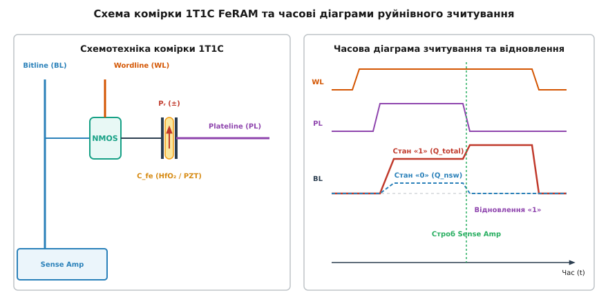
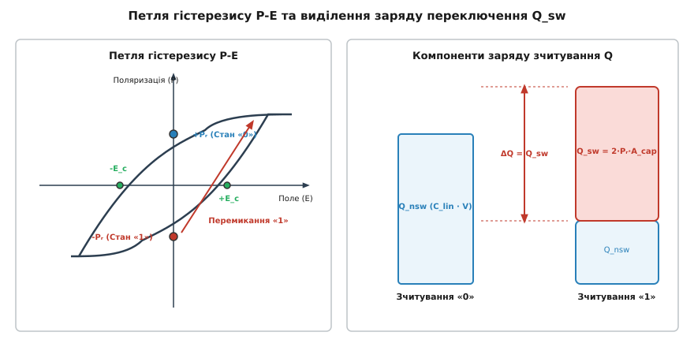
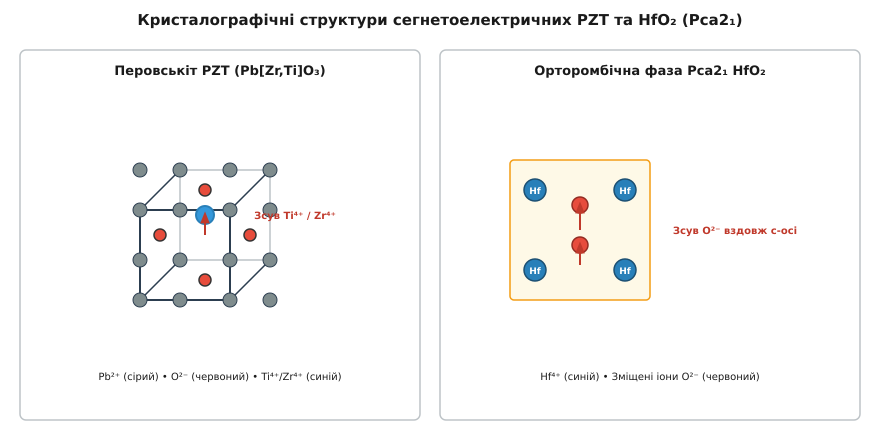
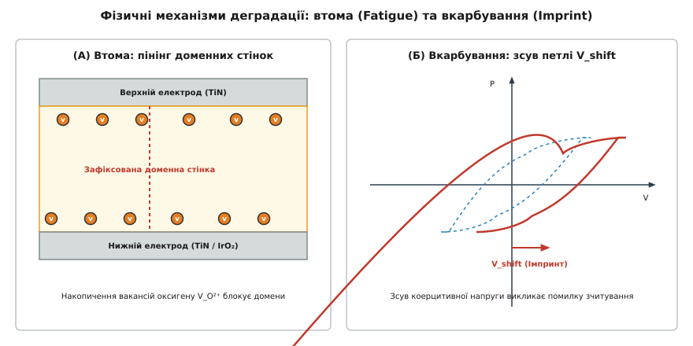

# Фізика FeRAM комірки (1T1C FeRAM)

<preknowlist>
- [Сегнетоелектрики](book:physics/electromagnetism/ferroelectrics) — спонтанна поляризація, петля гістерезису, коерцитивне поле та точка Кюрі.
- [Електрична поляризація](book:physics/electromagnetism/electric-polarization) — вектор поляризації, зв'язані заряди та вектор електричного зміщення.
- [Масштабування конденсатора DRAM](book:physics/condensed-matter-physics/dram-capacitor-scaling) — архітектура комірки 1T1C, розподіл заряду на шині Bitline та зважена ємність.
</preknowlist>

Сучасна обчислювальна техніка потребує оперативної пам'яті, яка поєднує наносекундну швидкодію DRAM та здатність зберігати інформацію без живлення, властиву Flash-накопичувачам. Енергонезалежна сегнетоелектрична оперативна пам'ять (FeRAM, від латинського `ferrum` — залізо та `electrum` — бурштин) розв'язує цю задачу шляхом використання спонтанної поляризації діелектрика. Схемотехнічно комірка FeRAM будується за класичною конфігурацією 1T1C (один вибірковий транзистор та один накопичувальний конденсатор), проте замість звичайного лінійного High-k діелектрика в конденсаторі використовується сегнетоелектричний матеріал.


*Конструкція комірки 1T1C FeRAM: керування словесною шиною WL, пластинною шиною PL та розрядною шиною BL при руйнівному зчитуванні.*

---

### 1. Принцип збереження інформації та заряд переключення Q_sw

У комірці FeRAM двоічна інформація («0» та «1») кодується напрямком вектора спонтанної залишкової поляризації `Pᵣ` (від англійського `remnant polarization`) в об'ємі сегнетоелектричного діелектрика:

- **Логічний нуль («0»):** залишкова поляризація `+Pᵣ` напрямлена вздовж електричного поля зчитування;
- **Логічна одиниця («1»):** залишкова поляризація `-Pᵣ` напрямлена протилежно до поля зчитування.

Оскільки орієнтація диполів зберігається в кристалічній ґратці без зовнішнього напруги, комірка є енергонезалежною і утримує стан протягом понад 10 років.


*Петля гістерезису P-E: відгук перемикання залишкової поляризації для станів «1» (-Pᵣ) та «0» (+Pᵣ) із виділенням корисного заряду Q_sw.*

При прикладанні зчитувального імпульсу напруги `V_read` до пластинної шини PL створюється електричне поле `E = V_read / d`, яке перевищує коерцитивне поле `E_c` кристала. Струм у зовнішньому колі формується з двох фізичних складових:

1. **Лінійний діелектричний заряд `Q_nsw`:** виникає внаслідок високочастотного зсуву електронних хмар та іонів без розвороту сегнетоелектричних доменів. Він дорівнює `Q_nsw = C_lin · V_read`.
2. **Перемикальний заряд `Q_sw`:** виникає тільки при зчитуванні стану «1», коли зовнішнє поле примусово долає бар'єр і перевертає вектора поляризації від `-Pᵣ` до `+P_sat`.

Сумарний виділений заряд для станів «0» та «1» становить:

```
Q_read(0) = Q_nsw = C_lin · V_read
Q_read(1) = Q_total = 2 · Pᵣ · A_cap + C_lin · V_read
```

Корисний **чистий заряд переключення** `Q_sw`, який використовується для формуванні напругового сигналу на розрядній шині, дорівнює різниці двох відповідей:

```
Q_sw = Q_read(1) - Q_read(0) = 2 · Pᵣ · A_cap
```

При підключенні конденсатора до розрядної шині Bitline з паразитною ємністю `C_bitline` заряд перерозподіляється, створюючи напруговий зсув `ΔV_sense = (2 · Pᵣ · A_cap) / (C_cell + C_bitline)`. Для надійного розпізнавання стан підсилювачем зчитування величина `ΔV_sense` повинна перевищувати рівень шумів і становити не менше `150–200 мВ`.

---

### 2. Фізика руйнівного зчитування та автоматичний зворотний запис

Зчитування інформації в FeRAM є **фізично руйнівним** (*destructive readout*). Коли під час зчитування на шину PL подається додатний імпульс `V_DD`, поле повертає всі домени осередку в напрямок `+Pᵣ`. Якщо в комірці вихідно зберігався нуль («0»), її стан не змінюється. Проте якщо в комірці зберігалася одиниця («1»), вона примусово перезаписується в нуль («0»).

Щоб зберегти дані, кожен цикл зчитування FeRAM автоматично супроводжується регенераційною фазою зворотного запису (*write-back phase*):

1. Диференціальний підсилювач зчитування порівнює потенціал шини `V_BL` з опорним рівнем `V_ref = [V_BL(0) + V_BL(1)] / 2`.
2. Якщо розпізнано логічний нуль («0»), шина BL заземлюється (`0 В`), і стан `+Pᵣ` залишається незмінним.
3. Якщо розпізнано логічну одиницю («1»), підсилювач защіпає на шині BL напругу `V_DD`, тоді як шина PL скидається в `0 В`. На діелектрику виникає інверсне поле `E = -V_DD / d < -E_c`, яке примусово повертає поляризацію назад у стан `-Pᵣ`.

Детальний математичний опис кінетики нуклеації доменів та їх бічного розростання викладено у вставці [Математична модель кінетики перемикання KAI](book:physics/condensed-matter-physics/fe-ram-cell-physics/math-kai-switching-kinetics.md), а програмну симуляцію імпульсу струму — у вставці [Чисельна симуляція струму перемикання FeRAM](book:physics/condensed-matter-physics/fe-ram-cell-physics/proj-kai-switching-sim.md).

---

### 3. Еволюція матеріалів: Від PZT до орторомбічного HfO₂

Матеріалознавство FeRAM пройшло два ключові етапи розвитку:

- **Титанат-цирконат свинцю `Pb[ZrₓTi₁₋ₓ]O₃` (PZT):** Класичний сегнетоелектрик зі структурою перовськіту `ABO₃`. Поляризація в ньому створюється центральносиметричним зсувом катіона `Ti⁴⁺/Zr⁴⁺` відносно оксидного октаедра. PZT має високу залишкову поляризацію (`Pᵣ = 20–40 мкКл/см²`), але при товщинах менше `50 нм` втрачає сегнетоелектричні властивості через утворення «мертвого шару» та деполяризаційне поле `E_depol`. Це зупинило масштабування PZT-FeRAM на вузлі **130 нм**.
- **Оксид гафнію `HfO₂` (HZO):** У 2011 році відкрито сегнетоелектрику у тонких (`4–10 нм`) плівках `HfO₂`, легованого цирконієм. Під дією термічного відпалу під механічним напруженням електрода TiN у плівці стабілізується метастабільна **орторомбічна фаза Pca2₁** (від грецького `orthos` — прямий та `rhombos` — ромб). Поляризація виникає внаслідок зсуву аніонів оксигену `O²⁻` вздовж полярної осі `c`.


*Зсув катіонів у перовськіті PZT та зміщення аніонів оксигену вздовж полярної осі c в орторомбічній фазі Pca2_1 HfO₂.*

`HfO₂` володіє широкою заборонено зоною (`E_g ≈ 5.3 еВ`), повністю сумісний із технологією кремнієвих CMOS-транзисторів і легко наноситься конформними шарами методами ALD, що відкрило шлях до створення 3D-FeRAM. Докладний історичний опис шляху від сегнетової солі до сучасних HZO чипів наведено у вставці [Історія розвитку сегнетоелектричної пам'яті](book:physics/condensed-matter-physics/fe-ram-cell-physics/hist-ferroelectric-ram.md).

---

### 4. Основні механізми деградації


*Мікроскопічні механізми деградації: (А) Накопичення вакансій оксигену V_O та пінінг доменних стінок при втомі; (Б) Зсув петлі V_shift внаслідок імпринту.*

Тривала експлуатація конденсатора FeRAM супроводжується мікроскопічними деградаційними процесами:

1. **Втома (Fatigue):** Поступове зменшення залишкової поляризації `2Pᵣ` при багаторазовому біполярному циклуванні (`10¹⁰–10¹⁵` циклів). Викликана дрейфом і накопиченням вакансій оксигену `V_O` біля електродів, які створюють потенціальні ями та блокують (пінінгують) рух доменних стінок.
2. **Вкарбування (Imprint):** Накопичення внутрішнього електричного поля `E_imp` при тривалому зберіганні одного логічного стану при підвищеній температурі. Це поле зсуває петлю гістерезису вздовж осі напруги на `V_shift`, що піднімає коерцитивну напругу `V_c+` і може призвести до помилки зчитування.
3. **Релаксація утримання (Retention):** Повільне спонтанне розгалуження доменів під дією неукомплектованого деполяризаційного поля `E_depol`, що вимагає ретельного добору електродних матеріалів.

Повний довідник кількісних параметрів, таймінгів та випробувальних стандартів зведено у вставці [Довідник фізичних та інженерних параметрів FeRAM](book:physics/condensed-matter-physics/fe-ram-cell-physics/api-ferram-parameters-ref.md).
