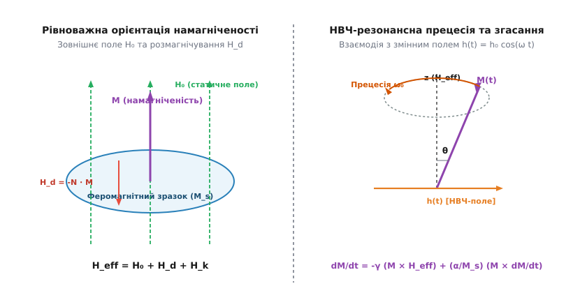
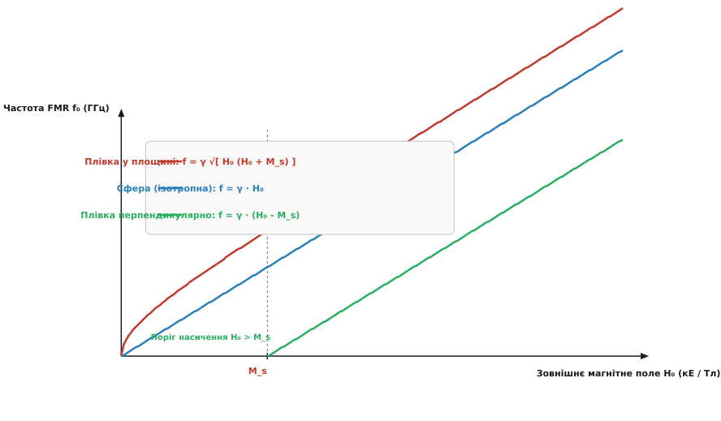
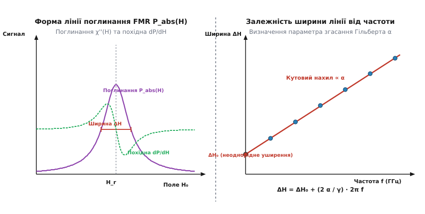

# Феромагнітний резонанс

<preknowlist>
- [Феромагнетизм](topic:physics/ferromagnetism) — спонтанне магнітне впорядкування електронних спінів під дією обмінної взаємодії.
- [Спінові хвилі та магнони](topic:physics/spin-wave) — колективні коливання магнонів у феромагнетиках та їхній дисперсійний спектр.
- [Циклотронний резонанс](topic:physics/cyclotron-resonance) — резонансне поглинання електромагнітного поля під час ґірації заряджених частинок.
- [Гіроскопічна прецесія](topic:physics/gyroscopic-precession) — прецесійний рух моменту імпульсу під дією зовнішнього моменту сил.
</preknowlist>

Помістивши тонку плівку пермалою (`Fe₂₀Ni₈₀`) товщиною `50 нм` у постійне магнітне поле `H₀ = 0.3 Тл` та опромінивши її слабким електромагнітним полем надвисокої частоти (НВЧ), ми спостерігаємо вражаюче явище: на частоті близько `9.5 ГГц` (X-діапазон радіорадарів) зразок раптово починає інтенсивно поглинати до 90% падаючої НВЧ-потужності. При цьому жоден окремий електрон у кристалічній ґратці не змінює свого орбітального стану і не іонізується. Замість поодиноких електронних переходів колосальний ансамбль із `~10²²` квантово-механічно зв'язаних електронних спінів реагує на зовнішнє збудження як єдиний макроскопічний класичний вектор намагніченості `M`. Вектор `M` відхиляється від напрямку статичного поля та починає синфазно прецесувати з частотою НВЧ-хвилі. Це явище має назву **феромагнітний резонанс** (лат. *resonare* — відгукуватися, лунати; далі — FMR).

У фізиці конденсованого стану феромагнітний резонанс посідає фундаментальне місце. Він виступає головним спектроскопічним «мікроскопом» для дослідження магнітної динаміки, дозволяючи з прецизійною точністю вимірювати ґіромагнітне співвідношення електрона, поля кристалографічної та формової анізотропії, а також коефіцієнт згасання Гільберта. Без розуміння FMR неможливо створити ні НВЧ-вентилі й циркулятори для радіолокації та космічного зв'язку, ні сучасні елементи енергонезалежної магнітної пам'яті (STT-MRAM), ні пристрої квантової магноніки.

---

### 1. Первинний механізм: прецесія макроскопічного вектора намагніченості

Щоб зрозуміти фізичну природу феромагнітного резонансу, зіставимо його з іншими резонансними явищами у магнетизмі. У парамагнітній речовині або вільному атомі незв'язані електронні спіни взаємодіють лише із зовнішнім полем `H₀`. У цьому випадку виникає електронний парамагнітний резонанс (ЕПР), де частота поглинання строго визначається квантовим розщепленням зееманівських рівнів `ħ ω = g μ_B H₀`. Внутрішні поля у парамагнетику зневажливо малі, оскільки середня намагніченість наближається до нуля завдяки тепловій дезорієнтації.

У феромагнетику ситуація фундаментально змінюється. Потужна квантова обмінна взаємодія Гейзенберга утримує трильйони сусідніх спінів паралельно один одному, формуючи макроскопічний вектор спонтанної намагніченості насичення `M_s`. Коли зовнішнє НВЧ-поле відхиляє цей макроскопічний вектор від напрямку рівноваги, обмінна взаємодія не дозволяє спінам розпастися на хаотичні поодинокі руху. Весь ансамбль спінів прецесує як жорстке класичне копьйо.

Зв'язок між вектором намагніченості `M` та макроскопічним моментом імпульсу одиниці об'єму `J` дається ґіромагнітним співвідношенням:

```
M = γ · J
```

де `γ = g · |e| / (2 m_e)` — ґіромагнітне співвідношення вільних електронів (`γ / (2π) ≈ 28.0 ГГц/Тл` при `g ≈ 2.0`). 

Згідно з класичною механікою гіроскопа, зміна моменту імпульсу `dJ/dt` дорівнює моменту зовнішніх сил `T = M × H_eff`. Помноживши це співвідношення на `γ`, отримуємо фундаментальне рівняння прецесійного руху намагніченості за відсутності дисипації:

```
dM / dt = -γ · (M × H_eff)
```

Векторний добуток `(M × H_eff)` означає, що вектор швидкості зміни намагніченості `dM/dt` у кожний момент часу перпендикулярний як до самого вектора `M`, так і до ефективного магнітного поля `H_eff`. У результаті вектор `M` рухається по поверхні конуса навколо напрямку `H_eff` зі сталою кутовою частотою прецесії, а його довжина залишається строго незмінною: `|M| = M_s`.

Ключовий момент полягає у тому, що ефективне магнітне поле `H_eff` у феромагнетику **не дорівнює** просто прикладеному зовнішньому полю `H₀`. Воно являє собою векторну суму чотирьох фундаментальних внесків:

```
H_eff = H₀ + H_d + H_k + H_ex
```

де `H_d` — розмагнічувальне поле форми зразка, `H_k` — ефективне поле кристалографічної магнітної анізотропії, а `H_ex` — поле обмінної взаємодії (яке стає критичним при збудженні спінових хвиль із ненульовим хвильовим вектором `k > 0`).

З мікроскопічної точки зору, феномен FMR відповідає збудженню однорідної спінової хвилі з хвильовим вектором `k = 0`. У цьому стані всі електронні спіни кристала відхиляються на однакові кути й рухаються в ідеальній фазі один з одним. Оскільки кут між сусідніми спінами дорівнює нулю, енергія обмінного зв'язку між сусідніми вузлами ґратки не змінюється під час прецесії. Саме тому частота FMR визначається не велетенським обмінним полем (`H_ex ~ 100–1000 Тл`), а значно слабшими полями: зовнішнім полем `H₀`, полем анізотропії `H_k` та полем розмагнічування `H_d`.

#### Квантово-механічне заморожування орбітального моменту
При аналізі `g`-фактора феромагнетиків (заліза, нікелю, кобальту) виникає важлива фізична деталь. Для вільного атома з орбітальним моментом `L` та спіновим моментом `S` фактор Ланде описується формулою `g = 1 + [J(J+1) + S(S+1) - L(L+1)] / [2J(J+1)]`. Однак у кристалічній ґратці металу сильне внутрішнє кристалічне поле повністю заморожує орбітальний момент електронів (`L ≈ 0`).

У результаті магнітний момент феромагнетика майже на 95–99% обумовлений виключно електронним спіном. Невелика залишкова орбітальна компонента через спін-орбітальну взаємодію спричиняє відхилення `g`-фактора від значення для вільного електрона `2.0023` до величин `g ≈ 2.08–2.15` для переходних металів 3d-групи. Точне вимірювання `g`-фактора методом FMR дає пряму інформацію про ступінь «заморожування» орбітального моменту у кристалі.

---

### 2. Рівняння Ландау — Ліфшиця — Гільберта та розмагнічувальні фактори

Якби прецесія намагніченості відбувалася без втрат енергії, будь-яке початкове збудження тривало б безкінечно довго. У реальному твердому тілі енергія прецесії неперервно розсіюється у термостат кристалічної ґратки (у фонони та електронні збудження).

Для опису дисипації Томас Гільберт у 1955 році вдосконалив феноменологічне рівняння Ландау — Ліфшиця (1935), ввівши в'язкий гальмівний момент сил, пропорційний швидкості зміни орієнтації намагніченості `dM/dt`. Підсумкове **рівняння Ландау — Ліфшиця — Гільберта (LLG)** має вигляд:

```
dM / dt = -γ · (M × H_eff)  +  (α / M_s) · [ M × (dM / dt) ]
```

де `α` — безрозмірний параметр згасання Гільберта. 

Перший член у правій частині рівняння LLG описує консервативну прецесію вектора `M` навколо напрямку ефективного поля `H_eff`. Другий член (дисипативний момент Гільберта) спрямований перпендикулярно до вектора `M` та вектора прецесійної швидкості `dM/dt`. Він діє як в'язке тертя, закручуючи траєкторію вектора `M` у спіраль і примушуючи його повертатися до рівноважного напрямку `H_eff`.


*Схема орієнтації макроскопічного вектора намагніченості M у статичному полях H₀ та розмагнічування H_d (ліворуч) та конус резонансної прецесії M(t) під дією змінного НВЧ-поля h(t) у площині xy (праворуч).*

#### Поле розмагнічування (поле форми)
Особлива роль у феромагнітному резонансі належить розмагнічувальному полю `H_d`. Поляризований феромагнетик створює на своїх зовнішніх поверхнях макроскопічні магнітні заряди `σ_m = M · n`. Ці заряди ґенерують всередині зразка поле `H_d`, спрямоване проти намагніченості:

```
H_d = -N · M
```

де `N` — тензор розмагнічувальних факторів. Для еліпсоїда обертання тензор `N` є діагональним у головних осях `(N_x, N_y, N_z)`, причому його слід задовольняє умову нормування `N_x + N_y + N_z = 1` (у системі СІ) або `N_x + N_y + N_z = 4π` (у системі СГС).

Коли змінне НВЧ-поле відхиляє вектор `M` від напрямку статичного поля `z`, з'являються поперечні компоненти намагніченості `m_x` та `m_y`. Якщо зразок має несиметричну форму (наприклад, тонка плівка), поверхові заряди на різних гранях виникають неоднаково. Розмагнічувальні поля `H_dx = -N_x m_x` та `H_dy = -N_y m_y` створюють додаткові моменти сил, які деформують колову прецесійну траєкторію `M` в еліптичну.

Еліптичність прецесії означає, що під час обертання модуль поперечного вектора змінюється, викликаючи періодичні стиснення та розтягнення конуса прецесії. Саме ця еліптичність призводить до того, що відновлювальна сила збільшується, а резонансна частота стає значно вищою за Ларморівську частоту вільного спіна.

Повне математичне виведення рівняння динаміки LLG, розклад за малими відхиленнями та тензорний опис сприйнятливості наведено у вставці [Математичне виведення рівняння Ландау-Ліфшиця-Гільберта та формули Кіттеля](topic:physics/ferromagnetic-resonance/math-llg-kittel-derivation.md).

---

### 3. Формула Кіттеля та геометрична спектроскопія

Глибока відмінність між коловою прецесією одиночного спіна та еліптичною прецесією суцільного феромагнетика була розкрита Чарльзом Кіттелем у 1947 році. Розв'язавши лінеаризовані рівняння руху для еліпсоїдального зразка, Кіттель вивів фундаментальне співвідношення для власної частоти феромагнітного резонансу:

```
ω₀ = γ · √[ ( H₀ + (N_x - N_z) · M_s ) · ( H₀ + (N_y - N_z) · M_s ) ]
```

Формула Кіттеля демонструє, що частота FMR визначається не лише величиною зовнішнього поля `H₀`, але й різницею розмагнічувальних факторів вздовж осей прецесії `(N_x - N_z)` та `(N_y - N_z)`. Форма зразка працює як ефективне магнітне поле анізотропії.


*Дисперсійні криві резонансної частоти f₀(H₀) для трьох канонічних геометрій: тонкої плівки з полем у площині (червона крива), ізотропної сфери (синя лінія) та тонкої плівки з перпендикулярним полем (зелена лінія).*

#### Канонічні геометричні конфігурації

Розглянемо три головні геометрії феромагнітних зразків, що зустрічаються в експериментах:

1. **Ізотропна сфера (`N_x = N_y = N_z = 1/3`):**
   Усі різниці розмагнічувальних факторів дорівнюють нулю `N_x - N_z = 0`. Формула Кіттеля спрощується до класичної Ларморівської частоти:
   ```
   ω₀ = γ · H₀
   ```
   Сферичний зразок (наприклад, полірована мікросфера із залізо-ітрієвого гранату YIG) є єдиною геометрією, де частота FMR не залежить від намагніченості насичення `M_s`.

2. **Тонка плівка з полем у площині (`N_x = 1`, `N_y = 0`, `N_z = 0`):**
   Нехай нормаль до плівки спрямована вздовж осі `x`, а статичне поле `H₀` прикладене у площині плівки вздовж осі `z`. Тоді `N_x - N_z = 1`, а `N_y - N_z = 0`. Формула Кіттеля набуває вигляду:
   ```
   ω₀ = γ · √[ H₀ · ( H₀ + M_s ) ]
   ```
   Поле розмагнічування нормальної компоненти `M_x` додає гігантський внесок `M_s` під знаком квадратного кореня. Саме неврахування цього геометричного внеску призвело у 1946 році до так званого «парадоксу Ґріффітса», коли експериментатори отримували завищені значення `g`-фактора `g ≈ 3`.

3. **Тонка плівка з перпендикулярним полем (`N_x = 0`, `N_y = 0`, `N_z = 1`):**
   Нехай статичне поле `H₀` прикладене строго перпендикулярно до площини плівки (вздовж нормалі `z`). Тоді `N_x - N_z = -1` та `N_y - N_z = -1`:
   ```
   ω₀ = γ · ( H₀ - M_s )    (при H₀ > M_s)
   ```
   У цій геометрії поле розмагнічування діє назустріч зовнішньому полю `H₀`. Резонанс може виникнути лише після того, як зовнішнє поле подолає поріг насичення плівки (`H₀ > M_s`).

#### Внесок кристалографічної та поверхневої анізотропії
У реальних кристалічних матеріалах до полів розмагнічування додаються ефективні поля магнітної анізотропії `H_k`. Наприклад, для монокристала з одноосьовою анізотропією з легшою віссю вздовж осі `z` ефективне поле анізотропії розраховується як друга похідна вільної енергії `E_an = K_u sin²(θ)`:

```
H_k = (2 · K_u) / M_s
```

У цьому випадку у формулі Кіттеля зовнішнє поле `H₀` просто замінюється на ефективну суму `H₀ + H_k`. Вимірюючи залежність частоти FMR від кута повороту кристала у магнітному полі (кутова FMR-спектроскопія), фізики отримують повну тривимірну карту тензора магнітної анізотропії з точністю до `0.1%`.

Крім того, у надтонких магнітних плівках (товщиною менше 2–3 нанометрів) на інтерфейсі з важким металом виникає інтерфейсна перпендикулярна магнітна анізотропія (PMA). Її внесок описується додатковим полем `H_s = 2 K_s / (M_s · t)`, де `t` — товщина плівки. FMR-спектроскопія дозволяє надійно розділити об'ємний та поверхневий внески до анізотропії шляхом зняття залежностей резонансного поля від товщини плівки `1/t`.

Драматичну історію розгадки парадоксу Ґріффітса та відкриття перших НВЧ-феритів висвітлено у вставці [Історія відкриття феромагнітного резонансу та теорія Кіттеля](topic:physics/ferromagnetic-resonance/hist-kittel-griffiths.md).

---

### 4. Ширина резонансної лінії, згасання Гільберта та мікроскопічні релаксаційні механізми

У той час як положення резонансного піку на осі магнітного поля `H_r` дає інформацію про `g`-фактор та анізотропію, **ширина резонансної лінії** `ΔH` описує швидкість втрати енергії та фазової когерентності магнітною системою.

Відгук феромагнетика на змінне НВЧ-поле описується комплексним тензором динамічної магнітної сприйнятливості `χ(ω) = χ'(ω) - i χ''(ω)`. Поглинута НВЧ-потужність пропорційна уявній частині сприйнятливості `P_abs(H) ∝ χ''(H)`.


*Ліворуч: Лоренцівський контур поглинання χ''(H) та його перша похідна dP/dH, що вимірюється у модуляційних резонаторних експериментах. Праворуч: лінійна залежність ширини лінії ΔH(f) від частоти, кутовий нахил якої визначає параметр згасання Гільберта α.*

#### Власний та неоднорідний внески до ширини лінії
Повна ширина лінії резонансу `ΔH` (виражена у вимірювальних одиницях магнітного поля, Ерстедах або Мілітеслах) складається з двох фундаментальних компонентів:

```
ΔH(f) = ΔH₀  +  ( 2 · α / γ ) · 2π f
```

1. **Власне згасання Гільберта (динамічний внесок `∝ f`):**
   Лінійно зростає з підвищенням частоти НВЧ-поля `f`. Кутовий нахил прямої `ΔH(f)` визначається безрозмірним параметром згасання Гільберта `α`. Цей внесок є незмінною характеристикою самого магнітного матеріалу.
2. **Неоднорідне розширення (`ΔH₀`):**
   Статичний внесок, який не залежить від частоти і являє собою перетин прямої з віссю ординат при `f = 0`. Він виникає через мікроскопічні неоднорідності зразка: флуктуації товщини плівки, дефекти кристалічної ґратки, границі зерен та флуктуації поля анізотропії по об'єму.

#### Мікроскопічні канали магнітної релаксації
Як саме енергія прецесуючого макроскопічного вектора `M` (який являє собою магнон із хвильовим вектором `k = 0`) переходить у тепло? Існують три головні мікроскопічні механізми:

* **Двомагнонне розсіювання (Two-Magnon Scattering):**
  Шорсткість поверхні чи дефекти кристала порушують трансляційну симетрію. У результаті однорідна прецесія (`k = 0`) розсіюється на дефектах з утворенням двох перпендикулярних спінових хвиль із ненульовими хвильовими векторами (`k ≠ 0`), але з тією ж самою частотою `ω₀`.
* **Спінове накачування (Spin Pumping):**
  У тонкоплівкових гетероструктурах «феромагнетик / важкий метал» (наприклад, `Permalloy / Pt`) прецесуюча намагніченість на інтерфейсі випромінює спіновий струм у шар платини. Цей спіновий струм розсіюється у платині завдяки сильному спін-орбітальному взаємодію, створюючи потужне додаткове згасання намагніченості у плівці.
* **Магнон-фононе та магнон-електронне розсіювання:**
  Спін-орбітальна взаємодія пов'язує прецесію спінів із решітковими коливаннями (фононами) та електронним морем металу, забезпечуючи кінцевий перехід магнітної енергії у Джоулеве тепло.

У монокристалах залізо-ітрієвого гранату (YIG) дисипативні втрати є рекордними для твердих тіл: параметр Гільберта сягає невидано малого значення `α ≈ 10⁻⁵`, а ширина лінії становить менше `0.5 Ерстеда`. Для порівняння, у провідних металевих плівках пермалою чи кобальту через електрон-магнонне розсіювання згасання виявляється у сотні разів вищим (`α ≈ 0.005–0.01`).

---

### 5. Антиферомагнітний резонанс (AFMR) проти феромагнітного

Для повноти картини важливо порівняти феромагнітний резонанс із резонансом в антиферомагнетиках. У антиферомагнетику макроскопічна спонтанна намагніченість дорівнює нулю (`M = 0`), оскільки дві еквівалентні магнітні підґратки `M_A` та `M_B` орієнтовані антипаралельно.

Однак між підґратками діє велетенське внутрішнє обмінне поле `H_E ~ 100–500 Тл`. Коли зовнішнє НВЧ-поле збуджує коливання підґраток, прецесія відбувається у комбінованому попіль «обмін + анізотропія». Частота антиферомагнітного резонансу (AFMR) описується формулою Кіттеля — Каппеля:

```
ω_AFMR = γ · √[ 2 · H_E · H_A  +  H_A² ]
```

Оскільки обмінне поле `H_E` сягає сотень Тесла, частота AFMR виявляється у сотні разів вищою за частоту FMR, потрапляючи у субтерагерцовий та терагерцовий діапазони (`100 ГГц — 2 ТГц`). Це робить антиферомагнетики перспективними для створення надшвидкісної терагерцової спінтроніки майбутнього.

---

### 6. Нелінійна магнітодинаміка та параметричний резонанс магнонів

При збільшенні рівня НВЧ-потужності кут прецесії намагніченості `θ` зростає, і лінеаризований опис FMR втрачає чинність. Виникає багатий спектр нелінійних явищ:

1. **Ефект параметричного розпадання (Suhl Instabilities):**
   При досягненні порогової амплітуди НВЧ-поля `h_c` однорідна прецесія `k = 0` вироджується, і її енергія параметрично перекачується у пари спінових хвиль з протилежними хвильовими векторами `k` та `-k` на половинній частоті `ω_k = ω₀ / 2`.
2. **Магнонний конденсат Бозе — Ейнштейна при кімнатній температурі:**
   У 2006 році вченими під керівництвом Сергія Демокрітова було виявлено, що інтенсивне іпульсне НВЧ-накачування YIG-плівок на частоті FMR призводить до накопичення надлишкового газу магнонів. Після термостабілізації магнони спонтанно конденсуються у найнижчому енергетичному стані на дні спіновохвильового спектра, формуючи магнонний конденсат Бозе — Ейнштейна за кімнатної температури.

---

### 7. Практичні застосування: від НВЧ-пристроїв до магноніки та спінтроніки

Явище феромагнітного резонансу є основою цілої індустрії НВЧ-електроніки та передових технологій спінтроніки.

#### 1. Невзаємні НВЧ-пристрої надвисоких частот
У прямокутних хвилеводах та коаксіальних лініях кругово-поляризована НВЧ-хвиля взаємодіє з намагніченим феромагнетиком асиметрично. Якщо напрямок обертання вектора НВЧ-електричного або магнітного поля збігається з напрямком прецесії намагніченості, хвиля інтенсивно поглинається. Якщо хвиля біжить у протилежному напрямку, напрямок обертання змінюється на протилежний, і хвиля проходить без перешкод.

На цьому ефекті невзаємності базуються:
* **НВЧ-вентилі (Isolators):** Пропускають радіосигнал від ґенератора до антени й повністю поглинають відбиту хвилю, захищаючи дорогі передавачі супутників та радарів.
* **Циркулятори (Circulators):** Триплечі пристрої, які спрямовують сигнал з антени до приймача, а від передавача — до антени, розділяючи приймальний та передавальний канали на одній частоті.
* **Перебудовувані YIG-фільтри:** Сфери з монокристалічного залізо-ітрієвого гранату (`Y₃Fe₅O₁₂`), розміщені у високодобротному резонаторі, слугують вузькосмуговими фільтрами. Змінюючи струм у зовнішньому електромагніті, що створює поле `H₀`, можна неперервно перебудовувати частоту пропускання фільтра від `1` до `40 ГГц`.

#### 2. Спінтроніка та ефект спінового накачування
У сучасній спінтроніці FMR використовується для генерації та детектування чисто спінових струмів без перенесення електричного заряду. При здійсненні резонансу у двошаровій структурі `Py/Pt` прецесія в плівці пермалою впорскує спіновий струм `j_s` у шар платини. 

Завдяки **оберненому спіновому ефекту Голла** (ISHE) у платині виникає поперечне розділення зарядів та ґенерується постійна електрична напруга `V_ISHE`. Це дозволяє прямим електричним методом вимірювати спінову інжекцію та ефективність спін-орбітальних взаємодій.

#### 3. Магноніка та спін-обертальний FMR (ST-FMR)
У магноніці FMR слугує джерелом когерентних спінових хвиль з короткими довжинами хвиль. Використовуючи мікроволоконні копланарні антенні структури, високоефективне FMR-збудження дозволяє запускати спінові хвилі у магнонні кристали та логічні магнонні вентилі, які виконують обчислення без виділення джоулевого тепла.

Крім того, у нанорозмірних магнітних тунельних переходах (MTJ) широко застосовується методика **Spin-Torque FMR (ST-FMR)**. Під час пропускання високочастотного струму через наноструктуру спін-поляризований струм передає свій спіновий момент намагніченості (Spin-Transfer Torque), збуджуючи FMR без застосування зовнішніх НВЧ-магнітних полів.

#### 4. Новітні двовимірні (2D) феромагнетики
З відкриттям атомно-тонких двовимірних магнетиків (таких як `CrI₃`, `Cr₂Ge₂Te₆` та `Fe₃GeTe₂`) у 2017 році FMR-спектроскопія виявилася єдиним інструментом, здатним виміряти магнітну анізотропію та згасання Гільберта в моношарах товщиною менше `1 нм`. Дослідження 2D-FMR показують, що в атомарних моношарах виникає рекордне посилення спін-орбітального розсіювання, а частота резонансу дуже чутлива до прикладеного електричного поля (електро-магнітний ефект).

> 🔧 **Навіщо це.**
> У розробці сучасних чіпів магніторезистивної оперативної пам'яті (STT-MRAM та SOT-MRAM) критично важливо мінімізувати струм перемикання магнітних осередків. Струм перемикання прямо пропорційний параметру згасання Гільберта `α`. Спектроскопія FMR єдиним швидким і неруйнівним методом дозволяє виміряти `α` на етапі напилення багатьохшарових вафлей, відбраковуючи структури з високими втратами ще до виготовлення нанорозмірних переходів.

Практичні алгоритми аналізу експериментальних даних FMR та чисельні програми фітування наведено у вставці [Моделювання спектрів FMR та обчислення параметра Гільберта](topic:physics/ferromagnetic-resonance/proj-fmr-spectrum-sim.md).

Повний систематизований довідник НВЧ-спектрометрії, характеристик вимірювальних систем VNA-FMR та табличні значення параметрів новітніх магнітних матеріалів наведено у вставці [Довідник НВЧ-спектрометрії FMR та методик вимірювання](topic:physics/ferromagnetic-resonance/api-fmr-spectrometer-ref.md).
