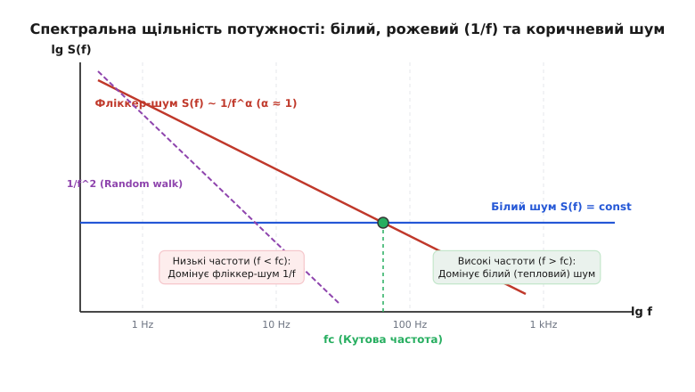
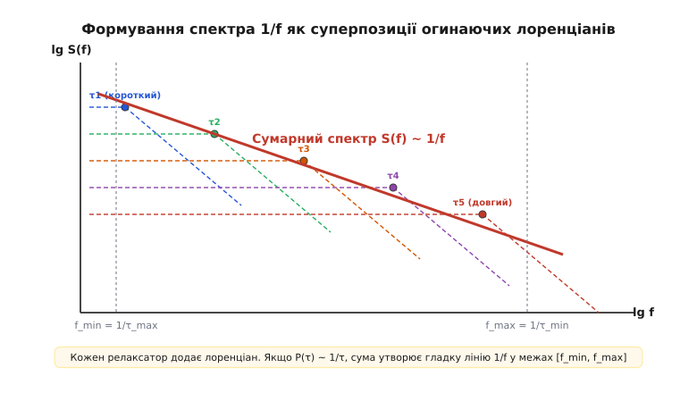
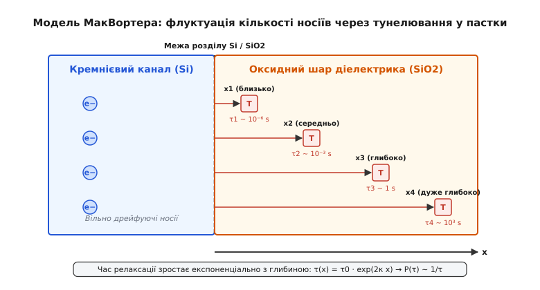
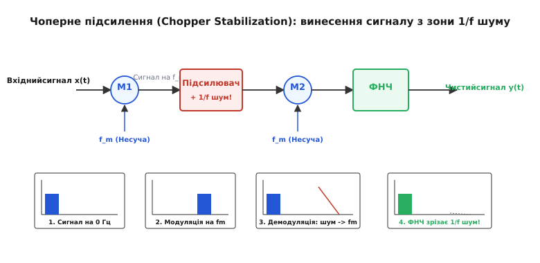

# Фліккер-шум і шум 1/f

<preknowlist>
- [Провідність](book:physics/conductivity) — перенесення заряду носіями та питомий опір середовища.
- [Дрейф електронів](book:physics/electron-drift) — хаотичний тепловий та спрямований дрейфовий рух носіїв під дією поля.
- [Дробовий шум](book:physics/shot-flicker-noise) — флуктуації струму через дискретність електричного заряду.
- [Зонна теорія твердого тіла](book:physics/band-theory) — енергетичні зони, локалізовані стани та пастки на межах розділу.
</preknowlist>

При спробі виміряти надмалі постійні напруги чи мікровольтні біопотенціали за допомогою чутливого напівпровідникового підсилювача розробник стикається з фізичним бар'єром: при зниженні частоти сигналу нижче кількох кілогерц рівень вимірювальних завад починає стрімко зростати, зводячи нанівець точність датчиків. Ці низькочастотні флуктуації струму та напруги, спектральна потужність яких зростає обернено пропорційно до частоти, утворюють фліккер-шум (шум `1/f`).

На відміну від білого теплового або дробового шуму, які мають однакову спектральну щільність потужності у всьому радіочастотному діапазоні, фліккер-шум концентрує свою енергію в інфранизькочастотній області. Це явище не є дефектом окремих невдалих компонентів — воно виникає в усіх провідниках, напівпровідникових системах, надпровідниках, оптичних середовищах і навіть у біологічних та геофізичних системах. Розуміння мікроскопічної природи шуму `1/f` дозволяє не лише створювати наднизькошумні електронні прилади, а й досліджувати фундаментальні процеси релаксації та дефектоутворення в конденсованому стані речовини.

## 1. Природа рожевого шуму та інфрачервона дивергенція

Спектральною щільністю потужності (СЩП) флуктуацій напруги `S_v(f)` або струму `S_I(f)` називають кількість середньоквадратичної шумової потужності, яка припадає на одиничну смугу частот в `1 Hz`. Для фліккер-шуму спектральна щільність потужності описується степеневим законом:

```
S(f) = C / f^α      [спектральна щільність потужності фліккер-шуму]
```

де `C` — масштабувальний коефіцієнт, а `α` — показник спектрального нахилу, значення якого для більшості фізичних об'єктів лежить у вузькому діапазоні `0.8 < α < 1.4` (у разі ідеального шуму `α = 1`). Через такий нахил спектра фліккер-шум у звукового діапазону часто називають рожевим шумом (pink noise): за аналогією зі світлом, де перевищення потужності на низьких оптичних частотах зсуває спектр до червоного та рожевого кольорів.


*Порівняння спектральної щільності потужності білого, фліккерного (1/f) та коричневого шумів у подвійному логарифмічному масштабі з позначенням кутової частоти fc.*

Головна риса шуму `1/f` полягає в тому, що на кожну декаду (або октаву) частотного діапазону припадає однакова сумарна шумова потужність. Інтеграл спектральної щільності в межах від частоти `f₁` до `f₂` дорівнює:

```
P_noise = ∫_{f₁}^{f₂} (C / f) df = C · [ ln(f₂) - ln(f₁) ] = C · ln(f₂ / f₁)      [потужність шуму в інтервалі частот]
```

Оскільки відношення `f₂ / f₁` для смуги від `1 Hz` до `10 Hz` дорівнює `10`, і для смуги від `100 kHz` до `1 MHz` воно також дорівнює `10`, шумова потужність у цих двох областях є абсолютно однаковою. Для порівняння, у білому шумі смуга від `100 kHz` до `1 MHz` містить у `100 000` разів більше потужності, ніж смуга від `1 Hz` до `10 Hz`.

Зі степеневого закону випливає фундаментальний парадокс, відомий у фізиці як **інфрачервона дивергенція** (infrared divergence). Якщо спрямувати нижню частоту спостереження до нуля (`f₁ → 0`), то інтеграл сумарної потужності шуму логарифмічно прямує до нескінченності:

```
lim_{f₁ → 0} ∫_{f₁}^{f_c} (C / f) df = C · lim_{f₁ → 0} [ ln(f_c) - ln(f₁) ] = ∞      [інфрачервона дивергенція]
```

Це означало б, що постійна складова струму в провіднику повинна мати нескінченно велику дисперсію флуктуацій, що фізично неможливо, адже енергія системи завжди обмежена. Розв'язання цього парадоксу полягає в тому, що будь-який реальний фізичний експеримент із вимірювання шуму обмежений тривалістю спостереження. Нижній частотний поріг вимірювання `f_min` завжди визначається повним часом спостереження `T_obs`:

```
f_min = 1 / T_obs      [нижня межа частоти вимірювання]
```

Для того щоб виміряти флуктуації на частоті `10⁻⁶ Hz`, спостереження має тривати понад 11 діб. Уточнені вимірювання, проведені протягом багатьох місяців і навіть років на кварцових резонаторах та напівпровідникових структурах, показують, що спектр `1/f` продовжує виконуватися без виходу на плато аж до частот `10⁻⁷…10⁻⁸ Hz`. Це свідчить про те, що фліккер-шум належить до математично нестаціонарних процесів із довготривалою часовою пам'яттю: флуктуації, які відбулися у зразку зараз, зберігають автокореляцію протягом тижнів та місяців.

Параметри флуктуаційних процесів описуються також за допомогою логарифмічного масштабу часу. Замість звичайного аналізу стаціонарних процесів через спектральну щільність, при наднизьких частотах використовують варіацію Аллана `σ_y²(τ_allan)`, яка характеризує нестабільність частоти або опору між суміжними інтервалами усереднення тривалістю `τ_allan`. Для фліккер-шуму варіація Аллана залишається строго константою незалежно від часу усереднення `τ_allan`, що є математичною ознакою фрактальної самоподібності часових рядів.

## 2. Суперпозиція лоренціанів і модель МакВортера

Фундаментальне питання фізики конденсованого стану полягало в тому, як із простих мікроскопічних подій, які зазвичай мають експоненціальний час згасання, виникає глобальний спектральний закон `1/f`.

Розглянемо елементарний релаксаційний процес: наприклад, поодинокий електрон, що тимчасово захоплюється пасткою на межі напівпровідника і через середній час `τ` повертається у зону провідності. Така подія створює у колі прямокутний імпульс струму (випадковий телеграфний сигнал, RTS). Автокореляційна функція такого сигналу є експонентою `R(t) = (ΔI)² · exp(-|t| / τ)`.

За теоремою Вінера — Хінчина, фур'є-перетворення експоненціальної автокореляції дає спектральну щільність потужності у формі кривої Лоренца (лоренціана):

```
S_rts(f) = 4 · (ΔI)² · τ / (1 + (2π · f · τ)²)      [спектр Лоренца поодинокої пастки]
```

Детальне розбиття математичного інтегрування наведено у вставці [Математичне виведення спектра 1/f](book:physics/flicker-noise/math-mcwhorter-derivation.md). На частотах `f << 1/(2π τ)` лоренціан є пласким, а при `f >> 1/(2π τ)` він спадає як `1/f²`.

Жоден поодинокий лоренціан не дає нахилу `1/f`. Однак у реальному твердому тілі існує величезна кількість різноманітних пасток та дефектів. Якщо систему утворює безперервна сукупність незалежних релаксаторів з функцією щільності розподілу часів `P(τ)`, сумарний спектр є інтегралом:

```
S_total(f) = ∫_{τ_min}^{τ_max} P(τ) · [ 4 · (ΔI)² · τ / (1 + (2π · f · τ)²) ] dτ      [інтеграл суперпозиції]
```

Якщо функція розподілу часів релаксації є логарифмічно-рівномірною, тобто щільність ймовірності обернено пропорційна самому часу `τ`:

```
P(τ) = C / τ      [логарифмічно-рівномірний розподіл часів]
```

де нормувальна константа `C = 1 / ln(τ_max / τ_min)`. Підстановка `P(τ) = C / τ` в інтеграл призводить до того, що час `τ` у чисельнику виразу скорочується з `τ` у знаменнику функції розподілу. Після інтегрування отримуємо:

```
S_total(f) = ( (ΔI)² / ln(τ_max / τ_min) ) · (1 / f)      [виведення закону 1/f]
```

у широкій смузі частот `1/(2π τ_max) << f << 1/(2π τ_min)`.


*Формування сумарного спектра 1/f як огинаючої безперервної сукупності лоренціанів із логарифмічно-рівномірним розподілом часів релаксації P(τ) ~ 1/τ.*

Фізичне обґрунтування того, чому функція `P(τ)` має саме вигляд `1/τ`, запропонував Алан МакВортер (Alan L. McWhorter) у 1957 році для МОН-структур (метал-оксид-напівпровідник). У польових транзисторах електрони провідного каналу відокремлені від електродів тонким шаром оксиду кремнію `SiO₂`. Всередині оксиду знаходяться квантові пастки.


*Модель МакВортера: захоплення та тунелювання електронів провідного каналу в пастки оксидного шару на різній глибині x з експоненціальним зростанням часу релаксації τ.*

Електрон із каналу може потрапити на пастку шляхом квантовомеханічного тунелювання через потенціальний бар'єр оксиду. Ймовірність тунелювання згасає експоненціально з відстанню `x` від межі розділу `Si/SiO₂`. Відповідно, час релаксації пастки `τ` зростає з глибиною `x` за експоненціальним законом:

```
τ(x) = τ₀ · exp(2 · κ · x)      [час тунелювання на глибину x]
```

де `κ` — коефіцієнт згасання хвильової функції електрона під бар'єром (`κ = √(2 m* (U₀ - E_k)) / ℏ ≈ 10⁸ cm⁻¹`), а `τ₀` — характерний час спроби (`~ 10⁻¹⁰ s`).

Якщо пастки просторово розподілені в оксиді рівномірно (`P(x) = N_t = const`), то взявши диференціал від виразу `x = (1 / 2κ) · ln(τ / τ₀)`, отримуємо:

```
dx = (1 / (2 · κ · τ)) dτ      [диференціальний зв'язок відстані та часу]
```

Звідси щільність ймовірності часів релаксації дорівнює `P(τ) = P(x) · |dx/dτ| = N_t / (2 κ τ) ~ 1/τ`. Модель МакВортера показала: зміна глибини залягання пастки всього на `2.5 nm` збільшує час релаксації `τ` на 10 порядків (від мікросекунд до днів), природним чином забезпечуючи виконання закону `1/f` у широченній смузі частот.

Розглянемо числовий розрахунок для кремнієвого МОН-транзистора. Нехай ефективна маса тунельного електрона в оксиді `m* = 0.4 m_e`, а висота потенціального бар'єра на межі `Si/SiO₂` становить `U₀ - E_k = 3.1 eV`. Підстановка чисел у формулу коефіцієнта згасання дає:

```
κ = √( 2 · 0.4 · 9.11·10⁻³¹ kg · 3.1 · 1.6·10⁻¹⁹ J ) / 1.055·10⁻³⁴ J·s
κ ≈ 5.7 · 10⁹ m⁻¹ = 0.57 Å⁻¹      [розрахований коефіцієнт згасання]
```

Тоді множник у показнику експоненти дорівнює `2 κ ≈ 1.14 Å⁻¹`. Це означає, що віддалення пастки від межі розділу лише на один ангстрем (`0.1 nm`) збільшує час релаксації `τ` у `exp(1.14) ≈ 3.1` раза! Віддалення пастки на `20 Å` (`2 nm`) збільшує час релаксації у `exp(22.8) ≈ 8 · 10⁹` разів — від `10⁻¹¹ s` до `0.08 s`. Таким чином, атомарний масштаб товщини оксиду створює велетенський частотний діапазон шуму `1/f`.

## 3. Емпіричний закон Хооге та флуктуації рухливості проти кількості носіїв

У той час як модель МакВортера пояснювала шум у польових транзисторах флуктуацією кількості вільних носіїв заряду (`δN`), у 1969 році голландський фізик Фредерік Хооге (Frederik N. Hooge) дослідив фліккер-шум у суцільних об'ємних напівпровідниках та металевих плівках, де немає оксидних меж розділу.

Хооге виявив універсальне емпіричне співвідношення для відносної спектральної щільності флуктуацій опору або струму:

```
S_I(f) / I² = S_R(f) / R² = α_H / (N · f)      [емпіричний закон Хооге]
```

де `N` — загальна кількість вільних носіїв заряду у об'ємі зразка, `I` — постійний струм через зразок, а `α_H` — безрозмірна константа Хооге. Для багатьох однорідних напівпровідникових та металевих матеріалів константа Хооге становить приблизно `α_H ≈ 2 · 10⁻³` (хоча в надчистих монокристалічних матеріалах вона може знижуватися до `10⁻⁶`).

Закон Хооге демонструє важливу фундаментальну властивість: відносний рівень шуму обернено пропорційний числу носіїв `N`. Якщо збільшити фізичні розміри провідника (довжину, ширину або товщину) при збереженні напруженості поля, кількість носіїв `N = n · V` (де `n` — концентрація, `V` — об'єм) зросте, і відносний рівень фліккер-шуму зменшиться.

Обчислимо абсолютне значення флуктуацій опору для вугільного та металоплівкового резисторів номіналом `R = 10 kΩ` при струмі `I = 1 mA`.
- **Вугільний резистор:** Гранульована структура створює низьку ефективну кількість носіїв `N ≈ 10¹⁰` у зонах контактів гранул. За законами Хооге при `α_H ≈ 10⁻²`:
  `S_R(1 Hz) = R² · α_H / N = (10⁴)² · 10⁻² / 10¹⁰ = 10⁻4 Ω² / Hz`.
  Середньоквадратична флуктуація напруги на частоті `1 Hz` у смузі `1 Hz` дорівнює `V_noise = I · √(S_R) = 10⁻³ A · 10⁻² Ω / √Hz = 10 μV / √Hz`.
- **Металоплівковий резистор:** Однорідний металевий шар містить величезну кількість електронів провідності `N ≈ 10¹⁶`. За законами Хооге при `α_H ≈ 10⁻⁴`:
  `S_R(1 Hz) = (10⁴)² · 10⁻⁴ / 10¹⁶ = 10⁻¹² Ω² / Hz`.
  Середньоквадратична флуктуація напруги на частоті `1 Hz` дорівнює `V_noise = 10⁻³ A · 10⁻⁶ Ω / √Hz = 1 nV / √Hz` (на 4 порядки менше!).

Хооге припустив, що джерелом шуму є не поверхневе захоплення носіїв, а об'ємні флуктуації рухливості електронів (`δμ`), які виникають через розсіювання на фононах ґратки:

```
δR / R = - δμ / μ      [флуктуація опору за рахунок рухливості]
```

Це викликало тривалу наукову дискусію між прибічниками поверхнево-чисельної моделі МакВортера (`δN`) та об'ємно-рухливісної моделі Хооге (`δμ`).

Сучасний синтез обох підходів втілився у когерентній моделі координованих флуктуацій числа та рухливості носіїв (Correlated Number and Mobility Fluctuation model — CNMF). Коли електрон із каналу захоплюється поверхневою пасткою, змінюється не лише кількість носіїв `N`. Захоплений електрон створює кулонівський заряд у шарі діелектрика. Цей заряд стає додатковим центром зарядженого розсіювання для електронів, що продовжують рухатися каналом, знижуючи їхню локальну рухливість `μ`. Завдяки цьому обидва механізми виступають двома сторонами одного фізичного процесу:

```
S_Vg(f) = (q² · k_B · T · N_t / (W · L · C_ox² · f)) · ( 1 + α_sc · μ₀ · C_ox · (V_g - V_th) )²      [СЩП у моделі CNMF]
```

де `N_t` — щільність пасток на одиницю енергії та площі, `α_sc` — коефіцієнт кулонівського розсіювання, `V_g` — напруга на затворі, а `V_th` — порогова напруга транзистора.

## 4. Термічно активовані процеси та модель Дутти — Хорна

У металевих провідниках, тонких плівках та аморфних сплавах тунелювання в оксид відсутнє, проте фліккер-шум залишається помітним. У 1979 році Індер Дутта та Пол Хорн запропонували модель, за якою джерелом флуктуацій є атомарні перескоки між двома стійкими конфігураціями дефектів кристалічної ґратки (двохатомні системи з двома станами, TLS).

Час релаксації атомарного дефекту визначається термодинамічною активацією Арреніуса:

```
τ = τ₀ · exp(E / (k_B · T))      [закон Арреніуса для дефекту]
```

де `E` — енергія активації перескоку, `k_B` — константа Больцмана, `T` — температура, а `τ₀` — характерний період атомарних коливань (`~ 10⁻¹³ s`).

Докладно історію наукових суперечок та експериментальних перевірок описано у вставці [Історія відкриття та дослідження 1/f шуму](book:physics/flicker-noise/hist-johnson-mcwhorter.md).

Якщо енергії активації дефектів `E` мають широку та гладку функцію розподілу `D(E)`, то інтегрування по всіх дефектах призводить до спектра, близького до `1/f`. Дутта і Хорн вивели універсальне співвідношення, яке пов'язує показник спектрального нахилу `α(T, f)` з температурним коефіцієнтом СЩП шуму:

```
α(T, f) = 1 - (1 / ln(1 / (2π · f · τ₀))) · ( (∂ ln S(T, f) / ∂ ln T) - 1 )      [рівняння Дутти — Хорна]
```

Це рівняння дозволяє експериментаторам визначати енергетичний спектр атомних дефектів `D(E)` у матеріалі шляхом вимірювання температурного коефіцієнта фліккер-шуму без руйнування зразка.

Розглянемо практичний приклад застосування рівняння Дутти — Хорна. Нехай при дослідженні тонкої алюмінієвої плівки на частоті `f = 10 Hz` виміряно температурну залежність шуму `S(T)`. У діапазоні температур від `100 K` до `300 K` виявлено пік шуму при `T = 200 K`, де шум зростає пропорційно `T³` (`∂ ln S / ∂ ln T = 3`). Приймемо `τ₀ = 10⁻¹³ s`.
Обчислимо логарифмічний множник:

```
ln(1 / (2π · f · τ₀)) = ln(1 / (2π · 10 · 10⁻¹³)) = ln(1.59 · 10¹¹) ≈ 25.8      [логарифмічний знаменник]
```

Підставляючи похідну `∂ ln S / ∂ ln T = 3` у рівняння Дутти — Хорна, маємо:

```
α(200 K) = 1 - (1 / 25.8) · (3 - 1) = 1 - 2 / 25.8 ≈ 0.922      [розрахований спектральний нахил]
```

Цей розрахунок показує, що при наявності локального піку дефектоутворення спектральний нахил `α` зсувається від одиниці до `0.92`. Вимірюючи `α(T)` в широкому інтервалі температур, фізики відновлюють точну форму функції розподілу енергій активації дефектів `D(E)`.

## 5. Фліккер-шум у сучасній мікроелектроніці та методи пригнічення

У реальних електронних компонентах фліккер-шум додається до білого теплового та дробового шуму. Гранична частота, на якій спектральна щільність фліккер-шуму стає рівною спектральній щільності білого шуму, називається **кутовою частотою шуму** (noise corner frequency, `f_c`).

```
S_total(f) = S_white · ( 1 + f_c / f )      [сумарна спектральна щільність шуму]
```

Значення кутової частоти `f_c` суттєво різниться залежно від технології виготовлення приладу:
- **Біполярні транзистори (BJT):** `f_c ≈ 10 Hz…1 kHz`. Оскільки струм протікає в об'ємі p-n переходів подалі від поверхні, рівень фліккер-шуму у біполярних транзисторах є найнижчим серед напівпровідникових приладів.
- **Польові транзистори з керуючим p-n переходом (JFET):** `f_c ≈ 10 Hz…100 Hz`. Канал заглиблений у товщу напівпровідника, що забезпечує низький рівень фліккер-шуму.
- **МОН-транзистори (MOSFET):** `f_c ≈ 10 kHz…10 MHz` (а у нанонометрових техпроцесах — до `100 MHz`). Струм протікає в інверсійному каналі безпосередньо вздовж межі розділу `Si/SiO₂`, піддаючись сильній дії пасток МакВортера.
- **Резистори:** Вугільні (карбонові) резистори мають величезний фліккер-шум через контактний опір між гранулами вуглецю (`f_c > 100 kHz`). Металоплівкові та дротяні резистори мають практично нульовий фліккер-шум.

В аналогових та радіочастотних схемах фліккер-шум є головним обмежувальним фактором. У високочастотних генераторах (LC-генераторах, гетеродинах) нелінійні елементи транзистора переносять низькочастотний фліккер-шум `1/f` на несучу частоту `f₀`, перетворюючи його на фазовий шум з залежністю `1/f³` поблизу несучої (модель Лісона).

Для боротьби з фліккер-шумом в аналоговій мікроелектроніці використовують три основні методи:

1. **Збільшення геометричних розмірів транзистора (`W · L`):**
   Згідно з моделлю МакВортера та законами Хооге, спектральна щільність фліккер-шуму в МОН-транзисторі обернено пропорційна площі затвора:
   ```
   S_Vg(f) = K_F / (C_ox · W · L · f)      [фліккер-шум затвора МОН-транзистора]
   ```
   де `K_F` — технологічний коефіцієнт шуму, `C_ox` — питома ємність оксиду, `W` — ширина, `L` — довжина каналу. Проектувальники аналогових підсилювачів свідомо роблять вхідні транзистори дуже великими за площею (наприклад, `W = 1000 μm`, `L = 10 μm`).

2. **Чоперне підсилення (Chopper Stabilization):**
   Вхідний низькочастотний сигнал `x(t)` модулюється вимикачами на високу несучу частоту `f_m > f_c`. Підсилювач підсилює вихідний сигнал на високій частоті, де фліккер-шуму немає (є лише білий шум). Після підсилення другий модулятор демодулює сигнал назад у постійний струм, а 1/f шум самого підсилювача переноситься на високу частоту `f_m`, де легко зрізається фільтром низьких частот (ФНЧ).


*Схема та спектральні діаграми чоперного підсилювача: сигнал модулюється на частоту fm, підсилюється без 1/f шуму, демодулюється назад, а шум підсилювача зрізається ФНЧ.*

3. **Періодичне автовстановлення нуля (Auto-zeroing) та корельована подвійна вибірка (CDS):**
   У сенсорах зображення (CMOS-матрицях) та інтеграторах вимірювальних систем перед кожним тактом вимірювання замикають вхід і запам'ятовують поточну напругу фліккер-шуму на конденсаторі, після чого віднімають її від корисного сигналу.

## 6. Експериментальні методи вимірювання фліккер-шуму

Вимірювання фліккер-шуму в електронних матеріалах і компонентах вимагає спеціальних запобіжних заходів, оскільки вимірювальна апаратура та контактні з'єднання самі здатні генерувати шум `1/f`, перевищуючи шум самого зразка.

Для усунення впливу контактних опорів застосовують чотиризондовий метод вимірювання. Постійний струм `I` подається через два зовнішні силові контакти, а вимірювання флуктуацій напруги `δV(t)` здійснюється через два внутрішні потенціальні контакти за допомогою підсилювача з високим вхідним імпедансом, де струм практично дорівнює нулю (`I_sense ≈ 0`).

Для виділення фліккер-шуму досліджуваного зразка із власного шуму підсилювачів застосовують метод взаємної кореляції (крос-кореляційний метод). Сигнал із потенціальних контактів зразка розгалужується на два незалежні паралельні канали підсилення з власними підсилювачами `A1` та `A2`:

```
V_ch1(t) = V_sample(t) + V_amp1(t)                              [сигнал у першому каналі]
V_ch2(t) = V_sample(t) + V_amp2(t)                              [сигнал у другому каналі]
```

Оскільки власні шуми підсилювачів `V_amp1(t)` та `V_amp2(t)` є статистично незалежними, їхній крос-спектр при усередненні `N_avg` реалізацій прямує до нуля:

```
S_ch1,ch2(f) = S_sample(f) + S_amp1,amp2(f) / √(N_avg)           [крос-спектр подвійного каналу]
```

При `N_avg = 10 000` усереднень власний шум підсилювача подавляється на `100` разів (на `20 dB`), що дозволяє надійно вимірювати фліккер-шум зразка, амплітуда якого у десятки разів нижче порогу шуму вимірювального приладу.

Спектральний аналіз цифрових часових рядів напруги `V(t)` здійснюється за допомогою швидкого перетворення Фур'є (FFT). Оскільки фліккер-шум концентрує велику енергію на найнижчих частотах, використання класичного прямокутного вікна призводить до спектрального протікання (spectral leakage) потужності з низьких частот у високочастотні біни. Щоб запобігти викривленню спектрального нахилу `α`, вибірки обов'язково множать на віконні функції з високим пригніченням бічних пелюсток — вікна Блекмана — Гарріса або Ханна.

## 7. Фліккер-шум у надпровідних кубітах та SQUID

У надпровідній квантовій електроніці та квантових обчислювачах фліккер-шум є головним джерелом декогеренції квантових станів. У надпровідних квантових інтерферометрах (SQUID) та надпровідних кубітах (трансмонах, флуксоніях) флуктуації виникають із двох мікроскопічних джерел:

1. **Флуктуації критичного струму Джозефсонівських переходів `δI_c`:**
   Аморфний бар'єр тунельного переходу `Al/Al₂O₃/Al` містить атомні пастки. Захоплення електронів змінює висоту локального тунельного бар'єра, викликаючи флуктуації критичного струму `I_c` зі спектром `1/f`:
   ```
   S_Ic(f) / I_c² ≈ 10⁻¹² / f      [флуктуації критичного струму переходу]
   ```

2. **Флуктуації магнітного потоку `δΦ` від поверхневих спінів:**
   У надпровідних петлях кубіта на межі між надпровідником та підкладкою знаходяться незабережені поверхневі електронні спіни (радикали, адсорбовані молекули кисню). Переорієнтація цих спінів створює низькочастотні флуктуації магнітного потоку зі спектром `S_Φ(f) = A_Φ / f`, де типичне значення амплітуди шуму потоку становить `A_Φ ≈ (1…5) μΦ₀ / √Hz` на частоті `1 Hz` (де `Φ₀ = h / (2e)` — квант магнітного потоку).

Флуктуації магнітного потоку викликають випадковий дрейф частоти переходу кубіта `ω_q(t)`, що призводить до чистої фазової декогеренції (чистого розфазування — pure dephasing). Час фазової когерентності кубіта `T_2*` обернено пропорційний амплітуді фліккер-шуму:

```
1 / T_2* = √( A_Φ · | ∂ω_q / ∂Φ |² · ln(f_max / f_min) )          [час фазової когерентності кубіта]
```

Для подовження часу життя квантових станів сучасна квантова технологія застосовує пасивацію поверхонь надпровідників шляхом атомно-шарового осадження (ALD) та хімічного травлення, що зменшує щільність поверхневих спінів і знижує фліккер-шум у кілька разів.

## 8. Фліккер-шум у плазмі, астрофізиці та біофізиці

Масштабний діапазон шуму `1/f` охоплює не лише твердотільні мікроструктури, а й грандіозні космічні та плазмові об'єкти.

У фізиці плазми та керованого термоядерного синтезу в токамаках флуктуації щільності плазми `δn_e / n_e` та електричного потенціалу в пристінковому шарі підпорядковуються спектральному закону `1/f`. Це викликано нелінійними дрейфово-хвильовими турбулентностями та конвективними комірками, які переносять енергію між різними масштабами турбулентних вихорів.

В астрофізиці фліккер-шум виявлено у світлових кривих світності акреційних дисків навколо чорних дир та нейронних зір у подвійних рентгенівських системах (X-ray binaries), а також у флуктуаціях інтенсивності випромінювання сонячного вітру та сонячних спалахів. Акреційні диски показують варіювання яскравості зі спектром `1/f` протягом багатьох декад частот за рахунок в'язкісних турбулентних флуктуацій масового припливу речовини у диск на різних радіусах.

У біофізиці флуктуації часу відкриття та закриття поодиноких іонних каналів у мембранах живих клітин (натрієвих та калієвих каналів) демонструють спектри Лоренца, які при інтегруванні по ансамблю різнорідних каналів формують спектр `1/f`. Це забезпечує варіабельність серцевого ритму (Heart Rate Variability — HRV) та інтервалів між спайками нейронів у головному мозку, запобігаючи патологічній синхронізації та забезпечуючи гнучкість адаптації живих організмів.

## 9. Програмне моделювання та цифровий синтез 1/f шуму

При моделюванні фізичних систем та тестуванні вимірювальних алгоритмів часто постає завдання цифрової генерації послідовності випадкових чисел із заздалегідь заданим спектром `1/f`.

Окрім класичних методів, фліккер-шум описують математичним апаратом фрактального броунівського руху (fractional Brownian motion — fBm), розробленим Бенуа Мандельбротом (Benoit Mandelbrot). Дробовий гауссівський шум (fGn) характеризується параметром Хьорста `H ∈ (0, 1)`. Спектральний показник `α` пов'язаний із покажчиком Хьорста співвідношенням `α = 2 H + 1`. Для ідеального рожевого шуму `1/f` параметр Хьорста дорівнює `H = 0`, що відповідає межі персистентної довготривалої пам'яті.

На відміну від звичайного броунівського руху (`H = 0.5`), де прирости випадкової величини є незалежними, при `H → 0` випадковий процес демонструє сильну антиперсистентність на коротких масштабах та корельованість на довгих масштабах, утворюючи фрактально-самоподібну структуру часової траєкторії.

Найпопулярнішими є два числові алгоритми генерації:
1. **Алгоритм спектрального синтезу через зворотне швидке перетворення Фур'є (iFFT):**
   Генерують масив білого ґауссівського шуму у частотній області, множать кожну частотну гармоніку на фазовий множник `exp(j ϕ_k)` з випадковою фазою `ϕ_k ∈ [0, 2π)` та на амплітудний коефіцієнт `1 / √f_k`. Після цього застосовують зворотне перетворення iFFT для отримання дійсного часового ряду z(t) із спектром `1/f`.
2. **Алгоритм Восса — МакКартні (Voss-McCartney algorithm):**
   Сумують виходи `N_oct` незалежних генераторів білого шуму, кожен з яких оновлює своє значення із частотою, яка зменшується у два рази на кожну октаву (дискретне усереднення на інтервалах `2⁰, 2¹, 2², …, 2^N`). Вхідні генератори оновлюються за схемою лічильника двійкових розрядів, що створює швидкий наближений спектр `1/f` без складних обчислень Фур'є.

Наведемо експериментальну реалізацію спектрального синтезу 1/f шуму мовами Python та C++:

:::tabs
```py
import numpy as np

def generate_flicker_noise(num_samples: int, sample_rate: float) -> np.ndarray:
    """Генерація часового ряду фліккер-шуму 1/f методом зворотного FFT."""
    # Генерація випадкових фаз та білого шуму в частотній області
    freqs = np.fft.rfftfreq(num_samples, d=1.0 / sample_rate)
    freqs[0] = freqs[1]  # Попередження ділення на нуль для DC-компоненти
    
    # Амплітуда спадає як 1/sqrt(f), що дає потужність 1/f
    amplitude_weights = 1.0 / np.sqrt(freqs)
    amplitude_weights[0] = 0.0  # Усунення постійного зміщення
    
    phases = np.random.uniform(0, 2 * np.pi, len(freqs))
    complex_spectrum = amplitude_weights * np.exp(1j * phases)
    
    # Зворотне FFT для отримання часового ряду
    noise_time_series = np.fft.irfft(complex_spectrum, n=num_samples)
    return noise_time_series / np.std(noise_time_series)
```
```cpp
#include <vector>
#include <cmath>
#include <random>
#include <complex>
#include <span>

// Проста реалізація дискретного перетворення Фур'є для генерації 1/f шуму
std::vector<double> generate_flicker_noise(size_t num_samples) {
    std::vector<std::complex<double>> spectrum(num_samples / 2 + 1);
    std::mt19937 gen(1337);
    std::uniform_real_distribution<double> dist(0.0, 2.0 * M_PI);

    spectrum[0] = 0.0; // Нульове DC зміщення
    for (size_t k = 1; k < spectrum.size(); ++k) {
        double freq = static_cast<double>(k);
        double amp = 1.0 / std::sqrt(freq);
        double phase = dist(gen);
        spectrum[k] = std::polar(amp, phase);
    }

    // Зворотне ДПФ для розрахунку відліків у часовій області
    std::vector<double> noise(num_samples, 0.0);
    double N = static_cast<double>(num_samples);
    for (size_t n = 0; n < num_samples; ++n) {
        double sum = 0.0;
        for (size_t k = 1; k < spectrum.size(); ++k) {
            double angle = 2.0 * M_PI * k * n / N;
            sum += spectrum[k].real() * std::cos(angle) - spectrum[k].imag() * std::sin(angle);
        }
        noise[n] = sum;
    }
    return noise;
}
```
:::

> 🔧 **Навіщо це.**
> Знання фізики фліккер-шуму має критичне значення у багатьох галузях сучасної інженерії та фізичного експерименту:
> 
> - **Надточні вимірювання та метрологія:** У прецизійних операційних підсилювачах (наприклад, LTC2057 або AD8628) використання чоперної стабілізації дозволяє знизити кутову частоту `f_c` до частот нижче `0.01 Hz`, забезпечуючи рівень шуму підсилювача менше `100 nV` у смузі від `0.1 Hz` до `10 Hz`.
> - **Квантові обчислення:** У надпровідних кубітах (трансмонах) та SQUID-магнітометрах флуктуації магнітного потоку із спектром `1/f` від поверхневих спінових пасток є головним джерелом декогеренції. Вивчення спектра `1/f` дозволяє розробляти спеціальні пасиваційні покриття для подовження часу життя квантових станів.
> - **Медична електроніка:** При зніманні електрокардіограм (ЕКГ) та електроенцефалограм (ЕЕГ) корисний сигнал має частоти від `0.5 Hz` до `100 Hz`. Без пригнічення 1/f шуму вхідних каскадів дрейф ізолінії робить діагностику неможливою.
> - **Матриці цифрових камер:** У КМОН-сенсорах фліккер-шум піксельних транзисторів створює так званий «фіксований шум темряви» (readout noise). Застосування CDS на рівні кожного стовпчика матриці дозволяє отримувати чіткі знімки при високих ISO за умов слабкого освітлення.

## 10. Кутовий частотний поріг та системні межі

Підсумовуючи розгляд фліккер-шуму, зведемо співвідношення між основними типами флуктуацій у провідному середовищі. Повна спектральна щільність потужності шуму струму в провіднику з опором `R` при проходженні постійного струму `I` дорівнює сумі трьох незалежних компонентів:

```
S_I(f) = (4 · k_B · T / R) + (2 · q · I) + (α_H · I² / (N · f^α))      [повний спектр шуму провідника]
```

Перший член відповідає тепловому шуму Джонсона — Найквіста, що визначається випадковим тепловим рухом носіїв, другий — дробовому шуму Шотткі через дискретність заряду при проходженні потенціальних бар'єрів, а третій — фліккер-шуму Хооге — МакВортера.

Обчислимо граничний постійний струм `I_boundary`, при якому фліккер-шум на частоті `f = 100 Hz` зрівнюється з тепловим шумом для провідника з `R = 1 kΩ`, `T = 300 K`, `N = 10¹²` та `α_H = 2 · 10⁻³`.
Прирівняємо перший та третій члени рівняння:

```
4 · k_B · T / R = α_H · I_boundary² / (N · f)                           [рівність теплового та фліккер-шуму]
```

Виразиємо граничний струм `I_boundary`:

```
I_boundary = √( (4 · k_B · T · N · f) / (α_H · R) )                       [формула граничного струму]
```

Підставимо числові значення: `k_B = 1.38·10⁻²³ J/K`, `T = 300 K`, `4 k_B T = 1.656·10⁻²⁰ J`:

```
I_boundary = √( (1.656·10⁻²⁰ · 10¹² · 100) / (2·10⁻³ · 1000) )
I_boundary = √( (1.656·10⁻⁶) / 2 ) = √( 8.28 · 10⁻⁷ ) ≈ 9.1 · 10⁻⁴ A = 0.91 mA  [розрахований граничний струм]
```

Цей розрахунок показує: при струмах через зразок понад `0.91 mA` на частоті `100 Hz` фліккер-шум починає повністю домінувати над тепловим шумом Джонсона — Найквіста.

При низьких струмах і високих частотах панує тепловий шум. При збільшенні постійного струму `I` на низьких частотах домінуючим стає фліккер-шум, пропорційний квадрату струму `I²`. Вимірювання зсуву кутової частоти `f_c` при зміні температури або механічних напружень слугує методологічною основою для безруйнівного контролю надійності інтегральних мікросхем на етапі їхнього виготовлення, а також в аерокосмічній промисловості для відбору радіаційно-стійкої електроніки. Вимірювання фліккер-шуму також виявляє ранні стадії електроміграції в надтонких металевих провідниках задовго до виникнення фізичних обривів.

Співвідношення між різними видами шуму в електронних середовищах узагальнено у наведеній нижче порівняльній таблиці:

| Тип шуму | Математична залежність СЩП `S(f)` | Фізичний мікроскопічний механізм | Залежність від постійного струму `I` | Температурна залежність |
| :--- | :--- | :--- | :--- | :--- |
| **Тепловий шум** (Джонсона — Найквіста) | `S(f) = 4 k_B T R` (білий) | Хаотичний тепловий рух носіїв заряду | Не залежить (`I = 0`) | Лінійна (`~ T`) |
| **Дробовий шум** (Шотткі) | `S(f) = 2 q I` (білий) | Дискретність заряду носіїв при проходженні бар'єра | Лінійна (`~ I`) | Практично не залежить |
| **Фліккер-шум** (рожевий `1/f`) | `S(f) = C / f^α` (`α ≈ 1`) | Захоплення у пастки (МакВортер) / флуктуації рухливості (Хооге) | Квадратична (`~ I²`) | Складна (за рівнянням Дутти — Хорна) |
| **Броунівський шум** (коричневий `1/f²`) | `S(f) = C / f²` | Інтегрування білого шуму / поодинока релаксаційна пастка | Залежить від схеми | Визначається кінетикою середовища |
